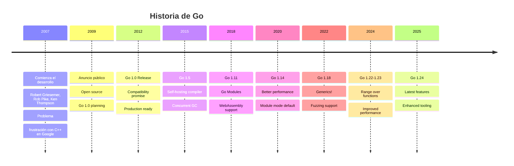
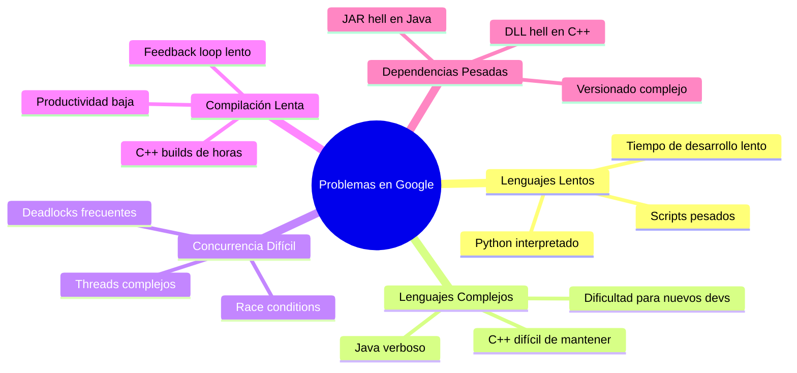
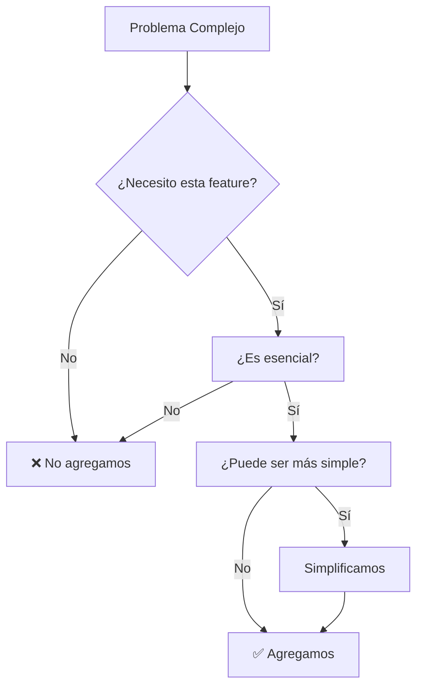
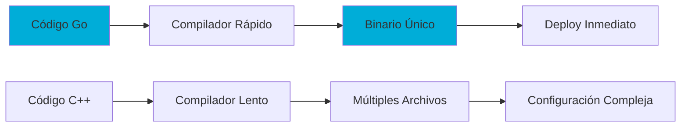
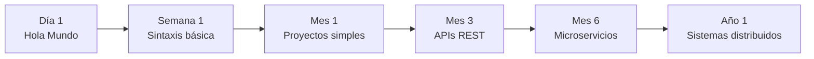
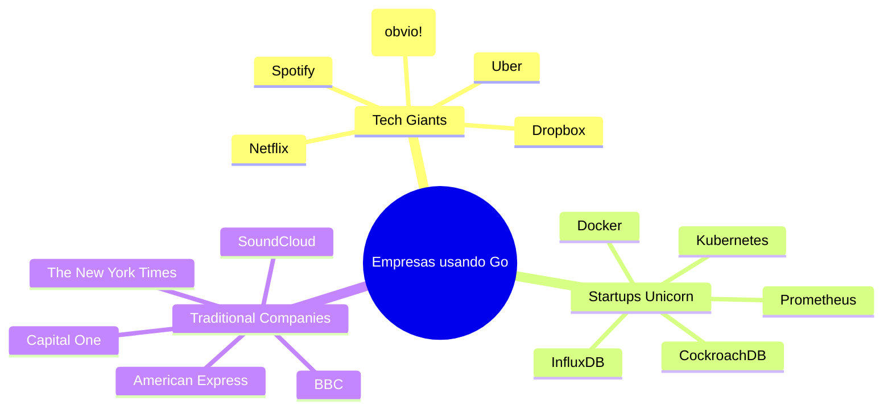
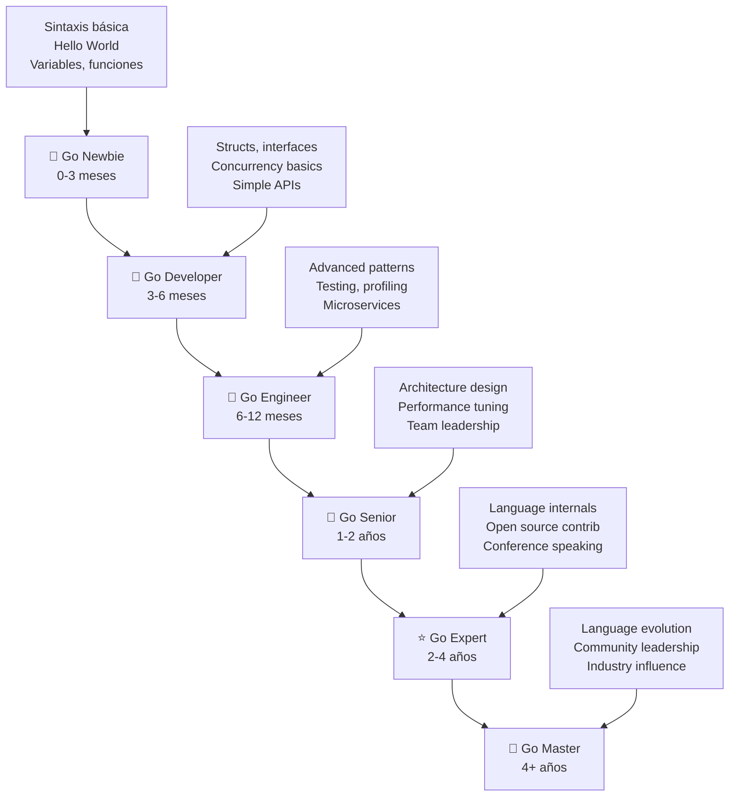
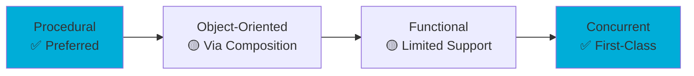
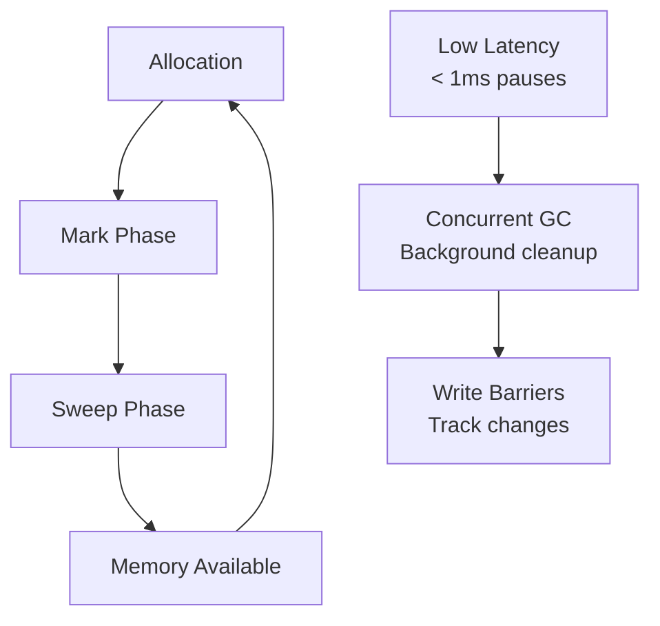
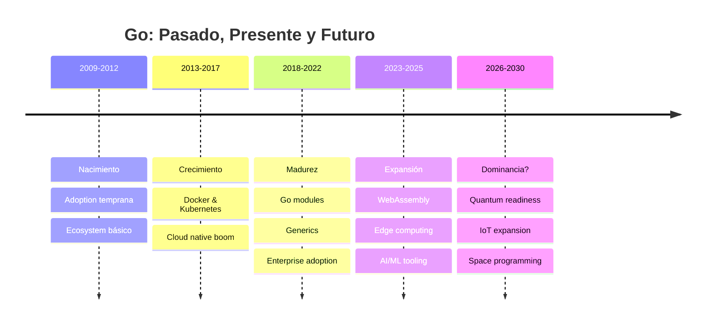

# 🚀 Introducción a Go: El Lenguaje del Futuro

> *"Go es un lenguaje de programación que hace fácil construir software simple, confiable y eficiente"* - Rob Pike

## 🎯 Objetivos de Esta Lección

Al finalizar esta lección serás capaz de:
- ✅ Entender **qué es Go** y por qué fue creado
- ✅ Conocer la **historia** y filosofía detrás del lenguaje
- ✅ Identificar **cuándo usar Go** vs otros lenguajes
- ✅ Comprender las **ventajas competitivas** de Go
- ✅ Visualizar tu **roadmap de carrera** con Go

---

## 🌟 ¿Qué es Go?

**Go** (también conocido como **Golang**) es un lenguaje de programación de código abierto desarrollado por Google en 2007 y lanzado públicamente en 2009. Es un lenguaje compilado, estáticamente tipado y diseñado para la era moderna de la computación.

### 🧠 Analogía: Go como el "Toyota Prius" de los lenguajes

Imagina que los lenguajes de programación fueran automóviles:

- **C/C++** sería un auto de Fórmula 1: extremadamente rápido pero difícil de manejar
- **Python** sería un auto familiar: cómodo y fácil de usar, pero no el más rápido
- **Java** sería un camión de carga: robusto para trabajos pesados, pero complejo
- **Go** sería un **Toyota Prius**: eficiente, confiable, fácil de manejar, y perfecto para el uso diario

```mermaid
quadrant
    title Comparación de Lenguajes
    x-axis Facilidad de Uso --> Complejo de Usar
    y-axis Lento --> Rápido
    
    Python: [0.8, 0.3]
    JavaScript: [0.7, 0.4]
    Java: [0.4, 0.6]
    C++: [0.2, 0.9]
    Go: [0.7, 0.8]
    Rust: [0.3, 0.9]
```

---

## 📜 Historia: El Nacimiento de Go

### 🕰️ Timeline Completo



### 🎭 Los Creadores: Los "Avengers" de los Lenguajes

#### 👨‍💻 **Robert Griesemer**
- **Background**: Compiladores y VM (V8, Java HotSpot)
- **Contribución**: Diseño del lenguaje y especificación
- **Fun fact**: También trabajó en el compilador de JavaScript V8

#### 👨‍🦲 **Rob Pike** 
- **Background**: Unix, Plan 9, UTF-8
- **Contribución**: Filosofía del lenguaje y concurrencia
- **Fun fact**: Co-creador de UTF-8 y creador del editor sam

#### 👴 **Ken Thompson**
- **Background**: Unix, C, Plan 9
- **Contribución**: Runtime y garbage collector
- **Fun fact**: Ganador del Premio Turing, co-creador de Unix

### 🎯 El Problema que Go Resuelve

En Google circa 2007, los desarrolladores enfrentaban:



### 💡 La Visión: "Less is More"

Go fue diseñado con una filosofía radical:

> **"La complejidad es multiplicativa"** - Rob Pike

**Ejemplo Práctico:**
```go
// En Go - Simple y claro
func Hello(name string) string {
    return "Hello, " + name
}

// En Java - Verboso pero familiar
public class Greeter {
    public static String hello(String name) {
        return "Hello, " + name;
    }
}

// En C++ - Poderoso pero complejo
#include <string>
class Greeter {
public:
    static std::string hello(const std::string& name) {
        return "Hello, " + name;
    }
};
```

---

## 🏗️ Filosofía de Go: Los Principios Fundamentales

### 1. **Simplicidad sobre Complejidad**



**Ejemplos de simplicidad en Go:**
- Solo **25 keywords** (vs 50+ en C++)
- Una sola forma de hacer loops (`for`)
- No hay inheritance, solo composition
- Manejo de errores explícito (no exceptions)

### 2. **Legibilidad como Primera Prioridad**

> *"El código se escribe una vez, pero se lee mil veces"*

```go
// ✅ Go prefiere esto (explícito)
if err != nil {
    return err
}

// ❌ Versus esto (implícito, estilo Java)
try {
    riskyOperation();
} catch (Exception e) {
    // manejo silencioso
}
```

### 3. **Concurrencia como Ciudadano de Primera Clase**

**Analogía**: Imagina la concurrencia como un restaurante:

- **Threads tradicionales** = Un chef haciendo todo secuencialmente
- **Go goroutines** = Múltiples chefs especializados trabajando en paralelo
- **Channels** = El sistema de órdenes que coordina a todos

```go
// Goroutines: ultra-ligeras (2KB vs 2MB threads)
go func() {
    fmt.Println("Esto corre concurrentemente!")
}()

// Channels: comunicación entre goroutines
ch := make(chan string)
go func() { ch <- "mensaje" }()
message := <-ch
```

### 4. **Compilación Rápida**

**Objetivo**: Compilar todo Google en <10 segundos



---

## 🎯 ¿Por Qué Elegir Go?

### 🚀 Ventajas Competitivas

#### 1. **Performance + Productividad**
```
Productividad del Developer:  Python > Go > Java > C++
Performance de Runtime:       C++ > Go > Java > Python
Punto Dulce:                  Go! 🎯
```

#### 2. **Curva de Aprendizaje Suave**


#### 3. **Ecosistema Robusto**
- **Standard Library** increíblemente completa
- **Package management** simple y eficaz
- **Tooling** de primera clase incluido
- **Community** activa y helpful

#### 4. **Concurrencia Natural**
```go
// Esto es todo lo que necesitas para concurrencia!
go doSomething()        // Lanza goroutine
ch := make(chan int)    // Crea channel
select {                // Multiplexing
case <-ch:
    // handle
}
```

### 📊 Go vs Otros Lenguajes: Comparación Detallada

| Aspecto | Go | Python | Java | C++ | JavaScript |
|---------|----|----|----|----|-----|
| **Learning Curve** | 🟢 Fácil | 🟢 Fácil | 🟡 Medio | 🔴 Difícil | 🟡 Medio |
| **Performance** | 🟢 Rápido | 🔴 Lento | 🟡 Medio | 🟢 Rápido | 🟡 Medio |
| **Concurrency** | 🟢 Nativo | 🔴 Limitado | 🟡 Threads | 🟡 Complejo | 🟡 Async |
| **Memory Safety** | 🟢 GC | 🟢 GC | 🟢 GC | 🔴 Manual | 🟢 GC |
| **Binary Size** | 🟡 Medio | 🔴 Grande | 🔴 Grande | 🟢 Pequeño | 🟡 Medio |
| **Compilation** | 🟢 Rápido | ➖ N/A | 🟡 Lento | 🔴 Muy Lento | 🟢 Rápido |
| **Deployment** | 🟢 Single Binary | 🔴 Dependencies | 🔴 Complex | 🔴 Complex | 🟡 Bundling |

### 🎯 Casos de Uso Ideales para Go

#### ✅ **Donde Go Brilla**

1. **🌐 Servicios Web y APIs**
   ```go
   // Servidor HTTP en 5 líneas!
   http.HandleFunc("/", func(w http.ResponseWriter, r *http.Request) {
       fmt.Fprintf(w, "¡Hola, %s!", r.URL.Path[1:])
   })
   http.ListenAndServe(":8080", nil)
   ```

2. **🔗 Microservicios**
   - Deploy simple (single binary)
   - Performance excelente
   - Concurrencia nativa

3. **🛠️ Herramientas CLI**
   - Compilación cross-platform
   - Standard library rica
   - Performance native

4. **☁️ Cloud Infrastructure**
   - Docker (escrito en Go)
   - Kubernetes (escrito en Go)
   - Terraform (escrito en Go)

5. **🚚 DevOps y Automation**
   - Scripts rápidos
   - Binarios portables
   - Excelente para CI/CD

#### ❌ **Donde Go No Es Ideal**

1. **🎮 Game Development**
   - No está optimizado para graphics
   - Ecosistema limitado para games

2. **🧠 Machine Learning/AI**
   - Python domina este espacio
   - Pocas librerías especializadas

3. **📱 Mobile Apps Nativas**
   - Posible pero no ideal
   - React Native/Flutter son mejores opciones

4. **🎨 Frontend Web**
   - JavaScript/TypeScript dominan
   - Go es para backend

---

## 🏢 Go en la Industria: Casos de Éxito

### 🌟 Empresas que Usan Go



### 📈 Casos de Estudio Reales

#### **1. Uber: De Python a Go**
- **Problema**: Python no escalaba para servicios críticos
- **Solución**: Migración gradual a Go
- **Resultado**: 
  - Latencia reducida de 100ms a 5ms
  - CPU usage reducido 40%
  - Memory usage reducido 30%

#### **2. Dropbox: Storage Infrastructure**
- **Challenge**: Manejar millones de archivos
- **Go Solution**: Sistema de storage distribuido
- **Impact**: 
  - Procesamiento de 600M+ archivos diarios
  - Latencia <10ms para operaciones críticas

#### **3. Netflix: Performance Critical Services**
- **Use Case**: Recommendation engine services
- **Why Go**: Necesitaban performance + rapid development
- **Results**: 
  - 50% reduction en tiempo de respuesta
  - Deploy frequency aumentó 300%

### 💼 Oportunidades de Carrera

#### 📊 Salarios Promedio (2025)

| Nivel | Estados Unidos | Europa | Latinoamérica |
|-------|---------------|--------|---------------|
| **Junior Go Dev** | $70K-90K | €45K-60K | $25K-40K |
| **Mid Go Dev** | $90K-130K | €60K-85K | $40K-65K |
| **Senior Go Dev** | $130K-180K | €85K-120K | $65K-90K |
| **Go Architect** | $180K-250K | €120K-160K | $90K-120K |
| **Go Lead/Principal** | $250K-350K | €160K-220K | $120K-160K |

#### 🎯 Skills Más Demandados

1. **Core Go** (obvio) - 100% de empleos
2. **Docker/Kubernetes** - 85% de empleos
3. **Microservices** - 80% de empleos  
4. **gRPC/Protocol Buffers** - 70% de empleos
5. **Cloud Platforms** (AWS/GCP/Azure) - 75% de empleos
6. **Database Technologies** - 70% de empleos
7. **Monitoring/Observability** - 60% de empleos

---

## 🛣️ Tu Roadmap Personal con Go

### 🎯 Niveles de Expertise



### 📅 Plan de Carrera Sugerido

#### **Año 1: Fundamentos Sólidos**
- Meses 1-2: Sintaxis y conceptos básicos
- Meses 3-4: Concurrencia y APIs REST
- Meses 5-6: Testing y herramientas
- Meses 7-8: Primer proyecto real
- Meses 9-10: Performance y profiling
- Meses 11-12: Microservices básicos

#### **Año 2: Especialización**
- Q1: Cloud deployment (Docker/K8s)
- Q2: Database design y optimization
- Q3: Distributed systems patterns
- Q4: Leadership y mentoring

#### **Año 3+: Expertise**
- Contribuir a proyectos open source
- Hablar en conferencias
- Liderar arquitectura técnica
- Mentorear otros developers

### 🎯 Certificaciones y Validaciones

#### **Certificaciones Oficiales**
- **Go Certification** (cuando esté disponible)
- **Cloud Provider Certifications** (AWS/GCP con Go focus)
- **Kubernetes Application Developer** (CKAD)

#### **Validaciones del Mercado**
- **GitHub Portfolio** con proyectos Go diversos
- **Technical Blog** con posts sobre Go
- **Conference Talks** sobre Go topics
- **Open Source Contributions** a proyectos Go populares

---

## 🧠 Paradigmas de Programación en Go

### 🔄 Multi-Paradigma Approach

Go soporta múltiples paradigmas, pero con preferencias claras:



#### **1. Programación Procedural** ✅
```go
// Go ama las funciones simples y claras
func calculateTax(income float64, rate float64) float64 {
    return income * rate
}
```

#### **2. Orientación a Objetos (Composition over Inheritance)** 🟡
```go
// No hay clases, pero sí composition
type User struct {
    Name string
    Email string
}

func (u User) Greet() string {
    return "Hello, " + u.Name
}
```

#### **3. Programación Funcional** 🟡
```go
// Functions como first-class citizens
func apply(nums []int, fn func(int) int) []int {
    result := make([]int, len(nums))
    for i, num := range nums {
        result[i] = fn(num)
    }
    return result
}
```

#### **4. Programación Concurrente** ✅
```go
// Concurrencia nativa y natural
func main() {
    ch := make(chan string)
    
    go func() { ch <- "Hello" }()
    go func() { ch <- "World" }()
    
    for i := 0; i < 2; i++ {
        fmt.Println(<-ch)
    }
}
```

---

## 🔍 Características Únicas de Go

### 1. **Garbage Collector Inteligente**



### 2. **Interfaces Implícitas**
```go
// No necesitas declarar que implementas una interface!
type Writer interface {
    Write([]byte) (int, error)
}

type MyWriter struct{}

// Esto automáticamente implementa Writer!
func (m MyWriter) Write(data []byte) (int, error) {
    return len(data), nil
}
```

### 3. **Defer Statements**
```go
// Cleanup automático - ¡genial para recursos!
func readFile(filename string) error {
    file, err := os.Open(filename)
    if err != nil {
        return err
    }
    defer file.Close() // Se ejecuta al final SIEMPRE
    
    // Resto del código...
    return nil
}
```

### 4. **Multiple Return Values**
```go
// Manejo de errores explícito
func divide(a, b float64) (float64, error) {
    if b == 0 {
        return 0, errors.New("division by zero")
    }
    return a / b, nil
}

// Uso natural
result, err := divide(10, 2)
if err != nil {
    log.Fatal(err)
}
```

---

## 🚀 El Futuro de Go

### 📈 Tendencias y Evolución



### 🔮 Predicciones para Go

#### **Corto Plazo (2025-2026)**
- **WebAssembly** mejoras significativas
- **Generics** refinamiento y adoption masiva
- **AI/ML** tooling expansion
- **Cloud Edge** computing dominance

#### **Mediano Plazo (2027-2029)**
- **Quantum computing** preparedness
- **IoT** y embedded systems expansion
- **Serverless** optimization advances
- **Real-time** systems capabilities

#### **Largo Plazo (2030+)**
- **Space programming** (literalmente!)
- **Neural interface** programming
- **Sustainability** computing focus
- **Post-cloud** architecture patterns

---

## 📚 Recursos para Continuar

### 🎯 Próximos Pasos Inmediatos

1. **✅ Instalar Go** - [Siguiente lección](../02-instalacion-setup/)
2. **📖 Configurar tu entorno** de desarrollo
3. **💻 Escribir tu primer programa**
4. **🔗 Unirte a la comunidad**

### 🌐 Comunidad y Networking

#### **Comunidades Online**
- **[Go Forum](https://forum.golangbridge.org/)** - Q&A oficial
- **[Go Slack](https://gophers.slack.com/)** - Chat en tiempo real
- **[Reddit r/golang](https://reddit.com/r/golang)** - Discusiones y news
- **[Go Discord](https://discord.gg/golang)** - Community chat

#### **Eventos y Conferencias**
- **GopherCon** - La conferencia principal
- **Go meetups locales** - Networking presencial
- **Go webinars** - Aprendizaje online
- **Go workshops** - Hands-on learning

#### **Recursos de Aprendizaje**
- **[Tour of Go](https://tour.golang.org/)** - Tutorial interactivo oficial
- **[Go by Example](https://gobyexample.com/)** - Ejemplos prácticos
- **[Effective Go](https://golang.org/doc/effective_go.html)** - Best practices oficiales
- **[Go Blog](https://blog.golang.org/)** - Updates y deep dives

---

## 🎉 ¡Felicitaciones!

Has completado tu primera lección del curso más completo de Go en español. Ahora entiendes:

- ✅ **Qué es Go** y por qué existe
- ✅ **La filosofía** detrás del lenguaje
- ✅ **Dónde usar Go** y dónde no
- ✅ **Oportunidades de carrera** increíbles
- ✅ **Tu roadmap** hacia Go mastery

### 🎯 Quiz Rápido

Antes de continuar, responde estas preguntas para validar tu comprensión:

1. **¿Cuáles son los 3 creadores principales de Go?**
   <details>
   <summary>Respuesta</summary>
   Robert Griesemer, Rob Pike, y Ken Thompson
   </details>

2. **¿Cuál es la filosofía principal de Go?**
   <details>
   <summary>Respuesta</summary>
   Simplicidad sobre complejidad ("Less is more")
   </details>

3. **¿En qué casos de uso Go NO es ideal?**
   <details>
   <summary>Respuesta</summary>
   Game development, Machine Learning/AI, Mobile apps nativas, Frontend web
   </details>

4. **¿Qué hace especial la concurrencia en Go?**
   <details>
   <summary>Respuesta</summary>
   Goroutines ultra-ligeras y channels para comunicación
   </details>

### 🚀 ¿Listo para el Siguiente Paso?

¡Excelente! Es hora de ensuciarse las manos e instalar Go en tu sistema.

**[→ Ir a la Lección 2: Instalación & Setup](../02-instalacion-setup/)**

---

## 📞 ¿Preguntas o Feedback?

- 💬 **Discord**: [Go Deep Community](#)
- 📧 **Email**: support@go-deep.dev
- 🐛 **Issues**: [GitHub Issues](../../../issues)
- ⭐ **Star** este repo si te está gustando!

---

*¡El viaje hacia Go mastery ha comenzado! 🎮*
