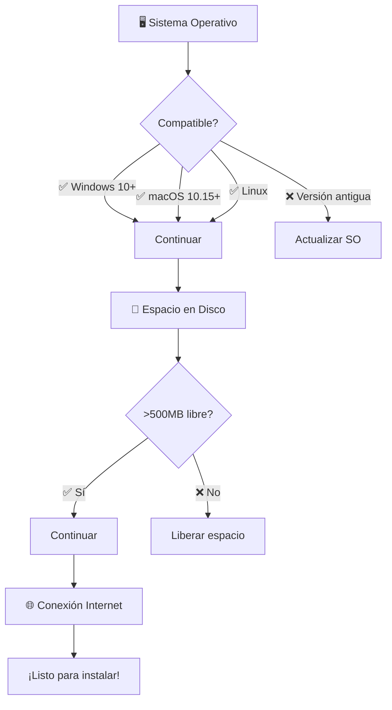

# ⚙️ Instalación y Setup: Preparando tu Arsenal de Go

> *"Give me six hours to chop down a tree and I will spend the first four sharpening the axe"* - Abraham Lincoln

Una configuración correcta es la diferencia entre un developer frustrado y uno productivo. En esta lección configuraremos tu entorno de desarrollo Go de forma profesional.

## 🎯 Objetivos de Esta Lección

Al finalizar esta lección serás capaz de:
- ✅ **Instalar Go 1.24.5** en cualquier sistema operativo
- ✅ **Configurar tu workspace** siguiendo best practices
- ✅ **Dominar las herramientas** esenciales del ecosistema Go
- ✅ **Optimizar tu IDE/Editor** para máxima productividad
- ✅ **Escribir y ejecutar** tu primer programa Go
- ✅ **Resolver problemas** comunes de instalación

---

## 📋 Checklist Pre-Instalación

Antes de comenzar, verifica:



### 🔧 Requisitos Mínimos

| Componente | Mínimo | Recomendado | Ideal |
|------------|--------|-------------|-------|
| **RAM** | 1GB | 4GB | 8GB+ |
| **Disco** | 500MB | 2GB | 10GB+ |
| **CPU** | 1 core | 2 cores | 4+ cores |
| **SO** | Windows 10/macOS 10.15/Linux | Últimas versiones | Últimas versiones |

---

## 🖥️ Instalación por Sistema Operativo

### 🐧 Linux (Ubuntu/Debian/CentOS/Arch)

#### **Método 1: Descarga Oficial (Recomendado)**

```bash
# 1. Descargar Go 1.24.5
wget https://go.dev/dl/go1.24.5.linux-amd64.tar.gz

# 2. Remover instalación previa (si existe)
sudo rm -rf /usr/local/go

# 3. Extraer en /usr/local
sudo tar -C /usr/local -xzf go1.24.5.linux-amd64.tar.gz

# 4. Agregar Go al PATH
echo 'export PATH=$PATH:/usr/local/go/bin' >> ~/.bashrc
echo 'export GOPATH=$HOME/go' >> ~/.bashrc
echo 'export GOBIN=$GOPATH/bin' >> ~/.bashrc

# 5. Recargar configuración
source ~/.bashrc

# 6. Verificar instalación
go version
```

#### **Método 2: Package Manager**

```bash
# Ubuntu/Debian
sudo apt update
sudo apt install golang-go

# CentOS/RHEL/Fedora
sudo dnf install golang
# o para versiones antigas: sudo yum install golang

# Arch Linux
sudo pacman -S go

# ⚠️ Nota: Los package managers pueden tener versiones desactualizadas
```

#### **Método 3: Snap (Universal)**

```bash
sudo snap install go --classic
```

### 🍎 macOS

#### **Método 1: Descarga Oficial (Recomendado)**

```bash
# 1. Descargar desde navegador o terminal
curl -O https://go.dev/dl/go1.24.5.darwin-amd64.pkg

# 2. Instalar (doble-click o desde terminal)
sudo installer -pkg go1.24.5.darwin-amd64.pkg -target /

# 3. Configurar PATH (agregrar a ~/.zshrc o ~/.bash_profile)
echo 'export PATH=$PATH:/usr/local/go/bin' >> ~/.zshrc
echo 'export GOPATH=$HOME/go' >> ~/.zshrc
echo 'export GOBIN=$GOPATH/bin' >> ~/.zshrc

# 4. Recargar
source ~/.zshrc

# 5. Verificar
go version
```

#### **Método 2: Homebrew**

```bash
# Instalar Homebrew si no lo tienes
/bin/bash -c "$(curl -fsSL https://raw.githubusercontent.com/Homebrew/install/HEAD/install.sh)"

# Instalar Go
brew install go

# Verificar
go version
```

### 🪟 Windows

#### **Método 1: Instalador MSI (Recomendado)**

1. **Descargar** de [https://go.dev/dl/](https://go.dev/dl/)
2. **Ejecutar** `go1.24.5.windows-amd64.msi`
3. **Seguir** el wizard de instalación
4. **Abrir** Command Prompt o PowerShell
5. **Verificar**: `go version`

#### **Método 2: Chocolatey**

```powershell
# Instalar Chocolatey si no lo tienes
Set-ExecutionPolicy Bypass -Scope Process -Force; [System.Net.ServicePointManager]::SecurityProtocol = [System.Net.ServicePointManager]::SecurityProtocol -bor 3072; iex ((New-Object System.Net.WebClient).DownloadString('https://community.chocolatey.org/install.ps1'))

# Instalar Go
choco install golang

# Verificar
go version
```

#### **Método 3: Scoop**

```powershell
# Instalar Scoop si no lo tienes
iwr -useb get.scoop.sh | iex

# Instalar Go
scoop install go

# Verificar
go version
```

### 🐳 Docker (Para Desarrollo Temporal)

```bash
# Correr Go en container
docker run --rm -it golang:1.24.5

# O montar tu código
docker run --rm -it -v $(pwd):/app -w /app golang:1.24.5 bash
```

---

## 🗂️ Configuración del Workspace

### 📁 Estructura de Directorios Recomendada

```
$HOME/
├── go/                     # GOPATH (opcional con modules)
│   ├── bin/               # Binarios instalados
│   ├── pkg/               # Packages compilados (cache)
│   └── src/               # Source code (legacy)
├── Projects/              # Tus proyectos actuales
│   ├── go-deep/           # Este curso
│   ├── my-api/            # Tu API
│   └── cli-tool/          # Tu herramienta CLI
└── .config/
    └── go/                # Configuración Go (cache, etc.)
```

### ⚙️ Variables de Entorno Esenciales

```bash
# ~/.bashrc, ~/.zshrc, o equivalente

# 1. PATH - Para encontrar binarios Go
export PATH=$PATH:/usr/local/go/bin

# 2. GOPATH - Workspace (opcional con modules)
export GOPATH=$HOME/go

# 3. GOBIN - Dónde instalar binarios
export GOBIN=$GOPATH/bin

# 4. GOPROXY - Proxy para modules (opcional)
export GOPROXY=https://proxy.golang.org,direct

# 5. GOSUMDB - Database de checksums (opcional)
export GOSUMDB=sum.golang.org

# 6. GOPRIVATE - Módulos privados (si tienes)
# export GOPRIVATE=github.com/tuempresa/*

# 7. Agregar GOBIN al PATH
export PATH=$PATH:$GOBIN
```

### 🔍 Verificación de la Configuración

```bash
# Comando mágico que te dice todo
go env

# Variables clave a verificar:
go env GOVERSION    # Debe ser go1.24.5
go env GOOS         # Tu sistema operativo
go env GOARCH       # Tu arquitectura
go env GOPATH       # Tu workspace
go env GOMODCACHE   # Cache de módulos
go env GOPROXY      # Proxy configuration
```

**Salida esperada:**
```
GOVERSION="go1.24.5"
GOOS="linux"          # o "windows", "darwin"
GOARCH="amd64"        # o "arm64", "386"
GOPATH="/home/user/go"
GOMODCACHE="/home/user/go/pkg/mod"
GOPROXY="https://proxy.golang.org,direct"
```

---

## 🛠️ Herramientas Esenciales del Ecosistema

Go viene con un toolkit increíble out-of-the-box:

### 🔧 Herramientas Core

```bash
# 1. go - El comando principal
go version          # Versión instalada
go help             # Ayuda completa

# 2. gofmt - Formateo automático de código
gofmt -w main.go    # Formatea y sobrescribe
gofmt -d main.go    # Muestra diferencias

# 3. go vet - Análisis estático
go vet ./...        # Analiza errores potenciales

# 4. go test - Framework de testing
go test ./...       # Corre todos los tests
go test -v          # Verbose output
go test -cover      # Coverage report

# 5. go build - Compilación
go build            # Compila el package actual
go build -o myapp   # Especifica nombre output

# 6. go run - Compilar y ejecutar
go run main.go      # Ejecuta directamente

# 7. go install - Instalar binarios
go install github.com/user/tool@latest

# 8. go mod - Gestión de módulos
go mod init myproject    # Inicializar módulo
go mod tidy             # Limpiar dependencias
go mod download         # Descargar dependencias
```

### 🔍 Herramientas de Análisis

```bash
# 1. go doc - Documentación
go doc fmt.Println  # Documentación de una función
go doc -http=:6060  # Servidor local de docs

# 2. go list - Información de packages
go list ./...       # Lista todos los packages
go list -m all      # Lista módulos

# 3. go env - Variables de entorno
go env              # Todas las variables
go env GOOS GOARCH  # Variables específicas
```

### 🚀 Herramientas de Performance

```bash
# 1. go tool pprof - Profiling
go tool pprof cpu.prof     # Analizar CPU profile
go tool pprof mem.prof     # Analizar memory profile

# 2. go tool trace - Tracing
go tool trace trace.out    # Analizar execution trace

# 3. go tool objdump - Disassembler
go tool objdump binary     # Ver assembly code

# 4. go tool nm - Symbol table
go tool nm binary          # Ver symbols
```

---

## 💻 Configuración de IDEs y Editores

### 🏆 Visual Studio Code (Recomendado)

#### **Instalación de la Extensión Go**

1. **Abrir VS Code**
2. **Ir a Extensions** (Ctrl+Shift+X)
3. **Buscar "Go"** (por Google)
4. **Instalar** la extensión oficial

#### **Configuración Avanzada**

```json
// settings.json
{
    // Go general
    "go.gopath": "/home/user/go",
    "go.goroot": "/usr/local/go",
    "go.formatTool": "goimports",
    "go.lintTool": "golangci-lint",
    
    // Auto-save y format
    "editor.formatOnSave": true,
    "editor.codeActionsOnSave": {
        "source.organizeImports": true
    },
    
    // IntelliSense
    "go.useLanguageServer": true,
    "gopls": {
        "ui.completion.usePlaceholders": true,
        "ui.diagnostic.analyses": {
            "unusedparams": true,
            "shadow": true
        }
    },
    
    // Testing
    "go.testFlags": ["-v"],
    "go.coverOnSave": true,
    "go.coverageDecorator": {
        "type": "gutter",
        "coveredHighlightColor": "rgba(64,128,128,0.5)",
        "uncoveredHighlightColor": "rgba(128,64,64,0.25)"
    }
}
```

#### **Extensiones Adicionales Recomendadas**

```bash
# Instalar desde Command Palette (Ctrl+Shift+P)
code --install-extension ms-vscode.go
code --install-extension bradlc.vscode-tailwindcss
code --install-extension esbenp.prettier-vscode
code --install-extension ms-vscode.vscode-json
code --install-extension redhat.vscode-yaml
code --install-extension ms-vscode-remote.remote-containers
```

### 🧠 GoLand/IntelliJ IDEA

#### **Configuración**
1. **Install Go Plugin** (si usas IntelliJ)
2. **Configure GOROOT**: Settings → Go → GOROOT
3. **Configure GOPATH**: Settings → Go → GOPATH
4. **Enable Go Modules**: Settings → Go → Go Modules

### 🚀 Vim/Neovim

#### **vim-go Plugin**

```vim
" .vimrc
call plug#begin()
Plug 'fatih/vim-go', { 'do': ':GoUpdateBinaries' }
call plug#end()

" Configuración vim-go
let g:go_def_mode='gopls'
let g:go_info_mode='gopls'
let g:go_fmt_command = "goimports"
let g:go_auto_sameids = 1
let g:go_highlight_types = 1
let g:go_highlight_fields = 1
let g:go_highlight_functions = 1
```

### ⚡ Emacs

#### **go-mode**

```emacs-lisp
;; .emacs or init.el
(use-package go-mode
  :ensure t
  :hook ((go-mode . lsp-deferred)
         (before-save . lsp-format-buffer)
         (before-save . lsp-organize-imports)))

(use-package lsp-mode
  :ensure t
  :commands (lsp lsp-deferred))
```

---

## 🎮 Tu Primer Programa Go

### 📝 Hello World Básico

Crea un archivo `hello.go`:

```go
package main

import "fmt"

func main() {
    fmt.Println("¡Hola, Mundo Go! 🚀")
}
```

### 🏃‍♂️ Ejecutar el Programa

```bash
# Método 1: Compilar y ejecutar
go run hello.go

# Método 2: Compilar a binario
go build hello.go
./hello              # Linux/macOS
hello.exe            # Windows

# Método 3: Compilar con nombre específico
go build -o mi-app hello.go
./mi-app
```

### 📊 Salida Esperada

```
¡Hola, Mundo Go! 🚀
```

### 🔍 Análisis Línea por Línea

```go
package main           // 1. Declara el package principal
import "fmt"          // 2. Importa el package fmt para I/O
func main() {         // 3. Función principal (entry point)
    fmt.Println(...)  // 4. Imprime a stdout con newline
}                     // 5. Fin de la función
```

---

## 🚀 Hello World Avanzado

Vamos a crear algo más interesante:

```go
package main

import (
    "fmt"
    "os"
    "time"
)

func main() {
    // Obtener nombre del usuario o usar default
    name := "Gopher"
    if len(os.Args) > 1 {
        name = os.Args[1]
    }
    
    // Saludo personalizado con timestamp
    fmt.Printf("🚀 ¡Hola, %s!\n", name)
    fmt.Printf("⏰ Timestamp: %s\n", time.Now().Format("2006-01-02 15:04:05"))
    fmt.Printf("💻 SO: %s\n", getOS())
    fmt.Printf("🏗️  Compilado con: %s\n", "Go 1.24.5")
}

func getOS() string {
    switch os := os.Getenv("GOOS"); os {
    case "windows":
        return "Windows 🪟"
    case "darwin":
        return "macOS 🍎"
    case "linux":
        return "Linux 🐧"
    default:
        return "Unknown OS"
    }
}
```

### 📦 Crear un Módulo Go

```bash
# 1. Crear directorio
mkdir mi-primer-proyecto
cd mi-primer-proyecto

# 2. Inicializar módulo
go mod init github.com/tuusername/mi-primer-proyecto

# 3. Crear main.go (con el código de arriba)
# 4. Ejecutar
go run main.go TuNombre
```

---

## 🔧 Troubleshooting: Problemas Comunes

### ❌ "go: command not found"

**Problema**: Go no está en el PATH.

**Solución**:
```bash
# Verificar si Go está instalado
ls /usr/local/go/bin/go

# Agregar al PATH
echo 'export PATH=$PATH:/usr/local/go/bin' >> ~/.bashrc
source ~/.bashrc
```

### ❌ "cannot find package"

**Problema**: GOPATH mal configurado o módulos.

**Solución**:
```bash
# Con Go Modules (recomendado)
go mod init mi-proyecto
go mod tidy

# O verificar GOPATH
go env GOPATH
```

### ❌ "permission denied"

**Problema**: Permisos de archivo en Linux/macOS.

**Solución**:
```bash
chmod +x mi-programa
# o
sudo chown -R $USER:$USER /usr/local/go
```

### ❌ Proxy issues

**Problema**: Problemas de red con GOPROXY.

**Solución**:
```bash
# Usar proxy directo
export GOPROXY=direct

# O configurar proxy corporativo
export GOPROXY=https://your-proxy.com,direct
```

### ❌ Version conflicts

**Problema**: Múltiples versiones de Go instaladas.

**Solución**:
```bash
# Remover versiones antigas
sudo rm -rf /usr/local/go

# Reinstalar versión correcta
# (seguir pasos de instalación)
```

---

## 🧪 Laboratorio: Configuración Completa

### 🎯 Ejercicio 1: Verificación de Setup

Crea un script que verifique tu instalación:

```go
package main

import (
    "fmt"
    "os"
    "os/exec"
    "runtime"
)

func main() {
    fmt.Println("🔍 Go Setup Verification")
    fmt.Println("========================")
    
    // 1. Go version
    fmt.Printf("Go Version: %s\n", runtime.Version())
    
    // 2. OS y arquitectura
    fmt.Printf("OS: %s\n", runtime.GOOS)
    fmt.Printf("Architecture: %s\n", runtime.GOARCH)
    
    // 3. GOPATH y GOROOT
    fmt.Printf("GOROOT: %s\n", runtime.GOROOT())
    fmt.Printf("GOPATH: %s\n", os.Getenv("GOPATH"))
    
    // 4. Verificar herramientas
    tools := []string{"gofmt", "go", "vet"}
    for _, tool := range tools {
        if _, err := exec.LookPath(tool); err == nil {
            fmt.Printf("✅ %s: Found\n", tool)
        } else {
            fmt.Printf("❌ %s: Not found\n", tool)
        }
    }
    
    fmt.Println("\n🎉 Setup verification complete!")
}
```

### 🎯 Ejercicio 2: Project Template Generator

Crea una herramienta que genere templates de proyectos:

```go
package main

import (
    "fmt"
    "os"
    "path/filepath"
)

func main() {
    if len(os.Args) < 2 {
        fmt.Println("Usage: go run template.go <project-name>")
        return
    }
    
    projectName := os.Args[1]
    
    // Crear estructura de directorios
    dirs := []string{
        projectName,
        filepath.Join(projectName, "cmd"),
        filepath.Join(projectName, "internal"),
        filepath.Join(projectName, "pkg"),
        filepath.Join(projectName, "test"),
        filepath.Join(projectName, "docs"),
    }
    
    for _, dir := range dirs {
        if err := os.MkdirAll(dir, 0755); err != nil {
            fmt.Printf("Error creating %s: %v\n", dir, err)
            return
        }
        fmt.Printf("✅ Created: %s\n", dir)
    }
    
    // Crear archivos básicos
    files := map[string]string{
        filepath.Join(projectName, "go.mod"): fmt.Sprintf("module %s\n\ngo 1.24.5\n", projectName),
        filepath.Join(projectName, "main.go"): `package main

import "fmt"

func main() {
    fmt.Println("Hello from ` + projectName + `!")
}`,
        filepath.Join(projectName, "README.md"): fmt.Sprintf("# %s\n\nDescription of your project.\n", projectName),
    }
    
    for file, content := range files {
        if err := os.WriteFile(file, []byte(content), 0644); err != nil {
            fmt.Printf("Error creating %s: %v\n", file, err)
            return
        }
        fmt.Printf("✅ Created: %s\n", file)
    }
    
    fmt.Printf("\n🎉 Project '%s' created successfully!\n", projectName)
    fmt.Printf("Next steps:\n")
    fmt.Printf("  cd %s\n", projectName)
    fmt.Printf("  go run main.go\n")
}
```

---

## 📊 Performance y Optimización del Setup

### ⚡ Optimizaciones de Performance

#### **1. Module Cache Warming**
```bash
# Pre-descargar módulos comunes
go mod download golang.org/x/tools/...
go mod download github.com/gin-gonic/gin
go mod download github.com/gorilla/mux
```

#### **2. Build Cache Optimization**
```bash
# Configurar cache directory
export GOCACHE=$HOME/.cache/go-build

# Pre-compile standard library
go install -a std
```

#### **3. Proxy Configuration**
```bash
# Usar Athens proxy local (opcional)
export GOPROXY=http://localhost:3000,https://proxy.golang.org,direct
```

### 🔍 Monitoring de Performance

```go
package main

import (
    "fmt"
    "runtime"
    "time"
)

func main() {
    var m runtime.MemStats
    
    // Medición inicial
    runtime.ReadMemStats(&m)
    fmt.Printf("Initial memory: %d KB\n", bToKb(m.Alloc))
    
    start := time.Now()
    
    // Tu código aquí
    for i := 0; i < 1000000; i++ {
        _ = fmt.Sprintf("iteration %d", i)
    }
    
    duration := time.Since(start)
    runtime.ReadMemStats(&m)
    
    fmt.Printf("Final memory: %d KB\n", bToKb(m.Alloc))
    fmt.Printf("Execution time: %v\n", duration)
}

func bToKb(b uint64) uint64 {
    return b / 1024
}
```

---

## 🎯 Checklist Final

Antes de continuar, verifica que tienes todo:

### ✅ Instalación
- [ ] Go 1.24.5 instalado correctamente
- [ ] `go version` muestra la versión correcta
- [ ] Variables de entorno configuradas

### ✅ Herramientas
- [ ] IDE/Editor configurado con Go support
- [ ] Extensions/plugins instalados
- [ ] Syntax highlighting funcionando
- [ ] Auto-completion funcionando

### ✅ Workspace
- [ ] Directorio de proyectos creado
- [ ] GOPATH configurado (si usas)
- [ ] Go Modules funcionando

### ✅ Testing
- [ ] Hello World ejecutándose
- [ ] `go build` funcionando
- [ ] `go test` funcionando
- [ ] `go fmt` funcionando

---

## 🎉 ¡Felicitaciones!

¡Tu setup de Go está completo y listo para la acción! Ahora tienes:

- ✅ **Go 1.24.5** funcionando perfectamente
- ✅ **Entorno optimizado** para desarrollo
- ✅ **Herramientas configuradas** y listas
- ✅ **Primer programa** ejecutándose
- ✅ **Troubleshooting skills** para resolver problemas

### 🚀 Próximos Pasos

¡Es hora de aprender la sintaxis básica de Go!

**[→ Ir a la Lección 3: Sintaxis Básica](../03-sintaxis-basica/)**

---

## 📚 Referencias y Recursos Adicionales

### 🔗 Enlaces Oficiales
- **[Go Downloads](https://go.dev/dl/)** - Página oficial de descargas
- **[Go Installation](https://go.dev/doc/install)** - Guía oficial de instalación
- **[Go Editor Setup](https://go.dev/doc/editors)** - Configuración de editores

### 📖 Documentación
- **[Getting Started](https://go.dev/doc/tutorial/getting-started)** - Tutorial oficial
- **[How to Write Go Code](https://go.dev/doc/code)** - Organización de código
- **[Go Modules](https://go.dev/blog/using-go-modules)** - Gestión de dependencias

### 🛠️ Herramientas Útiles
- **[Go Playground](https://play.golang.org/)** - Ejecutar Go online
- **[pkg.go.dev](https://pkg.go.dev/)** - Documentación de packages
- **[Go Report Card](https://goreportcard.com/)** - Análisis de calidad

---

## 📞 ¿Necesitas Ayuda?

- 💬 **Discord**: [Go Deep Community](#)
- 📧 **Email**: support@go-deep.dev
- 🐛 **Issues**: [GitHub Issues](../../../issues)
- 📖 **Stack Overflow**: Tag `golang`

---

*¡Tu arsenal Go está listo! Hora de escribir código épico 🚀*
