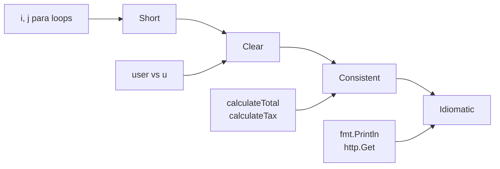
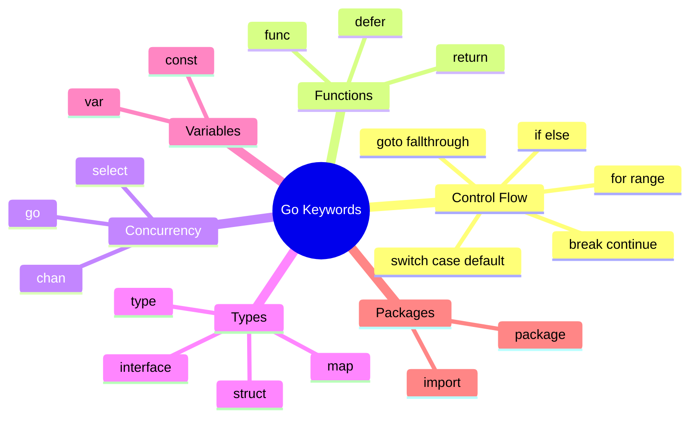

# 📝 Sintaxis Básica: Los Fundamentos de Go

> *"The code you write today is the legacy you leave tomorrow"* - Clean Code Philosophy

La sintaxis de Go es como aprender a hablar un nuevo idioma: una vez que domines las reglas básicas, podrás expresar ideas complejas de forma simple y elegante.

## 🎯 Objetivos de Esta Lección

Al finalizar esta lección serás capaz de:
- ✅ **Escribir programas Go** siguiendo las convenciones oficiales
- ✅ **Estructurar código** de forma idiomática
- ✅ **Usar comentarios** efectivos para documentación
- ✅ **Aplicar formato automático** con gofmt
- ✅ **Identificar y corregir** errores de sintaxis comunes
- ✅ **Leer código Go** fluídamente

---

## 🏗️ Anatomía de un Programa Go

### 📋 Estructura Básica

Todo programa Go tiene esta estructura fundamental:

```go
// 1. Package declaration (OBLIGATORIO)
package main

// 2. Import statements (si necesario)
import (
    "fmt"
    "os"
)

// 3. Global declarations (opcional)
var globalVariable = "I'm global!"

// 4. Function declarations
func main() {
    // 5. Function body
    fmt.Println("Hello, Go!")
}
```

### 🧠 Analogía: Go como una Carta Formal

Imagina que escribir código Go es como escribir una carta formal:

```
📮 [Package] - El remitente (quién envía)
📨 [Imports] - Los materiales que necesitas
📑 [Globals] - El contexto importante
✍️ [Functions] - El contenido principal
📝 [Main] - Tu mensaje principal
```

---

## 📦 Package Declaration

### 🎯 ¿Qué es un Package?

Un **package** es como un **módulo** o **biblioteca** que agrupa código relacionado.

```go
// Cada archivo Go DEBE comenzar con package
package main        // Programa ejecutable
package utils       // Biblioteca/utilidad
package models      // Modelos de datos
package handlers    // Manejadores HTTP
```

### 🔍 Tipos de Packages

```mermaid
graph TD
    A[Package Types] --> B[main]
    A --> C[library]
    
    B --> D[Ejecutable]
    B --> E[Entry point: func main()]
    
    C --> F[Reutilizable]
    C --> G[Exporta funciones/tipos]
    
    style B fill:#ff6b6b
    style C fill:#51cf66
```

#### **Package main**
```go
package main

import "fmt"

// DEBE tener func main() para ser ejecutable
func main() {
    fmt.Println("I'm an executable!")
}
```

#### **Package library**
```go
package mathutils

// Función exportada (empieza con mayúscula)
func Add(a, b int) int {
    return a + b
}

// Función privada (empieza con minúscula)
func multiply(a, b int) int {
    return a * b
}
```

### 🚨 Reglas Importantes

1. **Un package por directorio**
2. **Todos los archivos en un directorio = mismo package**
3. **Solo un `package main` con `func main()` por programa**
4. **Package name debe coincidir con directory name** (excepción: main)

---

## 📥 Import Statements

### 🔧 Sintaxis de Import

```go
// Import único
import "fmt"

// Import múltiple (forma larga)
import "fmt"
import "os"
import "strings"

// Import múltiple (forma idiomática)
import (
    "fmt"
    "os"
    "strings"
)
```

### 🎨 Import Avanzado

```go
import (
    // Import normal
    "fmt"
    
    // Alias para evitar conflictos
    myfmt "fmt"
    
    // Import solo para side effects
    _ "image/png"
    
    // Import con dot (NO recomendado)
    . "math"
    
    // Packages remotos
    "github.com/gin-gonic/gin"
    "golang.org/x/sync/errgroup"
)
```

### 🎯 Best Practices para Imports

```go
import (
    // 1. Standard library primero
    "fmt"
    "os"
    "strings"
    
    // 2. Línea en blanco
    
    // 3. Third-party packages
    "github.com/gin-gonic/gin"
    "github.com/spf13/cobra"
    
    // 4. Línea en blanco
    
    // 5. Local packages (tu proyecto)
    "myproject/internal/utils"
    "myproject/pkg/models"
)
```

### ⚠️ Errores Comunes con Imports

```go
// ❌ Import sin usar
import "fmt"  // Error: imported and not used

func main() {
    println("Hello")  // No usa fmt
}

// ✅ Solo importa lo que usas
func main() {
    println("Hello")
}

// ❌ Import circular
// package a imports package b
// package b imports package a

// ✅ Reorganizar para evitar circularidad
```

---

## 🔤 Identificadores y Nombres

### 📝 Reglas de Naming

```go
// ✅ Válidos
var name string
var userName string
var user_name string  // Menos idiomático
var ñombre string     // Unicode OK
var λ float64         // Unicode OK
var _private string   // Inicia con underscore

// ❌ Inválidos
var 123name string    // No puede empezar con número
var user-name string  // Guión no permitido
var func string       // Keyword reservada
```

### 🎯 Convenciones de Go

```go
// ✅ Exported (público) - Empieza con MAYÚSCULA
func CalculateTotal() float64 { }
type User struct { }
const MaxRetries = 3

// ✅ Unexported (privado) - Empieza con minúscula
func calculateTax() float64 { }
type internalState struct { }
const defaultTimeout = 30

// ✅ Acrónimos en mayúscula cuando son exported
func JSONToXML() { }    // No: JsonToXml
type HTTPClient struct { }  // No: HttpClient

// ✅ Nombres descriptivos pero concisos
var userCount int       // ✅ Claro
var uc int             // ❌ Muy corto
var numberOfActiveUsers int  // ❌ Muy largo
```

### 🧠 Filosofía de Naming en Go



---

## 💬 Comentarios y Documentación

### 📝 Tipos de Comentarios

```go
// Comentario de línea simple
/* Comentario
   multi-línea */

package main

// Comentario de documentación para package
// Package main demonstrates Go syntax basics
import "fmt"

// User representa un usuario del sistema.
// Cada usuario tiene un nombre único y email.
type User struct {
    Name  string // Nombre del usuario
    Email string // Email debe ser válido
}

// NewUser crea un nuevo usuario con validación básica.
// Retorna error si el nombre está vacío.
func NewUser(name, email string) (*User, error) {
    if name == "" {
        return nil, fmt.Errorf("name cannot be empty")
    }
    
    return &User{
        Name:  name,
        Email: email,
    }, nil
}

func main() {
    // TODO: Agregar validación de email
    user, err := NewUser("Juan", "juan@example.com")
    if err != nil {
        fmt.Printf("Error: %v\n", err)
        return
    }
    
    /* 
    FIXME: Este código necesita optimización
    para manejar usuarios concurrentemente
    */
    fmt.Printf("Usuario creado: %+v\n", user)
}
```

### 🎯 Convenciones de Documentación

```go
// ✅ Documentación efectiva
// Package calculator provides basic arithmetic operations
// for financial calculations with precision handling.
package calculator

// Tax rates for different regions
const (
    // TaxRateUS represents the US federal tax rate
    TaxRateUS = 0.25
    
    // TaxRateEU represents the average EU tax rate  
    TaxRateEU = 0.20
)

// Calculator performs financial calculations.
// It maintains precision for monetary operations.
type Calculator struct {
    precision int
}

// NewCalculator creates a Calculator with specified precision.
// Precision must be between 2 and 8 decimal places.
func NewCalculator(precision int) (*Calculator, error) {
    if precision < 2 || precision > 8 {
        return nil, fmt.Errorf("precision must be between 2 and 8")
    }
    
    return &Calculator{precision: precision}, nil
}

// Calculate performs the specified operation on two values.
// Supported operations: +, -, *, /
// Returns error for division by zero.
func (c *Calculator) Calculate(a, b float64, op string) (float64, error) {
    // Implementation here...
    return 0, nil
}
```

### 📊 Comentarios Especiales

```go
// TODO: Implementar cache para mejorar performance
// FIXME: Race condition en acceso concurrente  
// HACK: Solución temporal hasta fix del upstream
// NOTE: Este comportamiento está documentado en RFC-1234
// WARNING: No modificar sin revisar dependencias
// BUG: Falla con números negativos grandes
// XXX: Código legacy, planear refactor
```

---

## 🎨 Formato y Estilo

### 🤖 gofmt: Tu Mejor Amigo

```bash
# Formatear archivo
gofmt -w main.go

# Ver cambios sin aplicar
gofmt -d main.go

# Formatear directorio completo
gofmt -w .

# Usar goimports (incluye import management)
goimports -w main.go
```

### 📏 Ejemplos de Formato

```go
// ❌ Mal formato
package main
import"fmt"
func main(){
var name string="Juan"
if name=="Juan"{
fmt.Println("Hola Juan")
}
}

// ✅ Después de gofmt
package main

import "fmt"

func main() {
    var name string = "Juan"
    if name == "Juan" {
        fmt.Println("Hola Juan")
    }
}
```

### 🎯 Reglas de Estilo Go

#### **1. Indentación: Tabs, no espacios**
```go
func main() {
→   if true {        // Tab
→   →   fmt.Println() // Tab + Tab
→   }
}
```

#### **2. Llaves en la misma línea**
```go
// ✅ Go style
if condition {
    // code
}

// ❌ No Go style  
if condition 
{
    // code
}
```

#### **3. No semicolons al final**
```go
// ✅ Go style
fmt.Println("Hello")
return true

// ❌ Innecesario (aunque válido)
fmt.Println("Hello");
return true;
```

#### **4. Límite de línea: ~80-100 caracteres**
```go
// ✅ Línea larga dividida
result, err := someVeryLongFunctionName(
    firstParameter,
    secondParameter,
    thirdParameter,
)

// ❌ Línea muy larga
result, err := someVeryLongFunctionName(firstParameter, secondParameter, thirdParameter, fourthParameter)
```

---

## 🔑 Keywords de Go

### 📝 Todas las Keywords (25 total)

```go
break        default      func         interface    select
case         defer        go           map          struct
chan         else         goto         package      switch
const        fallthrough  if           range        type
continue     for          import       return       var
```

### 🎯 Categorías de Keywords



### 💡 Ejemplos de Uso

```go
package main                    // package

import "fmt"                    // import

const MaxUsers = 100           // const
var globalCounter int          // var

type User struct {             // type, struct
    Name string
    Age  int
}

func main() {                  // func
    users := make(map[string]User)  // map
    
    for i := 0; i < 10; i++ {      // for
        if i%2 == 0 {              // if
            continue               // continue
        }
        
        switch i {                 // switch
        case 1, 3:                // case
            fmt.Println("Odd")
        default:                  // default
            fmt.Println("Prime")
        }
        
        if i > 5 {
            break                 // break
        }
    }
    
    ch := make(chan int)          // chan
    go func() {                   // go
        ch <- 42
    }()
    
    select {                      // select
    case val := <-ch:
        fmt.Println(val)
    }
    
    defer fmt.Println("Done!")    // defer
}                                 // return implícito
```

---

## 🧪 Laboratorio Práctico

### 🎯 Ejercicio 1: Estructura Básica

Escribe un programa que demuestre la estructura básica:

```go
// TODO: Completa este programa
package ______

import (
    // Importa fmt y time
)

// Declara una constante global
const ______ = ______

// Declara una variable global
var ______ = ______

// Función principal
func ______() {
    // Imprime un mensaje con timestamp
    
    // Usa defer para imprimir mensaje final
}
```

**Solución:**
```go
package main

import (
    "fmt"
    "time"
)

const AppName = "Go Syntax Demo"
var startTime = time.Now()

func main() {
    defer fmt.Println("Program finished!")
    
    fmt.Printf("Welcome to %s\n", AppName)
    fmt.Printf("Started at: %s\n", startTime.Format("15:04:05"))
}
```

### 🎯 Ejercicio 2: Documentación

Documenta apropiadamente este código:

```go
package calculator

type Calculator struct {
    precision int
}

func New(p int) *Calculator {
    return &Calculator{precision: p}
}

func (c *Calculator) Add(a, b float64) float64 {
    return a + b
}

func (c *Calculator) Divide(a, b float64) (float64, error) {
    if b == 0 {
        return 0, fmt.Errorf("division by zero")
    }
    return a / b, nil
}
```

**Solución:**
```go
// Package calculator provides basic arithmetic operations
// with configurable precision for decimal calculations.
package calculator

import "fmt"

// Calculator performs arithmetic operations with specified precision.
// The precision determines the number of decimal places in results.
type Calculator struct {
    precision int // Number of decimal places for results
}

// New creates a new Calculator with the specified precision.
// Precision should be a positive integer representing decimal places.
func New(p int) *Calculator {
    return &Calculator{precision: p}
}

// Add returns the sum of two floating-point numbers.
// The result respects the calculator's precision setting.
func (c *Calculator) Add(a, b float64) float64 {
    return a + b
}

// Divide returns the quotient of two floating-point numbers.
// Returns an error if attempting to divide by zero.
func (c *Calculator) Divide(a, b float64) (float64, error) {
    if b == 0 {
        return 0, fmt.Errorf("division by zero")
    }
    return a / b, nil
}
```

### 🎯 Ejercicio 3: Formato y Estilo

Corrige el formato de este código:

```go
package main
import"fmt"
func main(){
var name string="Go"
if name=="Go"{
fmt.Printf("Hello %s!",name)
}else{
fmt.Println("Unknown language")
}
}
```

**Solución (después de gofmt):**
```go
package main

import "fmt"

func main() {
    var name string = "Go"
    if name == "Go" {
        fmt.Printf("Hello %s!", name)
    } else {
        fmt.Println("Unknown language")
    }
}
```

---

## 🚨 Errores Comunes y Soluciones

### ❌ Error 1: Package/Import Issues

```go
// ❌ Problema
package main

import "fmt"

func main() {
    println("Hello")  // No usa fmt
}
// Error: imported and not used: "fmt"
```

```go
// ✅ Solución 1: Usar el import
package main

import "fmt"

func main() {
    fmt.Println("Hello")  // Usa fmt
}

// ✅ Solución 2: Remover import innecesario
package main

func main() {
    println("Hello")  // Usa built-in println
}
```

### ❌ Error 2: Naming Conventions

```go
// ❌ Problemas de naming
func JSON_to_xml() {}      // Mezcla convenciones
func httpClient() {}       // Acrónimo en minúscula
type userID struct {}      // Inconsistente

// ✅ Soluciones
func JSONToXML() {}        // Acrónimos en mayúscula
func HTTPClient() {}       // Consistente
type UserID struct {}      // Consistente
```

### ❌ Error 3: Comentarios Mal Ubicados

```go
// ❌ Comentario mal ubicado
func main() {
// This function starts the application
    fmt.Println("Starting...")
}

// ✅ Comentario bien ubicado
// main is the entry point of the application.
// It initializes the system and starts processing.
func main() {
    fmt.Println("Starting...")
}
```

### ❌ Error 4: Formato Inconsistente

```go
// ❌ Formato manual inconsistente
if condition{
    doSomething( )
        return nil
}

// ✅ Usar gofmt automáticamente
if condition {
    doSomething()
    return nil
}
```

---

## 📊 Checklist de Sintaxis

### ✅ Estructura del Archivo
- [ ] Package declaration al inicio
- [ ] Imports organizados correctamente
- [ ] Globals antes de funciones
- [ ] Función main() presente (si ejecutable)

### ✅ Naming
- [ ] Exported identifiers con mayúscula
- [ ] Unexported identifiers con minúscula
- [ ] Nombres descriptivos pero concisos
- [ ] Acrónimos en mayúscula correcta

### ✅ Comentarios
- [ ] Documentación para exports
- [ ] Comentarios explicativos donde necesario
- [ ] TODOs/FIXMEs apropiados
- [ ] Sin comentarios obvios/redundantes

### ✅ Formato
- [ ] gofmt aplicado
- [ ] Indentación con tabs
- [ ] Llaves en estilo Go
- [ ] Líneas de longitud razonable

### ✅ Imports
- [ ] Solo imports necesarios
- [ ] Organizados: std → third-party → local
- [ ] Aliases apropiados si hay conflictos
- [ ] Sin imports circulares

---

## 🎯 Proyecto: Go Syntax Checker

Crea una herramienta que verifique sintaxis básica:

```go
package main

import (
    "fmt"
    "go/ast"
    "go/parser"
    "go/token"
    "os"
)

// SyntaxChecker analyzes Go source files for basic syntax issues.
type SyntaxChecker struct {
    fileSet *token.FileSet
    issues  []string
}

// NewSyntaxChecker creates a new syntax checker.
func NewSyntaxChecker() *SyntaxChecker {
    return &SyntaxChecker{
        fileSet: token.NewFileSet(),
        issues:  make([]string, 0),
    }
}

// CheckFile analyzes a Go source file.
func (sc *SyntaxChecker) CheckFile(filename string) error {
    // Parse the file
    node, err := parser.ParseFile(sc.fileSet, filename, nil, parser.ParseComments)
    if err != nil {
        return fmt.Errorf("parse error: %v", err)
    }
    
    // Basic checks
    sc.checkPackageName(node)
    sc.checkExportedFunctions(node)
    
    return nil
}

// checkPackageName verifies package naming convention.
func (sc *SyntaxChecker) checkPackageName(node *ast.File) {
    if node.Name.Name != "main" && node.Name.Name != strings.ToLower(node.Name.Name) {
        sc.addIssue("Package name should be lowercase")
    }
}

// checkExportedFunctions verifies exported function documentation.
func (sc *SyntaxChecker) checkExportedFunctions(node *ast.File) {
    for _, decl := range node.Decls {
        if fn, ok := decl.(*ast.FuncDecl); ok {
            if fn.Name.IsExported() && fn.Doc == nil {
                sc.addIssue(fmt.Sprintf("Exported function %s lacks documentation", fn.Name.Name))
            }
        }
    }
}

// addIssue adds an issue to the checker's list.
func (sc *SyntaxChecker) addIssue(issue string) {
    sc.issues = append(sc.issues, issue)
}

// GetIssues returns all found issues.
func (sc *SyntaxChecker) GetIssues() []string {
    return sc.issues
}

func main() {
    if len(os.Args) < 2 {
        fmt.Println("Usage: go run checker.go <file.go>")
        return
    }
    
    checker := NewSyntaxChecker()
    err := checker.CheckFile(os.Args[1])
    if err != nil {
        fmt.Printf("Error: %v\n", err)
        return
    }
    
    issues := checker.GetIssues()
    if len(issues) == 0 {
        fmt.Println("✅ No syntax issues found!")
    } else {
        fmt.Println("❌ Issues found:")
        for _, issue := range issues {
            fmt.Printf("  - %s\n", issue)
        }
    }
}
```

---

## 🎉 ¡Felicitaciones!

¡Has dominado la sintaxis básica de Go! Ahora puedes:

- ✅ **Estructurar programas Go** correctamente
- ✅ **Seguir convenciones** de naming y formato
- ✅ **Escribir documentación** efectiva
- ✅ **Usar gofmt** para formato automático
- ✅ **Identificar errores** de sintaxis comunes

### 🔥 Lo que has aprendido:

1. **Package system** - Organización modular del código
2. **Import management** - Gestión de dependencias
3. **Naming conventions** - Reglas de nomenclatura idiomáticas
4. **Documentation** - Comentarios efectivos y útiles
5. **Code formatting** - Estilo consistente con herramientas
6. **Keywords** - Vocabulario fundamental de Go

### 🚀 Próximo Nivel

¡Es hora de dominar los tipos de datos que harán tu código robusto y expresivo!

**[→ Ir a la Lección 4: Tipos de Datos](../04-tipos-datos/)**

---

## 📚 Recursos para Profundizar

### 🔗 Documentación Oficial
- **[Effective Go](https://golang.org/doc/effective_go.html)** - Guía de estilo oficial
- **[Go Code Review Comments](https://github.com/golang/go/wiki/CodeReviewComments)** - Best practices
- **[Package Names](https://blog.golang.org/package-names)** - Convenciones de naming

### 🛠️ Herramientas
- **[gofmt](https://golang.org/cmd/gofmt/)** - Formato automático
- **[goimports](https://godoc.org/golang.org/x/tools/cmd/goimports)** - Import management
- **[golint](https://github.com/golang/lint)** - Linter estático

### 📖 Lecturas Adicionales
- **[Go Style Guide](https://google.github.io/styleguide/go/)** - Google's Go style
- **[Uber Go Style Guide](https://github.com/uber-go/guide)** - Uber's conventions

---

## 📞 ¿Preguntas?

- 💬 **Discord**: [Go Deep Community](#)
- 📧 **Email**: support@go-deep.dev
- 🐛 **Issues**: [GitHub Issues](../../../issues)

---

*¡Tu sintaxis Go está on point! Hora de dominar los tipos 🎯*
