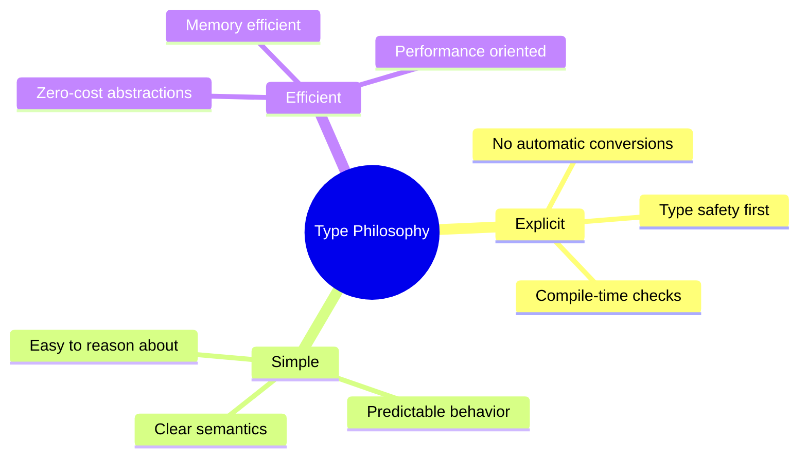

# 🎯 Tipos de Datos: El ADN de tu Código Go

> *"Strong typing prevents a lot of bugs at compile time"* - Go Design Philosophy

Los tipos de datos en Go son como los ingredientes en una receta: la calidad y combinación correcta determina el resultado final. En esta lección dominarás todos los tipos desde lo básico hasta lo avanzado.

## 🎯 Objetivos de Esta Lección

Al finalizar esta lección serás capaz de:
- ✅ **Dominar todos los tipos básicos** y sus características
- ✅ **Crear y usar tipos personalizados** efectivamente
- ✅ **Entender type conversions** y type assertions
- ✅ **Aplicar zero values** y inicialización correcta
- ✅ **Optimizar memoria** eligiendo tipos apropiados
- ✅ **Manejar tipos complejos** con confianza

---

## 🧬 Sistema de Tipos en Go

### 🏗️ Arquitectura de Tipos

```mermaid
graph TD
    A[Go Types] --> B[Basic Types]
    A --> C[Composite Types]
    A --> D[Reference Types]
    A --> E[Interface Types]
    
    B --> B1[Numeric]
    B --> B2[String]
    B --> B3[Boolean]
    
    B1 --> B11[Integers]
    B1 --> B12[Floating Point]
    B1 --> B13[Complex]
    
    C --> C1[Arrays]
    C --> C2[Structs]
    
    D --> D1[Slices]
    D --> D2[Maps]
    D --> D3[Channels]
    D --> D4[Pointers]
    D --> D5[Functions]
    
    E --> E1[Interface{}]
    E --> E2[Custom Interfaces]
```

### 🎨 Filosofía de Tipos en Go

Go adopta un enfoque **pragmático** para tipos:



---

## 🔢 Tipos Numéricos

### 🧮 Enteros (Integers)

#### **Tipos de Enteros Disponibles**

```go
// Enteros con signo
var i8 int8 = -128        // -128 a 127
var i16 int16 = -32768    // -32,768 a 32,767  
var i32 int32 = -2147483648 // -2^31 a 2^31-1
var i64 int64 = -9223372036854775808 // -2^63 a 2^63-1

// Enteros sin signo
var u8 uint8 = 255        // 0 a 255 (byte)
var u16 uint16 = 65535    // 0 a 65,535
var u32 uint32 = 4294967295 // 0 a 2^32-1
var u64 uint64 = 18446744073709551615 // 0 a 2^64-1

// Tipos dependientes de plataforma
var i int = -9223372036854775808    // int32 o int64 según plataforma
var u uint = 18446744073709551615   // uint32 o uint64 según plataforma
var ptr uintptr = 0x7fff5fbff700    // Para almacenar punteros
```

#### **🧠 Analogía: Cajas de Diferentes Tamaños**

Imagina los tipos como cajas para guardar números:

```
📦 int8    = Caja pequeña (1 byte)  - Para contadores pequeños
📦 int16   = Caja mediana (2 bytes) - Para IDs cortos  
📦 int32   = Caja grande (4 bytes)  - Para la mayoría de números
📦 int64   = Caja XL (8 bytes)     - Para números muy grandes
📦 int     = Caja inteligente       - Se adapta a tu máquina
```

#### **🎯 Cuándo Usar Cada Tipo**

```go
package main

import "fmt"

func main() {
    // ✅ int8/uint8 - Contadores pequeños, flags
    var playerLevel uint8 = 85      // Nivel 1-100
    var temperature int8 = -15      // Temperatura en Celsius
    
    // ✅ int16/uint16 - IDs pequeños, puertos
    var userID uint16 = 12345       // ID de usuario
    var port uint16 = 8080          // Puerto de red
    
    // ✅ int32/uint32 - Números comunes, timestamps
    var timestamp int32 = 1640995200 // Unix timestamp
    var population uint32 = 8000000  // Población de ciudad
    
    // ✅ int64/uint64 - Números muy grandes, dinero
    var fileSize int64 = 2147483648  // Tamaño de archivo en bytes
    var accountBalance uint64 = 1000000000 // Balance en centavos
    
    // ✅ int/uint - Uso general (recomendado por defecto)
    var count int = 42               // Contador general
    var index int = 0                // Índice de array
    
    fmt.Printf("Player level: %d\n", playerLevel)
    fmt.Printf("File size: %d bytes\n", fileSize)
    fmt.Printf("Count: %d\n", count)
}
```

#### **⚠️ Overflow y Underflow**

```go
package main

import "fmt"

func demonstrateOverflow() {
    // Overflow en uint8
    var maxUint8 uint8 = 255
    fmt.Printf("maxUint8: %d\n", maxUint8)
    maxUint8++  // Overflow: vuelve a 0
    fmt.Printf("maxUint8 after ++: %d\n", maxUint8)
    
    // Underflow en uint8  
    var minUint8 uint8 = 0
    fmt.Printf("minUint8: %d\n", minUint8)
    minUint8--  // Underflow: va a 255
    fmt.Printf("minUint8 after --: %d\n", minUint8)
    
    // Overflow en int8
    var maxInt8 int8 = 127
    fmt.Printf("maxInt8: %d\n", maxInt8)
    maxInt8++   // Overflow: va a -128
    fmt.Printf("maxInt8 after ++: %d\n", maxInt8)
}
```

### 🔢 Punto Flotante (Floating Point)

```go
// Precisión simple (32 bits)
var f32 float32 = 3.14159

// Precisión doble (64 bits) - Recomendado
var f64 float64 = 3.141592653589793

// Notación científica
var scientific = 1.23e-4    // 0.000123
var bigNumber = 1.23e+8     // 123,000,000

// Valores especiales
var positiveInf = math.Inf(1)    // +Inf
var negativeInf = math.Inf(-1)   // -Inf  
var notANumber = math.NaN()      // NaN

// Zero values
var zeroFloat32 float32     // 0
var zeroFloat64 float64     // 0
```

#### **🎯 Precisión y Casos de Uso**

```go
package main

import (
    "fmt"
    "math"
)

func floatingPointDemo() {
    // ✅ float32 - Gráficos, arrays grandes donde memoria importa
    var pixelIntensity float32 = 0.85
    
    // ✅ float64 - Cálculos científicos, financieros (default)
    var interestRate float64 = 0.035
    var distance float64 = 384400.5  // Distancia a la Luna en km
    
    // ⚠️ Cuidado con la precisión
    var a float64 = 0.1
    var b float64 = 0.2
    var sum = a + b
    fmt.Printf("0.1 + 0.2 = %.17f\n", sum) // No es exactamente 0.3!
    
    // ✅ Comparación correcta de floats
    epsilon := 1e-9
    expected := 0.3
    if math.Abs(sum-expected) < epsilon {
        fmt.Println("Sum is approximately 0.3")
    }
    
    // Funciones útiles
    fmt.Printf("Ceiling of 3.14: %.0f\n", math.Ceil(3.14))   // 4
    fmt.Printf("Floor of 3.14: %.0f\n", math.Floor(3.14))    // 3
    fmt.Printf("Round 3.14: %.0f\n", math.Round(3.14))       // 3
    fmt.Printf("Truncate 3.14: %.0f\n", math.Trunc(3.14))    // 3
}
```

### 🌀 Números Complejos

```go
package main

import "fmt"

func complexDemo() {
    // Declaración
    var c64 complex64 = 3 + 4i
    var c128 complex128 = 1.5 + 2.8i
    
    // Construcción con complex()
    c := complex(3.0, 4.0)  // 3+4i
    
    // Extracción de partes
    realPart := real(c)     // 3.0
    imagPart := imag(c)     // 4.0
    
    // Operaciones
    c1 := 3 + 4i
    c2 := 1 + 2i
    
    sum := c1 + c2          // 4+6i
    product := c1 * c2      // -5+10i
    
    fmt.Printf("c1: %v\n", c1)
    fmt.Printf("c2: %v\n", c2)
    fmt.Printf("sum: %v\n", sum)
    fmt.Printf("product: %v\n", product)
    fmt.Printf("real part of c1: %.1f\n", realPart)
    fmt.Printf("imaginary part of c1: %.1f\n", imagPart)
}
```

---

## 📝 Strings y Runes

### 🎭 Strings: Más que Texto

```go
package main

import (
    "fmt"
    "unicode/utf8"
)

func stringDemo() {
    // Declaración básica
    var name string = "Gopher"
    greeting := "¡Hola, 世界!" // UTF-8 por defecto
    
    // String vacío vs nil
    var emptyString string      // "" (zero value)
    var nilString *string       // nil pointer
    
    // Raw strings (literal)
    rawString := `Line 1
Line 2
Backslash: \n stays as is
Quote: " no escaping needed`
    
    // Strings son inmutables
    // name[0] = 'g'  // ❌ Error! Cannot modify
    
    // Concatenación
    fullGreeting := greeting + " " + name
    
    // Longitud en bytes vs caracteres
    byteLen := len(greeting)                    // Longitud en bytes
    runeLen := utf8.RuneCountInString(greeting) // Longitud en caracteres
    
    fmt.Printf("String: %s\n", greeting)
    fmt.Printf("Byte length: %d\n", byteLen)      // 13
    fmt.Printf("Rune length: %d\n", runeLen)      // 9
    fmt.Printf("Full greeting: %s\n", fullGreeting)
    fmt.Printf("Raw string:\n%s\n", rawString)
}
```

### 🔤 Runes: Caracteres Unicode

```go
package main

import (
    "fmt"
    "unicode"
)

func runeDemo() {
    // Rune es alias para int32
    var r rune = 'A'
    var chinese rune = '世'
    var emoji rune = '🚀'
    
    // Conversión string a runes
    text := "Go 🚀"
    runes := []rune(text)
    
    fmt.Printf("String: %s\n", text)
    fmt.Printf("Runes: %v\n", runes)
    
    // Iterar sobre runes
    for i, r := range text {
        fmt.Printf("Position %d: %c (Unicode: U+%04X)\n", i, r, r)
    }
    
    // Propiedades Unicode
    for _, r := range "Hello 世界 123!" {
        fmt.Printf("%c: letter=%t, digit=%t, space=%t\n",
            r,
            unicode.IsLetter(r),
            unicode.IsDigit(r),
            unicode.IsSpace(r))
    }
}
```

### 🔧 Operaciones con Strings

```go
package main

import (
    "fmt"
    "strings"
    "strconv"
)

func stringOperations() {
    text := "  Go Programming  "
    
    // Manipulación básica
    fmt.Printf("Original: '%s'\n", text)
    fmt.Printf("Trimmed: '%s'\n", strings.TrimSpace(text))
    fmt.Printf("Upper: '%s'\n", strings.ToUpper(text))
    fmt.Printf("Lower: '%s'\n", strings.ToLower(text))
    
    // Búsqueda y reemplazo
    fmt.Printf("Contains 'Go': %t\n", strings.Contains(text, "Go"))
    fmt.Printf("Index of 'Go': %d\n", strings.Index(text, "Go"))
    fmt.Printf("Replace: '%s'\n", strings.Replace(text, "Go", "Rust", 1))
    
    // División y unión
    words := strings.Fields("Go is awesome")
    fmt.Printf("Words: %v\n", words)
    
    joined := strings.Join(words, "-")
    fmt.Printf("Joined: %s\n", joined)
    
    // Conversiones
    num := 42
    numStr := strconv.Itoa(num)                 // int to string
    backToInt, _ := strconv.Atoi(numStr)        // string to int
    
    fmt.Printf("Number: %d, String: %s, Back: %d\n", num, numStr, backToInt)
}
```

---

## ✅ Tipos Boolean

```go
package main

import "fmt"

func booleanDemo() {
    // Declaración
    var isActive bool           // false (zero value)
    var isReady bool = true
    isComplete := false
    
    // Operadores lógicos
    a, b := true, false
    
    fmt.Printf("a && b: %t\n", a && b)  // AND: false
    fmt.Printf("a || b: %t\n", a || b)  // OR: true  
    fmt.Printf("!a: %t\n", !a)          // NOT: false
    
    // Comparaciones devuelven bool
    x, y := 10, 20
    fmt.Printf("x == y: %t\n", x == y)  // false
    fmt.Printf("x < y: %t\n", x < y)    // true
    fmt.Printf("x != y: %t\n", x != y)  // true
    
    // Uso en condicionales
    if isReady && !isComplete {
        fmt.Println("Ready to start!")
    }
    
    // Conversión a string
    fmt.Printf("isActive as string: %s\n", fmt.Sprintf("%t", isActive))
}
```

---

## 🎨 Tipos Personalizados (Custom Types)

### 🏗️ Type Definitions

```go
package main

import "fmt"

// Definir tipos personalizados
type UserID int64
type Email string
type Age uint8

// Tipos más complejos
type Coordinate struct {
    X, Y float64
}

type Temperature float64

// Métodos en tipos personalizados
func (t Temperature) Celsius() float64 {
    return float64(t)
}

func (t Temperature) Fahrenheit() float64 {
    return float64(t)*9/5 + 32
}

func (t Temperature) Kelvin() float64 {
    return float64(t) + 273.15
}

func customTypesDemo() {
    // Usar tipos personalizados
    var userID UserID = 12345
    var email Email = "user@example.com"
    var age Age = 25
    
    // Tipos personalizados son distintos aunque tengan el mismo tipo subyacente
    var regularInt int64 = 12345
    // userID = regularInt  // ❌ Error! Tipos incompatibles
    userID = UserID(regularInt)  // ✅ Conversión explícita
    
    // Usar tipo con métodos
    temp := Temperature(25.0)
    fmt.Printf("Temperature: %.1f°C\n", temp.Celsius())
    fmt.Printf("Temperature: %.1f°F\n", temp.Fahrenheit())
    fmt.Printf("Temperature: %.1fK\n", temp.Kelvin())
    
    fmt.Printf("User ID: %d\n", userID)
    fmt.Printf("Email: %s\n", email)
    fmt.Printf("Age: %d\n", age)
}
```

### 🏷️ Type Aliases

```go
// Type alias (Go 1.9+)
type MyString = string  // Alias, mismo tipo que string
type MyInt = int        // Alias, mismo tipo que int

func typeAliasDemo() {
    var s1 string = "hello"
    var s2 MyString = "world"
    
    // Aliases son intercambiables
    s1 = s2  // ✅ OK, son el mismo tipo
    s2 = s1  // ✅ OK, son el mismo tipo
    
    fmt.Printf("s1: %s, s2: %s\n", s1, s2)
}
```

---

## 🔄 Conversiones de Tipos

### 🎯 Type Conversions

```go
package main

import (
    "fmt"
    "strconv"
)

func typeConversionsDemo() {
    // Conversiones numéricas
    var i int = 42
    var f float64 = float64(i)     // int a float64
    var u uint = uint(f)           // float64 a uint
    
    // ⚠️ Pérdida de precisión
    var bigFloat float64 = 3.99
    var intFromFloat int = int(bigFloat)  // 3 (truncado)
    
    // Conversiones con strings
    var num int = 123
    var str string = strconv.Itoa(num)           // int a string
    var backToInt, err = strconv.Atoi(str)       // string a int
    
    if err != nil {
        fmt.Printf("Error converting: %v\n", err)
    }
    
    // Conversiones entre tipos personalizados
    type Celsius float64
    type Fahrenheit float64
    
    var c Celsius = 25.0
    var f Fahrenheit = Fahrenheit(c*9/5 + 32)  // Conversión con cálculo
    
    fmt.Printf("int: %d, float: %.2f, uint: %d\n", i, f, u)
    fmt.Printf("bigFloat: %.2f, truncated: %d\n", bigFloat, intFromFloat)
    fmt.Printf("num: %d, str: %s, back: %d\n", num, str, backToInt)
    fmt.Printf("%.1f°C = %.1f°F\n", c, f)
}
```

### 🔍 Type Assertions

```go
package main

import "fmt"

func typeAssertionsDemo() {
    // Interface{} puede contener cualquier tipo
    var value interface{} = "hello world"
    
    // Type assertion - forma segura
    if str, ok := value.(string); ok {
        fmt.Printf("Value is a string: %s\n", str)
    } else {
        fmt.Println("Value is not a string")
    }
    
    // Type assertion - forma directa (puede hacer panic)
    str := value.(string)  // Solo si estás seguro del tipo
    fmt.Printf("Direct assertion: %s\n", str)
    
    // Type switch para múltiples tipos
    switch v := value.(type) {
    case string:
        fmt.Printf("String value: %s\n", v)
    case int:
        fmt.Printf("Integer value: %d\n", v)
    case bool:
        fmt.Printf("Boolean value: %t\n", v)
    default:
        fmt.Printf("Unknown type: %T\n", v)
    }
}
```

---

## 🗂️ Zero Values

### 🎯 Valores por Defecto

En Go, todas las variables tienen un **zero value** cuando se declaran sin inicializar:

```go
package main

import "fmt"

func zeroValuesDemo() {
    // Tipos básicos
    var i int           // 0
    var f float64       // 0.0
    var b bool          // false
    var s string        // ""
    
    // Tipos de referencia
    var slice []int     // nil
    var m map[string]int // nil
    var ch chan int     // nil
    var ptr *int        // nil
    var fn func()       // nil
    
    // Structs
    type Person struct {
        Name string
        Age  int
    }
    var p Person        // {Name: "", Age: 0}
    
    // Arrays
    var arr [3]int      // [0, 0, 0]
    
    fmt.Printf("int: %d\n", i)
    fmt.Printf("float64: %.1f\n", f)
    fmt.Printf("bool: %t\n", b)
    fmt.Printf("string: '%s'\n", s)
    fmt.Printf("slice: %v (nil: %t)\n", slice, slice == nil)
    fmt.Printf("map: %v (nil: %t)\n", m, m == nil)
    fmt.Printf("channel: %v (nil: %t)\n", ch, ch == nil)
    fmt.Printf("pointer: %v (nil: %t)\n", ptr, ptr == nil)
    fmt.Printf("function: %v (nil: %t)\n", fn, fn == nil)
    fmt.Printf("struct: %+v\n", p)
    fmt.Printf("array: %v\n", arr)
}
```

### 💡 Aprovechando Zero Values

```go
package main

import "fmt"

// Counter aprovecha el zero value de int (0)
type Counter struct {
    value int  // Automáticamente 0
}

func (c *Counter) Increment() {
    c.value++
}

func (c *Counter) Value() int {
    return c.value
}

// Buffer aprovecha el zero value de slice (nil slice válido)
type Buffer struct {
    data []byte  // nil slice es válido
}

func (b *Buffer) Write(data []byte) {
    b.data = append(b.data, data...)  // append maneja nil slice
}

func (b *Buffer) String() string {
    return string(b.data)
}

func zeroValuePatternsDemo() {
    // Counter funciona sin inicialización explícita
    var counter Counter
    counter.Increment()
    counter.Increment()
    fmt.Printf("Counter value: %d\n", counter.Value())
    
    // Buffer funciona con nil slice
    var buffer Buffer
    buffer.Write([]byte("Hello "))
    buffer.Write([]byte("World!"))
    fmt.Printf("Buffer content: %s\n", buffer.String())
}
```

---

## 📊 Comparación y Tamaños de Tipos

### 📏 Tamaños en Memoria

```go
package main

import (
    "fmt"
    "unsafe"
)

func typeSizesDemo() {
    fmt.Println("=== Tamaños de Tipos en Bytes ===")
    
    // Tipos básicos
    fmt.Printf("bool: %d bytes\n", unsafe.Sizeof(bool(true)))
    
    // Enteros
    fmt.Printf("int8: %d bytes\n", unsafe.Sizeof(int8(0)))
    fmt.Printf("int16: %d bytes\n", unsafe.Sizeof(int16(0)))
    fmt.Printf("int32: %d bytes\n", unsafe.Sizeof(int32(0)))
    fmt.Printf("int64: %d bytes\n", unsafe.Sizeof(int64(0)))
    fmt.Printf("int: %d bytes\n", unsafe.Sizeof(int(0)))
    
    // Punto flotante
    fmt.Printf("float32: %d bytes\n", unsafe.Sizeof(float32(0)))
    fmt.Printf("float64: %d bytes\n", unsafe.Sizeof(float64(0)))
    
    // Complejos
    fmt.Printf("complex64: %d bytes\n", unsafe.Sizeof(complex64(0)))
    fmt.Printf("complex128: %d bytes\n", unsafe.Sizeof(complex128(0)))
    
    // String y slice
    fmt.Printf("string: %d bytes\n", unsafe.Sizeof(string("")))
    fmt.Printf("[]int: %d bytes\n", unsafe.Sizeof([]int{}))
    
    // Punteros
    fmt.Printf("*int: %d bytes\n", unsafe.Sizeof((*int)(nil)))
    
    // Nota: Los slices, maps y strings contienen punteros internos
    // Su tamaño no incluye los datos que referencian
}
```

### ⚖️ Performance Considerations

```go
package main

import (
    "fmt"
    "time"
)

func performanceDemo() {
    const iterations = 1000000
    
    // Test con int32 vs int64
    start := time.Now()
    var sum32 int32
    for i := 0; i < iterations; i++ {
        sum32 += int32(i)
    }
    duration32 := time.Since(start)
    
    start = time.Now()
    var sum64 int64
    for i := 0; i < iterations; i++ {
        sum64 += int64(i)
    }
    duration64 := time.Since(start)
    
    fmt.Printf("int32 sum: %d, time: %v\n", sum32, duration32)
    fmt.Printf("int64 sum: %d, time: %v\n", sum64, duration64)
    
    // Test con float32 vs float64
    start = time.Now()
    var sumFloat32 float32
    for i := 0; i < iterations; i++ {
        sumFloat32 += float32(i) * 1.1
    }
    durationFloat32 := time.Since(start)
    
    start = time.Now()
    var sumFloat64 float64
    for i := 0; i < iterations; i++ {
        sumFloat64 += float64(i) * 1.1
    }
    durationFloat64 := time.Since(start)
    
    fmt.Printf("float32 sum: %.2f, time: %v\n", sumFloat32, durationFloat32)
    fmt.Printf("float64 sum: %.2f, time: %v\n", sumFloat64, durationFloat64)
}
```

---

## 🧪 Laboratorio: Sistema de Tipos Completo

### 🎯 Proyecto: Calculadora de Tipos

```go
package main

import (
    "fmt"
    "math"
    "strconv"
    "strings"
)

// Tipos personalizados para diferentes medidas
type Meters float64
type Feet float64
type Kilograms float64
type Pounds float64

// Conversiones entre tipos
func (m Meters) ToFeet() Feet {
    return Feet(m * 3.28084)
}

func (f Feet) ToMeters() Meters {
    return Meters(f / 3.28084)
}

func (kg Kilograms) ToPounds() Pounds {
    return Pounds(kg * 2.20462)
}

func (lb Pounds) ToKilograms() Kilograms {
    return Kilograms(lb / 2.20462)
}

// Calculator con diferentes tipos
type Calculator struct {
    precision int
}

func NewCalculator(precision int) *Calculator {
    return &Calculator{precision: precision}
}

func (c *Calculator) Add(a, b interface{}) (interface{}, error) {
    switch va := a.(type) {
    case int:
        if vb, ok := b.(int); ok {
            return va + vb, nil
        }
    case float64:
        if vb, ok := b.(float64); ok {
            result := va + vb
            return c.roundTo(result), nil
        }
    case string:
        if vb, ok := b.(string); ok {
            return va + vb, nil
        }
    }
    return nil, fmt.Errorf("unsupported types: %T and %T", a, b)
}

func (c *Calculator) roundTo(value float64) float64 {
    multiplier := math.Pow10(c.precision)
    return math.Round(value*multiplier) / multiplier
}

// Analizador de tipos
type TypeAnalyzer struct{}

func (ta *TypeAnalyzer) AnalyzeValue(value interface{}) map[string]interface{} {
    result := make(map[string]interface{})
    
    result["type"] = fmt.Sprintf("%T", value)
    result["value"] = value
    result["size"] = fmt.Sprintf("%d bytes", getSizeOf(value))
    result["zero_value"] = getZeroValue(value)
    result["comparable"] = isComparable(value)
    
    return result
}

func getSizeOf(value interface{}) int {
    switch value.(type) {
    case bool:
        return 1
    case int8, uint8:
        return 1
    case int16, uint16:
        return 2
    case int32, uint32, float32:
        return 4
    case int64, uint64, float64, int, uint:
        return 8
    case string:
        return len(value.(string)) + 16 // header overhead
    default:
        return 0
    }
}

func getZeroValue(value interface{}) interface{} {
    switch value.(type) {
    case bool:
        return false
    case int, int8, int16, int32, int64:
        return 0
    case uint, uint8, uint16, uint32, uint64:
        return uint(0)
    case float32, float64:
        return 0.0
    case string:
        return ""
    default:
        return nil
    }
}

func isComparable(value interface{}) bool {
    switch value.(type) {
    case bool, int, int8, int16, int32, int64,
         uint, uint8, uint16, uint32, uint64,
         float32, float64, string:
        return true
    default:
        return false
    }
}

func main() {
    fmt.Println("=== Go Types Laboratory ===\n")
    
    // Test conversiones de unidades
    fmt.Println("1. Unit Conversions:")
    height := Meters(1.75)
    weight := Kilograms(70.5)
    
    fmt.Printf("Height: %.2f meters = %.2f feet\n", height, height.ToFeet())
    fmt.Printf("Weight: %.1f kg = %.1f lbs\n", weight, weight.ToPounds())
    
    // Test calculadora con tipos
    fmt.Println("\n2. Type-aware Calculator:")
    calc := NewCalculator(2)
    
    intResult, _ := calc.Add(10, 20)
    floatResult, _ := calc.Add(3.14159, 2.71828)
    stringResult, _ := calc.Add("Hello, ", "World!")
    
    fmt.Printf("Int addition: %v\n", intResult)
    fmt.Printf("Float addition: %v\n", floatResult)
    fmt.Printf("String addition: %v\n", stringResult)
    
    // Test análisis de tipos
    fmt.Println("\n3. Type Analysis:")
    analyzer := &TypeAnalyzer{}
    
    values := []interface{}{
        true,
        int8(127),
        int32(2147483647),
        float64(3.14159),
        "Hello, Go!",
        []int{1, 2, 3},
    }
    
    for _, value := range values {
        analysis := analyzer.AnalyzeValue(value)
        fmt.Printf("Value: %v\n", analysis["value"])
        fmt.Printf("  Type: %v\n", analysis["type"])
        fmt.Printf("  Size: %v\n", analysis["size"])
        fmt.Printf("  Zero value: %v\n", analysis["zero_value"])
        fmt.Printf("  Comparable: %v\n", analysis["comparable"])
        fmt.Println()
    }
    
    // Test conversiones complejas
    fmt.Println("4. Complex Type Conversions:")
    demonstrateComplexConversions()
}

func demonstrateComplexConversions() {
    // String a número con validación
    inputs := []string{"42", "3.14", "not_a_number", "true", ""}
    
    for _, input := range inputs {
        fmt.Printf("Input: '%s'\n", input)
        
        // Intentar convertir a int
        if intVal, err := strconv.Atoi(input); err == nil {
            fmt.Printf("  As int: %d\n", intVal)
        }
        
        // Intentar convertir a float
        if floatVal, err := strconv.ParseFloat(input, 64); err == nil {
            fmt.Printf("  As float: %.2f\n", floatVal)
        }
        
        // Intentar convertir a bool
        if boolVal, err := strconv.ParseBool(input); err == nil {
            fmt.Printf("  As bool: %t\n", boolVal)
        }
        
        fmt.Println()
    }
}
```

---

## 🎯 Best Practices para Tipos

### ✅ Recomendaciones Generales

1. **Usa `int` por defecto** para enteros, salvo que necesites un tamaño específico
2. **Usa `float64` por defecto** para punto flotante  
3. **Prefiere tipos personalizados** para mayor type safety
4. **Aprovecha zero values** en tu diseño
5. **Sé explícito con conversiones** de tipos

### 🔧 Patrones Comunes

```go
// ✅ Type safety con tipos personalizados
type UserID int64
type ProductID int64

func GetUser(id UserID) (*User, error) { /* ... */ }
func GetProduct(id ProductID) (*Product, error) { /* ... */ }

// ❌ Sin type safety
func GetUser(id int64) (*User, error) { /* ... */ }
func GetProduct(id int64) (*Product, error) { /* ... */ }
// Posible confundir UserID con ProductID

// ✅ Constantes tipadas para enums
type Status int

const (
    StatusPending Status = iota
    StatusActive
    StatusInactive
)

// ✅ Validación en constructores
func NewAge(value int) (Age, error) {
    if value < 0 || value > 150 {
        return 0, fmt.Errorf("invalid age: %d", value)
    }
    return Age(value), nil
}
```

---

## 🎉 ¡Felicitaciones!

¡Has dominado el sistema de tipos de Go! Ahora puedes:

- ✅ **Elegir tipos apropiados** para cada situación
- ✅ **Crear tipos personalizados** para mayor seguridad
- ✅ **Manejar conversiones** de forma segura
- ✅ **Entender zero values** y aprovecharlos
- ✅ **Optimizar memoria** con elecciones inteligentes

### 🔥 Conceptos Clave Dominados:

1. **Tipos básicos** - Numeric, string, boolean
2. **Tipos personalizados** - Type definitions y aliases  
3. **Conversiones** - Type conversions y assertions
4. **Zero values** - Valores por defecto útiles
5. **Performance** - Consideraciones de memoria

### 🚀 Próximo Nivel

¡Es hora de aprender a declarar y usar variables y constantes como un pro!

**[→ Ir a la Lección 5: Variables y Constantes](../05-variables-constantes/)**

---

## 📚 Referencias y Recursos

### 📖 Documentación Oficial
- **[Go Types](https://golang.org/ref/spec#Types)** - Especificación completa
- **[Constants](https://golang.org/ref/spec#Constants)** - Documentación de constantes
- **[Type Conversions](https://golang.org/ref/spec#Conversions)** - Conversiones oficiales

### 🔗 Herramientas Útiles
- **[Go Playground](https://play.golang.org/)** - Experimentar con tipos
- **[Type Size Calculator](https://golang.org/pkg/unsafe/#Sizeof)** - Calcular tamaños

---

## 📞 ¿Preguntas?

- 💬 **Discord**: [Go Deep Community](#)
- 📧 **Email**: support@go-deep.dev  
- 🐛 **Issues**: [GitHub Issues](../../../issues)

---

*¡Tu dominio de tipos Go está sólido! Hora de jugar con variables 🎯*
