# 🔧 Lección 8: Funciones - Los Bloques de Construcción

> *"Functions are the building blocks of readable, maintainable, and reusable code"* - Robert C. Martin

Las funciones son la esencia de la programación modular. En Go, las funciones son ciudadanos de primera clase que te permiten escribir código limpio, reutilizable y testeable.

## 🎯 Objetivos de Esta Lección

Al finalizar esta lección serás capaz de:
- ✅ **Definir y llamar funciones** con diferentes tipos de parámetros
- ✅ **Manejar múltiples valores de retorno** de forma idiomática
- ✅ **Usar funciones variádicas** para parámetros flexibles
- ✅ **Implementar funciones anónimas y closures** para programación funcional
- ✅ **Aplicar funciones como first-class citizens** en Go
- ✅ **Dominar defer, panic y recover** para control de flujo avanzado
- ✅ **Escribir funciones recursivas** eficientes
- ✅ **Aplicar patrones de diseño** usando funciones

---

## 🌟 ¿Por Qué Son Importantes las Funciones?

### 🧩 Analogía: Las Funciones como Máquinas Especializadas

Imagina una fábrica con diferentes máquinas:
- **Máquina cortadora** (función): Recibe metal → Corta → Devuelve piezas cortadas
- **Máquina soldadora** (función): Recibe piezas → Suelda → Devuelve producto unido
- **Máquina pintora** (función): Recibe producto → Pinta → Devuelve producto terminado

```mermaid
graph LR
    A[Input] --> B[Función]
    B --> C[Proceso]
    C --> D[Output]
    
    E[Parámetros] --> F[Lógica]
    F --> G[Resultado]
```



Las funciones son máquinas especializadas que:
- 📥 **Reciben inputs** (parámetros)
- ⚙️ **Procesan datos** (lógica)
- 📤 **Devuelven outputs** (valores de retorno)

---

## 📚 Fundamentos de Funciones

### 🔤 Sintaxis Básica

```go
func nombreFuncion(parametros) tipoRetorno {
    // cuerpo de la función
    return valor
}
```

### 🎬 Primera Función

```go
package main

import "fmt"

// Función simple sin parámetros ni retorno
func saludar() {
    fmt.Println("¡Hola mundo desde una función!")
}

// Función con parámetros
func saludarPersona(nombre string) {
    fmt.Printf("¡Hola, %s!\n", nombre)
}

// Función con parámetro y retorno
func duplicar(numero int) int {
    return numero * 2
}

// Función con múltiples parámetros
func sumar(a, b int) int {
    return a + b
}

// Función con múltiples parámetros de diferentes tipos
func presentar(nombre string, edad int, activo bool) string {
    estado := "inactivo"
    if activo {
        estado = "activo"
    }
    return fmt.Sprintf("%s tiene %d años y está %s", nombre, edad, estado)
}

func main() {
    // Llamar funciones
    saludar()
    saludarPersona("Ana")
    
    resultado := duplicar(5)
    fmt.Printf("El doble de 5 es: %d\n", resultado)
    
    suma := sumar(3, 7)
    fmt.Printf("3 + 7 = %d\n", suma)
    
    info := presentar("Carlos", 28, true)
    fmt.Println(info)
}
```

---

## 🔄 Múltiples Valores de Retorno

### 🎯 La Ventaja Única de Go

Go permite retornar múltiples valores, algo muy útil para el manejo de errores:

```go
package main

import (
    "fmt"
    "errors"
    "math"
)

// Función que puede fallar - retorna valor y error
func dividir(a, b float64) (float64, error) {
    if b == 0 {
        return 0, errors.New("división por cero")
    }
    return a / b, nil
}

// Función que retorna múltiples valores calculados
func operacionesBasicas(a, b float64) (suma, resta, multiplicacion, division float64) {
    suma = a + b
    resta = a - b
    multiplicacion = a * b
    if b != 0 {
        division = a / b
    }
    return // retorno naked - usa las variables nombradas
}

// Función con retornos nombrados
func analizarNumero(n int) (esPar bool, esPositivo bool, absoluto int) {
    esPar = n%2 == 0
    esPositivo = n > 0
    absoluto = n
    if n < 0 {
        absoluto = -n
    }
    return
}

// Función que retorna coordenadas polares
func aPolar(x, y float64) (radio, angulo float64) {
    radio = math.Sqrt(x*x + y*y)
    angulo = math.Atan2(y, x)
    return
}

func demoMultiplesRetornos() {
    fmt.Println("=== Múltiples Valores de Retorno ===")
    
    // Manejo de errores idiomático
    if resultado, err := dividir(10, 3); err != nil {
        fmt.Printf("Error: %v\n", err)
    } else {
        fmt.Printf("10 / 3 = %.2f\n", resultado)
    }
    
    // División por cero
    if _, err := dividir(10, 0); err != nil {
        fmt.Printf("Error capturado: %v\n", err)
    }
    
    // Múltiples operaciones
    suma, resta, mult, div := operacionesBasicas(15, 5)
    fmt.Printf("15 y 5: suma=%.1f, resta=%.1f, mult=%.1f, div=%.1f\n", 
        suma, resta, mult, div)
    
    // Análisis de número
    par, positivo, abs := analizarNumero(-8)
    fmt.Printf("-8: es par=%t, es positivo=%t, absoluto=%d\n", par, positivo, abs)
    
    // Coordenadas polares
    r, theta := aPolar(3, 4)
    fmt.Printf("(3,4) en polar: radio=%.2f, ángulo=%.2f rad\n", r, theta)
}
```

### 🎭 Ignorando Valores de Retorno

```go
package main

import (
    "fmt"
    "strconv"
)

func obtenerDatos() (string, int, bool) {
    return "Go", 2024, true
}

func demoIgnorarRetornos() {
    fmt.Println("=== Ignorando Valores de Retorno ===")
    
    // Usar todos los valores
    lenguaje, año, activo := obtenerDatos()
    fmt.Printf("Lenguaje: %s, Año: %d, Activo: %t\n", lenguaje, año, activo)
    
    // Ignorar algunos valores con _
    lenguaje2, _, _ := obtenerDatos()
    fmt.Printf("Solo el lenguaje: %s\n", lenguaje2)
    
    // Ignorar el error si estamos seguros
    numero, _ := strconv.Atoi("123")
    fmt.Printf("Número convertido: %d\n", numero)
    
    // Usar solo el error
    _, err := strconv.Atoi("abc")
    if err != nil {
        fmt.Printf("Error de conversión: %v\n", err)
    }
}
```

---

## 🔀 Funciones Variádicas

### 🎒 Parámetros Flexibles

Las funciones variádicas aceptan un número variable de argumentos:

```go
package main

import (
    "fmt"
    "strings"
)

// Función variádica básica
func sumarTodos(numeros ...int) int {
    total := 0
    for _, num := range numeros {
        total += num
    }
    return total
}

// Función variádica con parámetros fijos y variables
func formatearMensaje(prefijo string, sufijo string, palabras ...string) string {
    contenido := strings.Join(palabras, " ")
    return fmt.Sprintf("%s %s %s", prefijo, contenido, sufijo)
}

// Función variádica con diferentes tipos
func imprimirInfoDetallada(titulo string, datos ...interface{}) {
    fmt.Printf("=== %s ===\n", titulo)
    for i, dato := range datos {
        fmt.Printf("%d. %v (tipo: %T)\n", i+1, dato, dato)
    }
    fmt.Println()
}

// Función que calcula estadísticas
func calcularEstadisticas(valores ...float64) (min, max, promedio float64) {
    if len(valores) == 0 {
        return 0, 0, 0
    }
    
    min = valores[0]
    max = valores[0]
    suma := 0.0
    
    for _, valor := range valores {
        suma += valor
        if valor < min {
            min = valor
        }
        if valor > max {
            max = valor
        }
    }
    
    promedio = suma / float64(len(valores))
    return
}

// Función que encuentra el máximo
func encontrarMaximo(primero int, resto ...int) int {
    maximo := primero
    for _, num := range resto {
        if num > maximo {
            maximo = num
        }
    }
    return maximo
}

func demoVariadicas() {
    fmt.Println("=== Funciones Variádicas ===")
    
    // Llamadas con diferentes cantidades de argumentos
    fmt.Printf("Suma de 1, 2, 3: %d\n", sumarTodos(1, 2, 3))
    fmt.Printf("Suma de 10, 20: %d\n", sumarTodos(10, 20))
    fmt.Printf("Suma de muchos: %d\n", sumarTodos(1, 2, 3, 4, 5, 6, 7, 8, 9, 10))
    
    // Pasando un slice
    numeros := []int{15, 25, 35}
    fmt.Printf("Suma del slice: %d\n", sumarTodos(numeros...))
    
    // Formateo de mensajes
    mensaje := formatearMensaje("[INFO]", "- OK", "Go", "es", "genial")
    fmt.Println(mensaje)
    
    // Información detallada con tipos mixtos
    imprimirInfoDetallada("Datos Mixtos", 42, "Go", 3.14, true, []int{1, 2, 3})
    
    // Estadísticas
    min, max, prom := calcularEstadisticas(1.5, 2.8, 3.2, 1.1, 4.7, 2.3)
    fmt.Printf("Estadísticas: min=%.2f, max=%.2f, promedio=%.2f\n", min, max, prom)
    
    // Máximo con al menos un parámetro
    fmt.Printf("Máximo de 5, 2, 8, 1: %d\n", encontrarMaximo(5, 2, 8, 1))
}
```

---

## 🔄 Funciones de Primera Clase

### 🎯 Funciones como Valores

En Go, las funciones son ciudadanos de primera clase:

```go
package main

import (
    "fmt"
    "math"
    "sort"
)

// Tipo de función personalizado
type OperacionMatematica func(float64, float64) float64
type Predicado func(int) bool
type Transformador func(string) string

// Funciones matemáticas
func sumar(a, b float64) float64 { return a + b }
func restar(a, b float64) float64 { return a - b }
func multiplicar(a, b float64) float64 { return a * b }

// Función que acepta otra función como parámetro
func aplicarOperacion(a, b float64, op OperacionMatematica) float64 {
    return op(a, b)
}

// Función que retorna una función
func crearMultiplicador(factor float64) OperacionMatematica {
    return func(a, b float64) float64 {
        return (a + b) * factor
    }
}

// Función de orden superior para filtrar
func filtrar(numeros []int, predicado Predicado) []int {
    var resultado []int
    for _, num := range numeros {
        if predicado(num) {
            resultado = append(resultado, num)
        }
    }
    return resultado
}

// Función de orden superior para mapear
func mapear(textos []string, transform Transformador) []string {
    resultado := make([]string, len(textos))
    for i, texto := range textos {
        resultado[i] = transform(texto)
    }
    return resultado
}

// Predicados útiles
func esPar(n int) bool { return n%2 == 0}
func esPositivo(n int) bool { return n > 0 }
func esMayorQue10(n int) bool { return n > 10 }

// Transformadores útiles
func aMinusculas(s string) string { return strings.ToLower(s) }
func aMayusculas(s string) string { return strings.ToUpper(s) }

func demoFuncionesPrimeraClase() {
    fmt.Println("=== Funciones de Primera Clase ===")
    
    // Almacenar funciones en variables
    miSuma := sumar
    miResta := restar
    
    fmt.Printf("Usando variable función: %.2f\n", miSuma(5, 3))
    
    // Pasar funciones como argumentos
    fmt.Printf("Aplicar suma: %.2f\n", aplicarOperacion(10, 5, sumar))
    fmt.Printf("Aplicar resta: %.2f\n", aplicarOperacion(10, 5, restar))
    fmt.Printf("Aplicar multiplicación: %.2f\n", aplicarOperacion(10, 5, multiplicar))
    
    // Usar función que retorna función
    multiplicadorPor2 := crearMultiplicador(2)
    fmt.Printf("Multiplicador por 2: %.2f\n", multiplicadorPor2(3, 4)) // (3+4)*2 = 14
    
    // Map de operaciones
    operaciones := map[string]OperacionMatematica{
        "suma": sumar,
        "resta": restar,
        "multiplicacion": multiplicar,
    }
    
    for nombre, op := range operaciones {
        resultado := op(8, 3)
        fmt.Printf("%s de 8 y 3: %.2f\n", nombre, resultado)
    }
    
    // Filtrar números
    numeros := []int{1, 2, 3, 4, 5, 6, 7, 8, 9, 10, 11, 12}
    pares := filtrar(numeros, esPar)
    positivos := filtrar(numeros, esPositivo)
    mayores := filtrar(numeros, esMayorQue10)
    
    fmt.Printf("Números originales: %v\n", numeros)
    fmt.Printf("Números pares: %v\n", pares)
    fmt.Printf("Números positivos: %v\n", positivos)
    fmt.Printf("Números > 10: %v\n", mayores)
    
    // Mapear strings
    palabras := []string{"Hola", "Mundo", "Go", "Programacion"}
    minusculas := mapear(palabras, aMinusculas)
    mayusculas := mapear(palabras, aMayusculas)
    
    fmt.Printf("Originales: %v\n", palabras)
    fmt.Printf("Minúsculas: %v\n", minusculas)
    fmt.Printf("Mayúsculas: %v\n", mayusculas)
}
```

### 🏭 Factory Functions

```go
package main

import "fmt"

// Factory function para crear validadores
func crearValidadorRango(min, max int) func(int) bool {
    return func(valor int) bool {
        return valor >= min && valor <= max
    }
}

// Factory function para crear formateadores
func crearFormateador(prefijo, sufijo string) func(string) string {
    return func(mensaje string) string {
        return fmt.Sprintf("%s%s%s", prefijo, mensaje, sufijo)
    }
}

// Factory function para crear contadores
func crearContador(inicial int) func() int {
    contador := inicial
    return func() int {
        contador++
        return contador
    }
}

func demoFactoryFunctions() {
    fmt.Println("=== Factory Functions ===")
    
    // Crear validadores específicos
    validarEdad := crearValidadorRango(0, 120)
    validarNota := crearValidadorRango(0, 10)
    
    fmt.Printf("Edad 25 válida: %t\n", validarEdad(25))
    fmt.Printf("Edad 150 válida: %t\n", validarEdad(150))
    fmt.Printf("Nota 8 válida: %t\n", validarNota(8))
    fmt.Printf("Nota 15 válida: %t\n", validarNota(15))
    
    // Crear formateadores específicos
    formatearError := crearFormateador("[ERROR] ", " ❌")
    formatearInfo := crearFormateador("[INFO] ", " ✅")
    
    fmt.Println(formatearError("Archivo no encontrado"))
    fmt.Println(formatearInfo("Operación exitosa"))
    
    // Crear contadores independientes
    contador1 := crearContador(0)
    contador2 := crearContador(100)
    
    fmt.Printf("Contador 1: %d, %d, %d\n", contador1(), contador1(), contador1())
    fmt.Printf("Contador 2: %d, %d, %d\n", contador2(), contador2(), contador2())
}
```

---

## 🎭 Funciones Anónimas y Closures

### 🔒 Closures: Capturando el Entorno

```go
package main

import (
    "fmt"
    "sort"
    "time"
)

// Closure que captura variables del entorno
func demoClosure() {
    fmt.Println("=== Closures ===")
    
    // Closure simple
    multiplicador := 3
    multiplicar := func(n int) int {
        return n * multiplicador // Captura 'multiplicador'
    }
    
    fmt.Printf("5 * %d = %d\n", multiplicador, multiplicar(5))
    
    // Cambiar la variable capturada
    multiplicador = 5
    fmt.Printf("5 * %d = %d\n", multiplicador, multiplicar(5))
    
    // Closure que modifica variable externa
    contador := 0
    incrementar := func() int {
        contador++
        return contador
    }
    
    fmt.Printf("Contador: %d\n", incrementar())
    fmt.Printf("Contador: %d\n", incrementar())
    fmt.Printf("Contador: %d\n", incrementar())
    
    // Closure en slice de funciones
    var funciones []func() int
    
    for i := 0; i < 3; i++ {
        // ¡Cuidado! Esto captura la variable i, no su valor
        // funciones = append(funciones, func() int { return i })
        
        // Correcto: capturar el valor
        valor := i
        funciones = append(funciones, func() int { return valor })
    }
    
    for j, fn := range funciones {
        fmt.Printf("Función %d retorna: %d\n", j, fn())
    }
}

// Closure para configuración
func crearConfiguracion() func(string, interface{}) {
    config := make(map[string]interface{})
    
    return func(clave string, valor interface{}) {
        if valor == nil {
            // Obtener valor
            if v, ok := config[clave]; ok {
                fmt.Printf("%s = %v\n", clave, v)
            } else {
                fmt.Printf("%s no está configurado\n", clave)
            }
        } else {
            // Establecer valor
            config[clave] = valor
            fmt.Printf("Configurado %s = %v\n", clave, valor)
        }
    }
}

// Closure para decoradores
func cronometrar(nombre string, fn func()) func() {
    return func() {
        inicio := time.Now()
        fn()
        duracion := time.Since(inicio)
        fmt.Printf("%s tomó %v\n", nombre, duracion)
    }
}

func demoFuncionesAnonimas() {
    fmt.Println("=== Funciones Anónimas ===")
    
    // Función anónima ejecutada inmediatamente
    func() {
        fmt.Println("¡Función anónima ejecutada!")
    }()
    
    // Función anónima con parámetros
    saludo := func(nombre string) string {
        return fmt.Sprintf("¡Hola, %s!", nombre)
    }
    
    fmt.Println(saludo("Go"))
    
    // Función anónima para ordenamiento personalizado
    personas := []struct {
        nombre string
        edad   int
    }{
        {"Ana", 25},
        {"Carlos", 30},
        {"Beatriz", 22},
    }
    
    // Ordenar por edad usando función anónima
    sort.Slice(personas, func(i, j int) bool {
        return personas[i].edad < personas[j].edad
    })
    
    fmt.Printf("Ordenado por edad: %+v\n", personas)
    
    // Usar configurador
    config := crearConfiguracion()
    config("host", "localhost")
    config("puerto", 8080)
    config("debug", true)
    config("host", nil) // Obtener valor
    
    // Usar cronómetro
    tareaPesada := func() {
        time.Sleep(100 * time.Millisecond)
        fmt.Println("Tarea completada")
    }
    
    tareaConTiempo := cronometrar("Tarea Pesada", tareaPesada)
    tareaConTiempo()
}
```

---

## 🚨 Defer, Panic y Recover

### 🛡️ Control de Flujo Avanzado

```go
package main

import (
    "fmt"
    "os"
    "time"
)

// Demostración de defer
func demoDefer() {
    fmt.Println("=== Defer ===")
    
    fmt.Println("Inicio de función")
    
    // defer se ejecuta en orden LIFO (Last In, First Out)
    defer fmt.Println("Defer 1 - Se ejecuta último")
    defer fmt.Println("Defer 2 - Se ejecuta segundo")
    defer fmt.Println("Defer 3 - Se ejecuta primero")
    
    fmt.Println("Medio de función")
    
    // defer con función anónima
    defer func() {
        fmt.Println("Defer con función anónima")
    }()
    
    // defer captura valores inmediatamente
    x := 1
    defer fmt.Printf("Valor de x: %d\n", x) // Captura x=1
    x = 2
    defer fmt.Printf("Valor de x: %d\n", x) // Captura x=2
    
    fmt.Println("Final de función")
    // Aquí se ejecutan todos los defer en orden inverso
}

// Defer para limpieza de recursos
func trabajarConArchivo(nombre string) error {
    fmt.Printf("Abriendo archivo: %s\n", nombre)
    
    archivo, err := os.Create(nombre)
    if err != nil {
        return fmt.Errorf("error creando archivo: %w", err)
    }
    
    // defer garantiza que el archivo se cierre
    defer func() {
        fmt.Printf("Cerrando archivo: %s\n", nombre)
        archivo.Close()
    }()
    
    // Simular trabajo con el archivo
    _, err = archivo.WriteString("Contenido del archivo\n")
    if err != nil {
        return fmt.Errorf("error escribiendo archivo: %w", err)
    }
    
    fmt.Printf("Trabajo completado con: %s\n", nombre)
    return nil
}

// Demostración de panic y recover
func demoPanicRecover() {
    fmt.Println("=== Panic y Recover ===")
    
    // recover solo funciona dentro de defer
    defer func() {
        if r := recover(); r != nil {
            fmt.Printf("Recuperado de panic: %v\n", r)
        }
    }()
    
    fmt.Println("Antes del panic")
    
    // Función que puede entrar en panic
    dividirConPanic(10, 0)
    
    fmt.Println("Esta línea no se ejecutará") // No se alcanza
}

func dividirConPanic(a, b int) int {
    if b == 0 {
        panic("división por cero no permitida")
    }
    return a / b
}

// Patrón de manejo de errores con recover
func ejecutarSeguro(fn func()) (err error) {
    defer func() {
        if r := recover(); r != nil {
            err = fmt.Errorf("panic capturado: %v", r)
        }
    }()
    
    fn()
    return nil
}

// Función que simula diferentes tipos de errores
func funcionPeligrosa(opcion int) {
    switch opcion {
    case 1:
        panic("error simulado 1")
    case 2:
        panic(42) // panic con número
    case 3:
        panic(fmt.Errorf("error custom"))
    default:
        fmt.Println("Función ejecutada sin problemas")
    }
}

func demoEjecucionSegura() {
    fmt.Println("=== Ejecución Segura ===")
    
    for i := 0; i <= 4; i++ {
        err := ejecutarSeguro(func() {
            funcionPeligrosa(i)
        })
        
        if err != nil {
            fmt.Printf("Opción %d falló: %v\n", i, err)
        } else {
            fmt.Printf("Opción %d ejecutada correctamente\n", i)
        }
    }
}

// Patrón de inicialización y limpieza
func procesarDatos() {
    fmt.Println("=== Procesamiento de Datos ===")
    
    // Simular inicialización de recursos
    fmt.Println("Inicializando recursos...")
    defer fmt.Println("Liberando recursos...")
    
    defer func() {
        inicio := time.Now()
        defer func() {
            fmt.Printf("Limpieza tomó: %v\n", time.Since(inicio))
        }()
        
        time.Sleep(50 * time.Millisecond)
        fmt.Println("Limpieza de caché...")
    }()
    
    defer func() {
        fmt.Println("Cerrando conexiones de base de datos...")
    }()
    
    fmt.Println("Procesando datos...")
    time.Sleep(100 * time.Millisecond)
    fmt.Println("Datos procesados correctamente")
}
```

---

## 🔄 Recursión

### 🪃 Funciones que se Llaman a Sí Mismas

```go
package main

import (
    "fmt"
    "strings"
)

// Factorial clásico
func factorial(n int) int {
    // Caso base
    if n <= 1 {
        return 1
    }
    // Caso recursivo
    return n * factorial(n-1)
}

// Fibonacci recursivo
func fibonacci(n int) int {
    if n <= 1 {
        return n
    }
    return fibonacci(n-1) + fibonacci(n-2)
}

// Fibonacci optimizado con memoización
func fibonacciMemo(n int, memo map[int]int) int {
    if valor, existe := memo[n]; existe {
        return valor
    }
    
    if n <= 1 {
        return n
    }
    
    resultado := fibonacciMemo(n-1, memo) + fibonacciMemo(n-2, memo)
    memo[n] = resultado
    return resultado
}

// Suma de dígitos
func sumaDigitos(n int) int {
    if n < 10 {
        return n
    }
    return (n % 10) + sumaDigitos(n/10)
}

// Potencia recursiva
func potencia(base, exponente int) int {
    if exponente == 0 {
        return 1
    }
    if exponente == 1 {
        return base
    }
    
    // Optimización: dividir el exponente
    if exponente%2 == 0 {
        mitad := potencia(base, exponente/2)
        return mitad * mitad
    }
    return base * potencia(base, exponente-1)
}

// Inversión de string
func invertirString(s string) string {
    if len(s) <= 1 {
        return s
    }
    return invertirString(s[1:]) + string(s[0])
}

// Búsqueda binaria recursiva
func busquedaBinaria(arr []int, objetivo, inicio, fin int) int {
    if inicio > fin {
        return -1 // No encontrado
    }
    
    medio := inicio + (fin-inicio)/2
    
    if arr[medio] == objetivo {
        return medio
    }
    
    if arr[medio] > objetivo {
        return busquedaBinaria(arr, objetivo, inicio, medio-1)
    }
    
    return busquedaBinaria(arr, objetivo, medio+1, fin)
}

// Recorrido de directorio recursivo (simulado)
type Archivo struct {
    nombre   string
    esFolder bool
    hijos    []Archivo
}

func mostrarArbol(archivo Archivo, nivel int) {
    prefijo := strings.Repeat("  ", nivel)
    icono := "📄"
    if archivo.esFolder {
        icono = "📁"
    }
    
    fmt.Printf("%s%s %s\n", prefijo, icono, archivo.nombre)
    
    for _, hijo := range archivo.hijos {
        mostrarArbol(hijo, nivel+1)
    }
}

// Torre de Hanoi
func hanoi(n int, origen, destino, auxiliar string) {
    if n == 1 {
        fmt.Printf("Mover disco de %s a %s\n", origen, destino)
        return
    }
    
    hanoi(n-1, origen, auxiliar, destino)
    fmt.Printf("Mover disco de %s a %s\n", origen, destino)
    hanoi(n-1, auxiliar, destino, origen)
}

func demoRecursion() {
    fmt.Println("=== Recursión ===")
    
    // Factorial
    fmt.Printf("Factorial de 5: %d\n", factorial(5))
    fmt.Printf("Factorial de 0: %d\n", factorial(0))
    
    // Fibonacci
    fmt.Printf("Fibonacci de 7: %d\n", fibonacci(7))
    
    // Fibonacci con memoización
    memo := make(map[int]int)
    fmt.Printf("Fibonacci memoizado de 10: %d\n", fibonacciMemo(10, memo))
    
    // Suma de dígitos
    fmt.Printf("Suma dígitos de 12345: %d\n", sumaDigitos(12345))
    
    // Potencia
    fmt.Printf("2^8 = %d\n", potencia(2, 8))
    fmt.Printf("3^4 = %d\n", potencia(3, 4))
    
    // Inversión de string
    texto := "recursion"
    fmt.Printf("'%s' invertido: '%s'\n", texto, invertirString(texto))
    
    // Búsqueda binaria
    numeros := []int{1, 3, 5, 7, 9, 11, 13, 15}
    objetivo := 7
    indice := busquedaBinaria(numeros, objetivo, 0, len(numeros)-1)
    fmt.Printf("Buscar %d en %v: índice %d\n", objetivo, numeros, indice)
    
    // Árbol de archivos
    fmt.Println("\nEstructura de directorio:")
    raiz := Archivo{
        nombre:   "proyecto",
        esFolder: true,
        hijos: []Archivo{
            {nombre: "main.go", esFolder: false},
            {nombre: "src", esFolder: true, hijos: []Archivo{
                {nombre: "utils.go", esFolder: false},
                {nombre: "models", esFolder: true, hijos: []Archivo{
                    {nombre: "user.go", esFolder: false},
                }},
            }},
            {nombre: "README.md", esFolder: false},
        },
    }
    mostrarArbol(raiz, 0)
    
    // Torre de Hanoi
    fmt.Println("\nTorre de Hanoi (3 discos):")
    hanoi(3, "A", "C", "B")
}
```

---

## 🎨 Patrones de Diseño con Funciones

### 🔧 Strategy Pattern

```go
package main

import (
    "fmt"
    "sort"
    "strings"
)

// Strategy Pattern con funciones
type EstrategiaOrdenamiento func([]string) []string

// Diferentes estrategias de ordenamiento
func ordenarAlfabetico(palabras []string) []string {
    resultado := make([]string, len(palabras))
    copy(resultado, palabras)
    sort.Strings(resultado)
    return resultado
}

func ordenarPorLongitud(palabras []string) []string {
    resultado := make([]string, len(palabras))
    copy(resultado, palabras)
    sort.Slice(resultado, func(i, j int) bool {
        return len(resultado[i]) < len(resultado[j])
    })
    return resultado
}

func ordenarInverso(palabras []string) []string {
    resultado := make([]string, len(palabras))
    copy(resultado, palabras)
    sort.Sort(sort.Reverse(sort.StringSlice(resultado)))
    return resultado
}

// Contexto que usa la estrategia
type OrdenadorPalabras struct {
    estrategia EstrategiaOrdenamiento
}

func (o *OrdenadorPalabras) SetEstrategia(estrategia EstrategiaOrdenamiento) {
    o.estrategia = estrategia
}

func (o *OrdenadorPalabras) Ordenar(palabras []string) []string {
    if o.estrategia == nil {
        return ordenarAlfabetico(palabras) // Estrategia por defecto
    }
    return o.estrategia(palabras)
}

// Observer Pattern con funciones
type Evento string
type ManejadorEvento func(Evento, interface{})

type Publisher struct {
    manejadores map[Evento][]ManejadorEvento
}

func NewPublisher() *Publisher {
    return &Publisher{
        manejadores: make(map[Evento][]ManejadorEvento),
    }
}

func (p *Publisher) Suscribir(evento Evento, manejador ManejadorEvento) {
    p.manejadores[evento] = append(p.manejadores[evento], manejador)
}

func (p *Publisher) Publicar(evento Evento, datos interface{}) {
    if manejadores, existe := p.manejadores[evento]; existe {
        for _, manejador := range manejadores {
            manejador(evento, datos)
        }
    }
}

// Decorator Pattern con funciones
type ProcesadorTexto func(string) string

func decorarConMayusculas(procesador ProcesadorTexto) ProcesadorTexto {
    return func(texto string) string {
        return strings.ToUpper(procesador(texto))
    }
}

func decorarConPrefijo(prefijo string, procesador ProcesadorTexto) ProcesadorTexto {
    return func(texto string) string {
        return prefijo + procesador(texto)
    }
}

func decorarConSufijo(sufijo string, procesador ProcesadorTexto) ProcesadorTexto {
    return func(texto string) string {
        return procesador(texto) + sufijo
    }
}

// Procesador base
func procesadorBase(texto string) string {
    return texto
}

func demoPatrones() {
    fmt.Println("=== Patrones de Diseño ===")
    
    // Strategy Pattern
    palabras := []string{"elefante", "gato", "perro", "mariposa", "pez"}
    fmt.Printf("Palabras originales: %v\n", palabras)
    
    ordenador := &OrdenadorPalabras{}
    
    ordenador.SetEstrategia(ordenarAlfabetico)
    fmt.Printf("Alfabético: %v\n", ordenador.Ordenar(palabras))
    
    ordenador.SetEstrategia(ordenarPorLongitud)
    fmt.Printf("Por longitud: %v\n", ordenador.Ordenar(palabras))
    
    ordenador.SetEstrategia(ordenarInverso)
    fmt.Printf("Inverso: %v\n", ordenador.Ordenar(palabras))
    
    // Observer Pattern
    fmt.Println("\n--- Observer Pattern ---")
    publisher := NewPublisher()
    
    // Suscribir manejadores
    publisher.Suscribir("usuario_login", func(evento Evento, datos interface{}) {
        fmt.Printf("[AUTH] Usuario logueado: %v\n", datos)
    })
    
    publisher.Suscribir("usuario_login", func(evento Evento, datos interface{}) {
        fmt.Printf("[LOG] Registrando login: %v\n", datos)
    })
    
    publisher.Suscribir("compra", func(evento Evento, datos interface{}) {
        fmt.Printf("[EMAIL] Enviando confirmación de compra: %v\n", datos)
    })
    
    // Publicar eventos
    publisher.Publicar("usuario_login", "juan@email.com")
    publisher.Publicar("compra", map[string]interface{}{"producto": "Go Book", "precio": 29.99})
    
    // Decorator Pattern
    fmt.Println("\n--- Decorator Pattern ---")
    texto := "hola mundo"
    
    // Aplicar decoradores
    procesador := procesadorBase
    procesador = decorarConMayusculas(procesador)
    procesador = decorarConPrefijo(">>> ", procesador)
    procesador = decorarConSufijo(" <<<", procesador)
    
    resultado := procesador(texto)
    fmt.Printf("Texto original: '%s'\n", texto)
    fmt.Printf("Texto decorado: '%s'\n", resultado)
}
```

---

## 🎯 Proyectos Prácticos

### 🧮 Calculadora de Expresiones

```go
package main

import (
    "fmt"
    "strconv"
    "strings"
)

// Calculadora de expresiones usando funciones
type CalculadoraExpresiones struct {
    operadores map[string]func(float64, float64) float64
}

func NewCalculadoraExpresiones() *CalculadoraExpresiones {
    return &CalculadoraExpresiones{
        operadores: map[string]func(float64, float64) float64{
            "+": func(a, b float64) float64 { return a + b },
            "-": func(a, b float64) float64 { return a - b },
            "*": func(a, b float64) float64 { return a * b },
            "/": func(a, b float64) float64 { 
                if b == 0 {
                    panic("división por cero")
                }
                return a / b 
            },
        },
    }
}

func (c *CalculadoraExpresiones) AgregarOperador(simbolo string, operacion func(float64, float64) float64) {
    c.operadores[simbolo] = operacion
}

func (c *CalculadoraExpresiones) Evaluar(expresion string) (resultado float64, err error) {
    defer func() {
        if r := recover(); r != nil {
            err = fmt.Errorf("error evaluando: %v", r)
        }
    }()
    
    tokens := c.tokenizar(expresion)
    resultado = c.evaluarTokens(tokens)
    return
}

func (c *CalculadoraExpresiones) tokenizar(expresion string) []string {
    expresion = strings.ReplaceAll(expresion, " ", "")
    var tokens []string
    var numeroActual strings.Builder
    
    for _, char := range expresion {
        if (char >= '0' && char <= '9') || char == '.' {
            numeroActual.WriteRune(char)
        } else {
            if numeroActual.Len() > 0 {
                tokens = append(tokens, numeroActual.String())
                numeroActual.Reset()
            }
            tokens = append(tokens, string(char))
        }
    }
    
    if numeroActual.Len() > 0 {
        tokens = append(tokens, numeroActual.String())
    }
    
    return tokens
}

func (c *CalculadoraExpresiones) evaluarTokens(tokens []string) float64 {
    // Evaluación simple izquierda a derecha (sin precedencia)
    if len(tokens) == 1 {
        valor, _ := strconv.ParseFloat(tokens[0], 64)
        return valor
    }
    
    resultado, _ := strconv.ParseFloat(tokens[0], 64)
    
    for i := 1; i < len(tokens); i += 2 {
        if i+1 >= len(tokens) {
            break
        }
        
        operador := tokens[i]
        operando, _ := strconv.ParseFloat(tokens[i+1], 64)
        
        if operacion, existe := c.operadores[operador]; existe {
            resultado = operacion(resultado, operando)
        }
    }
    
    return resultado
}

func demoCalculadora() {
    fmt.Println("=== Calculadora de Expresiones ===")
    
    calc := NewCalculadoraExpresiones()
    
    // Agregar operador personalizado
    calc.AgregarOperador("^", func(a, b float64) float64 {
        resultado := 1.0
        for i := 0; i < int(b); i++ {
            resultado *= a
        }
        return resultado
    })
    
    expresiones := []string{
        "2 + 3",
        "10 - 4",
        "5 * 6",
        "15 / 3",
        "2 ^ 3",
        "10 + 5 * 2", // Sin precedencia correcta
    }
    
    for _, expr := range expresiones {
        if resultado, err := calc.Evaluar(expr); err != nil {
            fmt.Printf("%s = Error: %v\n", expr, err)
        } else {
            fmt.Printf("%s = %.2f\n", expr, resultado)
        }
    }
}
```

### 🎮 Sistema de Comandos

```go
package main

import (
    "fmt"
    "strings"
)

// Sistema de comandos usando funciones
type Comando func([]string) error

type SistemaComandos struct {
    comandos map[string]Comando
    historial []string
}

func NewSistemaComandos() *SistemaComandos {
    sistema := &SistemaComandos{
        comandos:  make(map[string]Comando),
        historial: make([]string, 0),
    }
    
    // Registrar comandos básicos
    sistema.RegistrarComando("echo", sistema.comandoEcho)
    sistema.RegistrarComando("help", sistema.comandoHelp)
    sistema.RegistrarComando("history", sistema.comandoHistorial)
    sistema.RegistrarComando("clear", sistema.comandoClear)
    
    return sistema
}

func (s *SistemaComandos) RegistrarComando(nombre string, comando Comando) {
    s.comandos[nombre] = comando
}

func (s *SistemaComandos) Ejecutar(linea string) error {
    linea = strings.TrimSpace(linea)
    if linea == "" {
        return nil
    }
    
    s.historial = append(s.historial, linea)
    
    partes := strings.Fields(linea)
    nombreComando := partes[0]
    argumentos := partes[1:]
    
    if comando, existe := s.comandos[nombreComando]; existe {
        return comando(argumentos)
    }
    
    return fmt.Errorf("comando no encontrado: %s", nombreComando)
}

func (s *SistemaComandos) comandoEcho(args []string) error {
    mensaje := strings.Join(args, " ")
    fmt.Println(mensaje)
    return nil
}

func (s *SistemaComandos) comandoHelp(args []string) error {
    fmt.Println("Comandos disponibles:")
    for nombre := range s.comandos {
        fmt.Printf("  %s\n", nombre)
    }
    return nil
}

func (s *SistemaComandos) comandoHistorial(args []string) error {
    fmt.Println("Historial de comandos:")
    for i, cmd := range s.historial {
        fmt.Printf("  %d: %s\n", i+1, cmd)
    }
    return nil
}

func (s *SistemaComandos) comandoClear(args []string) error {
    fmt.Print("\033[2J\033[H") // ANSI clear screen
    return nil
}

func demoSistemaComandos() {
    fmt.Println("=== Sistema de Comandos ===")
    
    sistema := NewSistemaComandos()
    
    // Agregar comando personalizado
    sistema.RegistrarComando("suma", func(args []string) error {
        if len(args) < 2 {
            return fmt.Errorf("suma requiere al menos 2 números")
        }
        
        suma := 0.0
        for _, arg := range args {
            if num, err := strconv.ParseFloat(arg, 64); err == nil {
                suma += num
            } else {
                return fmt.Errorf("'%s' no es un número válido", arg)
            }
        }
        
        fmt.Printf("Resultado: %.2f\n", suma)
        return nil
    })
    
    // Simular ejecución de comandos
    comandos := []string{
        "help",
        "echo Hola mundo desde Go",
        "suma 10 20 30",
        "suma 5.5 2.3 1.2",
        "history",
    }
    
    for _, cmd := range comandos {
        fmt.Printf("> %s\n", cmd)
        if err := sistema.Ejecutar(cmd); err != nil {
            fmt.Printf("Error: %v\n", err)
        }
        fmt.Println()
    }
}
```

---

## 📚 Mejores Prácticas

### ✅ Recomendaciones

```go
// ✅ BUENAS PRÁCTICAS

// 1. Nombres descriptivos
func calcularInteresCompuesto(principal, tasa float64, años int) float64 {
    // Implementación clara
}

// 2. Funciones pequeñas y enfocadas
func validarEmail(email string) bool {
    // Una sola responsabilidad
}

func enviarEmail(destinatario, asunto, cuerpo string) error {
    // Otra responsabilidad específica
}

// 3. Manejo consistente de errores
func procesarArchivo(nombre string) error {
    archivo, err := os.Open(nombre)
    if err != nil {
        return fmt.Errorf("error abriendo %s: %w", nombre, err)
    }
    defer archivo.Close()
    
    // Procesar archivo...
    return nil
}

// 4. Usar interfaces para flexibilidad
type Escritor interface {
    Escribir([]byte) error
}

func guardarDatos(datos []byte, escritor Escritor) error {
    return escritor.Escribir(datos)
}

// 5. Funciones puras cuando sea posible
func sumar(a, b int) int {
    return a + b // Sin efectos secundarios
}
```

### ❌ Errores Comunes

```go
// ❌ ERRORES FRECUENTES

// 1. Funciones demasiado largas
func procesarPedidoMalEjemplo(pedido Pedido) error {
    // 100+ líneas de código
    // Validar pedido
    // Calcular precios
    // Procesar pago
    // Enviar emails
    // Actualizar inventario
    // Etc...
}

// 2. Demasiados parámetros
func crearUsuarioMal(nombre, apellido, email, telefono, direccion, ciudad, pais, codigoPostal string, edad int, activo bool) Usuario {
    // Difícil de usar y mantener
}

// ✅ Mejor: usar struct
type DatosUsuario struct {
    Nombre, Apellido, Email string
    Edad int
    Activo bool
    Direccion DireccionCompleta
}

// 3. No manejar errores
func leerArchivoMal(nombre string) string {
    datos, _ := os.ReadFile(nombre) // ❌ Ignorar error
    return string(datos)
}

// 4. Funciones con efectos secundarios ocultos
var contador int
func incrementarOculto() int {
    contador++ // ❌ Efecto secundario no obvio
    return contador
}
```

---

## 🎯 Ejercicios Prácticos

### Ejercicio 1: Calculadora Funcional
```go
// Implementa una calculadora que use funciones como first-class citizens
// - Operaciones básicas (+, -, *, /)
// - Operaciones avanzadas (^, sqrt, log)
// - Historial de operaciones
// - Funciones personalizadas

type Calculadora struct {
    operaciones map[string]func(...float64) float64
    historial   []string
}

func (c *Calculadora) AgregarOperacion(nombre string, op func(...float64) float64) {
    // Tu implementación
}

func (c *Calculadora) Calcular(operacion string, valores ...float64) (float64, error) {
    // Tu implementación
}
```

### Ejercicio 2: Pipeline de Procesamiento
```go
// Implementa un pipeline de procesamiento de datos usando funciones
type ProcesadorDatos func([]interface{}) []interface{}

func CrearPipeline(procesadores ...ProcesadorDatos) ProcesadorDatos {
    // Tu implementación
}

// Ejemplos de procesadores:
// - Filtrar elementos
// - Transformar datos
// - Validar información
// - Agregar metadatos
```

### Ejercicio 3: Sistema de Validación
```go
// Implementa un sistema de validación flexible usando funciones
type ValidadorFunc func(interface{}) error

type Validador struct {
    reglas []ValidadorFunc
}

func (v *Validador) Agregar(regla ValidadorFunc) {
    // Tu implementación
}

func (v *Validador) Validar(datos interface{}) error {
    // Tu implementación
}

// Crear validadores comunes:
// - ValidarEmail
// - ValidarTelefono
// - ValidarRangoEdad
// - ValidarLongitudTexto
```

---

## 🏆 Desafíos Avanzados

### Desafío 1: Interpretador de Expresiones
```go
// Implementa un interpretador que pueda evaluar expresiones complejas
// - Precedencia de operadores
// - Funciones matemáticas
// - Variables
// - Condicionales básicos
```

### Desafío 2: Sistema de Middleware
```go
// Implementa un sistema de middleware HTTP usando funciones
type MiddlewareFunc func(HandlerFunc) HandlerFunc
type HandlerFunc func(Request) Response

func Chain(middlewares ...MiddlewareFunc) MiddlewareFunc {
    // Tu implementación
}
```

### Desafío 3: Máquina de Estados
```go
// Implementa una máquina de estados usando funciones
type Estado func(Evento) Estado

type MaquinaEstados struct {
    estadoActual Estado
}

func (m *MaquinaEstados) ProcesarEvento(evento Evento) {
    // Tu implementación
}
```

---

## 📖 Conceptos Clave para Recordar

1. **Sintaxis Clara**: `func nombre(parámetros) retorno { cuerpo }`
2. **Múltiples Retornos**: Go permite retornar múltiples valores idiomáticamente
3. **Funciones Variádicas**: `...tipo` para parámetros flexibles
4. **First-Class Citizens**: Las funciones son valores que se pueden pasar
5. **Closures**: Funciones que capturan variables del entorno
6. **Defer**: Ejecutión retrasada garantizada
7. **Panic/Recover**: Manejo de errores excepcionales
8. **Recursión**: Funciones que se llaman a sí mismas

---

## 🎓 Resumen y Siguientes Pasos

### 📝 Lo que Aprendiste

En esta lección has dominado:

- ✅ **Definición y Llamada**: Sintaxis básica y parámetros
- ✅ **Múltiples Retornos**: Manejo idiomático de errores
- ✅ **Funciones Variádicas**: Parámetros flexibles con `...`
- ✅ **First-Class Citizens**: Funciones como valores
- ✅ **Closures**: Captura de variables del entorno
- ✅ **Defer/Panic/Recover**: Control de flujo avanzado
- ✅ **Recursión**: Algoritmos autoreferentes
- ✅ **Patrones de Diseño**: Strategy, Observer, Decorator

### 🚀 Próximos Pasos

1. **Practica los Ejercicios**: Implementa las calculadoras y sistemas propuestos
2. **Experimenta con Closures**: Crea funciones que retornen funciones
3. **Domina Defer**: Úsalo para limpieza de recursos
4. **Siguiente Lección**: Arrays y Slices - Estructuras de datos fundamentales

### 💡 Consejos para el Éxito

- **Funciones Pequeñas**: Una responsabilidad por función
- **Nombres Descriptivos**: El código debe leerse como prosa
- **Manejo de Errores**: Siempre considera qué puede fallar
- **Testing**: Escribe tests para todas tus funciones

---

> 💬 **Reflexión**: Las funciones son los ladrillos con los que construyes software robusto. Dominar las funciones en Go te permitirá escribir código elegante, testeable y mantenible.

**¡Excelente trabajo!** 🎉 Ahora tienes las herramientas fundamentales para construir programas modulares y reutilizables. En la siguiente lección exploraremos las estructuras de datos que darán vida a tus funciones.

---

📁 **Archivos de esta lección:**
- `README.md` - Teoría completa con ejemplos
- `ejercicios.go` - Ejercicios prácticos para resolver
- `soluciones.go` - Soluciones detalladas y explicadas
- `proyectos.go` - Proyectos prácticos completos
