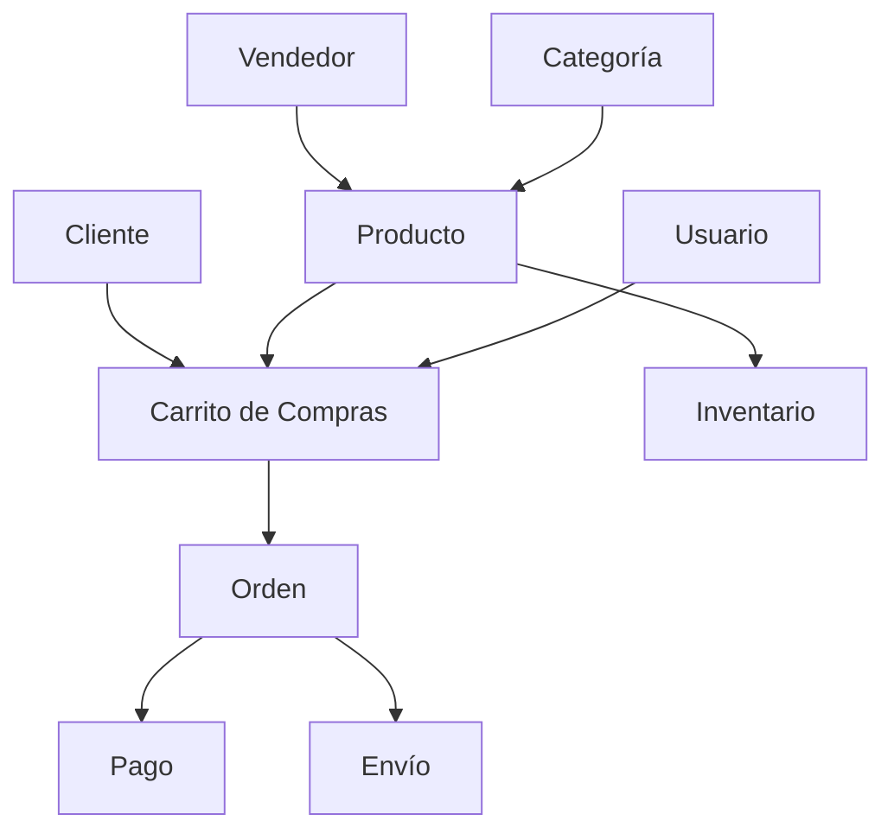

# 🛒 Proyecto: Sistema de E-commerce con Structs

## 🎯 Objetivo del Proyecto

Implementar un sistema completo de e-commerce que demuestre el uso avanzado de structs en Go, incluyendo:

- Modelado de datos complejos
- Embedding y composition  
- Validación de datos
- Patrones de diseño
- Manejo de estados
- Transacciones

## 📋 Especificaciones

### 🏗️ Arquitectura del Sistema

### 📦 Entidades Principales

#### 1. **Usuario y Autenticación**
- Información personal y contacto
- Direcciones múltiples
- Historial de compras
- Preferencias y configuración

#### 2. **Productos y Catálogo**
- Información del producto
- Variantes (talla, color, etc.)
- Imágenes y descripciones
- Precios y descuentos
- Reviews y ratings

#### 3. **Inventario y Stock**
- Control de existencias
- Reservas temporales
- Alertas de stock bajo
- Movimientos de inventario

#### 4. **Carrito y Compras**
- Gestión de items
- Cálculos de precios
- Aplicación de cupones
- Validación de disponibilidad

#### 5. **Órdenes y Transacciones**
- Estados de orden
- Procesamiento de pagos
- Gestión de envíos
- Historial y tracking

### 🔧 Funcionalidades Requeridas

#### ✅ **Gestión de Usuarios**
- [ ] Registro y autenticación
- [ ] Perfiles de usuario
- [ ] Gestión de direcciones
- [ ] Historial de pedidos

#### ✅ **Catálogo de Productos**
- [ ] CRUD de productos
- [ ] Categorización
- [ ] Búsqueda y filtros
- [ ] Sistema de reviews

#### ✅ **Carrito de Compras**
- [ ] Agregar/quitar productos
- [ ] Modificar cantidades
- [ ] Cálculo de totales
- [ ] Persistencia temporal

#### ✅ **Procesamiento de Órdenes**
- [ ] Creación de órdenes
- [ ] Validación de stock
- [ ] Cálculo de envío
- [ ] Estados de orden

#### ✅ **Sistema de Pagos**
- [ ] Múltiples métodos de pago
- [ ] Validación de pagos
- [ ] Reembolsos
- [ ] Historial de transacciones

#### ✅ **Gestión de Inventario**
- [ ] Control de stock
- [ ] Reservas automáticas
- [ ] Alertas de inventario
- [ ] Reportes de movimientos

### 📊 Conceptos de Structs Demostrados

1. **Struct Básicos** - Entidades fundamentales
2. **Embedding** - Composición de funcionalidades
3. **Tags** - Serialización y validación
4. **Métodos** - Comportamientos de entidades
5. **Interfaces** - Contratos y polimorfismo
6. **Factory Pattern** - Creación de objetos
7. **Builder Pattern** - Configuración compleja
8. **State Pattern** - Gestión de estados

### 🧪 Casos de Prueba

#### **Escenario 1: Compra Exitosa**
1. Usuario registra cuenta
2. Navega catálogo y agrega productos
3. Revisa carrito y aplica cupón
4. Procede al checkout
5. Selecciona dirección y método de pago
6. Confirma orden
7. Sistema procesa pago y reserva stock
8. Genera orden y notificación

#### **Escenario 2: Stock Insuficiente**
1. Usuario intenta comprar producto con stock limitado
2. Sistema detecta insuficiencia
3. Ofrece alternativas o lista de espera
4. Actualiza carrito automáticamente

#### **Escenario 3: Cancelación de Orden**
1. Usuario cancela orden antes del envío
2. Sistema libera stock reservado
3. Procesa reembolso si aplica
4. Actualiza estado de la orden

### 📈 Extensiones Avanzadas

- **Recomendaciones** - Sistema de productos sugeridos
- **Wishlist** - Lista de deseos del usuario
- **Comparación** - Comparar productos side-by-side
- **Multi-vendedor** - Marketplace con múltiples vendedores
- **Subscripciones** - Productos con entrega periódica
- **Analytics** - Métricas de comportamiento del usuario

### 🏆 Criterios de Evaluación

- **Modelado correcto** de entidades con structs
- **Uso apropiado** de embedding y composition
- **Implementación** de validaciones robustas
- **Aplicación** de patrones de diseño
- **Manejo eficiente** de estados y transiciones
- **Código limpio** y bien documentado

---

**¡Implementa este sistema paso a paso para dominar completamente los structs en Go!** 🚀
