# 🎪 Lección 13: Interfaces Básicas en Go

> **Nivel**: Fundamentos  
> **Duración estimada**: 6-7 horas  
> **Prerrequisitos**: Structs, métodos, funciones

## 🎯 Objetivos de Aprendizaje

Al finalizar esta lección, podrás:

- ✅ **Entender qué son las interfaces** y por qué son cruciales en Go
- ✅ **Declarar e implementar** interfaces implícitamente
- ✅ **Usar polimorfismo** para escribir código flexible
- ✅ **Trabajar con interfaces estándar** como `io.Reader`, `fmt.Stringer`
- ✅ **Implementar type assertions** y type switches
- ✅ **Crear abstracciones** poderosas con interfaces
- ✅ **Aplicar patrones de diseño** usando interfaces
- ✅ **Manejar la empty interface** `interface{}`

---

## 📚 Tabla de Contenidos

1. [¿Qué son las Interfaces?](#-1-qué-son-las-interfaces)
2. [Declaración e Implementación](#-2-declaración-e-implementación)
3. [Implementación Implícita](#-3-implementación-implícita)
4. [Polimorfismo en Go](#-4-polimorfismo-en-go)
5. [Interfaces Estándar](#-5-interfaces-estándar)
6. [Type Assertions](#-6-type-assertions)
7. [Empty Interface](#-7-empty-interface)
8. [Patrones con Interfaces](#-8-patrones-con-interfaces)
9. [Best Practices](#-9-best-practices)
10. [Ejercicios Prácticos](#-10-ejercicios-prácticos)

---

## 🔍 1. ¿Qué son las Interfaces?

### 🧠 Analogía: Interfaces como Contratos

Imagina las interfaces como **contratos legales**:

- **El contrato** define qué debe hacer (la interface)
- **Las empresas** implementan el contrato de diferentes maneras (tipos que implementan la interface)
- **El cliente** solo necesita saber del contrato, no la implementación específica

```go
// Contrato: "Cualquier cosa que pueda hacer sonido"
type Sonador interface {
    HacerSonido() string
}

// Diferentes implementaciones del contrato
type Perro struct{ Nombre string }
func (p Perro) HacerSonido() string { return "Guau!" }

type Gato struct{ Nombre string }
func (g Gato) HacerSonido() string { return "Miau!" }

type Motor struct{ Tipo string }
func (m Motor) HacerSonido() string { return "Vroom!" }
```

### 🎯 ¿Por Qué Son Importantes?

Las interfaces son **el mecanismo principal** de abstracción en Go:

```mermaid
graph TB
    A[Código Cliente] --> B[Interface]
    B --> C[Implementación A]
    B --> D[Implementación B]
    B --> E[Implementación C]
    
    style B fill:#00ADD8
    style A fill:#FFE4B5
```



**Beneficios:**
- 🔄 **Flexibilidad**: Cambiar implementaciones sin tocar el código cliente
- 🧪 **Testabilidad**: Fácil mocking e testing
- 📦 **Modularidad**: Separación de responsabilidades
- 🔌 **Extensibilidad**: Agregar nuevas implementaciones fácilmente

---

## 📝 2. Declaración e Implementación

### Sintaxis Básica

```go
// Declaración de interface
type NombreInterface interface {
    Metodo1() TipoRetorno
    Metodo2(parametro Tipo) (resultado Tipo, error error)
    // ... más métodos
}
```

### Ejemplo Completo

```go
package main

import "fmt"

// 1. Declarar la interface
type Forma interface {
    Area() float64
    Perimetro() float64
    String() string
}

// 2. Tipos que implementan la interface
type Rectangulo struct {
    Ancho, Alto float64
}

func (r Rectangulo) Area() float64 {
    return r.Ancho * r.Alto
}

func (r Rectangulo) Perimetro() float64 {
    return 2 * (r.Ancho + r.Alto)
}

func (r Rectangulo) String() string {
    return fmt.Sprintf("Rectángulo(%.1f x %.1f)", r.Ancho, r.Alto)
}

type Circulo struct {
    Radio float64
}

func (c Circulo) Area() float64 {
    return 3.14159 * c.Radio * c.Radio
}

func (c Circulo) Perimetro() float64 {
    return 2 * 3.14159 * c.Radio
}

func (c Circulo) String() string {
    return fmt.Sprintf("Círculo(radio: %.1f)", c.Radio)
}

// 3. Función que usa la interface
func ImprimirInfo(f Forma) {
    fmt.Printf("%s\n", f.String())
    fmt.Printf("  Área: %.2f\n", f.Area())
    fmt.Printf("  Perímetro: %.2f\n", f.Perimetro())
    fmt.Println()
}

func main() {
    formas := []Forma{
        Rectangulo{Ancho: 5, Alto: 3},
        Circulo{Radio: 2.5},
        Rectangulo{Ancho: 4, Alto: 4},
    }
    
    for _, forma := range formas {
        ImprimirInfo(forma)
    }
}
```

---

## 🔀 3. Implementación Implícita

### El Poder de la Implementación Implícita

En Go, **no necesitas declarar** que implementas una interface:

```go
// ❌ Otros lenguajes (Java, C#)
class Perro implements Animal {
    // implementación
}

// ✅ Go - Implementación automática
type Animal interface {
    Sonido() string
}

type Perro struct{}
func (p Perro) Sonido() string { return "Guau" }

// ¡Perro implementa Animal automáticamente!
```

### Ventajas de la Implementación Implícita

```mermaid
graph LR
    A[Implementación Implícita] --> B[Desacoplamiento]
    A --> C[Reutilización]
    A --> D[Testing Fácil]
    A --> E[Evolución Gradual]
```



**Ejemplo Práctico:**

```go
package main

import (
    "fmt"
    "time"
)

// Interface para loggers
type Logger interface {
    Log(mensaje string)
}

// Implementación para consola
type ConsoleLogger struct{}

func (cl ConsoleLogger) Log(mensaje string) {
    fmt.Printf("[CONSOLE] %s: %s\n", time.Now().Format("15:04:05"), mensaje)
}

// Implementación para archivo (simulada)
type FileLogger struct {
    archivo string
}

func (fl FileLogger) Log(mensaje string) {
    fmt.Printf("[FILE:%s] %s: %s\n", fl.archivo, time.Now().Format("15:04:05"), mensaje)
}

// Servicio que usa cualquier logger
type UserService struct {
    logger Logger
}

func (us UserService) CrearUsuario(nombre string) {
    // Lógica de creación...
    us.logger.Log(fmt.Sprintf("Usuario creado: %s", nombre))
}

func main() {
    // Fácil intercambio de implementaciones
    consoleLogger := ConsoleLogger{}
    fileLogger := FileLogger{archivo: "app.log"}
    
    service1 := UserService{logger: consoleLogger}
    service2 := UserService{logger: fileLogger}
    
    service1.CrearUsuario("Juan")
    service2.CrearUsuario("María")
}
```

---

## 🎭 4. Polimorfismo en Go

### Concepto de Polimorfismo

**Polimorfismo** = "Muchas formas". Una interface puede tomar múltiples formas:

```go
package main

import "fmt"

// Interface común
type Vehiculo interface {
    Acelerar() string
    Frenar() string
    Klaxon() string
}

// Diferentes implementaciones
type Auto struct{ Marca string }
func (a Auto) Acelerar() string { return "🚗 Acelerando suavemente" }
func (a Auto) Frenar() string   { return "🛑 Frenando con discos" }
func (a Auto) Klaxon() string   { return "🔊 Beep beep!" }

type Moto struct{ Cilindrada int }
func (m Moto) Acelerar() string { return "🏍️ ¡Aceleración rápida!" }
func (m Moto) Frenar() string   { return "🛑 Frenando con precaución" }
func (m Moto) Klaxon() string   { return "📯 ¡Piiip!" }

type Camion struct{ Carga int }
func (c Camion) Acelerar() string { return "🚛 Acelerando pesadamente" }
func (c Camion) Frenar() string   { return "🛑 Frenando gradualmente" }
func (c Camion) Klaxon() string   { return "📢 ¡HOOOOONK!" }

// Función polimórfica
func ConducirVehiculo(v Vehiculo) {
    fmt.Println("Iniciando conducción...")
    fmt.Println(v.Klaxon())
    fmt.Println(v.Acelerar())
    fmt.Println("Llegando al destino...")
    fmt.Println(v.Frenar())
    fmt.Println("---")
}

func main() {
    vehiculos := []Vehiculo{
        Auto{Marca: "Toyota"},
        Moto{Cilindrada: 600},
        Camion{Carga: 5000},
    }
    
    for _, vehiculo := range vehiculos {
        ConducirVehiculo(vehiculo)
    }
}
```

### Ejemplo Avanzado: Sistema de Notificaciones

```go
package main

import (
    "fmt"
    "time"
)

// Interface para proveedores de notificaciones
type NotificationProvider interface {
    Send(mensaje string, destinatario string) error
    GetType() string
}

// Implementación Email
type EmailProvider struct {
    servidor string
}

func (e EmailProvider) Send(mensaje, destinatario string) error {
    fmt.Printf("📧 Enviando email a %s vía %s: %s\n", destinatario, e.servidor, mensaje)
    return nil
}

func (e EmailProvider) GetType() string {
    return "EMAIL"
}

// Implementación SMS
type SMSProvider struct {
    apiKey string
}

func (s SMSProvider) Send(mensaje, destinatario string) error {
    fmt.Printf("📱 Enviando SMS a %s: %s\n", destinatario, mensaje)
    return nil
}

func (s SMSProvider) GetType() string {
    return "SMS"
}

// Implementación Push Notification
type PushProvider struct {
    appId string
}

func (p PushProvider) Send(mensaje, destinatario string) error {
    fmt.Printf("🔔 Enviando push a %s (app: %s): %s\n", destinatario, p.appId, mensaje)
    return nil
}

func (p PushProvider) GetType() string {
    return "PUSH"
}

// Servicio de notificaciones
type NotificationService struct {
    providers []NotificationProvider
}

func (ns NotificationService) SendToAll(mensaje, destinatario string) {
    fmt.Printf("Enviando mensaje: '%s' a %s\n", mensaje, destinatario)
    
    for _, provider := range ns.providers {
        fmt.Printf("[%s] ", provider.GetType())
        if err := provider.Send(mensaje, destinatario); err != nil {
            fmt.Printf("❌ Error: %v\n", err)
        } else {
            fmt.Printf("✅ Enviado\n")
        }
    }
    fmt.Println("---")
}

func main() {
    service := NotificationService{
        providers: []NotificationProvider{
            EmailProvider{servidor: "smtp.gmail.com"},
            SMSProvider{apiKey: "ABC123"},
            PushProvider{appId: "com.example.app"},
        },
    }
    
    service.SendToAll("¡Bienvenido!", "juan@email.com")
    service.SendToAll("Tu pedido está listo", "555-1234")
}
```

---

## 📚 5. Interfaces Estándar

### Interfaces del Paquete Standard

Go incluye muchas interfaces útiles en la standard library:

#### 5.1 `fmt.Stringer`

```go
package main

import "fmt"

type Stringer interface {
    String() string
}

type Persona struct {
    Nombre string
    Edad   int
    Email  string
}

// Implementar fmt.Stringer
func (p Persona) String() string {
    return fmt.Sprintf("%s (%d años) - %s", p.Nombre, p.Edad, p.Email)
}

func main() {
    p := Persona{
        Nombre: "Ana García",
        Edad:   28,
        Email:  "ana@email.com",
    }
    
    // fmt.Println usa automáticamente String() si está implementado
    fmt.Println(p)  // Ana García (28 años) - ana@email.com
    
    // También puedes llamarlo directamente
    fmt.Printf("Información: %s\n", p.String())
}
```

#### 5.2 `io.Reader` y `io.Writer`

```go
package main

import (
    "fmt"
    "io"
    "strings"
)

// Ejemplo con io.Reader
func ProcesarTexto(r io.Reader) (string, error) {
    buf := make([]byte, 1024)
    n, err := r.Read(buf)
    if err != nil && err != io.EOF {
        return "", err
    }
    
    return string(buf[:n]), nil
}

func main() {
    // strings.Reader implementa io.Reader
    texto := "¡Hola desde un string!"
    reader := strings.NewReader(texto)
    
    resultado, err := ProcesarTexto(reader)
    if err != nil {
        fmt.Printf("Error: %v\n", err)
        return
    }
    
    fmt.Printf("Texto procesado: %s\n", resultado)
}
```

#### 5.3 `sort.Interface`

```go
package main

import (
    "fmt"
    "sort"
)

type Producto struct {
    Nombre string
    Precio float64
}

// Slice de productos
type ProductosPorPrecio []Producto

// Implementar sort.Interface
func (p ProductosPorPrecio) Len() int           { return len(p) }
func (p ProductosPorPrecio) Swap(i, j int)      { p[i], p[j] = p[j], p[i] }
func (p ProductosPorPrecio) Less(i, j int) bool { return p[i].Precio < p[j].Precio }

func main() {
    productos := ProductosPorPrecio{
        {"Laptop", 1200.50},
        {"Mouse", 25.99},
        {"Teclado", 75.00},
        {"Monitor", 350.00},
    }
    
    fmt.Println("Antes de ordenar:")
    for _, p := range productos {
        fmt.Printf("  %s: $%.2f\n", p.Nombre, p.Precio)
    }
    
    sort.Sort(productos)
    
    fmt.Println("\nDespués de ordenar por precio:")
    for _, p := range productos {
        fmt.Printf("  %s: $%.2f\n", p.Nombre, p.Precio)
    }
}
```

---

## 🔍 6. Type Assertions

### ¿Qué son las Type Assertions?

Type assertions permiten **extraer el valor concreto** de una interface:

```go
// Sintaxis
valor := interfaceVar.(TipoConcreto)

// Forma segura (no panic)
valor, ok := interfaceVar.(TipoConcreto)
```

### Ejemplo Básico

```go
package main

import "fmt"

func procesarValor(v interface{}) {
    // Type assertion con verificación
    if str, ok := v.(string); ok {
        fmt.Printf("Es un string: %s (longitud: %d)\n", str, len(str))
        return
    }
    
    if num, ok := v.(int); ok {
        fmt.Printf("Es un int: %d (doble: %d)\n", num, num*2)
        return
    }
    
    if f, ok := v.(float64); ok {
        fmt.Printf("Es un float64: %.2f (cuadrado: %.2f)\n", f, f*f)
        return
    }
    
    fmt.Printf("Tipo desconocido: %T con valor: %v\n", v, v)
}

func main() {
    valores := []interface{}{
        "Hola mundo",
        42,
        3.14159,
        true,
        []int{1, 2, 3},
    }
    
    for i, v := range valores {
        fmt.Printf("Valor %d: ", i+1)
        procesarValor(v)
    }
}
```

### Type Switch

Una forma más elegante de manejar múltiples tipos:

```go
package main

import "fmt"

func analizarTipo(v interface{}) {
    switch valor := v.(type) {
    case string:
        fmt.Printf("String: '%s' (caracteres: %d)\n", valor, len(valor))
    case int:
        fmt.Printf("Integer: %d (es par: %t)\n", valor, valor%2 == 0)
    case float64:
        fmt.Printf("Float: %.2f (raíz: %.2f)\n", valor, valor*valor)
    case bool:
        fmt.Printf("Boolean: %t (negado: %t)\n", valor, !valor)
    case []int:
        fmt.Printf("Slice de int: %v (suma: %d)\n", valor, suma(valor))
    case nil:
        fmt.Println("Valor nil")
    default:
        fmt.Printf("Tipo desconocido: %T = %v\n", valor, valor)
    }
}

func suma(nums []int) int {
    total := 0
    for _, n := range nums {
        total += n
    }
    return total
}

func main() {
    elementos := []interface{}{
        "Go es genial",
        123,
        45.67,
        true,
        []int{1, 2, 3, 4, 5},
        nil,
        map[string]int{"a": 1},
    }
    
    for i, elem := range elementos {
        fmt.Printf("%d. ", i+1)
        analizarTipo(elem)
    }
}
```

---

## 🌌 7. Empty Interface

### ¿Qué es `interface{}`?

La **empty interface** puede contener **cualquier tipo**:

```go
var x interface{}

x = 42
x = "hola"
x = []int{1, 2, 3}
x = map[string]int{"a": 1}
// ¡Todo es válido!
```

### Casos de Uso Comunes

#### 7.1 Funciones Genéricas (pre-generics)

```go
package main

import (
    "fmt"
    "reflect"
)

// Función que imprime cualquier valor con detalle
func InspeccionarValor(v interface{}) {
    fmt.Printf("=== Inspección de Valor ===\n")
    fmt.Printf("Tipo: %T\n", v)
    fmt.Printf("Valor: %v\n", v)
    fmt.Printf("Tipo reflect: %s\n", reflect.TypeOf(v))
    fmt.Printf("Kind: %s\n", reflect.ValueOf(v).Kind())
    
    // Información específica según el tipo
    switch valor := v.(type) {
    case string:
        fmt.Printf("Longitud: %d caracteres\n", len(valor))
    case []interface{}:
        fmt.Printf("Longitud del slice: %d elementos\n", len(valor))
    case map[string]interface{}:
        fmt.Printf("Claves del map: %d\n", len(valor))
    }
    fmt.Println("========================\n")
}

func main() {
    datos := []interface{}{
        "Texto de ejemplo",
        []interface{}{1, "dos", 3.0},
        map[string]interface{}{
            "nombre": "Juan",
            "edad":   30,
            "activo": true,
        },
        42,
    }
    
    for _, dato := range datos {
        InspeccionarValor(dato)
    }
}
```

#### 7.2 Manejo de JSON Dinámico

```go
package main

import (
    "encoding/json"
    "fmt"
)

func procesarJSON(jsonStr string) {
    var data interface{}
    
    err := json.Unmarshal([]byte(jsonStr), &data)
    if err != nil {
        fmt.Printf("Error parsing JSON: %v\n", err)
        return
    }
    
    fmt.Printf("JSON parseado exitosamente:\n")
    procesarValorJSON(data, 0)
    fmt.Println()
}

func procesarValorJSON(v interface{}, indent int) {
    espacios := ""
    for i := 0; i < indent; i++ {
        espacios += "  "
    }
    
    switch valor := v.(type) {
    case map[string]interface{}:
        fmt.Printf("%sObjeto {\n", espacios)
        for k, v := range valor {
            fmt.Printf("%s  %s: ", espacios, k)
            procesarValorJSON(v, indent+1)
        }
        fmt.Printf("%s}\n", espacios)
    case []interface{}:
        fmt.Printf("%sArray [\n", espacios)
        for i, v := range valor {
            fmt.Printf("%s  [%d]: ", espacios, i)
            procesarValorJSON(v, indent+1)
        }
        fmt.Printf("%s]\n", espacios)
    case string:
        fmt.Printf("\"%s\" (string)\n", valor)
    case float64:
        fmt.Printf("%.2f (number)\n", valor)
    case bool:
        fmt.Printf("%t (boolean)\n", valor)
    case nil:
        fmt.Printf("null\n")
    default:
        fmt.Printf("%v (%T)\n", valor, valor)
    }
}

func main() {
    ejemplosJSON := []string{
        `{"nombre": "Juan", "edad": 30, "activo": true}`,
        `[1, 2, "tres", true, null]`,
        `{
            "usuario": {
                "id": 123,
                "perfil": {
                    "nombre": "Ana",
                    "habilidades": ["Go", "Python", "JavaScript"]
                }
            }
        }`,
    }
    
    for i, json := range ejemplosJSON {
        fmt.Printf("=== Ejemplo JSON %d ===\n", i+1)
        procesarJSON(json)
    }
}
```

---

## 🎨 8. Patrones con Interfaces

### 8.1 Strategy Pattern

```go
package main

import "fmt"

// Interface para estrategias de cálculo de precios
type PricingStrategy interface {
    CalculatePrice(basePrice float64) float64
    GetName() string
}

// Estrategia: Sin descuento
type RegularPricing struct{}

func (r RegularPricing) CalculatePrice(basePrice float64) float64 {
    return basePrice
}

func (r RegularPricing) GetName() string {
    return "Precio Regular"
}

// Estrategia: Descuento por porcentaje
type PercentageDiscount struct {
    Percentage float64
}

func (p PercentageDiscount) CalculatePrice(basePrice float64) float64 {
    return basePrice * (1 - p.Percentage/100)
}

func (p PercentageDiscount) GetName() string {
    return fmt.Sprintf("Descuento del %.0f%%", p.Percentage)
}

// Estrategia: Descuento fijo
type FixedDiscount struct {
    Amount float64
}

func (f FixedDiscount) CalculatePrice(basePrice float64) float64 {
    result := basePrice - f.Amount
    if result < 0 {
        return 0
    }
    return result
}

func (f FixedDiscount) GetName() string {
    return fmt.Sprintf("Descuento fijo de $%.2f", f.Amount)
}

// Contexto que usa la estrategia
type PriceCalculator struct {
    strategy PricingStrategy
}

func (pc *PriceCalculator) SetStrategy(strategy PricingStrategy) {
    pc.strategy = strategy
}

func (pc PriceCalculator) Calculate(basePrice float64) (float64, string) {
    if pc.strategy == nil {
        pc.strategy = RegularPricing{}
    }
    return pc.strategy.CalculatePrice(basePrice), pc.strategy.GetName()
}

func main() {
    calculator := PriceCalculator{}
    basePrice := 100.0
    
    strategies := []PricingStrategy{
        RegularPricing{},
        PercentageDiscount{Percentage: 15},
        PercentageDiscount{Percentage: 30},
        FixedDiscount{Amount: 25},
        FixedDiscount{Amount: 150}, // Más que el precio base
    }
    
    fmt.Printf("Precio base: $%.2f\n\n", basePrice)
    
    for i, strategy := range strategies {
        calculator.SetStrategy(strategy)
        finalPrice, strategyName := calculator.Calculate(basePrice)
        
        fmt.Printf("%d. %s\n", i+1, strategyName)
        fmt.Printf("   Precio final: $%.2f\n", finalPrice)
        fmt.Printf("   Ahorro: $%.2f\n\n", basePrice-finalPrice)
    }
}
```

### 8.2 Observer Pattern

```go
package main

import "fmt"

// Interface para observadores
type Observer interface {
    Update(evento string, data interface{})
    GetID() string
}

// Interface para sujetos observables
type Subject interface {
    Subscribe(observer Observer)
    Unsubscribe(observerID string)
    Notify(evento string, data interface{})
}

// Implementación de Subject
type EventManager struct {
    observers map[string]Observer
}

func NewEventManager() *EventManager {
    return &EventManager{
        observers: make(map[string]Observer),
    }
}

func (em *EventManager) Subscribe(observer Observer) {
    em.observers[observer.GetID()] = observer
    fmt.Printf("✅ Observer '%s' suscrito\n", observer.GetID())
}

func (em *EventManager) Unsubscribe(observerID string) {
    delete(em.observers, observerID)
    fmt.Printf("❌ Observer '%s' desuscrito\n", observerID)
}

func (em *EventManager) Notify(evento string, data interface{}) {
    fmt.Printf("📢 Notificando evento: %s\n", evento)
    for _, observer := range em.observers {
        observer.Update(evento, data)
    }
    fmt.Println()
}

// Observador: Logger
type Logger struct {
    id string
}

func (l Logger) Update(evento string, data interface{}) {
    fmt.Printf("  [LOG-%s] Evento '%s': %v\n", l.id, evento, data)
}

func (l Logger) GetID() string {
    return l.id
}

// Observador: Email notifier
type EmailNotifier struct {
    email string
}

func (e EmailNotifier) Update(evento string, data interface{}) {
    fmt.Printf("  [EMAIL] Enviando a %s - Evento '%s': %v\n", e.email, evento, data)
}

func (e EmailNotifier) GetID() string {
    return "email_" + e.email
}

// Observador: Analytics
type Analytics struct {
    service string
}

func (a Analytics) Update(evento string, data interface{}) {
    fmt.Printf("  [ANALYTICS-%s] Tracking evento '%s': %v\n", a.service, evento, data)
}

func (a Analytics) GetID() string {
    return "analytics_" + a.service
}

func main() {
    // Crear event manager
    eventManager := NewEventManager()
    
    // Crear observadores
    logger := Logger{id: "main"}
    emailer := EmailNotifier{email: "admin@example.com"}
    analytics := Analytics{service: "GoogleAnalytics"}
    
    // Suscribir observadores
    eventManager.Subscribe(logger)
    eventManager.Subscribe(emailer)
    eventManager.Subscribe(analytics)
    
    fmt.Println()
    
    // Generar eventos
    eventManager.Notify("user_login", map[string]interface{}{
        "user_id": 123,
        "ip":      "192.168.1.1",
    })
    
    eventManager.Notify("purchase", map[string]interface{}{
        "user_id": 123,
        "amount":  99.99,
        "items":   []string{"laptop", "mouse"},
    })
    
    // Desuscribir un observador
    eventManager.Unsubscribe("email_admin@example.com")
    
    eventManager.Notify("user_logout", map[string]interface{}{
        "user_id": 123,
        "session_duration": "45m",
    })
}
```

### 8.3 Factory Pattern

```go
package main

import (
    "fmt"
    "strings"
)

// Interface para productos
type Database interface {
    Connect() string
    Query(sql string) []string
    Close() string
    GetType() string
}

// Implementación MySQL
type MySQL struct {
    host string
    port int
}

func (m MySQL) Connect() string {
    return fmt.Sprintf("Conectado a MySQL en %s:%d", m.host, m.port)
}

func (m MySQL) Query(sql string) []string {
    return []string{
        fmt.Sprintf("MySQL ejecutando: %s", sql),
        "Resultado: [fila1, fila2, fila3]",
    }
}

func (m MySQL) Close() string {
    return "Conexión MySQL cerrada"
}

func (m MySQL) GetType() string {
    return "MySQL"
}

// Implementación PostgreSQL
type PostgreSQL struct {
    host     string
    database string
}

func (p PostgreSQL) Connect() string {
    return fmt.Sprintf("Conectado a PostgreSQL: %s/%s", p.host, p.database)
}

func (p PostgreSQL) Query(sql string) []string {
    return []string{
        fmt.Sprintf("PostgreSQL ejecutando: %s", sql),
        "Resultado: {col1: val1, col2: val2}",
    }
}

func (p PostgreSQL) Close() string {
    return "Conexión PostgreSQL cerrada"
}

func (p PostgreSQL) GetType() string {
    return "PostgreSQL"
}

// Implementación MongoDB
type MongoDB struct {
    uri        string
    collection string
}

func (m MongoDB) Connect() string {
    return fmt.Sprintf("Conectado a MongoDB: %s (colección: %s)", m.uri, m.collection)
}

func (m MongoDB) Query(sql string) []string {
    return []string{
        fmt.Sprintf("MongoDB ejecutando query: %s", sql),
        "Resultado: [{_id: 1, data: 'doc1'}, {_id: 2, data: 'doc2'}]",
    }
}

func (m MongoDB) Close() string {
    return "Conexión MongoDB cerrada"
}

func (m MongoDB) GetType() string {
    return "MongoDB"
}

// Factory Interface
type DatabaseFactory interface {
    CreateDatabase(config map[string]string) Database
}

// Factory concreto
type DBFactory struct{}

func (f DBFactory) CreateDatabase(config map[string]string) Database {
    dbType := strings.ToLower(config["type"])
    
    switch dbType {
    case "mysql":
        return MySQL{
            host: config["host"],
            port: 3306, // valor por defecto
        }
    case "postgresql", "postgres":
        return PostgreSQL{
            host:     config["host"],
            database: config["database"],
        }
    case "mongodb", "mongo":
        return MongoDB{
            uri:        config["uri"],
            collection: config["collection"],
        }
    default:
        // Retornar MySQL como default
        return MySQL{host: "localhost", port: 3306}
    }
}

// Cliente que usa la factory
func EjecutarOperacionesDB(factory DatabaseFactory, config map[string]string) {
    fmt.Printf("=== Configuración: %v ===\n", config)
    
    // Crear base de datos usando factory
    db := factory.CreateDatabase(config)
    
    // Usar la base de datos (polimorfismo)
    fmt.Printf("Tipo de DB: %s\n", db.GetType())
    fmt.Println(db.Connect())
    
    queries := []string{
        "SELECT * FROM users",
        "SELECT name, email FROM customers WHERE active = true",
    }
    
    for _, query := range queries {
        results := db.Query(query)
        for _, result := range results {
            fmt.Printf("  %s\n", result)
        }
    }
    
    fmt.Println(db.Close())
    fmt.Println()
}

func main() {
    factory := DBFactory{}
    
    configuraciones := []map[string]string{
        {
            "type": "mysql",
            "host": "mysql-server.com",
        },
        {
            "type": "postgresql",
            "host":     "postgres-server.com",
            "database": "myapp",
        },
        {
            "type":       "mongodb",
            "uri":        "mongodb://mongo-server.com:27017",
            "collection": "documents",
        },
        {
            "type": "unknown", // Fallback a MySQL
            "host": "fallback-server.com",
        },
    }
    
    for _, config := range configuraciones {
        EjecutarOperacionesDB(factory, config)
    }
}
```

---

## 💡 9. Best Practices

### 9.1 Diseño de Interfaces

#### ✅ **Interfaces Pequeñas y Cohesivas**

```go
// ✅ Bueno - Interface pequeña y enfocada
type Reader interface {
    Read([]byte) (int, error)
}

// ❌ Malo - Interface muy grande
type DatabaseInterface interface {
    Connect() error
    Query(string) ([]Row, error)
    Insert(string, ...interface{}) error
    Update(string, ...interface{}) error
    Delete(string, ...interface{}) error
    BeginTransaction() error
    CommitTransaction() error
    RollbackTransaction() error
    CreateIndex(string) error
    DropIndex(string) error
    // ... 20 métodos más
}
```

#### ✅ **Nombrado Descriptivo**

```go
// ✅ Bueno - Nombres claros
type UserValidator interface {
    ValidateEmail(email string) error
    ValidatePassword(password string) error
}

type FileProcessor interface {
    ProcessFile(filepath string) error
}

// ❌ Malo - Nombres genéricos
type Handler interface {
    Handle(data interface{}) error
}

type Manager interface {
    Do(thing string) error
}
```

### 9.2 Implementación de Interfaces

#### ✅ **Implementar Solo lo Necesario**

```go
// ✅ Bueno - Implementación mínima necesaria
type SimpleLogger struct{}

func (s SimpleLogger) Log(message string) {
    fmt.Println(message)
}

// ❌ Malo - Implementación innecesariamente compleja
type ComplexLogger struct {
    levels    map[string]int
    formatters map[string]func(string) string
    outputs   []io.Writer
    // ... muchos campos más
}
```

#### ✅ **Usar Composition para Interfaces Complejas**

```go
// ✅ Bueno - Composition de interfaces simples
type Reader interface {
    Read([]byte) (int, error)
}

type Writer interface {
    Write([]byte) (int, error)
}

type Closer interface {
    Close() error
}

// Componer interfaces más complejas
type ReadWriter interface {
    Reader
    Writer
}

type ReadWriteCloser interface {
    Reader
    Writer
    Closer
}
```

### 9.3 Testing con Interfaces

```go
package main

import (
    "fmt"
    "testing"
)

// Interface para servicio externo
type PaymentProcessor interface {
    ProcessPayment(amount float64, cardToken string) (*PaymentResult, error)
}

type PaymentResult struct {
    TransactionID string
    Status        string
    Message       string
}

// Implementación real
type StripeProcessor struct {
    apiKey string
}

func (s StripeProcessor) ProcessPayment(amount float64, cardToken string) (*PaymentResult, error) {
    // En realidad haría llamada a Stripe API
    return &PaymentResult{
        TransactionID: "stripe_123456",
        Status:        "success",
        Message:       "Payment processed successfully",
    }, nil
}

// Servicio que usa el processor
type OrderService struct {
    paymentProcessor PaymentProcessor
}

func (os OrderService) CompleteOrder(orderID string, amount float64, cardToken string) error {
    fmt.Printf("Procesando orden %s por $%.2f\n", orderID, amount)
    
    result, err := os.paymentProcessor.ProcessPayment(amount, cardToken)
    if err != nil {
        return fmt.Errorf("error procesando pago: %w", err)
    }
    
    fmt.Printf("Pago completado: %s (%s)\n", result.TransactionID, result.Status)
    return nil
}

// Mock para testing
type MockPaymentProcessor struct {
    shouldFail bool
    results    []*PaymentResult
    calls      []PaymentCall
}

type PaymentCall struct {
    Amount    float64
    CardToken string
}

func (m *MockPaymentProcessor) ProcessPayment(amount float64, cardToken string) (*PaymentResult, error) {
    m.calls = append(m.calls, PaymentCall{
        Amount:    amount,
        CardToken: cardToken,
    })
    
    if m.shouldFail {
        return nil, fmt.Errorf("mock payment error")
    }
    
    if len(m.results) > 0 {
        result := m.results[0]
        m.results = m.results[1:]
        return result, nil
    }
    
    return &PaymentResult{
        TransactionID: "mock_tx_123",
        Status:        "success",
        Message:       "Mock payment successful",
    }, nil
}

func (m *MockPaymentProcessor) GetCalls() []PaymentCall {
    return m.calls
}

// Test usando mock
func TestOrderService_CompleteOrder(t *testing.T) {
    // Configurar mock
    mockProcessor := &MockPaymentProcessor{
        shouldFail: false,
        results: []*PaymentResult{
            {
                TransactionID: "test_123",
                Status:        "success",
                Message:       "Test payment",
            },
        },
    }
    
    // Crear servicio con mock
    service := OrderService{paymentProcessor: mockProcessor}
    
    // Ejecutar operación
    err := service.CompleteOrder("order_456", 99.99, "card_token_789")
    
    // Verificar resultados
    if err != nil {
        t.Errorf("No se esperaba error, pero se obtuvo: %v", err)
    }
    
    calls := mockProcessor.GetCalls()
    if len(calls) != 1 {
        t.Errorf("Se esperaba 1 llamada al processor, pero se obtuvieron %d", len(calls))
    }
    
    if calls[0].Amount != 99.99 {
        t.Errorf("Se esperaba amount 99.99, pero se obtuvo %.2f", calls[0].Amount)
    }
    
    if calls[0].CardToken != "card_token_789" {
        t.Errorf("Se esperaba cardToken 'card_token_789', pero se obtuvo '%s'", calls[0].CardToken)
    }
}

func main() {
    // Usar implementación real
    realProcessor := StripeProcessor{apiKey: "sk_test_..."}
    service := OrderService{paymentProcessor: realProcessor}
    
    service.CompleteOrder("order_123", 49.99, "tok_visa")
    
    fmt.Println("\n--- Ejecutando test ---")
    // En un test real, esto se ejecutaría con 'go test'
    TestOrderService_CompleteOrder(&testing.T{})
    fmt.Println("✅ Test pasó exitosamente")
}
```

---

## 🎯 10. Ejercicios Prácticos

Ve al archivo `ejercicios.go` para practicar con ejercicios que cubren:

1. **Interface Básica**: Sistema de formas geométricas
2. **Polimorfismo**: Sistema de animales con sonidos
3. **Interfaces Estándar**: Implementar `fmt.Stringer` y `sort.Interface`
4. **Type Assertions**: Procesador de diferentes tipos de datos
5. **Empty Interface**: Sistema de logging flexible
6. **Strategy Pattern**: Sistema de descuentos en e-commerce
7. **Observer Pattern**: Sistema de notificaciones
8. **Factory Pattern**: Creador de conexiones de base de datos

---

## 🎉 Resumen

En esta lección has aprendido:

### ✅ **Conceptos Fundamentales**
- **Qué son las interfaces** y por qué son importantes
- **Implementación implícita** - no necesitas declarar que implementas
- **Polimorfismo** - una interface, múltiples implementaciones

### ✅ **Técnicas Avanzadas**
- **Type assertions** y **type switches** para trabajar con tipos concretos
- **Empty interface** para flexibilidad máxima
- **Interfaces estándar** como `fmt.Stringer`, `io.Reader`, `sort.Interface`

### ✅ **Patrones de Diseño**
- **Strategy Pattern** - diferentes algoritmos intercambiables
- **Observer Pattern** - notificaciones a múltiples suscriptores
- **Factory Pattern** - creación de objetos basada en configuración

### ✅ **Best Practices**
- Interfaces pequeñas y cohesivas
- Composition sobre herencia
- Testing efectivo con mocks

---

## 🔗 Navegación

⬅️ **Anterior**: [Lección 11: Structs](../11-structs/README.md)  
➡️ **Siguiente**: [Lección 14: Paquetes](../14-paquetes/README.md)  
🏠 **Inicio**: [Fundamentos de Go](../README.md)  
📚 **Curso**: [Go Deep - Domina Go](../../README.md)

---

## 📞 Soporte

¿Tienes dudas sobre interfaces? 

- 💬 **Discusión**: [GitHub Discussions](../../discussions)
- 🐛 **Problemas**: [GitHub Issues](../../issues)
- 📧 **Email**: [contacto@go-deep.dev](mailto:contacto@go-deep.dev)

---

¡Las interfaces son el corazón del diseño elegante en Go! 🎪 Domínalas y podrás crear arquitecturas increíblemente flexibles y mantenibles.

**¡Continuemos construyendo tus habilidades en Go!** 🚀
