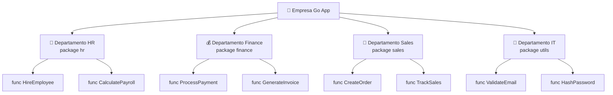
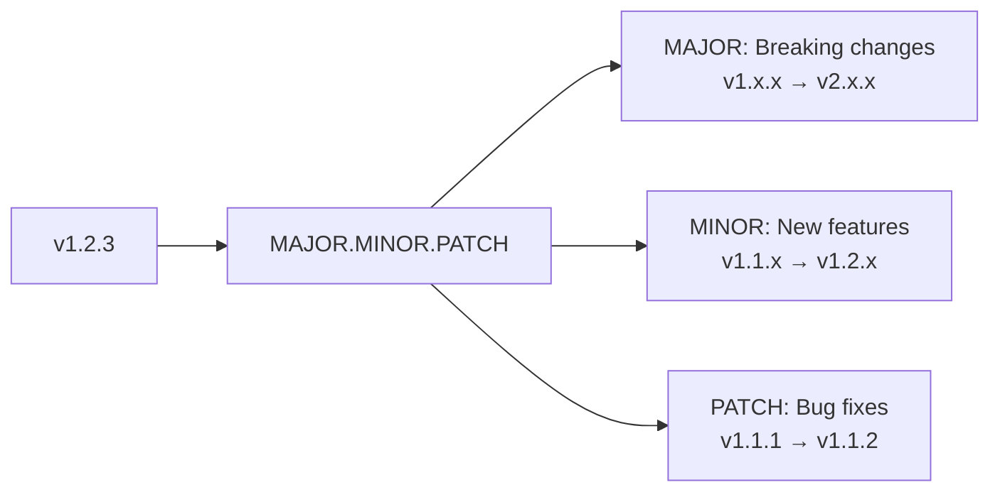
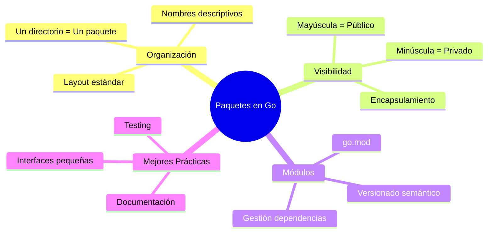

# 📦 Lección 14: Paquetes y Módulos en Go

> *"Los paquetes son la forma en que Go organiza y reutiliza código"* - Filosofía Go

## 🎯 Objetivos de Esta Lección

Al finalizar esta lección serás capaz de:
- ✅ Entender qué son los **paquetes** y por qué son importantes
- ✅ Crear y organizar **módulos Go** profesionalmente
- ✅ Dominar las **importaciones** y visibilidad de código
- ✅ Implementar **versionado semántico** correctamente
- ✅ Gestionar **dependencias** de forma eficiente
- ✅ Publicar paquetes en **repositorios públicos**

---

## 🌟 ¿Qué son los Paquetes en Go?

Un **paquete** (package) en Go es una unidad de organización de código que agrupa funciones, tipos y variables relacionadas. Es la forma fundamental de modularidad en Go.

### 🧠 Analogía: Paquetes como Departamentos de una Empresa

Imagina una empresa bien organizada:



Cada departamento (paquete):
- ✅ Tiene **responsabilidades específicas**
- ✅ **Expone** servicios públicos a otros departamentos
- ✅ Mantiene **detalles internos** privados
- ✅ Se puede **reutilizar** en diferentes proyectos

---

## 📁 Anatomía de un Paquete

### 🏗️ Estructura Básica

```
mi-proyecto/
├── go.mod                 # Definición del módulo
├── go.sum                 # Lock file de dependencias
├── main.go               # Punto de entrada
├── utils/                # Paquete utils
│   ├── strings.go        # Utilidades de strings
│   ├── math.go          # Utilidades matemáticas
│   └── validation.go    # Funciones de validación
├── models/              # Paquete models
│   ├── user.go         # Modelo User
│   ├── product.go      # Modelo Product
│   └── order.go        # Modelo Order
└── handlers/           # Paquete handlers
    ├── user.go         # Handlers de usuario
    ├── product.go      # Handlers de producto
    └── auth.go         # Handlers de autenticación
```

### 📋 Reglas Fundamentales

1. **Un directorio = Un paquete**
2. **Todos los archivos en un directorio deben tener el mismo `package name`**
3. **El nombre del paquete no tiene que coincidir con el directorio**
4. **Funciones, tipos y variables que empiecen con mayúscula son públicos**
5. **Todo lo que empiece con minúscula es privado al paquete**

---

## 🔧 Creando tu Primer Módulo

### 1. **Inicializar un Módulo**

```bash
# Crear directorio del proyecto
mkdir mi-app-go
cd mi-app-go

# Inicializar módulo Go
go mod init github.com/usuario/mi-app-go
```

**Resultado: `go.mod`**
```go
module github.com/usuario/mi-app-go

go 1.24
```

### 2. **Estructura del Proyecto**

```bash
# Crear estructura de directorios
mkdir -p {cmd,internal,pkg,web,scripts,docs}
mkdir -p cmd/server
mkdir -p internal/{auth,database,handlers}
mkdir -p pkg/{utils,models}
```

### 3. **Ejemplo: Paquete Utils**

**`pkg/utils/strings.go`**
```go
package utils

import (
    "strings"
    "unicode"
)

// Capitalize hace que la primera letra sea mayúscula (PÚBLICO)
func Capitalize(s string) string {
    if len(s) == 0 {
        return s
    }
    return strings.ToUpper(string(s[0])) + s[1:]
}

// isVowel verifica si un carácter es vocal (PRIVADO)
func isVowel(c rune) bool {
    vowels := "aeiouAEIOU"
    return strings.ContainsRune(vowels, c)
}

// CountVowels cuenta las vocales en un string (PÚBLICO)
func CountVowels(s string) int {
    count := 0
    for _, char := range s {
        if isVowel(char) {
            count++
        }
    }
    return count
}

// RemoveSpaces elimina todos los espacios (PÚBLICO)
func RemoveSpaces(s string) string {
    return strings.ReplaceAll(s, " ", "")
}

// slugify convierte texto a slug URL-friendly (PRIVADO)
func slugify(s string) string {
    s = strings.ToLower(s)
    s = strings.ReplaceAll(s, " ", "-")
    return s
}

// ToSlug es la versión pública de slugify (PÚBLICO)
func ToSlug(s string) string {
    return slugify(s)
}
```

**`pkg/utils/math.go`**
```go
package utils

import "math"

// Max retorna el mayor de dos enteros (PÚBLICO)
func Max(a, b int) int {
    if a > b {
        return a
    }
    return b
}

// Min retorna el menor de dos enteros (PÚBLICO)
func Min(a, b int) int {
    if a < b {
        return a
    }
    return b
}

// Average calcula el promedio de un slice de números (PÚBLICO)
func Average(numbers []float64) float64 {
    if len(numbers) == 0 {
        return 0
    }
    
    sum := 0.0
    for _, num := range numbers {
        sum += num
    }
    return sum / float64(len(numbers))
}

// Round redondea un número a n decimales (PÚBLICO)
func Round(num float64, precision int) float64 {
    ratio := math.Pow(10, float64(precision))
    return math.Round(num*ratio) / ratio
}
```

### 4. **Usando los Paquetes**

**`cmd/server/main.go`**
```go
package main

import (
    "fmt"
    
    "github.com/usuario/mi-app-go/pkg/utils"
)

func main() {
    // Usando funciones del paquete utils
    text := "hola mundo go"
    
    fmt.Printf("Original: %s\n", text)
    fmt.Printf("Capitalizado: %s\n", utils.Capitalize(text))
    fmt.Printf("Vocales: %d\n", utils.CountVowels(text))
    fmt.Printf("Sin espacios: %s\n", utils.RemoveSpaces(text))
    fmt.Printf("Slug: %s\n", utils.ToSlug(text))
    
    // Usando funciones matemáticas
    numbers := []float64{10.5, 20.3, 15.7, 8.2}
    fmt.Printf("Promedio: %.2f\n", utils.Average(numbers))
    fmt.Printf("Máximo: %d\n", utils.Max(25, 15))
    fmt.Printf("Redondeado: %.2f\n", utils.Round(3.14159, 2))
}
```

---

## 🔗 Importaciones en Go

### 📖 Tipos de Importaciones

#### 1. **Importación Estándar**
```go
import "fmt"
import "strings"
import "net/http"
```

#### 2. **Importación en Bloque** (Recomendado)
```go
import (
    "fmt"
    "strings"
    "net/http"
)
```

#### 3. **Importación con Alias**
```go
import (
    "fmt"
    mystrings "strings"  // Alias para evitar conflictos
    "net/http"
)

func main() {
    mystrings.ToUpper("hello") // Usando el alias
}
```

#### 4. **Importación Anónima** (Para efectos secundarios)
```go
import (
    "fmt"
    _ "github.com/lib/pq"  // Solo para init(), no usar directamente
)
```

#### 5. **Importación Dot** (Evitar en código de producción)
```go
import (
    "fmt"
    . "math"  // Importa todo al namespace actual
)

func main() {
    fmt.Println(Pi)  // Directamente, sin math.Pi
}
```

### 🎯 Mejores Prácticas de Importación

#### ✅ **Organización Recomendada**
```go
import (
    // 1. Standard library (alfabético)
    "context"
    "fmt"
    "net/http"
    "strings"
    "time"
    
    // 2. External dependencies (alfabético)
    "github.com/gin-gonic/gin"
    "github.com/stretchr/testify/assert"
    "go.uber.org/zap"
    
    // 3. Internal packages (alfabético)
    "github.com/mi-empresa/mi-app/internal/auth"
    "github.com/mi-empresa/mi-app/internal/database"
    "github.com/mi-empresa/mi-app/pkg/utils"
)
```

#### ❌ **Errores Comunes**
```go
// ❌ Mezclado sin orden
import (
    "github.com/gin-gonic/gin"
    "fmt"
    "github.com/mi-empresa/mi-app/pkg/utils"
    "strings"
)

// ❌ Alias innecesarios
import (
    f "fmt"  // No necesario
    s "strings"  // No necesario
)

// ❌ Importaciones no usadas
import (
    "fmt"
    "strings"  // Error: no se usa en el código
)
```

---

## 🏗️ Arquitectura de Módulos: Layout Estándar

### 📐 Proyecto Layout Profesional

```
mi-app-empresarial/
├── go.mod
├── go.sum
├── README.md
├── Makefile
├── .gitignore
├── .golangci.yml
│
├── cmd/                          # Puntos de entrada
│   ├── server/                   # Aplicación servidor
│   │   └── main.go
│   ├── cli/                      # Herramienta CLI
│   │   └── main.go
│   └── migration/                # Herramienta de migración
│       └── main.go
│
├── internal/                     # Código privado de la aplicación
│   ├── app/                      # Configuración de aplicación
│   │   ├── app.go
│   │   └── config.go
│   ├── handlers/                 # HTTP handlers
│   │   ├── user.go
│   │   ├── auth.go
│   │   └── health.go
│   ├── services/                 # Lógica de negocio
│   │   ├── user.go
│   │   ├── auth.go
│   │   └── notification.go
│   ├── repository/               # Acceso a datos
│   │   ├── user.go
│   │   ├── postgres.go
│   │   └── redis.go
│   ├── middleware/               # HTTP middleware
│   │   ├── auth.go
│   │   ├── cors.go
│   │   └── logging.go
│   └── models/                   # Modelos internos
│       ├── user.go
│       ├── session.go
│       └── errors.go
│
├── pkg/                          # Código público reutilizable
│   ├── logger/                   # Sistema de logging
│   │   ├── logger.go
│   │   └── config.go
│   ├── validator/                # Validaciones
│   │   ├── validator.go
│   │   └── rules.go
│   ├── crypto/                   # Utilidades criptográficas
│   │   ├── hash.go
│   │   └── jwt.go
│   └── httpclient/               # Cliente HTTP reutilizable
│       ├── client.go
│       └── retry.go
│
├── api/                          # Definiciones de API
│   ├── openapi/                  # Specs OpenAPI
│   │   └── api.yaml
│   ├── proto/                    # Definiciones Protocol Buffers
│   │   └── user.proto
│   └── graphql/                  # Esquemas GraphQL
│       └── schema.graphql
│
├── web/                          # Archivos web estáticos
│   ├── static/
│   │   ├── css/
│   │   ├── js/
│   │   └── images/
│   └── templates/
│       ├── index.html
│       └── dashboard.html
│
├── configs/                      # Archivos de configuración
│   ├── development.yaml
│   ├── production.yaml
│   └── testing.yaml
│
├── scripts/                      # Scripts de build y deployment
│   ├── build.sh
│   ├── deploy.sh
│   └── test.sh
│
├── deployments/                  # Configuraciones de deployment
│   ├── docker/
│   │   └── Dockerfile
│   ├── kubernetes/
│   │   ├── deployment.yaml
│   │   └── service.yaml
│   └── docker-compose.yaml
│
├── test/                         # Tests adicionales
│   ├── integration/
│   │   └── api_test.go
│   ├── e2e/
│   │   └── user_flow_test.go
│   └── fixtures/
│       └── test_data.json
│
└── docs/                         # Documentación
    ├── api.md
    ├── deployment.md
    └── development.md
```

### 🎯 Explicación de Directorios

#### **`cmd/`** - Puntos de Entrada
```go
// cmd/server/main.go
package main

import (
    "log"
    
    "github.com/mi-empresa/mi-app/internal/app"
)

func main() {
    app := app.NewApp()
    if err := app.Run(); err != nil {
        log.Fatal(err)
    }
}
```

#### **`internal/`** - Código Privado
```go
// internal/services/user.go
package services

import (
    "context"
    
    "github.com/mi-empresa/mi-app/internal/models"
    "github.com/mi-empresa/mi-app/internal/repository"
)

type UserService struct {
    repo repository.UserRepository
}

func NewUserService(repo repository.UserRepository) *UserService {
    return &UserService{repo: repo}
}

func (s *UserService) CreateUser(ctx context.Context, user *models.User) error {
    // Lógica de negocio aquí
    return s.repo.Create(ctx, user)
}
```

#### **`pkg/`** - Código Público
```go
// pkg/logger/logger.go
package logger

import (
    "go.uber.org/zap"
)

// Logger es la interface pública
type Logger interface {
    Info(msg string, fields ...zap.Field)
    Error(msg string, fields ...zap.Field)
    Debug(msg string, fields ...zap.Field)
}

type zapLogger struct {
    zap *zap.Logger
}

// New crea una nueva instancia de logger
func New(config Config) Logger {
    // Implementación...
    return &zapLogger{}
}
```

---

## 🔄 Gestión de Dependencias

### 📦 Go Modules en Acción

#### 1. **Añadir Dependencias**
```bash
# Añadir una dependencia
go get github.com/gin-gonic/gin

# Añadir versión específica
go get github.com/gin-gonic/gin@v1.9.1

# Añadir dependencia de desarrollo
go get -t github.com/stretchr/testify/assert
```

#### 2. **Actualizar Dependencias**
```bash
# Actualizar todas las dependencias
go get -u

# Actualizar dependencia específica
go get -u github.com/gin-gonic/gin

# Actualizar solo patches (seguro)
go get -u=patch
```

#### 3. **Limpiar Dependencias**
```bash
# Eliminar dependencias no usadas
go mod tidy

# Verificar dependencias
go mod verify

# Ver todas las dependencias
go list -m all
```

### 📄 Ejemplo de `go.mod` Completo

```go
module github.com/mi-empresa/mi-super-app

go 1.24

require (
    github.com/gin-gonic/gin v1.9.1
    github.com/go-redis/redis/v8 v8.11.5
    github.com/golang-jwt/jwt/v4 v4.5.0
    github.com/lib/pq v1.10.9
    github.com/stretchr/testify v1.8.4
    go.uber.org/zap v1.26.0
    golang.org/x/crypto v0.15.0
)

require (
    github.com/bytedance/sonic v1.9.1 // indirect
    github.com/cespare/xxhash/v2 v2.1.2 // indirect
    github.com/chenzhuoyu/base64x v0.0.0-20221115062448-fe3a3abad311 // indirect
    github.com/dgryski/go-rendezvous v0.0.0-20200823014737-9f7001d12a5f // indirect
    github.com/gabriel-vasile/mimetype v1.4.2 // indirect
    github.com/gin-contrib/sse v0.1.0 // indirect
    github.com/go-playground/locales v0.14.1 // indirect
    github.com/go-playground/universal-translator v0.18.1 // indirect
    github.com/go-playground/validator/v10 v10.14.0 // indirect
    github.com/goccy/go-json v0.10.2 // indirect
    github.com/json-iterator/go v1.1.12 // indirect
    github.com/klauspost/cpuid/v2 v2.2.4 // indirect
    github.com/leodido/go-urn v1.2.4 // indirect
    github.com/mattn/go-isatty v0.0.19 // indirect
    github.com/modern-go/concurrent v0.0.0-20180306012644-bacd9c7ef1dd // indirect
    github.com/modern-go/reflect2 v1.0.2 // indirect
    github.com/pelletier/go-toml/v2 v2.0.8 // indirect
    github.com/twitchyliquid64/golang-asm v0.15.1 // indirect
    github.com/ugorji/go/codec v1.2.11 // indirect
    go.uber.org/multierr v1.10.0 // indirect
    golang.org/x/arch v0.3.0 // indirect
    golang.org/x/net v0.10.0 // indirect
    golang.org/x/sys v0.14.0 // indirect
    golang.org/x/text v0.14.0 // indirect
    google.golang.org/protobuf v1.30.0 // indirect
    gopkg.in/yaml.v3 v3.0.1 // indirect
)

// Reemplazos para desarrollo local
replace github.com/mi-empresa/mi-lib-interna => ../mi-lib-interna

// Exclusiones si hay problemas
exclude github.com/paquete-problematico v1.0.0
```

---

## 🎯 Versioning Semántico

### 📊 Entendiendo SemVer



### 🏷️ Estrategias de Versionado

#### **1. Durante Desarrollo (v0.x.x)**
```bash
# Desarrollo inicial
git tag v0.1.0
git tag v0.2.0
git tag v0.10.5

# ⚠️ v0.x.x = API inestable, puede cambiar en cualquier momento
```

#### **2. Primera Release Estable (v1.0.0)**
```bash
# API estable, lista para producción
git tag v1.0.0

# ✅ A partir de aquí, breaking changes requieren MAJOR bump
```

#### **3. Evolución Controlada**
```bash
# Bug fixes (compatibles)
git tag v1.0.1
git tag v1.0.2

# Nuevas features (compatibles)
git tag v1.1.0
git tag v1.2.0

# Breaking changes (incompatibles)
git tag v2.0.0
```

### 🎯 Ejemplo Práctico: Evolución de una API

#### **v1.0.0 - API Inicial**
```go
// pkg/calculator/calculator.go
package calculator

// Add suma dos enteros
func Add(a, b int) int {
    return a + b
}

// Multiply multiplica dos enteros
func Multiply(a, b int) int {
    return a * b
}
```

#### **v1.1.0 - Nueva Feature (MINOR)**
```go
// pkg/calculator/calculator.go
package calculator

// Add suma dos enteros (sin cambios)
func Add(a, b int) int {
    return a + b
}

// Multiply multiplica dos enteros (sin cambios)
func Multiply(a, b int) int {
    return a * b
}

// ✅ NUEVA: Divide - nueva funcionalidad, compatible
func Divide(a, b int) (int, error) {
    if b == 0 {
        return 0, errors.New("division by zero")
    }
    return a / b, nil
}
```

#### **v1.1.1 - Bug Fix (PATCH)**
```go
// ✅ FIX: Multiply ahora maneja overflow
func Multiply(a, b int) int {
    // Verificación de overflow añadida
    result := a * b
    if a != 0 && result/a != b {
        panic("integer overflow")
    }
    return result
}
```

#### **v2.0.0 - Breaking Change (MAJOR)**
```go
// ❌ BREAKING: Cambiamos int a float64
func Add(a, b float64) float64 {  // Cambió la signature!
    return a + b
}

// ❌ BREAKING: Multiply ahora retorna error
func Multiply(a, b float64) (float64, error) {  // Cambió la signature!
    if math.IsInf(a*b, 0) {
        return 0, errors.New("result is infinite")
    }
    return a * b, nil
}
```

---

## 🔐 Visibilidad y Encapsulamiento

### 🎭 Public vs Private

La visibilidad en Go se determina por la primera letra del identificador:

#### ✅ **Público (Exportado)**
```go
package utils

// Struct público
type User struct {
    ID       int    // Campo público
    Name     string // Campo público
    Email    string // Campo público
    password string // Campo privado (minúscula)
}

// Constructor público
func NewUser(name, email, password string) *User {
    return &User{
        Name:     name,
        Email:    email,
        password: password,
    }
}

// Método público
func (u *User) GetDisplayName() string {
    return u.Name
}

// Método público
func (u *User) ValidatePassword(password string) bool {
    return u.password == password
}

// Función pública
func ValidateEmail(email string) bool {
    return strings.Contains(email, "@")
}
```

#### ❌ **Privado (No Exportado)**
```go
package utils

// tipo privado
type userCache struct {
    users map[int]*User
    mutex sync.RWMutex
}

// variable privada
var cache = &userCache{
    users: make(map[int]*User),
}

// función privada
func hashPassword(password string) string {
    hasher := sha256.New()
    hasher.Write([]byte(password))
    return hex.EncodeToString(hasher.Sum(nil))
}

// método privado
func (u *User) setPassword(password string) {
    u.password = hashPassword(password)
}
```

### 🏗️ Ejemplo: Paquete Bank Account

#### **`pkg/bank/account.go`**
```go
package bank

import (
    "errors"
    "fmt"
    "time"
)

// Account representa una cuenta bancaria (PÚBLICO)
type Account struct {
    ID       string    // PÚBLICO: número de cuenta
    Owner    string    // PÚBLICO: propietario
    balance  float64   // PRIVADO: saldo interno
    currency string    // PRIVADO: moneda interna
    history  []Transaction // PRIVADO: historial interno
}

// Transaction representa una transacción (PÚBLICO)
type Transaction struct {
    ID        string    // PÚBLICO
    Type      string    // PÚBLICO: "credit" o "debit"
    Amount    float64   // PÚBLICO
    Timestamp time.Time // PÚBLICO
    balance   float64   // PRIVADO: saldo después de la transacción
}

// NewAccount crea una nueva cuenta (PÚBLICO)
func NewAccount(owner, currency string) *Account {
    return &Account{
        ID:       generateAccountID(), // función privada
        Owner:    owner,
        balance:  0.0,
        currency: currency,
        history:  make([]Transaction, 0),
    }
}

// GetBalance retorna el saldo actual (PÚBLICO)
func (a *Account) GetBalance() float64 {
    return a.balance
}

// GetCurrency retorna la moneda (PÚBLICO)
func (a *Account) GetCurrency() string {
    return a.currency
}

// Deposit realiza un depósito (PÚBLICO)
func (a *Account) Deposit(amount float64) error {
    if amount <= 0 {
        return errors.New("amount must be positive")
    }
    
    a.balance += amount
    a.addTransaction("credit", amount) // método privado
    return nil
}

// Withdraw realiza un retiro (PÚBLICO)
func (a *Account) Withdraw(amount float64) error {
    if amount <= 0 {
        return errors.New("amount must be positive")
    }
    
    if !a.hasSufficientBalance(amount) { // método privado
        return errors.New("insufficient balance")
    }
    
    a.balance -= amount
    a.addTransaction("debit", amount) // método privado
    return nil
}

// GetStatement retorna el estado de cuenta (PÚBLICO)
func (a *Account) GetStatement() []Transaction {
    // Retornamos una copia para evitar modificaciones externas
    statement := make([]Transaction, len(a.history))
    copy(statement, a.history)
    return statement
}

// generateAccountID genera un ID único (PRIVADO)
func generateAccountID() string {
    return fmt.Sprintf("ACC-%d", time.Now().UnixNano())
}

// hasSufficientBalance verifica si hay saldo suficiente (PRIVADO)
func (a *Account) hasSufficientBalance(amount float64) bool {
    return a.balance >= amount
}

// addTransaction añade una transacción al historial (PRIVADO)
func (a *Account) addTransaction(txType string, amount float64) {
    tx := Transaction{
        ID:        generateTransactionID(), // función privada
        Type:      txType,
        Amount:    amount,
        Timestamp: time.Now(),
        balance:   a.balance,
    }
    a.history = append(a.history, tx)
}

// generateTransactionID genera un ID de transacción (PRIVADO)
func generateTransactionID() string {
    return fmt.Sprintf("TXN-%d", time.Now().UnixNano())
}
```

#### **Uso del Paquete**
```go
// main.go
package main

import (
    "fmt"
    "log"
    
    "github.com/mi-empresa/mi-app/pkg/bank"
)

func main() {
    // ✅ Podemos crear una cuenta (función pública)
    account := bank.NewAccount("Juan Pérez", "USD")
    
    // ✅ Podemos acceder a campos públicos
    fmt.Printf("Cuenta: %s, Propietario: %s\n", account.ID, account.Owner)
    
    // ✅ Podemos usar métodos públicos
    account.Deposit(1000.0)
    account.Withdraw(250.0)
    
    fmt.Printf("Saldo actual: $%.2f %s\n", 
        account.GetBalance(), account.GetCurrency())
    
    // ✅ Podemos obtener el estado de cuenta
    statement := account.GetStatement()
    for _, tx := range statement {
        fmt.Printf("Transacción: %s - $%.2f\n", tx.Type, tx.Amount)
    }
    
    // ❌ Esto NO compilaría - acceso a campos privados
    // fmt.Println(account.balance)  // Error!
    // account.addTransaction("test", 100) // Error!
}
```

---

## 📢 Publicando Paquetes

### 🌍 Repositorios Públicos

#### 1. **Preparar el Paquete**

**Estructura Recomendada:**
```
mi-awesome-lib/
├── go.mod
├── README.md
├── LICENSE
├── .gitignore
├── example/
│   └── main.go
├── doc.go           # Documentación del paquete
└── awesome.go       # Código principal
```

**`doc.go`** - Documentación del Paquete:
```go
// Package awesome provides utilities for awesome things.
//
// This package includes functions for:
//   - String manipulation
//   - Mathematical operations
//   - Data validation
//
// Example usage:
//
//	package main
//
//	import (
//	    "fmt"
//	    "github.com/usuario/mi-awesome-lib"
//	)
//
//	func main() {
//	    result := awesome.DoSomething("input")
//	    fmt.Println(result)
//	}
package awesome
```

#### 2. **Crear Tags de Versión**
```bash
# Primera versión
git add .
git commit -m "Initial release"
git tag v1.0.0
git push origin main
git push origin v1.0.0
```

#### 3. **Registrar en pkg.go.dev**
```bash
# Go automáticamente indexa paquetes públicos
# Solo necesitas que alguien haga:
go get github.com/usuario/mi-awesome-lib@v1.0.0

# O forzar la indexación:
curl "https://proxy.golang.org/github.com/usuario/mi-awesome-lib/@v/v1.0.0.info"
```

### 📚 Documentación con Ejemplos

#### **Documentación de Funciones**
```go
package mathutil

import "math"

// Sqrt calcula la raíz cuadrada de un número.
// Retorna un error si el número es negativo.
//
// Ejemplo:
//
//	result, err := mathutil.Sqrt(9.0)
//	if err != nil {
//	    log.Fatal(err)
//	}
//	fmt.Printf("√9 = %.2f\n", result) // Imprime: √9 = 3.00
func Sqrt(x float64) (float64, error) {
    if x < 0 {
        return 0, fmt.Errorf("cannot calculate square root of negative number: %f", x)
    }
    return math.Sqrt(x), nil
}

// Max retorna el mayor de dos números enteros.
//
// Ejemplo:
//
//	max := mathutil.Max(10, 20)
//	fmt.Println(max) // Imprime: 20
func Max(a, b int) int {
    if a > b {
        return a
    }
    return b
}
```

#### **Tests como Ejemplos**
```go
// mathutil_test.go
package mathutil_test

import (
    "fmt"
    "testing"
    
    "github.com/usuario/mathutil"
)

// ExampleSqrt documenta el uso de la función Sqrt
func ExampleSqrt() {
    result, err := mathutil.Sqrt(16.0)
    if err != nil {
        fmt.Printf("Error: %v", err)
        return
    }
    fmt.Printf("√16 = %.1f", result)
    // Output: √16 = 4.0
}

// ExampleSqrt_negative muestra el manejo de errores
func ExampleSqrt_negative() {
    _, err := mathutil.Sqrt(-4.0)
    if err != nil {
        fmt.Printf("Error: %v", err)
    }
    // Output: Error: cannot calculate square root of negative number: -4.000000
}

// ExampleMax muestra el uso básico de Max
func ExampleMax() {
    result := mathutil.Max(5, 10)
    fmt.Printf("Max(5, 10) = %d", result)
    // Output: Max(5, 10) = 10
}
```

---

## 🧪 Testing de Paquetes

### 🎯 Estructura de Tests

```
mi-paquete/
├── calculator.go
├── calculator_test.go      # Tests unitarios
├── example_test.go         # Tests de ejemplo
├── benchmark_test.go       # Tests de performance
└── integration_test.go     # Tests de integración
```

### ✅ Tests Unitarios

**`calculator_test.go`**
```go
package calculator

import (
    "testing"
)

func TestAdd(t *testing.T) {
    tests := []struct {
        name     string
        a, b     int
        expected int
    }{
        {"positive numbers", 2, 3, 5},
        {"negative numbers", -2, -3, -5},
        {"mixed numbers", -2, 3, 1},
        {"zero", 0, 5, 5},
    }
    
    for _, tt := range tests {
        t.Run(tt.name, func(t *testing.T) {
            result := Add(tt.a, tt.b)
            if result != tt.expected {
                t.Errorf("Add(%d, %d) = %d; expected %d", 
                    tt.a, tt.b, result, tt.expected)
            }
        })
    }
}

func TestDivide(t *testing.T) {
    // Test normal division
    result, err := Divide(10, 2)
    if err != nil {
        t.Errorf("Divide(10, 2) returned error: %v", err)
    }
    if result != 5 {
        t.Errorf("Divide(10, 2) = %d; expected 5", result)
    }
    
    // Test division by zero
    _, err = Divide(10, 0)
    if err == nil {
        t.Error("Divide(10, 0) should return error")
    }
}
```

### 🚀 Benchmarks

**`benchmark_test.go`**
```go
package calculator

import (
    "testing"
)

func BenchmarkAdd(b *testing.B) {
    for i := 0; i < b.N; i++ {
        Add(100, 200)
    }
}

func BenchmarkMultiply(b *testing.B) {
    for i := 0; i < b.N; i++ {
        Multiply(100, 200)
    }
}

// Benchmark con setup
func BenchmarkComplexOperation(b *testing.B) {
    // Setup
    data := make([]int, 1000)
    for i := range data {
        data[i] = i
    }
    
    b.ResetTimer() // No contar el setup
    
    for i := 0; i < b.N; i++ {
        sum := 0
        for _, v := range data {
            sum = Add(sum, v)
        }
    }
}
```

---

## 🎯 Mejores Prácticas

### ✅ **Organización de Código**

#### 1. **Nombres Descriptivos**
```go
// ✅ Bien
package userservice
package httpclient
package database

// ❌ Mal
package utils
package common
package helper
```

#### 2. **Interfaces Pequeñas**
```go
// ✅ Bien - Interface pequeña y específica
type Saver interface {
    Save(data []byte) error
}

type Loader interface {
    Load() ([]byte, error)
}

// ❌ Mal - Interface demasiado grande
type Storage interface {
    Save(data []byte) error
    Load() ([]byte, error)
    Delete() error
    List() ([]string, error)
    Backup() error
    Restore() error
    Validate() error
}
```

#### 3. **Aceptar Interfaces, Retornar Structs**
```go
// ✅ Bien
func ProcessData(reader io.Reader) *Result {
    // Acepta interface (flexible)
    // Retorna struct concreto (claro)
}

// ❌ Mal
func ProcessData(file *os.File) io.Reader {
    // Acepta struct concreto (inflexible)
    // Retorna interface (confuso)
}
```

### 🔧 **Gestión de Dependencias**

#### 1. **Pinning de Versiones Críticas**
```go
// go.mod
require (
    github.com/critical-lib v1.2.3        // Versión exacta para libs críticas
    github.com/regular-lib v1.2           // Versión menor para libs normales
    github.com/dev-tool latest            // Latest solo para herramientas de dev
)
```

#### 2. **Vendor Directory** (Opcional)
```bash
# Crear vendor directory
go mod vendor

# .gitignore
vendor/

# Usar vendor para builds
go build -mod=vendor
```

### 🎯 **Performance y Optimización**

#### 1. **Lazy Loading de Dependencias**
```go
package heavylib

import (
    "sync"
    "some/heavy/dependency"
)

var (
    instance *heavy.Client
    once     sync.Once
)

// GetClient inicializa la dependencia solo cuando se necesita
func GetClient() *heavy.Client {
    once.Do(func() {
        instance = heavy.NewClient()
    })
    return instance
}
```

#### 2. **Build Tags para Diferentes Entornos**
```go
// database_postgres.go
//go:build postgres
// +build postgres

package database

func Connect() (*DB, error) {
    // Implementación PostgreSQL
}
```

```go
// database_mysql.go
//go:build mysql
// +build mysql

package database

func Connect() (*DB, error) {
    // Implementación MySQL
}
```

```bash
# Build con tags específicos
go build -tags postgres
go build -tags mysql
```

---

## 🎉 Proyecto Práctico: Sistema de Biblioteca

Vamos a crear un sistema completo que demuestre todos los conceptos:

### 📁 Estructura del Proyecto

```
biblioteca-system/
├── go.mod
├── cmd/
│   ├── server/main.go
│   └── cli/main.go
├── internal/
│   ├── handlers/
│   ├── services/
│   └── repository/
├── pkg/
│   ├── models/
│   ├── validator/
│   └── logger/
└── api/
    └── routes.go
```

Este proyecto práctico se desarrollará en los ejercicios de esta lección.

---

## 📚 Recursos para Continuar

### 🎯 Próximos Pasos

1. **✅ Completar los ejercicios** de esta lección
2. **📖 Estudiar la lección** de Testing (Lección 15)
3. **🔗 Explorar** Go Modules avanzados
4. **🚀 Crear tu primer paquete** público

### 🌐 Enlaces Útiles

- **[Go Modules Reference](https://golang.org/ref/mod)** - Documentación oficial
- **[pkg.go.dev](https://pkg.go.dev/)** - Búsqueda de paquetes
- **[Go Package Layout](https://github.com/golang-standards/project-layout)** - Estructura estándar
- **[Semantic Versioning](https://semver.org/)** - Guía de versionado

---

## 🧠 Resumen de Conceptos Clave



¡Felicitaciones! Ahora dominas la organización y modularización de código en Go. Los paquetes son fundamentales para escribir código mantenible y reutilizable.

**[→ Continúa con los Ejercicios de Paquetes](./ejercicios.go)**
