# 🚨 Lección 16: Manejo de Errores en Go

> *"Los errores son valores"* - Rob Pike

## 🎯 Objetivos de Esta Lección

Al finalizar esta lección serás capaz de:
- ✅ Dominar la **filosofía de errores** de Go
- ✅ Crear y manejar **errores personalizados**
- ✅ Implementar **patrones avanzados** de error handling
- ✅ Usar **error wrapping** y unwrapping
- ✅ Aplicar **estrategias de recuperación** de errores
- ✅ Crear **sistemas robustos** con manejo elegante de errores
- ✅ Implementar **logging** y **observabilidad** de errores

---

## 🌟 La Filosofía de Go: Errores como Valores

### 🧠 Analogía: Errores como Semáforos

Imagina que manejar errores es como conducir en una ciudad:

```mermaid
graph TD
    A[🚗 Función/Operación] --> B{¿Todo OK?}
    B -->|✅ Sí| C[🟢 Continuar]
    B -->|❌ No| D[🔴 Error Explícito]
    
    D --> E{¿Puedo manejar?}
    E -->|Sí| F[🛠️ Recuperación]
    E -->|No| G[📢 Propagar]
    
    F --> C
    G --> H[🚨 Caller maneja]
    
    style A fill:#00ADD8
    style C fill:#00ff00
    style D fill:#ff6b6b
    style F fill:#ffd93d
```



### 🔄 Go vs Otros Lenguajes

#### **Enfoque Tradicional (Java/Python/C#)**
```java
// Java - Exceptions ocultas
try {
    String result = riskyOperation();
    return result.toUpperCase();
} catch (Exception e) {
    // ¿Qué tipos de errores pueden ocurrir? 🤷‍♂️
    log.error("Something went wrong", e);
    throw new RuntimeException(e);
}
```

#### **Enfoque Go - Errores Explícitos**
```go
// Go - Errores visibles y manejables
result, err := riskyOperation()
if err != nil {
    // Sabemos exactamente qué manejar ✅
    log.Printf("riskyOperation failed: %v", err)
    return "", fmt.Errorf("failed to process: %w", err)
}
return strings.ToUpper(result), nil
```

### 🎯 Ventajas del Enfoque Go

```mermaid
mindmap
  root((Ventajas de Errors como Valores))
    Explícito
      No hay errores ocultos
      Fácil de rastrear
      Documentación natural
    Controlable
      Decidir qué manejar
      Estrategias específicas
      Performance predecible
    Testeable
      Fácil de testear casos error
      Mocking simple
      Cobertura clara
    Legible
      Flujo de código claro
      No stack unwinding
      Debugging simple
```



---

## 🏗️ Fundamentos: La Interface `error`

### 📋 La Interface Más Simple

```go
// La interface error es súper simple
type error interface {
    Error() string
}
```

### 🔧 Creando Errores Básicos

#### **1. `errors.New()` - Errores Simples**
```go
package main

import (
    "errors"
    "fmt"
)

func divide(a, b float64) (float64, error) {
    if b == 0 {
        return 0, errors.New("division by zero")
    }
    return a / b, nil
}

func main() {
    result, err := divide(10, 0)
    if err != nil {
        fmt.Printf("Error: %v\n", err) // Error: division by zero
        return
    }
    fmt.Printf("Result: %.2f\n", result)
}
```

#### **2. `fmt.Errorf()` - Errores con Formato**
```go
func validateAge(age int) error {
    if age < 0 {
        return fmt.Errorf("age cannot be negative: %d", age)
    }
    if age > 150 {
        return fmt.Errorf("age too high: %d (max: 150)", age)
    }
    return nil
}

// Uso
if err := validateAge(-5); err != nil {
    fmt.Println(err) // age cannot be negative: -5
}
```

#### **3. Errores Predefinidos como Variables**
```go
// Patron común: definir errores como variables
var (
    ErrUserNotFound    = errors.New("user not found")
    ErrInvalidPassword = errors.New("invalid password")
    ErrAccountLocked   = errors.New("account is locked")
)

func authenticate(username, password string) error {
    user := findUser(username)
    if user == nil {
        return ErrUserNotFound // Reutilizable!
    }
    
    if user.IsLocked {
        return ErrAccountLocked
    }
    
    if !checkPassword(user, password) {
        return ErrInvalidPassword
    }
    
    return nil
}
```

---

## 🎭 Errores Personalizados: Más Allá de Strings

### 🏗️ Creando Tipos de Error Personalizados

#### **Patrón Básico: Struct que Implementa error**
```go
// ValidationError - Error con contexto
type ValidationError struct {
    Field   string
    Value   interface{}
    Message string
}

func (e ValidationError) Error() string {
    return fmt.Sprintf("validation failed for field '%s' with value '%v': %s", 
        e.Field, e.Value, e.Message)
}

// Función helper para crear ValidationError
func NewValidationError(field string, value interface{}, message string) *ValidationError {
    return &ValidationError{
        Field:   field,
        Value:   value,
        Message: message,
    }
}

// Uso
func validateUser(user User) error {
    if user.Email == "" {
        return NewValidationError("email", user.Email, "cannot be empty")
    }
    
    if !strings.Contains(user.Email, "@") {
        return NewValidationError("email", user.Email, "invalid format")
    }
    
    if user.Age < 18 {
        return NewValidationError("age", user.Age, "must be 18 or older")
    }
    
    return nil
}
```

### 🌟 Error con Información Rica

```go
// NetworkError - Error con detalles de red
type NetworkError struct {
    Op       string        // Operación que falló
    URL      string        // URL involucrada
    Err      error         // Error subyacente
    Code     int          // HTTP status code
    Retryable bool         // ¿Se puede reintentar?
    Timeout   time.Duration // Timeout usado
}

func (e *NetworkError) Error() string {
    return fmt.Sprintf("network %s to %s failed: %v (code: %d)", 
        e.Op, e.URL, e.Err, e.Code)
}

// Método helper para determinar si es retryable
func (e *NetworkError) IsRetryable() bool {
    return e.Retryable
}

// Método helper para determinar si es timeout
func (e *NetworkError) IsTimeout() bool {
    return e.Code == 408 || strings.Contains(e.Err.Error(), "timeout")
}

// Función que crea NetworkError
func fetchData(url string) ([]byte, error) {
    client := &http.Client{Timeout: 30 * time.Second}
    
    resp, err := client.Get(url)
    if err != nil {
        return nil, &NetworkError{
            Op:        "GET",
            URL:       url,
            Err:       err,
            Code:      0,
            Retryable: true,
            Timeout:   30 * time.Second,
        }
    }
    defer resp.Body.Close()
    
    if resp.StatusCode != 200 {
        return nil, &NetworkError{
            Op:        "GET",
            URL:       url,
            Err:       fmt.Errorf("HTTP %d", resp.StatusCode),
            Code:      resp.StatusCode,
            Retryable: resp.StatusCode >= 500, // Server errors son retryable
            Timeout:   30 * time.Second,
        }
    }
    
    return io.ReadAll(resp.Body)
}
```

### 🎯 Pattern: Error con Múltiples Categorías

```go
// ErrorType para categorizar errores
type ErrorType string

const (
    ErrorTypeValidation ErrorType = "validation"
    ErrorTypeNetwork    ErrorType = "network"
    ErrorTypeDatabase   ErrorType = "database"
    ErrorTypeBusiness   ErrorType = "business"
    ErrorTypeSystem     ErrorType = "system"
)

// ApplicationError - Error principal de la aplicación
type ApplicationError struct {
    Type      ErrorType              `json:"type"`
    Code      string                 `json:"code"`
    Message   string                 `json:"message"`
    Details   map[string]interface{} `json:"details,omitempty"`
    Cause     error                  `json:"-"` // Error original
    Timestamp time.Time              `json:"timestamp"`
    Context   map[string]string      `json:"context,omitempty"`
}

func (e *ApplicationError) Error() string {
    if e.Cause != nil {
        return fmt.Sprintf("%s: %s (caused by: %v)", e.Code, e.Message, e.Cause)
    }
    return fmt.Sprintf("%s: %s", e.Code, e.Message)
}

// Unwrap permite error wrapping chains
func (e *ApplicationError) Unwrap() error {
    return e.Cause
}

// Builder pattern para crear errores elegantemente
type ErrorBuilder struct {
    err *ApplicationError
}

func NewError(errType ErrorType) *ErrorBuilder {
    return &ErrorBuilder{
        err: &ApplicationError{
            Type:      errType,
            Timestamp: time.Now(),
            Details:   make(map[string]interface{}),
            Context:   make(map[string]string),
        },
    }
}

func (b *ErrorBuilder) Code(code string) *ErrorBuilder {
    b.err.Code = code
    return b
}

func (b *ErrorBuilder) Message(message string) *ErrorBuilder {
    b.err.Message = message
    return b
}

func (b *ErrorBuilder) Cause(err error) *ErrorBuilder {
    b.err.Cause = err
    return b
}

func (b *ErrorBuilder) Detail(key string, value interface{}) *ErrorBuilder {
    b.err.Details[key] = value
    return b
}

func (b *ErrorBuilder) Context(key, value string) *ErrorBuilder {
    b.err.Context[key] = value
    return b
}

func (b *ErrorBuilder) Build() *ApplicationError {
    return b.err
}

// Uso del builder
func processUser(userID string) error {
    user, err := findUserByID(userID)
    if err != nil {
        return NewError(ErrorTypeDatabase).
            Code("USER_NOT_FOUND").
            Message("Failed to find user").
            Cause(err).
            Detail("user_id", userID).
            Context("operation", "process_user").
            Build()
    }
    
    if !user.IsActive {
        return NewError(ErrorTypeBusiness).
            Code("USER_INACTIVE").
            Message("User account is not active").
            Detail("user_id", userID).
            Detail("status", user.Status).
            Context("operation", "process_user").
            Build()
    }
    
    return nil
}
```

---

## 🔗 Error Wrapping: Construyendo Cadenas de Contexto

### 📦 Error Wrapping con `fmt.Errorf`

```go
package main

import (
    "errors"
    "fmt"
)

// Simulando capas de la aplicación
func databaseOperation() error {
    return errors.New("connection timeout")
}

func serviceLayer() error {
    err := databaseOperation()
    if err != nil {
        return fmt.Errorf("service failed: %w", err) // %w para wrapping
    }
    return nil
}

func controllerLayer() error {
    err := serviceLayer()
    if err != nil {
        return fmt.Errorf("controller error: %w", err)
    }
    return nil
}

func main() {
    err := controllerLayer()
    if err != nil {
        fmt.Printf("Error: %v\n", err)
        // Output: controller error: service failed: connection timeout
        
        // Unwrapping para encontrar error original
        var originalErr error = err
        for originalErr != nil {
            fmt.Printf("- %v\n", originalErr)
            originalErr = errors.Unwrap(originalErr)
        }
    }
}
```

### 🔍 Error Inspection con `errors.Is` y `errors.As`

#### **`errors.Is` - Comparación de Errores**
```go
var (
    ErrNotFound = errors.New("not found")
    ErrForbidden = errors.New("forbidden")
)

func fetchUser(id string) error {
    // Simular diferentes errores
    switch id {
    case "missing":
        return fmt.Errorf("user lookup failed: %w", ErrNotFound)
    case "blocked":
        return fmt.Errorf("access denied: %w", ErrForbidden)
    default:
        return nil
    }
}

func handleUserFetch(id string) {
    err := fetchUser(id)
    if err != nil {
        // errors.Is busca en toda la cadena de wrapped errors
        if errors.Is(err, ErrNotFound) {
            fmt.Println("User doesn't exist - creating new user")
            return
        }
        
        if errors.Is(err, ErrForbidden) {
            fmt.Println("Access denied - redirecting to login")
            return
        }
        
        fmt.Printf("Unexpected error: %v\n", err)
    }
}
```

#### **`errors.As` - Extracción de Tipos de Error**
```go
// ValidationError personalizado
type ValidationError struct {
    Field string
    Value string
    Rule  string
}

func (e ValidationError) Error() string {
    return fmt.Sprintf("validation failed: field '%s' with value '%s' violates rule '%s'", 
        e.Field, e.Value, e.Rule)
}

func validateData(data map[string]string) error {
    if email, ok := data["email"]; ok && !strings.Contains(email, "@") {
        valErr := ValidationError{
            Field: "email",
            Value: email,
            Rule:  "must_contain_at_symbol",
        }
        return fmt.Errorf("data validation failed: %w", valErr)
    }
    return nil
}

func processData(data map[string]string) {
    err := validateData(data)
    if err != nil {
        // Intentar extraer ValidationError específico
        var valErr ValidationError
        if errors.As(err, &valErr) {
            fmt.Printf("Validation error in field: %s\n", valErr.Field)
            fmt.Printf("Invalid value: %s\n", valErr.Value)
            fmt.Printf("Violated rule: %s\n", valErr.Rule)
            
            // Manejar específicamente según el campo
            switch valErr.Field {
            case "email":
                fmt.Println("Showing email format help...")
            case "phone":
                fmt.Println("Showing phone format help...")
            }
            return
        }
        
        fmt.Printf("Other error: %v\n", err)
    }
}
```

---

## 🛡️ Patrones de Manejo de Errores

### 🔄 Pattern: Retry con Backoff Exponencial

```go
package main

import (
    "context"
    "fmt"
    "math/rand"
    "time"
)

// RetryConfig configuración para reintentos
type RetryConfig struct {
    MaxAttempts     int
    InitialDelay    time.Duration
    MaxDelay        time.Duration
    BackoffFactor   float64
    Jitter          bool
}

// DefaultRetryConfig configuración por defecto
var DefaultRetryConfig = RetryConfig{
    MaxAttempts:   3,
    InitialDelay:  100 * time.Millisecond,
    MaxDelay:      5 * time.Second,
    BackoffFactor: 2.0,
    Jitter:        true,
}

// RetryableError interface para errores que se pueden reintentar
type RetryableError interface {
    error
    IsRetryable() bool
}

// Función de retry genérica
func RetryWithBackoff(ctx context.Context, config RetryConfig, operation func() error) error {
    var lastErr error
    delay := config.InitialDelay
    
    for attempt := 1; attempt <= config.MaxAttempts; attempt++ {
        // Ejecutar operación
        err := operation()
        if err == nil {
            return nil // ¡Éxito!
        }
        
        lastErr = err
        
        // Verificar si el error es retryable
        if retryableErr, ok := err.(RetryableError); ok && !retryableErr.IsRetryable() {
            return fmt.Errorf("non-retryable error on attempt %d: %w", attempt, err)
        }
        
        // Si es el último intento, no esperar
        if attempt == config.MaxAttempts {
            break
        }
        
        // Calcular delay con backoff exponencial
        actualDelay := delay
        if config.Jitter {
            // Añadir jitter aleatorio ±25%
            jitter := time.Duration(rand.Float64() * 0.5 * float64(delay))
            if rand.Float64() < 0.5 {
                actualDelay += jitter
            } else {
                actualDelay -= jitter
            }
        }
        
        // Verificar context cancelation
        select {
        case <-ctx.Done():
            return fmt.Errorf("retry cancelled by context after %d attempts: %w", attempt, ctx.Err())
        case <-time.After(actualDelay):
            // Continuar con siguiente intento
        }
        
        // Incrementar delay para siguiente intento
        delay = time.Duration(float64(delay) * config.BackoffFactor)
        if delay > config.MaxDelay {
            delay = config.MaxDelay
        }
        
        fmt.Printf("Attempt %d failed, retrying in %v: %v\n", attempt, actualDelay, err)
    }
    
    return fmt.Errorf("operation failed after %d attempts: %w", config.MaxAttempts, lastErr)
}

// Ejemplo de uso
type APIError struct {
    StatusCode int
    Message    string
    Retryable  bool
}

func (e APIError) Error() string {
    return fmt.Sprintf("API error %d: %s", e.StatusCode, e.Message)
}

func (e APIError) IsRetryable() bool {
    return e.Retryable
}

func callExternalAPI() error {
    // Simular diferentes tipos de errores
    switch rand.Intn(4) {
    case 0:
        return nil // Éxito
    case 1:
        return APIError{StatusCode: 500, Message: "Internal Server Error", Retryable: true}
    case 2:
        return APIError{StatusCode: 429, Message: "Rate Limited", Retryable: true}
    case 3:
        return APIError{StatusCode: 400, Message: "Bad Request", Retryable: false}
    default:
        return APIError{StatusCode: 503, Message: "Service Unavailable", Retryable: true}
    }
}

func main() {
    ctx, cancel := context.WithTimeout(context.Background(), 30*time.Second)
    defer cancel()
    
    err := RetryWithBackoff(ctx, DefaultRetryConfig, callExternalAPI)
    if err != nil {
        fmt.Printf("Final error: %v\n", err)
    } else {
        fmt.Println("Operation succeeded!")
    }
}
```

### 🔄 Pattern: Circuit Breaker

```go
package main

import (
    "errors"
    "fmt"
    "sync"
    "time"
)

// CircuitState estado del circuit breaker
type CircuitState int

const (
    StateClosed CircuitState = iota
    StateOpen
    StateHalfOpen
)

func (s CircuitState) String() string {
    switch s {
    case StateClosed:
        return "CLOSED"
    case StateOpen:
        return "OPEN"
    case StateHalfOpen:
        return "HALF-OPEN"
    default:
        return "UNKNOWN"
    }
}

// CircuitBreaker implementación
type CircuitBreaker struct {
    mu                sync.RWMutex
    state             CircuitState
    failureCount      int
    successCount      int
    lastFailureTime   time.Time
    
    // Configuración
    maxFailures       int
    resetTimeout      time.Duration
    halfOpenMaxCalls  int
}

// NewCircuitBreaker constructor
func NewCircuitBreaker(maxFailures int, resetTimeout time.Duration) *CircuitBreaker {
    return &CircuitBreaker{
        state:            StateClosed,
        maxFailures:      maxFailures,
        resetTimeout:     resetTimeout,
        halfOpenMaxCalls: 5,
    }
}

// Execute ejecuta operación a través del circuit breaker
func (cb *CircuitBreaker) Execute(operation func() error) error {
    cb.mu.Lock()
    defer cb.mu.Unlock()
    
    // Verificar si debemos cambiar de Open a Half-Open
    if cb.state == StateOpen {
        if time.Since(cb.lastFailureTime) > cb.resetTimeout {
            cb.state = StateHalfOpen
            cb.successCount = 0
            fmt.Printf("Circuit breaker: %s -> %s\n", StateOpen, StateHalfOpen)
        } else {
            return errors.New("circuit breaker is OPEN")
        }
    }
    
    // En Half-Open, limitar número de llamadas
    if cb.state == StateHalfOpen && cb.successCount >= cb.halfOpenMaxCalls {
        return errors.New("circuit breaker HALF-OPEN: max calls exceeded")
    }
    
    // Ejecutar operación
    err := operation()
    
    if err != nil {
        cb.onFailure()
        return fmt.Errorf("operation failed (circuit: %s): %w", cb.state, err)
    }
    
    cb.onSuccess()
    return nil
}

// onFailure maneja fallos
func (cb *CircuitBreaker) onFailure() {
    cb.failureCount++
    cb.lastFailureTime = time.Now()
    
    switch cb.state {
    case StateClosed:
        if cb.failureCount >= cb.maxFailures {
            cb.state = StateOpen
            fmt.Printf("Circuit breaker: CLOSED -> OPEN (failures: %d)\n", cb.failureCount)
        }
    case StateHalfOpen:
        cb.state = StateOpen
        cb.failureCount = 1 // Reset counter
        fmt.Printf("Circuit breaker: HALF-OPEN -> OPEN\n")
    }
}

// onSuccess maneja éxitos
func (cb *CircuitBreaker) onSuccess() {
    switch cb.state {
    case StateClosed:
        cb.failureCount = 0 // Reset failure count
    case StateHalfOpen:
        cb.successCount++
        if cb.successCount >= cb.halfOpenMaxCalls {
            cb.state = StateClosed
            cb.failureCount = 0
            fmt.Printf("Circuit breaker: HALF-OPEN -> CLOSED\n")
        }
    }
}

// GetState retorna estado actual
func (cb *CircuitBreaker) GetState() CircuitState {
    cb.mu.RLock()
    defer cb.mu.RUnlock()
    return cb.state
}

// Ejemplo de uso
func unreliableService() error {
    // Simular servicio poco confiable
    if time.Now().Unix()%3 == 0 {
        return nil
    }
    return errors.New("service temporarily unavailable")
}

func main() {
    cb := NewCircuitBreaker(3, 5*time.Second)
    
    // Simular múltiples llamadas
    for i := 0; i < 20; i++ {
        err := cb.Execute(unreliableService)
        if err != nil {
            fmt.Printf("Call %d failed: %v (state: %s)\n", i+1, err, cb.GetState())
        } else {
            fmt.Printf("Call %d succeeded (state: %s)\n", i+1, cb.GetState())
        }
        
        time.Sleep(1 * time.Second)
    }
}
```

### 🎯 Pattern: Error Aggregation

```go
package main

import (
    "fmt"
    "strings"
    "sync"
)

// MultiError para manejar múltiples errores
type MultiError struct {
    errors []error
    mu     sync.Mutex
}

// NewMultiError constructor
func NewMultiError() *MultiError {
    return &MultiError{
        errors: make([]error, 0),
    }
}

// Add añade error al agregador
func (me *MultiError) Add(err error) {
    if err == nil {
        return
    }
    
    me.mu.Lock()
    defer me.mu.Unlock()
    me.errors = append(me.errors, err)
}

// Error implementa la interface error
func (me *MultiError) Error() string {
    me.mu.Lock()
    defer me.mu.Unlock()
    
    if len(me.errors) == 0 {
        return ""
    }
    
    if len(me.errors) == 1 {
        return me.errors[0].Error()
    }
    
    var builder strings.Builder
    builder.WriteString(fmt.Sprintf("multiple errors (%d):\n", len(me.errors)))
    
    for i, err := range me.errors {
        builder.WriteString(fmt.Sprintf("  %d. %v\n", i+1, err))
    }
    
    return builder.String()
}

// HasErrors verifica si hay errores
func (me *MultiError) HasErrors() bool {
    me.mu.Lock()
    defer me.mu.Unlock()
    return len(me.errors) > 0
}

// Errors retorna slice de errores
func (me *MultiError) Errors() []error {
    me.mu.Lock()
    defer me.mu.Unlock()
    
    result := make([]error, len(me.errors))
    copy(result, me.errors)
    return result
}

// Count retorna número de errores
func (me *MultiError) Count() int {
    me.mu.Lock()
    defer me.mu.Unlock()
    return len(me.errors)
}

// ErrorOrNil retorna error o nil si no hay errores
func (me *MultiError) ErrorOrNil() error {
    if me.HasErrors() {
        return me
    }
    return nil
}

// Ejemplo de uso: Validación múltiple
func validateUser(user User) error {
    multiErr := NewMultiError()
    
    // Validar email
    if user.Email == "" {
        multiErr.Add(fmt.Errorf("email is required"))
    } else if !strings.Contains(user.Email, "@") {
        multiErr.Add(fmt.Errorf("email format is invalid"))
    }
    
    // Validar edad
    if user.Age < 0 {
        multiErr.Add(fmt.Errorf("age cannot be negative"))
    } else if user.Age > 150 {
        multiErr.Add(fmt.Errorf("age cannot be greater than 150"))
    }
    
    // Validar nombre
    if user.Name == "" {
        multiErr.Add(fmt.Errorf("name is required"))
    } else if len(user.Name) < 2 {
        multiErr.Add(fmt.Errorf("name must be at least 2 characters"))
    }
    
    return multiErr.ErrorOrNil()
}

// Ejemplo de uso: Procesamiento paralelo
func processItemsConcurrently(items []string) error {
    multiErr := NewMultiError()
    var wg sync.WaitGroup
    
    for i, item := range items {
        wg.Add(1)
        go func(index int, item string) {
            defer wg.Done()
            
            if err := processItem(item); err != nil {
                multiErr.Add(fmt.Errorf("item %d (%s): %w", index, item, err))
            }
        }(i, item)
    }
    
    wg.Wait()
    return multiErr.ErrorOrNil()
}

type User struct {
    Name  string
    Email string
    Age   int
}

func processItem(item string) error {
    if item == "bad" {
        return fmt.Errorf("item is bad")
    }
    return nil
}

func main() {
    // Ejemplo 1: Validación
    user := User{Name: "", Email: "invalid-email", Age: -5}
    if err := validateUser(user); err != nil {
        fmt.Printf("Validation errors:\n%v\n", err)
    }
    
    fmt.Println()
    
    // Ejemplo 2: Procesamiento paralelo
    items := []string{"good1", "bad", "good2", "bad", "good3"}
    if err := processItemsConcurrently(items); err != nil {
        fmt.Printf("Processing errors:\n%v\n", err)
    }
}
```

---

## 📊 Logging y Observabilidad de Errores

### 📝 Structured Logging

```go
package main

import (
    "context"
    "encoding/json"
    "fmt"
    "log/slog"
    "os"
    "time"
)

// ErrorContext estructura para contexto de error
type ErrorContext struct {
    UserID      string                 `json:"user_id,omitempty"`
    RequestID   string                 `json:"request_id,omitempty"`
    Operation   string                 `json:"operation,omitempty"`
    Component   string                 `json:"component,omitempty"`
    Duration    time.Duration          `json:"duration,omitempty"`
    Metadata    map[string]interface{} `json:"metadata,omitempty"`
}

// Logger wrapper con contexto de error
type ErrorLogger struct {
    logger *slog.Logger
}

// NewErrorLogger constructor
func NewErrorLogger() *ErrorLogger {
    // Configurar structured logger
    opts := &slog.HandlerOptions{
        Level: slog.LevelDebug,
    }
    handler := slog.NewJSONHandler(os.Stdout, opts)
    logger := slog.New(handler)
    
    return &ErrorLogger{logger: logger}
}

// LogError logea error con contexto completo
func (el *ErrorLogger) LogError(ctx context.Context, err error, errorCtx ErrorContext) {
    if err == nil {
        return
    }
    
    // Extraer información del contexto
    attrs := []slog.Attr{
        slog.String("error", err.Error()),
        slog.String("error_type", fmt.Sprintf("%T", err)),
        slog.Time("timestamp", time.Now()),
    }
    
    // Añadir contexto de error
    if errorCtx.UserID != "" {
        attrs = append(attrs, slog.String("user_id", errorCtx.UserID))
    }
    if errorCtx.RequestID != "" {
        attrs = append(attrs, slog.String("request_id", errorCtx.RequestID))
    }
    if errorCtx.Operation != "" {
        attrs = append(attrs, slog.String("operation", errorCtx.Operation))
    }
    if errorCtx.Component != "" {
        attrs = append(attrs, slog.String("component", errorCtx.Component))
    }
    if errorCtx.Duration > 0 {
        attrs = append(attrs, slog.Duration("duration", errorCtx.Duration))
    }
    
    // Añadir metadata
    if errorCtx.Metadata != nil {
        for key, value := range errorCtx.Metadata {
            attrs = append(attrs, slog.Any(key, value))
        }
    }
    
    // Error wrapping chain
    if unwrapped := errors.Unwrap(err); unwrapped != nil {
        chain := []string{}
        current := err
        for current != nil {
            chain = append(chain, current.Error())
            current = errors.Unwrap(current)
        }
        attrs = append(attrs, slog.Any("error_chain", chain))
    }
    
    // Log con nivel apropiado
    el.logger.LogAttrs(ctx, slog.LevelError, "Error occurred", attrs...)
}

// LogErrorWithRecover logea error y panic recovery
func (el *ErrorLogger) LogErrorWithRecover(ctx context.Context, recovered interface{}, errorCtx ErrorContext) {
    attrs := []slog.Attr{
        slog.Any("panic_value", recovered),
        slog.String("error_type", "panic"),
        slog.Time("timestamp", time.Now()),
    }
    
    if errorCtx.UserID != "" {
        attrs = append(attrs, slog.String("user_id", errorCtx.UserID))
    }
    if errorCtx.RequestID != "" {
        attrs = append(attrs, slog.String("request_id", errorCtx.RequestID))
    }
    if errorCtx.Operation != "" {
        attrs = append(attrs, slog.String("operation", errorCtx.Operation))
    }
    if errorCtx.Component != "" {
        attrs = append(attrs, slog.String("component", errorCtx.Component))
    }
    
    el.logger.LogAttrs(ctx, slog.LevelError, "Panic recovered", attrs...)
}
```

### 📈 Error Metrics y Monitoring

```go
package main

import (
    "sync"
    "time"
)

// ErrorMetrics recolector de métricas de errores
type ErrorMetrics struct {
    mu                  sync.RWMutex
    errorCounts         map[string]int64           // Conteo por tipo de error
    errorRates          map[string][]time.Time     // Timestamps para calcular rate
    componentErrors     map[string]int64           // Errores por componente
    operationErrors     map[string]int64           // Errores por operación
    lastErrorTimestamp  time.Time                  // Último error registrado
    totalErrors         int64                      // Total de errores
}

// NewErrorMetrics constructor
func NewErrorMetrics() *ErrorMetrics {
    return &ErrorMetrics{
        errorCounts:     make(map[string]int64),
        errorRates:      make(map[string][]time.Time),
        componentErrors: make(map[string]int64),
        operationErrors: make(map[string]int64),
    }
}

// RecordError registra un error en las métricas
func (em *ErrorMetrics) RecordError(errorType, component, operation string) {
    em.mu.Lock()
    defer em.mu.Unlock()
    
    now := time.Now()
    
    // Incrementar contadores
    em.errorCounts[errorType]++
    em.componentErrors[component]++
    em.operationErrors[operation]++
    em.totalErrors++
    em.lastErrorTimestamp = now
    
    // Mantener timestamps para rate calculation (últimos 5 minutos)
    if _, exists := em.errorRates[errorType]; !exists {
        em.errorRates[errorType] = make([]time.Time, 0)
    }
    
    em.errorRates[errorType] = append(em.errorRates[errorType], now)
    
    // Limpiar timestamps antiguos (> 5 minutos)
    cutoff := now.Add(-5 * time.Minute)
    filtered := make([]time.Time, 0)
    for _, timestamp := range em.errorRates[errorType] {
        if timestamp.After(cutoff) {
            filtered = append(filtered, timestamp)
        }
    }
    em.errorRates[errorType] = filtered
}

// GetErrorRate retorna rate de errores por minuto
func (em *ErrorMetrics) GetErrorRate(errorType string) float64 {
    em.mu.RLock()
    defer em.mu.RUnlock()
    
    timestamps, exists := em.errorRates[errorType]
    if !exists || len(timestamps) == 0 {
        return 0
    }
    
    // Contar errores en últimos 5 minutos
    cutoff := time.Now().Add(-5 * time.Minute)
    count := 0
    for _, timestamp := range timestamps {
        if timestamp.After(cutoff) {
            count++
        }
    }
    
    return float64(count) / 5.0 // Errores por minuto
}

// GetMetricsSummary retorna resumen de métricas
func (em *ErrorMetrics) GetMetricsSummary() map[string]interface{} {
    em.mu.RLock()
    defer em.mu.RUnlock()
    
    summary := map[string]interface{}{
        "total_errors":         em.totalErrors,
        "last_error_timestamp": em.lastErrorTimestamp,
        "error_counts":         copyMap(em.errorCounts),
        "component_errors":     copyMap(em.componentErrors),
        "operation_errors":     copyMap(em.operationErrors),
    }
    
    // Calcular rates
    rates := make(map[string]float64)
    for errorType := range em.errorCounts {
        rates[errorType] = em.GetErrorRate(errorType)
    }
    summary["error_rates_per_minute"] = rates
    
    return summary
}

func copyMap(original map[string]int64) map[string]int64 {
    copy := make(map[string]int64)
    for k, v := range original {
        copy[k] = v
    }
    return copy
}

// ErrorMonitor monitor integrado de errores
type ErrorMonitor struct {
    logger  *ErrorLogger
    metrics *ErrorMetrics
    alerts  []AlertRule
}

// AlertRule regla de alerta
type AlertRule struct {
    Name           string
    ErrorType      string
    RateThreshold  float64 // Errores por minuto
    CountThreshold int64   // Total de errores
    Handler        func(rule AlertRule, metrics map[string]interface{})
}

// NewErrorMonitor constructor
func NewErrorMonitor(logger *ErrorLogger, metrics *ErrorMetrics) *ErrorMonitor {
    return &ErrorMonitor{
        logger:  logger,
        metrics: metrics,
        alerts:  make([]AlertRule, 0),
    }
}

// AddAlertRule añade regla de alerta
func (em *ErrorMonitor) AddAlertRule(rule AlertRule) {
    em.alerts = append(em.alerts, rule)
}

// MonitorError procesa error completo con logging, métricas y alertas
func (em *ErrorMonitor) MonitorError(ctx context.Context, err error, errorCtx ErrorContext) {
    if err == nil {
        return
    }
    
    // Determinar tipo de error
    errorType := fmt.Sprintf("%T", err)
    
    // Log estructurado
    em.logger.LogError(ctx, err, errorCtx)
    
    // Registrar métricas
    em.metrics.RecordError(errorType, errorCtx.Component, errorCtx.Operation)
    
    // Verificar alertas
    em.checkAlerts(errorType)
}

// checkAlerts verifica reglas de alerta
func (em *ErrorMonitor) checkAlerts(errorType string) {
    metrics := em.metrics.GetMetricsSummary()
    
    for _, rule := range em.alerts {
        if rule.ErrorType != "" && rule.ErrorType != errorType {
            continue
        }
        
        shouldAlert := false
        
        // Verificar rate threshold
        if rule.RateThreshold > 0 {
            if rates, ok := metrics["error_rates_per_minute"].(map[string]float64); ok {
                if rate, exists := rates[errorType]; exists && rate >= rule.RateThreshold {
                    shouldAlert = true
                }
            }
        }
        
        // Verificar count threshold
        if rule.CountThreshold > 0 {
            if counts, ok := metrics["error_counts"].(map[string]int64); ok {
                if count, exists := counts[errorType]; exists && count >= rule.CountThreshold {
                    shouldAlert = true
                }
            }
        }
        
        if shouldAlert && rule.Handler != nil {
            rule.Handler(rule, metrics)
        }
    }
}

// Ejemplo de uso completo
func main() {
    // Configurar monitoring
    logger := NewErrorLogger()
    metrics := NewErrorMetrics()
    monitor := NewErrorMonitor(logger, metrics)
    
    // Configurar alertas
    monitor.AddAlertRule(AlertRule{
        Name:          "High Error Rate",
        ErrorType:     "*errors.errorString",
        RateThreshold: 10.0, // 10 errores por minuto
        Handler: func(rule AlertRule, metrics map[string]interface{}) {
            fmt.Printf("🚨 ALERT: %s triggered! Metrics: %+v\n", rule.Name, metrics)
        },
    })
    
    // Simular errores
    ctx := context.Background()
    for i := 0; i < 15; i++ {
        err := fmt.Errorf("simulated error %d", i)
        errorCtx := ErrorContext{
            UserID:    "user123",
            RequestID: fmt.Sprintf("req-%d", i),
            Operation: "process_data",
            Component: "data_processor",
            Duration:  time.Duration(i) * time.Millisecond * 100,
            Metadata: map[string]interface{}{
                "iteration": i,
                "batch_id":  "batch-001",
            },
        }
        
        monitor.MonitorError(ctx, err, errorCtx)
        time.Sleep(100 * time.Millisecond)
    }
    
    // Mostrar resumen final
    fmt.Println("\n📊 Final metrics:")
    summary := metrics.GetMetricsSummary()
    if jsonData, err := json.MarshalIndent(summary, "", "  "); err == nil {
        fmt.Println(string(jsonData))
    }
}
```

---

## 🎯 Mejores Prácticas de Manejo de Errores

### ✅ **DO - Buenas Prácticas**

#### **1. Errores Descriptivos y Contextuales**
```go
// ✅ Bueno - Contexto claro
func updateUser(userID string, email string) error {
    if email == "" {
        return fmt.Errorf("updateUser: email cannot be empty for user %s", userID)
    }
    
    if err := validateEmail(email); err != nil {
        return fmt.Errorf("updateUser: invalid email %s for user %s: %w", email, userID, err)
    }
    
    if err := saveUser(userID, email); err != nil {
        return fmt.Errorf("updateUser: failed to save user %s: %w", userID, err)
    }
    
    return nil
}

// ❌ Malo - Sin contexto
func updateUser(userID string, email string) error {
    if email == "" {
        return errors.New("empty email")
    }
    
    if err := validateEmail(email); err != nil {
        return err // Se pierde el contexto
    }
    
    return saveUser(userID, email)
}
```

#### **2. Error Wrapping Consistente**
```go
// ✅ Bueno - Preserva cadena de errores
func processRequest(req Request) error {
    user, err := fetchUser(req.UserID)
    if err != nil {
        return fmt.Errorf("processRequest: failed to fetch user %s: %w", req.UserID, err)
    }
    
    if err := validateRequest(req, user); err != nil {
        return fmt.Errorf("processRequest: validation failed: %w", err)
    }
    
    return nil
}
```

#### **3. Errores Predefinidos para Casos Comunes**
```go
// ✅ Bueno - Errores reutilizables
var (
    ErrUserNotFound     = errors.New("user not found")
    ErrInvalidInput     = errors.New("invalid input")
    ErrUnauthorized     = errors.New("unauthorized access")
    ErrServiceUnavailable = errors.New("service temporarily unavailable")
)

func getUser(id string) (*User, error) {
    if id == "" {
        return nil, ErrInvalidInput
    }
    
    user := findUserInDB(id)
    if user == nil {
        return nil, ErrUserNotFound
    }
    
    return user, nil
}
```

#### **4. Manejo de Errores en Capas**
```go
// ✅ Bueno - Cada capa añade su contexto
// Capa de datos
func (r *UserRepository) FindByID(id string) (*User, error) {
    row := r.db.QueryRow("SELECT * FROM users WHERE id = ?", id)
    var user User
    if err := row.Scan(&user.ID, &user.Name, &user.Email); err != nil {
        if err == sql.ErrNoRows {
            return nil, ErrUserNotFound
        }
        return nil, fmt.Errorf("database query failed: %w", err)
    }
    return &user, nil
}

// Capa de servicio
func (s *UserService) GetUser(id string) (*User, error) {
    if id == "" {
        return nil, ErrInvalidInput
    }
    
    user, err := s.repo.FindByID(id)
    if err != nil {
        return nil, fmt.Errorf("user service: failed to get user %s: %w", id, err)
    }
    
    return user, nil
}

// Capa de controlador
func (h *UserHandler) GetUser(w http.ResponseWriter, r *http.Request) {
    id := r.URL.Query().Get("id")
    
    user, err := h.service.GetUser(id)
    if err != nil {
        // Convertir error interno a respuesta HTTP apropiada
        if errors.Is(err, ErrUserNotFound) {
            http.Error(w, "User not found", http.StatusNotFound)
            return
        }
        if errors.Is(err, ErrInvalidInput) {
            http.Error(w, "Invalid user ID", http.StatusBadRequest)
            return
        }
        
        // Log error interno, pero no exponer detalles
        log.Printf("Internal error: %v", err)
        http.Error(w, "Internal server error", http.StatusInternalServerError)
        return
    }
    
    json.NewEncoder(w).Encode(user)
}
```

### ❌ **DON'T - Antipatrones**

#### **1. Ignorar Errores**
```go
// ❌ Muy malo - Ignorar errores
data, _ := readFile("config.json") // ¿Qué pasa si falla?
result, _ := processData(data)     // ¿Y si data es nil?

// ✅ Bueno - Manejar errores
data, err := readFile("config.json")
if err != nil {
    return fmt.Errorf("failed to read config: %w", err)
}

result, err := processData(data)
if err != nil {
    return fmt.Errorf("failed to process data: %w", err)
}
```

#### **2. Panic para Errores Recuperables**
```go
// ❌ Malo - Panic para errores normales
func divide(a, b float64) float64 {
    if b == 0 {
        panic("division by zero") // ¡NO!
    }
    return a / b
}

// ✅ Bueno - Error para casos recuperables
func divide(a, b float64) (float64, error) {
    if b == 0 {
        return 0, errors.New("division by zero")
    }
    return a / b, nil
}
```

#### **3. Errores Genéricos Sin Contexto**
```go
// ❌ Malo - Error sin información útil
func processFile(filename string) error {
    if err := validateFile(filename); err != nil {
        return errors.New("validation failed")
    }
    return nil
}

// ✅ Bueno - Error con contexto útil
func processFile(filename string) error {
    if err := validateFile(filename); err != nil {
        return fmt.Errorf("file %s validation failed: %w", filename, err)
    }
    return nil
}
```

---

## 🚀 Proyecto Práctico: Sistema de Procesamiento de Archivos

Vamos a aplicar todo lo aprendido en un sistema real que demuestre manejo robusto de errores:

### 📁 Estructura del Proyecto

```
file-processor/
├── pkg/
│   ├── processor/
│   │   ├── processor.go
│   │   └── processor_test.go
│   ├── validator/
│   │   ├── validator.go
│   │   └── validator_test.go
│   ├── storage/
│   │   ├── storage.go
│   │   └── storage_test.go
│   └── errors/
│       ├── errors.go
│       └── codes.go
├── internal/
│   ├── config/
│   │   └── config.go
│   └── monitoring/
│       ├── logger.go
│       └── metrics.go
├── cmd/
│   └── processor/
│       └── main.go
└── examples/
    ├── basic_usage.go
    ├── retry_example.go
    └── monitoring_example.go
```

Este proyecto incluirá:
- ✅ **Error types personalizados** con códigos y contexto
- ✅ **Retry logic** con backoff exponencial
- ✅ **Circuit breaker** para servicios externos
- ✅ **Structured logging** de errores
- ✅ **Error metrics** y alertas
- ✅ **Recovery mechanisms** para diferentes tipos de fallos
- ✅ **Testing completo** de error scenarios

---

## 📚 Recursos para Continuar

### 🎯 Próximos Pasos

1. **✅ Completar los ejercicios** de esta lección
2. **🔧 Implementar** error handling en tus proyectos existentes
3. **📊 Añadir** monitoring y observabilidad
4. **🧪 Testear** scenarios de error exhaustivamente

### 🌐 Enlaces Útiles

- **[Error Handling in Go](https://blog.golang.org/error-handling-and-go)** - Blog oficial
- **[Go Error Handling Best Practices](https://dave.cheney.net/2016/04/27/dont-just-check-errors-handle-them-gracefully)** - Dave Cheney
- **[pkg/errors](https://github.com/pkg/errors)** - Popular error package (deprecated pero educativo)
- **[Error Wrapping](https://golang.org/doc/go1.13#error_wrapping)** - Go 1.13+ features

---

## 🧠 Resumen de Conceptos Clave

```mermaid
mindmap
  root((Manejo de Errores en Go))
    Filosofía
      Errores como valores
      Explícito vs implícito
      No exceptions
    Básicos
      error interface
      errors.New()
      fmt.Errorf()
    Avanzados
      Error wrapping
      Custom error types
      Error chains
    Patrones
      Retry con backoff
      Circuit breaker
      Error aggregation
    Observabilidad
      Structured logging
      Error metrics
      Alertas
    Best Practices
      Contexto descriptivo
      Manejo por capas
      Testing exhaustivo
```

¡Felicitaciones! Ahora dominas el manejo de errores en Go desde conceptos básicos hasta patrones empresariales avanzados. El manejo robusto de errores es lo que separa el código amateur del código de producción.

**[→ Continúa con los Ejercicios de Manejo de Errores](./ejercicios.go)**
