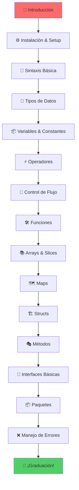
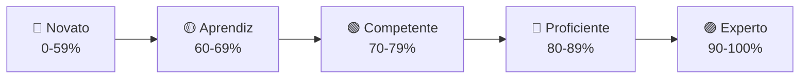

# 🌱 Fundamentos de Go - El Viaje Comienza

> *"Un viaje de mil millas comienza con un solo paso"* - Lao Tzu

¡Bienvenido al primer nivel de tu transformación hacia Go mastery! En esta sección construiremos los cimientos sólidos que te permitirán escalar hasta niveles senior+.

## 🎯 Objetivos del Nivel Fundamentos

Al completar este nivel serás capaz de:

- ✅ **Escribir programas Go** funcionales y eficientes
- ✅ **Comprender la filosofía** de Go y sus principios de diseño
- ✅ **Dominar la sintaxis** y estructuras de datos fundamentales
- ✅ **Manejar errores** de forma idiomática
- ✅ **Crear y usar paquetes** propios
- ✅ **Aplicar best practices** desde el principio
- ✅ **Debuggear y testear** código básico

## 🗺️ Roadmap de Fundamentos

## 📚 Contenido Detallado

### 🚀 [01. Introducción](./01-introduccion/)
- **Historia y filosofía** de Go
- **¿Por qué Go?** - Casos de uso y ventajas
- **Comparación** con otros lenguajes
- **Ecosistema** y comunidad
- **Roadmap personal** de aprendizaje

### ⚙️ [02. Instalación & Setup](./02-instalacion-setup/)
- **Instalación multiplataforma** (Linux, macOS, Windows)
- **Setup del workspace** y GOPATH vs Go Modules
- **IDEs y editores** recomendados
- **Herramientas esenciales** del ecosistema
- **Primer programa** "Hola Mundo" explicado línea por línea

### 📝 [03. Sintaxis Básica](./03-sintaxis-basica/)
- **Estructura** de un programa Go
- **Declaraciones e identificadores**
- **Comentarios** y documentación
- **Keywords** y tokens
- **Estilo de código** y gofmt

### 🎯 [04. Tipos de Datos](./04-tipos-datos/)
- **Tipos básicos** (int, float, string, bool)
- **Tipos compuestos** (arrays, slices, maps, structs)
- **Tipos de referencia** vs tipos de valor
- **Type assertions** y conversiones
- **Custom types** y type definitions

### 📦 [05. Variables & Constantes](./05-variables-constantes/)
- **Declaración** de variables (var, :=)
- **Scope** y visibilidad
- **Zero values** y inicialización
- **Constantes** typed y untyped
- **iota** y enumeraciones

### ⚡ [06. Operadores](./06-operadores/)
- **Operadores aritméticos** y de comparación
- **Operadores lógicos** y bitwise
- **Precedencia** y asociatividad
- **Operadores de asignación**
- **Pointer operators** (&, *)

### 🔀 [07. Control de Flujo](./07-control-flujo/)
- **if/else** statements
- **switch** statements (expression y type)
- **for loops** (todas las variantes)
- **range** loops
- **goto, break, continue**

### 🛠️ [08. Funciones](./08-funciones/)
- **Declaración** y llamada de funciones
- **Parámetros** y valores de retorno
- **Multiple return values**
- **Named return values**
- **Variadic functions**
- **Anonymous functions** y closures
- **Function types** y higher-order functions

### 📚 [09. Arrays & Slices](./09-arrays-slices/)
- **Arrays**: declaración, inicialización, operaciones
- **Slices**: anatomía, creación, operaciones
- **Slice internals**: backing array, length, capacity
- **append, copy, make**
- **Multi-dimensional arrays/slices**

### 🗺️ [10. Maps](./10-maps/)
- **Declaración** e inicialización
- **Operaciones básicas** (insert, update, delete, lookup)
- **Testing for presence**
- **Iterating over maps**
- **Map internals** y performance

### 🏗️ [11. Structs](./11-structs/)
- **Declaración** de structs
- **Struct literals** y initialization
- **Accessing fields**
- **Anonymous structs**
- **Struct embedding** (composición)
- **Struct tags** básicos

### 🎭 [12. Métodos](./12-metodos/)
- **Method declaration**
- **Receiver types** (value vs pointer)
- **Method sets**
- **Method expressions** y values
- **Embedding** y method promotion

### 🎪 [13. Interfaces Básicas](./13-interfaces-basicas/)
- **Interface declaration**
- **Implementing interfaces** implícitamente
- **Empty interface** (interface{})
- **Type assertions**
- **Type switches**

### 📦 [14. Paquetes](./14-paquetes/)
- **Package declaration**
- **Import statements**
- **Exported vs unexported** identifiers
- **Package organization**
- **init functions**
- **Circular imports** y cómo evitarlos

### ❌ [15. Manejo de Errores](./15-manejo-errores/)
- **Error interface**
- **Creating errors**
- **Error handling patterns**
- **Wrapping errors** (Go 1.13+)
- **Custom error types**

## 🎯 Sistema de Evaluación

### 📊 Criterios de Evaluación

| Criterio | Peso | Descripción |
|----------|------|-------------|
| **Sintaxis** | 20% | Correcto uso de la sintaxis Go |
| **Lógica** | 25% | Implementación correcta de algoritmos |
| **Style** | 15% | Adherencia a Go conventions |
| **Testing** | 20% | Casos de test completos |
| **Documentación** | 10% | Comentarios y documentación |
| **Performance** | 10% | Eficiencia básica del código |

### 🏆 Niveles de Competencia

## 🎮 Gamificación

### 🏅 Badges Disponibles

- **🚀 First Steps** - Completa tu primer programa
- **🐛 Bug Hunter** - Encuentra y corrige 10 bugs
- **📝 Code Warrior** - Escribe 1000 líneas de código
- **🧪 Test Master** - Escribe 100 tests
- **📚 Bookworm** - Lee toda la documentación
- **⚡ Speed Demon** - Completa ejercicios en tiempo récord
- **🎯 Perfectionist** - Obtén 100% en 5 evaluaciones consecutivas

### 🎲 Challenges Semanales

1. **Monday Code Kata** - Algoritmo del día
2. **Wednesday Debug Hunt** - Encuentra el bug oculto
3. **Friday Build Challenge** - Construye algo útil

## 📖 Metodología de Estudio Recomendada

### 📅 Plan de Estudio (4-6 semanas)

#### Semana 1: Fundamentos Básicos
- **Días 1-2**: Introducción + Instalación
- **Días 3-4**: Sintaxis + Tipos de Datos
- **Días 5-7**: Variables + Operadores

#### Semana 2: Control y Funciones
- **Días 8-9**: Control de Flujo
- **Días 10-12**: Funciones (teoría y práctica)
- **Días 13-14**: Ejercicios integrados

#### Semana 3: Estructuras de Datos
- **Días 15-16**: Arrays y Slices
- **Días 17-18**: Maps
- **Días 19-21**: Structs y Métodos

#### Semana 4: Interfaces y Paquetes
- **Días 22-23**: Interfaces Básicas
- **Días 24-25**: Paquetes
- **Días 26-28**: Manejo de Errores

#### Semanas 5-6: Consolidación
- **Proyectos prácticos**
- **Code reviews**
- **Preparación para nivel intermedio**

### 🎯 Tips de Estudio

1. **🕐 Consistencia > Intensidad** - 1 hora diaria es mejor que 7 horas un día
2. **✍️ Código a mano** - Escribe código en papel para entender mejor
3. **🗣️ Explica conceptos** - Si puedes enseñarlo, lo entiendes
4. **🔧 Practica debugging** - Introduce bugs intencionalmente y arréglios
5. **📖 Lee código ajeno** - Estudia código de proyectos open source

## 🔗 Recursos Adicionales

### 📚 Lectura Recomendada
- [The Go Programming Language](https://www.gopl.io/) - Donovan & Kernighan
- [Effective Go](https://golang.org/doc/effective_go.html) - Documentación oficial
- [Go by Example](https://gobyexample.com/) - Ejemplos prácticos

### 🎥 Videos y Cursos
- [Go Programming YouTube Playlist](link) - Tutoriales curados
- [GopherCon Talks](link) - Conferencias de la comunidad

### 🛠️ Herramientas Útiles
- [Go Playground](https://play.golang.org/) - Ejecuta Go en el browser
- [GoDoc](https://godoc.org/) - Documentación de paquetes
- [gofmt](https://golang.org/cmd/gofmt/) - Formateo automático

---

## 🚀 ¿Listo para Comenzar?

El viaje hacia Go mastery comienza ahora. Cada línea de código que escribas, cada concepto que domines, cada error que corrijas te acerca más a convertirte en un desarrollador Go excepcional.

**Recuerda:** 
- No hay preguntas tontas, solo oportunidades de aprender
- Los errores son tus mejores maestros
- La práctica constante supera al talento natural
- La comunidad Go está aquí para ayudarte

### 📞 ¿Necesitas Ayuda?

- 💬 **Discord**: [Go Deep Community](#)
- 📧 **Email**: support@go-deep.dev
- 🐦 **Twitter**: @GoDeepCourse
- 📝 **Issues**: [GitHub Issues](../../issues)

---

*¡Que comience la aventura! 🎮*

---

**Next:** [01. Introducción](./01-introduccion/) →
