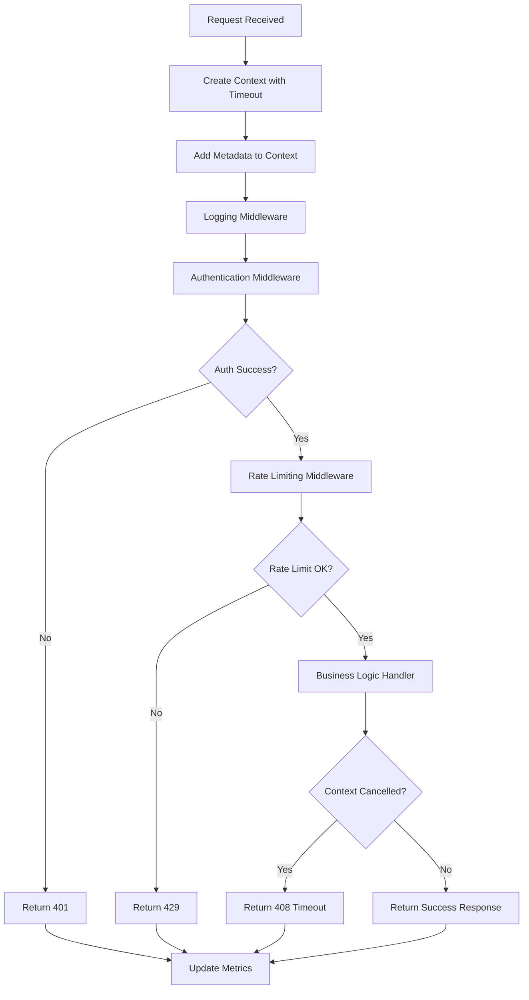

# 📋 Especificaciones del Proyecto: Sistema de Gestión de APIs

## 🎯 Visión General

Este proyecto implementa un **Sistema de Gestión de APIs** completo que demuestra el uso profesional del `Context` package en un entorno de producción real. El sistema maneja autenticación, rate limiting, logging, métricas y cancelación elegante.

---

## 🏗️ Arquitectura del Sistema

```
🌐 API Manager
├── 🔐 Authenticator (Gestión de autenticación)
├── 🚦 Rate Limiter (Control de tasa de requests)
├── 📝 Request Logger (Logging centralizado)
├── 📊 Metrics Collector (Recolección de métricas)
├── 🎯 Load Simulator (Simulación de carga)
└── 🛡️ Context Middleware Pipeline
```

### 📦 Componentes Principales

#### 1. **API Manager** - El Corazón del Sistema
- **Propósito**: Orquestador principal que maneja todas las requests
- **Context Usage**: Propagación de metadatos (userID, requestID, traceID)
- **Características**:
  - Timeout configurable por request (30s)
  - Pipeline de middleware con context
  - Shutdown elegante con timeout
  - Tracking de requests activas

#### 2. **Authentication Middleware**
- **Propósito**: Autenticación asíncrona con context
- **Context Usage**: Cancelación de auth queries lentas
- **Características**:
  - Bearer token validation
  - Context-aware timeouts
  - Logging con trace IDs

#### 3. **Rate Limiter**
- **Propósito**: Control de tasa de requests por usuario
- **Context Usage**: Respeta cancelaciones del context padre
- **Características**:
  - 100 requests por minuto por usuario
  - Cleanup automático de ventanas expiradas
  - Thread-safe con sync.RWMutex

#### 4. **Request Logger**
- **Propósito**: Logging centralizado con context tracing
- **Context Usage**: Propagación de trace IDs para correlación
- **Características**:
  - Buffer circular de 1000 logs
  - Timestamps precisos
  - Thread-safe logging

#### 5. **Load Simulator**
- **Propósito**: Simulación de carga realista
- **Context Usage**: Control de duración y cancelación
- **Características**:
  - Tasa configurable (requests por segundo)
  - Múltiples endpoints y usuarios
  - Métricas en tiempo real

---

## 🚀 Flujo de Procesamiento

### 🔄 Pipeline de Request Processing



### 📊 Context Data Flow

```
Request Context
├── 🆔 Request ID (para tracking único)
├── 👤 User ID (para autorización)
├── 🏢 Tenant ID (para multi-tenancy)
├── 🔍 Trace ID (para debugging)
├── ⏱️ Timeout (30s por request)
└── 🚫 Cancelación (manual o automática)
```

---

## 🎭 Patrones de Context Implementados

### 1. **Context Value Propagation**
```go
// Metadata se propaga automáticamente a través del pipeline
ctx = context.WithValue(ctx, RequestIDKey, req.ID)
ctx = context.WithValue(ctx, UserIDKey, req.UserID)
ctx = context.WithValue(ctx, TraceIDKey, generateTraceID())
```

### 2. **Context Timeout Management**
```go
// Timeout a nivel de request
reqCtx, cancel := context.WithTimeout(am.ctx, 30*time.Second)
defer cancel()

// Timeout a nivel de componente (auth)
authCtx, cancel := context.WithTimeout(ctx, 5*time.Second)
defer cancel()
```

### 3. **Context Cancellation Cascading**
```go
// Cancelación jerárquica desde el API Manager hacia abajo
am.cancel() // Cancela todas las requests activas
```

### 4. **Context-Aware Select Patterns**
```go
select {
case <-time.After(processingTime):
    // Procesamiento completado
case <-ctx.Done():
    // Request cancelada o timeout
    return timeoutResponse(ctx.Err())
}
```

---

## 📊 Sistema de Métricas

### 🎯 Métricas Recolectadas

| Métrica | Descripción | Uso del Context |
|---------|-------------|-----------------|
| **Total Requests** | Contador total de requests | N/A |
| **Successful Requests** | Requests con status 2xx | Context completion tracking |
| **Failed Requests** | Requests con status 4xx/5xx | Error propagation via context |
| **Timeout Requests** | Requests canceladas por timeout | `ctx.Err() == context.DeadlineExceeded` |
| **Average Response Time** | Tiempo promedio de respuesta | Context creation to completion |
| **Max Response Time** | Tiempo máximo de respuesta | Peak performance tracking |
| **Active Connections** | Requests actualmente procesándose | Context lifecycle tracking |

### 📈 Ejemplo de Output de Métricas

```json
{
  "total_requests": 300,
  "successful_requests": 240,
  "failed_requests": 45,
  "timeout_requests": 15,
  "avg_response_time": "150ms",
  "max_response_time": "2.1s",
  "active_connections": 8
}
```

---

## 🎮 Simulación de Carga

### 🔧 Configuración del Load Simulator

- **Tasa de Requests**: 10 requests/segundo
- **Duración**: 30 segundos
- **Endpoints Simulados**:
  - `/api/users` (100ms, 10% error rate)
  - `/api/orders` (300ms, 5% error rate)
  - `/api/analytics` (1s, 15% error rate)
  - `/api/reports` (2s, 20% error rate)

### 👥 Usuarios de Prueba

```go
validUsers := map[string]string{
    "user-1": "token-abc123",
    "user-2": "token-def456", 
    "user-3": "token-ghi789",
    "admin":  "token-admin999",
}
```

---

## 🛡️ Manejo de Errores y Timeouts

### ⏰ Timeouts Configurados

| Componente | Timeout | Razón |
|------------|---------|-------|
| **Request Global** | 30s | Evitar requests colgadas |
| **Authentication** | 5s | Auth queries no deben tardar |
| **Business Logic** | Variable | Según endpoint |
| **Shutdown** | 5s | Graceful shutdown |

### 🚫 Tipos de Cancelación

1. **Timeout del Request**: `context.DeadlineExceeded`
2. **Cancelación Manual**: `context.Canceled`
3. **Shutdown del Sistema**: Cancelación en cascada
4. **Rate Limiting**: Rechazo inmediato (no usa context)

---

## 🔍 Logging y Tracing

### 📝 Formato de Logs

```
[15:04:05.123] [trace-123456] GET /api/users - User: user-1, Tenant: tenant-1
[15:04:05.124] [trace-123456] Authentication successful
[15:04:05.125] [trace-123456] Processing business logic for /api/users
[15:04:05.225] [trace-123456] Business logic completed successfully
```

### 🔍 Trace ID Propagation

- Cada request recibe un **trace ID único**
- Se propaga a través del context a todos los componentes
- Permite correlacionar logs de una request específica
- Incluido en las respuestas para debugging

---

## 🚀 Instrucciones de Ejecución

### 1. **Ejecutar el Proyecto**
```bash
go run proyecto_api_manager.go
```

### 2. **Observar el Comportamiento**
- Sistema iniciará simulación de 10 req/s por 30 segundos
- Verás logs en tiempo real mostrando el procesamiento
- Métricas se actualizan cada 50 requests
- Después de 35s simula Ctrl+C para shutdown elegante

### 3. **Output Esperado**
```
🚀 Sistema de Gestión de APIs con Context
=========================================
🚀 Iniciando simulación de carga: 10 req/s por 30s

[15:04:05.123] [trace-123456] GET /api/users - User: user-1, Tenant: tenant-1
[15:04:05.124] [trace-123456] Authentication successful
...

📊 Métricas actuales:
   Total: 50 | ✅ 40 | ❌ 8 | ⏰ 2 | 🔗 3 activas
   Tiempo promedio: 150ms | Máximo: 1.2s

🛑 Señal de interrupción recibida
✅ Simulación completada: 300 requests enviadas

📊 Métricas Finales:
===================
{
  "total_requests": 300,
  "successful_requests": 240,
  ...
}
```

---

## 🎯 Objetivos de Aprendizaje Demostrados

### ✅ Context Fundamentals
- [x] Context creation y propagation
- [x] Value passing a través del context
- [x] Timeout y deadline management
- [x] Cancelación manual y automática

### ✅ Advanced Patterns
- [x] Middleware pipeline con context
- [x] Context composition en sistemas complejos
- [x] Error handling con context
- [x] Graceful shutdown patterns

### ✅ Real-World Applications
- [x] HTTP request processing
- [x] Authentication con timeouts
- [x] Rate limiting
- [x] Metrics collection
- [x] Distributed tracing básico
- [x] Load testing

### ✅ Best Practices
- [x] Context como primer parámetro
- [x] Typed keys para values
- [x] Proper cancellation handling
- [x] Resource cleanup con defer
- [x] Error propagation

---

## 🚀 Extensiones Posibles

1. **Database Integration**: Agregar queries con context timeout
2. **Circuit Breaker**: Implementar circuit breaker pattern
3. **Distributed Tracing**: Integrar con Jaeger o Zipkin
4. **Health Checks**: Endpoints de health con context
5. **Metrics Export**: Enviar métricas a Prometheus
6. **Configuration Hot Reload**: Recarga de config con context

---

**🎉 Este proyecto demuestra el poder del Context package en aplicaciones Go del mundo real, mostrando cómo crear sistemas robustos, observables y que manejan cancelación elegantemente.**
