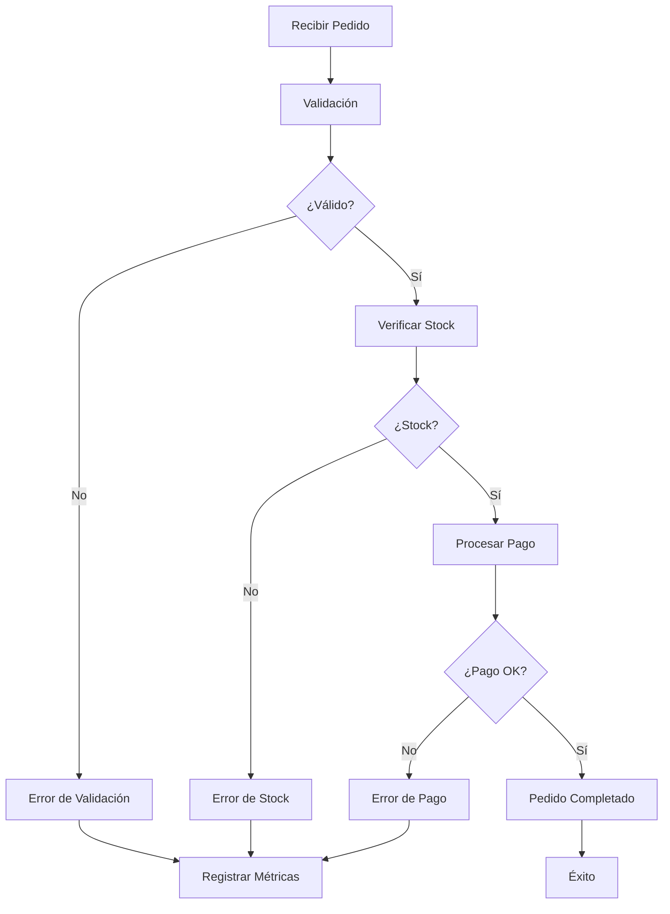

# 🏗️ PROYECTO: Sistema de Procesamiento de Pedidos Robusto

## 📋 Especificaciones del Proyecto

### 🎯 Objetivo
Desarrollar un sistema de procesamiento de pedidos que demuestre patrones avanzados de error handling en Go, incluyendo resilencia, observabilidad y recuperación automática.

---

## 🏗️ Arquitectura del Sistema

### 📦 Componentes Principales

```
🏢 OrderProcessor
├── 🔍 ValidationService
├── 📦 InventoryService  
├── 💳 PaymentService
└── 📊 ErrorMetrics
```

### 🔄 Flujo de Procesamiento



---

## 🚨 Sistema de Errores

### 1. **Jerarquía de Errores**

```go
📋 Error Hierarchy
├── 🔍 ValidationError
│   ├── Field: string
│   ├── Value: interface{}
│   ├── Message: string
│   └── Code: string
├── 🏢 BusinessError
│   ├── Operation: string
│   ├── Reason: string
│   ├── Code: string
│   ├── Timestamp: time.Time
│   └── Err: error (wrapped)
└── 🏗️ InfrastructureError
    ├── Service: string
    ├── Operation: string
    ├── Message: string
    ├── Timestamp: time.Time
    ├── Retryable: bool
    └── Err: error (wrapped)
```

### 2. **Errores Sentinela**

| Error | Uso | Contexto |
|-------|-----|----------|
| `ErrOrderNotFound` | Pedido no existe | Business Logic |
| `ErrInsufficientStock` | Stock insuficiente | Inventory Service |
| `ErrPaymentFailed` | Pago rechazado | Payment Service |
| `ErrInvalidOrderData` | Datos inválidos | Validation |
| `ErrServiceUnavailable` | Servicio no disponible | Infrastructure |

---

## 🎯 Patrones Implementados

### 1. **Result Type Pattern**

```go
type Result[T any] struct {
    value T
    err   error
}

// Funciones de construcción
func Success[T any](value T) Result[T]
func Failure[T any](err error) Result[T]

// Métodos de transformación
func Map[T, U any](r Result[T], fn func(T) U) Result[U]
func FlatMap[T, U any](r Result[T], fn func(T) Result[U]) Result[U]
```

**Beneficios:**
- Composición funcional de operaciones
- Error handling explícito
- Transformaciones type-safe

### 2. **Circuit Breaker Avanzado**

```go
type CircuitBreakerConfig struct {
    FailureThreshold   int           // Fallos para abrir
    RecoveryTimeout    time.Duration // Tiempo de recovery
    SuccessThreshold   int           // Éxitos para cerrar
    MaxRequests        int           // Máx requests en half-open
}
```

**Estados:**
- `CLOSED` ✅: Operación normal
- `OPEN` ⛔: Servicio caído, rechazar requests
- `HALF_OPEN` 🟡: Probando recovery

### 3. **Retry con Backoff Exponencial**

```go
type RetryConfig struct {
    MaxAttempts     int
    InitialDelay    time.Duration
    MaxDelay        time.Duration
    BackoffFactor   float64
    RetryableErrors []error
}
```

**Características:**
- Backoff exponencial: 1s → 2s → 4s → 8s...
- Límite máximo de delay
- Errores específicos reintentables
- Interface `RetryableError`

### 4. **Sistema de Métricas**

```go
type ErrorMetrics struct {
    totalErrors     int64
    errorsByType    map[string]int64
    errorsByService map[string]int64
    recentErrors    []ErrorEvent
}
```

**Tracking:**
- Contadores por tipo de error
- Contadores por servicio
- Historial de errores recientes
- Metadatos contextuales

---

## 🧪 Casos de Prueba

### 1. **Pedido Válido** ✅
```json
{
    "id": "order-001",
    "customer_id": "customer-123",
    "items": [
        {"product_id": "product-1", "quantity": 2, "price": 25.99},
        {"product_id": "product-2", "quantity": 1, "price": 15.50}
    ],
    "total_amount": 67.48
}
```
**Resultado:** Procesamiento exitoso

### 2. **Datos Inválidos** ❌
```json
{
    "id": "",           // Campo requerido vacío
    "customer_id": "customer-456",
    "items": [],        // Sin items
    "total_amount": -10.0  // Monto inválido
}
```
**Resultado:** `ValidationError` múltiples campos

### 3. **Stock Insuficiente** ⚠️
```json
{
    "id": "order-003",
    "customer_id": "customer-789",
    "items": [
        {"product_id": "product-3", "quantity": 5, "price": 30.00}
    ]
}
```
**Resultado:** `BusinessError` - INSUFFICIENT_STOCK

### 4. **Error de Pago** 💳
- Método: `invalid_card`
- **Resultado:** `BusinessError` - INVALID_PAYMENT_METHOD
- Método: `network_error`
- **Resultado:** `InfrastructureError` (retryable)

---

## 📊 Observabilidad

### 1. **Métricas Principales**

| Métrica | Descripción | Uso |
|---------|-------------|-----|
| `total_errors` | Total de errores del sistema | Dashboard general |
| `errors_by_type` | Errores agrupados por tipo | Identificar patrones |
| `errors_by_service` | Errores por servicio | Localizar problemas |
| `recent_errors` | Últimos N errores | Debugging inmediato |

### 2. **Event Logging**

```go
type ErrorEvent struct {
    Timestamp   time.Time
    ErrorType   string
    Service     string
    Operation   string
    Message     string
    Severity    string      // warning, error, critical
    Metadata    interface{} // Contexto adicional
}
```

### 3. **Circuit Breaker Stats**

```go
{
    "state": "OPEN",
    "failures": 5,
    "successes": 0,
    "requests": 15,
    "last_failure": "2024-01-15T10:30:00Z"
}
```

---

## 🔧 Configuración de Servicios

### 1. **InventoryService**
```go
CircuitBreakerConfig{
    FailureThreshold: 3,
    RecoveryTimeout:  5 * time.Second,
    SuccessThreshold: 2,
    MaxRequests:      5,
}
```

### 2. **PaymentService**
```go
CircuitBreakerConfig{
    FailureThreshold: 5,
    RecoveryTimeout:  10 * time.Second,
    SuccessThreshold: 3,
    MaxRequests:      10,
}

RetryConfig{
    MaxAttempts:   3,
    InitialDelay:  1 * time.Second,
    MaxDelay:      5 * time.Second,
    BackoffFactor: 2.0,
}
```

---

## 🎉 Características Destacadas

### ✅ **Robustez**
- Circuit breakers en servicios críticos
- Retry automático con backoff inteligente
- Degradación graceful en fallos

### ✅ **Observabilidad**
- Métricas detalladas por servicio
- Event logging estructurado
- Historial de errores recientes

### ✅ **Mantenibilidad**
- Errores tipados con contexto
- Error wrapping preserva causas
- Separación clara de responsabilidades

### ✅ **Testabilidad**
- Servicios con interfaces claras
- Inyección de dependencias
- Estados simulables

### ✅ **Performance**
- Circuit breakers previenen cascadas
- Timeouts configurables
- Métricas eficientes

---

## 🚀 Ejecución

### Compilar y Ejecutar
```bash
cd /workspaces/go-deep/02-intermedio/16-error-handling/proyecto
go run proyecto_sistema_robusto.go
```

### Salida Esperada
```
🏗️ SISTEMA DE PROCESAMIENTO DE PEDIDOS ROBUSTO
============================================

🔄 Procesando pedidos de prueba...

--- Caso 1: Pedido Válido ---
✅ Order order-001 processed successfully. Transaction: txn_1705123456

--- Caso 2: Pedido con Datos Inválidos ---
❌ Error: order validation failed: validation failed for field 'id': cannot be empty
   🔍 Tipo: Error de validación (Campo: id)

📊 MÉTRICAS DEL SISTEMA
========================
Total de errores: 8
Errores por tipo:
  validation_error: 3
  business_error: 2
  infrastructure_error: 1
```

---

## 💡 Lecciones Aprendidas

1. **Error Handling Estructurado**: Usar tipos específicos facilita el debugging
2. **Resilencia por Diseño**: Circuit breakers y retry previenen cascadas
3. **Observabilidad Crítica**: Métricas permiten mejora continua
4. **Composición Funcional**: Result types simplifican error handling
5. **Separación de Concerns**: Cada servicio maneja sus propios errores

---

**🎯 Este proyecto demuestra cómo crear sistemas de producción robustos que manejan errores de manera elegante, proporcionan visibilidad completa y se recuperan automáticamente de fallos transitorios.**
