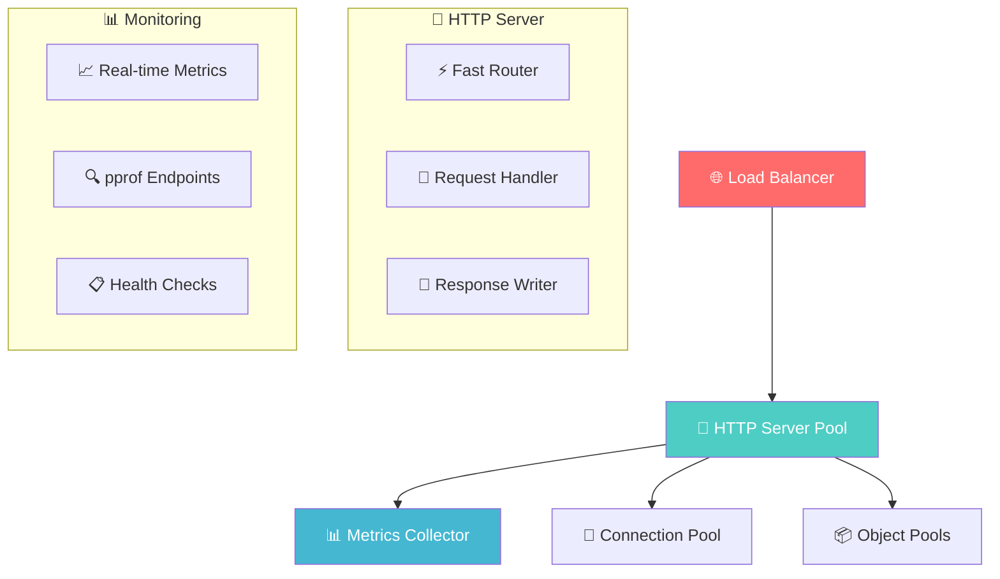

# 🏆 Proyecto Final: High-Performance Web Server
## *Construye un servidor web que vuela*

### 🎯 Objetivo del Proyecto

Crear un servidor HTTP de alta performance que pueda manejar **100,000+ requests por segundo** utilizando todas las técnicas de optimización aprendidas.

### 🚀 Características Requeridas

#### ✅ **Core Features**
- **🌐 HTTP Server**: Manejo de requests/responses optimizado
- **📊 Metrics**: Recolección de métricas en tiempo real
- **🔄 Connection Pooling**: Reutilización eficiente de conexiones
- **📈 Load Testing**: Herramientas integradas de benchmark
- **🔍 Profiling**: Endpoints para profiling en producción

#### ⚡ **Performance Requirements**
- **Throughput**: >100K RPS en hardware moderno
- **Latency**: p99 < 10ms para operaciones simples
- **Memory**: <1GB RAM para 100K concurrent connections
- **CPU**: >80% utilización en todos los cores

### 🏗️ Arquitectura del Sistema



---

## 📋 Implementación Paso a Paso

### 🏗️ **Fase 1: Servidor Base (Día 1-2)**

```go
// 📁 cmd/server/main.go
package main

import (
    "flag"
    "log"
    "runtime"
    
    "your-project/internal/server"
    "your-project/internal/config"
)

func main() {
    // TODO: Implementa el servidor base
    var (
        addr     = flag.String("addr", ":8080", "Server address")
        workers  = flag.Int("workers", runtime.NumCPU(), "Number of workers")
        profile  = flag.Bool("profile", false, "Enable profiling")
    )
    flag.Parse()
    
    cfg := config.Load()
    srv := server.New(cfg)
    
    log.Printf("🚀 Starting server on %s with %d workers", *addr, *workers)
    log.Fatal(srv.ListenAndServe(*addr))
}
```

```go
// 📁 internal/server/server.go
package server

import (
    "net/http"
    "sync"
    "time"
)

// 🚀 High-performance server structure
type Server struct {
    router      *Router
    metrics     *Metrics
    pools       *ResourcePools
    config      *Config
}

// TODO: Implementa New(), ListenAndServe(), y métodos principales
```

### ⚡ **Fase 2: Optimizaciones Core (Día 3-4)**

#### 🔧 **Fast Router Implementation**
```go
// 📁 internal/server/router.go
package server

// 🚀 Ultra-fast trie-based router
type Router struct {
    // TODO: Implementa un router optimizado
    // Hint: Usa trie/radix tree para O(log n) lookup
}

type RouteNode struct {
    path     string
    handler  http.HandlerFunc
    children map[byte]*RouteNode
    isEnd    bool
}

func (r *Router) Route(method, path string, handler http.HandlerFunc) {
    // TODO: Implementa routing eficiente
}

func (r *Router) ServeHTTP(w http.ResponseWriter, req *http.Request) {
    // TODO: Lookup ultra-rápido de rutas
}
```

#### 🔄 **Object Pooling System**
```go
// 📁 internal/server/pools.go
package server

import "sync"

type ResourcePools struct {
    responseWriters sync.Pool
    requestBuffers  sync.Pool
    jsonEncoders    sync.Pool
}

func NewResourcePools() *ResourcePools {
    return &ResourcePools{
        responseWriters: sync.Pool{
            New: func() interface{} {
                // TODO: Crear response writer optimizado
            },
        },
        // TODO: Implementa otros pools
    }
}
```

### 📊 **Fase 3: Metrics y Monitoring (Día 5-6)**

```go
// 📁 internal/server/metrics.go
package server

import (
    "sync/atomic"
    "time"
)

// 📊 Lock-free metrics collector
type Metrics struct {
    requestCount   int64
    totalLatency   int64
    errorCount     int64
    activeConns    int64
    peakLatency    int64
}

func (m *Metrics) RecordRequest(latency time.Duration, isError bool) {
    atomic.AddInt64(&m.requestCount, 1)
    atomic.AddInt64(&m.totalLatency, int64(latency))
    
    if isError {
        atomic.AddInt64(&m.errorCount, 1)
    }
    
    // TODO: Implementa peak latency tracking thread-safe
}

func (m *Metrics) GetSnapshot() MetricsSnapshot {
    // TODO: Retorna snapshot atomico de métricas
}
```

### 🔍 **Fase 4: Profiling Integrado (Día 7)**

```go
// 📁 internal/server/profiling.go
package server

import (
    "net/http"
    _ "net/http/pprof"
)

func (s *Server) setupProfiling() {
    if s.config.EnableProfiling {
        go func() {
            // Servidor dedicado para profiling
            log.Println("🔍 Profiling server on :6060")
            log.Println(http.ListenAndServe(":6060", nil))
        }()
    }
}

// 🎯 Custom profiling endpoints
func (s *Server) metricsHandler(w http.ResponseWriter, r *http.Request) {
    // TODO: Endpoint optimizado para métricas JSON
}
```

---

## 🧪 Testing y Benchmarking

### 📊 **Load Testing Suite**

```go
// 📁 internal/testing/loadtest.go
package testing

import (
    "context"
    "net/http"
    "sync"
    "time"
)

type LoadTestConfig struct {
    URL             string
    Concurrency     int
    Duration        time.Duration
    RequestsPerSec  int
}

type LoadTestResult struct {
    TotalRequests   int64
    SuccessfulReqs  int64
    FailedReqs      int64
    AvgLatency      time.Duration
    P50Latency      time.Duration
    P95Latency      time.Duration
    P99Latency      time.Duration
    MaxLatency      time.Duration
    RequestsPerSec  float64
}

func RunLoadTest(cfg LoadTestConfig) *LoadTestResult {
    // TODO: Implementa load testing avanzado
    // Usar worker pools, rate limiting, etc.
}
```

### 🎯 **Benchmark Scripts**

```bash
#!/bin/bash
# 📁 scripts/benchmark.sh

echo "🚀 Starting Performance Benchmark Suite"
echo "========================================"

# Build optimized binary
go build -ldflags="-s -w" -o server cmd/server/main.go

# Start server in background
./server -addr=:8080 &
SERVER_PID=$!

# Wait for server to start
sleep 2

echo "📊 Running benchmarks..."

# Basic load test
echo "🔥 Basic Load Test (1K RPS, 30s)"
hey -z 30s -q 1000 -c 50 http://localhost:8080/api/health

# Heavy load test
echo "🔥 Heavy Load Test (10K RPS, 60s)"
hey -z 60s -q 10000 -c 200 http://localhost:8080/api/test

# Memory benchmark
echo "🧠 Memory Usage Test"
ps -p $SERVER_PID -o pid,rss,vsz

# Kill server
kill $SERVER_PID

echo "✅ Benchmark completed!"
```

---

## 🎯 Milestones y Entregables

### 🏁 **Milestone 1: Basic Server (25%)**
- ✅ HTTP server funcionando
- ✅ Routing básico implementado
- ✅ Manejo de 1K RPS consistente

### 🏁 **Milestone 2: Optimizations (50%)**
- ✅ Object pooling implementado
- ✅ Connection reuse optimizado
- ✅ Manejo de 10K RPS

### 🏁 **Milestone 3: Monitoring (75%)**
- ✅ Metrics collection en tiempo real
- ✅ Profiling endpoints funcionando
- ✅ Health checks implementados

### 🏁 **Milestone 4: Production Ready (100%)**
- ✅ 100K RPS sostenido
- ✅ p99 latency < 10ms
- ✅ Memory usage optimizado
- ✅ Documentación completa

---

## 📊 Métricas de Éxito

### 🎯 **Performance Targets**

| Métrica              | Minimum | Target   | Stretch  |
| -------------------- | ------- | -------- | -------- |
| **Throughput**       | 50K RPS | 100K RPS | 200K RPS |
| **P99 Latency**      | <20ms   | <10ms    | <5ms     |
| **Memory Usage**     | <2GB    | <1GB     | <500MB   |
| **CPU Efficiency**   | >60%    | >80%     | >90%     |
| **Connection Reuse** | >80%    | >95%     | >99%     |

### 📈 **Testing Matrix**

```go
// 📁 internal/testing/scenarios.go
package testing

var BenchmarkScenarios = []LoadTestConfig{
    {
        Name:           "Light Load",
        Concurrency:    10,
        RequestsPerSec: 1000,
        Duration:       time.Minute,
    },
    {
        Name:           "Medium Load", 
        Concurrency:    50,
        RequestsPerSec: 10000,
        Duration:       time.Minute * 5,
    },
    {
        Name:           "Heavy Load",
        Concurrency:    200,
        RequestsPerSec: 50000,
        Duration:       time.Minute * 10,
    },
    {
        Name:           "Stress Test",
        Concurrency:    500,
        RequestsPerSec: 100000,
        Duration:       time.Minute * 15,
    },
}
```

---

## 🔧 Herramientas Recomendadas

### 📊 **Load Testing**
```bash
# Hey - HTTP load testing
go install github.com/rakyll/hey@latest

# Vegeta - HTTP load testing
go install github.com/tsenart/vegeta@latest

# wrk - Modern HTTP benchmarking tool
sudo apt install wrk  # Ubuntu/Debian
```

### 🔍 **Profiling**
```bash
# pprof analysis
go tool pprof http://localhost:6060/debug/pprof/profile

# Memory profiling
go tool pprof http://localhost:6060/debug/pprof/heap

# Goroutine analysis
go tool pprof http://localhost:6060/debug/pprof/goroutine
```

### 📈 **Monitoring**
```bash
# htop - Process monitoring
sudo apt install htop

# iotop - I/O monitoring  
sudo apt install iotop

# nethogs - Network monitoring
sudo apt install nethogs
```

---

## 🎓 Aprendizajes Esperados

Al completar este proyecto dominarás:

- ⚡ **Optimización de HTTP servers** en Go
- 🔄 **Object pooling** y memory management
- 📊 **Metrics collection** sin impacto en performance
- 🔍 **Profiling** de aplicaciones en producción
- 📈 **Load testing** y análisis de resultados
- 🏗️ **Arquitectura** de sistemas high-performance

---

## 🚀 Extensiones Avanzadas

### 🌟 **Bonus Features**
- **🔐 TLS Optimization**: Implementa TLS 1.3 con session resumption
- **📡 HTTP/2 Support**: Server Push y multiplexing
- **⚖️ Load Balancing**: Round-robin, least connections
- **🛡️ Rate Limiting**: Token bucket, sliding window
- **📊 Distributed Tracing**: OpenTelemetry integration

### 🎯 **Challenge Mode**
- **1M RPS**: Optimiza para un millón de requests por segundo
- **Zero-Copy**: Implementa zero-copy networking donde sea posible
- **Custom Allocator**: Memory allocator optimizado para tu workload
- **Assembly Optimization**: Optimizaciones críticas en assembly

---

## 📝 Entrega Final

### 📦 **Estructura del Proyecto**
```
high-performance-server/
├── cmd/
│   └── server/
│       └── main.go
├── internal/
│   ├── server/
│   ├── config/
│   ├── metrics/
│   └── testing/
├── scripts/
│   ├── benchmark.sh
│   ├── profile.sh
│   └── deploy.sh
├── docs/
│   ├── ARCHITECTURE.md
│   ├── PERFORMANCE.md
│   └── API.md
├── go.mod
├── go.sum
└── README.md
```

### 📊 **Reporte Final** 
Incluye:
1. **🏗️ Arquitectura**: Diagramas y explicación del diseño
2. **📈 Benchmarks**: Resultados detallados de performance
3. **🔍 Profiling**: Análisis de CPU, memoria y goroutines
4. **💡 Optimizaciones**: Técnicas implementadas y su impacto
5. **🎯 Lecciones**: Aprendizajes y mejores prácticas
6. **🚀 Futuro**: Próximas optimizaciones a implementar

---

## 🏆 ¡El Desafío te Espera!

```bash
# 🚀 Setup inicial
mkdir high-performance-server
cd high-performance-server
go mod init high-performance-server

# 🎯 Crear estructura básica
mkdir -p cmd/server internal/{server,config,metrics,testing} scripts docs

# 🔥 ¡Comienza a construir el servidor más rápido!
echo "🚀 Ready to build the fastest Go server ever!"
```

**¿Estás listo para el desafío? ¡A construir un servidor que vuele! 🚀**
