# 🧠 Lección 02: Memory Management
## *Dominando el Garbage Collector y la Gestión de Memoria*

> *"En Go, la gestión de memoria es como dirigir una orquesta: el garbage collector es el director, pero tú decides qué música tocar"* - Rob Pike (parafraseado)

### 🎯 ¿Qué Aprenderás Hoy?

Al final de esta lección, serás capaz de:
- 🧠 **Entender profundamente** cómo funciona el garbage collector de Go
- 📊 **Optimizar allocations** para minimizar presión en el GC
- 🔍 **Analizar memory profiles** como un experto
- ⚡ **Implementar técnicas** para reducir latencia del GC
- 🏗️ **Diseñar estructuras** memory-efficient
- 🎯 **Tunear el GC** para tu workload específico

### 🧠 Analogías para Entender Memory Management

#### 🏠 **Tu Programa es como una Casa**

```mermaid
graph TB
    A[🏠 Casa = Programa] --> B[📚 Stack = Biblioteca]
    A --> C[🛏️ Heap = Dormitorios]
    A --> D[🧹 GC = Servicio de Limpieza]
    
    B --> E[📖 Variables Locales<br/>Fácil acceso]
    C --> F[🧳 Objetos Dinámicos<br/>Más espacio, más lento]
    D --> G[🗑️ Recolección Automática<br/>Limpia lo no usado]
    
    style A fill:#ff6b6b,color:#fff
    style B fill:#4ecdc4,color:#fff
    style C fill:#45b7d1,color:#fff
    style D fill:#2ed573,color:#fff
```



- **📚 Stack (Biblioteca)**: Variables locales, rápido acceso, automáticamente organizado
- **🛏️ Heap (Dormitorios)**: Objetos grandes, acceso más lento, necesita limpieza
- **🧹 GC (Servicio de Limpieza)**: Viene periódicamente, encuentra basura, la elimina
- **🚪 Escape Analysis**: Decide si algo va a la biblioteca o al dormitorio

#### 🏭 **Memory Management como Gestión de Inventario**

> *Imagina que gestionar memoria es como dirigir un almacén gigante donde constantemente llegan y salen productos.*

```mermaid
flowchart TD
    A[📦 Allocation Request] --> B{🔍 Size Analysis}
    B -->|Small| C[📚 Stack Allocation]
    B -->|Large| D[🏬 Heap Allocation]
    
    D --> E[🏷️ Object Tracking]
    E --> F[📊 GC Monitoring]
    F --> G{🧹 Cleanup Time?}
    G -->|Yes| H[🗑️ Mark & Sweep]
    G -->|No| I[⏳ Continue Execution]
    
    H --> J[♻️ Memory Freed]
    J --> I
    
    style A fill:#feca57,color:#000
    style C fill:#48dbfb,color:#000
    style D fill:#ff9ff3,color:#000
    style H fill:#ff6b6b,color:#fff
```



## 📚 Teoría Fundamental

### 🎯 **El Garbage Collector de Go: Concurrent Mark & Sweep**

#### 🔄 **Fases del Garbage Collection**

```mermaid
sequenceDiagram
    participant App as 🚀 Application
    participant GC as 🧹 Garbage Collector
    participant Mem as 🧠 Memory
    
    App->>Mem: Allocate objects
    Note over Mem: Memory usage grows
    
    GC->>GC: 📊 Trigger condition met
    GC->>App: 🛑 Brief pause (STW)
    GC->>Mem: 🔍 Mark reachable objects
    GC->>App: ▶️ Resume execution
    
    par Concurrent Sweep
        App->>Mem: Continue allocating
    and
        GC->>Mem: 🗑️ Sweep unreachable objects
    end
    
    GC->>Mem: ♻️ Memory freed
    Note over Mem: Memory usage reduced
```



#### ⚙️ **GC Tuning Parameters**

```go
package main

import (
    "os"
    "runtime"
    "runtime/debug"
    "strconv"
)

// 🎛️ GC Configuration Manager
type GCConfig struct {
    TargetPercentage int     // GOGC value
    MemoryLimit      int64   // GOMEMLIMIT in bytes
    MaxProcs         int     // GOMAXPROCS
}

func OptimizeGCForWorkload(workloadType string) GCConfig {
    switch workloadType {
    case "low-latency":
        // 🚀 Optimized for minimal pauses
        return GCConfig{
            TargetPercentage: 50,  // More frequent, shorter GCs
            MemoryLimit:      2 << 30, // 2GB limit
            MaxProcs:         runtime.NumCPU(),
        }
    
    case "high-throughput":
        // ⚡ Optimized for maximum throughput
        return GCConfig{
            TargetPercentage: 200, // Less frequent, longer GCs
            MemoryLimit:      8 << 30, // 8GB limit
            MaxProcs:         runtime.NumCPU(),
        }
    
    case "memory-constrained":
        // 💾 Optimized for minimal memory usage
        return GCConfig{
            TargetPercentage: 20,  // Very frequent GCs
            MemoryLimit:      512 << 20, // 512MB limit
            MaxProcs:         runtime.NumCPU() / 2,
        }
    
    default:
        // 🎯 Balanced configuration
        return GCConfig{
            TargetPercentage: 100, // Default
            MemoryLimit:      4 << 30, // 4GB limit
            MaxProcs:         runtime.NumCPU(),
        }
    }
}

func ApplyGCConfig(config GCConfig) {
    // Set GOGC percentage
    debug.SetGCPercent(config.TargetPercentage)
    
    // Set memory limit (Go 1.19+)
    debug.SetMemoryLimit(config.MemoryLimit)
    
    // Set max procs
    runtime.GOMAXPROCS(config.MaxProcs)
    
    // Optional: Set via environment variables for child processes
    os.Setenv("GOGC", strconv.Itoa(config.TargetPercentage))
    os.Setenv("GOMEMLIMIT", strconv.FormatInt(config.MemoryLimit, 10))
    os.Setenv("GOMAXPROCS", strconv.Itoa(config.MaxProcs))
}
```

### 🔍 **Escape Analysis: ¿Stack o Heap?**

```go
package main

import "fmt"

// 🏠 Examples of escape analysis decisions

// ✅ Stays on stack - no escape
func StackAllocation() {
    x := 42 // Local variable, doesn't escape
    fmt.Println("Value:", x)
}

// ❌ Escapes to heap - pointer returned
func HeapAllocation() *int {
    x := 42 // Escapes! Pointer is returned
    return &x
}

// ❌ Escapes to heap - stored in interface
func InterfaceEscape() {
    x := 42
    var i interface{} = x // Escapes to heap
    fmt.Println(i)
}

// ❌ Escapes to heap - too large for stack
func LargeObjectEscape() {
    // Large arrays escape to heap
    data := [100000]int{} // Too big for stack
    data[0] = 1
}

// ✅ Stays on stack - slice with known bounds
func StackSlice() {
    data := make([]int, 10) // Small, known size
    data[0] = 1
}

// ❌ Escapes to heap - dynamic size
func HeapSlice(n int) {
    data := make([]int, n) // Size not known at compile time
    data[0] = 1
}

// 🔍 Check escape analysis:
// go build -gcflags="-m" main.go
```

### 📊 **Memory Allocation Patterns**

#### 🎯 **Efficient vs Inefficient Patterns**

```go
package main

import (
    "fmt"
    "strings"
)

// 🐌 Inefficient: Multiple small allocations
func InefficientStringProcessing(strs []string) string {
    result := ""
    for _, s := range strs {
        result += s + " " // Each += creates new string!
    }
    return result
}

// 🚀 Efficient: Pre-allocated builder
func EfficientStringProcessing(strs []string) string {
    // Calculate total capacity needed
    totalLen := 0
    for _, s := range strs {
        totalLen += len(s) + 1 // +1 for space
    }
    
    var builder strings.Builder
    builder.Grow(totalLen) // Pre-allocate
    
    for i, s := range strs {
        if i > 0 {
            builder.WriteByte(' ')
        }
        builder.WriteString(s)
    }
    return builder.String()
}

// 🐌 Inefficient: Slice growth
func InefficientSliceGrowth() []int {
    var result []int
    for i := 0; i < 10000; i++ {
        result = append(result, i) // Multiple reallocations
    }
    return result
}

// 🚀 Efficient: Pre-allocated slice
func EfficientSliceGrowth() []int {
    result := make([]int, 0, 10000) // Pre-allocate capacity
    for i := 0; i < 10000; i++ {
        result = append(result, i) // No reallocations
    }
    return result
}

// 🐌 Inefficient: Map without size hint
func InefficientMapCreation(size int) map[string]int {
    m := make(map[string]int) // Will grow multiple times
    for i := 0; i < size; i++ {
        m[fmt.Sprintf("key%d", i)] = i
    }
    return m
}

// 🚀 Efficient: Map with size hint
func EfficientMapCreation(size int) map[string]int {
    m := make(map[string]int, size) // Pre-allocated
    for i := 0; i < size; i++ {
        m[fmt.Sprintf("key%d", i)] = i
    }
    return m
}
```

## 🔬 Memory Profiling Avanzado

### 📊 **Collecting Memory Profiles**

```go
package main

import (
    "os"
    "runtime"
    "runtime/pprof"
    "time"
)

// 📊 Memory Profiler utility
type MemoryProfiler struct {
    interval time.Duration
    output   string
}

func NewMemoryProfiler(interval time.Duration, output string) *MemoryProfiler {
    return &MemoryProfiler{
        interval: interval,
        output:   output,
    }
}

func (mp *MemoryProfiler) StartProfiling() {
    ticker := time.NewTicker(mp.interval)
    defer ticker.Stop()
    
    for {
        select {
        case <-ticker.C:
            mp.takeSnapshot()
        }
    }
}

func (mp *MemoryProfiler) takeSnapshot() {
    // Force garbage collection for accurate snapshot
    runtime.GC()
    
    // Create memory profile
    filename := fmt.Sprintf("%s_%d.prof", mp.output, time.Now().Unix())
    f, err := os.Create(filename)
    if err != nil {
        log.Printf("Error creating profile: %v", err)
        return
    }
    defer f.Close()
    
    if err := pprof.WriteHeapProfile(f); err != nil {
        log.Printf("Error writing profile: %v", err)
    }
}

// 🎯 Memory usage tracker
type MemoryTracker struct {
    baseline runtime.MemStats
    current  runtime.MemStats
}

func NewMemoryTracker() *MemoryTracker {
    mt := &MemoryTracker{}
    runtime.ReadMemStats(&mt.baseline)
    return mt
}

func (mt *MemoryTracker) Snapshot() MemorySnapshot {
    runtime.ReadMemStats(&mt.current)
    
    return MemorySnapshot{
        AllocBytes:      mt.current.Alloc,
        TotalAllocBytes: mt.current.TotalAlloc,
        SysBytes:        mt.current.Sys,
        NumGC:           mt.current.NumGC,
        GCPauseNs:       mt.current.PauseNs[(mt.current.NumGC+255)%256],
        
        // Deltas from baseline
        AllocDelta:      int64(mt.current.Alloc) - int64(mt.baseline.Alloc),
        TotalAllocDelta: int64(mt.current.TotalAlloc) - int64(mt.baseline.TotalAlloc),
        GCDelta:         mt.current.NumGC - mt.baseline.NumGC,
    }
}

type MemorySnapshot struct {
    AllocBytes      uint64
    TotalAllocBytes uint64
    SysBytes        uint64
    NumGC           uint32
    GCPauseNs       uint64
    
    AllocDelta      int64
    TotalAllocDelta int64
    GCDelta         uint32
}

func (ms MemorySnapshot) String() string {
    return fmt.Sprintf(`Memory Snapshot:
  Current Alloc: %s (%+s)
  Total Alloc:   %s (%+s)  
  System:        %s
  GC Runs:       %d (+%d)
  Last GC Pause: %v`,
        formatBytes(ms.AllocBytes), formatDelta(ms.AllocDelta),
        formatBytes(ms.TotalAllocBytes), formatDelta(ms.TotalAllocDelta),
        formatBytes(ms.SysBytes),
        ms.NumGC, ms.GCDelta,
        time.Duration(ms.GCPauseNs))
}

func formatBytes(b uint64) string {
    const unit = 1024
    if b < unit {
        return fmt.Sprintf("%d B", b)
    }
    div, exp := uint64(unit), 0
    for n := b / unit; n >= unit; n /= unit {
        div *= unit
        exp++
    }
    return fmt.Sprintf("%.1f %cB", float64(b)/float64(div), "KMGTPE"[exp])
}

func formatDelta(delta int64) string {
    if delta == 0 {
        return "±0"
    }
    sign := "+"
    if delta < 0 {
        sign = "-"
        delta = -delta
    }
    return fmt.Sprintf("%s%s", sign, formatBytes(uint64(delta)))
}
```

### 🧪 **Memory Leak Detection**

```go
package main

import (
    "context"
    "sync"
    "time"
)

// 🕵️ Memory leak detector
type LeakDetector struct {
    samples    []MemorySnapshot
    threshold  uint64
    interval   time.Duration
    alertFunc  func(leak LeakAlert)
    mutex      sync.RWMutex
}

type LeakAlert struct {
    DetectedAt    time.Time
    GrowthRate    uint64 // bytes per second
    CurrentAlloc  uint64
    Trend         string
    Samples       []MemorySnapshot
}

func NewLeakDetector(threshold uint64, interval time.Duration) *LeakDetector {
    return &LeakDetector{
        samples:   make([]MemorySnapshot, 0, 100),
        threshold: threshold,
        interval:  interval,
        alertFunc: defaultLeakAlert,
    }
}

func (ld *LeakDetector) Start(ctx context.Context) {
    ticker := time.NewTicker(ld.interval)
    defer ticker.Stop()
    
    tracker := NewMemoryTracker()
    
    for {
        select {
        case <-ctx.Done():
            return
        case <-ticker.C:
            snapshot := tracker.Snapshot()
            ld.addSample(snapshot)
            ld.checkForLeaks()
        }
    }
}

func (ld *LeakDetector) addSample(snapshot MemorySnapshot) {
    ld.mutex.Lock()
    defer ld.mutex.Unlock()
    
    ld.samples = append(ld.samples, snapshot)
    
    // Keep only last 50 samples
    if len(ld.samples) > 50 {
        ld.samples = ld.samples[1:]
    }
}

func (ld *LeakDetector) checkForLeaks() {
    ld.mutex.RLock()
    defer ld.mutex.RUnlock()
    
    if len(ld.samples) < 10 {
        return // Need more samples
    }
    
    // Analyze trend in last 10 samples
    recent := ld.samples[len(ld.samples)-10:]
    growthRate := ld.calculateGrowthRate(recent)
    
    if growthRate > ld.threshold {
        alert := LeakAlert{
            DetectedAt:   time.Now(),
            GrowthRate:   growthRate,
            CurrentAlloc: recent[len(recent)-1].AllocBytes,
            Trend:        ld.analyzeTrend(recent),
            Samples:      append([]MemorySnapshot{}, recent...),
        }
        ld.alertFunc(alert)
    }
}

func (ld *LeakDetector) calculateGrowthRate(samples []MemorySnapshot) uint64 {
    if len(samples) < 2 {
        return 0
    }
    
    first := samples[0]
    last := samples[len(samples)-1]
    
    timeDiff := time.Duration(len(samples)-1) * ld.interval
    memDiff := int64(last.AllocBytes) - int64(first.AllocBytes)
    
    if memDiff <= 0 || timeDiff <= 0 {
        return 0
    }
    
    return uint64(memDiff) / uint64(timeDiff.Seconds())
}

func (ld *LeakDetector) analyzeTrend(samples []MemorySnapshot) string {
    increasing := 0
    decreasing := 0
    
    for i := 1; i < len(samples); i++ {
        if samples[i].AllocBytes > samples[i-1].AllocBytes {
            increasing++
        } else if samples[i].AllocBytes < samples[i-1].AllocBytes {
            decreasing++
        }
    }
    
    if increasing > decreasing*2 {
        return "Consistently increasing"
    } else if decreasing > increasing*2 {
        return "Consistently decreasing"
    } else {
        return "Fluctuating"
    }
}

func defaultLeakAlert(alert LeakAlert) {
    fmt.Printf("🚨 MEMORY LEAK DETECTED!\n")
    fmt.Printf("  Growth Rate: %s/sec\n", formatBytes(alert.GrowthRate))
    fmt.Printf("  Current Alloc: %s\n", formatBytes(alert.CurrentAlloc))
    fmt.Printf("  Trend: %s\n", alert.Trend)
    fmt.Printf("  Time: %s\n", alert.DetectedAt.Format(time.RFC3339))
}
```

## 🏗️ Optimización de Estructuras de Datos

### 🎯 **Memory Layout Optimization**

```go
package main

import (
    "unsafe"
)

// 🐌 Suboptimal struct layout
type BadStruct struct {
    A bool    // 1 byte
    B int64   // 8 bytes (7 bytes padding before this)
    C bool    // 1 byte  
    D int32   // 4 bytes (3 bytes padding before this)
    E bool    // 1 byte (3 bytes padding after this)
}
// Total: 32 bytes with padding

// 🚀 Optimized struct layout
type GoodStruct struct {
    B int64   // 8 bytes
    D int32   // 4 bytes
    A bool    // 1 byte
    C bool    // 1 byte
    E bool    // 1 byte (1 byte padding after this)
}
// Total: 16 bytes with padding (50% reduction!)

// 🔍 Struct size analyzer
func AnalyzeStructSize() {
    fmt.Printf("BadStruct size:  %d bytes\n", unsafe.Sizeof(BadStruct{}))
    fmt.Printf("GoodStruct size: %d bytes\n", unsafe.Sizeof(GoodStruct{}))
    
    // Field alignments
    bad := BadStruct{}
    fmt.Printf("\nBadStruct field offsets:\n")
    fmt.Printf("  A: %d\n", unsafe.Offsetof(bad.A))
    fmt.Printf("  B: %d\n", unsafe.Offsetof(bad.B))
    fmt.Printf("  C: %d\n", unsafe.Offsetof(bad.C))
    fmt.Printf("  D: %d\n", unsafe.Offsetof(bad.D))
    fmt.Printf("  E: %d\n", unsafe.Offsetof(bad.E))
    
    good := GoodStruct{}
    fmt.Printf("\nGoodStruct field offsets:\n")
    fmt.Printf("  B: %d\n", unsafe.Offsetof(good.B))
    fmt.Printf("  D: %d\n", unsafe.Offsetof(good.D))
    fmt.Printf("  A: %d\n", unsafe.Offsetof(good.A))
    fmt.Printf("  C: %d\n", unsafe.Offsetof(good.C))
    fmt.Printf("  E: %d\n", unsafe.Offsetof(good.E))
}

// 🎯 Memory-efficient collections
type CompactSlice struct {
    data []byte
    itemSize int
    length int
}

func NewCompactSlice(itemSize, capacity int) *CompactSlice {
    return &CompactSlice{
        data:     make([]byte, 0, itemSize*capacity),
        itemSize: itemSize,
        length:   0,
    }
}

func (cs *CompactSlice) Append(item []byte) {
    if len(item) != cs.itemSize {
        panic("item size mismatch")
    }
    cs.data = append(cs.data, item...)
    cs.length++
}

func (cs *CompactSlice) Get(index int) []byte {
    if index >= cs.length {
        panic("index out of bounds")
    }
    start := index * cs.itemSize
    end := start + cs.itemSize
    return cs.data[start:end]
}

func (cs *CompactSlice) Len() int {
    return cs.length
}

// Memory usage: Only one allocation instead of slice of pointers
```

### 🧮 **Custom Memory Allocators**

```go
package main

import (
    "sync"
    "unsafe"
)

// 🏗️ Fixed-size object allocator
type FixedAllocator struct {
    objectSize int
    blocks     [][]byte
    free       []unsafe.Pointer
    mutex      sync.Mutex
    blockSize  int
    numObjects int
}

func NewFixedAllocator(objectSize, objectsPerBlock int) *FixedAllocator {
    return &FixedAllocator{
        objectSize: objectSize,
        blockSize:  objectSize * objectsPerBlock,
        numObjects: objectsPerBlock,
        blocks:     make([][]byte, 0),
        free:       make([]unsafe.Pointer, 0),
    }
}

func (fa *FixedAllocator) Allocate() unsafe.Pointer {
    fa.mutex.Lock()
    defer fa.mutex.Unlock()
    
    if len(fa.free) == 0 {
        fa.addBlock()
    }
    
    ptr := fa.free[len(fa.free)-1]
    fa.free = fa.free[:len(fa.free)-1]
    return ptr
}

func (fa *FixedAllocator) Free(ptr unsafe.Pointer) {
    fa.mutex.Lock()
    defer fa.mutex.Unlock()
    
    // Zero out memory for security
    slice := (*[1]byte)(ptr)
    for i := 0; i < fa.objectSize; i++ {
        (*slice)[i] = 0
    }
    
    fa.free = append(fa.free, ptr)
}

func (fa *FixedAllocator) addBlock() {
    block := make([]byte, fa.blockSize)
    fa.blocks = append(fa.blocks, block)
    
    // Add all objects in this block to free list
    for i := 0; i < fa.numObjects; i++ {
        offset := i * fa.objectSize
        ptr := unsafe.Pointer(&block[offset])
        fa.free = append(fa.free, ptr)
    }
}

func (fa *FixedAllocator) Stats() (totalBlocks, freeObjects, allocatedObjects int) {
    fa.mutex.Lock()
    defer fa.mutex.Unlock()
    
    totalBlocks = len(fa.blocks)
    freeObjects = len(fa.free)
    allocatedObjects = (totalBlocks * fa.numObjects) - freeObjects
    return
}

// 🎯 Usage example for specific type
type MyObject struct {
    ID   int64
    Data [56]byte // Total: 64 bytes
}

var myObjectAllocator = NewFixedAllocator(64, 1000)

func NewMyObject(id int64) *MyObject {
    ptr := myObjectAllocator.Allocate()
    obj := (*MyObject)(ptr)
    obj.ID = id
    return obj
}

func (obj *MyObject) Free() {
    myObjectAllocator.Free(unsafe.Pointer(obj))
}
```

## 🔬 Advanced Memory Techniques

### ⚡ **Zero-Copy Techniques**

```go
package main

import (
    "reflect"
    "unsafe"
)

// 🚀 Zero-copy string to byte slice conversion
func StringToBytes(s string) []byte {
    // WARNING: Returned slice should be read-only!
    return *(*[]byte)(unsafe.Pointer(&reflect.SliceHeader{
        Data: (*reflect.StringHeader)(unsafe.Pointer(&s)).Data,
        Len:  len(s),
        Cap:  len(s),
    }))
}

// 🚀 Zero-copy byte slice to string conversion
func BytesToString(b []byte) string {
    return *(*string)(unsafe.Pointer(&b))
}

// 🎯 Zero-copy slice casting (same size types)
func CastSlice[From, To any](from []From) []To {
    if unsafe.Sizeof(*new(From)) != unsafe.Sizeof(*new(To)) {
        panic("size mismatch")
    }
    
    return *(*[]To)(unsafe.Pointer(&reflect.SliceHeader{
        Data: (*reflect.SliceHeader)(unsafe.Pointer(&from)).Data,
        Len:  len(from),
        Cap:  cap(from),
    }))
}

// 🧪 Example: Converting []int32 to []byte without copying
func Int32SliceToBytes(ints []int32) []byte {
    // Each int32 is 4 bytes
    header := (*reflect.SliceHeader)(unsafe.Pointer(&ints))
    return *(*[]byte)(unsafe.Pointer(&reflect.SliceHeader{
        Data: header.Data,
        Len:  len(ints) * 4,
        Cap:  cap(ints) * 4,
    }))
}

// ⚠️ DANGER ZONE: Memory mapping for huge files
func MapFile(filename string) ([]byte, error) {
    // This would use syscalls like mmap
    // Implementation depends on OS
    // Use libraries like golang.org/x/exp/mmap
    panic("implement with mmap syscalls")
}
```

### 🧪 **Memory Usage Patterns**

```go
package main

import (
    "runtime"
    "time"
)

// 📊 Memory usage pattern analyzer
type MemoryPattern struct {
    name     string
    function func()
    samples  int
    duration time.Duration
}

func AnalyzeMemoryPatterns() {
    patterns := []MemoryPattern{
        {
            name:     "Small frequent allocations",
            function: smallFrequentAllocations,
            samples:  1000,
            duration: time.Second,
        },
        {
            name:     "Large infrequent allocations", 
            function: largeInfrequentAllocations,
            samples:  10,
            duration: time.Second,
        },
        {
            name:     "Many small objects",
            function: manySmallObjects,
            samples:  100,
            duration: time.Second,
        },
        {
            name:     "Few large objects",
            function: fewLargeObjects,
            samples:  5,
            duration: time.Second,
        },
    }
    
    for _, pattern := range patterns {
        fmt.Printf("\n🧪 Testing: %s\n", pattern.name)
        analyzePattern(pattern)
    }
}

func analyzePattern(pattern MemoryPattern) {
    // Baseline measurement
    runtime.GC()
    var baseline runtime.MemStats
    runtime.ReadMemStats(&baseline)
    
    start := time.Now()
    
    // Run pattern
    for i := 0; i < pattern.samples; i++ {
        pattern.function()
        if time.Since(start) > pattern.duration {
            break
        }
    }
    
    // Final measurement
    runtime.GC()
    var final runtime.MemStats
    runtime.ReadMemStats(&final)
    
    // Report results
    fmt.Printf("  Allocations: %d\n", final.TotalAlloc-baseline.TotalAlloc)
    fmt.Printf("  GC runs: %d\n", final.NumGC-baseline.NumGC)
    fmt.Printf("  Alloc objects: %d\n", final.Mallocs-baseline.Mallocs)
    fmt.Printf("  Freed objects: %d\n", final.Frees-baseline.Frees)
    fmt.Printf("  Peak heap: %s\n", formatBytes(final.HeapSys))
}

func smallFrequentAllocations() {
    // Many small allocations
    for i := 0; i < 1000; i++ {
        _ = make([]byte, 64)
    }
}

func largeInfrequentAllocations() {
    // Few large allocations
    _ = make([]byte, 1024*1024) // 1MB
}

func manySmallObjects() {
    // Create many small objects
    objects := make([]*SmallObject, 1000)
    for i := range objects {
        objects[i] = &SmallObject{ID: i}
    }
    _ = objects
}

func fewLargeObjects() {
    // Create few large objects
    _ = &LargeObject{
        Data: make([]byte, 100*1024), // 100KB
    }
}

type SmallObject struct {
    ID int
}

type LargeObject struct {
    Data []byte
}
```

## 🎯 Ejercicios Prácticos

### 🧪 **Ejercicio 1: GC Tuning**

```go
// TODO: Implementa un programa que simule diferentes workloads
// y encuentra la configuración óptima de GC para cada uno

func BenchmarkWorkload(gcPercent int, workloadFunc func()) {
    // Tu implementación aquí
}

// Workloads para testear:
func LatencySensitiveWorkload() {
    // Simula workload donde latency es crítica
}

func ThroughputSensitiveWorkload() {
    // Simula workload donde throughput es crítico
}

func MemoryConstrainedWorkload() {
    // Simula workload con memoria limitada
}
```

### 🧪 **Ejercicio 2: Memory Pool**

```go
// TODO: Implementa un memory pool genérico y optimizado

type Pool[T any] interface {
    Get() *T
    Put(*T)
    Stats() PoolStats
}

type PoolStats struct {
    TotalObjects     int
    AvailableObjects int
    AllocatedObjects int
    HitRate          float64
}

func NewPool[T any](initialSize int, maxSize int) Pool[T] {
    // Tu implementación aquí
}
```

### 🧪 **Ejercicio 3: Memory Leak Detector**

```go
// TODO: Mejora el detector de memory leaks con:
// - Detección de patrones específicos de leaks
// - Integración con profiling automático
// - Alertas configurables
// - Histórico de métricas
```

## 📊 Métricas de Éxito

Al completar esta lección deberías poder:

- ✅ **Reducir** GC pauses en 50%+ mediante tuning
- ✅ **Identificar** memory leaks en tiempo real
- ✅ **Optimizar** struct layouts para 30%+ menos memoria
- ✅ **Implementar** pools que reduzcan allocations en 80%+
- ✅ **Analizar** memory profiles como un experto
- ✅ **Diseñar** aplicaciones memory-efficient

## 🚀 Próximos Pasos

1. **🔍 Practica**: Perfila una aplicación real
2. **🎯 Experimenta**: Implementa diferentes allocators
3. **📊 Mide**: Compara patrones de memory usage
4. **🧪 Optimiza**: Aplica técnicas a tu código

---

**[⬅️ Anterior: Performance Optimization](../01-performance-optimization/) | [🏠 Inicio](../../README.md) | [➡️ Siguiente: Profiling & Debugging](../03-profiling-debugging/)**
