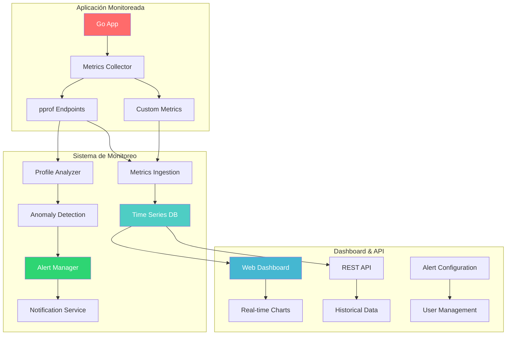

# 🚀 Proyecto Final: Sistema de Monitoreo de Performance
## *Dashboard de Observabilidad para Aplicaciones Go*

> *"Lo que no se puede medir, no se puede mejorar"* - Peter Drucker

## 🎯 Objetivo del Proyecto

Crear un sistema completo de monitoreo y observabilidad que permita:
- **📊 Métricas en tiempo real** de aplicaciones Go
- **🔍 Profiling automático** con alertas inteligentes  
- **🐛 Detección proactiva** de problemas de performance
- **📈 Dashboard visual** para análisis histórico
- **🚨 Sistema de alertas** configurable

## 🏗️ Arquitectura del Sistema



## 📋 Especificaciones Técnicas

### 🎯 **Fase 1: Collector de Métricas (40 puntos)**

#### Implementa `MetricsCollector`
```go
package monitoring

import (
    "context"
    "runtime"
    "sync"
    "time"
)

type MetricsCollector struct {
    // TODO: Implementa la estructura
}

type MetricPoint struct {
    Timestamp time.Time             `json:"timestamp"`
    Name      string                `json:"name"`
    Value     float64               `json:"value"`
    Labels    map[string]string     `json:"labels"`
    Type      MetricType            `json:"type"`
}

type MetricType string

const (
    MetricTypeGauge     MetricType = "gauge"
    MetricTypeCounter   MetricType = "counter"
    MetricTypeHistogram MetricType = "histogram"
)

// Métricas requeridas a implementar:
func (mc *MetricsCollector) CollectCPUUsage() MetricPoint
func (mc *MetricsCollector) CollectMemoryUsage() []MetricPoint
func (mc *MetricsCollector) CollectGoroutineCount() MetricPoint
func (mc *MetricsCollector) CollectGCStats() []MetricPoint
func (mc *MetricsCollector) CollectCustomMetric(name string, value float64, labels map[string]string)
```

#### Métricas Obligatorias
- **CPU Usage**: Porcentaje de uso por core
- **Memory**: Heap, Stack, GC stats
- **Goroutines**: Número activo y leaks
- **GC**: Pausas, frecuencia, presión
- **HTTP**: Request rate, latency, errors
- **Custom**: Métricas específicas de la app

### 🎯 **Fase 2: Profile Analyzer (30 puntos)**

#### Implementa análisis automático de profiles
```go
package profiling

type ProfileAnalyzer struct {
    // TODO: Implementa la estructura
}

type ProfileResult struct {
    Type        ProfileType       `json:"type"`
    Timestamp   time.Time        `json:"timestamp"`
    TopFunctions []FunctionStat   `json:"top_functions"`
    Hotspots    []Hotspot        `json:"hotspots"`
    Anomalies   []Anomaly        `json:"anomalies"`
}

type ProfileType string

const (
    ProfileTypeCPU    ProfileType = "cpu"
    ProfileTypeMemory ProfileType = "memory"
    ProfileTypeBlock  ProfileType = "block"
    ProfileTypeMutex  ProfileType = "mutex"
)

// Funcionalidades requeridas:
func (pa *ProfileAnalyzer) AnalyzeCPUProfile(data []byte) ProfileResult
func (pa *ProfileAnalyzer) AnalyzeMemoryProfile(data []byte) ProfileResult
func (pa *ProfileAnalyzer) DetectAnomalies(current, baseline ProfileResult) []Anomaly
func (pa *ProfileAnalyzer) GenerateRecommendations(result ProfileResult) []Recommendation
```

### 🎯 **Fase 3: Sistema de Alertas (20 puntos)**

#### Implementa detección inteligente de problemas
```go
package alerting

type AlertManager struct {
    // TODO: Implementa la estructura
}

type Alert struct {
    ID          string        `json:"id"`
    Timestamp   time.Time     `json:"timestamp"`
    Level       AlertLevel    `json:"level"`
    Title       string        `json:"title"`
    Description string        `json:"description"`
    Metrics     []MetricPoint `json:"metrics"`
    Actions     []string      `json:"suggested_actions"`
}

type AlertLevel string

const (
    AlertLevelInfo     AlertLevel = "info"
    AlertLevelWarning  AlertLevel = "warning"
    AlertLevelCritical AlertLevel = "critical"
)

// Tipos de alertas a implementar:
func (am *AlertManager) CheckMemoryLeak(metrics []MetricPoint) *Alert
func (am *AlertManager) CheckCPUSpike(metrics []MetricPoint) *Alert
func (am *AlertManager) CheckGoroutineLeak(metrics []MetricPoint) *Alert
func (am *AlertManager) CheckGCPressure(metrics []MetricPoint) *Alert
```

### 🎯 **Fase 4: Web Dashboard (10 puntos)**

#### Crea interface visual interactiva
```html
<!DOCTYPE html>
<html>
<head>
    <title>Go Performance Monitor</title>
    <script src="https://cdn.jsdelivr.net/npm/chart.js"></script>
    <script src="https://cdn.jsdelivr.net/npm/date-fns@2.29.3/index.min.js"></script>
</head>
<body>
    <!-- TODO: Implementa dashboard completo -->
    <div id="dashboard">
        <header>
            <h1>🚀 Go Performance Monitor</h1>
            <div id="status-indicators"></div>
        </header>
        
        <main>
            <section id="real-time-metrics">
                <h2>📊 Real-time Metrics</h2>
                <!-- Charts en tiempo real -->
            </section>
            
            <section id="alerts">
                <h2>🚨 Active Alerts</h2>
                <!-- Lista de alertas activas -->
            </section>
            
            <section id="profiling">
                <h2>🔍 Profile Analysis</h2>
                <!-- Resultados de profiling -->
            </section>
        </main>
    </div>
</body>
</html>
```

## 🧪 Casos de Uso de Testing

### 📊 **Aplicación de Testing**: E-commerce Backend

```go
package main

import (
    "encoding/json"
    "fmt"
    "math/rand"
    "net/http"
    "sync"
    "time"
)

// Aplicación con problemas de performance intencionados
type EcommerceAPI struct {
    products    map[string]Product
    orders      []Order
    users       map[string]User
    cache       map[string]interface{} // Memory leak intencional
    mu          sync.RWMutex
    
    // Simulated problems
    slowQueries     bool
    memoryLeaks     bool
    goroutineLeaks  bool
    cpuSpikes       bool
}

type Product struct {
    ID          string    `json:"id"`
    Name        string    `json:"name"`
    Price       float64   `json:"price"`
    Stock       int       `json:"stock"`
    Category    string    `json:"category"`
    Created     time.Time `json:"created"`
}

type Order struct {
    ID          string    `json:"id"`
    UserID      string    `json:"user_id"`
    Products    []string  `json:"products"`
    Total       float64   `json:"total"`
    Status      string    `json:"status"`
    Created     time.Time `json:"created"`
}

type User struct {
    ID       string `json:"id"`
    Email    string `json:"email"`
    Name     string `json:"name"`
    Created  time.Time `json:"created"`
}

func NewEcommerceAPI() *EcommerceAPI {
    api := &EcommerceAPI{
        products: make(map[string]Product),
        orders:   make([]Order, 0),
        users:    make(map[string]User),
        cache:    make(map[string]interface{}),
    }
    
    // Poblar con datos de prueba
    api.seedData()
    
    return api
}

func (api *EcommerceAPI) seedData() {
    // Crear productos
    for i := 0; i < 10000; i++ {
        product := Product{
            ID:       fmt.Sprintf("prod_%d", i),
            Name:     fmt.Sprintf("Product %d", i),
            Price:    rand.Float64() * 1000,
            Stock:    rand.Intn(100),
            Category: []string{"electronics", "clothing", "books", "home"}[rand.Intn(4)],
            Created:  time.Now().Add(-time.Duration(rand.Intn(365)) * 24 * time.Hour),
        }
        api.products[product.ID] = product
    }
    
    // Crear usuarios
    for i := 0; i < 1000; i++ {
        user := User{
            ID:      fmt.Sprintf("user_%d", i),
            Email:   fmt.Sprintf("user%d@example.com", i),
            Name:    fmt.Sprintf("User %d", i),
            Created: time.Now().Add(-time.Duration(rand.Intn(365)) * 24 * time.Hour),
        }
        api.users[user.ID] = user
    }
}

// Endpoint con problemas de performance
func (api *EcommerceAPI) SearchProducts(w http.ResponseWriter, r *http.Request) {
    query := r.URL.Query().Get("q")
    category := r.URL.Query().Get("category")
    
    // PROBLEMA 1: Búsqueda lineal ineficiente
    var results []Product
    api.mu.RLock()
    for _, product := range api.products {
        if api.slowQueries {
            // Simular query lenta
            time.Sleep(1 * time.Millisecond)
        }
        
        if (query == "" || contains(product.Name, query)) &&
           (category == "" || product.Category == category) {
            results = append(results, product)
        }
    }
    api.mu.RUnlock()
    
    // PROBLEMA 2: Cache que crece infinitamente
    if api.memoryLeaks {
        cacheKey := fmt.Sprintf("%s_%s_%d", query, category, time.Now().Unix())
        api.cache[cacheKey] = results // Never cleaned up!
    }
    
    w.Header().Set("Content-Type", "application/json")
    json.NewEncoder(w).Encode(results)
}

func (api *EcommerceAPI) CreateOrder(w http.ResponseWriter, r *http.Request) {
    var order Order
    if err := json.NewDecoder(r.Body).Decode(&order); err != nil {
        http.Error(w, err.Error(), http.StatusBadRequest)
        return
    }
    
    order.ID = fmt.Sprintf("order_%d", time.Now().Unix())
    order.Created = time.Now()
    order.Status = "pending"
    
    // PROBLEMA 3: Procesamiento que puede crear goroutine leak
    if api.goroutineLeaks {
        go func() {
            // Simular procesamiento sin timeout ni cleanup
            for {
                time.Sleep(1 * time.Second)
                // Infinite loop - goroutine leak!
                if rand.Float32() < 0.001 { // 0.1% chance to exit
                    break
                }
            }
        }()
    }
    
    api.mu.Lock()
    api.orders = append(api.orders, order)
    api.mu.Unlock()
    
    // PROBLEMA 4: CPU spike durante procesamiento
    if api.cpuSpikes {
        api.intensiveProcessing()
    }
    
    w.Header().Set("Content-Type", "application/json")
    json.NewEncoder(w).Encode(order)
}

func (api *EcommerceAPI) intensiveProcessing() {
    // Simular procesamiento intensivo de CPU
    for i := 0; i < 1000000; i++ {
        for j := 0; j < 100; j++ {
            _ = i * j * i / (j + 1)
        }
    }
}

func (api *EcommerceAPI) SetupProblems(slow, leaks, goroutineLeaks, cpuSpikes bool) {
    api.slowQueries = slow
    api.memoryLeaks = leaks
    api.goroutineLeaks = goroutineLeaks
    api.cpuSpikes = cpuSpikes
}

func contains(s, substr string) bool {
    return len(s) >= len(substr) && 
           s[len(s)-len(substr):] == substr || 
           s[:len(substr)] == substr
}

func main() {
    api := NewEcommerceAPI()
    
    // Habilitar todos los problemas para testing
    api.SetupProblems(true, true, true, true)
    
    http.HandleFunc("/products/search", api.SearchProducts)
    http.HandleFunc("/orders", api.CreateOrder)
    
    fmt.Println("🚀 E-commerce API running on :8080")
    fmt.Println("📊 Monitor this app with your performance monitor!")
    
    http.ListenAndServe(":8080", nil)
}
```

## 🎯 Requisitos de Implementación

### ✅ **Funcionalidades Obligatorias**

1. **📊 Recolección de Métricas**
   - [ ] CPU usage por core
   - [ ] Memory usage (heap, stack, GC)
   - [ ] Goroutine count y leak detection
   - [ ] HTTP metrics (latency, throughput, errors)
   - [ ] Custom business metrics

2. **🔍 Profile Analysis**
   - [ ] CPU profile analysis automático
   - [ ] Memory profile analysis
   - [ ] Goroutine profile analysis
   - [ ] Detección de anomalías
   - [ ] Generación de recomendaciones

3. **🚨 Sistema de Alertas**
   - [ ] Memory leak detection
   - [ ] CPU spike alerts
   - [ ] Goroutine leak detection
   - [ ] GC pressure monitoring
   - [ ] Custom threshold alerts

4. **📈 Dashboard Web**
   - [ ] Real-time charts
   - [ ] Historical data visualization
   - [ ] Alert management UI
   - [ ] Profile results display
   - [ ] Configuration interface

5. **🔧 Integración**
   - [ ] HTTP endpoints para métricas
   - [ ] Middleware para instrumentación automática
   - [ ] Export a Prometheus/Grafana
   - [ ] Logging estructurado
   - [ ] Configuration via JSON/YAML

### ⚡ **Funcionalidades Bonus** (+20 puntos)

1. **📊 Advanced Analytics**
   - [ ] Predictive analysis de trends
   - [ ] Correlación entre métricas
   - [ ] Anomaly detection con ML
   - [ ] Performance regression detection

2. **🔄 Distributed Tracing**
   - [ ] OpenTelemetry integration
   - [ ] Request tracing across services
   - [ ] Span analysis y bottleneck detection

3. **🎯 Auto-optimization**
   - [ ] Automatic GC tuning recommendations
   - [ ] Code hotspot identification
   - [ ] Performance improvement suggestions

## 📊 Criterios de Evaluación

### 📈 **Performance (30%)**
- **Overhead mínimo**: < 5% impacto en la app monitoreada
- **Latencia baja**: Métricas actualizadas cada 1-5 segundos
- **Escalabilidad**: Manejo de 10k+ métricas por minuto
- **Memory efficient**: Sistema de monitoreo < 100MB RAM

### 🎯 **Funcionalidad (40%)**
- **Completitud**: Todas las funcionalidades obligatorias
- **Precisión**: Métricas exactas y confiables
- **Detección**: Identificación correcta de problemas
- **Usabilidad**: Interface intuitiva y responsive

### 🧪 **Testing (20%)**
- **Unit tests**: Cobertura > 80%
- **Integration tests**: Testing con app real
- **Load testing**: Performance bajo carga
- **Error handling**: Manejo robusto de errores

### 📚 **Documentación (10%)**
- **Setup guide**: Instrucciones claras de instalación
- **API documentation**: Endpoints documentados
- **Architecture docs**: Diagrama y explicación del diseño
- **Troubleshooting**: Guía de resolución de problemas

## 🚀 Entregables

### 📦 **Estructura del Proyecto**
```
performance-monitor/
├── cmd/
│   ├── monitor/          # Aplicación principal
│   └── example-app/      # App de ejemplo para testing
├── internal/
│   ├── collector/        # Metrics collection
│   ├── profiling/        # Profile analysis
│   ├── alerting/         # Alert system
│   └── dashboard/        # Web UI
├── pkg/
│   └── client/          # Client library para instrumentación
├── web/
│   ├── static/          # CSS, JS, assets
│   └── templates/       # HTML templates
├── configs/
│   └── config.yaml      # Configuración por defecto
├── docs/
│   ├── architecture.md
│   ├── api.md
│   └── setup.md
├── tests/
│   ├── unit/
│   ├── integration/
│   └── load/
├── docker-compose.yml
├── Dockerfile
├── Makefile
└── README.md
```

### 📝 **Documentos Requeridos**
1. **README.md**: Setup, uso básico, ejemplos
2. **ARCHITECTURE.md**: Diseño del sistema, decisiones técnicas
3. **API.md**: Documentación de endpoints REST
4. **PERFORMANCE.md**: Benchmarks y optimizaciones
5. **DEPLOYMENT.md**: Guía de despliegue en producción

## 🏆 Demo Final

### 🎥 **Presentación (15 minutos)**
1. **Arquitectura**: Explicación del diseño (3 min)
2. **Demo live**: Monitoring de app real (5 min)
3. **Alertas**: Triggered alerts y resolution (3 min)
4. **Dashboard**: Tour de la interface (2 min)
5. **Q&A**: Preguntas técnicas (2 min)

### 🎯 **Scenarios de Demo**
1. **Memory leak detection**: Mostrar detección en tiempo real
2. **CPU spike analysis**: Profile automático y recomendaciones
3. **Goroutine leak**: Alertas y investigación
4. **Performance regression**: Comparación histórica

## 📅 Timeline Sugerido

### **Semana 1**: Arquitectura y Collector
- [ ] Diseño de arquitectura
- [ ] Implementación de MetricsCollector
- [ ] Testing con aplicación simple

### **Semana 2**: Profiling y Alertas
- [ ] ProfileAnalyzer implementation
- [ ] Sistema de alertas básico
- [ ] Integration testing

### **Semana 3**: Dashboard y Pulimiento
- [ ] Web dashboard implementation
- [ ] Performance optimization
- [ ] Documentation

### **Semana 4**: Testing y Demo
- [ ] Load testing
- [ ] Bug fixes
- [ ] Demo preparation

---

**¡Buena suerte construyendo el mejor sistema de monitoreo de Go! 🚀**
