# 🔍 Lección 03: Profiling & Debugging
## *El Arte de Diagnosticar y Optimizar Código Go*

> *"Debuggear es como ser detective en una novela de crimen donde tú también eres el asesino"* - Filipe Fortes

### 🎯 ¿Qué Aprenderás Hoy?

Al final de esta lección, serás capaz de:
- 🔍 **Dominar pprof** para profiling avanzado de aplicaciones
- 🐛 **Debuggear problemas complejos** usando Delve y herramientas avanzadas
- 📊 **Analizar traces distribuidos** para sistemas complejos
- ⚡ **Identificar bottlenecks** en tiempo real
- 🎯 **Implementar observabilidad** de nivel enterprise
- 🧠 **Usar técnicas forenses** para diagnosticar crashes y deadlocks

### 🧠 Analogías para Entender Profiling & Debugging

#### 🕵️ **Tu Aplicación es como una Escena del Crimen**

```mermaid
graph TB
    A[🕵️ Detective = Developer] --> B[🔍 Evidencias = Logs/Metrics]
    A --> C[🧬 DNA = Stack Traces]
    A --> D[📸 Fotos = Profiles]
    
    B --> E[📝 Testigos = Error Messages]
    C --> F[🧭 Pistas = Call Graphs]
    D --> G[⏱️ Timeline = Execution Traces]
    
    E --> H[💡 Teoría = Root Cause]
    F --> H
    G --> H
    
    style A fill:#ff6b6b,color:#fff
    style H fill:#2ed573,color:#fff
```



- **🔍 Evidencias (Logs/Metrics)**: Lo que vemos en la superficie
- **🧬 DNA (Stack Traces)**: La información genética del problema
- **📸 Fotos (Profiles)**: Instantáneas del estado del sistema
- **💡 Teoría (Root Cause)**: La verdad oculta que buscamos

#### 🏥 **Debugging como Medicina Diagnóstica**

> *Imagina que tu aplicación es un paciente y tú eres el médico especialista.*

```mermaid
flowchart TD
    A[🤒 Síntomas<br/>Performance Issues] --> B[🩺 Examen Físico<br/>Basic Monitoring]
    B --> C[🧪 Análisis de Sangre<br/>CPU/Memory Profiles]
    C --> D[📋 Diagnóstico<br/>Root Cause Analysis]
    D --> E[💊 Tratamiento<br/>Optimization]
    E --> F[🏃 Recuperación<br/>Performance Restored]
    
    style A fill:#feca57,color:#000
    style C fill:#ff9ff3,color:#000
    style D fill:#48dbfb,color:#000
    style F fill:#2ed573,color:#fff
```



## 📚 Teoría Fundamental

### 🎯 **Los 4 Pilares del Profiling en Go**

#### 1. 🔥 **CPU Profiling**
*"¿Dónde gasta tiempo mi aplicación?"*

```go
package main

import (
    "log"
    "os"
    "runtime/pprof"
    "time"
)

// 🔍 CPU Profiler wrapper
type CPUProfiler struct {
    file     *os.File
    active   bool
    duration time.Duration
}

func NewCPUProfiler(filename string, duration time.Duration) *CPUProfiler {
    return &CPUProfiler{
        duration: duration,
    }
}

func (cp *CPUProfiler) Start() error {
    if cp.active {
        return fmt.Errorf("profiler already active")
    }
    
    file, err := os.Create(fmt.Sprintf("cpu_%s_%d.prof", 
        cp.filename, time.Now().Unix()))
    if err != nil {
        return err
    }
    
    cp.file = file
    cp.active = true
    
    if err := pprof.StartCPUProfile(cp.file); err != nil {
        cp.file.Close()
        return err
    }
    
    log.Printf("🔍 CPU profiling started, will run for %v", cp.duration)
    
    // Auto-stop after duration
    go func() {
        time.Sleep(cp.duration)
        cp.Stop()
    }()
    
    return nil
}

func (cp *CPUProfiler) Stop() error {
    if !cp.active {
        return fmt.Errorf("profiler not active")
    }
    
    pprof.StopCPUProfile()
    cp.active = false
    
    if err := cp.file.Close(); err != nil {
        return err
    }
    
    log.Printf("🎯 CPU profiling stopped, saved to: %s", cp.file.Name())
    return nil
}

// 🚀 Automatic profiling for functions
func ProfileFunction(name string, fn func()) {
    profiler := NewCPUProfiler(name, 30*time.Second)
    
    if err := profiler.Start(); err != nil {
        log.Printf("Failed to start profiler: %v", err)
        fn() // Run without profiling
        return
    }
    
    defer profiler.Stop()
    fn()
}

// 📊 Usage example
func main() {
    ProfileFunction("heavy_computation", func() {
        heavyComputation(1000000)
    })
}

func heavyComputation(n int) int {
    result := 0
    for i := 0; i < n; i++ {
        for j := 0; j < 1000; j++ {
            result += i * j
        }
    }
    return result
}
```

#### 2. 🧠 **Memory Profiling**
*"¿Cómo usa mi aplicación la memoria?"*

```go
package main

import (
    "fmt"
    "os"
    "runtime"
    "runtime/pprof"
    "time"
)

// 🧠 Memory Profiler with automatic snapshots
type MemoryProfiler struct {
    interval  time.Duration
    outputDir string
    active    bool
    stopChan  chan struct{}
}

func NewMemoryProfiler(interval time.Duration, outputDir string) *MemoryProfiler {
    return &MemoryProfiler{
        interval:  interval,
        outputDir: outputDir,
        stopChan:  make(chan struct{}),
    }
}

func (mp *MemoryProfiler) Start() error {
    if mp.active {
        return fmt.Errorf("memory profiler already active")
    }
    
    // Create output directory
    if err := os.MkdirAll(mp.outputDir, 0755); err != nil {
        return err
    }
    
    mp.active = true
    
    go mp.profileLoop()
    
    log.Printf("🧠 Memory profiling started, snapshot every %v", mp.interval)
    return nil
}

func (mp *MemoryProfiler) Stop() {
    if !mp.active {
        return
    }
    
    close(mp.stopChan)
    mp.active = false
    log.Printf("🛑 Memory profiling stopped")
}

func (mp *MemoryProfiler) profileLoop() {
    ticker := time.NewTicker(mp.interval)
    defer ticker.Stop()
    
    for {
        select {
        case <-ticker.C:
            mp.takeSnapshot()
        case <-mp.stopChan:
            return
        }
    }
}

func (mp *MemoryProfiler) takeSnapshot() {
    // Force GC to get accurate heap snapshot
    runtime.GC()
    
    filename := fmt.Sprintf("%s/heap_%d.prof", 
        mp.outputDir, time.Now().Unix())
    
    file, err := os.Create(filename)
    if err != nil {
        log.Printf("Error creating heap profile: %v", err)
        return
    }
    defer file.Close()
    
    if err := pprof.WriteHeapProfile(file); err != nil {
        log.Printf("Error writing heap profile: %v", err)
        return
    }
    
    // Log memory stats
    var m runtime.MemStats
    runtime.ReadMemStats(&m)
    
    log.Printf("📊 Memory snapshot: Alloc=%s, Sys=%s, NumGC=%d", 
        formatBytes(m.Alloc), 
        formatBytes(m.Sys), 
        m.NumGC)
}

func formatBytes(b uint64) string {
    const unit = 1024
    if b < unit {
        return fmt.Sprintf("%d B", b)
    }
    div, exp := uint64(unit), 0
    for n := b / unit; n >= unit; n /= unit {
        div *= unit
        exp++
    }
    return fmt.Sprintf("%.1f %cB", float64(b)/float64(div), "KMGTPE"[exp])
}

// 🎯 Memory allocation tracker
type AllocationTracker struct {
    baseline runtime.MemStats
    samples  []AllocationSample
    mutex    sync.RWMutex
}

type AllocationSample struct {
    Timestamp time.Time
    Alloc     uint64
    TotalAlloc uint64
    NumGC     uint32
    Operation string
}

func NewAllocationTracker() *AllocationTracker {
    tracker := &AllocationTracker{}
    runtime.ReadMemStats(&tracker.baseline)
    return tracker
}

func (at *AllocationTracker) Track(operation string, fn func()) {
    // Pre-execution snapshot
    var before runtime.MemStats
    runtime.ReadMemStats(&before)
    
    start := time.Now()
    fn()
    duration := time.Since(start)
    
    // Post-execution snapshot
    var after runtime.MemStats
    runtime.ReadMemStats(&after)
    
    sample := AllocationSample{
        Timestamp:  start,
        Alloc:      after.Alloc - before.Alloc,
        TotalAlloc: after.TotalAlloc - before.TotalAlloc,
        NumGC:      after.NumGC - before.NumGC,
        Operation:  operation,
    }
    
    at.mutex.Lock()
    at.samples = append(at.samples, sample)
    at.mutex.Unlock()
    
    log.Printf("🎯 %s: allocated %s in %v (GCs: %d)", 
        operation,
        formatBytes(sample.TotalAlloc),
        duration,
        sample.NumGC)
}

func (at *AllocationTracker) GetReport() []AllocationSample {
    at.mutex.RLock()
    defer at.mutex.RUnlock()
    
    result := make([]AllocationSample, len(at.samples))
    copy(result, at.samples)
    return result
}
```

#### 3. 🔄 **Goroutine Profiling**
*"¿Qué están haciendo mis goroutines?"*

```go
package main

import (
    "fmt"
    "runtime"
    "runtime/pprof"
    "strings"
    "time"
)

// 🔄 Goroutine analyzer
type GoroutineAnalyzer struct {
    interval time.Duration
    alerts   chan GoroutineAlert
}

type GoroutineAlert struct {
    Timestamp    time.Time
    Count        int
    LeakSuspect  bool
    TopStacks    []StackInfo
}

type StackInfo struct {
    Stack string
    Count int
}

func NewGoroutineAnalyzer(interval time.Duration) *GoroutineAnalyzer {
    return &GoroutineAnalyzer{
        interval: interval,
        alerts:   make(chan GoroutineAlert, 100),
    }
}

func (ga *GoroutineAnalyzer) Start() {
    go ga.monitorLoop()
}

func (ga *GoroutineAnalyzer) monitorLoop() {
    ticker := time.NewTicker(ga.interval)
    defer ticker.Stop()
    
    baseline := runtime.NumGoroutine()
    
    for range ticker.C {
        current := runtime.NumGoroutine()
        
        // Check for potential goroutine leak
        if current > baseline*2 && current > 100 {
            alert := ga.analyzeGoroutines()
            alert.LeakSuspected = true
            
            select {
            case ga.alerts <- alert:
            default:
                // Alert channel full, skip
            }
        }
        
        if current > baseline {
            baseline = current
        }
    }
}

func (ga *GoroutineAnalyzer) analyzeGoroutines() GoroutineAlert {
    // Get goroutine profile
    profile := pprof.Lookup("goroutine")
    
    var buf strings.Builder
    profile.WriteTo(&buf, 2) // Debug level 2
    
    stacks := ga.parseStacks(buf.String())
    
    return GoroutineAlert{
        Timestamp: time.Now(),
        Count:     runtime.NumGoroutine(),
        TopStacks: stacks,
    }
}

func (ga *GoroutineAnalyzer) parseStacks(profile string) []StackInfo {
    // Simplified stack parsing
    lines := strings.Split(profile, "\n")
    stackCounts := make(map[string]int)
    
    var currentStack strings.Builder
    for _, line := range lines {
        if strings.HasPrefix(line, "goroutine") {
            if currentStack.Len() > 0 {
                stack := currentStack.String()
                stackCounts[stack]++
                currentStack.Reset()
            }
        } else if strings.TrimSpace(line) != "" {
            currentStack.WriteString(line + "\n")
        }
    }
    
    // Convert to sorted slice
    var stacks []StackInfo
    for stack, count := range stackCounts {
        stacks = append(stacks, StackInfo{
            Stack: stack,
            Count: count,
        })
    }
    
    // Sort by count (simplified)
    for i := 0; i < len(stacks)-1; i++ {
        for j := i + 1; j < len(stacks); j++ {
            if stacks[i].Count < stacks[j].Count {
                stacks[i], stacks[j] = stacks[j], stacks[i]
            }
        }
    }
    
    // Return top 5
    if len(stacks) > 5 {
        stacks = stacks[:5]
    }
    
    return stacks
}

func (ga *GoroutineAnalyzer) GetAlerts() <-chan GoroutineAlert {
    return ga.alerts
}

// 🚀 Goroutine leak detector
func DetectGoroutineLeaks() {
    analyzer := NewGoroutineAnalyzer(5 * time.Second)
    analyzer.Start()
    
    go func() {
        for alert := range analyzer.GetAlerts() {
            fmt.Printf("🚨 GOROUTINE LEAK ALERT!\n")
            fmt.Printf("  Count: %d goroutines\n", alert.Count)
            fmt.Printf("  Time: %s\n", alert.Timestamp.Format(time.RFC3339))
            
            fmt.Printf("  Top stacks:\n")
            for i, stack := range alert.TopStacks {
                fmt.Printf("    %d. Count: %d\n", i+1, stack.Count)
                // Show first few lines of stack
                lines := strings.Split(stack.Stack, "\n")
                for j, line := range lines {
                    if j >= 3 { // Show only first 3 lines
                        break
                    }
                    fmt.Printf("       %s\n", line)
                }
                fmt.Printf("\n")
            }
        }
    }()
}
```

#### 4. 🕸️ **Trace Analysis**
*"¿Cómo fluye la ejecución de mi aplicación?"*

```go
package main

import (
    "context"
    "os"
    "runtime/trace"
    "time"
)

// 🕸️ Execution tracer
type ExecutionTracer struct {
    outputFile string
    active     bool
    file       *os.File
}

func NewExecutionTracer(outputFile string) *ExecutionTracer {
    return &ExecutionTracer{
        outputFile: outputFile,
    }
}

func (et *ExecutionTracer) Start() error {
    if et.active {
        return fmt.Errorf("tracer already active")
    }
    
    file, err := os.Create(et.outputFile)
    if err != nil {
        return err
    }
    
    et.file = file
    et.active = true
    
    if err := trace.Start(et.file); err != nil {
        et.file.Close()
        return err
    }
    
    log.Printf("🕸️ Execution tracing started: %s", et.outputFile)
    return nil
}

func (et *ExecutionTracer) Stop() error {
    if !et.active {
        return fmt.Errorf("tracer not active")
    }
    
    trace.Stop()
    et.active = false
    
    if err := et.file.Close(); err != nil {
        return err
    }
    
    log.Printf("🎯 Execution tracing stopped: %s", et.outputFile)
    log.Printf("💡 Analyze with: go tool trace %s", et.outputFile)
    return nil
}

// 🎯 Trace regions for custom analysis
func TraceRegion(ctx context.Context, regionName string, fn func()) {
    region := trace.StartRegion(ctx, regionName)
    defer region.End()
    
    fn()
}

// 🚀 Advanced tracing with custom events
func TraceWithEvents(ctx context.Context, name string, fn func()) {
    // Start region
    region := trace.StartRegion(ctx, name)
    defer region.End()
    
    // Log custom event at start
    trace.Log(ctx, "operation", "started")
    
    start := time.Now()
    fn()
    duration := time.Since(start)
    
    // Log custom event at end with timing
    trace.Logf(ctx, "operation", "completed in %v", duration)
}

// 🔍 Example usage with complex workflow
func ComplexWorkflow(ctx context.Context) {
    tracer := NewExecutionTracer("workflow_trace.out")
    
    if err := tracer.Start(); err != nil {
        log.Printf("Failed to start tracer: %v", err)
        return
    }
    defer tracer.Stop()
    
    // Database operations
    TraceRegion(ctx, "database", func() {
        time.Sleep(50 * time.Millisecond) // Simulate DB call
    })
    
    // External API calls
    TraceRegion(ctx, "external_api", func() {
        time.Sleep(100 * time.Millisecond) // Simulate API call
    })
    
    // CPU intensive computation
    TraceRegion(ctx, "computation", func() {
        for i := 0; i < 1000000; i++ {
            _ = i * i
        }
    })
    
    // Concurrent processing
    TraceRegion(ctx, "concurrent_processing", func() {
        var wg sync.WaitGroup
        for i := 0; i < 4; i++ {
            wg.Add(1)
            go func(worker int) {
                defer wg.Done()
                workerCtx := context.WithValue(ctx, "worker", worker)
                TraceRegion(workerCtx, fmt.Sprintf("worker_%d", worker), func() {
                    time.Sleep(30 * time.Millisecond)
                })
            }(i)
        }
        wg.Wait()
    })
}
```

## 🐛 Advanced Debugging Techniques

### 🔧 **Delve Debugging Mastery**

```go
package main

import (
    "fmt"
    "sync"
    "time"
)

// 🐛 Example program for debugging scenarios
type BuggyService struct {
    mu       sync.RWMutex
    data     map[string]interface{}
    workers  int
    shutdown chan struct{}
}

func NewBuggyService(workers int) *BuggyService {
    return &BuggyService{
        data:     make(map[string]interface{}),
        workers:  workers,
        shutdown: make(chan struct{}),
    }
}

// 🐛 Potential deadlock scenario
func (bs *BuggyService) ProcessData(key string, value interface{}) {
    bs.mu.Lock()
    defer bs.mu.Unlock()
    
    // This could cause issues if value processing takes too long
    processed := bs.expensiveProcessing(value)
    bs.data[key] = processed
    
    // Potential deadlock: calling method that also needs lock
    go bs.notifyWorkers(key) // DANGER: goroutine with lock held
}

func (bs *BuggyService) expensiveProcessing(value interface{}) interface{} {
    // Simulate expensive operation
    time.Sleep(100 * time.Millisecond)
    return fmt.Sprintf("processed_%v", value)
}

func (bs *BuggyService) notifyWorkers(key string) {
    // This will deadlock!
    bs.mu.RLock()
    defer bs.mu.RUnlock()
    
    fmt.Printf("Notifying workers about key: %s\n", key)
}

// 🐛 Race condition scenario
func (bs *BuggyService) RacyUpdate(key string) {
    // Race condition: multiple goroutines modifying same data
    go func() {
        bs.data[key] = "value1" // No lock!
    }()
    
    go func() {
        bs.data[key] = "value2" // No lock!
    }()
}

// 🐛 Memory leak scenario
func (bs *BuggyService) LeakyWorker() {
    for i := 0; i < bs.workers; i++ {
        go func(workerID int) {
            // Missing select case for shutdown!
            for {
                select {
                case <-time.After(1 * time.Second):
                    // Do work
                    bs.processWork(workerID)
                // Missing: case <-bs.shutdown:
                //     return
                }
            }
        }(i)
    }
}

func (bs *BuggyService) processWork(workerID int) {
    // Simulate work that might panic
    if workerID%3 == 0 {
        panic(fmt.Sprintf("Worker %d panicked!", workerID))
    }
    
    fmt.Printf("Worker %d doing work\n", workerID)
}

// 🎯 Fixed version with proper debugging support
type DebugService struct {
    mu       sync.RWMutex
    data     map[string]interface{}
    workers  int
    shutdown chan struct{}
    debug    bool
}

func NewDebugService(workers int, debug bool) *DebugService {
    return &DebugService{
        data:     make(map[string]interface{}),
        workers:  workers,
        shutdown: make(chan struct{}),
        debug:    debug,
    }
}

func (ds *DebugService) ProcessData(key string, value interface{}) {
    if ds.debug {
        fmt.Printf("🔍 Processing data for key: %s\n", key)
    }
    
    ds.mu.Lock()
    processed := ds.expensiveProcessing(value)
    ds.data[key] = processed
    ds.mu.Unlock() // Release lock before goroutine
    
    // Safe: lock released before spawning goroutine
    go ds.notifyWorkers(key)
}

func (ds *DebugService) expensiveProcessing(value interface{}) interface{} {
    if ds.debug {
        start := time.Now()
        defer func() {
            fmt.Printf("🕒 Processing took: %v\n", time.Since(start))
        }()
    }
    
    time.Sleep(100 * time.Millisecond)
    return fmt.Sprintf("processed_%v", value)
}

func (ds *DebugService) notifyWorkers(key string) {
    ds.mu.RLock()
    defer ds.mu.RUnlock()
    
    if ds.debug {
        fmt.Printf("📢 Notifying workers about key: %s\n", key)
    }
}

func (ds *DebugService) SafeUpdate(key string, value interface{}) {
    ds.mu.Lock()
    defer ds.mu.Unlock()
    
    if ds.debug {
        fmt.Printf("🔒 Updating key %s with lock\n", key)
    }
    
    ds.data[key] = value
}

func (ds *DebugService) StartWorkers() {
    for i := 0; i < ds.workers; i++ {
        go func(workerID int) {
            defer func() {
                if r := recover(); r != nil {
                    fmt.Printf("🚨 Worker %d recovered from panic: %v\n", workerID, r)
                }
            }()
            
            for {
                select {
                case <-time.After(1 * time.Second):
                    ds.safeProcessWork(workerID)
                case <-ds.shutdown:
                    if ds.debug {
                        fmt.Printf("👋 Worker %d shutting down\n", workerID)
                    }
                    return
                }
            }
        }(i)
    }
}

func (ds *DebugService) safeProcessWork(workerID int) {
    if ds.debug {
        fmt.Printf("⚙️ Worker %d starting work\n", workerID)
    }
    
    // Controlled panic for testing
    if workerID%10 == 0 && ds.debug {
        panic(fmt.Sprintf("Test panic from worker %d", workerID))
    }
    
    time.Sleep(500 * time.Millisecond)
    
    if ds.debug {
        fmt.Printf("✅ Worker %d completed work\n", workerID)
    }
}

func (ds *DebugService) Shutdown() {
    close(ds.shutdown)
}
```

### 🔧 **Delve Commands Cheat Sheet**

```bash
# 🚀 Essential Delve commands for debugging

# Start debugging
dlv debug                    # Debug current package
dlv debug ./cmd/myapp       # Debug specific package
dlv attach $(pgrep myapp)   # Attach to running process

# Breakpoints
b main.main                 # Break at function
b main.go:42               # Break at line
b (*MyStruct).Method       # Break at method
bp                         # List breakpoints
clear 1                    # Clear breakpoint by ID
clearall                   # Clear all breakpoints

# Execution control
c                          # Continue
n                          # Next line (step over)
s                          # Step into
so                         # Step out
r                          # Restart

# Inspection
p variable                 # Print variable
pp variable                # Pretty print
locals                     # Show local variables
args                       # Show function arguments
vars                       # Show package variables
whatis variable            # Show variable type

# Stack inspection
bt                         # Backtrace (stack trace)
up                         # Move up stack frame
down                       # Move down stack frame
frame 2                    # Jump to specific frame

# Goroutines
goroutines                 # List all goroutines
goroutine 5                # Switch to goroutine 5
goroutine 5 bt            # Backtrace of specific goroutine

# Advanced
disassemble               # Show assembly
regs                      # Show CPU registers
sources                   # List source files
funcs regexp              # Find functions by regex
```

## 📊 Observability & Monitoring

### 🎯 **Real-time Performance Dashboard**

```go
package main

import (
    "context"
    "encoding/json"
    "fmt"
    "net/http"
    "runtime"
    "sync"
    "time"
)

// 📊 Real-time metrics collector
type MetricsCollector struct {
    mu              sync.RWMutex
    cpuUsage        []float64
    memoryUsage     []uint64
    goroutineCount  []int
    httpRequests    map[string]int
    errors          []ErrorEvent
    maxSamples      int
}

type ErrorEvent struct {
    Timestamp time.Time `json:"timestamp"`
    Error     string    `json:"error"`
    Stack     string    `json:"stack"`
}

type Snapshot struct {
    Timestamp      time.Time         `json:"timestamp"`
    CPU            float64           `json:"cpu_percent"`
    Memory         uint64            `json:"memory_bytes"`
    Goroutines     int               `json:"goroutines"`
    HTTPRequests   map[string]int    `json:"http_requests"`
    RecentErrors   []ErrorEvent      `json:"recent_errors"`
    GCStats        GCSnapshot        `json:"gc_stats"`
}

type GCSnapshot struct {
    NumGC          uint32        `json:"num_gc"`
    LastPause      time.Duration `json:"last_pause_ns"`
    TotalPauseTime time.Duration `json:"total_pause_time"`
}

func NewMetricsCollector(maxSamples int) *MetricsCollector {
    return &MetricsCollector{
        httpRequests: make(map[string]int),
        maxSamples:   maxSamples,
    }
}

func (mc *MetricsCollector) StartCollection(ctx context.Context, interval time.Duration) {
    ticker := time.NewTicker(interval)
    defer ticker.Stop()
    
    for {
        select {
        case <-ctx.Done():
            return
        case <-ticker.C:
            mc.collectMetrics()
        }
    }
}

func (mc *MetricsCollector) collectMetrics() {
    mc.mu.Lock()
    defer mc.mu.Unlock()
    
    // CPU usage (simplified)
    cpuPercent := mc.getCurrentCPUUsage()
    mc.cpuUsage = append(mc.cpuUsage, cpuPercent)
    if len(mc.cpuUsage) > mc.maxSamples {
        mc.cpuUsage = mc.cpuUsage[1:]
    }
    
    // Memory usage
    var m runtime.MemStats
    runtime.ReadMemStats(&m)
    mc.memoryUsage = append(mc.memoryUsage, m.Alloc)
    if len(mc.memoryUsage) > mc.maxSamples {
        mc.memoryUsage = mc.memoryUsage[1:]
    }
    
    // Goroutine count
    goroutines := runtime.NumGoroutine()
    mc.goroutineCount = append(mc.goroutineCount, goroutines)
    if len(mc.goroutineCount) > mc.maxSamples {
        mc.goroutineCount = mc.goroutineCount[1:]
    }
}

func (mc *MetricsCollector) getCurrentCPUUsage() float64 {
    // Simplified CPU usage calculation
    // In production, use proper CPU monitoring
    return float64(runtime.NumCPU()) * 25.0 // Mock value
}

func (mc *MetricsCollector) RecordHTTPRequest(endpoint string) {
    mc.mu.Lock()
    defer mc.mu.Unlock()
    
    mc.httpRequests[endpoint]++
}

func (mc *MetricsCollector) RecordError(err error, stack string) {
    mc.mu.Lock()
    defer mc.mu.Unlock()
    
    event := ErrorEvent{
        Timestamp: time.Now(),
        Error:     err.Error(),
        Stack:     stack,
    }
    
    mc.errors = append(mc.errors, event)
    
    // Keep only last 100 errors
    if len(mc.errors) > 100 {
        mc.errors = mc.errors[1:]
    }
}

func (mc *MetricsCollector) GetSnapshot() Snapshot {
    mc.mu.RLock()
    defer mc.mu.RUnlock()
    
    var currentCPU float64
    if len(mc.cpuUsage) > 0 {
        currentCPU = mc.cpuUsage[len(mc.cpuUsage)-1]
    }
    
    var currentMemory uint64
    if len(mc.memoryUsage) > 0 {
        currentMemory = mc.memoryUsage[len(mc.memoryUsage)-1]
    }
    
    var currentGoroutines int
    if len(mc.goroutineCount) > 0 {
        currentGoroutines = mc.goroutineCount[len(mc.goroutineCount)-1]
    }
    
    // Copy HTTP requests map
    httpReqs := make(map[string]int)
    for k, v := range mc.httpRequests {
        httpReqs[k] = v
    }
    
    // Get recent errors (last 10)
    var recentErrors []ErrorEvent
    if len(mc.errors) > 0 {
        start := len(mc.errors) - 10
        if start < 0 {
            start = 0
        }
        recentErrors = make([]ErrorEvent, len(mc.errors[start:]))
        copy(recentErrors, mc.errors[start:])
    }
    
    // GC stats
    var m runtime.MemStats
    runtime.ReadMemStats(&m)
    
    gcStats := GCSnapshot{
        NumGC:          m.NumGC,
        LastPause:      time.Duration(m.PauseNs[(m.NumGC+255)%256]),
        TotalPauseTime: time.Duration(m.PauseTotalNs),
    }
    
    return Snapshot{
        Timestamp:    time.Now(),
        CPU:          currentCPU,
        Memory:       currentMemory,
        Goroutines:   currentGoroutines,
        HTTPRequests: httpReqs,
        RecentErrors: recentErrors,
        GCStats:      gcStats,
    }
}

// 🌐 HTTP endpoints for metrics dashboard
func (mc *MetricsCollector) SetupDashboard(port int) {
    http.HandleFunc("/metrics", func(w http.ResponseWriter, r *http.Request) {
        w.Header().Set("Content-Type", "application/json")
        w.Header().Set("Access-Control-Allow-Origin", "*")
        
        snapshot := mc.GetSnapshot()
        
        if err := json.NewEncoder(w).Encode(snapshot); err != nil {
            http.Error(w, err.Error(), http.StatusInternalServerError)
            return
        }
    })
    
    http.HandleFunc("/", func(w http.ResponseWriter, r *http.Request) {
        w.Header().Set("Content-Type", "text/html")
        fmt.Fprint(w, dashboardHTML)
    })
    
    fmt.Printf("📊 Metrics dashboard available at: http://localhost:%d\n", port)
    go http.ListenAndServe(fmt.Sprintf(":%d", port), nil)
}

// 🎨 Simple HTML dashboard
const dashboardHTML = `
<!DOCTYPE html>
<html>
<head>
    <title>Go Application Metrics</title>
    <script src="https://cdn.jsdelivr.net/npm/chart.js"></script>
    <style>
        body { 
            font-family: Arial, sans-serif; 
            margin: 20px;
            background-color: #f5f5f5;
        }
        .container { 
            max-width: 1200px; 
            margin: 0 auto;
        }
        .metrics-grid { 
            display: grid; 
            grid-template-columns: 1fr 1fr; 
            gap: 20px; 
            margin: 20px 0;
        }
        .metric-card { 
            background: white; 
            padding: 20px; 
            border-radius: 8px; 
            box-shadow: 0 2px 4px rgba(0,0,0,0.1);
        }
        .metric-value { 
            font-size: 2em; 
            font-weight: bold; 
            color: #2196F3;
        }
        .errors { 
            background: #ffebee; 
            border-left: 4px solid #f44336;
        }
        h1 { 
            text-align: center; 
            color: #333; 
        }
        .chart-container { 
            position: relative; 
            height: 300px; 
            margin: 20px 0;
        }
    </style>
</head>
<body>
    <div class="container">
        <h1>🔍 Go Application Metrics Dashboard</h1>
        
        <div class="metrics-grid">
            <div class="metric-card">
                <h3>💾 Memory Usage</h3>
                <div class="metric-value" id="memory">--</div>
            </div>
            
            <div class="metric-card">
                <h3>🔄 Goroutines</h3>
                <div class="metric-value" id="goroutines">--</div>
            </div>
            
            <div class="metric-card">
                <h3>🗑️ GC Runs</h3>
                <div class="metric-value" id="gc-count">--</div>
            </div>
            
            <div class="metric-card">
                <h3>⏱️ Last GC Pause</h3>
                <div class="metric-value" id="gc-pause">--</div>
            </div>
        </div>
        
        <div class="metric-card">
            <h3>🌐 HTTP Requests</h3>
            <div id="http-requests">--</div>
        </div>
        
        <div class="metric-card errors">
            <h3>🚨 Recent Errors</h3>
            <div id="errors">No recent errors</div>
        </div>
    </div>
    
    <script>
        function formatBytes(bytes) {
            if (bytes === 0) return '0 B';
            const k = 1024;
            const sizes = ['B', 'KB', 'MB', 'GB'];
            const i = Math.floor(Math.log(bytes) / Math.log(k));
            return parseFloat((bytes / Math.pow(k, i)).toFixed(1)) + ' ' + sizes[i];
        }
        
        function updateMetrics() {
            fetch('/metrics')
                .then(response => response.json())
                .then(data => {
                    document.getElementById('memory').textContent = formatBytes(data.memory_bytes);
                    document.getElementById('goroutines').textContent = data.goroutines;
                    document.getElementById('gc-count').textContent = data.gc_stats.num_gc;
                    document.getElementById('gc-pause').textContent = 
                        (data.gc_stats.last_pause_ns / 1000000).toFixed(2) + 'ms';
                    
                    // HTTP requests
                    const httpDiv = document.getElementById('http-requests');
                    if (Object.keys(data.http_requests).length > 0) {
                        let html = '<ul>';
                        for (const [endpoint, count] of Object.entries(data.http_requests)) {
                            html += `<li><strong>${endpoint}:</strong> ${count} requests</li>`;
                        }
                        html += '</ul>';
                        httpDiv.innerHTML = html;
                    } else {
                        httpDiv.textContent = 'No requests recorded';
                    }
                    
                    // Errors
                    const errorsDiv = document.getElementById('errors');
                    if (data.recent_errors && data.recent_errors.length > 0) {
                        let html = '<ul>';
                        data.recent_errors.slice(-5).forEach(error => {
                            const time = new Date(error.timestamp).toLocaleTimeString();
                            html += `<li><strong>${time}:</strong> ${error.error}</li>`;
                        });
                        html += '</ul>';
                        errorsDiv.innerHTML = html;
                    } else {
                        errorsDiv.textContent = 'No recent errors';
                    }
                })
                .catch(error => {
                    console.error('Error fetching metrics:', error);
                });
        }
        
        // Update every 2 seconds
        setInterval(updateMetrics, 2000);
        updateMetrics(); // Initial load
    </script>
</body>
</html>
`
```

## 🎯 Ejercicios Prácticos

### 🧪 **Ejercicio 1: Debug a Deadlock**

```go
// TODO: Fix the deadlock in this code
package main

import (
    "sync"
    "time"
)

type DeadlockExample struct {
    mu1, mu2 sync.Mutex
    data1, data2 int
}

func (de *DeadlockExample) Method1() {
    de.mu1.Lock()
    time.Sleep(100 * time.Millisecond)
    de.mu2.Lock()
    
    de.data1++
    de.data2++
    
    de.mu2.Unlock()
    de.mu1.Unlock()
}

func (de *DeadlockExample) Method2() {
    de.mu2.Lock()
    time.Sleep(100 * time.Millisecond)
    de.mu1.Lock()
    
    de.data1--
    de.data2--
    
    de.mu1.Unlock()
    de.mu2.Unlock()
}

func main() {
    de := &DeadlockExample{}
    
    go de.Method1()
    go de.Method2()
    
    time.Sleep(1 * time.Second)
    println("Done") // This will never print!
}

// HINTS:
// 1. Use consistent lock ordering
// 2. Consider using a single mutex
// 3. Or redesign to avoid holding multiple locks
```

### 🧪 **Ejercicio 2: Profile and Optimize**

```go
// TODO: Profile this code and optimize the slow parts
package main

import (
    "fmt"
    "math/rand"
    "time"
)

func SlowFunction() {
    // Multiple performance issues to find and fix
    
    // Issue 1: Inefficient string concatenation
    result := ""
    for i := 0; i < 10000; i++ {
        result += fmt.Sprintf("item_%d ", i)
    }
    
    // Issue 2: Unnecessary allocations
    var data [][]int
    for i := 0; i < 1000; i++ {
        row := make([]int, 1000)
        for j := range row {
            row[j] = rand.Intn(100)
        }
        data = append(data, row)
    }
    
    // Issue 3: Inefficient algorithm
    for i := 0; i < len(data); i++ {
        for j := i + 1; j < len(data); j++ {
            if sum(data[i]) > sum(data[j]) {
                data[i], data[j] = data[j], data[i]
            }
        }
    }
    
    fmt.Printf("Processed %d items\n", len(data))
}

func sum(slice []int) int {
    total := 0
    for _, val := range slice {
        total += val
    }
    return total
}

// TODO: 
// 1. Create CPU profile
// 2. Identify bottlenecks
// 3. Optimize each issue
// 4. Measure improvement
```

### 🧪 **Ejercicio 3: Memory Leak Detection**

```go
// TODO: Find and fix the memory leaks in this service
package main

import (
    "context"
    "time"
)

type LeakyService struct {
    workers   []chan string
    results   map[string][]byte
    callbacks []func(string)
}

func NewLeakyService() *LeakyService {
    service := &LeakyService{
        results:   make(map[string][]byte),
        callbacks: make([]func(string), 0),
    }
    
    // Start 100 workers
    for i := 0; i < 100; i++ {
        ch := make(chan string, 1000)
        service.workers = append(service.workers, ch)
        
        go func(jobs <-chan string) {
            for job := range jobs {
                // Process job
                time.Sleep(10 * time.Millisecond)
                
                // Store result (LEAK: never cleaned up)
                service.results[job] = make([]byte, 1024*1024) // 1MB per job
            }
        }(ch)
    }
    
    return service
}

func (ls *LeakyService) ProcessJob(job string) {
    // Send to random worker
    worker := ls.workers[len(job)%len(ls.workers)]
    select {
    case worker <- job:
    default:
        // Worker busy, create more! (LEAK: unbounded growth)
        newWorker := make(chan string, 1000)
        ls.workers = append(ls.workers, newWorker)
        go func(jobs <-chan string) {
            for job := range jobs {
                time.Sleep(10 * time.Millisecond)
                ls.results[job] = make([]byte, 1024*1024)
            }
        }(newWorker)
        newWorker <- job
    }
}

func (ls *LeakyService) RegisterCallback(cb func(string)) {
    // LEAK: callbacks never removed
    ls.callbacks = append(ls.callbacks, cb)
}

// TODO:
// 1. Run memory profiler
// 2. Identify growing allocations
// 3. Fix the leaks
// 4. Add proper cleanup
```

## 📊 Métricas de Éxito

Al completar esta lección deberías poder:

- ✅ **Identificar** deadlocks y race conditions usando herramientas
- ✅ **Crear profiles** detallados de CPU, memoria y goroutines
- ✅ **Analizar traces** para entender flujo de ejecución
- ✅ **Debuggear** problemas complejos con Delve
- ✅ **Implementar** observabilidad en tiempo real
- ✅ **Detectar** memory leaks automáticamente

## 🚀 Próximos Pasos

1. **🔍 Practica**: Perfila aplicaciones reales
2. **🐛 Experimenta**: Usa Delve para debugging complejo
3. **📊 Implementa**: Dashboard de métricas en tu app
4. **🎯 Aprende**: Distributed tracing con OpenTelemetry

---

**[⬅️ Anterior: Memory Management](../02-memory-management/) | [🏠 Inicio](../../README.md) | [➡️ Siguiente: Advanced Concurrency](../04-advanced-concurrency/)**
