# 🎯 Ejercicios: Design Patterns
### *"Práctica Que Perfecciona"*

> *"Los patrones se aprenden implementándolos, no solo leyéndolos"* - Pattern Master

---

## 🎯 **Estructura de Ejercicios**

### 📅 **Cronograma de 10 Días**

```mermaid
gantt
    title Design Patterns - Ejercicios Prácticos
    dateFormat  X
    axisFormat  %d
    
    section Creational
    Factory Method        :1, 2
    Builder Pattern       :2, 3
    Singleton            :3, 4
    
    section Structural  
    Adapter Pattern      :4, 5
    Decorator Pattern    :5, 6
    Facade Pattern       :6, 7
    
    section Behavioral
    Strategy Pattern     :7, 8
    Observer Pattern     :8, 9
    Command Pattern      :9, 10
    
    section Go Specific
    Functional Options   :10, 11
```



---

## 🏭 **Día 1-2: Creational Patterns**

### 🎯 **Ejercicio 1: Factory Method - Sistema de Loggers**

**Dificultad:** 🟢 Principiante

**Objetivo:** Crear un sistema de logging con múltiples implementaciones

**Requisitos:**
```go
// Implementa estas interfaces y tipos
type Logger interface {
    Log(level LogLevel, message string) error
    SetLevel(level LogLevel)
    Close() error
}

type LogLevel int

const (
    DEBUG LogLevel = iota
    INFO
    WARN
    ERROR
    FATAL
)

type LoggerFactory interface {
    CreateLogger() Logger
}

// Implementa estos loggers:
// 1. ConsoleLogger - output a consola con colores
// 2. FileLogger - output a archivo con rotación
// 3. DatabaseLogger - output a base de datos
// 4. RemoteLogger - output a servicio remoto
```

**Tareas:**
- [ ] Implementar las 4 factories de loggers
- [ ] Crear un LoggerManager que use factories dinámicamente
- [ ] Agregar configuración por ambiente (dev, staging, prod)
- [ ] Implementar tests unitarios para cada factory
- [ ] Agregar benchmarks de performance

**Criterios de Evaluación:**
- ✅ **Extensibilidad:** Nuevos loggers sin modificar código existente
- ✅ **Configuración:** Cambio de logger por configuration
- ✅ **Error Handling:** Manejo robusto de errores
- ✅ **Performance:** Benchmarks y optimización
- ✅ **Testing:** Cobertura > 90%

---

### 🎯 **Ejercicio 2: Builder Pattern - HTTP Request Builder**

**Dificultad:** 🟡 Intermedio

**Objetivo:** Crear un builder fluido para construir requests HTTP complejos

**Requisitos:**
```go
// Implementa un builder que permita esto:
request := NewRequestBuilder().
    Method("POST").
    URL("https://api.example.com/users").
    Header("Content-Type", "application/json").
    Header("Authorization", "Bearer token123").
    Body(map[string]interface{}{
        "name": "John Doe",
        "email": "john@example.com",
    }).
    Timeout(30 * time.Second).
    Retry(3).
    Build()
```

**Tareas:**
- [ ] Implementar RequestBuilder con interfaz fluida
- [ ] Soporte para diferentes tipos de body (JSON, XML, Form, Raw)
- [ ] Validación de request antes de build
- [ ] Implementar middleware chain (auth, logging, metrics)
- [ ] Crear shortcuts para requests comunes (GET, POST, PUT, DELETE)

**Bonus:**
- [ ] Builder desde archivo de configuración
- [ ] Template system para requests comunes
- [ ] Mock builder para testing

---

### 🎯 **Ejercicio 3: Singleton Pattern - Configuration Manager**

**Dificultad:** 🟡 Intermedio

**Objetivo:** Implementar un gestor de configuración thread-safe

**Requisitos:**
```go
type ConfigManager interface {
    Get(key string) (interface{}, bool)
    Set(key string, value interface{})
    GetString(key string) string
    GetInt(key string) int
    GetBool(key string) bool
    LoadFromFile(filename string) error
    LoadFromEnv() error
    Watch(key string, callback func(interface{}))
}
```

**Tareas:**
- [ ] Implementar singleton thread-safe (sync.Once)
- [ ] Soporte para múltiples formatos (JSON, YAML, TOML)
- [ ] Hot reload de configuración
- [ ] Environment variable override
- [ ] Configuration validation y type safety

**Desafío:**
- [ ] ¿Cómo evitarías singleton para mejor testing?
- [ ] Implementa dependency injection alternativo

---

## 🏗️ **Día 4-6: Structural Patterns**

### 🎯 **Ejercicio 4: Adapter Pattern - Legacy API Integration**

**Dificultad:** 🟡 Intermedio

**Objetivo:** Integrar múltiples APIs legacy con diferentes formatos

**Escenario:**
Tienes que integrar 3 APIs diferentes:
- API REST clásica (JSON)
- SOAP Service legacy (XML)  
- CSV File export system

**Requisitos:**
```go
// Interfaz unificada que quieres
type UserService interface {
    GetUser(id string) (*User, error)
    ListUsers(filter UserFilter) ([]*User, error)
    CreateUser(user *User) error
    UpdateUser(user *User) error
    DeleteUser(id string) error
}

// Adapta estas APIs legacy:
type RestAPIClient struct {
    baseURL string
    client  *http.Client
}

type SOAPClient struct {
    endpoint string
    // métodos SOAP específicos
}

type CSVFileSystem struct {
    dataDir string
    // métodos de archivo
}
```

**Tareas:**
- [ ] Crear adapters para cada sistema legacy
- [ ] Implementar data mapping entre formatos
- [ ] Manejar diferentes tipos de error de cada sistema
- [ ] Crear factory para elegir adapter según configuración
- [ ] Implementar circuit breaker para calls externos

---

### 🎯 **Ejercicio 5: Decorator Pattern - HTTP Middleware Chain**

**Dificultad:** 🟠 Avanzado

**Objetivo:** Sistema de middleware extensible para HTTP handlers

**Requisitos:**
```go
// Crea un sistema que permita esto:
handler := NewHandler(businessLogicHandler).
    WithAuth(jwtAuth).
    WithLogging(requestLogger).
    WithRateLimit(100, time.Minute).
    WithCORS(corsConfig).
    WithMetrics(metricsCollector).
    WithTimeout(30 * time.Second)

http.Handle("/api/users", handler)
```

**Tareas:**
- [ ] Implementar decorator pattern para middleware
- [ ] Crear middleware comunes (auth, logging, CORS, rate limit)
- [ ] Soporte para conditional middleware
- [ ] Middleware con configuración dinámica
- [ ] Error handling y recovery middleware
- [ ] Metrics y observability

**Bonus:**
- [ ] Middleware composition desde configuración
- [ ] A/B testing middleware
- [ ] Request tracing middleware

---

### 🎯 **Ejercicio 6: Facade Pattern - Payment System**

**Dificultad:** 🟠 Avanzado

**Objetivo:** Simplificar un sistema complejo de pagos

**Escenario:**
Tienes múltiples servicios para procesar pagos:
- PaymentValidator
- FraudDetector  
- CurrencyConverter
- PaymentProcessor
- NotificationService
- AuditLogger

**Requisitos:**
```go
// Crear una facade simple:
type PaymentFacade interface {
    ProcessPayment(payment Payment) (*PaymentResult, error)
    RefundPayment(paymentID string) error
    GetPaymentStatus(paymentID string) (*PaymentStatus, error)
}

// Que internamente coordine todos los servicios
```

**Tareas:**
- [ ] Implementar facade que coordine todos los servicios
- [ ] Manejo de transacciones y rollback
- [ ] Configuración de políticas de retry
- [ ] Async processing para operaciones lentas
- [ ] Comprehensive error handling

---

## ⚡ **Día 7-9: Behavioral Patterns**

### 🎯 **Ejercicio 7: Strategy Pattern - Sorting Algorithms**

**Dificultad:** 🟢 Principiante

**Objetivo:** Sistema de ordenamiento con algoritmos intercambiables

**Requisitos:**
```go
type Sorter interface {
    Sort(data []int) []int
    GetComplexity() string
    GetName() string
}

type SortContext struct {
    strategy Sorter
    data     []int
}

// Implementa estos algoritmos:
// - BubbleSort
// - QuickSort  
// - MergeSort
// - HeapSort
// - RadixSort
```

**Tareas:**
- [ ] Implementar 5 algoritmos de ordenamiento
- [ ] Benchmarks de performance para cada uno
- [ ] Auto-selection de algoritmo basado en tamaño de datos
- [ ] Visualización del proceso de ordenamiento
- [ ] Soporte para diferentes tipos de datos (int, string, custom)

---

### 🎯 **Ejercicio 8: Observer Pattern - Stock Market System**

**Dificultad:** 🟠 Avanzado

**Objetivo:** Sistema de trading con notificaciones en tiempo real

**Requisitos:**
```go
type Stock struct {
    Symbol string
    Price  float64
    Volume int64
    Change float64
}

type StockObserver interface {
    OnPriceUpdate(stock Stock, oldPrice float64)
    OnVolumeSpike(stock Stock)
    OnMarketOpen()
    OnMarketClose()
    GetID() string
}

// Implementa observers:
// - Trader (alerts basados en estrategia)
// - NewsService (correlación con noticias)
// - RiskManager (monitoring de exposición)
// - AnalyticsEngine (cálculo de métricas)
```

**Tareas:**
- [ ] Sistema de suscripción flexible (por símbolo, categoría)
- [ ] Rate limiting para observers lentos
- [ ] Event replay capability
- [ ] Persistent subscriptions
- [ ] Circuit breaker para observers que fallan

---

### 🎯 **Ejercicio 9: Command Pattern - Task Queue System**

**Dificultad:** 🟠 Avanzado

**Objetivo:** Sistema de cola de tareas con undo/redo

**Requisitos:**
```go
type Command interface {
    Execute() error
    Undo() error
    GetID() string
    GetDescription() string
}

type TaskQueue interface {
    Submit(command Command) error
    ExecuteAll() error
    Undo(commandID string) error
    Retry(commandID string) error
    GetHistory() []CommandResult
}
```

**Tareas:**
- [ ] Implementar cola de comandos con workers
- [ ] Sistema de undo/redo robusto
- [ ] Persistent queue (survive restarts)
- [ ] Priority queue con diferentes tipos de comandos
- [ ] Batch operations y transactions
- [ ] Dead letter queue para comandos fallidos

---

## 🔧 **Día 10: Go-Specific Patterns**

### 🎯 **Ejercicio 10: Functional Options - Database Connection Pool**

**Dificultad:** 🟠 Avanzado

**Objetivo:** Pool de conexiones configurable con functional options

**Requisitos:**
```go
// Crear un pool configurable:
pool := NewConnectionPool(
    WithMaxConnections(100),
    WithMinConnections(10),
    WithConnectionTimeout(30*time.Second),
    WithIdleTimeout(5*time.Minute),
    WithHealthCheck(healthCheckFunc),
    WithRetryPolicy(exponentialBackoff),
    WithMetrics(metricsCollector),
    WithCircuitBreaker(circuitBreakerConfig),
)
```

**Tareas:**
- [ ] Pool thread-safe con good performance
- [ ] Health checking de conexiones
- [ ] Circuit breaker integration
- [ ] Metrics y monitoring
- [ ] Graceful shutdown
- [ ] Connection lifecycle management

---

## 🏆 **Proyecto Final: E-commerce Platform**

### 🎯 **Objetivo:** Integrar múltiples patterns en un sistema completo

**Escenario:**
Crear una plataforma de e-commerce que use todos los patterns aprendidos:

```
🏪 E-commerce Platform
├── 🏭 Product Factory (Factory Method)
├── 🛒 Order Builder (Builder)
├── ⚙️ Config Manager (Singleton)
├── 💳 Payment Adapter (Adapter)
├── 🛡️ Security Decorators (Decorator)
├── 🎭 API Facade (Facade)
├── 💰 Pricing Strategy (Strategy)
├── 📧 Notification Observer (Observer)
├── 📝 Order Commands (Command)
└── 🔧 Service Options (Functional Options)
```

**Componentes:**
1. **Product Catalog** - Factory Method para diferentes tipos de productos
2. **Order System** - Builder para órdenes complejas
3. **Payment Processing** - Strategy para métodos de pago + Adapter para APIs
4. **Inventory Management** - Observer para stock changes
5. **User Management** - Decorator para permisos y auth
6. **Notification System** - Command pattern para async notifications
7. **Service Configuration** - Functional Options para microservices

**Evaluación:**
- ✅ **Architecture:** Uso correcto de patterns
- ✅ **Code Quality:** Clean code y best practices
- ✅ **Testing:** Unit tests y integration tests
- ✅ **Performance:** Benchmarks y profiling
- ✅ **Documentation:** README y code comments
- ✅ **Deployment:** Docker y CI/CD

---

## 📊 **Sistema de Evaluación**

### 🎯 **Rubrica de Evaluación**

| Criterio          | Peso | Descripción                          |
| ----------------- | ---- | ------------------------------------ |
| **Correctness**   | 25%  | Implementación correcta del pattern  |
| **Code Quality**  | 20%  | Clean code, naming, structure        |
| **Testing**       | 20%  | Coverage, test quality, edge cases   |
| **Performance**   | 15%  | Benchmarks, memory usage, efficiency |
| **Documentation** | 10%  | Comments, README, examples           |
| **Innovation**    | 10%  | Creative solutions, bonus features   |

### 🏅 **Niveles de Dominio**

- 🥉 **Bronze (70-79%):** Implementación básica correcta
- 🥈 **Silver (80-89%):** Implementación sólida con buenas prácticas
- 🥇 **Gold (90-95%):** Implementación excellente con optimizaciones
- 💎 **Diamond (96-100%):** Implementación maestra con innovaciones

---

## 🔧 **Herramientas y Setup**

### 📋 **Checklist de Desarrollo**

```bash
# Setup del proyecto
mkdir design-patterns-exercises
cd design-patterns-exercises
go mod init github.com/tu-usuario/design-patterns-exercises

# Estructura recomendada
mkdir -p {creational,structural,behavioral,go-specific}/{exercises,solutions,tests}
mkdir -p project/{cmd,internal,pkg,configs,docs}

# Herramientas necesarias
go install golang.org/x/tools/cmd/goimports@latest
go install github.com/golangci/golangci-lint/cmd/golangci-lint@latest
go install gotest.tools/gotestsum@latest
```

### 🧪 **Testing Framework**

```go
// testing_utils.go - Utilities para todos los ejercicios
package testutils

import (
    "testing"
    "time"
    "github.com/stretchr/testify/assert"
    "github.com/stretchr/testify/require"
)

// MockClock para testing de time-dependent code
type MockClock struct {
    current time.Time
}

func (m *MockClock) Now() time.Time {
    return m.current
}

func (m *MockClock) Advance(duration time.Duration) {
    m.current = m.current.Add(duration)
}

// TestTimeout wrapping para evitar tests que cuelgan
func WithTimeout(t *testing.T, timeout time.Duration, fn func()) {
    done := make(chan struct{})
    go func() {
        defer close(done)
        fn()
    }()
    
    select {
    case <-done:
        // Test completed
    case <-time.After(timeout):
        t.Fatal("Test timed out")
    }
}
```

---

## 📚 **Recursos para los Ejercicios**

### 🔗 **Referencias Útiles**
- 📖 [Go by Example](https://gobyexample.com/)
- 🎥 [Design Patterns Video Series](https://patterns.dev)
- 💻 [GitHub Template](https://github.com/design-patterns-template)
- 📝 [Testing Best Practices](https://golang.org/doc/tutorial/add-a-test)

### 🎯 **Próximos Pasos**
1. **Completa un ejercicio por día**
2. **Revisa las soluciones modelo**
3. **Implementa el proyecto final**
4. **Comparte tu código para feedback**
5. **Avanza a Architecture Patterns**

---

> *"Los ejercicios transforman el conocimiento teórico en sabiduría práctica. ¡Cada línea de código te acerca a la maestría!"* - Practice Master 🎯

**¡Que comience la práctica! 🚀**
