# 🏆 Proyecto Final: Sistema de E-commerce Distribuido
### *"Arquitectura Enterprise con Design Patterns"*

> *"Un proyecto que integra todos los patterns en un sistema real de producción"* - Architecture Master

---

## 🎯 **Visión General del Proyecto**

### 🏪 **TechStore Pro - E-commerce Platform**

Vas a construir una **plataforma de e-commerce completa** que demuestre el uso práctico de todos los design patterns en un entorno enterprise real.

```mermaid
graph TB
    A[🌐 API Gateway] --> B[🛒 Order Service]
    A --> C[📦 Product Service]
    A --> D[👤 User Service]
    A --> E[💳 Payment Service]
    A --> F[📧 Notification Service]
    
    B --> G[📊 Analytics Engine]
    B --> H[📋 Inventory Service]
    C --> I[🔍 Search Engine]
    E --> J[🏦 External Payment APIs]
    F --> K[📱 SMS/Email Providers]
    
    G --> L[(📈 Metrics DB)]
    H --> M[(📦 Inventory DB)]
    I --> N[(🔍 Search Index)]
    
    style A fill:#ff6b6b
    style B fill:#51cf66
    style C fill:#74c0fc
    style D fill:#ffd43b
    style E fill:#f06292
    style F fill:#9c88ff
```



### 🎯 **Objetivos del Proyecto**

- ✅ **Integrar 10+ Design Patterns** en un sistema coherente
- ✅ **Arquitectura Microservicios** escalable y mantenible
- ✅ **API REST completa** con documentación OpenAPI
- ✅ **Testing comprehensivo** (unit, integration, e2e)
- ✅ **Observabilidad completa** (logs, metrics, tracing)
- ✅ **Deployment automatizado** con Docker/Kubernetes

---

## 🏗️ **Arquitectura y Patterns**

### 📋 **Mapa de Patterns por Servicio**

| Servicio                 | Patterns Principales        | Responsabilidad              |
| ------------------------ | --------------------------- | ---------------------------- |
| **API Gateway**          | Facade, Proxy, Decorator    | Routing, Auth, Rate Limiting |
| **Product Service**      | Factory Method, Strategy    | Gestión de productos         |
| **Order Service**        | Builder, Command, State     | Procesamiento de órdenes     |
| **User Service**         | Singleton, Observer         | Gestión de usuarios          |
| **Payment Service**      | Adapter, Strategy, Facade   | Procesamiento de pagos       |
| **Notification Service** | Observer, Command, Template | Comunicaciones               |
| **Inventory Service**    | Observer, Strategy          | Control de stock             |
| **Analytics Service**    | Observer, Visitor           | Métricas y reportes          |

### 🔧 **Patterns Transversales**

```mermaid
mindmap
  root((Core Patterns))
    🔧 Configuration
      Functional Options
      Singleton Config
      Strategy per Environment
    📡 Communication
      Observer Events
      Command Queue
      Pub/Sub Messaging
    🛡️ Resilience
      Circuit Breaker
      Retry Strategy
      Fallback Adapter
    🎭 API Design
      Facade for Complexity
      Adapter for Legacy
      Decorator for Cross-cutting
```



---

## 📁 **Estructura del Proyecto**

```
techstore-pro/
├── 📁 cmd/                          # Entry points
│   ├── api-gateway/
│   ├── product-service/
│   ├── order-service/
│   ├── user-service/
│   ├── payment-service/
│   ├── notification-service/
│   ├── inventory-service/
│   └── analytics-service/
├── 📁 internal/                     # Internal packages
│   ├── 📁 patterns/                 # Pattern implementations
│   │   ├── creational/
│   │   ├── structural/
│   │   ├── behavioral/
│   │   └── go-specific/
│   ├── 📁 domain/                   # Domain models
│   │   ├── product/
│   │   ├── order/
│   │   ├── user/
│   │   └── payment/
│   ├── 📁 infrastructure/           # External concerns
│   │   ├── database/
│   │   ├── messaging/
│   │   ├── monitoring/
│   │   └── config/
│   └── 📁 shared/                   # Shared utilities
│       ├── errors/
│       ├── middleware/
│       ├── validation/
│       └── utils/
├── 📁 pkg/                         # Public packages
│   ├── api/
│   ├── client/
│   └── types/
├── 📁 configs/                     # Configuration files
├── 📁 deployments/                 # Deployment configs
│   ├── docker/
│   ├── kubernetes/
│   └── terraform/
├── 📁 scripts/                     # Build/deploy scripts
├── 📁 docs/                        # Documentation
├── 📁 test/                        # Test utilities
└── 📁 examples/                    # Usage examples
```

---

## 🛒 **Fase 1: Core Services (Semana 1-2)**

### 🎯 **1.1 Product Service - Factory Method + Strategy**

**Responsabilidades:**
- Gestión de catálogo de productos
- Búsqueda y filtrado
- Categorización automática
- Pricing dinámico

**Patterns Implementados:**

#### 🏭 **Factory Method: Product Types**
```go
// Product factory for different product types
type Product interface {
    GetID() string
    GetName() string
    GetPrice() float64
    GetType() ProductType
    Validate() error
    CalculateShipping() float64
}

type ProductFactory interface {
    CreateProduct(data ProductData) (Product, error)
    GetSupportedTypes() []ProductType
}

// Concrete factories
type ElectronicsFactory struct{}
func (e ElectronicsFactory) CreateProduct(data ProductData) (Product, error) {
    return &ElectronicsProduct{
        BaseProduct: BaseProduct{
            ID:          data.ID,
            Name:        data.Name,
            Price:       data.Price,
            Category:    "Electronics",
        },
        Warranty:    data.Warranty,
        TechSpecs:   data.TechSpecs,
    }, nil
}

type ClothingFactory struct{}
type BookFactory struct{}
type DigitalFactory struct{} // Downloads, software, etc.
```

#### ⚡ **Strategy: Pricing Algorithms**
```go
type PricingStrategy interface {
    CalculatePrice(product Product, context PricingContext) float64
    GetName() string
}

type RegularPricingStrategy struct{}
func (r RegularPricingStrategy) CalculatePrice(product Product, context PricingContext) float64 {
    return product.GetBasePrice()
}

type DynamicPricingStrategy struct {
    demandFactor   float64
    competitorAPI  CompetitorAPI
}

type BulkDiscountStrategy struct {
    tiers []DiscountTier
}

type SeasonalPricingStrategy struct {
    seasonMultipliers map[Season]float64
}

// Usage
type ProductService struct {
    factories map[ProductType]ProductFactory
    pricing   PricingStrategy
    // ...
}
```

**Tasks:**
- [ ] Implementar 4 tipos de productos con sus factories
- [ ] 3 estrategias de pricing diferentes
- [ ] API REST para CRUD de productos
- [ ] Tests unitarios y de integración
- [ ] Benchmarks de performance

---

### 🎯 **1.2 User Service - Singleton + Observer**

**Responsabilidades:**
- Autenticación y autorización
- Gestión de perfiles
- Notificaciones de eventos
- Session management

**Patterns Implementados:**

#### 👑 **Singleton: Configuration Manager**
```go
type UserConfig struct {
    JWTSecret           string
    SessionTimeout      time.Duration
    MaxLoginAttempts    int
    PasswordPolicy      PasswordPolicy
    NotificationConfig  NotificationConfig
}

type ConfigManager struct {
    config *UserConfig
    mutex  sync.RWMutex
}

var (
    instance *ConfigManager
    once     sync.Once
)

func GetConfigManager() *ConfigManager {
    once.Do(func() {
        instance = &ConfigManager{
            config: loadDefaultConfig(),
        }
    })
    return instance
}
```

#### 👁️ **Observer: User Events**
```go
type UserEvent struct {
    Type      UserEventType
    UserID    string
    Data      interface{}
    Timestamp time.Time
}

type UserEventObserver interface {
    OnUserEvent(event UserEvent) error
    GetID() string
}

// Observers
type EmailNotificationObserver struct{}  // Send welcome emails
type SecurityObserver struct{}           // Track suspicious activity
type AnalyticsObserver struct{}          // User behavior analytics
type CacheInvalidationObserver struct{}  // Invalidate user cache

type UserService struct {
    observers map[string]UserEventObserver
    // ...
}
```

**Tasks:**
- [ ] JWT authentication system
- [ ] Role-based access control (RBAC)
- [ ] User event system con múltiples observers
- [ ] Session management con Redis
- [ ] Security middleware (rate limiting, brute force protection)

---

### 🎯 **1.3 Order Service - Builder + Command + State**

**Responsabilidades:**
- Procesamiento de órdenes
- Estado de órdenes
- Integración con payment e inventory
- Order lifecycle management

**Patterns Implementados:**

#### 🔨 **Builder: Complex Order Construction**
```go
type Order struct {
    ID          string
    UserID      string
    Items       []OrderItem
    ShippingAddress Address
    BillingAddress  Address
    PaymentMethod   PaymentMethod
    ShippingMethod  ShippingMethod
    Discounts      []Discount
    Taxes          []Tax
    Metadata       map[string]interface{}
}

type OrderBuilder interface {
    AddItem(productID string, quantity int) OrderBuilder
    SetShippingAddress(address Address) OrderBuilder
    SetBillingAddress(address Address) OrderBuilder
    SetPaymentMethod(method PaymentMethod) OrderBuilder
    ApplyDiscount(discount Discount) OrderBuilder
    SetMetadata(key string, value interface{}) OrderBuilder
    Build() (*Order, error)
}

// Usage
order, err := NewOrderBuilder().
    AddItem("PROD001", 2).
    AddItem("PROD002", 1).
    SetShippingAddress(userAddress).
    SetPaymentMethod(creditCard).
    ApplyDiscount(couponDiscount).
    Build()
```

#### 💬 **Command: Order Operations**
```go
type OrderCommand interface {
    Execute() error
    Undo() error
    GetID() string
    GetDescription() string
}

type CreateOrderCommand struct {
    orderData OrderData
    service   *OrderService
}

type CancelOrderCommand struct {
    orderID string
    reason  string
    service *OrderService
}

type RefundOrderCommand struct {
    orderID string
    amount  float64
    service *OrderService
}

// Command queue for async processing
type OrderCommandQueue struct {
    commands chan OrderCommand
    workers  int
    // ...
}
```

#### 🎯 **State: Order Lifecycle**
```go
type OrderState interface {
    ProcessPayment(order *Order) error
    Ship(order *Order) error
    Cancel(order *Order) error
    GetStateName() string
}

type PendingState struct{}
type PaidState struct{}
type ShippedState struct{}
type DeliveredState struct{}
type CancelledState struct{}

type Order struct {
    // ... fields
    currentState OrderState
}

func (o *Order) SetState(state OrderState) {
    o.currentState = state
}

func (o *Order) ProcessPayment() error {
    return o.currentState.ProcessPayment(o)
}
```

**Tasks:**
- [ ] Order builder fluido con validaciones
- [ ] Command queue asíncrono para operaciones
- [ ] State machine para order lifecycle
- [ ] Integration con Payment Service
- [ ] Saga pattern para distributed transactions

---

## 💳 **Fase 2: External Integrations (Semana 3)**

### 🎯 **2.1 Payment Service - Adapter + Strategy + Facade**

**Responsabilidades:**
- Integración con múltiples payment providers
- Fraud detection
- Refunds y chargebacks
- Payment analytics

**Patterns Implementados:**

#### 🔌 **Adapter: Multiple Payment Providers**
```go
// Unified payment interface
type PaymentProvider interface {
    ProcessPayment(payment PaymentRequest) (*PaymentResult, error)
    RefundPayment(paymentID string, amount float64) (*RefundResult, error)
    GetTransactionStatus(transactionID string) (*TransactionStatus, error)
}

// External provider interfaces (diferentes APIs)
type StripeAPI struct {
    client *stripe.Client
}

type PayPalAPI struct {
    client *paypal.Client
}

type BraintreeAPI struct {
    gateway *braintree.Gateway
}

// Adapters
type StripeAdapter struct {
    api *StripeAPI
}

func (s *StripeAdapter) ProcessPayment(payment PaymentRequest) (*PaymentResult, error) {
    // Adaptar PaymentRequest a Stripe format
    stripeParams := s.convertToStripeParams(payment)
    
    // Llamar Stripe API
    charge, err := s.api.client.Charges.New(stripeParams)
    if err != nil {
        return nil, s.convertStripeError(err)
    }
    
    // Convertir respuesta de Stripe a PaymentResult
    return s.convertFromStripeCharge(charge), nil
}
```

#### ⚡ **Strategy: Payment Methods**
```go
type PaymentMethodStrategy interface {
    ValidatePayment(request PaymentRequest) error
    CalculateFees(amount float64) float64
    GetProcessingTime() time.Duration
}

type CreditCardStrategy struct {
    processor CardProcessor
}

type DigitalWalletStrategy struct {
    walletType WalletType
}

type BankTransferStrategy struct {
    bankingPartner BankingAPI
}

type CryptocurrencyStrategy struct {
    blockchain BlockchainNetwork
}
```

#### 🎭 **Facade: Simplified Payment Interface**
```go
type PaymentFacade struct {
    providers map[string]PaymentProvider
    strategies map[PaymentMethodType]PaymentMethodStrategy
    fraudDetector FraudDetector
    logger Logger
    metrics MetricsCollector
}

func (pf *PaymentFacade) ProcessPayment(request PaymentRequest) (*PaymentResult, error) {
    // 1. Validate payment
    strategy := pf.strategies[request.Method.Type]
    if err := strategy.ValidatePayment(request); err != nil {
        return nil, err
    }
    
    // 2. Fraud detection
    if risk := pf.fraudDetector.AssessRisk(request); risk > 0.8 {
        return nil, ErrHighRiskTransaction
    }
    
    // 3. Select provider
    provider := pf.selectProvider(request)
    
    // 4. Process payment
    result, err := provider.ProcessPayment(request)
    
    // 5. Log and metrics
    pf.logTransaction(request, result, err)
    pf.metrics.RecordPayment(request.Amount, request.Method.Type, err == nil)
    
    return result, err
}
```

**Tasks:**
- [ ] Integrar 3 payment providers (Stripe, PayPal, mock local)
- [ ] Fraud detection básico
- [ ] Payment retry logic con exponential backoff
- [ ] Webhook handling para async notifications
- [ ] PCI compliance considerations

---

### 🎯 **2.2 Notification Service - Observer + Command + Template Method**

**Responsabilidades:**
- Email notifications
- SMS notifications  
- Push notifications
- In-app notifications

**Patterns Implementados:**

#### 👁️ **Observer: Event-driven Notifications**
```go
type NotificationObserver interface {
    OnOrderCreated(order Order) error
    OnPaymentProcessed(payment Payment) error
    OnOrderShipped(order Order, tracking TrackingInfo) error
    OnUserRegistered(user User) error
    GetID() string
}

type EmailNotificationObserver struct {
    emailService EmailService
    templates    TemplateManager
}

type SMSNotificationObserver struct {
    smsService SMSService
}

type PushNotificationObserver struct {
    pushService PushService
}
```

#### 💬 **Command: Async Notification Processing**
```go
type NotificationCommand interface {
    Execute() error
    Retry() error
    GetPriority() Priority
    GetRetryCount() int
    GetMaxRetries() int
}

type SendEmailCommand struct {
    to       string
    template string
    data     map[string]interface{}
    priority Priority
}

type SendSMSCommand struct {
    phoneNumber string
    message     string
    priority    Priority
}

// Priority queue for notifications
type NotificationQueue struct {
    highPriority chan NotificationCommand
    lowPriority  chan NotificationCommand
    workers      []*NotificationWorker
}
```

#### 📝 **Template Method: Notification Templates**
```go
type NotificationTemplate interface {
    Prepare(data interface{}) error
    Render() (string, error)
    GetSubject() string
    GetContentType() ContentType
}

type BaseEmailTemplate struct {
    templatePath string
    data         interface{}
    subject      string
}

func (b *BaseEmailTemplate) Prepare(data interface{}) error {
    b.data = data
    return b.validateData()
}

func (b *BaseEmailTemplate) Render() (string, error) {
    // Template method pattern
    if err := b.loadTemplate(); err != nil {
        return "", err
    }
    
    if err := b.processData(); err != nil {
        return "", err
    }
    
    return b.renderTemplate()
}

// Concrete templates
type WelcomeEmailTemplate struct {
    *BaseEmailTemplate
}

type OrderConfirmationTemplate struct {
    *BaseEmailTemplate
}
```

**Tasks:**
- [ ] Multi-channel notification system
- [ ] Template engine con personalización
- [ ] Priority queue con workers
- [ ] Retry logic para failed notifications
- [ ] Notification preferences por usuario

---

## 📊 **Fase 3: Analytics & Monitoring (Semana 4)**

### 🎯 **3.1 Analytics Service - Observer + Visitor + Strategy**

**Patterns Implementados:**

#### 👁️ **Observer: Event Collection**
```go
type AnalyticsEvent struct {
    EventType string
    UserID    string
    SessionID string
    Data      map[string]interface{}
    Timestamp time.Time
}

type AnalyticsObserver struct {
    eventQueue chan AnalyticsEvent
    processor  EventProcessor
}

func (a *AnalyticsObserver) OnUserEvent(event UserEvent) error {
    analyticsEvent := AnalyticsEvent{
        EventType: "user_" + string(event.Type),
        UserID:    event.UserID,
        Data:      event.Data,
        Timestamp: event.Timestamp,
    }
    
    select {
    case a.eventQueue <- analyticsEvent:
        return nil
    default:
        return ErrEventQueueFull
    }
}
```

#### 🏃 **Visitor: Data Processing**
```go
type EventVisitor interface {
    VisitUserEvent(event UserEvent) AnalyticsData
    VisitOrderEvent(event OrderEvent) AnalyticsData
    VisitPaymentEvent(event PaymentEvent) AnalyticsData
    VisitProductEvent(event ProductEvent) AnalyticsData
}

type RevenueCalculatorVisitor struct {
    totalRevenue float64
    orderCount   int
}

type UserBehaviorVisitor struct {
    userSessions map[string]UserSession
}

type ConversionTrackingVisitor struct {
    funnelSteps map[string]int
}
```

#### ⚡ **Strategy: Reporting Strategies**
```go
type ReportingStrategy interface {
    GenerateReport(data AnalyticsData, period TimePeriod) (*Report, error)
    GetReportType() ReportType
}

type DailyRevenueStrategy struct{}
type UserEngagementStrategy struct{}
type ProductPerformanceStrategy struct{}
type ConversionFunnelStrategy struct{}
```

---

### 🎯 **3.2 Monitoring & Observability**

**Implementaciones:**

#### 🔧 **Functional Options: Monitoring Configuration**
```go
type MonitoringOption func(*MonitoringConfig)

func WithMetrics(collector MetricsCollector) MonitoringOption {
    return func(c *MonitoringConfig) {
        c.MetricsCollector = collector
    }
}

func WithTracing(tracer Tracer) MonitoringOption {
    return func(c *MonitoringConfig) {
        c.Tracer = tracer
    }
}

func WithLogging(logger Logger) MonitoringOption {
    return func(c *MonitoringConfig) {
        c.Logger = logger
    }
}

// Usage
monitoring := NewMonitoringService(
    WithMetrics(prometheusCollector),
    WithTracing(jaegerTracer),
    WithLogging(structuredLogger),
    WithHealthChecks(healthCheckers),
    WithAlerting(alertManager),
)
```

---

## 🚀 **Fase 4: Deployment & DevOps (Semana 5)**

### 🎯 **4.1 Containerización**

```dockerfile
# Multi-stage build example
FROM golang:1.21-alpine AS builder

WORKDIR /app
COPY go.mod go.sum ./
RUN go mod download

COPY . .
RUN CGO_ENABLED=0 GOOS=linux go build -o main ./cmd/api-gateway

FROM alpine:latest
RUN apk --no-cache add ca-certificates
WORKDIR /root/

COPY --from=builder /app/main .
COPY --from=builder /app/configs ./configs

CMD ["./main"]
```

### 🎯 **4.2 Kubernetes Deployment**

```yaml
# deployment.yaml
apiVersion: apps/v1
kind: Deployment
metadata:
  name: product-service
spec:
  replicas: 3
  selector:
    matchLabels:
      app: product-service
  template:
    metadata:
      labels:
        app: product-service
    spec:
      containers:
      - name: product-service
        image: techstore/product-service:latest
        ports:
        - containerPort: 8080
        env:
        - name: DB_CONNECTION
          valueFrom:
            secretKeyRef:
              name: db-secret
              key: connection-string
```

### 🎯 **4.3 CI/CD Pipeline**

```yaml
# .github/workflows/ci.yml
name: CI/CD Pipeline

on:
  push:
    branches: [main, develop]
  pull_request:
    branches: [main]

jobs:
  test:
    runs-on: ubuntu-latest
    steps:
    - uses: actions/checkout@v2
    - uses: actions/setup-go@v2
      with:
        go-version: 1.21
    
    - name: Run tests
      run: |
        go test -v -race -coverprofile=coverage.out ./...
        go tool cover -html=coverage.out -o coverage.html
    
    - name: Upload coverage
      uses: codecov/codecov-action@v1
      with:
        file: ./coverage.out

  build:
    needs: test
    runs-on: ubuntu-latest
    steps:
    - name: Build and push Docker image
      run: |
        docker build -t techstore/api:${{ github.sha }} .
        docker push techstore/api:${{ github.sha }}
```

---

## 🧪 **Testing Strategy**

### 📋 **Testing Pyramid**

```mermaid
pyramid
    title Testing Strategy
    top("🔺 E2E Tests")
    middle("🔷 Integration Tests") 
    bottom("🔳 Unit Tests")
```

### 🎯 **Unit Tests (70%)**
```go
// Pattern-specific testing
func TestFactoryMethod(t *testing.T) {
    factory := NewElectronicsFactory()
    
    product, err := factory.CreateProduct(ProductData{
        ID:    "ELEC001",
        Name:  "Smartphone",
        Price: 599.99,
    })
    
    assert.NoError(t, err)
    assert.Equal(t, "Electronics", product.GetCategory())
    assert.Implements(t, (*Product)(nil), product)
}

func TestObserverNotification(t *testing.T) {
    // Mock observer para testing
    mockObserver := &MockUserObserver{}
    userService := NewUserService()
    userService.Subscribe(mockObserver)
    
    // Trigger event
    user := &User{ID: "123", Name: "Test User"}
    userService.CreateUser(user)
    
    // Verify notification
    assert.True(t, mockObserver.WasNotified)
    assert.Equal(t, "user_created", mockObserver.LastEvent.Type)
}
```

### 🎯 **Integration Tests (20%)**
```go
func TestOrderPaymentIntegration(t *testing.T) {
    // Setup test environment
    orderService := setupOrderService()
    paymentService := setupPaymentService()
    
    // Create order
    order := createTestOrder()
    
    // Process payment
    result, err := paymentService.ProcessPayment(PaymentRequest{
        OrderID: order.ID,
        Amount:  order.Total,
        Method:  CreditCard{Number: "4111111111111111"},
    })
    
    assert.NoError(t, err)
    assert.Equal(t, "success", result.Status)
    
    // Verify order status updated
    updatedOrder, _ := orderService.GetOrder(order.ID)
    assert.Equal(t, "paid", updatedOrder.Status)
}
```

### 🎯 **E2E Tests (10%)**
```go
func TestCompleteOrderFlow(t *testing.T) {
    // Setup test client
    client := setupTestClient()
    
    // 1. Register user
    user := client.RegisterUser(testUserData)
    assert.NotEmpty(t, user.ID)
    
    // 2. Browse products
    products := client.GetProducts()
    assert.NotEmpty(t, products)
    
    // 3. Add to cart
    client.AddToCart(user.ID, products[0].ID, 1)
    
    // 4. Checkout
    order := client.Checkout(user.ID, testPaymentMethod)
    assert.Equal(t, "confirmed", order.Status)
    
    // 5. Verify notifications sent
    notifications := client.GetNotifications(user.ID)
    assert.Contains(t, notifications, "order_confirmation")
}
```

---

## 📊 **Evaluation Criteria**

### 🎯 **Technical Excellence (40%)**

| Criterio                   | Weight | Descripción                           |
| -------------------------- | ------ | ------------------------------------- |
| **Pattern Implementation** | 15%    | Correcto uso de cada pattern          |
| **Code Quality**           | 10%    | Clean code, SOLID principles          |
| **Architecture**           | 10%    | Microservices, separation of concerns |
| **Performance**            | 5%     | Benchmarks, optimization              |

### 🎯 **Functionality (30%)**

| Criterio             | Weight | Descripción                          |
| -------------------- | ------ | ------------------------------------ |
| **API Completeness** | 15%    | Todas las funcionalidades requeridas |
| **Error Handling**   | 8%     | Robust error handling                |
| **Data Consistency** | 7%     | ACID properties, data integrity      |

### 🎯 **Testing & Quality (20%)**

| Criterio              | Weight | Descripción                  |
| --------------------- | ------ | ---------------------------- |
| **Test Coverage**     | 10%    | >80% coverage, quality tests |
| **Integration Tests** | 5%     | Service integration          |
| **E2E Tests**         | 5%     | Complete user flows          |

### 🎯 **DevOps & Deployment (10%)**

| Criterio             | Weight | Descripción                         |
| -------------------- | ------ | ----------------------------------- |
| **Containerization** | 5%     | Docker, container best practices    |
| **CI/CD**            | 3%     | Automated pipeline                  |
| **Documentation**    | 2%     | API docs, README, architecture docs |

---

## 🏅 **Deliverables**

### 📋 **Entregables Requeridos**

1. **📁 Source Code**
   - Todo el código fuente en GitHub
   - README comprehensivo
   - Architecture decision records (ADRs)

2. **🧪 Testing Suite**
   - Unit tests (>80% coverage)
   - Integration tests
   - E2E test scenarios
   - Performance benchmarks

3. **📚 Documentation**
   - API documentation (OpenAPI/Swagger)
   - Architecture diagrams
   - Pattern usage documentation
   - Deployment guide

4. **🚀 Deployment**
   - Docker compose para desarrollo
   - Kubernetes manifests
   - CI/CD pipeline configurado

5. **📊 Demo**
   - Video demo (10-15 minutos)
   - Live demonstration
   - Performance metrics
   - Pattern explanation

### 🎥 **Demo Structure**
1. **Architecture Overview** (3 min)
2. **Pattern Demonstrations** (5 min)
3. **API Walkthrough** (4 min)
4. **Performance & Monitoring** (3 min)

---

## 🎯 **Bonus Features**

### 🌟 **Extra Credit Opportunities**

- 🔒 **Security**: JWT, OAuth2, RBAC implementation
- 📊 **Monitoring**: Prometheus, Grafana, Jaeger integration
- 🌐 **GraphQL**: Alternative API implementation
- 🔄 **Event Sourcing**: Event-driven architecture
- 📱 **Mobile API**: API optimization for mobile
- 🧠 **Machine Learning**: Recommendation engine
- 🌍 **Internationalization**: Multi-language support
- ⚡ **Caching**: Redis, CDN integration
- 📈 **Scalability**: Load testing, auto-scaling

---

## 📅 **Timeline & Milestones**

### 🗓️ **5-Week Development Plan**

| Week       | Focus                    | Deliverables                  | Patterns                              |
| ---------- | ------------------------ | ----------------------------- | ------------------------------------- |
| **Week 1** | Core Services            | Product, User, Order services | Factory, Singleton, Builder, Observer |
| **Week 2** | Order Processing         | Order lifecycle, Commands     | Command, State, Strategy              |
| **Week 3** | Payments & Notifications | External integrations         | Adapter, Facade, Template Method      |
| **Week 4** | Analytics & Monitoring   | Observability suite           | Visitor, Functional Options           |
| **Week 5** | Deployment & Testing     | Production deployment         | All patterns integration              |

### 🎯 **Weekly Check-ins**
- **Monday**: Week planning & architecture review
- **Wednesday**: Code review & pattern implementation
- **Friday**: Demo & retrospective

---

## 🏆 **Success Metrics**

### 📊 **Quantitative Metrics**
- ✅ **Test Coverage**: >80%
- ✅ **API Response Time**: <200ms p95
- ✅ **Code Quality**: SonarQube Grade A
- ✅ **Documentation**: >90% API coverage
- ✅ **Deployment**: <5 minute deploy time

### 🎯 **Qualitative Assessment**
- ✅ **Pattern Usage**: Appropriate and effective
- ✅ **Code Readability**: Self-documenting code
- ✅ **Architecture**: Scalable and maintainable
- ✅ **Innovation**: Creative problem solving
- ✅ **Best Practices**: Industry standards compliance

---

## 🎉 **¡Comienza Tu Proyecto!**

### 🚀 **Next Steps**

1. **Clone el template repository**
2. **Setup development environment**  
3. **Crear project board en GitHub**
4. **Implementar primer microservice**
5. **Configurar CI/CD pipeline**

### 💬 **Support & Community**

- 💬 **Discord**: [Project Support Channel](https://discord.gg/go-patterns)
- 📱 **Telegram**: [@techstore_project](https://t.me/techstore_project)
- 🎥 **Weekly Office Hours**: Viernes 18:00 GMT-5
- 📧 **Mentorship**: project-mentors@gopatterns.dev

---

> *"Un proyecto extraordinario nace de la perfecta armonía entre patterns, práctica y pasión. ¡Tu momento de brillar ha llegado!"* - Project Master 🏆

**¡Que comience la construcción de tu masterpiece! 🚀🎨**
