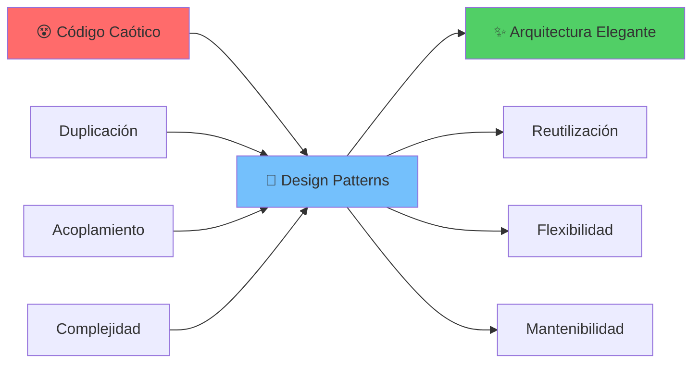
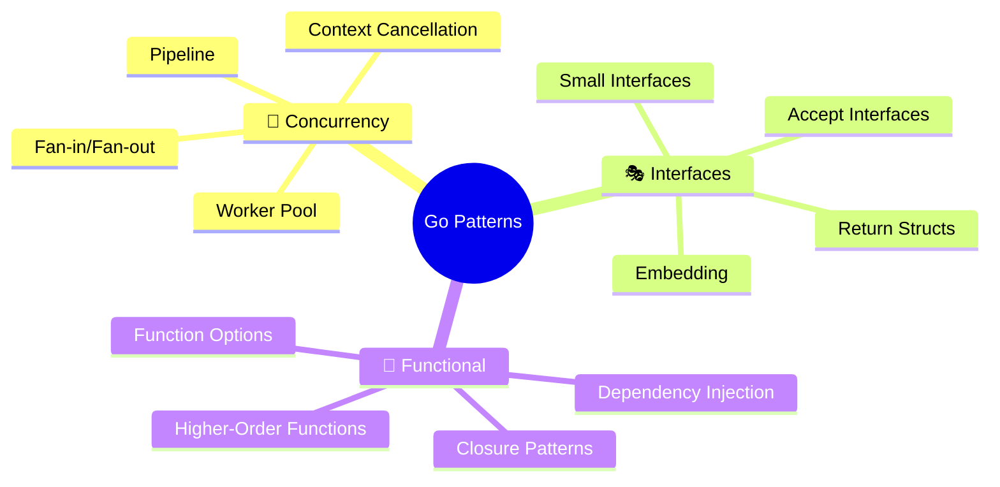
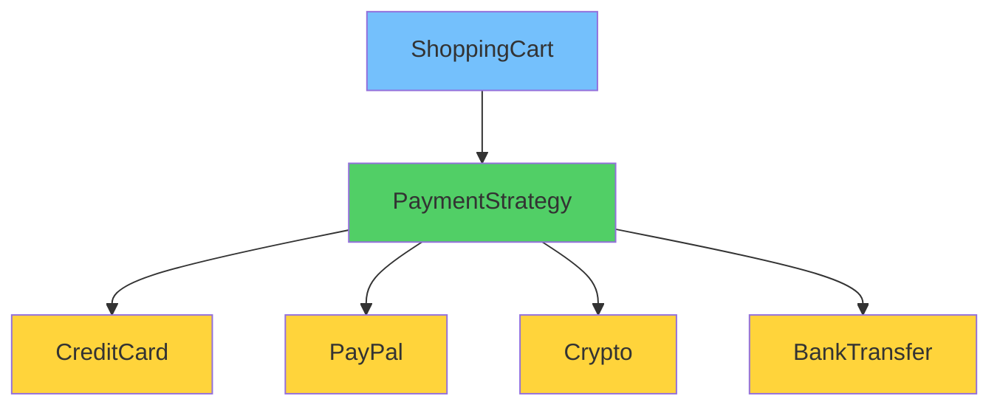
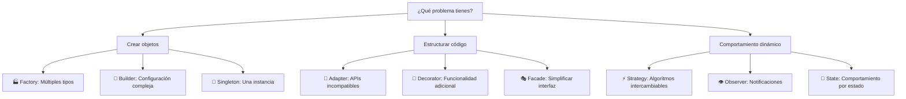

# 🎨 Design Patterns en Go
### *"Arquitecturas que Cambian el Mundo"*

> *"Los patrones de diseño no son recetas mágicas, son soluciones probadas a problemas recurrentes"* - Gang of Four

---

## 🎯 **¿Qué Aprenderás?**

Al completar esta lección, serás capaz de:

- ✅ **Implementar** los 23 patrones clásicos en Go idiomático
- ✅ **Reconocer** cuándo y cómo aplicar cada patrón
- ✅ **Adaptar** patrones OOP al paradigma de Go
- ✅ **Crear** arquitecturas elegantes y mantenibles
- ✅ **Optimizar** código usando patrones nativos de Go
- ✅ **Diseñar** APIs que otros developers amarán usar

---

## 🌟 **El Mundo Antes y Después de los Patterns**



### 🔥 **Transformación Real**

**Antes** (Sin patrones):
```go
// ❌ Código acoplado y rígido
func ProcessOrder(orderType string, data map[string]interface{}) {
    if orderType == "standard" {
        // 50 líneas de lógica específica
    } else if orderType == "express" {
        // 70 líneas de lógica específica
    } else if orderType == "bulk" {
        // 100 líneas de lógica específica
    }
    // Pesadilla de mantenimiento...
}
```

**Después** (Con Strategy Pattern):
```go
// ✅ Código elegante y extensible
type OrderProcessor interface {
    Process(order Order) error
}

func ProcessOrder(processor OrderProcessor, order Order) error {
    return processor.Process(order) // ¡Una línea!
}
```

---

## 📚 **Tabla de Contenidos**

### 🏗️ **Creational Patterns** *(Patrones de Creación)*
| Pattern                                                | Descripción                                 | Analogía               | Uso en Go            |
| ------------------------------------------------------ | ------------------------------------------- | ---------------------- | -------------------- |
| [🏭 Factory Method](./creational/factory-method.md)     | Crea objetos sin especificar clases exactas | Fábrica de automóviles | `io.Reader` creators |
| [🏗️ Abstract Factory](./creational/abstract-factory.md) | Familias de objetos relacionados            | Fábrica de muebles     | Database drivers     |
| [🔨 Builder](./creational/builder.md)                   | Construcción paso a paso                    | Constructor de casas   | HTTP client builders |
| [📄 Prototype](./creational/prototype.md)               | Clonación de objetos existentes             | Fotocopiadora          | `Clone()` methods    |
| [👑 Singleton](./creational/singleton.md)               | Una sola instancia global                   | Rey de un reino        | Config managers      |

### 🏗️ **Structural Patterns** *(Patrones Estructurales)*
| Pattern                                  | Descripción                                | Analogía                  | Uso en Go             |
| ---------------------------------------- | ------------------------------------------ | ------------------------- | --------------------- |
| [🔌 Adapter](./structural/adapter.md)     | Interfaz compatible entre incompatibles    | Adaptador de enchufe      | Interface wrappers    |
| [🌉 Bridge](./structural/bridge.md)       | Separa abstracción de implementación       | Puente                    | Database abstractions |
| [🌳 Composite](./structural/composite.md) | Árbol de objetos uniformes                 | Estructura organizacional | File systems          |
| [🎨 Decorator](./structural/decorator.md) | Añade funcionalidad dinámicamente          | Decorar una habitación    | Middleware chains     |
| [🎭 Facade](./structural/facade.md)       | Interfaz simplificada                      | Recepcionista de hotel    | API wrappers          |
| [🪶 Flyweight](./structural/flyweight.md) | Compartir eficientemente objetos similares | Biblioteca de libros      | String interning      |
| [🔗 Proxy](./structural/proxy.md)         | Representante de otro objeto               | Abogado                   | Caching, security     |

### ⚡ **Behavioral Patterns** *(Patrones de Comportamiento)*
| Pattern                                                           | Descripción                         | Analogía            | Uso en Go        |
| ----------------------------------------------------------------- | ----------------------------------- | ------------------- | ---------------- |
| [⚙️ Chain of Responsibility](./behavioral/chain-responsibility.md) | Cadena de manejadores               | Escalafón militar   | Middleware       |
| [💬 Command](./behavioral/command.md)                              | Encapsula operaciones como objetos  | Control remoto      | CLI commands     |
| [🗣️ Interpreter](./behavioral/interpreter.md)                      | Evalúa expresiones de un lenguaje   | Traductor           | Template engines |
| [🔄 Iterator](./behavioral/iterator.md)                            | Acceso secuencial a elementos       | Página de libro     | `range` loops    |
| [👨‍💼 Mediator](./behavioral/mediator.md)                            | Comunicación centralizada           | Torre de control    | Event buses      |
| [💾 Memento](./behavioral/memento.md)                              | Captura y restaura estados          | Máquina del tiempo  | Undo/Redo        |
| [👁️ Observer](./behavioral/observer.md)                            | Notificación automática de cambios  | Sistema de alertas  | Event listeners  |
| [🎯 State](./behavioral/state.md)                                  | Comportamiento según estado interno | Máquina expendedora | State machines   |
| [⚡ Strategy](./behavioral/strategy.md)                            | Algoritmos intercambiables          | Métodos de pago     | Sort algorithms  |
| [📝 Template Method](./behavioral/template-method.md)              | Esqueleto de algoritmo              | Receta de cocina    | Framework hooks  |
| [🏃 Visitor](./behavioral/visitor.md)                              | Operaciones sobre estructuras       | Turista visitando   | AST traversal    |

---

## 🎯 **Go-Specific Patterns** *(Patrones Nativos de Go)*



### 🌟 **Patrones Únicos de Go**
| Pattern                                                     | Descripción               | Ejemplo                | Beneficio     |
| ----------------------------------------------------------- | ------------------------- | ---------------------- | ------------- |
| [⚙️ Functional Options](./go-specific/functional-options.md) | Configuración flexible    | `http.NewRequest()`    | API limpia    |
| [🎭 Interface Embedding](./go-specific/embedding.md)         | Composición de interfaces | `io.ReadWriter`        | Reutilización |
| [⚡ Worker Pool](./go-specific/worker-pool.md)               | Concurrencia controlada   | Procesamiento paralelo | Performance   |
| [🔄 Pipeline](./go-specific/pipeline.md)                     | Procesamiento en etapas   | Unix pipes             | Modularity    |
| [📡 Pub/Sub](./go-specific/pubsub.md)                        | Comunicación desacoplada  | Event systems          | Escalabilidad |

---

## 🏃 **Quick Start: Tu Primer Pattern**

### 🎯 **Strategy Pattern en 5 Minutos**

```go
// 1️⃣ Define la estrategia
type PaymentStrategy interface {
    Pay(amount float64) error
}

// 2️⃣ Implementa estrategias concretas
type CreditCard struct {
    number string
}

func (c CreditCard) Pay(amount float64) error {
    fmt.Printf("💳 Pagando $%.2f con tarjeta %s\n", amount, c.number)
    return nil
}

type PayPal struct {
    email string
}

func (p PayPal) Pay(amount float64) error {
    fmt.Printf("📱 Pagando $%.2f via PayPal %s\n", amount, p.email)
    return nil
}

// 3️⃣ Context que usa la estrategia
type ShoppingCart struct {
    items    []Item
    strategy PaymentStrategy
}

func (s *ShoppingCart) SetPaymentStrategy(strategy PaymentStrategy) {
    s.strategy = strategy
}

func (s *ShoppingCart) Checkout() error {
    total := s.calculateTotal()
    return s.strategy.Pay(total)
}

// 4️⃣ ¡Úsalo!
func main() {
    cart := &ShoppingCart{items: getItems()}
    
    // Cambiar estrategia dinámicamente
    cart.SetPaymentStrategy(CreditCard{number: "****1234"})
    cart.Checkout() // 💳 Pagando con tarjeta
    
    cart.SetPaymentStrategy(PayPal{email: "user@example.com"})
    cart.Checkout() // 📱 Pagando con PayPal
}
```

### 🔥 **¿Por Qué Funciona?**



**Beneficios instantáneos:**
- ✅ **Extensible**: Nuevos métodos de pago sin cambiar código existente
- ✅ **Testeable**: Mock strategies fácilmente
- ✅ **Mantenible**: Cada strategy es independiente
- ✅ **Go idiomático**: Usa interfaces naturalmente

---

## 🎨 **Cuándo Usar Cada Patrón**

### 🎯 **Decisión Rápida: Pattern Decision Tree**



### 🔍 **Matriz de Decisión Rápida**

| Situación                           | Pattern Recomendado | Código de Ejemplo    |
| ----------------------------------- | ------------------- | -------------------- |
| 🔄 Cambiar algoritmos en runtime     | Strategy            | `sort.Interface`     |
| 🏭 Crear familias de objetos         | Abstract Factory    | Database drivers     |
| 🎨 Añadir funcionalidad sin herencia | Decorator           | HTTP middleware      |
| 👁️ Notificar cambios automáticamente | Observer            | Event systems        |
| 🔌 Integrar APIs incompatibles       | Adapter             | Third-party wrappers |
| 🔨 Configurar objetos complejos      | Builder             | HTTP client builders |

---

## 🚀 **Roadmap de Aprendizaje**

### 📅 **Plan de 10 Días**

```mermaid
gantt
    title Mastering Design Patterns
    dateFormat  X
    axisFormat %d
    
    section Creational
    Factory Method     :1, 2
    Builder Pattern    :2, 3
    Singleton         :3, 4
    
    section Structural
    Adapter & Facade  :4, 5
    Decorator         :5, 6
    Composite         :6, 7
    
    section Behavioral
    Strategy & Observer :7, 8
    Command & State    :8, 9
    Chain & Template   :9, 10
    
    section Go Specific
    Functional Options :10, 11
```



### 🎯 **Día 1: Foundation**
- ✅ **Teoría**: ¿Qué son los design patterns?
- ✅ **Práctica**: Implementar Factory Method
- ✅ **Proyecto**: Sistema de loggers

### 🎯 **Día 2: Builder Magic**
- ✅ **Teoría**: Construcción fluida de objetos
- ✅ **Práctica**: HTTP Client Builder
- ✅ **Proyecto**: Query Builder para SQL

### 🎯 **Día 3-4: Structural Power**
- ✅ **Adapter**: Integrar APIs legacy
- ✅ **Decorator**: Middleware chains
- ✅ **Facade**: Simplificar complejidad

### 🎯 **Día 5-7: Behavioral Mastery**
- ✅ **Strategy**: Algoritmos dinámicos
- ✅ **Observer**: Event-driven architecture
- ✅ **Command**: Undo/Redo systems

### 🎯 **Día 8-10: Go Native Patterns**
- ✅ **Functional Options**: API elegantes
- ✅ **Worker Pools**: Concurrencia eficiente
- ✅ **Pipeline**: Procesamiento en cadena

---

## 🎯 **Proyectos Prácticos**

### 🏗️ **Proyecto 1: Sistema de Pagos (Strategy + Factory)**
```go
// Combina múltiples patterns para crear un sistema robusto
type PaymentSystem struct {
    factory    PaymentFactory    // Factory Pattern
    strategies map[string]PaymentStrategy // Strategy Pattern
    processor  PaymentProcessor   // Template Method
}
```

### 🎨 **Proyecto 2: HTTP Middleware (Decorator + Chain)**
```go
// Middleware chain usando Decorator pattern
func (h Handler) ServeHTTP(w http.ResponseWriter, r *http.Request) {
    auth := AuthDecorator(h)
    logging := LoggingDecorator(auth)
    cors := CORSDecorator(logging)
    cors.ServeHTTP(w, r)
}
```

### 📊 **Proyecto 3: Event System (Observer + Mediator)**
```go
// Sistema de eventos distribuido
type EventBus struct {
    observers map[string][]Observer // Observer Pattern
    mediator  EventMediator         // Mediator Pattern
}
```

---

## 🔧 **Herramientas y Recursos**

### 📚 **Recursos Esenciales**
- 📖 **Gang of Four**: Design Patterns original
- 🎥 **Go Patterns Video Series**: Visual learning
- 💻 **Interactive Examples**: [patterns.dev](https://patterns.dev)
- 🛠️ **Pattern Generator**: CLI tool for boilerplate

### 🔍 **Análisis de Código**
```bash
# Detectar anti-patterns
go install github.com/go-critic/go-critic
go-critic check ./...

# Pattern complexity analysis
go install github.com/fzipp/gocyclo
gocyclo -top 10 .
```

### 🧪 **Testing Patterns**
```go
// Mock Strategy for testing
type MockPayment struct {
    calls []PaymentCall
}

func (m *MockPayment) Pay(amount float64) error {
    m.calls = append(m.calls, PaymentCall{Amount: amount})
    return nil
}
```

---

## 🎯 **Anti-Patterns: Lo Que NO Hacer**

### ❌ **Pattern Overuse**
```go
// ❌ Usar patterns donde no se necesitan
type SimpleCalculator struct {
    factory CalculatorFactory
    builder CalculatorBuilder
    strategy CalculationStrategy
}

// Para solo: 2 + 2 = 4
```

### ❌ **Pattern Misuse**
```go
// ❌ Singleton abuse
var DB = database.GetInstance() // Global state nightmare
```

### ✅ **Go Way**
```go
// ✅ Dependency injection
func NewService(db Database) *Service {
    return &Service{db: db}
}
```

---

## 🏆 **Evaluación y Certificación**

### 📝 **Quiz Interactivo**
```go
// ¿Qué pattern usarías aquí?
func ProcessData(data []byte, format string) error {
    // Tu respuesta aquí
}
```

### 🏅 **Challenges**
1. **Novice**: Implementar 5 patterns básicos
2. **Intermediate**: Crear sistema con 3 patterns combinados
3. **Expert**: Diseñar arquitectura completa usando patterns

### 🎖️ **Certificación Go Patterns Master**
- ✅ **Teoría**: Exam teórico (100 preguntas)
- ✅ **Práctica**: Proyecto real evaluado
- ✅ **Code Review**: Peer review de implementaciones

---

## 🎉 **¡Comienza Ahora!**

### 🚀 **Tu Primer Paso**
```bash
cd creational/
cat factory-method.md
```

### 💬 **Comunidad**
- 💬 **Discord**: [Go Patterns Community](https://discord.gg/go-patterns)
- 📱 **Telegram**: [@go_design_patterns](https://t.me/go_design_patterns)
- 🐦 **Twitter**: [@GoPatterns](https://twitter.com/GoPatterns)

### 🎯 **Próxima Lección**
**[🏗️ Architecture Patterns →](../05-architecture-patterns/)**

---

> *"Los patterns no son reglas, son herramientas. Úsalos sabiamente y tu código se volverá poesía"* - Gopher Sage 🐹

**¡El futuro de tu arquitectura comienza aquí! 🚀**
