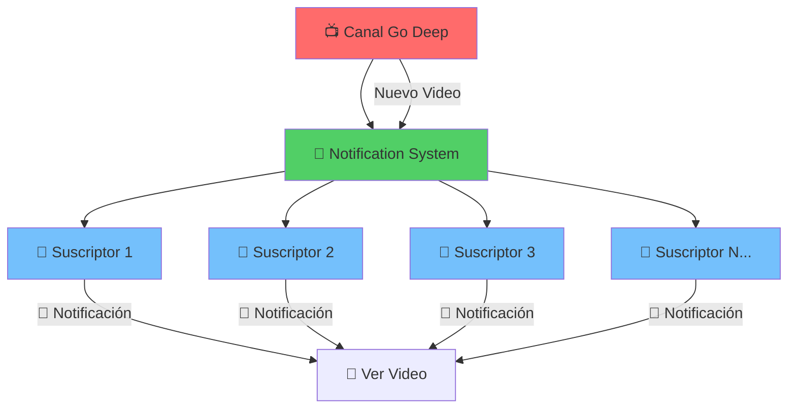
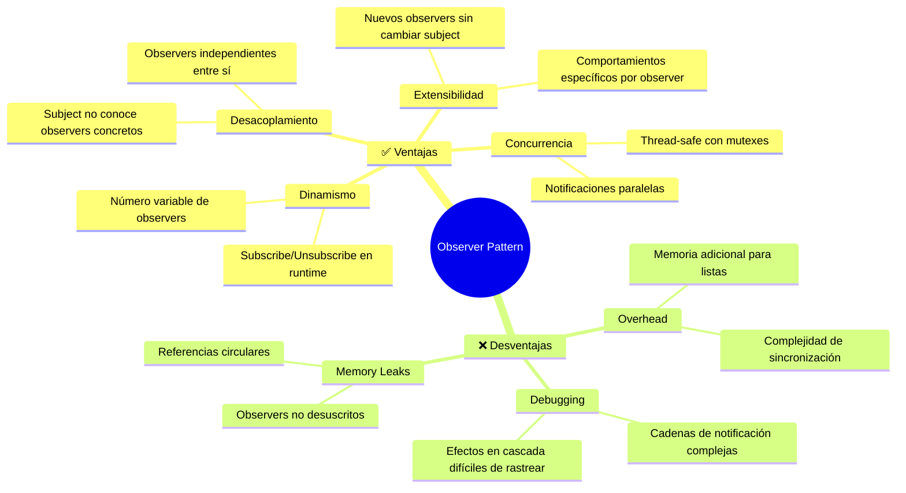
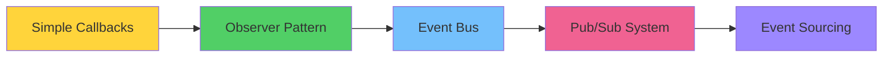

# 👁️ Observer Pattern
### *"El Sistema de Notificaciones Perfecto"*

> *"Define una dependencia uno-a-muchos entre objetos, de manera que cuando un objeto cambia de estado, todos sus dependientes son notificados automáticamente"* - Gang of Four

---

## 🎯 **¿Qué es Observer Pattern?**

El patrón **Observer** es como un **sistema de suscripciones**: cuando algo interesante pasa, todos los interesados se enteran automáticamente. Es el corazón de la programación event-driven.

### 📺 **Analogía: Canal de YouTube**



**En la vida real:**
- YouTube es el **Subject** (observable)
- Los suscriptores son **Observers**
- Cuando subes un video (cambio de estado)
- Todos los suscriptores reciben notificación
- Cada uno decide qué hacer (ver, ignorar, guardar)

---

## 🔧 **Implementación en Go**

### 📝 **Estructura Básica**

```go
// Observer interface - quien recibe las notificaciones
type Observer interface {
    Update(event Event) error
    GetID() string
}

// Subject interface - quien envía las notificaciones
type Subject interface {
    Subscribe(observer Observer) error
    Unsubscribe(observerID string) error
    Notify(event Event) error
}

// Event - información que se comparte
type Event struct {
    Type      string
    Data      interface{}
    Timestamp time.Time
    Source    string
}
```

### 🏪 **Subject Concreto: Sistema de E-commerce**

```go
type EcommerceStore struct {
    name      string
    observers map[string]Observer
    mutex     sync.RWMutex
    products  map[string]*Product
}

type Product struct {
    ID          string
    Name        string
    Price       float64
    Stock       int
    Category    string
    IsAvailable bool
}

func NewEcommerceStore(name string) *EcommerceStore {
    return &EcommerceStore{
        name:      name,
        observers: make(map[string]Observer),
        products:  make(map[string]*Product),
    }
}

func (es *EcommerceStore) Subscribe(observer Observer) error {
    es.mutex.Lock()
    defer es.mutex.Unlock()
    
    observerID := observer.GetID()
    if _, exists := es.observers[observerID]; exists {
        return fmt.Errorf("observer %s ya está suscrito", observerID)
    }
    
    es.observers[observerID] = observer
    fmt.Printf("✅ %s se suscribió a %s\n", observerID, es.name)
    
    return nil
}

func (es *EcommerceStore) Unsubscribe(observerID string) error {
    es.mutex.Lock()
    defer es.mutex.Unlock()
    
    if _, exists := es.observers[observerID]; !exists {
        return fmt.Errorf("observer %s no está suscrito", observerID)
    }
    
    delete(es.observers, observerID)
    fmt.Printf("❌ %s se desuscribió de %s\n", observerID, es.name)
    
    return nil
}

func (es *EcommerceStore) Notify(event Event) error {
    es.mutex.RLock()
    observers := make([]Observer, 0, len(es.observers))
    for _, observer := range es.observers {
        observers = append(observers, observer)
    }
    es.mutex.RUnlock()
    
    fmt.Printf("📡 %s notificando evento: %s\n", es.name, event.Type)
    
    // Notificar a todos los observers concurrentemente
    var wg sync.WaitGroup
    for _, observer := range observers {
        wg.Add(1)
        go func(obs Observer) {
            defer wg.Done()
            if err := obs.Update(event); err != nil {
                fmt.Printf("❌ Error notificando a %s: %v\n", obs.GetID(), err)
            }
        }(observer)
    }
    
    wg.Wait()
    return nil
}

func (es *EcommerceStore) AddProduct(product *Product) {
    es.products[product.ID] = product
    
    event := Event{
        Type:      "PRODUCT_ADDED",
        Data:      product,
        Timestamp: time.Now(),
        Source:    es.name,
    }
    
    es.Notify(event)
}

func (es *EcommerceStore) UpdateStock(productID string, newStock int) error {
    product, exists := es.products[productID]
    if !exists {
        return fmt.Errorf("producto %s no encontrado", productID)
    }
    
    oldStock := product.Stock
    product.Stock = newStock
    
    eventType := "STOCK_UPDATED"
    if oldStock == 0 && newStock > 0 {
        eventType = "BACK_IN_STOCK"
        product.IsAvailable = true
    } else if oldStock > 0 && newStock == 0 {
        eventType = "OUT_OF_STOCK"
        product.IsAvailable = false
    }
    
    event := Event{
        Type: eventType,
        Data: map[string]interface{}{
            "product":   product,
            "oldStock":  oldStock,
            "newStock":  newStock,
        },
        Timestamp: time.Now(),
        Source:    es.name,
    }
    
    es.Notify(event)
    return nil
}

func (es *EcommerceStore) UpdatePrice(productID string, newPrice float64) error {
    product, exists := es.products[productID]
    if !exists {
        return fmt.Errorf("producto %s no encontrado", productID)
    }
    
    oldPrice := product.Price
    product.Price = newPrice
    
    eventType := "PRICE_UPDATED"
    if newPrice < oldPrice {
        eventType = "PRICE_DROPPED"
    } else if newPrice > oldPrice {
        eventType = "PRICE_INCREASED"
    }
    
    event := Event{
        Type: eventType,
        Data: map[string]interface{}{
            "product":  product,
            "oldPrice": oldPrice,
            "newPrice": newPrice,
        },
        Timestamp: time.Now(),
        Source:    es.name,
    }
    
    es.Notify(event)
    return nil
}

func (es *EcommerceStore) GetObserverCount() int {
    es.mutex.RLock()
    defer es.mutex.RUnlock()
    return len(es.observers)
}
```

### 👁️ **Observers Concretos**

```go
// Customer Observer - Cliente interesado en productos
type Customer struct {
    ID            string
    Name          string
    Email         string
    InterestedIn  []string // Categorías de interés
    PriceAlerts   map[string]float64 // ProductID -> Max Price
    notifications []Event
    mutex         sync.Mutex
}

func NewCustomer(id, name, email string) *Customer {
    return &Customer{
        ID:            id,
        Name:          name,
        Email:         email,
        InterestedIn:  make([]string, 0),
        PriceAlerts:   make(map[string]float64),
        notifications: make([]Event, 0),
    }
}

func (c *Customer) GetID() string {
    return c.ID
}

func (c *Customer) Update(event Event) error {
    c.mutex.Lock()
    defer c.mutex.Unlock()
    
    c.notifications = append(c.notifications, event)
    
    switch event.Type {
    case "PRODUCT_ADDED":
        return c.handleProductAdded(event)
    case "PRICE_DROPPED":
        return c.handlePriceDropped(event)
    case "BACK_IN_STOCK":
        return c.handleBackInStock(event)
    case "OUT_OF_STOCK":
        return c.handleOutOfStock(event)
    default:
        fmt.Printf("📧 %s: Evento recibido: %s\n", c.Name, event.Type)
    }
    
    return nil
}

func (c *Customer) handleProductAdded(event Event) error {
    product := event.Data.(*Product)
    
    // Verificar si está interesado en esta categoría
    for _, category := range c.InterestedIn {
        if product.Category == category {
            fmt.Printf("💡 %s: ¡Nuevo producto en %s! %s - $%.2f\n", 
                c.Name, product.Category, product.Name, product.Price)
            return nil
        }
    }
    
    return nil
}

func (c *Customer) handlePriceDropped(event Event) error {
    data := event.Data.(map[string]interface{})
    product := data["product"].(*Product)
    oldPrice := data["oldPrice"].(float64)
    
    // Verificar si tenía una alerta de precio para este producto
    if maxPrice, exists := c.PriceAlerts[product.ID]; exists {
        if product.Price <= maxPrice {
            fmt.Printf("🔥 %s: ¡ALERTA DE PRECIO! %s bajó de $%.2f a $%.2f\n", 
                c.Name, product.Name, oldPrice, product.Price)
            fmt.Printf("💰 %s: ¡Ahorra $%.2f!\n", c.Name, oldPrice-product.Price)
            
            // Enviar "email"
            c.sendEmail(fmt.Sprintf("Precio de %s bajó a $%.2f", product.Name, product.Price))
        }
    }
    
    return nil
}

func (c *Customer) handleBackInStock(event Event) error {
    data := event.Data.(map[string]interface{})
    product := data["product"].(*Product)
    
    fmt.Printf("🎉 %s: ¡%s está de vuelta en stock!\n", c.Name, product.Name)
    c.sendEmail(fmt.Sprintf("%s está disponible nuevamente", product.Name))
    
    return nil
}

func (c *Customer) handleOutOfStock(event Event) error {
    data := event.Data.(map[string]interface{})
    product := data["product"].(*Product)
    
    fmt.Printf("😞 %s: %s se agotó\n", c.Name, product.Name)
    
    return nil
}

func (c *Customer) sendEmail(message string) {
    fmt.Printf("📧 Email a %s (%s): %s\n", c.Name, c.Email, message)
}

func (c *Customer) SetPriceAlert(productID string, maxPrice float64) {
    c.mutex.Lock()
    defer c.mutex.Unlock()
    
    c.PriceAlerts[productID] = maxPrice
    fmt.Printf("🔔 %s configuró alerta: Producto %s a máximo $%.2f\n", 
        c.Name, productID, maxPrice)
}

func (c *Customer) AddInterest(category string) {
    c.mutex.Lock()
    defer c.mutex.Unlock()
    
    c.InterestedIn = append(c.InterestedIn, category)
    fmt.Printf("❤️ %s ahora está interesado en: %s\n", c.Name, category)
}

func (c *Customer) GetNotificationCount() int {
    c.mutex.Lock()
    defer c.mutex.Unlock()
    return len(c.notifications)
}

// Analytics Observer - Sistema de análisis
type AnalyticsSystem struct {
    ID       string
    metrics  map[string]int
    events   []Event
    mutex    sync.Mutex
}

func NewAnalyticsSystem(id string) *AnalyticsSystem {
    return &AnalyticsSystem{
        ID:      id,
        metrics: make(map[string]int),
        events:  make([]Event, 0),
    }
}

func (as *AnalyticsSystem) GetID() string {
    return as.ID
}

func (as *AnalyticsSystem) Update(event Event) error {
    as.mutex.Lock()
    defer as.mutex.Unlock()
    
    as.events = append(as.events, event)
    as.metrics[event.Type]++
    
    fmt.Printf("📊 Analytics: Registrado evento %s (total: %d)\n", 
        event.Type, as.metrics[event.Type])
    
    // Análisis específico por tipo de evento
    switch event.Type {
    case "PRICE_DROPPED":
        as.analyzePriceDrop(event)
    case "OUT_OF_STOCK":
        as.analyzeStockOut(event)
    }
    
    return nil
}

func (as *AnalyticsSystem) analyzePriceDrop(event Event) {
    data := event.Data.(map[string]interface{})
    product := data["product"].(*Product)
    oldPrice := data["oldPrice"].(float64)
    
    discount := ((oldPrice - product.Price) / oldPrice) * 100
    fmt.Printf("📈 Analytics: Descuento de %.1f%% en %s\n", discount, product.Name)
}

func (as *AnalyticsSystem) analyzeStockOut(event Event) {
    fmt.Printf("⚠️ Analytics: Posible pérdida de ventas detectada\n")
}

func (as *AnalyticsSystem) GetReport() map[string]int {
    as.mutex.Lock()
    defer as.mutex.Unlock()
    
    report := make(map[string]int)
    for eventType, count := range as.metrics {
        report[eventType] = count
    }
    
    return report
}

// Inventory Manager Observer
type InventoryManager struct {
    ID              string
    reorderLevels   map[string]int
    autoReorderEnabled bool
    orders          []string
    mutex           sync.Mutex
}

func NewInventoryManager(id string) *InventoryManager {
    return &InventoryManager{
        ID:              id,
        reorderLevels:   make(map[string]int),
        autoReorderEnabled: true,
        orders:          make([]string, 0),
    }
}

func (im *InventoryManager) GetID() string {
    return im.ID
}

func (im *InventoryManager) Update(event Event) error {
    im.mutex.Lock()
    defer im.mutex.Unlock()
    
    switch event.Type {
    case "STOCK_UPDATED", "OUT_OF_STOCK":
        return im.handleStockUpdate(event)
    case "PRODUCT_ADDED":
        return im.handleNewProduct(event)
    }
    
    return nil
}

func (im *InventoryManager) handleStockUpdate(event Event) error {
    data := event.Data.(map[string]interface{})
    product := data["product"].(*Product)
    
    if reorderLevel, exists := im.reorderLevels[product.ID]; exists {
        if product.Stock <= reorderLevel && im.autoReorderEnabled {
            orderQuantity := reorderLevel * 3 // Ordenar para 3x el nivel mínimo
            im.createReorderRequest(product, orderQuantity)
        }
    }
    
    fmt.Printf("📦 Inventory: Stock de %s actualizado a %d unidades\n", 
        product.Name, product.Stock)
    
    return nil
}

func (im *InventoryManager) handleNewProduct(event Event) error {
    product := event.Data.(*Product)
    
    // Establecer nivel de reorden por defecto
    im.reorderLevels[product.ID] = 5
    fmt.Printf("📋 Inventory: Nivel de reorden para %s establecido en %d\n", 
        product.Name, 5)
    
    return nil
}

func (im *InventoryManager) createReorderRequest(product *Product, quantity int) {
    orderID := fmt.Sprintf("ORD-%s-%d", product.ID, time.Now().Unix())
    im.orders = append(im.orders, orderID)
    
    fmt.Printf("🔄 Inventory: Orden automática creada - %s (%d unidades de %s)\n", 
        orderID, quantity, product.Name)
}

func (im *InventoryManager) SetReorderLevel(productID string, level int) {
    im.mutex.Lock()
    defer im.mutex.Unlock()
    
    im.reorderLevels[productID] = level
    fmt.Printf("⚙️ Inventory: Nivel de reorden para %s: %d unidades\n", productID, level)
}
```

---

## 🚀 **Ejemplo Completo en Acción**

```go
package main

import (
    "fmt"
    "math/rand"
    "time"
)

func main() {
    fmt.Println("🏪 === OBSERVER PATTERN: TIENDA ONLINE ===")
    fmt.Println()
    
    // Crear la tienda (Subject)
    store := NewEcommerceStore("TechStore Pro")
    
    // Crear observers
    customer1 := NewCustomer("CUST001", "Alice Techie", "alice@email.com")
    customer1.AddInterest("Electronics")
    customer1.AddInterest("Gaming")
    
    customer2 := NewCustomer("CUST002", "Bob Gamer", "bob@email.com")
    customer2.AddInterest("Gaming")
    
    analytics := NewAnalyticsSystem("ANALYTICS001")
    inventory := NewInventoryManager("INV001")
    
    // Suscribir observers
    store.Subscribe(customer1)
    store.Subscribe(customer2)
    store.Subscribe(analytics)
    store.Subscribe(inventory)
    
    fmt.Printf("👥 Observadores suscritos: %d\n", store.GetObserverCount())
    fmt.Println()
    
    // Agregar productos
    fmt.Println("🆕 === AGREGANDO PRODUCTOS ===")
    products := []*Product{
        {
            ID: "PROD001", Name: "Gaming Laptop RTX 4090", Price: 2499.99,
            Stock: 10, Category: "Electronics", IsAvailable: true,
        },
        {
            ID: "PROD002", Name: "Mechanical Gaming Keyboard", Price: 149.99,
            Stock: 25, Category: "Gaming", IsAvailable: true,
        },
        {
            ID: "PROD003", Name: "4K Gaming Monitor", Price: 599.99,
            Stock: 8, Category: "Electronics", IsAvailable: true,
        },
    }
    
    for _, product := range products {
        store.AddProduct(product)
        time.Sleep(500 * time.Millisecond)
    }
    
    fmt.Println("\n" + "="*60)
    
    // Configurar alertas de precio
    fmt.Println("🔔 === CONFIGURANDO ALERTAS ===")
    customer1.SetPriceAlert("PROD001", 2000.00) // Alice quiere laptop a máx $2000
    customer2.SetPriceAlert("PROD002", 120.00)  // Bob quiere teclado a máx $120
    
    // Configurar niveles de inventario
    inventory.SetReorderLevel("PROD001", 3)
    inventory.SetReorderLevel("PROD002", 10)
    inventory.SetReorderLevel("PROD003", 2)
    
    fmt.Println("\n" + "="*60)
    
    // Simular cambios de precio
    fmt.Println("💰 === SIMULANDO CAMBIOS DE PRECIO ===")
    
    // Laptop baja de precio (activará alerta de Alice)
    fmt.Println("📉 Bajando precio de laptop...")
    store.UpdatePrice("PROD001", 1899.99)
    time.Sleep(1 * time.Second)
    
    // Teclado baja de precio (activará alerta de Bob)
    fmt.Println("📉 Bajando precio de teclado...")
    store.UpdatePrice("PROD002", 99.99)
    time.Sleep(1 * time.Second)
    
    fmt.Println("\n" + "="*60)
    
    // Simular cambios de stock
    fmt.Println("📦 === SIMULANDO CAMBIOS DE STOCK ===")
    
    // Agotar laptop (activará reorden automático)
    fmt.Println("📉 Vendiendo laptops...")
    for i := 10; i > 0; i-- {
        store.UpdateStock("PROD001", i-1)
        time.Sleep(200 * time.Millisecond)
        if i <= 3 {
            time.Sleep(500 * time.Millisecond) // Pausa para ver reorden automático
        }
    }
    
    fmt.Println("\n📈 Reponiendo stock de laptop...")
    store.UpdateStock("PROD001", 15) // Reponer stock
    time.Sleep(1 * time.Second)
    
    fmt.Println("\n" + "="*60)
    
    // Desuscribir un observer
    fmt.Println("👋 === DESUSCRIBIENDO OBSERVER ===")
    store.Unsubscribe(customer2.GetID())
    fmt.Printf("👥 Observadores restantes: %d\n", store.GetObserverCount())
    
    // Hacer un cambio que solo verán los observers restantes
    fmt.Println("\n📈 Subiendo precio de monitor (solo Alice y sistemas lo verán)...")
    store.UpdatePrice("PROD003", 699.99)
    
    fmt.Println("\n" + "="*60)
    
    // Mostrar estadísticas finales
    fmt.Println("📊 === REPORTE FINAL ===")
    
    fmt.Printf("📧 Notificaciones de Alice: %d\n", customer1.GetNotificationCount())
    fmt.Printf("📧 Notificaciones de Bob: %d\n", customer2.GetNotificationCount())
    
    fmt.Println("\n📈 Reporte de Analytics:")
    report := analytics.GetReport()
    for eventType, count := range report {
        fmt.Printf("   %s: %d eventos\n", eventType, count)
    }
    
    fmt.Println("\n🎯 === DEMO DE CONCURRENCIA ===")
    
    // Simular muchos cambios concurrentes
    go func() {
        for i := 0; i < 5; i++ {
            price := 1500.0 + rand.Float64()*1000
            store.UpdatePrice("PROD001", price)
            time.Sleep(100 * time.Millisecond)
        }
    }()
    
    go func() {
        for i := 0; i < 5; i++ {
            stock := rand.Intn(20)
            store.UpdateStock("PROD002", stock)
            time.Sleep(150 * time.Millisecond)
        }
    }()
    
    time.Sleep(2 * time.Second)
    
    fmt.Println("\n🎉 === DEMO COMPLETADO ===")
    fmt.Printf("🏪 Total de observadores: %d\n", store.GetObserverCount())
}
```

### 📤 **Output Esperado**

```
🏪 === OBSERVER PATTERN: TIENDA ONLINE ===

✅ Alice Techie se suscribió a TechStore Pro
❤️ Alice Techie ahora está interesado en: Electronics
❤️ Alice Techie ahora está interesado en: Gaming
✅ Bob Gamer se suscribió a TechStore Pro
❤️ Bob Gamer ahora está interesado en: Gaming
✅ ANALYTICS001 se suscribió a TechStore Pro
✅ INV001 se suscribió a TechStore Pro
👥 Observadores suscritos: 4

🆕 === AGREGANDO PRODUCTOS ===
📡 TechStore Pro notificando evento: PRODUCT_ADDED
💡 Alice Techie: ¡Nuevo producto en Electronics! Gaming Laptop RTX 4090 - $2499.99
📊 Analytics: Registrado evento PRODUCT_ADDED (total: 1)
📋 Inventory: Nivel de reorden para Gaming Laptop RTX 4090 establecido en 5

📡 TechStore Pro notificando evento: PRODUCT_ADDED
💡 Alice Techie: ¡Nuevo producto en Gaming! Mechanical Gaming Keyboard - $149.99
💡 Bob Gamer: ¡Nuevo producto en Gaming! Mechanical Gaming Keyboard - $149.99
📊 Analytics: Registrado evento PRODUCT_ADDED (total: 2)
📋 Inventory: Nivel de reorden para Mechanical Gaming Keyboard establecido en 5

🔔 === CONFIGURANDO ALERTAS ===
🔔 Alice Techie configuró alerta: Producto PROD001 a máximo $2000.00
🔔 Bob Gamer configuró alerta: Producto PROD002 a máximo $120.00
⚙️ Inventory: Nivel de reorden para PROD001: 3 unidades
⚙️ Inventory: Nivel de reorden para PROD002: 10 unidades

💰 === SIMULANDO CAMBIOS DE PRECIO ===
📉 Bajando precio de laptop...
📡 TechStore Pro notificando evento: PRICE_DROPPED
🔥 Alice Techie: ¡ALERTA DE PRECIO! Gaming Laptop RTX 4090 bajó de $2499.99 a $1899.99
💰 Alice Techie: ¡Ahorra $600.00!
📧 Email a Alice Techie (alice@email.com): Precio de Gaming Laptop RTX 4090 bajó a $1899.99
📊 Analytics: Registrado evento PRICE_DROPPED (total: 1)
📈 Analytics: Descuento de 24.0% en Gaming Laptop RTX 4090

📦 === SIMULANDO CAMBIOS DE STOCK ===
📉 Vendiendo laptops...
📡 TechStore Pro notificando evento: STOCK_UPDATED
📦 Inventory: Stock de Gaming Laptop RTX 4090 actualizado a 8 unidades
...
📡 TechStore Pro notificando evento: STOCK_UPDATED
🔄 Inventory: Orden automática creada - ORD-PROD001-1674123456 (9 unidades de Gaming Laptop RTX 4090)
📦 Inventory: Stock de Gaming Laptop RTX 4090 actualizado a 2 unidades

📡 TechStore Pro notificando evento: OUT_OF_STOCK
😞 Alice Techie: Gaming Laptop RTX 4090 se agotó
📊 Analytics: Registrado evento OUT_OF_STOCK (total: 1)
⚠️ Analytics: Posible pérdida de ventas detectada

📈 Reponiendo stock de laptop...
📡 TechStore Pro notificando evento: BACK_IN_STOCK
🎉 Alice Techie: ¡Gaming Laptop RTX 4090 está de vuelta en stock!
📧 Email a Alice Techie (alice@email.com): Gaming Laptop RTX 4090 está disponible nuevamente
```

---

## 🎯 **Casos de Uso Reales en Go**

### 1️⃣ **Context Cancellation**

```go
// Go's context package usa observer pattern
ctx, cancel := context.WithCancel(context.Background())

// Múltiples goroutines "observan" el contexto
go func() {
    select {
    case <-ctx.Done():
        fmt.Println("Goroutine 1: cancelado")
    }
}()

go func() {
    select {
    case <-ctx.Done():
        fmt.Println("Goroutine 2: cancelado")
    }
}()

// Cancelar notifica a todos los observers
cancel()
```

### 2️⃣ **Event System con Channels**

```go
type EventBus struct {
    subscribers map[string][]chan Event
    mutex       sync.RWMutex
}

func (eb *EventBus) Subscribe(eventType string, ch chan Event) {
    eb.mutex.Lock()
    defer eb.mutex.Unlock()
    
    eb.subscribers[eventType] = append(eb.subscribers[eventType], ch)
}

func (eb *EventBus) Publish(event Event) {
    eb.mutex.RLock()
    subscribers := eb.subscribers[event.Type]
    eb.mutex.RUnlock()
    
    for _, ch := range subscribers {
        go func(c chan Event) {
            select {
            case c <- event:
            case <-time.After(100 * time.Millisecond):
                // Timeout si el subscriber está bloqueado
            }
        }(ch)
    }
}

// Uso
eventBus := &EventBus{subscribers: make(map[string][]chan Event)}

userCh := make(chan Event, 10)
analyticsCh := make(chan Event, 10)

eventBus.Subscribe("user_signup", userCh)
eventBus.Subscribe("user_signup", analyticsCh)

eventBus.Publish(Event{Type: "user_signup", Data: user})
```

### 3️⃣ **File Watcher**

```go
type FileWatcher struct {
    observers []FileObserver
    files     map[string]os.FileInfo
    ticker    *time.Ticker
}

type FileObserver interface {
    OnFileChanged(filename string, info os.FileInfo)
    OnFileAdded(filename string, info os.FileInfo)
    OnFileDeleted(filename string)
}

func (fw *FileWatcher) AddObserver(observer FileObserver) {
    fw.observers = append(fw.observers, observer)
}

func (fw *FileWatcher) notifyFileChanged(filename string, info os.FileInfo) {
    for _, observer := range fw.observers {
        go observer.OnFileChanged(filename, info)
    }
}

func (fw *FileWatcher) Watch(directory string) {
    fw.ticker = time.NewTicker(1 * time.Second)
    
    go func() {
        for range fw.ticker.C {
            fw.checkFiles(directory)
        }
    }()
}
```

---

## ✅ **Ventajas del Observer Pattern**

### 🎯 **Principales Beneficios**



### 🚀 **Perfect Use Cases**

- ✅ **Event-driven architectures**
- ✅ **User interfaces** (MVC, MVP patterns)
- ✅ **Logging y monitoring systems**
- ✅ **Cache invalidation**
- ✅ **Pub/Sub messaging**
- ✅ **Real-time notifications**

### ❌ **Cuándo NO Usarlo**

- ❌ **Relaciones simples** uno-a-uno
- ❌ **Performance crítica** (muchos observers)
- ❌ **Estado sincronizado** requerido entre observers
- ❌ **Orden específico** de notificaciones es importante

---

## 🧪 **Testing con Observer Pattern**

```go
// Mock Observer para testing
type MockObserver struct {
    ID           string
    UpdateCalled bool
    LastEvent    Event
    UpdateError  error
    UpdateDelay  time.Duration
}

func (m *MockObserver) GetID() string {
    return m.ID
}

func (m *MockObserver) Update(event Event) error {
    if m.UpdateDelay > 0 {
        time.Sleep(m.UpdateDelay)
    }
    
    m.UpdateCalled = true
    m.LastEvent = event
    return m.UpdateError
}

// Test
func TestObserverNotification(t *testing.T) {
    store := NewEcommerceStore("TestStore")
    
    observer1 := &MockObserver{ID: "test1"}
    observer2 := &MockObserver{ID: "test2"}
    
    store.Subscribe(observer1)
    store.Subscribe(observer2)
    
    // Test notification
    event := Event{Type: "TEST_EVENT", Data: "test data"}
    err := store.Notify(event)
    
    assert.NoError(t, err)
    assert.True(t, observer1.UpdateCalled)
    assert.True(t, observer2.UpdateCalled)
    assert.Equal(t, "TEST_EVENT", observer1.LastEvent.Type)
    assert.Equal(t, "TEST_EVENT", observer2.LastEvent.Type)
}

func TestObserverError(t *testing.T) {
    store := NewEcommerceStore("TestStore")
    
    // Observer que falla
    failingObserver := &MockObserver{
        ID:          "failing",
        UpdateError: fmt.Errorf("update failed"),
    }
    
    goodObserver := &MockObserver{ID: "good"}
    
    store.Subscribe(failingObserver)
    store.Subscribe(goodObserver)
    
    event := Event{Type: "TEST_EVENT"}
    err := store.Notify(event)
    
    // La notificación debe continuar aunque un observer falle
    assert.NoError(t, err)
    assert.True(t, failingObserver.UpdateCalled)
    assert.True(t, goodObserver.UpdateCalled)
}

func TestConcurrentNotifications(t *testing.T) {
    store := NewEcommerceStore("TestStore")
    
    // Observer lento
    slowObserver := &MockObserver{
        ID:          "slow",
        UpdateDelay: 100 * time.Millisecond,
    }
    
    store.Subscribe(slowObserver)
    
    start := time.Now()
    
    // Múltiples notificaciones concurrentes
    var wg sync.WaitGroup
    for i := 0; i < 10; i++ {
        wg.Add(1)
        go func(i int) {
            defer wg.Done()
            event := Event{Type: fmt.Sprintf("EVENT_%d", i)}
            store.Notify(event)
        }(i)
    }
    
    wg.Wait()
    duration := time.Since(start)
    
    // Debe ser rápido debido a concurrencia
    assert.Less(t, duration, 200*time.Millisecond)
}
```

---

## 🎯 **Observer vs. Otros Patterns**

| Aspecto            | Observer                 | Pub/Sub                   | Mediator     | Event Sourcing |
| ------------------ | ------------------------ | ------------------------- | ------------ | -------------- |
| **Acoplamiento**   | Subject conoce observers | Completamente desacoplado | Centralizado | Event-driven   |
| **Sincronización** | Directo                  | Asíncrono                 | Directo      | Asíncrono      |
| **Escalabilidad**  | Media                    | Alta                      | Media        | Muy Alta       |
| **Complejidad**    | Baja                     | Media                     | Media        | Alta           |

### 🔄 **Evolution Path**



---

## 🏆 **Challenge: ¡Implementa Tu Observer!**

### 🎯 **Ejercicio: Sistema de Trading**

**Requisitos:**
1. Stock market que notifica cambios de precio
2. Traders que reciben alertas según sus estrategias
3. Analytics system que calcula métricas
4. News service que correlaciona eventos
5. Risk manager que monitorea exposición

```go
// Tu código aquí
type Stock struct {
    Symbol string
    Price  float64
    Volume int64
}

type MarketObserver interface {
    OnPriceChange(stock Stock, oldPrice float64)
    OnVolumeSpike(stock Stock, oldVolume int64)
    GetID() string
}

type StockMarket interface {
    Subscribe(observer MarketObserver)
    Unsubscribe(observerID string)
    UpdatePrice(symbol string, newPrice float64)
    // ¿Puedes implementar el resto?
}
```

### 🏅 **Bonus Points:**
- ✅ Circuit breaker para observers lentos
- ✅ Event replay capability
- ✅ Metrics y monitoring
- ✅ Graceful shutdown con context

---

## 📚 **Recursos Adicionales**

### 🔗 **Links Útiles**
- 📖 [Go Concurrency Patterns](https://blog.golang.org/pipelines)
- 🎥 [Observer Pattern in Action](https://www.youtube.com/watch?v=observer)
- 💻 [Event-Driven Examples](https://github.com/observer-examples)

### 📝 **Para Profundizar**
- 🔄 **Siguiente**: [Command Pattern](../command.md)
- 🎯 **Relacionado**: [Pub/Sub Pattern](../../go-specific/pubsub.md)
- 🧪 **Práctica**: [Observer Pattern Lab](../../labs/observer-lab.md)

---

> *"Observer Pattern es el arte de mantenerse informado sin ser invasivo. Como un buen amigo que siempre sabe cuándo necesitas ayuda"* - Event Master 👁️

**¡Tu sistema nunca más perderá un evento importante! 📡**
