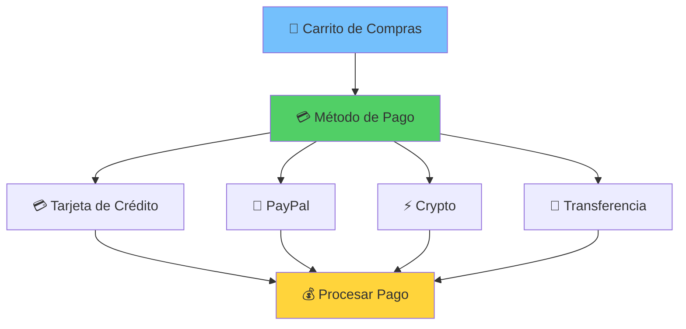
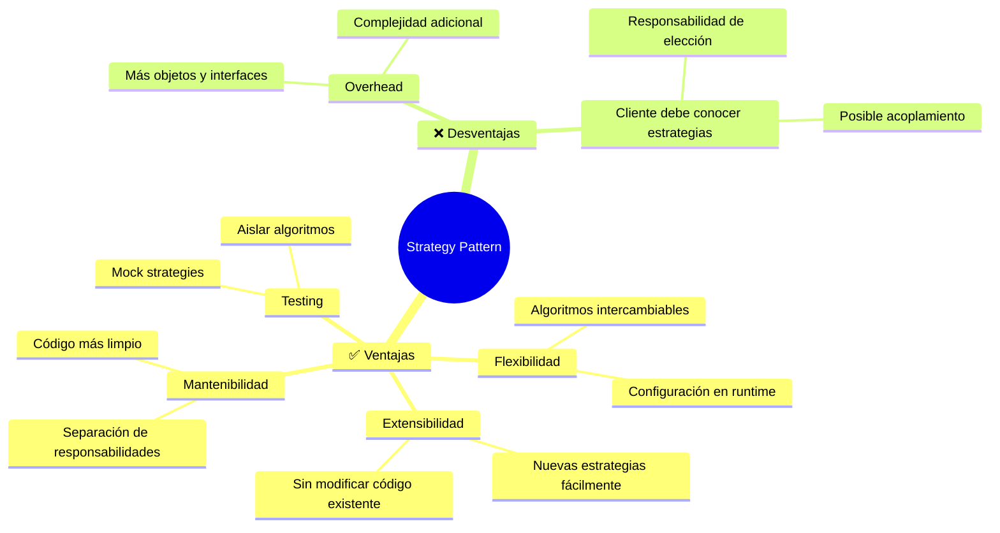
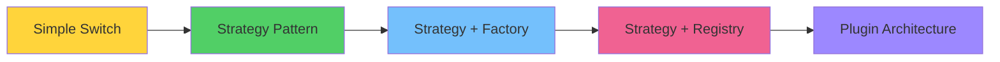

# ⚡ Strategy Pattern
### *"Algoritmos Intercambiables en Runtime"*

> *"Define una familia de algoritmos, encapsula cada uno y los hace intercambiables. Strategy permite que el algoritmo varíe independientemente de los clientes que lo usan"* - Gang of Four

---

## 🎯 **¿Qué es Strategy Pattern?**

El patrón **Strategy** es como tener **múltiples métodos para resolver el mismo problema** y poder elegir cuál usar dinámicamente. Es el patrón favorito de Go por su simplicidad y potencia.

### 💰 **Analogía: Métodos de Pago**



**En la vida real:**
- Tienes un carrito con $100
- Puedes pagar con tarjeta, PayPal, crypto, etc.
- El resultado es el mismo: pago procesado
- Pero cada método tiene su lógica específica

---

## 🔧 **Implementación en Go**

### 📝 **Estructura Básica**

```go
// Strategy interface - lo que todos los algoritmos deben implementar
type PaymentStrategy interface {
    Pay(amount float64) error
    ValidatePayment(amount float64) error
    GetProcessingFee(amount float64) float64
}

// Context - quien usa las estrategias
type ShoppingCart struct {
    items    []Item
    strategy PaymentStrategy
}
```

### 💳 **Estrategias Concretas**

```go
// Concrete Strategies
type CreditCardStrategy struct {
    CardNumber string
    CVV        string
    ExpiryDate string
    Bank       string
}

func (c *CreditCardStrategy) Pay(amount float64) error {
    fmt.Printf("💳 Procesando pago de $%.2f con tarjeta %s\n", amount, c.maskCard())
    fmt.Printf("🏦 Banco: %s\n", c.Bank)
    
    // Simular procesamiento
    time.Sleep(500 * time.Millisecond)
    fmt.Printf("✅ Pago aprobado por el banco\n")
    return nil
}

func (c *CreditCardStrategy) ValidatePayment(amount float64) error {
    if len(c.CardNumber) != 16 {
        return fmt.Errorf("❌ Número de tarjeta inválido")
    }
    if amount > 5000 {
        return fmt.Errorf("❌ Monto excede límite diario ($5,000)")
    }
    return nil
}

func (c *CreditCardStrategy) GetProcessingFee(amount float64) float64 {
    return amount * 0.029 // 2.9% fee
}

func (c *CreditCardStrategy) maskCard() string {
    if len(c.CardNumber) < 4 {
        return c.CardNumber
    }
    return "****-****-****-" + c.CardNumber[len(c.CardNumber)-4:]
}

type PayPalStrategy struct {
    Email    string
    Password string
}

func (p *PayPalStrategy) Pay(amount float64) error {
    fmt.Printf("📱 Procesando pago de $%.2f via PayPal\n", amount)
    fmt.Printf("📧 Email: %s\n", p.Email)
    
    // Simular autenticación
    time.Sleep(300 * time.Millisecond)
    fmt.Printf("🔐 Autenticado con PayPal\n")
    
    // Simular procesamiento
    time.Sleep(200 * time.Millisecond)
    fmt.Printf("✅ Pago completado via PayPal\n")
    return nil
}

func (p *PayPalStrategy) ValidatePayment(amount float64) error {
    if !strings.Contains(p.Email, "@") {
        return fmt.Errorf("❌ Email inválido")
    }
    if amount > 10000 {
        return fmt.Errorf("❌ PayPal limita pagos a $10,000")
    }
    return nil
}

func (p *PayPalStrategy) GetProcessingFee(amount float64) float64 {
    return amount * 0.034 // 3.4% fee
}

type CryptoStrategy struct {
    WalletAddress string
    Currency      string
    Network       string
}

func (cr *CryptoStrategy) Pay(amount float64) error {
    fmt.Printf("⚡ Procesando pago de $%.2f en %s\n", amount, cr.Currency)
    fmt.Printf("🔗 Red: %s\n", cr.Network)
    fmt.Printf("💰 Wallet: %s\n", cr.maskWallet())
    
    // Simular confirmación blockchain
    fmt.Printf("⏳ Esperando confirmación de la blockchain...\n")
    time.Sleep(1 * time.Second)
    fmt.Printf("✅ Transacción confirmada en la blockchain\n")
    return nil
}

func (cr *CryptoStrategy) ValidatePayment(amount float64) error {
    if len(cr.WalletAddress) < 26 {
        return fmt.Errorf("❌ Dirección de wallet inválida")
    }
    if amount < 1 {
        return fmt.Errorf("❌ Monto mínimo para crypto: $1")
    }
    return nil
}

func (cr *CryptoStrategy) GetProcessingFee(amount float64) float64 {
    return 0.01 // Flat $0.01 fee
}

func (cr *CryptoStrategy) maskWallet() string {
    if len(cr.WalletAddress) < 8 {
        return cr.WalletAddress
    }
    return cr.WalletAddress[:6] + "..." + cr.WalletAddress[len(cr.WalletAddress)-6:]
}
```

### 🛒 **Context (Shopping Cart)**

```go
type Item struct {
    Name     string
    Price    float64
    Quantity int
}

type ShoppingCart struct {
    items    []Item
    strategy PaymentStrategy
    discount float64
}

func NewShoppingCart() *ShoppingCart {
    return &ShoppingCart{
        items:    make([]Item, 0),
        discount: 0,
    }
}

func (sc *ShoppingCart) AddItem(item Item) {
    sc.items = append(sc.items, item)
    fmt.Printf("🛒 Agregado: %s x%d ($%.2f c/u)\n", 
        item.Name, item.Quantity, item.Price)
}

func (sc *ShoppingCart) SetPaymentStrategy(strategy PaymentStrategy) {
    sc.strategy = strategy
    fmt.Printf("💡 Método de pago configurado\n")
}

func (sc *ShoppingCart) SetDiscount(percent float64) {
    sc.discount = percent
    fmt.Printf("🎯 Descuento aplicado: %.1f%%\n", percent*100)
}

func (sc *ShoppingCart) GetTotal() float64 {
    total := 0.0
    for _, item := range sc.items {
        total += item.Price * float64(item.Quantity)
    }
    
    // Aplicar descuento
    total = total * (1 - sc.discount)
    return total
}

func (sc *ShoppingCart) Checkout() error {
    if sc.strategy == nil {
        return fmt.Errorf("❌ No se ha seleccionado método de pago")
    }
    
    total := sc.GetTotal()
    processingFee := sc.strategy.GetProcessingFee(total)
    finalAmount := total + processingFee
    
    fmt.Println("\n🧾 === RESUMEN DE COMPRA ===")
    fmt.Printf("📦 Items: %d\n", len(sc.items))
    for _, item := range sc.items {
        fmt.Printf("   • %s x%d: $%.2f\n", 
            item.Name, item.Quantity, item.Price*float64(item.Quantity))
    }
    
    fmt.Printf("💰 Subtotal: $%.2f\n", sc.GetSubtotal())
    if sc.discount > 0 {
        fmt.Printf("🎯 Descuento (%.1f%%): -$%.2f\n", 
            sc.discount*100, sc.GetSubtotal()*sc.discount)
    }
    fmt.Printf("💰 Total: $%.2f\n", total)
    fmt.Printf("🏦 Comisión: $%.2f\n", processingFee)
    fmt.Printf("💸 TOTAL FINAL: $%.2f\n", finalAmount)
    fmt.Println("================================")
    
    // Validar pago
    if err := sc.strategy.ValidatePayment(finalAmount); err != nil {
        return fmt.Errorf("Validación falló: %w", err)
    }
    
    // Procesar pago
    fmt.Printf("\n🔄 Procesando pago...\n")
    if err := sc.strategy.Pay(finalAmount); err != nil {
        return fmt.Errorf("Pago falló: %w", err)
    }
    
    // Limpiar carrito
    sc.items = sc.items[:0]
    fmt.Printf("\n🎉 ¡Compra completada exitosamente!\n")
    return nil
}

func (sc *ShoppingCart) GetSubtotal() float64 {
    total := 0.0
    for _, item := range sc.items {
        total += item.Price * float64(item.Quantity)
    }
    return total
}
```

---

## 🚀 **Ejemplo Completo en Acción**

```go
package main

import (
    "fmt"
    "log"
    "time"
)

func main() {
    fmt.Println("🛍️ === TIENDA ONLINE STRATEGY PATTERN ===")
    fmt.Println()
    
    // Crear carrito
    cart := NewShoppingCart()
    
    // Agregar productos
    cart.AddItem(Item{Name: "Laptop Gaming", Price: 1299.99, Quantity: 1})
    cart.AddItem(Item{Name: "Mouse Gamer", Price: 79.99, Quantity: 2})
    cart.AddItem(Item{Name: "Teclado Mecánico", Price: 149.99, Quantity: 1})
    
    // Aplicar descuento
    cart.SetDiscount(0.10) // 10%
    
    fmt.Println("\n" + "="*50)
    
    // Escenario 1: Pago con Tarjeta de Crédito
    fmt.Println("💳 === ESCENARIO 1: TARJETA DE CRÉDITO ===")
    creditCard := &CreditCardStrategy{
        CardNumber: "1234567890123456",
        CVV:        "123",
        ExpiryDate: "12/25",
        Bank:       "Banco Nacional",
    }
    
    cart.SetPaymentStrategy(creditCard)
    if err := cart.Checkout(); err != nil {
        log.Printf("Error: %v", err)
    }
    
    // Volver a llenar carrito para siguiente demo
    cart.AddItem(Item{Name: "Smartphone", Price: 699.99, Quantity: 1})
    cart.AddItem(Item{Name: "Auriculares", Price: 199.99, Quantity: 1})
    
    fmt.Println("\n" + "="*50)
    
    // Escenario 2: Pago con PayPal
    fmt.Println("📱 === ESCENARIO 2: PAYPAL ===")
    paypal := &PayPalStrategy{
        Email:    "usuario@email.com",
        Password: "password123",
    }
    
    cart.SetPaymentStrategy(paypal)
    if err := cart.Checkout(); err != nil {
        log.Printf("Error: %v", err)
    }
    
    // Volver a llenar carrito
    cart.AddItem(Item{Name: "Monitor 4K", Price: 399.99, Quantity: 1})
    
    fmt.Println("\n" + "="*50)
    
    // Escenario 3: Pago con Crypto
    fmt.Println("⚡ === ESCENARIO 3: CRIPTOMONEDA ===")
    crypto := &CryptoStrategy{
        WalletAddress: "bc1qxy2kgdygjrsqtzq2n0yrf2493p83kkfjhx0wlh",
        Currency:      "Bitcoin",
        Network:       "Lightning Network",
    }
    
    cart.SetPaymentStrategy(crypto)
    if err := cart.Checkout(); err != nil {
        log.Printf("Error: %v", err)
    }
    
    fmt.Println("\n" + "="*50)
    
    // Escenario 4: Cambio dinámico de estrategia
    fmt.Println("🔄 === ESCENARIO 4: CAMBIO DINÁMICO ===")
    cart.AddItem(Item{Name: "Tablet", Price: 299.99, Quantity: 1})
    
    // Cliente cambia de opinión sobre método de pago
    fmt.Println("🤔 Cliente inicialmente quiere pagar con tarjeta...")
    cart.SetPaymentStrategy(creditCard)
    
    fmt.Println("💭 Pero luego decide usar PayPal...")
    cart.SetPaymentStrategy(paypal)
    
    fmt.Println("🧠 Finalmente elige crypto para mayor privacidad...")
    cart.SetPaymentStrategy(crypto)
    
    if err := cart.Checkout(); err != nil {
        log.Printf("Error: %v", err)
    }
    
    // Demo de validación de errores
    fmt.Println("\n" + "="*50)
    fmt.Println("❌ === DEMO: MANEJO DE ERRORES ===")
    
    cart.AddItem(Item{Name: "Producto Caro", Price: 15000, Quantity: 1})
    
    invalidCard := &CreditCardStrategy{
        CardNumber: "123", // Número inválido
        CVV:        "123",
        ExpiryDate: "12/25",
        Bank:       "Banco Test",
    }
    
    cart.SetPaymentStrategy(invalidCard)
    if err := cart.Checkout(); err != nil {
        fmt.Printf("🚨 Error capturado: %v\n", err)
    }
}
```

### 📤 **Output Esperado**

```
🛍️ === TIENDA ONLINE STRATEGY PATTERN ===

🛒 Agregado: Laptop Gaming x1 ($1299.99 c/u)
🛒 Agregado: Mouse Gamer x2 ($79.99 c/u)
🛒 Agregado: Teclado Mecánico x1 ($149.99 c/u)
🎯 Descuento aplicado: 10.0%

==================================================
💳 === ESCENARIO 1: TARJETA DE CRÉDITO ===
💡 Método de pago configurado

🧾 === RESUMEN DE COMPRA ===
📦 Items: 3
   • Laptop Gaming x1: $1299.99
   • Mouse Gamer x2: $159.98
   • Teclado Mecánico x1: $149.99
💰 Subtotal: $1609.96
🎯 Descuento (10.0%): -$160.00
💰 Total: $1449.96
🏦 Comisión: $42.05
💸 TOTAL FINAL: $1491.01
================================

🔄 Procesando pago...
💳 Procesando pago de $1491.01 con tarjeta ****-****-****-3456
🏦 Banco: Banco Nacional
✅ Pago aprobado por el banco

🎉 ¡Compra completada exitosamente!
```

---

## 🎯 **Casos de Uso Reales en Go**

### 1️⃣ **Sort Interface - El Strategy Nativo de Go**

```go
// Go's built-in strategy pattern
type ByAge []Person

func (a ByAge) Len() int           { return len(a) }
func (a ByAge) Swap(i, j int)      { a[i], a[j] = a[j], a[i] }
func (a ByAge) Less(i, j int) bool { return a[i].Age < a[j].Age }

// Uso
people := []Person{{Name: "Alice", Age: 30}, {Name: "Bob", Age: 25}}
sort.Sort(ByAge(people)) // Strategy pattern en acción!
```

### 2️⃣ **HTTP Client Transport**

```go
// Strategy para diferentes transportes
type RoundTripper interface {
    RoundTrip(*Request) (*Response, error)
}

client := &http.Client{
    Transport: &http.Transport{
        TLSClientConfig: &tls.Config{InsecureSkipVerify: true},
    },
}

// O usar un transport personalizado
client.Transport = &CustomTransport{}
```

### 3️⃣ **Database Query Strategies**

```go
type QueryStrategy interface {
    BuildQuery(table string, filters map[string]interface{}) string
}

type MySQLStrategy struct{}
func (m MySQLStrategy) BuildQuery(table string, filters map[string]interface{}) string {
    // MySQL-specific query building
    return fmt.Sprintf("SELECT * FROM `%s` WHERE ...", table)
}

type PostgreSQLStrategy struct{}
func (p PostgreSQLStrategy) BuildQuery(table string, filters map[string]interface{}) string {
    // PostgreSQL-specific query building
    return fmt.Sprintf("SELECT * FROM \"%s\" WHERE ...", table)
}

type QueryBuilder struct {
    strategy QueryStrategy
}

func (qb *QueryBuilder) SetStrategy(strategy QueryStrategy) {
    qb.strategy = strategy
}

func (qb *QueryBuilder) Query(table string, filters map[string]interface{}) string {
    return qb.strategy.BuildQuery(table, filters)
}
```

### 4️⃣ **Compression Strategies**

```go
type CompressionStrategy interface {
    Compress(data []byte) ([]byte, error)
    Decompress(data []byte) ([]byte, error)
    GetRatio() float64
}

type GzipStrategy struct{}
func (g GzipStrategy) Compress(data []byte) ([]byte, error) {
    var buf bytes.Buffer
    writer := gzip.NewWriter(&buf)
    _, err := writer.Write(data)
    writer.Close()
    return buf.Bytes(), err
}

type ZlibStrategy struct{}
func (z ZlibStrategy) Compress(data []byte) ([]byte, error) {
    var buf bytes.Buffer
    writer := zlib.NewWriter(&buf)
    _, err := writer.Write(data)
    writer.Close()
    return buf.Bytes(), err
}

// Archivo compressor que usa estrategias
type FileCompressor struct {
    strategy CompressionStrategy
}

func (fc *FileCompressor) CompressFile(filename string) error {
    data, err := ioutil.ReadFile(filename)
    if err != nil {
        return err
    }
    
    compressed, err := fc.strategy.Compress(data)
    if err != nil {
        return err
    }
    
    return ioutil.WriteFile(filename+".compressed", compressed, 0644)
}

// Uso dinámico
compressor := &FileCompressor{}

// Comprimir con gzip
compressor.strategy = GzipStrategy{}
compressor.CompressFile("document.txt")

// Cambiar a zlib
compressor.strategy = ZlibStrategy{}
compressor.CompressFile("image.jpg")
```

---

## ✅ **Ventajas del Strategy Pattern**

### 🎯 **Principales Beneficios**



### 🚀 **Perfect Use Cases**

- ✅ **Algoritmos múltiples** para el mismo problema
- ✅ **Configuración en runtime** de comportamiento
- ✅ **Testing** con diferentes implementaciones
- ✅ **APIs extensibles** donde users pueden proveer logic
- ✅ **Optimización** cambiando algoritmos según contexto

### ❌ **Cuándo NO Usarlo**

- ❌ Solo tienes **un algoritmo**
- ❌ Los algoritmos **nunca cambiarán**
- ❌ La diferencia entre estrategias es **mínima**
- ❌ El overhead no justifica la flexibilidad

---

## 🧪 **Testing con Strategy Pattern**

```go
// Mock strategy para testing
type MockPaymentStrategy struct {
    PayCalled      bool
    PayAmount      float64
    PayError       error
    ValidateCalled bool
    ValidateError  error
    Fee            float64
}

func (m *MockPaymentStrategy) Pay(amount float64) error {
    m.PayCalled = true
    m.PayAmount = amount
    return m.PayError
}

func (m *MockPaymentStrategy) ValidatePayment(amount float64) error {
    m.ValidateCalled = true
    return m.ValidateError
}

func (m *MockPaymentStrategy) GetProcessingFee(amount float64) float64 {
    return m.Fee
}

// Test
func TestShoppingCartCheckout(t *testing.T) {
    cart := NewShoppingCart()
    cart.AddItem(Item{Name: "Test", Price: 100.0, Quantity: 1})
    
    mockStrategy := &MockPaymentStrategy{Fee: 5.0}
    cart.SetPaymentStrategy(mockStrategy)
    
    err := cart.Checkout()
    
    assert.NoError(t, err)
    assert.True(t, mockStrategy.PayCalled)
    assert.True(t, mockStrategy.ValidateCalled)
    assert.Equal(t, 105.0, mockStrategy.PayAmount) // 100 + 5 fee
}

func TestPaymentValidationError(t *testing.T) {
    cart := NewShoppingCart()
    cart.AddItem(Item{Name: "Test", Price: 100.0, Quantity: 1})
    
    mockStrategy := &MockPaymentStrategy{
        ValidateError: fmt.Errorf("validation failed"),
    }
    cart.SetPaymentStrategy(mockStrategy)
    
    err := cart.Checkout()
    
    assert.Error(t, err)
    assert.Contains(t, err.Error(), "validation failed")
    assert.False(t, mockStrategy.PayCalled) // Pay shouldn't be called
}
```

---

## 🎯 **Strategy vs. Otros Patterns**

| Aspecto          | Strategy                   | State                     | Command                | Template Method        |
| ---------------- | -------------------------- | ------------------------- | ---------------------- | ---------------------- |
| **Propósito**    | Algoritmos intercambiables | Comportamiento por estado | Encapsular operaciones | Esqueleto de algoritmo |
| **Variación**    | Algoritmo completo         | Estado interno            | Comando específico     | Pasos del algoritmo    |
| **Cliente**      | Elige estrategia           | Transparente              | Invoca comando         | Usa template           |
| **Flexibilidad** | Alta                       | Media                     | Alta                   | Baja                   |

### 🔄 **Cuando Evolucionar**



---

## 🏆 **Challenge: ¡Implementa Tu Strategy!**

### 🎯 **Ejercicio: Sistema de Logs**

**Requisitos:**
1. Crear strategies para: Console, File, Database, Remote
2. Cada strategy maneja diferentes log levels
3. Formato configurable por strategy
4. Rotación de logs para FileStrategy
5. Batching para DatabaseStrategy

```go
// Tu código aquí
type LogStrategy interface {
    Log(level LogLevel, message string) error
    Configure(config map[string]interface{}) error
    Close() error
}

type Logger struct {
    strategy LogStrategy
    level    LogLevel
}

// ¿Puedes implementar el resto?
```

### 🏅 **Bonus Points:**
- ✅ Middleware para logs (decorators)
- ✅ Async logging con channels
- ✅ Structured logging (JSON)
- ✅ Performance benchmarks

---

## 📚 **Recursos Adicionales**

### 🔗 **Links Útiles**
- 📖 [Effective Go: Interfaces](https://golang.org/doc/effective_go.html#interfaces)
- 🎥 [Strategy Pattern in Go](https://www.youtube.com/watch?v=strategy)
- 💻 [Real-world Examples](https://github.com/strategy-examples)

### 📝 **Para Profundizar**
- 🔄 **Siguiente**: [Observer Pattern](../observer.md)
- 🎯 **Relacionado**: [State Pattern](../state.md)
- 🧪 **Práctica**: [Strategy Pattern Lab](../../labs/strategy-lab.md)

---

> *"Strategy Pattern es el arte de tener múltiples herramientas para el mismo trabajo y elegir la mejor para cada ocasión"* - Master Strategist 🎯

**¡Tu código nunca más será rígido! ⚡**
