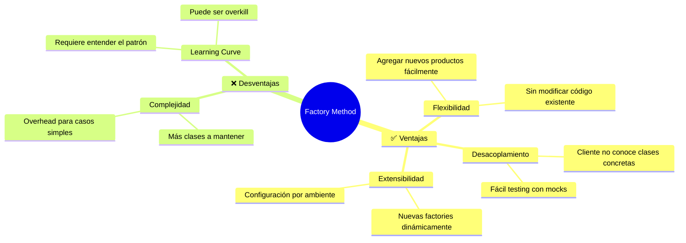
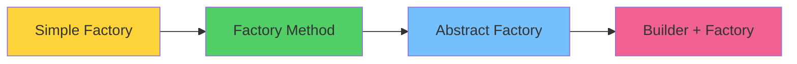

# 🏭 Factory Method Pattern
### *"La Fábrica que Crea Sin Conocer"*

> *"Delega la creación de objetos a subclases, permitiendo que el código cliente use productos sin conocer sus clases concretas"* - Gang of Four

---

## 🎯 **¿Qué es Factory Method?**

El patrón **Factory Method** es como una **fábrica inteligente** que sabe qué producto crear según la demanda, pero no necesita conocer los detalles de cómo se fabrica cada producto específico.

### 🏭 **Analogía: Fábrica de Automóviles**

```mermaid
graph TD
    A[Cliente: "Quiero un auto deportivo"] --> B[Fábrica Auto]
    B --> C{¿Qué tipo?}
    C -->|Deportivo| D[Factory Sports Car]
    C -->|Familiar| E[Factory Family Car]
    C -->|Eléctrico| F[Factory Electric Car]
    
    D --> G[🏎️ Ferrari]
    E --> H[🚗 Toyota]
    F --> I[⚡ Tesla]
    
    style B fill:#74c0fc
    style D fill:#51cf66
    style E fill:#51cf66
    style F fill:#51cf66
```

**En la vida real:**
- Un cliente llega a la fábrica
- Especifica qué tipo de auto quiere
- La fábrica decide qué línea de producción usar
- El cliente recibe su auto sin conocer el proceso

---

## 🔧 **Implementación en Go**

### 📝 **Estructura Básica**

```go
// Product interface - lo que todos los productos deben implementar
type Vehicle interface {
    Start() string
    Stop() string
    GetInfo() string
}

// Creator interface - la fábrica abstracta
type VehicleFactory interface {
    CreateVehicle() Vehicle
}
```

### 🏎️ **Productos Concretos**

```go
// Concrete Products
type SportsCar struct {
    Brand  string
    Model  string
    Engine string
}

func (s SportsCar) Start() string {
    return fmt.Sprintf("🏎️ %s %s RUGIENDO con motor %s!", s.Brand, s.Model, s.Engine)
}

func (s SportsCar) Stop() string {
    return "🛑 Deportivo apagado con estilo"
}

func (s SportsCar) GetInfo() string {
    return fmt.Sprintf("Deportivo: %s %s (%s)", s.Brand, s.Model, s.Engine)
}

type FamilyCar struct {
    Brand    string
    Model    string
    Seats    int
    Safety   string
}

func (f FamilyCar) Start() string {
    return fmt.Sprintf("🚗 %s %s iniciando suavemente (%d asientos)", f.Brand, f.Model, f.Seats)
}

func (f FamilyCar) Stop() string {
    return "🛑 Auto familiar apagado con seguridad"
}

func (f FamilyCar) GetInfo() string {
    return fmt.Sprintf("Familiar: %s %s - %d asientos, %s", f.Brand, f.Model, f.Seats, f.Safety)
}

type ElectricCar struct {
    Brand    string
    Model    string
    Range    int
    Battery  string
}

func (e ElectricCar) Start() string {
    return fmt.Sprintf("⚡ %s %s activado silenciosamente (autonomía: %dkm)", e.Brand, e.Model, e.Range)
}

func (e ElectricCar) Stop() string {
    return "🔋 Auto eléctrico en modo eco"
}

func (e ElectricCar) GetInfo() string {
    return fmt.Sprintf("Eléctrico: %s %s - %dkm autonomía, %s", e.Brand, e.Model, e.Range, e.Battery)
}
```

### 🏭 **Factories Concretas**

```go
// Concrete Factories
type SportsCarFactory struct{}

func (s SportsCarFactory) CreateVehicle() Vehicle {
    return SportsCar{
        Brand:  "Ferrari",
        Model:  "F40",
        Engine: "V8 Twin-Turbo",
    }
}

type FamilyCarFactory struct{}

func (f FamilyCarFactory) CreateVehicle() Vehicle {
    return FamilyCar{
        Brand:  "Toyota",
        Model:  "Prius",
        Seats:  5,
        Safety: "5 estrellas",
    }
}

type ElectricCarFactory struct{}

func (e ElectricCarFactory) CreateVehicle() Vehicle {
    return ElectricCar{
        Brand:   "Tesla",
        Model:   "Model S",
        Range:   500,
        Battery: "100kWh",
    }
}
```

### 🎯 **Cliente (Usuario del patrón)**

```go
// Cliente que usa las factories
type CarDealer struct {
    factories map[string]VehicleFactory
}

func NewCarDealer() *CarDealer {
    return &CarDealer{
        factories: map[string]VehicleFactory{
            "sports":   SportsCarFactory{},
            "family":   FamilyCarFactory{},
            "electric": ElectricCarFactory{},
        },
    }
}

func (cd *CarDealer) OrderCar(carType string) (Vehicle, error) {
    factory, exists := cd.factories[carType]
    if !exists {
        return nil, fmt.Errorf("❌ Tipo de auto '%s' no disponible", carType)
    }
    
    fmt.Printf("🏭 Creando auto tipo '%s'...\n", carType)
    car := factory.CreateVehicle()
    fmt.Printf("✅ %s creado exitosamente!\n", car.GetInfo())
    
    return car, nil
}

func (cd *CarDealer) RegisterFactory(carType string, factory VehicleFactory) {
    cd.factories[carType] = factory
    fmt.Printf("🔧 Factory '%s' registrada\n", carType)
}
```

---

## 🚀 **Ejemplo Completo en Acción**

```go
package main

import (
    "fmt"
    "log"
)

func main() {
    fmt.Println("🏁 === CONCESIONARIO FACTORY METHOD ===")
    fmt.Println()
    
    // Crear concesionario
    dealer := NewCarDealer()
    
    // Simular pedidos de clientes
    customers := []struct {
        name    string
        carType string
    }{
        {"Carlos Racing", "sports"},
        {"María Familia", "family"},
        {"Juan Eco", "electric"},
        {"Pedro Error", "flying"}, // Este fallará
    }
    
    for i, customer := range customers {
        fmt.Printf("👤 Cliente %d: %s\n", i+1, customer.name)
        fmt.Printf("📝 Solicita: Auto tipo '%s'\n", customer.carType)
        
        car, err := dealer.OrderCar(customer.carType)
        if err != nil {
            fmt.Printf("❌ Error: %v\n", err)
        } else {
            // Probar el auto
            fmt.Printf("🔥 %s\n", car.Start())
            fmt.Printf("🛑 %s\n", car.Stop())
        }
        
        fmt.Println("─────────────────────────")
    }
    
    // Agregar nueva factory dinámicamente
    fmt.Println("\n🆕 === AGREGANDO NUEVA FACTORY ===")
    dealer.RegisterFactory("motorcycle", &MotorcycleFactory{})
    
    bike, _ := dealer.OrderCar("motorcycle")
    fmt.Printf("🏍️ %s\n", bike.Start())
}

// Nueva factory agregada dinámicamente
type Motorcycle struct {
    Brand string
    CC    int
}

func (m Motorcycle) Start() string {
    return fmt.Sprintf("🏍️ %s %dcc rugiendo!", m.Brand, m.CC)
}

func (m Motorcycle) Stop() string {
    return "🛑 Moto apagada"
}

func (m Motorcycle) GetInfo() string {
    return fmt.Sprintf("Motocicleta: %s %dcc", m.Brand, m.CC)
}

type MotorcycleFactory struct{}

func (mf *MotorcycleFactory) CreateVehicle() Vehicle {
    return Motorcycle{
        Brand: "Yamaha",
        CC:    1000,
    }
}
```

### 📤 **Output Esperado**

```
🏁 === CONCESIONARIO FACTORY METHOD ===

👤 Cliente 1: Carlos Racing
📝 Solicita: Auto tipo 'sports'
🏭 Creando auto tipo 'sports'...
✅ Deportivo: Ferrari F40 (V8 Twin-Turbo) creado exitosamente!
🔥 🏎️ Ferrari F40 RUGIENDO con motor V8 Twin-Turbo!
🛑 Deportivo apagado con estilo
─────────────────────────

👤 Cliente 2: María Familia
📝 Solicita: Auto tipo 'family'
🏭 Creando auto tipo 'family'...
✅ Familiar: Toyota Prius - 5 asientos, 5 estrellas creado exitosamente!
🔥 🚗 Toyota Prius iniciando suavemente (5 asientos)
🛑 Auto familiar apagado con seguridad
─────────────────────────

👤 Cliente 3: Juan Eco
📝 Solicita: Auto tipo 'electric'
🏭 Creando auto tipo 'electric'...
✅ Eléctrico: Tesla Model S - 500km autonomía, 100kWh creado exitosamente!
🔥 ⚡ Tesla Model S activado silenciosamente (autonomía: 500km)
🔋 Auto eléctrico en modo eco
─────────────────────────

👤 Cliente 4: Pedro Error
📝 Solicita: Auto tipo 'flying'
❌ Error: Tipo de auto 'flying' no disponible
─────────────────────────

🆕 === AGREGANDO NUEVA FACTORY ===
🔧 Factory 'motorcycle' registrada
🏭 Creando auto tipo 'motorcycle'...
✅ Motocicleta: Yamaha 1000cc creado exitosamente!
🏍️ 🏍️ Yamaha 1000cc rugiendo!
```

---

## 🎯 **Casos de Uso Reales en Go**

### 1️⃣ **Database Drivers**

```go
// Como lo usa Go internamente
type Driver interface {
    Open(name string) (Conn, error)
}

// Registrar drivers
sql.Register("postgres", &postgres.Driver{})
sql.Register("mysql", &mysql.Driver{})

// Factory method en acción
db, err := sql.Open("postgres", connectionString)
```

### 2️⃣ **HTTP Handlers**

```go
type HandlerFactory interface {
    CreateHandler() http.Handler
}

type JSONHandlerFactory struct{}
func (j JSONHandlerFactory) CreateHandler() http.Handler {
    return http.HandlerFunc(func(w http.ResponseWriter, r *http.Request) {
        w.Header().Set("Content-Type", "application/json")
        json.NewEncoder(w).Encode(map[string]string{"message": "Hello JSON"})
    })
}

type XMLHandlerFactory struct{}
func (x XMLHandlerFactory) CreateHandler() http.Handler {
    return http.HandlerFunc(func(w http.ResponseWriter, r *http.Request) {
        w.Header().Set("Content-Type", "application/xml")
        w.Write([]byte(`<?xml version="1.0"?><message>Hello XML</message>`))
    })
}
```

### 3️⃣ **Logger Factory**

```go
type LoggerFactory interface {
    CreateLogger() Logger
}

type DevLoggerFactory struct{}
func (d DevLoggerFactory) CreateLogger() Logger {
    return &DevLogger{level: "DEBUG", colorful: true}
}

type ProdLoggerFactory struct{}
func (p ProdLoggerFactory) CreateLogger() Logger {
    return &ProdLogger{level: "INFO", structured: true}
}

// Uso
func NewApp(env string) *App {
    var factory LoggerFactory
    switch env {
    case "development":
        factory = DevLoggerFactory{}
    case "production":
        factory = ProdLoggerFactory{}
    }
    
    return &App{
        logger: factory.CreateLogger(),
    }
}
```

---

## ✅ **Ventajas del Factory Method**

### 🎯 **Principales Beneficios**



### 🚀 **Casos Perfectos para Factory Method**

- ✅ **Múltiples implementaciones** de una interfaz
- ✅ **Configuración por ambiente** (dev, staging, prod)
- ✅ **Plugins dinámicos** que se cargan en runtime
- ✅ **Testing** con mocks y stubs
- ✅ **APIs extensibles** donde otros pueden añadir implementaciones

### ❌ **Cuándo NO Usarlo**

- ❌ Solo tienes **una implementación**
- ❌ La lógica de creación es **muy simple**
- ❌ No necesitas **extensibilidad**
- ❌ El overhead no justifica el beneficio

---

## 🧪 **Testing con Factory Method**

```go
// Mock factory para testing
type MockCarFactory struct {
    CreatedCars []Vehicle
}

func (m *MockCarFactory) CreateVehicle() Vehicle {
    car := MockCar{ID: len(m.CreatedCars) + 1}
    m.CreatedCars = append(m.CreatedCars, car)
    return car
}

type MockCar struct {
    ID int
}

func (m MockCar) Start() string { return fmt.Sprintf("Mock car %d started", m.ID) }
func (m MockCar) Stop() string { return fmt.Sprintf("Mock car %d stopped", m.ID) }
func (m MockCar) GetInfo() string { return fmt.Sprintf("Mock Car #%d", m.ID) }

// Test
func TestCarDealer(t *testing.T) {
    dealer := NewCarDealer()
    mockFactory := &MockCarFactory{}
    dealer.RegisterFactory("mock", mockFactory)
    
    // Test creation
    car, err := dealer.OrderCar("mock")
    assert.NoError(t, err)
    assert.Equal(t, "Mock Car #1", car.GetInfo())
    
    // Verify mock was called
    assert.Len(t, mockFactory.CreatedCars, 1)
}
```

---

## 🎯 **Comparación con Otros Patterns**

| Aspecto          | Factory Method           | Abstract Factory   | Builder               |
| ---------------- | ------------------------ | ------------------ | --------------------- |
| **Propósito**    | Una familia de productos | Múltiples familias | Construcción compleja |
| **Complejidad**  | Baja                     | Media              | Media                 |
| **Flexibilidad** | Alta                     | Muy Alta           | Alta                  |
| **Uso típico**   | Drivers, Plugins         | UI Frameworks      | Config Objects        |

### 🔄 **Evolution Path**



---

## 🏆 **Challenge: ¡Implementa Tu Factory!**

### 🎯 **Ejercicio: Sistema de Notificaciones**

**Requisitos:**
1. Crear factory para diferentes tipos de notificaciones
2. Implementar: Email, SMS, Push, Slack
3. Cada notificación debe tener métodos: Send(), Validate(), GetCost()
4. Permitir registro dinámico de nuevos tipos

```go
// Tu código aquí
type Notification interface {
    Send(message string) error
    Validate() bool
    GetCost() float64
}

type NotificationFactory interface {
    CreateNotification() Notification
}

// ¿Puedes implementar el resto?
```

### 🏅 **Bonus Points:**
- ✅ Configuración desde archivo JSON
- ✅ Rate limiting por tipo de notificación
- ✅ Tests comprehensivos
- ✅ Metrics y logging

---

## 📚 **Recursos Adicionales**

### 🔗 **Links Útiles**
- 📖 [Go by Example: Interfaces](https://gobyexample.com/interfaces)
- 🎥 [Factory Pattern Video Tutorial](https://www.youtube.com/watch?v=factory)
- 💻 [GitHub Examples](https://github.com/tmrts/go-patterns)

### 📝 **Para Profundizar**
- 🏗️ **Siguiente**: [Abstract Factory Pattern](../abstract-factory.md)
- 🔄 **Relacionado**: [Builder Pattern](../builder.md)
- 🎯 **Práctica**: [Design Patterns Quiz](../../quiz/factory-method.md)

---

> *"Factory Method es el patrón que convierte tu código en una fábrica inteligente: sabe qué crear, pero no cómo hacerlo"* - Gopher Factory 🏭

**¡Tu código nunca volverá a ser rígido! 🚀**
