# ⚙️ Functional Options Pattern
### *"La Elegancia de la Configuración en Go"*

> *"El patrón Functional Options convierte la configuración compleja en una experiencia fluida y elegante, aprovechando las funciones como ciudadanos de primera clase en Go"* - Rob Pike

---

## 🎯 **¿Qué es Functional Options?**

El patrón **Functional Options** es una técnica idiomática de Go que usa **funciones para configurar objetos** de manera elegante, flexible y extensible. Es la respuesta de Go a los constructores sobrecargados de otros lenguajes.

### 🎛️ **Analogía: Panel de Control de Auto**

```mermaid
graph TD
    A[🚗 Nuevo Auto] --> B[⚙️ Configuración]
    B --> C[🎨 Color]
    B --> D[🔧 Motor]
    B --> E[🎵 Sound System]
    B --> F[❄️ AC]
    B --> G[🔒 Security]
    
    C -->|Opcional| H[🚗 Auto Configurado]
    D -->|Opcional| H
    E -->|Opcional| H
    F -->|Opcional| H
    G -->|Opcional| H
    
    style A fill:#74c0fc
    style B fill:#51cf66
    style H fill:#ffd43b
```



**En la vida real:**
- Base del auto viene con configuración estándar
- Cada opción es **independiente** y **opcional**
- Puedes elegir **cualquier combinación**
- El orden no importa
- Fácil agregar nuevas opciones

---

## 🔧 **Implementación en Go**

### 📝 **Estructura Básica**

```go
// Tipo de función de opción
type Option func(*Config)

// Estructura que se configura
type Config struct {
    // campos con valores por defecto
}

// Constructor con options
func NewService(options ...Option) *Service {
    config := &Config{
        // valores por defecto
    }
    
    // Aplicar todas las opciones
    for _, option := range options {
        option(config)
    }
    
    return &Service{config: config}
}

// Funciones de opción
func WithSomeOption(value string) Option {
    return func(c *Config) {
        c.SomeField = value
    }
}
```

### 🌐 **Ejemplo Completo: HTTP Client**

```go
package main

import (
    "crypto/tls"
    "fmt"
    "net/http"
    "time"
)

// HTTPClient estructura principal
type HTTPClient struct {
    client    *http.Client
    baseURL   string
    headers   map[string]string
    retries   int
    timeout   time.Duration
    userAgent string
    debug     bool
}

// Option define el tipo de función de configuración
type Option func(*HTTPClient)

// NewHTTPClient crea un nuevo cliente con opciones
func NewHTTPClient(baseURL string, options ...Option) *HTTPClient {
    // Configuración por defecto
    client := &HTTPClient{
        client: &http.Client{
            Timeout: 30 * time.Second,
            Transport: &http.Transport{
                MaxIdleConns:        10,
                IdleConnTimeout:     30 * time.Second,
                DisableCompression:  false,
            },
        },
        baseURL:   baseURL,
        headers:   make(map[string]string),
        retries:   3,
        timeout:   30 * time.Second,
        userAgent: "Go-HTTP-Client/1.0",
        debug:     false,
    }
    
    // Aplicar todas las opciones
    for _, option := range options {
        option(client)
    }
    
    // Actualizar timeout en el cliente interno
    client.client.Timeout = client.timeout
    
    if client.debug {
        fmt.Printf("🔧 HTTPClient creado: %s (timeout: %v, retries: %d)\n", 
            client.baseURL, client.timeout, client.retries)
    }
    
    return client
}

// ===== FUNCIONES DE CONFIGURACIÓN =====

// WithTimeout configura el timeout
func WithTimeout(timeout time.Duration) Option {
    return func(c *HTTPClient) {
        c.timeout = timeout
        if c.debug {
            fmt.Printf("⏰ Timeout configurado: %v\n", timeout)
        }
    }
}

// WithRetries configura el número de reintentos
func WithRetries(retries int) Option {
    return func(c *HTTPClient) {
        c.retries = retries
        if c.debug {
            fmt.Printf("🔄 Reintentos configurados: %d\n", retries)
        }
    }
}

// WithUserAgent configura el User-Agent
func WithUserAgent(userAgent string) Option {
    return func(c *HTTPClient) {
        c.userAgent = userAgent
        if c.debug {
            fmt.Printf("🕷️ User-Agent configurado: %s\n", userAgent)
        }
    }
}

// WithHeader añade un header personalizado
func WithHeader(key, value string) Option {
    return func(c *HTTPClient) {
        c.headers[key] = value
        if c.debug {
            fmt.Printf("📋 Header añadido: %s = %s\n", key, value)
        }
    }
}

// WithHeaders añade múltiples headers
func WithHeaders(headers map[string]string) Option {
    return func(c *HTTPClient) {
        for key, value := range headers {
            c.headers[key] = value
        }
        if c.debug {
            fmt.Printf("📋 %d headers añadidos\n", len(headers))
        }
    }
}

// WithDebug activa el modo debug
func WithDebug(debug bool) Option {
    return func(c *HTTPClient) {
        c.debug = debug
        if debug {
            fmt.Printf("🐛 Modo debug activado\n")
        }
    }
}

// WithInsecureSkipVerify desactiva verificación SSL
func WithInsecureSkipVerify() Option {
    return func(c *HTTPClient) {
        transport := c.client.Transport.(*http.Transport)
        if transport.TLSClientConfig == nil {
            transport.TLSClientConfig = &tls.Config{}
        }
        transport.TLSClientConfig.InsecureSkipVerify = true
        
        if c.debug {
            fmt.Printf("🔓 Verificación SSL desactivada\n")
        }
    }
}

// WithProxyURL configura un proxy
func WithProxyURL(proxyURL string) Option {
    return func(c *HTTPClient) {
        // Implementación de proxy...
        if c.debug {
            fmt.Printf("🔄 Proxy configurado: %s\n", proxyURL)
        }
    }
}

// WithBasicAuth configura autenticación básica
func WithBasicAuth(username, password string) Option {
    return func(c *HTTPClient) {
        // Crear header de autenticación
        auth := username + ":" + password
        // En producción, usar base64.StdEncoding.EncodeToString
        c.headers["Authorization"] = "Basic " + auth
        
        if c.debug {
            fmt.Printf("🔐 Autenticación básica configurada para: %s\n", username)
        }
    }
}

// WithBearerToken configura token bearer
func WithBearerToken(token string) Option {
    return func(c *HTTPClient) {
        c.headers["Authorization"] = "Bearer " + token
        
        if c.debug {
            maskedToken := token
            if len(token) > 8 {
                maskedToken = token[:4] + "****" + token[len(token)-4:]
            }
            fmt.Printf("🎫 Bearer token configurado: %s\n", maskedToken)
        }
    }
}

// WithConnectionPooling configura el pool de conexiones
func WithConnectionPooling(maxIdle, maxIdlePerHost int, idleTimeout time.Duration) Option {
    return func(c *HTTPClient) {
        transport := c.client.Transport.(*http.Transport)
        transport.MaxIdleConns = maxIdle
        transport.MaxIdleConnsPerHost = maxIdlePerHost
        transport.IdleConnTimeout = idleTimeout
        
        if c.debug {
            fmt.Printf("🏊 Pool de conexiones: max=%d, maxPerHost=%d, timeout=%v\n", 
                maxIdle, maxIdlePerHost, idleTimeout)
        }
    }
}

// ===== MÉTODOS DEL CLIENTE =====

func (c *HTTPClient) Get(endpoint string) (*http.Response, error) {
    req, err := http.NewRequest("GET", c.baseURL+endpoint, nil)
    if err != nil {
        return nil, err
    }
    
    // Añadir headers personalizados
    for key, value := range c.headers {
        req.Header.Set(key, value)
    }
    
    // Añadir User-Agent
    req.Header.Set("User-Agent", c.userAgent)
    
    if c.debug {
        fmt.Printf("🌐 GET %s%s\n", c.baseURL, endpoint)
        for key, value := range c.headers {
            fmt.Printf("   %s: %s\n", key, value)
        }
    }
    
    return c.client.Do(req)
}

func (c *HTTPClient) GetConfig() map[string]interface{} {
    return map[string]interface{}{
        "baseURL":   c.baseURL,
        "timeout":   c.timeout,
        "retries":   c.retries,
        "userAgent": c.userAgent,
        "headers":   c.headers,
        "debug":     c.debug,
    }
}
```

### 🎨 **Patrón Builder vs Functional Options**

```go
// ❌ Traditional Builder Pattern (verbose)
type ClientBuilder struct {
    timeout   time.Duration
    retries   int
    userAgent string
    headers   map[string]string
}

func NewClientBuilder() *ClientBuilder {
    return &ClientBuilder{
        timeout:   30 * time.Second,
        retries:   3,
        userAgent: "Default",
        headers:   make(map[string]string),
    }
}

func (b *ClientBuilder) SetTimeout(timeout time.Duration) *ClientBuilder {
    b.timeout = timeout
    return b
}

func (b *ClientBuilder) SetRetries(retries int) *ClientBuilder {
    b.retries = retries
    return b
}

func (b *ClientBuilder) Build() *HTTPClient {
    // crear cliente...
    return nil
}

// Uso verboso del builder
client := NewClientBuilder().
    SetTimeout(10 * time.Second).
    SetRetries(5).
    SetUserAgent("MyApp/1.0").
    Build()

// ✅ Functional Options (elegante)
client := NewHTTPClient("https://api.example.com",
    WithTimeout(10*time.Second),
    WithRetries(5),
    WithUserAgent("MyApp/1.0"),
)
```

---

## 🚀 **Ejemplo Completo en Acción**

```go
package main

import (
    "fmt"
    "time"
)

func main() {
    fmt.Println("⚙️ === FUNCTIONAL OPTIONS PATTERN ===")
    fmt.Println()
    
    // Escenario 1: Cliente básico (solo defaults)
    fmt.Println("🔧 === CLIENTE BÁSICO ===")
    basicClient := NewHTTPClient("https://jsonplaceholder.typicode.com")
    
    fmt.Println("Configuración básica:")
    config := basicClient.GetConfig()
    for key, value := range config {
        fmt.Printf("  %s: %v\n", key, value)
    }
    
    fmt.Println("\n" + "="*50)
    
    // Escenario 2: Cliente con debug para ver la configuración
    fmt.Println("🐛 === CLIENTE CON DEBUG ===")
    debugClient := NewHTTPClient("https://api.github.com",
        WithDebug(true),
        WithTimeout(15*time.Second),
        WithUserAgent("GitHub-Explorer/1.0"),
    )
    
    fmt.Println("\n" + "="*50)
    
    // Escenario 3: Cliente completo para API empresarial
    fmt.Println("🏢 === CLIENTE EMPRESARIAL ===")
    enterpriseClient := NewHTTPClient("https://api.enterprise.com",
        WithDebug(true),
        WithTimeout(60*time.Second),
        WithRetries(5),
        WithUserAgent("EnterpriseApp/2.0"),
        WithHeader("X-API-Version", "v2"),
        WithHeader("X-Client-ID", "12345"),
        WithBearerToken("eyJhbGciOiJIUzI1NiIsInR5cCI6IkpXVCJ9..."),
        WithConnectionPooling(20, 10, 90*time.Second),
    )
    
    fmt.Println("\n" + "="*50)
    
    // Escenario 4: Cliente para testing (insecure)
    fmt.Println("🧪 === CLIENTE DE TESTING ===")
    testClient := NewHTTPClient("https://localhost:8080",
        WithDebug(true),
        WithTimeout(5*time.Second),
        WithRetries(1),
        WithUserAgent("TestRunner/1.0"),
        WithInsecureSkipVerify(),
        WithBasicAuth("testuser", "testpass"),
        WithHeaders(map[string]string{
            "X-Test-Mode":  "true",
            "X-Test-Suite": "integration",
        }),
    )
    
    fmt.Println("\n" + "="*50)
    
    // Escenario 5: Configuración dinámica
    fmt.Println("🔄 === CONFIGURACIÓN DINÁMICA ===")
    
    // Lista de opciones que se pueden aplicar dinámicamente
    var options []Option
    
    // Configuración base
    options = append(options, WithDebug(true))
    options = append(options, WithTimeout(30*time.Second))
    
    // Agregar autenticación si está disponible
    token := getAuthToken() // función imaginaria
    if token != "" {
        options = append(options, WithBearerToken(token))
    }
    
    // Configuración específica del ambiente
    environment := getEnvironment() // función imaginaria
    switch environment {
    case "development":
        options = append(options,
            WithInsecureSkipVerify(),
            WithRetries(1),
            WithUserAgent("DevApp/1.0"),
        )
    case "staging":
        options = append(options,
            WithRetries(3),
            WithUserAgent("StagingApp/1.0"),
        )
    case "production":
        options = append(options,
            WithRetries(5),
            WithUserAgent("ProdApp/1.0"),
            WithConnectionPooling(50, 20, 120*time.Second),
        )
    }
    
    dynamicClient := NewHTTPClient("https://api.example.com", options...)
    
    fmt.Println("\n" + "="*50)
    
    // Escenario 6: Composición de opciones
    fmt.Println("🧩 === COMPOSICIÓN DE OPCIONES ===")
    
    // Función que retorna múltiples opciones relacionadas
    getAPIKeyAuth := func(apiKey string) []Option {
        return []Option{
            WithHeader("X-API-Key", apiKey),
            WithHeader("X-API-Version", "v1"),
            WithUserAgent("APIClient/1.0"),
        }
    }
    
    getProductionConfig := func() []Option {
        return []Option{
            WithTimeout(45 * time.Second),
            WithRetries(3),
            WithConnectionPooling(30, 15, 60*time.Second),
        }
    }
    
    // Combinar múltiples grupos de opciones
    var allOptions []Option
    allOptions = append(allOptions, WithDebug(true))
    allOptions = append(allOptions, getAPIKeyAuth("secret-api-key-123")...)
    allOptions = append(allOptions, getProductionConfig()...)
    
    composedClient := NewHTTPClient("https://api.production.com", allOptions...)
    
    fmt.Println("\n🎯 === DEMO DE USO ===")
    
    // Simular algunas llamadas
    fmt.Println("📞 Realizando llamadas de prueba...")
    
    clients := []*HTTPClient{basicClient, debugClient, enterpriseClient}
    endpoints := []string{"/users/1", "/posts/1", "/comments/1"}
    
    for i, client := range clients {
        fmt.Printf("\n🔍 Cliente %d:\n", i+1)
        for _, endpoint := range endpoints {
            // En un caso real, manejaríamos la respuesta
            _, err := client.Get(endpoint)
            if err != nil {
                fmt.Printf("❌ Error en %s: %v\n", endpoint, err)
            } else {
                fmt.Printf("✅ %s: OK\n", endpoint)
            }
            time.Sleep(100 * time.Millisecond)
        }
    }
    
    fmt.Println("\n🎉 === DEMO COMPLETADO ===")
}

// Funciones auxiliares para el demo
func getAuthToken() string {
    // Simular obtención de token
    return "eyJhbGciOiJIUzI1NiIsInR5cCI6IkpXVCJ9.example.token"
}

func getEnvironment() string {
    // Simular detección de ambiente
    envs := []string{"development", "staging", "production"}
    return envs[time.Now().Second()%3] // Aleatorio para demo
}
```

### 📤 **Output Esperado**

```
⚙️ === FUNCTIONAL OPTIONS PATTERN ===

🔧 === CLIENTE BÁSICO ===
Configuración básica:
  baseURL: https://jsonplaceholder.typicode.com
  timeout: 30s
  retries: 3
  userAgent: Go-HTTP-Client/1.0
  headers: map[]
  debug: false

==================================================
🐛 === CLIENTE CON DEBUG ===
🐛 Modo debug activado
⏰ Timeout configurado: 15s
🕷️ User-Agent configurado: GitHub-Explorer/1.0
🔧 HTTPClient creado: https://api.github.com (timeout: 15s, retries: 3)

==================================================
🏢 === CLIENTE EMPRESARIAL ===
🐛 Modo debug activado
⏰ Timeout configurado: 1m0s
🔄 Reintentos configurados: 5
🕷️ User-Agent configurado: EnterpriseApp/2.0
📋 Header añadido: X-API-Version = v2
📋 Header añadido: X-Client-ID = 12345
🎫 Bearer token configurado: eyJh****J9...
🏊 Pool de conexiones: max=20, maxPerHost=10, timeout=1m30s
🔧 HTTPClient creado: https://api.enterprise.com (timeout: 1m0s, retries: 5)

==================================================
🧪 === CLIENTE DE TESTING ===
🐛 Modo debug activado
⏰ Timeout configurado: 5s
🔄 Reintentos configurados: 1
🕷️ User-Agent configurado: TestRunner/1.0
🔓 Verificación SSL desactivada
🔐 Autenticación básica configurada para: testuser
📋 2 headers añadidos
🔧 HTTPClient creado: https://localhost:8080 (timeout: 5s, retries: 1)
```

---

## 🎯 **Casos de Uso Reales en Go**

### 1️⃣ **gRPC Dial Options**

```go
// Ejemplo real de gRPC
conn, err := grpc.Dial("localhost:8080",
    grpc.WithTransportCredentials(insecure.NewCredentials()),
    grpc.WithBlock(),
    grpc.WithTimeout(5*time.Second),
    grpc.WithUnaryInterceptor(clientInterceptor),
)
```

### 2️⃣ **HTTP Server Options**

```go
type ServerOption func(*Server)

func WithPort(port int) ServerOption {
    return func(s *Server) {
        s.port = port
    }
}

func WithTLS(certFile, keyFile string) ServerOption {
    return func(s *Server) {
        s.tlsCertFile = certFile
        s.tlsKeyFile = keyFile
        s.tlsEnabled = true
    }
}

func WithMiddleware(middleware ...func(http.Handler) http.Handler) ServerOption {
    return func(s *Server) {
        s.middlewares = append(s.middlewares, middleware...)
    }
}

// Uso
server := NewServer(
    WithPort(8443),
    WithTLS("cert.pem", "key.pem"),
    WithMiddleware(
        loggingMiddleware,
        authMiddleware,
        corsMiddleware,
    ),
)
```

### 3️⃣ **Database Connection Options**

```go
type DBOption func(*DBConfig)

func WithMaxConnections(max int) DBOption {
    return func(c *DBConfig) {
        c.MaxConnections = max
    }
}

func WithSSL(sslMode string) DBOption {
    return func(c *DBConfig) {
        c.SSLMode = sslMode
    }
}

func WithConnectionLifetime(lifetime time.Duration) DBOption {
    return func(c *DBConfig) {
        c.ConnMaxLifetime = lifetime
    }
}

func NewDB(dsn string, options ...DBOption) (*Database, error) {
    config := &DBConfig{
        MaxConnections:     10,
        ConnMaxLifetime:    time.Hour,
        SSLMode:           "prefer",
        ConnectionTimeout: 30 * time.Second,
    }
    
    for _, option := range options {
        option(config)
    }
    
    return connectWithConfig(dsn, config)
}

// Uso
db, err := NewDB("postgres://...",
    WithMaxConnections(50),
    WithSSL("require"),
    WithConnectionLifetime(30*time.Minute),
)
```

### 4️⃣ **Logger Configuration**

```go
type LoggerOption func(*Logger)

func WithLevel(level LogLevel) LoggerOption {
    return func(l *Logger) {
        l.level = level
    }
}

func WithFormat(format string) LoggerOption {
    return func(l *Logger) {
        l.format = format
    }
}

func WithOutput(writer io.Writer) LoggerOption {
    return func(l *Logger) {
        l.output = writer
    }
}

func WithFields(fields map[string]interface{}) LoggerOption {
    return func(l *Logger) {
        for k, v := range fields {
            l.defaultFields[k] = v
        }
    }
}

// Uso
logger := NewLogger(
    WithLevel(DEBUG),
    WithFormat("json"),
    WithOutput(os.Stdout),
    WithFields(map[string]interface{}{
        "service": "user-api",
        "version": "1.2.3",
    }),
)
```

---

## ✅ **Ventajas del Functional Options**

### 🎯 **Principales Beneficios**

```mermaid
mindmap
  root((Functional Options))
    ✅ Ventajas
      API Limpia
        Fácil de leer y usar
        Self-documenting
        Orden no importa
      Extensibilidad
        Nuevas opciones fácilmente
        Sin breaking changes
        Backwards compatible
      Flexibilidad
        Cualquier combinación
        Defaults inteligentes
        Configuración dinámica
      Type Safety
        Compile-time checking
        No runtime errors
        IDE autocomplete
    ❌ Desventajas
      Overhead
        Más allocations
        Función calls adicionales
      Complejidad inicial
        Más código de setup
        Learning curve
      Memory
        Closure captures
        Potential leaks
```



### 🚀 **Perfect Use Cases**

- ✅ **APIs con muchas opciones** de configuración
- ✅ **Constructores complejos** con defaults
- ✅ **Bibliotecas públicas** que necesitan extensibilidad
- ✅ **Configuración condicional** basada en ambiente
- ✅ **Builder pattern alternativo** más Go-idiomático

### ❌ **Cuándo NO Usarlo**

- ❌ **Configuración simple** con pocos campos
- ❌ **Performance crítica** (demasiado overhead)
- ❌ **APIs internas** simples
- ❌ **Configuración que cambia frecuentemente**

---

## 🧪 **Testing con Functional Options**

```go
func TestHTTPClientOptions(t *testing.T) {
    tests := []struct {
        name     string
        options  []Option
        expected map[string]interface{}
    }{
        {
            name:    "default configuration",
            options: []Option{},
            expected: map[string]interface{}{
                "timeout":   30 * time.Second,
                "retries":   3,
                "userAgent": "Go-HTTP-Client/1.0",
            },
        },
        {
            name: "custom timeout",
            options: []Option{
                WithTimeout(10 * time.Second),
            },
            expected: map[string]interface{}{
                "timeout": 10 * time.Second,
            },
        },
        {
            name: "multiple options",
            options: []Option{
                WithTimeout(15 * time.Second),
                WithRetries(5),
                WithUserAgent("TestAgent/1.0"),
            },
            expected: map[string]interface{}{
                "timeout":   15 * time.Second,
                "retries":   5,
                "userAgent": "TestAgent/1.0",
            },
        },
    }
    
    for _, tt := range tests {
        t.Run(tt.name, func(t *testing.T) {
            client := NewHTTPClient("https://test.com", tt.options...)
            config := client.GetConfig()
            
            for key, expectedValue := range tt.expected {
                actualValue, exists := config[key]
                assert.True(t, exists, "Config key %s should exist", key)
                assert.Equal(t, expectedValue, actualValue, 
                    "Config %s should match expected value", key)
            }
        })
    }
}

func TestOptionComposition(t *testing.T) {
    // Test que las opciones se pueden componer
    baseOptions := []Option{
        WithTimeout(10 * time.Second),
        WithRetries(3),
    }
    
    authOptions := []Option{
        WithBearerToken("test-token"),
        WithUserAgent("TestApp/1.0"),
    }
    
    var allOptions []Option
    allOptions = append(allOptions, baseOptions...)
    allOptions = append(allOptions, authOptions...)
    
    client := NewHTTPClient("https://test.com", allOptions...)
    config := client.GetConfig()
    
    assert.Equal(t, 10*time.Second, config["timeout"])
    assert.Equal(t, 3, config["retries"])
    assert.Equal(t, "TestApp/1.0", config["userAgent"])
    
    headers := config["headers"].(map[string]string)
    assert.Equal(t, "Bearer test-token", headers["Authorization"])
}

func BenchmarkFunctionalOptions(b *testing.B) {
    options := []Option{
        WithTimeout(10 * time.Second),
        WithRetries(5),
        WithUserAgent("BenchmarkApp/1.0"),
        WithHeader("X-Test", "benchmark"),
    }
    
    b.ResetTimer()
    for i := 0; i < b.N; i++ {
        _ = NewHTTPClient("https://test.com", options...)
    }
}
```

---

## 🎯 **Functional Options vs. Otros Patterns**

| Aspecto            | Functional Options | Builder   | Config Struct | Method Chaining |
| ------------------ | ------------------ | --------- | ------------- | --------------- |
| **Legibilidad**    | Excelente          | Buena     | Media         | Buena           |
| **Extensibilidad** | Excelente          | Media     | Baja          | Media           |
| **Performance**    | Media              | Alta      | Alta          | Media           |
| **Type Safety**    | Excelente          | Excelente | Media         | Excelente       |
| **Go Idiomático**  | Sí                 | No        | Sí            | No              |

### 🔄 **Evolution Path**


---

## 🏆 **Challenge: ¡Implementa Tu Functional Options!**

### 🎯 **Ejercicio: Sistema de Cache**

**Requisitos:**
1. Cache con múltiples backends (memory, redis, file)
2. Configuración de TTL, size limits, eviction policies
3. Serialization options (JSON, GOB, MessagePack)
4. Monitoring y metrics opcionales
5. Clustering y replication

```go
// Tu código aquí
type CacheOption func(*Cache)

type Cache struct {
    backend     Backend
    ttl         time.Duration
    maxSize     int64
    serializer  Serializer
    metrics     MetricsCollector
    // ¿Qué más necesitas?
}

func NewCache(options ...CacheOption) *Cache {
    // Implementa la configuración
    // ¿Puedes hacerlo extensible y elegante?
}

// Opciones a implementar:
// WithRedisBackend, WithMemoryBackend, WithFileBackend
// WithTTL, WithMaxSize, WithEvictionPolicy
// WithJSONSerializer, WithGOBSerializer
// WithMetrics, WithCompression
// WithEncryption, WithClustering
```

### 🏅 **Bonus Points:**
- ✅ Validación de opciones incompatibles
- ✅ Option groups por funcionalidad
- ✅ Configuration builder helpers
- ✅ Dynamic reconfiguration

---

## 📚 **Recursos Adicionales**

### 🔗 **Links Útiles**
- 📖 [Functional Options Blog Post](https://dave.cheney.net/2014/10/17/functional-options-for-friendly-apis)
- 🎥 [Rob Pike on Go Proverbs](https://www.youtube.com/watch?v=PAAkCSZUG1c)
- 💻 [Real-world Examples](https://github.com/functional-options-examples)

### 📝 **Para Profundizar**
- 🔄 **Siguiente**: [Builder Pattern](../creational/builder.md)
- 🎯 **Relacionado**: [Interface Embedding](../interface-embedding.md)
- 🧪 **Práctica**: [Functional Options Lab](../../labs/functional-options-lab.md)

---

> *"Functional Options es la elegancia de Go hecha patrón: simple, poderoso y naturalmente extensible"* - Options Master ⚙️

**¡Tu API nunca más será rígida o confusa! 🚀**
