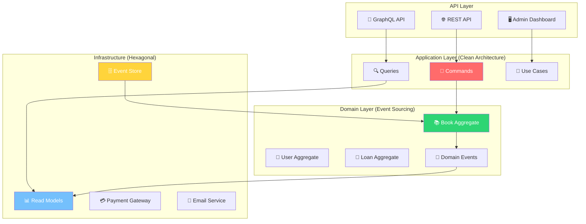

# 🧪 Ejercicios: Architecture Patterns
### *"La Práctica Hace al Arquitecto Maestro"*

> *"Architecture is not about the blueprints, it's about building something that works beautifully"* - Software Architect Master

---

## 🎯 **Objetivo General**

Implementar un **Sistema de Gestión de Biblioteca Digital** que demuestre el uso práctico de todos los patrones arquitectónicos aprendidos. Al final tendrás un portfolio piece que impresionará a cualquier equipo técnico.

---

## 📚 **Sistema: BiblioTech - Digital Library Management**

### 🎯 **Descripción del Sistema**

**BiblioTech** es una plataforma moderna de gestión bibliotecaria que maneja:
- 📚 **Gestión de Libros**: Catálogo, inventario, reservas
- 👥 **Usuarios**: Miembros, bibliotecarios, administradores  
- 📖 **Préstamos**: Checkout, returns, renovaciones
- 💰 **Financiero**: Multas, pagos, membresías
- 📊 **Analytics**: Reportes, estadísticas, insights

### 🏗️ **Arquitectura Objetivo**



---

## 📋 **Ejercicios Progresivos**

### 🏗️ **Semana 1: Clean Architecture Foundation**

#### 🎯 **Ejercicio 1.1: Domain Modeling (8 horas)**

**Objetivo**: Crear el domain model completo con entities, value objects y domain services.

**Tareas**:
```go
// 📁 internal/domain/entities/book.go

// TODO: Implementa estas entities con Clean Architecture
type Book struct {
    // Implementa con value objects, business rules, etc.
}

type User struct {
    // Implementa gestión completa de usuarios
}

type Loan struct {
    // Implementa lógica de préstamos con reglas de negocio
}

type Fine struct {
    // Implementa sistema de multas
}
```

**Criterios de Evaluación**:
- ✅ **Entities** con business logic encapsulada
- ✅ **Value Objects** inmutables y auto-validados
- ✅ **Domain Services** para lógica compleja
- ✅ **Business Rules** claras y testeables
- ✅ **Tests** con cobertura >90%

**Deliverables**:
- [ ] Entities completas con business logic
- [ ] Value objects con validación
- [ ] Domain services
- [ ] 50+ unit tests
- [ ] Documentation de business rules

#### 🎯 **Ejercicio 1.2: Application Layer (12 horas)**

**Objetivo**: Implementar use cases usando Clean Architecture patterns.

**Tareas**:
```go
// 📁 internal/application/usecases/book_management.go

// TODO: Implementa estos use cases
type CreateBookUseCase struct {
    // Dependencies injection
}

type LoanBookUseCase struct {
    // Complex business workflow
}

type ReturnBookUseCase struct {
    // With fine calculation
}

type RenewLoanUseCase struct {
    // Business rules validation
}
```

**Business Rules a Implementar**:
- 📚 Usuario puede tener máximo 5 libros prestados
- ⏰ Préstamos duran 14 días por defecto
- 💰 Multa de $0.50 por día de retraso
- 🔄 Renovación solo si no hay reservas pendientes
- 👑 VIP members pueden tener 10 libros

**Deliverables**:
- [ ] 8+ use cases implementados
- [ ] DTOs para input/output
- [ ] Error handling robusto
- [ ] Integration tests
- [ ] Performance benchmarks

### 🔷 **Semana 2: Hexagonal Architecture**

#### 🎯 **Ejercicio 2.1: Ports & Adapters (10 horas)**

**Objetivo**: Refactorizar hacia Hexagonal Architecture con máxima testabilidad.

**Tareas**:
```go
// 📁 internal/ports/primary/library_service.go

// TODO: Define primary ports
type LibraryService interface {
    // All use cases as clean interfaces
}

// 📁 internal/ports/secondary/book_repository.go

// TODO: Define secondary ports  
type BookRepository interface {
    // Clean persistence abstraction
}

type EmailService interface {
    // Communication abstraction
}

type PaymentService interface {
    // Payment processing abstraction
}
```

**Adapters a Implementar**:
- 🌐 **HTTP REST Adapter**
- 📱 **GraphQL Adapter** 
- 🗄️ **PostgreSQL Adapter**
- 📧 **SMTP Email Adapter**
- 💳 **Stripe Payment Adapter**
- 📊 **Redis Cache Adapter**

**Deliverables**:
- [ ] Primary ports definidos
- [ ] Secondary ports implementados
- [ ] Adapters para cada port
- [ ] Mock implementations para testing
- [ ] Integration tests por adapter

#### 🎯 **Ejercicio 2.2: Multiple Interfaces (8 horas)**

**Objetivo**: Demostrar flexibilidad con múltiples interfaces.

**Interfaces a Implementar**:
- 🌐 **REST API** - Para web frontend
- 📱 **GraphQL** - Para mobile apps
- ⌨️ **CLI Tool** - Para administradores
- 📊 **Admin Dashboard** - Para bibliotecarios

**Deliverables**:
- [ ] 4 adapters diferentes usando same core
- [ ] Consistency entre interfaces
- [ ] API documentation
- [ ] CLI help documentation

### ⚡ **Semana 3: CQRS Implementation**

#### 🎯 **Ejercicio 3.1: Command/Query Separation (12 horas)**

**Objetivo**: Implementar CQRS para separar reads/writes optimizados.

**Commands a Implementar**:
```go
// 📁 internal/cqrs/commands/library_commands.go

type CreateBookCommand struct {
    Title    string
    Author   string
    ISBN     string
    Category string
}

type LoanBookCommand struct {
    BookID string
    UserID string
}

type ReturnBookCommand struct {
    LoanID string
    ReturnDate time.Time
}

type PayFineCommand struct {
    UserID string
    Amount money.Money
}
```

**Queries a Implementar**:
```go
// 📁 internal/cqrs/queries/library_queries.go

type SearchBooksQuery struct {
    SearchTerm string
    Category   string
    Available  bool
    Pagination PaginationInfo
}

type GetUserLoansQuery struct {
    UserID     string
    Status     []LoanStatus
    DateRange  *DateRange
}

type LibraryStatsQuery struct {
    DateRange  DateRange
    Breakdown  []string // by category, by user type, etc.
}
```

**Deliverables**:
- [ ] Command bus implementation
- [ ] Query bus implementation
- [ ] 15+ commands implementados
- [ ] 20+ queries implementadas
- [ ] Performance benchmarks

#### 🎯 **Ejercicio 3.2: Read Models Optimization (10 horas)**

**Objetivo**: Crear read models optimizados para diferentes use cases.

**Read Models**:
- 📚 **BookCatalogReadModel** - Búsquedas rápidas
- 👤 **UserProfileReadModel** - Profiles completos
- 📊 **LibraryStatsReadModel** - Analytics y reporting
- 🔍 **SearchIndexReadModel** - Full-text search
- 📈 **RecommendationsReadModel** - AI recommendations

**Deliverables**:
- [ ] 5+ read models especializados
- [ ] Synchronization mechanisms
- [ ] Performance comparisons vs traditional approach
- [ ] Caching strategies

### 📚 **Semana 4: Event Sourcing**

#### 🎯 **Ejercicio 4.1: Event Store Implementation (15 horas)**

**Objetivo**: Implementar Event Sourcing completo con audit trail.

**Events a Modelar**:
```go
// 📁 internal/domain/events/book_events.go

type BookCreatedEvent struct {
    BookID      string
    Title       string
    Author      string
    ISBN        string
    AddedBy     string
    OccurredAt  time.Time
}

type BookLoanedEvent struct {
    BookID      string
    UserID      string
    LoanID      string
    DueDate     time.Time
    OccurredAt  time.Time
}

type BookReturnedEvent struct {
    BookID      string
    LoanID      string
    ReturnDate  time.Time
    Condition   BookCondition
    FineAmount  money.Money
    OccurredAt  time.Time
}

type FinePaymentEvent struct {
    UserID      string
    FineID      string
    Amount      money.Money
    PaymentMethod string
    OccurredAt  time.Time
}
```

**Deliverables**:
- [ ] Event store implementation (PostgreSQL)
- [ ] 30+ domain events definidos
- [ ] Aggregates con event sourcing
- [ ] Snapshot strategy
- [ ] Event versioning strategy

#### 🎯 **Ejercicio 4.2: Event Projections (12 horas)**

**Objetivo**: Crear projections que mantengan read models actualizados.

**Projections**:
- 📚 **BookProjection** - Estado actual de libros
- 👤 **UserProjection** - Perfiles y estadísticas
- 📊 **AnalyticsProjection** - Métricas en tiempo real
- 🔍 **SearchProjection** - Índices de búsqueda
- 💰 **FinancialProjection** - Reportes financieros

**Deliverables**:
- [ ] 5+ projections automatizadas
- [ ] Checkpoint management
- [ ] Projection rebuilding capability
- [ ] Performance monitoring

---

## 🏆 **Proyecto Final: Sistema Completo (Semana 5)**

### 🎯 **BiblioTech: Production-Ready System**

**Objetivo**: Integrar todos los patterns en un sistema production-ready.

#### 📋 **Features Completas**

**👥 User Management**:
- ✅ Registration with email verification
- ✅ Multiple user types (Member, Librarian, Admin)
- ✅ Profile management with preferences
- ✅ Subscription management

**📚 Book Management**:
- ✅ Complete CRUD with business rules
- ✅ Category management and tagging
- ✅ Multiple formats (Physical, Digital, Audiobook)
- ✅ Acquisition workflow for new books

**📖 Loan Management**:
- ✅ Smart loan algorithms with business rules
- ✅ Waitlist management for popular books
- ✅ Automatic renewal with limits
- ✅ Overdue management with notifications

**💰 Financial Management**:
- ✅ Fine calculation and payment processing
- ✅ Membership fee management
- ✅ Financial reporting and reconciliation
- ✅ Multiple payment methods

**📊 Analytics & Reporting**:
- ✅ Real-time dashboard with key metrics
- ✅ Trend analysis and forecasting
- ✅ User behavior analytics
- ✅ Financial reports and audit trails

#### 🚀 **Technical Requirements**

**Architecture Patterns**:
- ✅ Clean Architecture para separation of concerns
- ✅ Hexagonal Architecture para testability
- ✅ CQRS para performance optimization
- ✅ Event Sourcing para complete audit trail

**Quality Assurance**:
- ✅ >95% test coverage
- ✅ Performance benchmarks
- ✅ Security audit compliance
- ✅ API documentation

**Production Features**:
- ✅ Docker containerization
- ✅ Kubernetes deployment configs
- ✅ Monitoring and observability
- ✅ CI/CD pipeline

#### 📊 **Success Metrics**

**Performance**:
- ⚡ API response time <100ms p95
- 🚀 Support 10,000+ concurrent users
- 📈 Sub-second complex queries
- 💾 Event replay <5 minutes for full system

**Quality**:
- 🧪 95%+ test coverage
- 🐛 Zero critical vulnerabilities
- 📋 Complete API documentation
- 🔍 Full observability stack

**Business Value**:
- 📚 Manage 100,000+ books
- 👥 Support 50,000+ users
- 📊 Real-time analytics dashboard
- 💰 Complete financial tracking

---

## 📋 **Entrega Final**

### 🎯 **Deliverables**

**Code Repository**:
```
bibliotech/
├── 📁 cmd/                    # Entry points
│   ├── api/
│   ├── cli/
│   └── projector/
├── 📁 internal/               # Application code
│   ├── 📁 domain/            # Clean Architecture - Domain
│   ├── 📁 application/       # Clean Architecture - Application  
│   ├── 📁 infrastructure/    # Clean Architecture - Infrastructure
│   ├── 📁 ports/             # Hexagonal - Ports
│   ├── 📁 adapters/          # Hexagonal - Adapters
│   ├── 📁 cqrs/              # CQRS Implementation
│   └── 📁 eventstore/        # Event Sourcing
├── 📁 api/                   # API definitions
├── 📁 deployments/           # Docker & K8s
├── 📁 docs/                  # Documentation
├── 📁 tests/                 # Integration tests
└── 📁 tools/                 # Development tools
```

**Documentation**:
- [ ] **Architecture Decision Records (ADRs)**
- [ ] **API Documentation** (OpenAPI/Swagger)
- [ ] **Deployment Guide**
- [ ] **Performance Test Results**
- [ ] **Security Analysis Report**

**Demos**:
- [ ] **Live Demo** - Sistema funcionando
- [ ] **Performance Demo** - Benchmarks en vivo
- [ ] **Architecture Walkthrough** - Code review
- [ ] **Scalability Demo** - Load testing

---

## 🎓 **Evaluación y Certificación**

### 📊 **Criterios de Evaluación**

| Categoría               | Peso | Criterios                               |
| ----------------------- | ---- | --------------------------------------- |
| **Architecture Design** | 30%  | Correct pattern application, separation |
| **Code Quality**        | 25%  | Clean code, testing, documentation      |
| **Business Logic**      | 20%  | Complete features, business rules       |
| **Performance**         | 15%  | Benchmarks, optimization, scalability   |
| **Production Ready**    | 10%  | Security, monitoring, deployment        |

### 🏆 **Certification Levels**

**🥉 Bronze - Architecture Apprentice**:
- ✅ Completed 3/4 pattern implementations
- ✅ >80% test coverage
- ✅ Basic system functionality

**🥈 Silver - Architecture Practitioner**:
- ✅ All 4 patterns correctly implemented
- ✅ >90% test coverage
- ✅ Complete system with performance optimization

**🥇 Gold - Architecture Master**:
- ✅ Production-ready system
- ✅ >95% test coverage
- ✅ Innovation in implementation
- ✅ Exceptional performance results

---

## 🚀 **¡Comienza Tu Journey!**

### 🎯 **Getting Started**

1. **🏗️ Setup Development Environment**
   ```bash
   git clone https://github.com/your-username/bibliotech
   cd bibliotech
   make setup
   ```

2. **📋 Choose Your Track**
   - 🎯 **Guided Track**: Sigue exercises paso a paso
   - 🚀 **Accelerated Track**: Implementa direct al proyecto final
   - 🎨 **Creative Track**: Diseña tu propio sistema usando patterns

3. **💡 Get Support**
   - 📚 Reference implementation examples
   - 🤝 Community Discord para questions
   - 📹 Office hours weekly
   - 📝 Code review sessions

### 🎪 **Tu Momento de Brillar**

Este es tu oportunidad de crear algo increíble. Un sistema que:
- Demuestra tu mastery de architecture patterns
- Resuelve problemas reales de manera elegante
- Impresiona a hiring managers y technical leads
- Te posiciona como senior/staff engineer

**🎬 ¡Es hora de construir tu masterpiece arquitectónico!**

---

**💡 Tip Final**: No intentes usar todos los patterns en cada feature. La elegancia está en elegir el pattern correcto para cada problema específico.

**🏆 Goal**: Al final, tendrás un sistema que otros architects estudiarán como ejemplo de excelencia técnica.
