# 🏆 PROYECTO FINAL: BiblioTech - Digital Library Management System
### *"From Architecture Patterns to Production Excellence"*

> *"The best architectures are not about showing off your knowledge of patterns, but about solving real problems elegantly"* - Senior Software Architect

---

## 🎯 **Project Overview**

**BiblioTech** es tu **capstone project** que integra todos los architecture patterns aprendidos en un sistema production-ready. Este proyecto te posicionará como un architecture expert y será el highlight de tu portfolio técnico.

### 🚀 **¿Por qué BiblioTech?**


---

## 🏗️ **System Architecture**

### 🎯 **High-Level Architecture**

```mermaid
graph TB
    subgraph "🌐 Presentation Layer"
        A[🖥️ Web Admin Panel]
        B[📱 Mobile App API]
        C[⌨️ CLI Management Tool]
        D[📊 Analytics Dashboard]
    end
    
    subgraph "🧠 Application Layer (Clean Architecture)"
        E[📝 Command Handlers]
        F[🔍 Query Handlers]
        G[🔄 Use Cases & Workflows]
        H[🛡️ Authorization & Validation]
    end
    
    subgraph "🎯 Domain Layer (Event Sourcing)"
        I[📚 Book Aggregate]
        J[👤 User Aggregate] 
        K[📖 Loan Aggregate]
        L[💰 Payment Aggregate]
        M[📡 Domain Events]
        N[⚖️ Business Rules]
    end
    
    subgraph "🔌 Infrastructure Layer (Hexagonal)"
        O[🗄️ PostgreSQL Event Store]
        P[📊 MongoDB Read Models]
        Q[🔍 Elasticsearch Search]
        R[📧 Email Service]
        S[💳 Payment Gateway]
        T[📊 Redis Cache]
    end
    
    A --> E
    B --> F
    C --> G
    D --> F
    E --> I
    F --> P
    G --> J
    I --> M
    J --> M
    K --> M
    L --> M
    M --> O
    M --> P
    
    style I fill:#2ed573,color:#fff
    style P fill:#74c0fc,color:#fff
    style E fill:#ff6b6b,color:#fff
    style O fill:#ffd43b,color:#fff
```



### 🎪 **Pattern Integration Strategy**

| 🎯 **Pattern**              | 🔍 **Aplicación**                              | 💡 **Beneficio**                               |
| -------------------------- | --------------------------------------------- | --------------------------------------------- |
| **Clean Architecture**     | Separation of concerns, dependency inversion  | Testable, maintainable, framework-independent |
| **Hexagonal Architecture** | Ports & adapters for external systems         | Flexible, swappable implementations           |
| **CQRS**                   | Read/write separation for performance         | Optimized queries, scalable reads             |
| **Event Sourcing**         | Complete audit trail and state reconstruction | Compliance, debugging, analytics              |

---

## 📋 **Business Requirements**

### 🎯 **Core Features**

#### 👥 **User Management System**
```go
// Domain requirements translated to technical specs

type UserTypes = {
    Member:     "Standard library member with borrowing privileges"
    Librarian:  "Staff member with book management capabilities"  
    Admin:      "System administrator with full access"
    VIP:        "Premium member with extended privileges"
}

type BusinessRules = {
    // Membership rules
    "Standard members": "5 book limit, 14-day loans"
    "VIP members":      "10 book limit, 21-day loans, priority reservations"
    "Overdue policy":   "$0.50/day fine, suspension after 30 days overdue"
    "Renewal policy":   "Max 2 renewals unless reserved by others"
}
```

#### 📚 **Book Catalog Management**
```go
type BookManagement struct {
    // Multi-format support
    Formats      []string // Physical, Digital, Audiobook
    Categories   []string // Fiction, Non-fiction, Reference, etc.
    Conditions   []string // New, Good, Fair, Poor, Damaged
    
    // Acquisition workflow
    Acquisition  process {
        Request -> Approval -> Purchase -> Cataloging -> Available
    }
    
    // Inventory tracking
    Copies       tracking {
        Total, Available, Loaned, Reserved, Maintenance
    }
}
```

#### 📖 **Loan Management System**
```go
type LoanWorkflow struct {
    // Smart reservation system
    Reservations queue {
        Priority: VIP > Standard > Guest
        AutoCancel: 48 hours if not picked up
        Notifications: Email + SMS alerts
    }
    
    // Automated processes
    AutoRenewal  bool   // If no reservations pending
    OverdueAlerts []int  // Days: [3, 7, 14, 30]
    SuspensionPolicy int // 30 days overdue = suspension
}
```

#### 💰 **Financial Management**
```go
type FinancialSystem struct {
    // Revenue streams
    Fines        money.Money  // Overdue penalties
    Memberships  money.Money  // Annual/monthly fees
    LostBooks    money.Money  // Replacement costs
    
    // Payment processing
    Methods      []string     // Credit card, PayPal, Cash, Waiver
    Reconciliation daily      // End-of-day financial reports
    TaxReporting quarterly    // Compliance requirements
}
```

### 📊 **Advanced Features**

#### 🤖 **Smart Recommendations**
```go
type RecommendationEngine struct {
    Algorithm   string // Collaborative filtering + content-based
    DataPoints  []string {
        "Reading history",
        "Genre preferences", 
        "Rating patterns",
        "Similar users",
        "Trending books"
    }
    
    Triggers    []string {
        "After book return",
        "Weekly digest email",
        "Browse catalog",
        "Login dashboard"
    }
}
```

#### 📈 **Analytics & Insights**
```go
type AnalyticsSystem struct {
    RealTimeMetrics []string {
        "Books checked out today",
        "Overdue items count",
        "Revenue this month",
        "Most popular categories",
        "User activity patterns"
    }
    
    Reports []string {
        "Monthly circulation report",
        "Financial performance",
        "User engagement metrics", 
        "Collection analysis",
        "Predictive maintenance"
    }
}
```

---

## 🏗️ **Technical Implementation**

### 🎯 **Project Structure**

```
bibliotech/
├── 📁 cmd/                           # Entry points
│   ├── 🌐 api/                      # REST API server
│   ├── 📊 graphql/                  # GraphQL server  
│   ├── ⌨️ cli/                      # Management CLI
│   ├── 🔄 projector/                # Event projections
│   ├── 📧 notifier/                 # Background notifications
│   └── 🧹 maintenance/              # Cleanup jobs
│
├── 📁 internal/                      # Private application code
│   ├── 📁 domain/                   # 🏛️ Clean Architecture - Domain Layer
│   │   ├── 📁 entities/             # Core business entities
│   │   ├── 📁 valueobjects/         # Immutable value types
│   │   ├── 📁 events/               # Domain events
│   │   ├── 📁 services/             # Domain services
│   │   └── 📁 repositories/         # Repository interfaces
│   │
│   ├── 📁 application/              # 🧠 Clean Architecture - Application Layer
│   │   ├── 📁 usecases/             # Business use cases
│   │   ├── 📁 dtos/                 # Data transfer objects
│   │   ├── 📁 validation/           # Input validation
│   │   └── 📁 authorization/        # Access control
│   │
│   ├── 📁 infrastructure/           # 🔧 Clean Architecture - Infrastructure
│   │   ├── 📁 persistence/          # Database implementations
│   │   ├── 📁 messaging/            # Event bus, notifications
│   │   ├── 📁 external/             # Third-party integrations
│   │   └── 📁 config/               # Configuration management
│   │
│   ├── 📁 ports/                    # 🔌 Hexagonal Architecture - Ports
│   │   ├── 📁 primary/              # Driving ports (API interfaces)
│   │   └── 📁 secondary/            # Driven ports (infrastructure interfaces)
│   │
│   ├── 📁 adapters/                 # 🔄 Hexagonal Architecture - Adapters
│   │   ├── 📁 primary/              # HTTP, GraphQL, CLI adapters
│   │   └── 📁 secondary/            # Database, email, payment adapters
│   │
│   ├── 📁 cqrs/                     # ⚡ CQRS Implementation
│   │   ├── 📁 commands/             # Write operations
│   │   ├── 📁 queries/              # Read operations
│   │   ├── 📁 handlers/             # Command & query handlers
│   │   └── 📁 bus/                  # Message bus implementation
│   │
│   └── 📁 eventstore/               # 📚 Event Sourcing
│       ├── 📁 aggregates/           # Event-sourced aggregates
│       ├── 📁 projections/          # Read model projections
│       ├── 📁 snapshots/            # Aggregate snapshots
│       └── 📁 store/                # Event store implementation
│
├── 📁 api/                          # API definitions
│   ├── 📁 openapi/                  # REST API specs
│   ├── 📁 graphql/                  # GraphQL schemas
│   └── 📁 proto/                    # gRPC definitions (future)
│
├── 📁 web/                          # Frontend applications
│   ├── 📁 admin/                    # Admin dashboard (React)
│   └── 📁 public/                   # Public catalog (Next.js)
│
├── 📁 deployments/                  # Infrastructure as code
│   ├── 📁 docker/                   # Docker configurations
│   ├── 📁 kubernetes/               # K8s manifests
│   ├── 📁 terraform/                # Cloud infrastructure
│   └── 📁 helm/                     # Helm charts
│
├── 📁 docs/                         # Documentation
│   ├── 📁 architecture/             # ADRs, diagrams
│   ├── 📁 api/                      # API documentation
│   ├── 📁 deployment/               # Ops documentation
│   └── 📁 user/                     # User guides
│
├── 📁 tests/                        # Test suites
│   ├── 📁 unit/                     # Unit tests
│   ├── 📁 integration/              # Integration tests
│   ├── 📁 e2e/                      # End-to-end tests
│   ├── 📁 performance/              # Load & stress tests
│   └── 📁 fixtures/                 # Test data
│
├── 📁 tools/                        # Development tools
│   ├── 📁 generators/               # Code generators
│   ├── 📁 migration/                # Database migrations
│   ├── 📁 seeders/                  # Data seeders
│   └── 📁 scripts/                  # Utility scripts
│
├── 📁 monitoring/                   # Observability
│   ├── 📁 prometheus/               # Metrics collection
│   ├── 📁 grafana/                  # Dashboards
│   ├── 📁 jaeger/                   # Distributed tracing
│   └── 📁 elk/                      # Logging stack
│
└── 📁 security/                     # Security configurations
    ├── 📁 policies/                 # RBAC policies
    ├── 📁 certificates/             # TLS certificates
    └── 📁 scanning/                 # Security scanning configs
```

### 🎯 **Core Implementation Highlights**

#### 🏛️ **Domain Layer - Book Aggregate (Event Sourced)**

```go
// 📁 internal/domain/aggregates/book.go

package aggregates

import (
    "errors"
    "time"
    "github.com/bibliotech/internal/domain/events"
    "github.com/bibliotech/internal/domain/valueobjects"
)

// BookAggregate represents a book with its complete lifecycle
type BookAggregate struct {
    // Aggregate root properties
    id          valueobjects.BookID
    version     int
    uncommitted []events.DomainEvent
    
    // Business state
    title       valueobjects.Title
    author      valueobjects.Author
    isbn        valueobjects.ISBN
    category    valueobjects.Category
    condition   valueobjects.Condition
    status      BookStatus
    location    valueobjects.Location
    
    // Loan tracking
    currentLoan *LoanInfo
    loanHistory []LoanRecord
    
    // Financial tracking
    acquisitionCost valueobjects.Money
    replacementCost valueobjects.Money
    
    // Metadata
    addedAt     time.Time
    addedBy     valueobjects.UserID
    lastUpdated time.Time
}

// Factory method with business rules validation
func CreateBook(cmd CreateBookCommand) (*BookAggregate, error) {
    // Validate business rules
    if err := validateBookCreation(cmd); err != nil {
        return nil, err
    }
    
    // Create aggregate
    book := &BookAggregate{
        id:      valueobjects.NewBookID(),
        version: 0,
    }
    
    // Apply creation event
    event := events.BookCreatedEvent{
        BookID:          book.id,
        Title:           cmd.Title,
        Author:          cmd.Author,
        ISBN:            cmd.ISBN,
        Category:        cmd.Category,
        AcquisitionCost: cmd.Cost,
        AddedBy:         cmd.LibrarianID,
        OccurredAt:      time.Now(),
    }
    
    book.apply(event)
    return book, nil
}

// Business method - Loan a book
func (b *BookAggregate) LoanTo(userID valueobjects.UserID, dueDate time.Time) error {
    // Business rule validation
    if b.status != BookStatusAvailable {
        return errors.New("book is not available for loan")
    }
    
    if b.condition == valueobjects.ConditionDamaged {
        return errors.New("damaged books cannot be loaned")
    }
    
    // Create and apply event
    event := events.BookLoanedEvent{
        BookID:     b.id,
        UserID:     userID,
        LoanID:     valueobjects.NewLoanID(),
        DueDate:    dueDate,
        OccurredAt: time.Now(),
    }
    
    b.apply(event)
    return nil
}

// Business method - Return a book
func (b *BookAggregate) Return(condition valueobjects.Condition, notes string) (*events.BookReturnedEvent, error) {
    if b.status != BookStatusLoaned {
        return nil, errors.New("book is not currently loaned")
    }
    
    // Calculate fine if overdue
    var fine valueobjects.Money
    if time.Now().After(b.currentLoan.DueDate) {
        overdueDays := int(time.Since(b.currentLoan.DueDate).Hours() / 24)
        fine = valueobjects.NewMoney(float64(overdueDays) * 0.50) // $0.50 per day
    }
    
    event := events.BookReturnedEvent{
        BookID:        b.id,
        LoanID:        b.currentLoan.LoanID,
        ReturnDate:    time.Now(),
        Condition:     condition,
        FineAmount:    fine,
        Notes:         notes,
        OccurredAt:    time.Now(),
    }
    
    b.apply(event)
    return &event, nil
}

// Event sourcing - Apply events to rebuild state
func (b *BookAggregate) apply(event events.DomainEvent) {
    switch e := event.(type) {
    case events.BookCreatedEvent:
        b.id = e.BookID
        b.title = e.Title
        b.author = e.Author
        b.isbn = e.ISBN
        b.category = e.Category
        b.condition = valueobjects.ConditionNew
        b.status = BookStatusAvailable
        b.acquisitionCost = e.AcquisitionCost
        b.addedAt = e.OccurredAt
        b.addedBy = e.AddedBy
        
    case events.BookLoanedEvent:
        b.status = BookStatusLoaned
        b.currentLoan = &LoanInfo{
            LoanID:  e.LoanID,
            UserID:  e.UserID,
            DueDate: e.DueDate,
        }
        b.loanHistory = append(b.loanHistory, LoanRecord{
            LoanID:    e.LoanID,
            UserID:    e.UserID,
            LoanedAt:  e.OccurredAt,
            DueDate:   e.DueDate,
        })
        
    case events.BookReturnedEvent:
        b.status = BookStatusAvailable
        b.condition = e.Condition
        b.currentLoan = nil
        // Update loan history with return info
        for i := range b.loanHistory {
            if b.loanHistory[i].LoanID == e.LoanID {
                b.loanHistory[i].ReturnedAt = &e.ReturnDate
                b.loanHistory[i].FineAmount = e.FineAmount
                break
            }
        }
    }
    
    b.version++
    b.uncommitted = append(b.uncommitted, event)
    b.lastUpdated = time.Now()
}

// Event sourcing - Replay events to reconstruct aggregate
func (b *BookAggregate) FromHistory(events []events.DomainEvent) {
    for _, event := range events {
        b.apply(event)
    }
    b.uncommitted = nil // Clear uncommitted after replay
}
```

#### ⚡ **CQRS - Command & Query Handlers**

```go
// 📁 internal/cqrs/commands/loan_commands.go

package commands

// Command for loaning a book
type LoanBookCommand struct {
    BookID     string    `json:"book_id" validate:"required,uuid"`
    UserID     string    `json:"user_id" validate:"required,uuid"`
    LoanPeriod int       `json:"loan_period" validate:"min=1,max=30"` // days
    RequestedBy string   `json:"requested_by" validate:"required,uuid"`
}

// Command handler with full business logic
type LoanBookHandler struct {
    bookRepo     ports.BookRepository
    userRepo     ports.UserRepository
    loanRepo     ports.LoanRepository
    eventBus     ports.EventBus
    policyEngine ports.PolicyEngine
}

func (h *LoanBookHandler) Handle(ctx context.Context, cmd LoanBookCommand) (*LoanBookResult, error) {
    // 1. Load aggregates
    book, err := h.bookRepo.GetByID(ctx, cmd.BookID)
    if err != nil {
        return nil, fmt.Errorf("book not found: %w", err)
    }
    
    user, err := h.userRepo.GetByID(ctx, cmd.UserID)
    if err != nil {
        return nil, fmt.Errorf("user not found: %w", err)
    }
    
    // 2. Check business policies
    policy := h.policyEngine.GetLoanPolicy(user.Type())
    if !policy.CanLoanBook(user, book) {
        return nil, errors.New("loan not allowed by policy")
    }
    
    // 3. Calculate due date
    dueDate := time.Now().AddDate(0, 0, policy.LoanPeriodDays())
    
    // 4. Execute business logic
    if err := book.LoanTo(user.ID(), dueDate); err != nil {
        return nil, fmt.Errorf("loan failed: %w", err)
    }
    
    // 5. Persist changes
    if err := h.bookRepo.Save(ctx, book); err != nil {
        return nil, fmt.Errorf("save failed: %w", err)
    }
    
    // 6. Publish events
    for _, event := range book.UncommittedEvents() {
        if err := h.eventBus.Publish(ctx, event); err != nil {
            // Log error but don't fail - eventual consistency
            log.Error("failed to publish event", "error", err)
        }
    }
    
    return &LoanBookResult{
        LoanID:  book.CurrentLoan().LoanID,
        DueDate: dueDate,
        Success: true,
    }, nil
}
```

```go
// 📁 internal/cqrs/queries/library_queries.go

package queries

// Query for searching available books
type SearchBooksQuery struct {
    SearchTerm string            `json:"search_term"`
    Category   string            `json:"category"`
    Author     string            `json:"author"`
    Available  bool              `json:"available_only"`
    Pagination PaginationRequest `json:"pagination"`
    SortBy     string            `json:"sort_by"`
    SortOrder  string            `json:"sort_order"`
}

// Optimized query handler using read models
type SearchBooksHandler struct {
    readModel   ports.BookCatalogReadModel
    searchIndex ports.SearchIndex
    cache       ports.CacheService
}

func (h *SearchBooksHandler) Handle(ctx context.Context, query SearchBooksQuery) (*SearchBooksResult, error) {
    // 1. Try cache first
    cacheKey := h.buildCacheKey(query)
    if cached, found := h.cache.Get(ctx, cacheKey); found {
        return cached.(*SearchBooksResult), nil
    }
    
    // 2. Use search index for text search
    var results []BookSearchResult
    var err error
    
    if query.SearchTerm != "" {
        results, err = h.searchIndex.SearchBooks(ctx, SearchCriteria{
            Term:      query.SearchTerm,
            Category:  query.Category,
            Author:    query.Author,
            Available: query.Available,
        })
    } else {
        // 3. Use read model for filtered queries
        results, err = h.readModel.FindBooks(ctx, FilterCriteria{
            Category:  query.Category,
            Author:    query.Author,
            Available: query.Available,
            Pagination: query.Pagination,
            Sort: SortCriteria{
                Field: query.SortBy,
                Order: query.SortOrder,
            },
        })
    }
    
    if err != nil {
        return nil, fmt.Errorf("search failed: %w", err)
    }
    
    // 4. Build response
    response := &SearchBooksResult{
        Books:      results,
        Total:      len(results),
        Page:       query.Pagination.Page,
        PageSize:   query.Pagination.Size,
        HasMore:    len(results) == query.Pagination.Size,
    }
    
    // 5. Cache result
    h.cache.Set(ctx, cacheKey, response, 5*time.Minute)
    
    return response, nil
}
```

#### 🔌 **Hexagonal Architecture - Adapters**

```go
// 📁 internal/adapters/secondary/postgresql_book_repository.go

package secondary

import (
    "context"
    "database/sql"
    "encoding/json"
    "fmt"
    
    "github.com/bibliotech/internal/domain/aggregates"
    "github.com/bibliotech/internal/domain/events"
    "github.com/bibliotech/internal/ports/secondary"
)

// PostgreSQL implementation of book repository
type PostgreSQLBookRepository struct {
    db        *sql.DB
    eventStore ports.EventStore
}

func NewPostgreSQLBookRepository(db *sql.DB, eventStore ports.EventStore) *PostgreSQLBookRepository {
    return &PostgreSQLBookRepository{
        db:        db,
        eventStore: eventStore,
    }
}

// Implementation using event sourcing
func (r *PostgreSQLBookRepository) GetByID(ctx context.Context, id string) (*aggregates.BookAggregate, error) {
    // 1. Load events from event store
    events, err := r.eventStore.LoadEvents(ctx, id)
    if err != nil {
        return nil, fmt.Errorf("failed to load events: %w", err)
    }
    
    if len(events) == 0 {
        return nil, ErrBookNotFound
    }
    
    // 2. Reconstruct aggregate from events
    book := &aggregates.BookAggregate{}
    book.FromHistory(events)
    
    return book, nil
}

func (r *PostgreSQLBookRepository) Save(ctx context.Context, book *aggregates.BookAggregate) error {
    // 1. Get uncommitted events
    events := book.UncommittedEvents()
    if len(events) == 0 {
        return nil // Nothing to save
    }
    
    // 2. Save events to event store (with optimistic concurrency)
    if err := r.eventStore.SaveEvents(ctx, book.ID().String(), events, book.Version()-len(events)); err != nil {
        return fmt.Errorf("failed to save events: %w", err)
    }
    
    // 3. Mark events as committed
    book.MarkEventsAsCommitted()
    
    return nil
}
```

---

## 🚀 **Development Phases**

### 📅 **Phase 1: Foundation (Week 1)**

**🎯 Objectives**:
- Set up project structure
- Implement domain model
- Basic CRUD operations
- Unit test foundation

**🔧 Deliverables**:
```go
// Core domain entities
✅ Book, User, Loan, Fine aggregates
✅ Value objects with validation
✅ Domain events definitions
✅ Repository interfaces
✅ 100+ unit tests with >90% coverage
```

### 📅 **Phase 2: Architecture Implementation (Week 2)**

**🎯 Objectives**:
- Implement all four architecture patterns
- Create adapters for external systems
- Build command/query separation

**🔧 Deliverables**:
```go
// Pattern implementations
✅ Clean Architecture layers
✅ Hexagonal ports & adapters
✅ CQRS command/query handlers
✅ Event sourcing with PostgreSQL
✅ Integration tests for each pattern
```

### 📅 **Phase 3: Business Features (Week 3)**

**🎯 Objectives**:
- Complete business logic implementation
- Advanced features (recommendations, analytics)
- Multi-interface support

**🔧 Deliverables**:
```go
// Complete features
✅ User management with roles
✅ Book catalog with search
✅ Loan workflow with business rules
✅ Payment processing
✅ Email notifications
✅ REST + GraphQL APIs
```

### 📅 **Phase 4: Production Readiness (Week 4)**

**🎯 Objectives**:
- Performance optimization
- Security implementation
- Monitoring and observability
- Deployment automation

**🔧 Deliverables**:
```go
// Production features
✅ Performance benchmarks <100ms p95
✅ Security audit passed
✅ Complete observability stack
✅ Docker + Kubernetes deployment
✅ CI/CD pipeline
```

### 📅 **Phase 5: Demo & Documentation (Week 5)**

**🎯 Objectives**:
- Live demo preparation
- Complete documentation
- Performance testing
- Final polish

**🔧 Deliverables**:
```go
// Demo package
✅ Live demo environment
✅ Performance test results
✅ Complete API documentation
✅ Architecture decision records
✅ Video presentation
```

---

## 📊 **Success Metrics & KPIs**

### 🎯 **Technical Metrics**

| Metric                | Target     | Measurement                             |
| --------------------- | ---------- | --------------------------------------- |
| **API Response Time** | <100ms p95 | Load testing with 1000 concurrent users |
| **Test Coverage**     | >95%       | Unit + integration tests                |
| **Code Quality**      | A+ Grade   | SonarQube analysis                      |
| **Security Score**    | 95+        | OWASP security scan                     |
| **Documentation**     | 100%       | All APIs and patterns documented        |

### 🎯 **Business Metrics**

| Feature                  | Capability           | Validation                    |
| ------------------------ | -------------------- | ----------------------------- |
| **User Management**      | 50,000+ users        | Load test with realistic data |
| **Book Catalog**         | 100,000+ books       | Search performance <2s        |
| **Concurrent Loans**     | 10,000+ simultaneous | Stress test loan processing   |
| **Financial Processing** | $1M+ transactions    | Payment gateway integration   |
| **Analytics**            | Real-time dashboards | Sub-second query responses    |

### 🎯 **Architecture Quality**

| Pattern                    | Implementation Quality   | Validation Method       |
| -------------------------- | ------------------------ | ----------------------- |
| **Clean Architecture**     | Perfect layer separation | Dependency analysis     |
| **Hexagonal Architecture** | Zero framework coupling  | Adapter swapping tests  |
| **CQRS**                   | 10x read performance     | Benchmark comparisons   |
| **Event Sourcing**         | Complete audit trail     | Event replay validation |

---

## 🏆 **Demo Scenarios**

### 🎪 **Scenario 1: Real-Time Library Operations**

**Story**: "Busy Friday afternoon at Central Library"

```go
// Demo script - 5 minutes of real-time operations
Sequence {
    1. 📚 New book arrives -> Cataloging workflow
    2. 👤 VIP user logs in -> Personalized dashboard
    3. 🔍 Searches for trending book -> Instant results
    4. 📖 Reserves book -> Queue management
    5. 📧 Gets notification -> Email/SMS triggered
    6. 💰 Pays outstanding fine -> Payment processing
    7. 📊 Librarian views analytics -> Real-time metrics
    8. 🔄 System auto-renews other loans -> Background processing
}
```

### 🎪 **Scenario 2: Architecture Pattern Showcase**

**Story**: "Under the hood - Pattern interactions"

```go
// Demo script - Architecture deep dive
Showcase {
    1. 🏛️ "Clean Architecture" -> Show layer independence
    2. 🔌 "Hexagonal" -> Swap email provider live
    3. ⚡ "CQRS" -> Compare read/write performance
    4. 📚 "Event Sourcing" -> Replay user's full history
    5. 🎭 "Integration" -> All patterns working together
}
```

### 🎪 **Scenario 3: Scale & Performance**

**Story**: "Black Friday of libraries - System under stress"

```go
// Demo script - Performance showcase
StressTest {
    1. 🚀 Simulate 10,000 concurrent users
    2. ⚡ Process 1,000 loans per second
    3. 🔍 Handle 50,000 search queries
    4. 💰 Process 100 payments simultaneously
    5. 📊 Maintain <100ms response times
    6. 🎯 Show real-time metrics dashboard
}
```

---

## 🎓 **Learning Outcomes**

### 🧠 **Technical Mastery**

Al completar BiblioTech, habrás dominado:

**Architecture Patterns**:
- ✅ **Clean Architecture** - Separation of concerns mastery
- ✅ **Hexagonal Architecture** - Flexibility and testability
- ✅ **CQRS** - Performance optimization strategies
- ✅ **Event Sourcing** - Audit trail and debugging power

**Technical Skills**:
- ✅ **Go Programming** - Advanced patterns and idioms
- ✅ **Database Design** - Event stores and read models
- ✅ **API Design** - REST, GraphQL, and CLI interfaces
- ✅ **Testing** - Unit, integration, and performance testing
- ✅ **DevOps** - Docker, Kubernetes, CI/CD pipelines

**Business Skills**:
- ✅ **Requirements Analysis** - Complex business rules
- ✅ **System Design** - Scalable architecture decisions
- ✅ **Performance Engineering** - Optimization strategies
- ✅ **Documentation** - Technical writing excellence

### 🚀 **Career Impact**

**Portfolio Strength**:
- 🏆 Production-ready system showcasing advanced patterns
- 📊 Performance benchmarks proving scalability
- 🔍 Clean, well-documented code for code reviews
- 🎭 Live demo showing technical presentation skills

**Interview Advantage**:
- 💡 Real examples for architecture discussions
- 🎯 Proven ability to deliver complex systems
- 📈 Performance optimization experience
- 🤝 Cross-functional collaboration skills

**Career Progression**:
- 🚀 **Senior Engineer** - Architecture design capabilities
- 🏗️ **Staff Engineer** - System design leadership
- 🎯 **Architecture Role** - Pattern expertise and best practices
- 💼 **Technical Lead** - Project delivery track record

---

## 🎬 **¡Tu Momento de Brillar!**

### 💎 **Este es Tu Capstone Project**

BiblioTech no es solo un ejercicio - es tu **arquitectura masterpiece** que:

- 🏆 Demuestra tu expertise en patterns avanzados
- 💼 Te posiciona para roles senior/staff
- 🎯 Impresiona en technical interviews
- 🚀 Showcases tu capacidad de delivery

### 🎪 **¿Estás Listo para el Challenge?**

```go
if developer.HasCompletedArchitecturePatterns() && 
   developer.IsReadyForNextLevel() {
    return startBiblioTechProject()
}
```

**🚀 ¡Es hora de construir algo extraordinario!**

---

**💡 Pro Tip**: Documenta tu journey con ADRs (Architecture Decision Records). Los hiring managers aman ver tu thinking process detrás de cada decisión técnica.

**🎯 Success Formula**: `Technical Excellence + Business Value + Great Documentation = Career-Changing Project`
