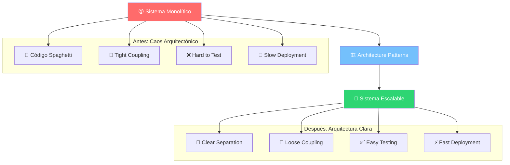
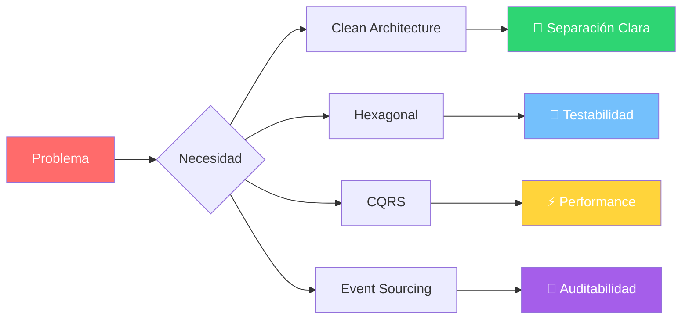
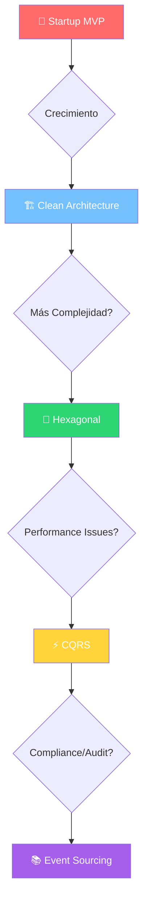

# 🏗️ Architecture Patterns
### *"Construyendo Sistemas que Perduran en el Tiempo"*

> *"La arquitectura es la base invisible que soporta todo lo visible. Un buen arquitecto piensa en décadas, no en sprints"* - Uncle Bob Martin

---

## 🎯 **¿Qué Aprenderás?**

Al completar esta lección, serás capaz de:

- 🏗️ **Diseñar arquitecturas** que escalen a millones de usuarios
- 🧹 **Aplicar Clean Architecture** en sistemas complejos de Go
- 🔷 **Implementar Hexagonal Architecture** para máxima testabilidad
- ⚡ **Dominar CQRS** para separar lecturas y escrituras
- 📚 **Implementar Event Sourcing** para sistemas auditables
- 🎯 **Elegir el patrón correcto** para cada situación
- 🔧 **Refactorizar sistemas legacy** hacia arquitecturas modernas
- 📐 **Crear abstracciones** que simplifican la complejidad

---

## 🌟 **El Poder de una Buena Arquitectura**



### 🎯 **Transformación Arquitectónica Real**

**Antes** (Arquitectura caótica):
```go
// ❌ Todo mezclado en una función
func HandleUserRegistration(w http.ResponseWriter, r *http.Request) {
    // Parsing JSON mezclado con validación
    var user User
    json.NewDecoder(r.Body).Decode(&user)
    
    // Lógica de negocio mezclada con base de datos
    if len(user.Email) < 5 {
        http.Error(w, "Invalid email", 400)
        return
    }
    
    // SQL directo en el handler
    db.Exec("INSERT INTO users (email, password) VALUES (?, ?)", 
             user.Email, hash(user.Password))
    
    // Envío de email mezclado con respuesta HTTP
    sendWelcomeEmail(user.Email)
    w.WriteHeader(201)
}
```

**Después** (Clean Architecture):
```go
// ✅ Separación clara de responsabilidades
func (h *UserHandler) Register(w http.ResponseWriter, r *http.Request) {
    cmd, err := h.parseCommand(r)
    if err != nil {
        h.respond(w, err, 400)
        return
    }
    
    result, err := h.userService.Register(cmd)
    if err != nil {
        h.handleError(w, err)
        return
    }
    
    h.respond(w, result, 201)
}
```

---

## 📚 **Tabla de Contenidos**

### 🏗️ **Patrones Arquitectónicos Fundamentales**

| Pattern                                       | Descripción                                     | Analogía                  | Casos de Uso                      |
| --------------------------------------------- | ----------------------------------------------- | ------------------------- | --------------------------------- |
| [🧹 Clean Architecture](./clean-architecture/) | Separación en capas con dependencias invertidas | Edificio bien planificado | APIs, microservices               |
| [🔷 Hexagonal Architecture](./hexagonal/)      | Puerto-adaptador para máxima testabilidad       | Puerto marítimo           | Sistemas con múltiples interfaces |
| [⚡ CQRS](./cqrs/)                             | Separación de comandos y consultas              | Cocina de restaurante     | Sistemas de alto rendimiento      |
| [📚 Event Sourcing](./event-sourcing/)         | Estado como secuencia de eventos                | Libro de contabilidad     | Sistemas auditables               |

### 🎯 **Comparación Rápida**



---

## 🧠 **Conceptos Fundamentales**

### 🎯 **Los 4 Principios de Arquitectura Sólida**

#### 1. 🔄 **Separation of Concerns**
*"Cada cosa en su lugar, un lugar para cada cosa"*

```go
// ❌ Múltiples responsabilidades
type UserService struct {
    db    *sql.DB
    smtp  *smtp.Client
    cache *redis.Client
    // Todo mezclado...
}

// ✅ Una responsabilidad clara
type UserService struct {
    repo         UserRepository      // Persistencia
    emailService EmailService        // Comunicación
    validator    UserValidator       // Validación
    eventBus     EventBus           // Eventos
}
```

#### 2. 🎯 **Dependency Inversion**
*"Depende de abstracciones, no de concreciones"*

```go
// ❌ Dependencia directa (acoplamiento)
type OrderService struct {
    mysqlRepo *MySQLOrderRepository
}

// ✅ Dependencia invertida (flexibilidad)
type OrderService struct {
    repo OrderRepository // Interface
}

type OrderRepository interface {
    Save(order Order) error
    FindByID(id string) (Order, error)
}
```

#### 3. 🚪 **Single Entry Points**
*"Un lugar para entrar, múltiples formas de procesar"*

```go
// Application Service como punto de entrada único
type UserApplicationService struct {
    commandHandler CommandHandler
    queryHandler   QueryHandler
    eventHandler   EventHandler
}

func (s *UserApplicationService) Handle(request interface{}) (interface{}, error) {
    switch req := request.(type) {
    case CreateUserCommand:
        return s.commandHandler.Handle(req)
    case GetUserQuery:
        return s.queryHandler.Handle(req)
    case UserCreatedEvent:
        return s.eventHandler.Handle(req)
    default:
        return nil, ErrUnsupportedRequest
    }
}
```

#### 4. 🧪 **Testability by Design**
*"Si no se puede testear fácilmente, está mal diseñado"*

```go
// ✅ Arquitectura testeable
type UserService struct {
    repo      UserRepository
    validator UserValidator
    events    EventBus
    clock     Clock // Incluso el tiempo es inyectable!
}

// Mock fácil para testing
type MockUserRepository struct {
    users map[string]User
}

func (m *MockUserRepository) Save(user User) error {
    m.users[user.ID] = user
    return nil
}
```

---

## 🔧 **Herramientas y Bibliotecas**

### 📦 **Ecosystem de Arquitectura en Go**

```go
// Dependency Injection
import (
    "github.com/google/wire"          // Compile-time DI
    "go.uber.org/fx"                  // Runtime DI
    "github.com/sarulabs/di/v2"       // Container DI
)

// Event Sourcing
import (
    "github.com/EventStore/EventStore-Client-Go" // Event Store
    "github.com/hellofresh/health-go"            // Health checks
)

// CQRS
import (
    "github.com/ThreeDotsLabs/watermill"  // Message routing
    "github.com/nats-io/nats.go"          // Message broker
)

// Clean Architecture Helpers
import (
    "github.com/labstack/echo/v4"         // HTTP layer
    "github.com/go-playground/validator"  // Validation
    "github.com/spf13/viper"             // Configuration
)
```

### 🛠️ **Proyecto Base Recomendado**

```
your-service/
├── 📁 cmd/                    # Entry points
│   └── api/
│       └── main.go
├── 📁 internal/              # Private application code
│   ├── 📁 domain/           # Business logic
│   │   ├── entities/
│   │   ├── services/
│   │   └── repositories/
│   ├── 📁 application/      # Use cases
│   │   ├── commands/
│   │   ├── queries/
│   │   └── handlers/
│   ├── 📁 infrastructure/   # External concerns
│   │   ├── persistence/
│   │   ├── http/
│   │   └── events/
│   └── 📁 adapters/        # Interface adapters
├── 📁 pkg/                 # Public libraries
├── 📁 api/                 # API definitions
├── 📁 deployments/         # Docker, K8s, etc.
└── 📁 docs/               # Documentation
```

---

## 🎯 **Quick Start: ¿Cuándo Usar Cada Patrón?**

### 🎪 **Matriz de Decisión**

| Contexto                       | Patrón Recomendado    | Razón                            |
| ------------------------------ | --------------------- | -------------------------------- |
| 🚀 **API REST simple**          | Clean Architecture    | Separación clara, fácil testing  |
| 🔌 **Múltiples interfaces**     | Hexagonal             | Adaptabilidad máxima             |
| ⚡ **Alto rendimiento**         | CQRS                  | Optimización read/write separada |
| 📜 **Trazabilidad completa**    | Event Sourcing        | Historial inmutable              |
| 🧪 **Testing intensivo**        | Hexagonal + DI        | Mocking perfecto                 |
| 📊 **Analytics en tiempo real** | CQRS + Event Sourcing | Queries optimizadas + eventos    |

### 🔄 **Evolución Arquitectónica**



---

## 🚀 **Empezemos el Journey**

### 📋 **Ruta de Aprendizaje Recomendada**

1. **🧹 [Clean Architecture](./clean-architecture/)** ← ¡Comienza aquí!
   - 45 minutos de teoría
   - 2 horas de implementación práctica

2. **🔷 [Hexagonal Architecture](./hexagonal/)**
   - 30 minutos de teoría
   - 1.5 horas de práctica

3. **⚡ [CQRS](./cqrs/)**
   - 1 hora de conceptos
   - 3 horas de implementación

4. **📚 [Event Sourcing](./event-sourcing/)**
   - 1.5 horas de teoría
   - 4 horas de proyecto completo

### 🎯 **Tu Misión**

Al final de esta lección, habrás construido un **sistema de gestión de biblioteca** que demuestra todos los patrones arquitectónicos. Será tu pieza de portfolio que impresionará a cualquier equipo técnico.

---

**💡 Tip Pro**: No intentes usar todos los patrones a la vez. Cada uno resuelve problemas específicos. La arquitectura elegante es simple, no complicada.

**🎬 ¡Acción!** → Continúa con **[Clean Architecture](./clean-architecture/)** para dominar la base de todas las arquitecturas modernas.
