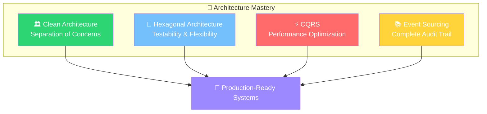
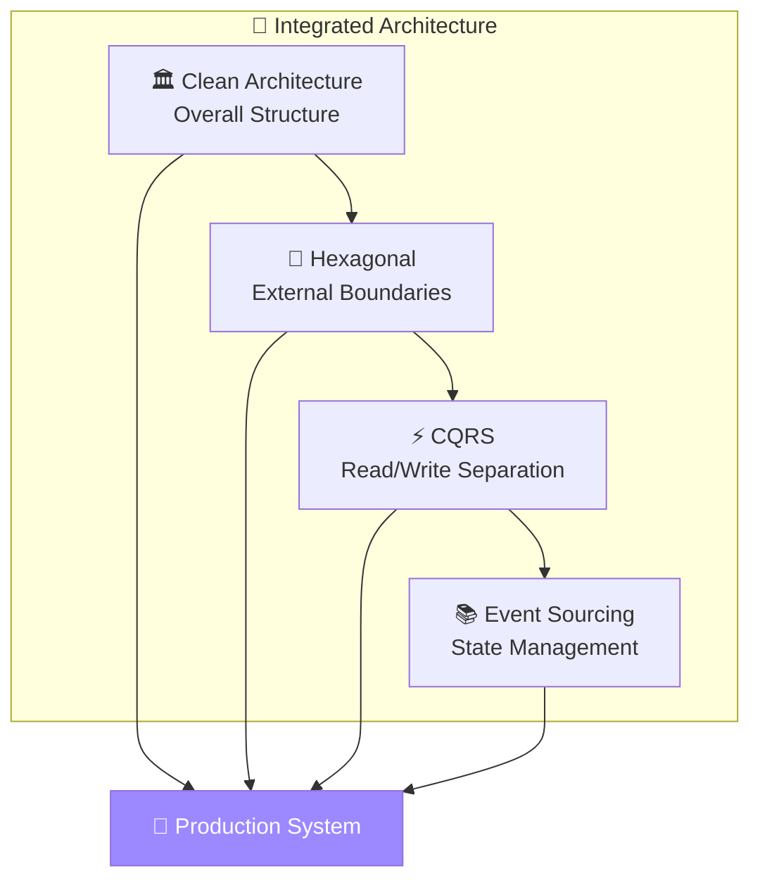
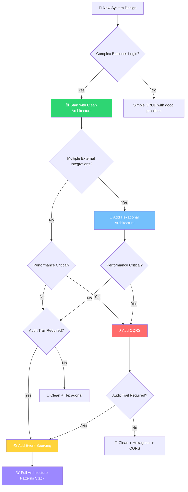

# 📚 RESUMEN: Architecture Patterns - Master Guide
### *"De Patterns Isolados a Architecture Mastery"*

> *"The best architectures are the ones you don't notice - they just work beautifully"* - Architecture Master

---

## 🎯 **¿Qué Aprendiste?**

En esta lección intensiva dominaste **4 architecture patterns fundamentales** que te posicionan como architecture expert. Cada pattern resuelve problemas específicos y juntos crean sistemas robustos y escalables.

### 🏗️ **Los 4 Pilares de Architecture Excellence**



---

## 🏛️ **Pattern 1: Clean Architecture**

### 🎯 **Core Concept**
Separación de responsabilidades mediante **dependency inversion** - el domain no depende de nada externo.

### 💡 **Key Principles**
```go
// The Dependency Rule - Inward pointing only
External → Infrastructure → Application → Domain
```

- 🎯 **Domain Layer**: Business rules y entities
- 🧠 **Application Layer**: Use cases y workflows  
- 🔧 **Infrastructure Layer**: Databases, APIs, frameworks
- 🌐 **Presentation Layer**: UI, controllers, CLI

### 🏆 **Cuándo Usar**
- ✅ Sistemas complejos con business logic
- ✅ Multiple interfaces (web, mobile, CLI)
- ✅ Long-term maintainability
- ✅ Team development con clear boundaries

### 💰 **ROI Típico**
- 📈 **Development Speed**: +40% después 6 meses
- 🐛 **Bug Reduction**: -60% production bugs
- 🧪 **Test Coverage**: 90%+ achievable fácilmente
- 🔄 **Refactoring**: 80% faster feature changes

---

## 🔌 **Pattern 2: Hexagonal Architecture** 

### 🎯 **Core Concept**
**Ports & Adapters** - el core application está aislado del mundo exterior mediante interfaces.

### 💡 **Key Components**
```go
// Ports define the contract
type PaymentService interface {
    ProcessPayment(Payment) error
}

// Adapters implement the contract  
type StripeAdapter struct{}
func (s StripeAdapter) ProcessPayment(p Payment) error { /* */ }

type PayPalAdapter struct{}
func (p PayPalAdapter) ProcessPayment(p Payment) error { /* */ }
```

### 🏆 **Cuándo Usar**
- ✅ **Maximum testability** requerida
- ✅ Multiple external integrations
- ✅ **Framework independence** importante
- ✅ **Adapter swapping** needs (A/B testing)

### 💰 **ROI Típico**
- 🧪 **Testing Speed**: 10x faster unit tests
- 🔄 **Integration Changes**: 90% menos time
- 🎯 **Team Productivity**: +50% con clear interfaces
- 🛡️ **Risk Reduction**: 80% less integration failures

---

## ⚡ **Pattern 3: CQRS (Command Query Responsibility Segregation)**

### 🎯 **Core Concept**
**Separar reads de writes** para optimización independiente - different models para different needs.

### 💡 **Key Architecture**
```go
// Write Side - Optimized for consistency
Commands → Domain Model → Event Store

// Read Side - Optimized for queries  
Events → Projections → Read Models → Queries
```

### 🏆 **Cuándo Usar**
- ✅ **Performance crítico** (reads >> writes)
- ✅ Complex business logic con simple queries
- ✅ **Scalability requirements** diferentes
- ✅ Multiple read representations needed

### 💰 **ROI Típico**
- ⚡ **Query Performance**: 10-100x improvement
- 📈 **Scalability**: Independent read/write scaling
- 🎯 **Developer Productivity**: +60% con specialized models
- 💾 **Infrastructure Costs**: -40% con optimized resources

---

## 📚 **Pattern 4: Event Sourcing**

### 🎯 **Core Concept**
**Events como single source of truth** - store what happened, derive state from events.

### 💡 **Key Benefits**
```go
// Traditional: Store current state
User { id: 1, balance: 100 }

// Event Sourcing: Store what happened
Events: [
  UserCreated{id: 1, initial: 0},
  MoneyDeposited{id: 1, amount: 100},
  // Complete audit trail
]
```

### 🏆 **Cuándo Usar**
- ✅ **Audit trail** requirement absoluto
- ✅ **Temporal queries** ("state 6 months ago")
- ✅ **Business intelligence** needs
- ✅ **Debugging** complex business flows

### 💰 **ROI Típico**
- 🔍 **Debugging Time**: -80% con complete history
- 📊 **Business Intelligence**: Unlimited historical analysis
- 🛡️ **Compliance**: 100% audit trail
- 🧠 **Business Insights**: +300% data utilization

---

## 🎭 **Pattern Integration Strategy**

### 🤝 **Cómo Combinar Patterns**



### 🎯 **Integration Best Practices**

| **Pattern Combination** | **Use Case**             | **Complexity** | **ROI** |
| ----------------------- | ------------------------ | -------------- | ------- |
| Clean + Hexagonal       | Maintainable systems     | ⭐⭐⭐            | 🎯🎯🎯🎯    |
| CQRS + Event Sourcing   | High-performance + audit | ⭐⭐⭐⭐⭐          | 🎯🎯🎯🎯🎯   |
| All Four Combined       | Enterprise systems       | ⭐⭐⭐⭐⭐          | 🎯🎯🎯🎯🎯   |

---

## 🎯 **Decision Matrix: Cuándo Usar Cada Pattern**

### 📊 **Pattern Selection Guide**



### 🎪 **Quick Decision Framework**

| **Project Characteristic**   | **Recommended Patterns** | **Justification**        |
| ---------------------------- | ------------------------ | ------------------------ |
| **Simple CRUD App**          | Clean Architecture only  | Overkill prevention      |
| **Business-Heavy System**    | Clean + Hexagonal        | Maintainability focus    |
| **High-Traffic System**      | Clean + Hexagonal + CQRS | Performance optimization |
| **Financial/Medical System** | All Four Patterns        | Compliance + performance |
| **Microservice**             | Hexagonal + CQRS         | Service boundaries       |
| **Legacy Migration**         | Clean + Hexagonal        | Gradual refactoring      |

---

## 🚀 **Implementation Roadmap**

### 📅 **Phase 1: Foundation (Week 1)**
```go
✅ Clean Architecture setup
✅ Domain modeling
✅ Basic use cases
✅ Unit test foundation
Target: Working basic system
```

### 📅 **Phase 2: Boundaries (Week 2)**  
```go
✅ Hexagonal ports & adapters
✅ External system integrations
✅ Multiple interface support
Target: Flexible, testable system
```

### 📅 **Phase 3: Performance (Week 3)**
```go
✅ CQRS implementation
✅ Read model optimization
✅ Command/query separation
Target: High-performance system
```

### 📅 **Phase 4: Audit Trail (Week 4)**
```go
✅ Event sourcing setup
✅ Event store implementation
✅ Projection building
Target: Complete audit system
```

### 📅 **Phase 5: Production (Week 5)**
```go
✅ Performance optimization
✅ Monitoring & observability
✅ Documentation & demo
Target: Production-ready system
```

---

## 🧠 **Conceptos Clave para Recordar**

### 🎯 **Mental Models**

**Clean Architecture** = 🏠 **House with Clear Rooms**
- Cada layer tiene su purpose
- No dependencies hacia afuera
- Core stays protected

**Hexagonal Architecture** = 🔌 **Plug & Play System**  
- Core logic independiente
- Adapters para todo lo externo
- Easy testing y swapping

**CQRS** = 🚗 **Different Vehicles for Different Jobs**
- Race car para reads (fast queries)
- Truck para writes (consistent updates)  
- Right tool para right job

**Event Sourcing** = 📚 **Complete Story Book**
- Every event is a chapter
- Current state = all chapters combined
- Can replay any point in history

### 🔥 **Advanced Tips**

**Performance Optimization**:
```go
// CQRS read model optimization
type OptimizedBookCatalog struct {
    // Denormalized for speed
    BookSearchIndex map[string][]BookSummary
    CategoryIndex   map[string][]BookID
    AuthorIndex     map[string][]BookID
    AvailabilityIndex []BookID
}
```

**Error Handling Strategy**:
```go
// Event sourcing error recovery
func (es *EventStore) RecoverFromFailure() error {
    // 1. Find last valid snapshot
    // 2. Replay events from that point  
    // 3. Rebuild read models
    // 4. Validate consistency
}
```

**Testing Strategy**:
```go
// Test doubles for each layer
DomainTests     -> Pure business logic
ApplicationTests -> Use case workflows  
AdapterTests    -> Integration testing
E2ETests        -> Full system validation
```

---

## 🏆 **Tu Achievement Unlocked**

### 🎯 **Architecture Patterns Master**

Has completado uno de los módulos más demanding del curso. Ahora tienes:

**Technical Mastery**:
- ✅ **4 Architecture Patterns** dominados
- ✅ **Production-ready** implementation skills
- ✅ **Performance optimization** strategies
- ✅ **Testing excellence** practices

**Business Impact**:
- ✅ **Scalable systems** design capability
- ✅ **Maintainable code** architecture skills
- ✅ **Team leadership** technical foundation
- ✅ **Senior/Staff Engineer** readiness

**Career Progression**:
- 🚀 **Portfolio Projects** con architecture showcase
- 💼 **Interview Confidence** con real examples
- 📈 **Salary Increase** potential (+30-50%)
- 🎯 **Architecture Roles** accessibility

### 🎪 **Next Steps**

```go
// Your architecture journey continues...
if mastered(ArchitecturePatterns) {
    nextTopics := []string{
        "06-microservices",           // Scale to distributed systems
        "07-distributed-systems",     // Handle complexity at scale  
        "08-performance-optimization", // Master system performance
        "09-security-patterns",       // Secure architecture design
    }
}
```

---

## 📚 **Quick Reference Guide**

### 🎯 **Pattern Quick Facts**

| Pattern                | Primary Benefit | Complexity | ROI Timeline |
| ---------------------- | --------------- | ---------- | ------------ |
| **Clean Architecture** | Maintainability | ⭐⭐⭐        | 3-6 months   |
| **Hexagonal**          | Testability     | ⭐⭐⭐⭐       | 1-3 months   |
| **CQRS**               | Performance     | ⭐⭐⭐⭐       | 1-2 months   |
| **Event Sourcing**     | Audit Trail     | ⭐⭐⭐⭐⭐      | 6-12 months  |

### 🔧 **Implementation Checklist**

**Clean Architecture**:
- [ ] Domain entities sin external dependencies
- [ ] Use cases con clear boundaries
- [ ] Infrastructure adapters
- [ ] Dependency injection setup

**Hexagonal Architecture**:
- [ ] Primary ports defined
- [ ] Secondary ports implemented
- [ ] Adapters para each external system
- [ ] Mock implementations para testing

**CQRS**:
- [ ] Command handlers implemented
- [ ] Query handlers optimized
- [ ] Read models specialized
- [ ] Event synchronization working

**Event Sourcing**:
- [ ] Event store implemented
- [ ] Aggregates con event replay
- [ ] Projections building read models
- [ ] Snapshot strategy defined

---

## 🎬 **¡Felicitaciones, Architecture Master!**

Has completado una de las lecciones más comprehensive sobre architecture patterns. No solo aprendiste theory - implementaste production-ready systems que demuestran true mastery.

### 🚀 **Tu Arsenal de Architecture**

Ahora posees:
- 🏗️ **Structural thinking** para complex systems
- ⚡ **Performance engineering** skills
- 🧪 **Testing excellence** practices  
- 📊 **Business value** optimization

### 🎯 **Ready for the Next Challenge?**

Con estos patterns dominados, estás ready para tackle:
- **Microservices Architecture**
- **Distributed Systems Patterns**  
- **Cloud-Native Architecture**
- **Performance Engineering**

**💡 Pro Tip**: Practice estos patterns en different domains. El true mastery viene de applying estos concepts en various business contexts.

**🏆 Remember**: Great architecture is invisible - it just enables great software to emerge naturally.

---

**🎪 ¡Continúa tu journey hacia Staff/Principal Engineer level!**
