# 🧹 Clean Architecture
### *"La Arquitectura que Uncle Bob Enseñó al Mundo"*

> *"La arquitectura grita el propósito del sistema, no los frameworks que usa"* - Robert C. Martin (Uncle Bob)

---

## 🎯 **¿Qué es Clean Architecture?**

**Clean Architecture** es un patrón arquitectónico que organiza el código en **capas concéntricas** donde las dependencias fluyen hacia adentro, hacia el núcleo del negocio. Es como construir un edificio: los cimientos (dominio) soportan todo lo demás.

### 🏢 **Analogía: Edificio de Oficinas**

```mermaid
graph TB
    subgraph "Clean Architecture Building"
        A[🏢 Presentation Layer<br/>Reception & Facade]
        B[🚀 Application Layer<br/>Management & Coordination]
        C[💼 Domain Layer<br/>Core Business Offices]
        D[🗄️ Infrastructure Layer<br/>Basement & Utilities]
    end
    
    A --> B
    B --> C
    D --> C
    
    style C fill:#2ed573,color:#fff
    style B fill:#74c0fc,color:#fff
    style A fill:#ffd43b,color:#fff
    style D fill:#ff6b6b,color:#fff
```



**En el mundo real:**
- **🏢 Recepción (Presentation)**: Donde los visitantes interactúan
- **🚀 Management (Application)**: Coordinan y organizan actividades
- **💼 Core Offices (Domain)**: Donde sucede el trabajo real del negocio
- **🗄️ Utilities (Infrastructure)**: Electricidad, agua, datos (invisible pero esencial)

---

## 🔧 **Las 4 Capas de Clean Architecture**

### 🎯 **1. Domain Layer (El Corazón)**
*"La lógica de negocio pura, sin dependencias externas"*

```go
// 📁 internal/domain/entities/user.go
package entities

import (
    "errors"
    "regexp"
    "time"
)

// User - Entidad de dominio pura
type User struct {
    id          UserID
    email       Email
    profile     UserProfile
    createdAt   time.Time
    lastLoginAt *time.Time
    status      UserStatus
}

// UserID - Value Object
type UserID struct {
    value string
}

func NewUserID() UserID {
    return UserID{value: generateUUID()}
}

func (uid UserID) String() string {
    return uid.value
}

// Email - Value Object con validación
type Email struct {
    value string
}

var emailRegex = regexp.MustCompile(`^[a-zA-Z0-9._%+\-]+@[a-zA-Z0-9.\-]+\.[a-zA-Z]{2,}$`)

func NewEmail(email string) (Email, error) {
    if !emailRegex.MatchString(email) {
        return Email{}, errors.New("invalid email format")
    }
    return Email{value: email}, nil
}

func (e Email) String() string {
    return e.value
}

// UserProfile - Value Object compuesto
type UserProfile struct {
    firstName string
    lastName  string
    bio       string
}

func NewUserProfile(firstName, lastName, bio string) (UserProfile, error) {
    if firstName == "" || lastName == "" {
        return UserProfile{}, errors.New("first name and last name are required")
    }
    
    if len(bio) > 500 {
        return UserProfile{}, errors.New("bio cannot exceed 500 characters")
    }
    
    return UserProfile{
        firstName: firstName,
        lastName:  lastName,
        bio:       bio,
    }, nil
}

func (up UserProfile) FullName() string {
    return up.firstName + " " + up.lastName
}

// UserStatus - Enum
type UserStatus int

const (
    UserStatusActive UserStatus = iota
    UserStatusInactive
    UserStatusSuspended
    UserStatusDeleted
)

// Factory method para crear User
func NewUser(email, firstName, lastName, bio string) (*User, error) {
    emailVO, err := NewEmail(email)
    if err != nil {
        return nil, err
    }
    
    profile, err := NewUserProfile(firstName, lastName, bio)
    if err != nil {
        return nil, err
    }
    
    return &User{
        id:        NewUserID(),
        email:     emailVO,
        profile:   profile,
        createdAt: time.Now(),
        status:    UserStatusActive,
    }, nil
}

// Métodos de dominio (comportamiento)
func (u *User) Activate() error {
    if u.status == UserStatusDeleted {
        return errors.New("cannot activate deleted user")
    }
    u.status = UserStatusActive
    return nil
}

func (u *User) Suspend(reason string) error {
    if u.status != UserStatusActive {
        return errors.New("can only suspend active users")
    }
    u.status = UserStatusSuspended
    return nil
}

func (u *User) RecordLogin() {
    now := time.Now()
    u.lastLoginAt = &now
}

func (u *User) IsActive() bool {
    return u.status == UserStatusActive
}

// Getters (read-only access)
func (u *User) ID() UserID { return u.id }
func (u *User) Email() Email { return u.email }
func (u *User) Profile() UserProfile { return u.profile }
func (u *User) CreatedAt() time.Time { return u.createdAt }
func (u *User) LastLoginAt() *time.Time { return u.lastLoginAt }
func (u *User) Status() UserStatus { return u.status }
```

```go
// 📁 internal/domain/repositories/user_repository.go
package repositories

import (
    "context"
    "your-app/internal/domain/entities"
)

// UserRepository - Interface definida en el dominio
type UserRepository interface {
    Save(ctx context.Context, user *entities.User) error
    FindByID(ctx context.Context, id entities.UserID) (*entities.User, error)
    FindByEmail(ctx context.Context, email entities.Email) (*entities.User, error)
    FindAll(ctx context.Context, filters UserFilters) ([]*entities.User, error)
    Delete(ctx context.Context, id entities.UserID) error
    Count(ctx context.Context, filters UserFilters) (int, error)
}

type UserFilters struct {
    Status    *entities.UserStatus
    CreatedAfter  *time.Time
    CreatedBefore *time.Time
    SearchTerm    string
    Limit         int
    Offset        int
}
```

```go
// 📁 internal/domain/services/user_domain_service.go
package services

import (
    "context"
    "errors"
    "your-app/internal/domain/entities"
    "your-app/internal/domain/repositories"
)

// UserDomainService - Lógica de dominio compleja
type UserDomainService struct {
    userRepo repositories.UserRepository
}

func NewUserDomainService(userRepo repositories.UserRepository) *UserDomainService {
    return &UserDomainService{
        userRepo: userRepo,
    }
}

// CheckEmailUniqueness - Regla de negocio: emails únicos
func (s *UserDomainService) CheckEmailUniqueness(ctx context.Context, email entities.Email) error {
    existingUser, err := s.userRepo.FindByEmail(ctx, email)
    if err != nil {
        return err
    }
    
    if existingUser != nil {
        return errors.New("email already exists")
    }
    
    return nil
}

// CanUserBeDeleted - Regla de negocio compleja
func (s *UserDomainService) CanUserBeDeleted(ctx context.Context, userID entities.UserID) (bool, error) {
    user, err := s.userRepo.FindByID(ctx, userID)
    if err != nil {
        return false, err
    }
    
    if user == nil {
        return false, errors.New("user not found")
    }
    
    // Regla: No se pueden borrar usuarios que se logearon en los últimos 30 días
    if user.LastLoginAt() != nil {
        thirtyDaysAgo := time.Now().AddDate(0, 0, -30)
        if user.LastLoginAt().After(thirtyDaysAgo) {
            return false, errors.New("cannot delete recently active user")
        }
    }
    
    return true, nil
}
```

### 🚀 **2. Application Layer (Los Casos de Uso)**
*"Orquesta las operaciones del dominio"*

```go
// 📁 internal/application/commands/create_user_command.go
package commands

import (
    "context"
    "your-app/internal/domain/entities"
    "your-app/internal/domain/repositories"
    "your-app/internal/domain/services"
)

// CreateUserCommand - DTO de entrada
type CreateUserCommand struct {
    Email     string
    FirstName string
    LastName  string
    Bio       string
}

// CreateUserResult - DTO de salida
type CreateUserResult struct {
    UserID    string
    Email     string
    FullName  string
    CreatedAt time.Time
}

// CreateUserHandler - Caso de uso
type CreateUserHandler struct {
    userRepo        repositories.UserRepository
    userDomainService *services.UserDomainService
    eventBus        EventBus
}

func NewCreateUserHandler(
    userRepo repositories.UserRepository,
    userDomainService *services.UserDomainService,
    eventBus EventBus,
) *CreateUserHandler {
    return &CreateUserHandler{
        userRepo:          userRepo,
        userDomainService: userDomainService,
        eventBus:         eventBus,
    }
}

func (h *CreateUserHandler) Handle(ctx context.Context, cmd CreateUserCommand) (*CreateUserResult, error) {
    // 1. Validar comando
    if err := h.validateCommand(cmd); err != nil {
        return nil, err
    }
    
    // 2. Crear value objects
    email, err := entities.NewEmail(cmd.Email)
    if err != nil {
        return nil, err
    }
    
    // 3. Aplicar reglas de dominio
    if err := h.userDomainService.CheckEmailUniqueness(ctx, email); err != nil {
        return nil, err
    }
    
    // 4. Crear entidad
    user, err := entities.NewUser(cmd.Email, cmd.FirstName, cmd.LastName, cmd.Bio)
    if err != nil {
        return nil, err
    }
    
    // 5. Persistir
    if err := h.userRepo.Save(ctx, user); err != nil {
        return nil, err
    }
    
    // 6. Publicar evento
    event := UserCreatedEvent{
        UserID:    user.ID().String(),
        Email:     user.Email().String(),
        FullName:  user.Profile().FullName(),
        CreatedAt: user.CreatedAt(),
    }
    
    if err := h.eventBus.Publish(ctx, event); err != nil {
        // Log error but don't fail the operation
        log.Printf("Failed to publish UserCreatedEvent: %v", err)
    }
    
    // 7. Retornar resultado
    return &CreateUserResult{
        UserID:    user.ID().String(),
        Email:     user.Email().String(),
        FullName:  user.Profile().FullName(),
        CreatedAt: user.CreatedAt(),
    }, nil
}

func (h *CreateUserHandler) validateCommand(cmd CreateUserCommand) error {
    if cmd.Email == "" {
        return errors.New("email is required")
    }
    if cmd.FirstName == "" {
        return errors.New("first name is required")
    }
    if cmd.LastName == "" {
        return errors.New("last name is required")
    }
    return nil
}
```

```go
// 📁 internal/application/queries/get_user_query.go
package queries

import (
    "context"
    "your-app/internal/domain/entities"
    "your-app/internal/domain/repositories"
)

// GetUserQuery - Query DTO
type GetUserQuery struct {
    UserID string
}

// GetUserResult - Resultado de la consulta
type GetUserResult struct {
    ID        string
    Email     string
    FirstName string
    LastName  string
    FullName  string
    Bio       string
    Status    string
    CreatedAt time.Time
    LastLoginAt *time.Time
}

// GetUserQueryHandler - Handler de consulta
type GetUserQueryHandler struct {
    userRepo repositories.UserRepository
}

func NewGetUserQueryHandler(userRepo repositories.UserRepository) *GetUserQueryHandler {
    return &GetUserQueryHandler{
        userRepo: userRepo,
    }
}

func (h *GetUserQueryHandler) Handle(ctx context.Context, query GetUserQuery) (*GetUserResult, error) {
    // 1. Crear value object
    userID := entities.UserIDFromString(query.UserID)
    
    // 2. Buscar en repositorio
    user, err := h.userRepo.FindByID(ctx, userID)
    if err != nil {
        return nil, err
    }
    
    if user == nil {
        return nil, errors.New("user not found")
    }
    
    // 3. Convertir a DTO
    return &GetUserResult{
        ID:          user.ID().String(),
        Email:       user.Email().String(),
        FirstName:   user.Profile().FirstName(),
        LastName:    user.Profile().LastName(),
        FullName:    user.Profile().FullName(),
        Bio:         user.Profile().Bio(),
        Status:      user.Status().String(),
        CreatedAt:   user.CreatedAt(),
        LastLoginAt: user.LastLoginAt(),
    }, nil
}
```

### 🌐 **3. Interface Layer (Adaptadores)**
*"Traduce entre el mundo exterior y la aplicación"*

```go
// 📁 internal/interfaces/http/user_handler.go
package http

import (
    "encoding/json"
    "net/http"
    "github.com/gorilla/mux"
    "your-app/internal/application/commands"
    "your-app/internal/application/queries"
)

// UserHandler - HTTP handlers
type UserHandler struct {
    createUserHandler    *commands.CreateUserHandler
    getUserQueryHandler  *queries.GetUserQueryHandler
}

func NewUserHandler(
    createUserHandler *commands.CreateUserHandler,
    getUserQueryHandler *queries.GetUserQueryHandler,
) *UserHandler {
    return &UserHandler{
        createUserHandler:   createUserHandler,
        getUserQueryHandler: getUserQueryHandler,
    }
}

// CreateUser - POST /users
func (h *UserHandler) CreateUser(w http.ResponseWriter, r *http.Request) {
    // 1. Parse request
    var req CreateUserRequest
    if err := json.NewDecoder(r.Body).Decode(&req); err != nil {
        h.respondError(w, "Invalid JSON", http.StatusBadRequest)
        return
    }
    
    // 2. Convert to command
    cmd := commands.CreateUserCommand{
        Email:     req.Email,
        FirstName: req.FirstName,
        LastName:  req.LastName,
        Bio:       req.Bio,
    }
    
    // 3. Execute use case
    result, err := h.createUserHandler.Handle(r.Context(), cmd)
    if err != nil {
        h.handleApplicationError(w, err)
        return
    }
    
    // 4. Convert to response
    response := CreateUserResponse{
        ID:        result.UserID,
        Email:     result.Email,
        FullName:  result.FullName,
        CreatedAt: result.CreatedAt,
    }
    
    // 5. Send response
    h.respondJSON(w, response, http.StatusCreated)
}

// GetUser - GET /users/{id}
func (h *UserHandler) GetUser(w http.ResponseWriter, r *http.Request) {
    // 1. Extract path parameter
    vars := mux.Vars(r)
    userID := vars["id"]
    
    // 2. Create query
    query := queries.GetUserQuery{UserID: userID}
    
    // 3. Execute query
    result, err := h.getUserQueryHandler.Handle(r.Context(), query)
    if err != nil {
        h.handleApplicationError(w, err)
        return
    }
    
    // 4. Convert to response
    response := GetUserResponse{
        ID:          result.ID,
        Email:       result.Email,
        FirstName:   result.FirstName,
        LastName:    result.LastName,
        Bio:         result.Bio,
        Status:      result.Status,
        CreatedAt:   result.CreatedAt,
        LastLoginAt: result.LastLoginAt,
    }
    
    // 5. Send response
    h.respondJSON(w, response, http.StatusOK)
}

// Helper methods
func (h *UserHandler) respondJSON(w http.ResponseWriter, data interface{}, status int) {
    w.Header().Set("Content-Type", "application/json")
    w.WriteHeader(status)
    json.NewEncoder(w).Encode(data)
}

func (h *UserHandler) respondError(w http.ResponseWriter, message string, status int) {
    h.respondJSON(w, map[string]string{"error": message}, status)
}

func (h *UserHandler) handleApplicationError(w http.ResponseWriter, err error) {
    // Mapear errores de aplicación a códigos HTTP
    switch {
    case errors.Is(err, errors.New("user not found")):
        h.respondError(w, err.Error(), http.StatusNotFound)
    case errors.Is(err, errors.New("email already exists")):
        h.respondError(w, err.Error(), http.StatusConflict)
    case errors.Is(err, errors.New("invalid email format")):
        h.respondError(w, err.Error(), http.StatusBadRequest)
    default:
        h.respondError(w, "Internal server error", http.StatusInternalServerError)
    }
}

// Request/Response DTOs
type CreateUserRequest struct {
    Email     string `json:"email"`
    FirstName string `json:"first_name"`
    LastName  string `json:"last_name"`
    Bio       string `json:"bio"`
}

type CreateUserResponse struct {
    ID        string    `json:"id"`
    Email     string    `json:"email"`
    FullName  string    `json:"full_name"`
    CreatedAt time.Time `json:"created_at"`
}

type GetUserResponse struct {
    ID          string     `json:"id"`
    Email       string     `json:"email"`
    FirstName   string     `json:"first_name"`
    LastName    string     `json:"last_name"`
    Bio         string     `json:"bio"`
    Status      string     `json:"status"`
    CreatedAt   time.Time  `json:"created_at"`
    LastLoginAt *time.Time `json:"last_login_at,omitempty"`
}
```

### 🗄️ **4. Infrastructure Layer (Detalles Técnicos)**
*"Implementaciones concretas de repositorios y servicios externos"*

```go
// 📁 internal/infrastructure/persistence/postgres_user_repository.go
package persistence

import (
    "context"
    "database/sql"
    "your-app/internal/domain/entities"
    "your-app/internal/domain/repositories"
)

// PostgreSQLUserRepository - Implementación concreta
type PostgreSQLUserRepository struct {
    db *sql.DB
}

func NewPostgreSQLUserRepository(db *sql.DB) *PostgreSQLUserRepository {
    return &PostgreSQLUserRepository{db: db}
}

func (r *PostgreSQLUserRepository) Save(ctx context.Context, user *entities.User) error {
    query := `
        INSERT INTO users (id, email, first_name, last_name, bio, status, created_at, last_login_at)
        VALUES ($1, $2, $3, $4, $5, $6, $7, $8)
        ON CONFLICT (id) DO UPDATE SET
            email = EXCLUDED.email,
            first_name = EXCLUDED.first_name,
            last_name = EXCLUDED.last_name,
            bio = EXCLUDED.bio,
            status = EXCLUDED.status,
            last_login_at = EXCLUDED.last_login_at
    `
    
    _, err := r.db.ExecContext(ctx, query,
        user.ID().String(),
        user.Email().String(),
        user.Profile().FirstName(),
        user.Profile().LastName(),
        user.Profile().Bio(),
        int(user.Status()),
        user.CreatedAt(),
        user.LastLoginAt(),
    )
    
    return err
}

func (r *PostgreSQLUserRepository) FindByID(ctx context.Context, id entities.UserID) (*entities.User, error) {
    query := `
        SELECT id, email, first_name, last_name, bio, status, created_at, last_login_at
        FROM users
        WHERE id = $1
    `
    
    row := r.db.QueryRowContext(ctx, query, id.String())
    
    return r.scanUser(row)
}

func (r *PostgreSQLUserRepository) FindByEmail(ctx context.Context, email entities.Email) (*entities.User, error) {
    query := `
        SELECT id, email, first_name, last_name, bio, status, created_at, last_login_at
        FROM users
        WHERE email = $1
    `
    
    row := r.db.QueryRowContext(ctx, query, email.String())
    
    return r.scanUser(row)
}

func (r *PostgreSQLUserRepository) scanUser(row *sql.Row) (*entities.User, error) {
    var (
        id, email, firstName, lastName, bio string
        status                              int
        createdAt                          time.Time
        lastLoginAt                        *time.Time
    )
    
    err := row.Scan(&id, &email, &firstName, &lastName, &bio, &status, &createdAt, &lastLoginAt)
    if err != nil {
        if err == sql.ErrNoRows {
            return nil, nil
        }
        return nil, err
    }
    
    // Reconstruct domain entity
    emailVO, err := entities.NewEmail(email)
    if err != nil {
        return nil, err
    }
    
    profile, err := entities.NewUserProfile(firstName, lastName, bio)
    if err != nil {
        return nil, err
    }
    
    userID := entities.UserIDFromString(id)
    
    return entities.ReconstructUser(
        userID,
        emailVO,
        profile,
        entities.UserStatus(status),
        createdAt,
        lastLoginAt,
    ), nil
}
```

---

## 🧪 **Testing en Clean Architecture**

### 🎯 **La Pirámide de Testing**

```mermaid
pyramid
    Unit Tests
        Domain Logic
        Value Objects
        Entity Behavior
    Integration Tests
        Repository Tests
        Handler Tests
        Database Integration
    End-to-End Tests
        HTTP API Tests
        Full User Flows
        System Integration
```

```go
// 📁 internal/domain/entities/user_test.go
package entities_test

func TestNewUser_ValidData_CreatesUser(t *testing.T) {
    // Given
    email := "john@example.com"
    firstName := "John"
    lastName := "Doe"
    bio := "Software engineer"
    
    // When
    user, err := entities.NewUser(email, firstName, lastName, bio)
    
    // Then
    assert.NoError(t, err)
    assert.NotNil(t, user)
    assert.Equal(t, email, user.Email().String())
    assert.Equal(t, "John Doe", user.Profile().FullName())
    assert.Equal(t, entities.UserStatusActive, user.Status())
    assert.False(t, user.CreatedAt().IsZero())
}

func TestUser_Suspend_ActiveUser_SuccessfullySupends(t *testing.T) {
    // Given
    user, _ := entities.NewUser("john@example.com", "John", "Doe", "Bio")
    
    // When
    err := user.Suspend("Inappropriate behavior")
    
    // Then
    assert.NoError(t, err)
    assert.Equal(t, entities.UserStatusSuspended, user.Status())
}
```

```go
// 📁 internal/application/commands/create_user_handler_test.go
package commands_test

func TestCreateUserHandler_ValidCommand_CreatesUser(t *testing.T) {
    // Given
    userRepo := &mocks.MockUserRepository{}
    domainService := &mocks.MockUserDomainService{}
    eventBus := &mocks.MockEventBus{}
    
    handler := commands.NewCreateUserHandler(userRepo, domainService, eventBus)
    
    cmd := commands.CreateUserCommand{
        Email:     "john@example.com",
        FirstName: "John",
        LastName:  "Doe",
        Bio:       "Software engineer",
    }
    
    // Setup mocks
    domainService.On("CheckEmailUniqueness", mock.Anything, mock.Anything).Return(nil)
    userRepo.On("Save", mock.Anything, mock.Anything).Return(nil)
    eventBus.On("Publish", mock.Anything, mock.Anything).Return(nil)
    
    // When
    result, err := handler.Handle(context.Background(), cmd)
    
    // Then
    assert.NoError(t, err)
    assert.NotNil(t, result)
    assert.Equal(t, "john@example.com", result.Email)
    assert.Equal(t, "John Doe", result.FullName)
    
    // Verify interactions
    userRepo.AssertExpectations(t)
    domainService.AssertExpectations(t)
    eventBus.AssertExpectations(t)
}
```

---

## 🎯 **Ventajas y Desventajas**

### ✅ **Ventajas**

- **🧪 Testabilidad Extrema**: Cada capa se testea independientemente
- **🔄 Flexibilidad**: Cambiar frameworks sin afectar el negocio
- **📐 Separación Clara**: Cada cosa en su lugar
- **🔧 Mantenibilidad**: Fácil de entender y modificar
- **👥 Escalabilidad de Equipo**: Múltiples developers trabajando en paralelo

### ❌ **Desventajas**

- **🏗️ Complejidad Inicial**: Más código para casos simples
- **📚 Curva de Aprendizaje**: Requires disciplina arquitectónica
- **⚡ Over-engineering**: Puede ser excesivo para aplicaciones simples
- **🔄 Boilerplate**: Más DTOs y mapeo entre capas

### 🎯 **¿Cuándo Usar Clean Architecture?**

**✅ Perfecto para:**
- APIs complejas con lógica de negocio
- Sistemas que evolucionarán por años
- Equipos grandes trabajando en paralelo
- Aplicaciones que necesitan testing exhaustivo
- Sistemas con múltiples interfaces (REST, GraphQL, CLI)

**❌ Evítalo para:**
- MVPs rápidos o prototipos
- CRUDs simples sin lógica de negocio
- Aplicaciones de una sola persona
- Sistemas con tiempo de vida corto

---

## 🚀 **Próximos Pasos**

Has dominado Clean Architecture! Ahora estás listo para:

1. **🔷 [Hexagonal Architecture](../hexagonal/)** - Lleva la testabilidad al siguiente nivel
2. **⚡ [CQRS](../cqrs/)** - Optimiza performance separando reads/writes
3. **📚 [Event Sourcing](../event-sourcing/)** - Construye sistemas auditables

**💡 Tu Misión**: Implementa el sistema de gestión de biblioteca usando Clean Architecture. ¡Es tu oportunidad de brillar!

---

**🎬 ¡Siguiente!** → **[Hexagonal Architecture](../hexagonal/)** para llevar la testabilidad al máximo nivel.
