# ⚡ CQRS (Command Query Responsibility Segregation)
### *"Separando Lecturas y Escrituras para Máximo Performance"*

> *"CQRS is simply the creation of two objects where there was previously only one. The separation occurs based upon whether the methods are a command or a query"* - Greg Young

---

## 🎯 **¿Qué es CQRS?**

**CQRS** (Command Query Responsibility Segregation) es un patrón que **separa las operaciones de lectura (queries) de las operaciones de escritura (commands)** en modelos de datos diferentes. Es como tener una cocina profesional con estaciones especializadas.

### 🍳 **Analogía: Cocina de Restaurante Michelin**

```mermaid
graph TB
    subgraph "Traditional Approach"
        A[👨‍🍳 Single Chef] --> B[🍽️ All Orders]
        B --> C[😵 Bottleneck]
    end
    
    subgraph "CQRS Approach"
        D[📝 Order Taking] --> E[👨‍🍳 Command Chef<br/>Hot Station]
        F[🔍 Menu Queries] --> G[👩‍🍳 Query Chef<br/>Cold Station]
        
        E --> H[💾 Write Database<br/>Normalized]
        G --> I[📊 Read Database<br/>Denormalized]
        
        H -.->|Sync| I
    end
    
    style E fill:#ff6b6b,color:#fff
    style G fill:#2ed573,color:#fff
    style H fill:#ff6b6b,color:#fff
    style I fill:#2ed573,color:#fff
```



**En la vida real:**
- **📝 Commands (Hot Station)**: Cocinar, modificar, crear platos (escritura)
- **🔍 Queries (Cold Station)**: Mostrar menú, consultar precios (lectura)
- **⚡ Especialización**: Cada chef se enfoca en lo que hace mejor
- **📊 Optimización**: Bases de datos optimizadas para su propósito específico

---

## 🏗️ **Arquitectura CQRS**

### 🎯 **Core Concepts**

```mermaid
graph TB
    subgraph "Client Applications"
        A[🌐 Web App]
        B[📱 Mobile App]
        C[🖥️ Admin Panel]
    end
    
    subgraph "CQRS Layer"
        D[📝 Command Bus]
        E[🔍 Query Bus]
    end
    
    subgraph "Command Side (Write)"
        F[📝 Command Handlers]
        G[🧠 Domain Models]
        H[💾 Write Database<br/>PostgreSQL]
    end
    
    subgraph "Query Side (Read)"
        I[🔍 Query Handlers]
        J[📊 Read Models]
        K[⚡ Read Database<br/>MongoDB/Redis]
    end
    
    subgraph "Synchronization"
        L[📡 Event Bus]
        M[🔄 Event Handlers]
    end
    
    A --> D
    A --> E
    B --> D
    B --> E
    C --> D
    C --> E
    
    D --> F
    E --> I
    
    F --> G
    G --> H
    
    I --> J
    J --> K
    
    H --> L
    L --> M
    M --> K
    
    style D fill:#ff6b6b,color:#fff
    style E fill:#2ed573,color:#fff
    style F fill:#ff6b6b,color:#fff
    style G fill:#ff6b6b,color:#fff
    style H fill:#ff6b6b,color:#fff
    style I fill:#2ed573,color:#fff
    style J fill:#2ed573,color:#fff
    style K fill:#2ed573,color:#fff
```



---

## 🔧 **Implementación Detallada**

### 📝 **Command Side (Write Operations)**

```go
// 📁 internal/cqrs/commands/user_commands.go
package commands

import (
    "context"
    "time"
)

// Command - Interface base para todos los comandos
type Command interface {
    CommandID() string
    CommandType() string
    AggregateID() string
    Timestamp() time.Time
}

// BaseCommand - Implementación base
type BaseCommand struct {
    ID          string    `json:"id"`
    Type        string    `json:"type"`
    AggregateID string    `json:"aggregate_id"`
    CreatedAt   time.Time `json:"created_at"`
    UserID      string    `json:"user_id"`     // Quien ejecuta el comando
    Metadata    map[string]interface{} `json:"metadata"`
}

func (c BaseCommand) CommandID() string { return c.ID }
func (c BaseCommand) CommandType() string { return c.Type }
func (c BaseCommand) AggregateID() string { return c.AggregateID }
func (c BaseCommand) Timestamp() time.Time { return c.CreatedAt }

// CreateUserCommand - Comando para crear usuario
type CreateUserCommand struct {
    BaseCommand
    Email     string `json:"email" validate:"required,email"`
    FirstName string `json:"first_name" validate:"required,min=2"`
    LastName  string `json:"last_name" validate:"required,min=2"`
    Bio       string `json:"bio" validate:"max=500"`
    Password  string `json:"password" validate:"required,min=8"`
}

func NewCreateUserCommand(email, firstName, lastName, bio, password, executorID string) *CreateUserCommand {
    return &CreateUserCommand{
        BaseCommand: BaseCommand{
            ID:          generateUUID(),
            Type:        "CreateUserCommand",
            AggregateID: generateUUID(), // Este será el ID del nuevo usuario
            CreatedAt:   time.Now(),
            UserID:      executorID,
        },
        Email:     email,
        FirstName: firstName,
        LastName:  lastName,
        Bio:       bio,
        Password:  password,
    }
}

// UpdateUserCommand - Comando para actualizar usuario
type UpdateUserCommand struct {
    BaseCommand
    TargetUserID string  `json:"target_user_id" validate:"required"`
    Email        *string `json:"email,omitempty" validate:"omitempty,email"`
    FirstName    *string `json:"first_name,omitempty" validate:"omitempty,min=2"`
    LastName     *string `json:"last_name,omitempty" validate:"omitempty,min=2"`
    Bio          *string `json:"bio,omitempty" validate:"omitempty,max=500"`
}

// SuspendUserCommand - Comando para suspender usuario
type SuspendUserCommand struct {
    BaseCommand
    TargetUserID string `json:"target_user_id" validate:"required"`
    Reason       string `json:"reason" validate:"required,min=10"`
    Duration     *time.Duration `json:"duration,omitempty"`
}

// DeleteUserCommand - Comando para eliminar usuario
type DeleteUserCommand struct {
    BaseCommand
    TargetUserID string `json:"target_user_id" validate:"required"`
    Reason       string `json:"reason" validate:"required,min=10"`
    HardDelete   bool   `json:"hard_delete"`
}
```

```go
// 📁 internal/cqrs/commands/command_bus.go
package commands

import (
    "context"
    "errors"
    "fmt"
    "reflect"
    "sync"
)

// CommandBus - Bus para manejar comandos
type CommandBus interface {
    Execute(ctx context.Context, command Command) (*CommandResult, error)
    RegisterHandler(commandType string, handler CommandHandler)
}

// CommandHandler - Interface para handlers de comandos
type CommandHandler interface {
    Handle(ctx context.Context, command Command) (*CommandResult, error)
    CanHandle(commandType string) bool
}

// CommandResult - Resultado de ejecutar un comando
type CommandResult struct {
    AggregateID   string                 `json:"aggregate_id"`
    Success       bool                   `json:"success"`
    Message       string                 `json:"message"`
    Data          map[string]interface{} `json:"data,omitempty"`
    Events        []DomainEvent          `json:"events,omitempty"`
    ExecutedAt    time.Time              `json:"executed_at"`
    ExecutionTime time.Duration          `json:"execution_time"`
}

// InMemoryCommandBus - Implementación en memoria del command bus
type InMemoryCommandBus struct {
    handlers map[string]CommandHandler
    mutex    sync.RWMutex
    
    // Middleware para logging, validación, etc.
    middleware []CommandMiddleware
}

type CommandMiddleware func(next CommandHandler) CommandHandler

func NewInMemoryCommandBus() *InMemoryCommandBus {
    return &InMemoryCommandBus{
        handlers: make(map[string]CommandHandler),
    }
}

func (bus *InMemoryCommandBus) RegisterHandler(commandType string, handler CommandHandler) {
    bus.mutex.Lock()
    defer bus.mutex.Unlock()
    
    bus.handlers[commandType] = handler
}

func (bus *InMemoryCommandBus) AddMiddleware(middleware CommandMiddleware) {
    bus.middleware = append(bus.middleware, middleware)
}

func (bus *InMemoryCommandBus) Execute(ctx context.Context, command Command) (*CommandResult, error) {
    start := time.Now()
    
    // 1. Buscar handler
    bus.mutex.RLock()
    handler, exists := bus.handlers[command.CommandType()]
    bus.mutex.RUnlock()
    
    if !exists {
        return nil, fmt.Errorf("no handler registered for command type: %s", command.CommandType())
    }
    
    // 2. Aplicar middleware
    finalHandler := handler
    for i := len(bus.middleware) - 1; i >= 0; i-- {
        finalHandler = bus.middleware[i](finalHandler)
    }
    
    // 3. Ejecutar comando
    result, err := finalHandler.Handle(ctx, command)
    if err != nil {
        return &CommandResult{
            AggregateID:   command.AggregateID(),
            Success:       false,
            Message:       err.Error(),
            ExecutedAt:    time.Now(),
            ExecutionTime: time.Since(start),
        }, err
    }
    
    // 4. Completar resultado
    if result != nil {
        result.ExecutedAt = time.Now()
        result.ExecutionTime = time.Since(start)
    }
    
    return result, nil
}

// Validation Middleware
func ValidationMiddleware(validator Validator) CommandMiddleware {
    return func(next CommandHandler) CommandHandler {
        return CommandHandlerFunc(func(ctx context.Context, command Command) (*CommandResult, error) {
            if err := validator.Validate(command); err != nil {
                return nil, fmt.Errorf("validation failed: %w", err)
            }
            return next.Handle(ctx, command)
        })
    }
}

// Logging Middleware
func LoggingMiddleware(logger Logger) CommandMiddleware {
    return func(next CommandHandler) CommandHandler {
        return CommandHandlerFunc(func(ctx context.Context, command Command) (*CommandResult, error) {
            logger.Info("Executing command", map[string]interface{}{
                "command_id":   command.CommandID(),
                "command_type": command.CommandType(),
                "aggregate_id": command.AggregateID(),
            })
            
            result, err := next.Handle(ctx, command)
            
            if err != nil {
                logger.Error("Command execution failed", map[string]interface{}{
                    "command_id": command.CommandID(),
                    "error":      err.Error(),
                })
            } else {
                logger.Info("Command executed successfully", map[string]interface{}{
                    "command_id":   command.CommandID(),
                    "aggregate_id": result.AggregateID,
                })
            }
            
            return result, err
        })
    }
}

// CommandHandlerFunc - Adapter para usar funciones como handlers
type CommandHandlerFunc func(ctx context.Context, command Command) (*CommandResult, error)

func (f CommandHandlerFunc) Handle(ctx context.Context, command Command) (*CommandResult, error) {
    return f(ctx, command)
}

func (f CommandHandlerFunc) CanHandle(commandType string) bool {
    // Implementación por defecto - override según necesidad
    return false
}
```

```go
// 📁 internal/cqrs/commands/user_command_handlers.go
package commands

import (
    "context"
    "errors"
    "your-app/internal/domain"
    "your-app/internal/domain/repositories"
    "your-app/internal/domain/services"
)

// CreateUserCommandHandler - Handler para crear usuarios
type CreateUserCommandHandler struct {
    userRepo         repositories.UserRepository
    userDomainService *services.UserDomainService
    passwordService  PasswordService
    eventBus         EventBus
}

func NewCreateUserCommandHandler(
    userRepo repositories.UserRepository,
    userDomainService *services.UserDomainService,
    passwordService PasswordService,
    eventBus EventBus,
) *CreateUserCommandHandler {
    return &CreateUserCommandHandler{
        userRepo:          userRepo,
        userDomainService: userDomainService,
        passwordService:   passwordService,
        eventBus:         eventBus,
    }
}

func (h *CreateUserCommandHandler) Handle(ctx context.Context, command Command) (*CommandResult, error) {
    // 1. Type assertion
    cmd, ok := command.(*CreateUserCommand)
    if !ok {
        return nil, errors.New("invalid command type")
    }
    
    // 2. Crear value objects del dominio
    email, err := domain.NewEmail(cmd.Email)
    if err != nil {
        return nil, fmt.Errorf("invalid email: %w", err)
    }
    
    // 3. Verificar reglas de negocio
    if err := h.userDomainService.CheckEmailUniqueness(ctx, email); err != nil {
        return nil, fmt.Errorf("business rule violation: %w", err)
    }
    
    // 4. Hash password
    hashedPassword, err := h.passwordService.HashPassword(cmd.Password)
    if err != nil {
        return nil, fmt.Errorf("password hashing failed: %w", err)
    }
    
    // 5. Crear aggregate
    user, err := domain.NewUser(cmd.Email, cmd.FirstName, cmd.LastName, cmd.Bio)
    if err != nil {
        return nil, fmt.Errorf("user creation failed: %w", err)
    }
    
    if err := user.SetPassword(hashedPassword); err != nil {
        return nil, fmt.Errorf("password setting failed: %w", err)
    }
    
    // 6. Persistir
    if err := h.userRepo.Save(ctx, user); err != nil {
        return nil, fmt.Errorf("persistence failed: %w", err)
    }
    
    // 7. Collect domain events
    events := user.GetUncommittedEvents()
    
    // 8. Publish events
    for _, event := range events {
        if err := h.eventBus.Publish(ctx, event); err != nil {
            // Log error but don't fail the command
            log.Errorf("Failed to publish event %s: %v", event.EventType(), err)
        }
    }
    
    // 9. Mark events as committed
    user.MarkEventsAsCommitted()
    
    return &CommandResult{
        AggregateID: user.ID().String(),
        Success:     true,
        Message:     "User created successfully",
        Data: map[string]interface{}{
            "user_id":   user.ID().String(),
            "email":     user.Email().String(),
            "full_name": user.Profile().FullName(),
        },
        Events: events,
    }, nil
}

func (h *CreateUserCommandHandler) CanHandle(commandType string) bool {
    return commandType == "CreateUserCommand"
}

// UpdateUserCommandHandler - Handler para actualizar usuarios
type UpdateUserCommandHandler struct {
    userRepo         repositories.UserRepository
    userDomainService *services.UserDomainService
    eventBus         EventBus
}

func NewUpdateUserCommandHandler(
    userRepo repositories.UserRepository,
    userDomainService *services.UserDomainService,
    eventBus EventBus,
) *UpdateUserCommandHandler {
    return &UpdateUserCommandHandler{
        userRepo:          userRepo,
        userDomainService: userDomainService,
        eventBus:         eventBus,
    }
}

func (h *UpdateUserCommandHandler) Handle(ctx context.Context, command Command) (*CommandResult, error) {
    cmd, ok := command.(*UpdateUserCommand)
    if !ok {
        return nil, errors.New("invalid command type")
    }
    
    // 1. Buscar usuario existente
    userID := domain.UserIDFromString(cmd.TargetUserID)
    user, err := h.userRepo.FindByID(ctx, userID)
    if err != nil {
        return nil, fmt.Errorf("failed to find user: %w", err)
    }
    
    if user == nil {
        return nil, errors.New("user not found")
    }
    
    // 2. Verificar permisos (ejemplo)
    if !h.canUserModify(cmd.UserID, cmd.TargetUserID) {
        return nil, errors.New("insufficient permissions")
    }
    
    // 3. Aplicar cambios
    if cmd.Email != nil {
        newEmail, err := domain.NewEmail(*cmd.Email)
        if err != nil {
            return nil, fmt.Errorf("invalid email: %w", err)
        }
        
        // Verificar unicidad si el email cambió
        if newEmail.String() != user.Email().String() {
            if err := h.userDomainService.CheckEmailUniqueness(ctx, newEmail); err != nil {
                return nil, fmt.Errorf("email uniqueness violation: %w", err)
            }
        }
        
        if err := user.ChangeEmail(newEmail); err != nil {
            return nil, fmt.Errorf("failed to change email: %w", err)
        }
    }
    
    if cmd.FirstName != nil || cmd.LastName != nil || cmd.Bio != nil {
        // Obtener valores actuales si no se proporcionan nuevos
        firstName := user.Profile().FirstName()
        if cmd.FirstName != nil {
            firstName = *cmd.FirstName
        }
        
        lastName := user.Profile().LastName()
        if cmd.LastName != nil {
            lastName = *cmd.LastName
        }
        
        bio := user.Profile().Bio()
        if cmd.Bio != nil {
            bio = *cmd.Bio
        }
        
        newProfile, err := domain.NewUserProfile(firstName, lastName, bio)
        if err != nil {
            return nil, fmt.Errorf("invalid profile data: %w", err)
        }
        
        if err := user.UpdateProfile(newProfile); err != nil {
            return nil, fmt.Errorf("failed to update profile: %w", err)
        }
    }
    
    // 4. Persistir cambios
    if err := h.userRepo.Update(ctx, user); err != nil {
        return nil, fmt.Errorf("failed to update user: %w", err)
    }
    
    // 5. Publish events
    events := user.GetUncommittedEvents()
    for _, event := range events {
        if err := h.eventBus.Publish(ctx, event); err != nil {
            log.Errorf("Failed to publish event %s: %v", event.EventType(), err)
        }
    }
    user.MarkEventsAsCommitted()
    
    return &CommandResult{
        AggregateID: user.ID().String(),
        Success:     true,
        Message:     "User updated successfully",
        Data: map[string]interface{}{
            "user_id":   user.ID().String(),
            "email":     user.Email().String(),
            "full_name": user.Profile().FullName(),
        },
        Events: events,
    }, nil
}

func (h *UpdateUserCommandHandler) CanHandle(commandType string) bool {
    return commandType == "UpdateUserCommand"
}

func (h *UpdateUserCommandHandler) canUserModify(executorID, targetID string) bool {
    // Implementar lógica de autorización
    // Por ejemplo: admin puede modificar cualquier usuario, usuario solo puede modificarse a sí mismo
    return true // Simplificado para el ejemplo
}
```

### 🔍 **Query Side (Read Operations)**

```go
// 📁 internal/cqrs/queries/user_queries.go
package queries

import (
    "context"
    "time"
)

// Query - Interface base para todas las consultas
type Query interface {
    QueryID() string
    QueryType() string
    Timestamp() time.Time
}

// BaseQuery - Implementación base
type BaseQuery struct {
    ID        string    `json:"id"`
    Type      string    `json:"type"`
    CreatedAt time.Time `json:"created_at"`
    UserID    string    `json:"user_id"` // Quien ejecuta la query
}

func (q BaseQuery) QueryID() string { return q.ID }
func (q BaseQuery) QueryType() string { return q.Type }
func (q BaseQuery) Timestamp() time.Time { return q.CreatedAt }

// GetUserQuery - Query para obtener un usuario específico
type GetUserQuery struct {
    BaseQuery
    TargetUserID string `json:"target_user_id" validate:"required"`
    IncludeStats bool   `json:"include_stats"`
}

func NewGetUserQuery(targetUserID, executorID string, includeStats bool) *GetUserQuery {
    return &GetUserQuery{
        BaseQuery: BaseQuery{
            ID:        generateUUID(),
            Type:      "GetUserQuery",
            CreatedAt: time.Now(),
            UserID:    executorID,
        },
        TargetUserID: targetUserID,
        IncludeStats: includeStats,
    }
}

// ListUsersQuery - Query para listar usuarios con filtros
type ListUsersQuery struct {
    BaseQuery
    Filters    UserFilters    `json:"filters"`
    Pagination PaginationInfo `json:"pagination"`
    Sorting    SortingInfo    `json:"sorting"`
}

// UserFilters - Filtros disponibles para usuarios
type UserFilters struct {
    Status        []string   `json:"status,omitempty"`
    SearchTerm    string     `json:"search_term,omitempty"`
    CreatedAfter  *time.Time `json:"created_after,omitempty"`
    CreatedBefore *time.Time `json:"created_before,omitempty"`
    Roles         []string   `json:"roles,omitempty"`
    IsActive      *bool      `json:"is_active,omitempty"`
}

// PaginationInfo - Información de paginación
type PaginationInfo struct {
    Page     int `json:"page" validate:"min=1"`
    PageSize int `json:"page_size" validate:"min=1,max=100"`
}

// SortingInfo - Información de ordenamiento
type SortingInfo struct {
    SortBy    string `json:"sort_by"`
    SortOrder string `json:"sort_order" validate:"oneof=asc desc"`
}

// GetUserStatsQuery - Query para estadísticas de usuario
type GetUserStatsQuery struct {
    BaseQuery
    TargetUserID string     `json:"target_user_id" validate:"required"`
    DateRange    *DateRange `json:"date_range,omitempty"`
}

type DateRange struct {
    Start time.Time `json:"start"`
    End   time.Time `json:"end"`
}

// SearchUsersQuery - Query para búsqueda avanzada
type SearchUsersQuery struct {
    BaseQuery
    SearchCriteria SearchCriteria `json:"search_criteria"`
    Pagination     PaginationInfo `json:"pagination"`
}

type SearchCriteria struct {
    FullTextSearch string            `json:"full_text_search"`
    Filters        map[string]string `json:"filters"`
    FacetFields    []string          `json:"facet_fields"`
}
```

```go
// 📁 internal/cqrs/queries/query_bus.go
package queries

import (
    "context"
    "errors"
    "fmt"
    "sync"
    "time"
)

// QueryBus - Bus para manejar queries
type QueryBus interface {
    Execute(ctx context.Context, query Query) (*QueryResult, error)
    RegisterHandler(queryType string, handler QueryHandler)
}

// QueryHandler - Interface para handlers de queries
type QueryHandler interface {
    Handle(ctx context.Context, query Query) (*QueryResult, error)
    CanHandle(queryType string) bool
}

// QueryResult - Resultado de ejecutar una query
type QueryResult struct {
    Data          interface{} `json:"data"`
    Success       bool        `json:"success"`
    Message       string      `json:"message,omitempty"`
    ExecutedAt    time.Time   `json:"executed_at"`
    ExecutionTime time.Duration `json:"execution_time"`
    FromCache     bool        `json:"from_cache"`
    
    // Metadata para paginación y estadísticas
    TotalCount *int64 `json:"total_count,omitempty"`
    Page       *int   `json:"page,omitempty"`
    PageSize   *int   `json:"page_size,omitempty"`
    TotalPages *int   `json:"total_pages,omitempty"`
}

// InMemoryQueryBus - Implementación en memoria del query bus
type InMemoryQueryBus struct {
    handlers   map[string]QueryHandler
    mutex      sync.RWMutex
    middleware []QueryMiddleware
}

type QueryMiddleware func(next QueryHandler) QueryHandler

func NewInMemoryQueryBus() *InMemoryQueryBus {
    return &InMemoryQueryBus{
        handlers: make(map[string]QueryHandler),
    }
}

func (bus *InMemoryQueryBus) RegisterHandler(queryType string, handler QueryHandler) {
    bus.mutex.Lock()
    defer bus.mutex.Unlock()
    
    bus.handlers[queryType] = handler
}

func (bus *InMemoryQueryBus) AddMiddleware(middleware QueryMiddleware) {
    bus.middleware = append(bus.middleware, middleware)
}

func (bus *InMemoryQueryBus) Execute(ctx context.Context, query Query) (*QueryResult, error) {
    start := time.Now()
    
    // 1. Buscar handler
    bus.mutex.RLock()
    handler, exists := bus.handlers[query.QueryType()]
    bus.mutex.RUnlock()
    
    if !exists {
        return nil, fmt.Errorf("no handler registered for query type: %s", query.QueryType())
    }
    
    // 2. Aplicar middleware
    finalHandler := handler
    for i := len(bus.middleware) - 1; i >= 0; i-- {
        finalHandler = bus.middleware[i](finalHandler)
    }
    
    // 3. Ejecutar query
    result, err := finalHandler.Handle(ctx, query)
    if err != nil {
        return &QueryResult{
            Success:       false,
            Message:       err.Error(),
            ExecutedAt:    time.Now(),
            ExecutionTime: time.Since(start),
        }, err
    }
    
    // 4. Completar resultado
    if result != nil {
        result.ExecutedAt = time.Now()
        result.ExecutionTime = time.Since(start)
    }
    
    return result, nil
}

// Caching Middleware para queries
func CachingMiddleware(cache CacheService) QueryMiddleware {
    return func(next QueryHandler) QueryHandler {
        return QueryHandlerFunc(func(ctx context.Context, query Query) (*QueryResult, error) {
            // 1. Intentar obtener del cache
            cacheKey := generateCacheKey(query)
            
            var cachedResult QueryResult
            if err := cache.Get(ctx, cacheKey, &cachedResult); err == nil {
                cachedResult.FromCache = true
                return &cachedResult, nil
            }
            
            // 2. No está en cache, ejecutar query
            result, err := next.Handle(ctx, query)
            if err != nil {
                return result, err
            }
            
            // 3. Guardar en cache (solo si es exitoso)
            if result.Success {
                go func() {
                    // Cache en background para no bloquear
                    ttl := getCacheTTL(query.QueryType())
                    cache.Set(context.Background(), cacheKey, result, ttl)
                }()
            }
            
            return result, nil
        })
    }
}

// Performance Monitoring Middleware
func PerformanceMiddleware(metrics MetricsService) QueryMiddleware {
    return func(next QueryHandler) QueryHandler {
        return QueryHandlerFunc(func(ctx context.Context, query Query) (*QueryResult, error) {
            start := time.Now()
            
            result, err := next.Handle(ctx, query)
            
            duration := time.Since(start)
            
            // Record metrics
            metrics.RecordQueryExecution(query.QueryType(), duration, err == nil)
            
            if duration > 1*time.Second {
                log.Warnf("Slow query detected: %s took %v", query.QueryType(), duration)
            }
            
            return result, err
        })
    }
}

// QueryHandlerFunc - Adapter para usar funciones como handlers
type QueryHandlerFunc func(ctx context.Context, query Query) (*QueryResult, error)

func (f QueryHandlerFunc) Handle(ctx context.Context, query Query) (*QueryResult, error) {
    return f(ctx, query)
}

func (f QueryHandlerFunc) CanHandle(queryType string) bool {
    return false
}

func generateCacheKey(query Query) string {
    // Generar clave única basada en el tipo y parámetros de la query
    return fmt.Sprintf("query:%s:%s", query.QueryType(), hashQuery(query))
}

func getCacheTTL(queryType string) time.Duration {
    // TTL diferente según tipo de query
    switch queryType {
    case "GetUserQuery":
        return 5 * time.Minute
    case "ListUsersQuery":
        return 1 * time.Minute
    case "GetUserStatsQuery":
        return 15 * time.Minute
    default:
        return 2 * time.Minute
    }
}
```

```go
// 📁 internal/cqrs/queries/user_query_handlers.go
package queries

import (
    "context"
    "errors"
    "fmt"
    "your-app/internal/readmodels"
)

// GetUserQueryHandler - Handler para obtener un usuario
type GetUserQueryHandler struct {
    userReadModel  readmodels.UserReadModel
    statsReadModel readmodels.UserStatsReadModel
}

func NewGetUserQueryHandler(
    userReadModel readmodels.UserReadModel,
    statsReadModel readmodels.UserStatsReadModel,
) *GetUserQueryHandler {
    return &GetUserQueryHandler{
        userReadModel:  userReadModel,
        statsReadModel: statsReadModel,
    }
}

func (h *GetUserQueryHandler) Handle(ctx context.Context, query Query) (*QueryResult, error) {
    q, ok := query.(*GetUserQuery)
    if !ok {
        return nil, errors.New("invalid query type")
    }
    
    // 1. Obtener datos básicos del usuario
    user, err := h.userReadModel.GetUser(ctx, q.TargetUserID)
    if err != nil {
        return nil, fmt.Errorf("failed to get user: %w", err)
    }
    
    if user == nil {
        return nil, errors.New("user not found")
    }
    
    // 2. Verificar permisos
    if !h.canUserView(q.UserID, q.TargetUserID) {
        return nil, errors.New("insufficient permissions")
    }
    
    // 3. Construir respuesta
    response := &UserDetailResponse{
        ID:          user.ID,
        Email:       user.Email,
        FirstName:   user.FirstName,
        LastName:    user.LastName,
        FullName:    user.FullName,
        Bio:         user.Bio,
        Status:      user.Status,
        CreatedAt:   user.CreatedAt,
        UpdatedAt:   user.UpdatedAt,
        LastLoginAt: user.LastLoginAt,
    }
    
    // 4. Incluir estadísticas si se solicitan
    if q.IncludeStats {
        stats, err := h.statsReadModel.GetUserStats(ctx, q.TargetUserID)
        if err != nil {
            log.Warnf("Failed to get user stats: %v", err)
        } else {
            response.Stats = stats
        }
    }
    
    return &QueryResult{
        Data:    response,
        Success: true,
        Message: "User retrieved successfully",
    }, nil
}

func (h *GetUserQueryHandler) CanHandle(queryType string) bool {
    return queryType == "GetUserQuery"
}

func (h *GetUserQueryHandler) canUserView(executorID, targetID string) bool {
    // Implementar lógica de autorización para lecturas
    return true // Simplificado
}

// ListUsersQueryHandler - Handler para listar usuarios
type ListUsersQueryHandler struct {
    userReadModel readmodels.UserReadModel
}

func NewListUsersQueryHandler(userReadModel readmodels.UserReadModel) *ListUsersQueryHandler {
    return &ListUsersQueryHandler{
        userReadModel: userReadModel,
    }
}

func (h *ListUsersQueryHandler) Handle(ctx context.Context, query Query) (*QueryResult, error) {
    q, ok := query.(*ListUsersQuery)
    if !ok {
        return nil, errors.New("invalid query type")
    }
    
    // 1. Convertir filtros
    filters := readmodels.UserListFilters{
        Status:        q.Filters.Status,
        SearchTerm:    q.Filters.SearchTerm,
        CreatedAfter:  q.Filters.CreatedAfter,
        CreatedBefore: q.Filters.CreatedBefore,
        IsActive:      q.Filters.IsActive,
    }
    
    // 2. Configurar paginación
    pagination := readmodels.PaginationOptions{
        Page:     q.Pagination.Page,
        PageSize: q.Pagination.PageSize,
    }
    
    // 3. Configurar ordenamiento
    sorting := readmodels.SortingOptions{
        SortBy:    q.Sorting.SortBy,
        SortOrder: q.Sorting.SortOrder,
    }
    
    // 4. Ejecutar consulta
    result, err := h.userReadModel.ListUsers(ctx, filters, pagination, sorting)
    if err != nil {
        return nil, fmt.Errorf("failed to list users: %w", err)
    }
    
    // 5. Construir respuesta
    response := &UserListResponse{
        Users:      result.Users,
        TotalCount: result.TotalCount,
        Page:       result.Page,
        PageSize:   result.PageSize,
        TotalPages: result.TotalPages,
    }
    
    return &QueryResult{
        Data:       response,
        Success:    true,
        TotalCount: &result.TotalCount,
        Page:       &result.Page,
        PageSize:   &result.PageSize,
        TotalPages: &result.TotalPages,
    }, nil
}

func (h *ListUsersQueryHandler) CanHandle(queryType string) bool {
    return queryType == "ListUsersQuery"
}

// Response DTOs
type UserDetailResponse struct {
    ID          string                 `json:"id"`
    Email       string                 `json:"email"`
    FirstName   string                 `json:"first_name"`
    LastName    string                 `json:"last_name"`
    FullName    string                 `json:"full_name"`
    Bio         string                 `json:"bio"`
    Status      string                 `json:"status"`
    CreatedAt   time.Time              `json:"created_at"`
    UpdatedAt   time.Time              `json:"updated_at"`
    LastLoginAt *time.Time             `json:"last_login_at,omitempty"`
    Stats       *UserStats             `json:"stats,omitempty"`
    Permissions []string               `json:"permissions,omitempty"`
    Metadata    map[string]interface{} `json:"metadata,omitempty"`
}

type UserStats struct {
    LoginCount       int       `json:"login_count"`
    LastLoginAt      *time.Time `json:"last_login_at"`
    ProfileViews     int       `json:"profile_views"`
    PostsCount       int       `json:"posts_count"`
    CommentsCount    int       `json:"comments_count"`
    FollowersCount   int       `json:"followers_count"`
    FollowingCount   int       `json:"following_count"`
    AccountAgeInDays int       `json:"account_age_in_days"`
}

type UserListResponse struct {
    Users      []UserSummary `json:"users"`
    TotalCount int64         `json:"total_count"`
    Page       int           `json:"page"`
    PageSize   int           `json:"page_size"`
    TotalPages int           `json:"total_pages"`
}

type UserSummary struct {
    ID          string     `json:"id"`
    Email       string     `json:"email"`
    FullName    string     `json:"full_name"`
    Status      string     `json:"status"`
    CreatedAt   time.Time  `json:"created_at"`
    LastLoginAt *time.Time `json:"last_login_at,omitempty"`
    Avatar      string     `json:"avatar,omitempty"`
}
```

---

## 🔄 **Event Sourcing & Synchronization**

```go
// 📁 internal/cqrs/events/event_bus.go
package events

import (
    "context"
    "encoding/json"
    "fmt"
    "sync"
    "time"
)

// EventBus - Bus para publicar y manejar eventos
type EventBus interface {
    Publish(ctx context.Context, event DomainEvent) error
    PublishBatch(ctx context.Context, events []DomainEvent) error
    Subscribe(eventType string, handler EventHandler)
    Unsubscribe(eventType string, handlerID string)
}

// DomainEvent - Interface para eventos de dominio
type DomainEvent interface {
    EventID() string
    EventType() string
    AggregateID() string
    AggregateType() string
    EventData() map[string]interface{}
    OccurredAt() time.Time
    Version() int
}

// EventHandler - Interface para manejar eventos
type EventHandler interface {
    Handle(ctx context.Context, event DomainEvent) error
    HandlerID() string
    EventTypes() []string
}

// InMemoryEventBus - Implementación en memoria
type InMemoryEventBus struct {
    handlers map[string][]EventHandler
    mutex    sync.RWMutex
}

func NewInMemoryEventBus() *InMemoryEventBus {
    return &InMemoryEventBus{
        handlers: make(map[string][]EventHandler),
    }
}

func (bus *InMemoryEventBus) Publish(ctx context.Context, event DomainEvent) error {
    bus.mutex.RLock()
    handlers := bus.handlers[event.EventType()]
    bus.mutex.RUnlock()
    
    for _, handler := range handlers {
        go func(h EventHandler) {
            if err := h.Handle(ctx, event); err != nil {
                log.Errorf("Event handler %s failed for event %s: %v", 
                          h.HandlerID(), event.EventID(), err)
            }
        }(handler)
    }
    
    return nil
}

func (bus *InMemoryEventBus) Subscribe(eventType string, handler EventHandler) {
    bus.mutex.Lock()
    defer bus.mutex.Unlock()
    
    bus.handlers[eventType] = append(bus.handlers[eventType], handler)
}

// UserCreatedEvent - Evento cuando se crea un usuario
type UserCreatedEvent struct {
    BaseEvent
    Email     string `json:"email"`
    FirstName string `json:"first_name"`
    LastName  string `json:"last_name"`
    FullName  string `json:"full_name"`
}

// UserUpdatedEvent - Evento cuando se actualiza un usuario
type UserUpdatedEvent struct {
    BaseEvent
    Changes map[string]interface{} `json:"changes"`
}

// BaseEvent - Implementación base de eventos
type BaseEvent struct {
    ID            string                 `json:"id"`
    Type          string                 `json:"type"`
    AggregateID   string                 `json:"aggregate_id"`
    AggregateType string                 `json:"aggregate_type"`
    Data          map[string]interface{} `json:"data"`
    OccurredAt    time.Time              `json:"occurred_at"`
    Version       int                    `json:"version"`
}

func (e BaseEvent) EventID() string { return e.ID }
func (e BaseEvent) EventType() string { return e.Type }
func (e BaseEvent) AggregateID() string { return e.AggregateID }
func (e BaseEvent) AggregateType() string { return e.AggregateType }
func (e BaseEvent) EventData() map[string]interface{} { return e.Data }
func (e BaseEvent) OccurredAt() time.Time { return e.OccurredAt }
func (e BaseEvent) Version() int { return e.Version }
```

```go
// 📁 internal/cqrs/events/read_model_handlers.go
package events

import (
    "context"
    "encoding/json"
    "your-app/internal/readmodels"
)

// UserReadModelHandler - Handler que mantiene actualizado el read model de usuarios
type UserReadModelHandler struct {
    userReadModel readmodels.UserReadModel
}

func NewUserReadModelHandler(userReadModel readmodels.UserReadModel) *UserReadModelHandler {
    return &UserReadModelHandler{
        userReadModel: userReadModel,
    }
}

func (h *UserReadModelHandler) Handle(ctx context.Context, event DomainEvent) error {
    switch event.EventType() {
    case "UserCreatedEvent":
        return h.handleUserCreated(ctx, event)
    case "UserUpdatedEvent":
        return h.handleUserUpdated(ctx, event)
    case "UserDeletedEvent":
        return h.handleUserDeleted(ctx, event)
    case "UserSuspendedEvent":
        return h.handleUserSuspended(ctx, event)
    default:
        return nil // Ignorar eventos no relevantes
    }
}

func (h *UserReadModelHandler) handleUserCreated(ctx context.Context, event DomainEvent) error {
    data := event.EventData()
    
    user := &readmodels.UserReadModelData{
        ID:        event.AggregateID(),
        Email:     data["email"].(string),
        FirstName: data["first_name"].(string),
        LastName:  data["last_name"].(string),
        FullName:  data["full_name"].(string),
        Bio:       data["bio"].(string),
        Status:    "active",
        CreatedAt: event.OccurredAt(),
        UpdatedAt: event.OccurredAt(),
        Version:   event.Version(),
    }
    
    return h.userReadModel.CreateUser(ctx, user)
}

func (h *UserReadModelHandler) handleUserUpdated(ctx context.Context, event DomainEvent) error {
    changes := event.EventData()["changes"].(map[string]interface{})
    
    updateData := &readmodels.UserUpdateData{
        ID:        event.AggregateID(),
        Changes:   changes,
        UpdatedAt: event.OccurredAt(),
        Version:   event.Version(),
    }
    
    return h.userReadModel.UpdateUser(ctx, updateData)
}

func (h *UserReadModelHandler) HandlerID() string {
    return "user_read_model_handler"
}

func (h *UserReadModelHandler) EventTypes() []string {
    return []string{
        "UserCreatedEvent",
        "UserUpdatedEvent",
        "UserDeletedEvent",
        "UserSuspendedEvent",
    }
}

// UserStatsHandler - Handler que mantiene estadísticas de usuarios
type UserStatsHandler struct {
    statsReadModel readmodels.UserStatsReadModel
}

func NewUserStatsHandler(statsReadModel readmodels.UserStatsReadModel) *UserStatsHandler {
    return &UserStatsHandler{
        statsReadModel: statsReadModel,
    }
}

func (h *UserStatsHandler) Handle(ctx context.Context, event DomainEvent) error {
    switch event.EventType() {
    case "UserCreatedEvent":
        return h.handleUserCreated(ctx, event)
    case "UserLoginEvent":
        return h.handleUserLogin(ctx, event)
    case "UserProfileViewedEvent":
        return h.handleProfileViewed(ctx, event)
    default:
        return nil
    }
}

func (h *UserStatsHandler) handleUserCreated(ctx context.Context, event DomainEvent) error {
    stats := &readmodels.UserStatsData{
        UserID:           event.AggregateID(),
        LoginCount:       0,
        ProfileViews:     0,
        PostsCount:       0,
        CommentsCount:    0,
        FollowersCount:   0,
        FollowingCount:   0,
        AccountAgeInDays: 0,
        CreatedAt:        event.OccurredAt(),
        UpdatedAt:        event.OccurredAt(),
    }
    
    return h.statsReadModel.CreateUserStats(ctx, stats)
}

func (h *UserStatsHandler) handleUserLogin(ctx context.Context, event DomainEvent) error {
    return h.statsReadModel.IncrementLoginCount(ctx, event.AggregateID(), event.OccurredAt())
}

func (h *UserStatsHandler) HandlerID() string {
    return "user_stats_handler"
}

func (h *UserStatsHandler) EventTypes() []string {
    return []string{
        "UserCreatedEvent",
        "UserLoginEvent",
        "UserProfileViewedEvent",
    }
}
```

---

## 🧪 **Testing CQRS**

```go
// 📁 internal/cqrs/commands/user_command_handlers_test.go
package commands_test

import (
    "context"
    "testing"
    "github.com/stretchr/testify/assert"
    "github.com/stretchr/testify/mock"
    "your-app/internal/cqrs/commands"
    "your-app/internal/mocks"
)

func TestCreateUserCommandHandler_ValidCommand_Success(t *testing.T) {
    // Given
    mockUserRepo := &mocks.MockUserRepository{}
    mockUserDomainService := &mocks.MockUserDomainService{}
    mockPasswordService := &mocks.MockPasswordService{}
    mockEventBus := &mocks.MockEventBus{}
    
    handler := commands.NewCreateUserCommandHandler(
        mockUserRepo,
        mockUserDomainService,
        mockPasswordService,
        mockEventBus,
    )
    
    cmd := commands.NewCreateUserCommand(
        "john@example.com",
        "John",
        "Doe",
        "Software engineer",
        "securepassword123",
        "executor-123",
    )
    
    // Setup mocks
    mockUserDomainService.On("CheckEmailUniqueness", mock.Anything, mock.Anything).Return(nil)
    mockPasswordService.On("HashPassword", "securepassword123").Return("hashedpassword", nil)
    mockUserRepo.On("Save", mock.Anything, mock.Anything).Return(nil)
    mockEventBus.On("Publish", mock.Anything, mock.Anything).Return(nil)
    
    // When
    result, err := handler.Handle(context.Background(), cmd)
    
    // Then
    assert.NoError(t, err)
    assert.NotNil(t, result)
    assert.True(t, result.Success)
    assert.Equal(t, "User created successfully", result.Message)
    assert.NotEmpty(t, result.AggregateID)
    
    // Verify mocks
    mockUserRepo.AssertExpectations(t)
    mockUserDomainService.AssertExpectations(t)
    mockPasswordService.AssertExpectations(t)
    mockEventBus.AssertExpectations(t)
}

// Integration test para command bus
func TestCommandBus_Integration_UserCreation(t *testing.T) {
    // Given - Setup real dependencies con test database
    testDB := setupTestDatabase(t)
    defer cleanupTestDatabase(t, testDB)
    
    userRepo := postgres.NewPostgreSQLUserRepository(testDB)
    userDomainService := domain.NewUserDomainService(userRepo)
    passwordService := crypto.NewBcryptPasswordService()
    eventBus := events.NewInMemoryEventBus()
    
    // Setup command bus
    commandBus := commands.NewInMemoryCommandBus()
    
    createUserHandler := commands.NewCreateUserCommandHandler(
        userRepo, userDomainService, passwordService, eventBus,
    )
    
    commandBus.RegisterHandler("CreateUserCommand", createUserHandler)
    
    // Create command
    cmd := commands.NewCreateUserCommand(
        "integration@test.com",
        "Integration",
        "Test",
        "Test user for integration testing",
        "password123",
        "test-executor",
    )
    
    // When
    result, err := commandBus.Execute(context.Background(), cmd)
    
    // Then
    assert.NoError(t, err)
    assert.NotNil(t, result)
    assert.True(t, result.Success)
    
    // Verify user was actually created in database
    createdUser, err := userRepo.FindByID(context.Background(), 
                                         domain.UserIDFromString(result.AggregateID))
    assert.NoError(t, err)
    assert.NotNil(t, createdUser)
    assert.Equal(t, "integration@test.com", createdUser.Email().String())
}
```

---

## 🎯 **Ventajas y Desventajas**

### ✅ **Ventajas**

- **⚡ Performance Supremo**: Reads y writes optimizados independientemente
- **📊 Escalabilidad**: Bases de datos especializadas para cada propósito
- **🔄 Flexibilidad**: Diferentes modelos para diferentes necesidades
- **🚀 Concurrent Operations**: Commands y queries en paralelo
- **📈 Analytics**: Read models optimizados para reporting
- **🎯 Clear Separation**: Intención clara entre modificar y consultar

### ❌ **Desventajas**

- **🏗️ Complejidad**: Arquitectura significativamente más compleja
- **🔄 Eventual Consistency**: Read models pueden estar desactualizados
- **💾 Storage Overhead**: Múltiples bases de datos
- **🧠 Mental Model**: Requiere cambio de paradigma
- **📡 Network Complexity**: Sincronización entre sistemas
- **🐛 Debugging Complexity**: Distributed debugging challenges

### 🎯 **¿Cuándo Usar CQRS?**

**✅ Perfecto para:**
- Sistemas con high read/write ratio (1000:1+)
- Aplicaciones con complex reporting requirements
- Sistemas que requieren different consistency models
- High-performance APIs con millones de usuarios
- Analytics y business intelligence integrado
- Sistemas con diferentes UX para reads/writes

**❌ Evítalo para:**
- CRUDs simples con balance 1:1 read/write
- Aplicaciones pequeñas sin requirements de performance
- Equipos sin experiencia en distributed systems
- Cuando strong consistency es critical
- Prototipos y MVPs rápidos

---

## 🚀 **Próximos Pasos**

¡Increíble! Has dominado CQRS y sus complejidades. Tu arsenal arquitectónico se vuelve cada vez más poderoso. Ahora estás listo para:

1. **📚 [Event Sourcing](../event-sourcing/)** - La combinación perfecta con CQRS
2. **🏆 [Proyecto Final](../ejercicios/)** - Integra todos los patterns aprendidos
3. **⚡ [Performance Optimization](../../01-performance-optimization/)** - Optimiza tu CQRS implementation

**💡 Tu Misión**: Implementa CQRS en tu sistema de biblioteca, separando la gestión de libros (writes) de las búsquedas y reportes (reads). Notarás el impacto inmediato en performance.

---

**🎬 ¡Siguiente!** → **[Event Sourcing](../event-sourcing/)** para cerrar con el patrón más poderoso de todos.
