# 📚 Event Sourcing
### *"El Estado es Solo una Cache: La Verdad Está en los Eventos"*

> *"Instead of storing just the current state of the data in a domain, use an append-only store to record the full series of actions taken on that data"* - Martin Fowler

---

## 🎯 **¿Qué es Event Sourcing?**

**Event Sourcing** es un patrón donde, en lugar de almacenar el estado actual, **almacenamos todos los eventos que llevaron a ese estado**. Es como tener un libro de contabilidad completo donde cada transacción queda registrada para siempre.

### 📖 **Analogía: Libro Contable vs. Balance Bancario**

```mermaid
graph TB
    subgraph "Traditional Approach"
        A[💰 Current Balance: $1,000] --> B[😵 How did we get here?]
        B --> C[❓ Unknown History]
    end
    
    subgraph "Event Sourcing Approach"
        D[📖 Event Log]
        E[📝 Deposit: +$500<br/>2024-01-15 09:00]
        F[📝 Withdrawal: -$200<br/>2024-01-16 14:30]
        G[📝 Deposit: +$700<br/>2024-01-17 11:15]
        H[💰 Current State: $1,000<br/>Calculated from Events]
        
        D --> E
        E --> F
        F --> G
        G --> H
    end
    
    I[🔄 Event Replay] --> H
    J[📊 Time Travel] --> H
    K[🔍 Complete Audit] --> H
    
    style H fill:#2ed573,color:#fff
    style A fill:#ff6b6b,color:#fff
    style D fill:#74c0fc,color:#fff
```



**En la vida real:**
- **📖 Event Log**: Cada transacción bancaria registrada
- **💰 Balance**: Se calcula sumando todas las transacciones
- **🔄 Replay**: Puedes recrear cualquier estado histórico
- **🔍 Audit**: Sabes exactamente qué, cuándo y quién

---

## 🏗️ **Arquitectura Event Sourcing**

### 🎯 **Core Components**

```mermaid
graph TB
    subgraph "Command Side"
        A[📝 Commands] --> B[🧠 Aggregate]
        B --> C[📡 Domain Events]
    end
    
    subgraph "Event Store"
        D[📚 Event Stream]
        E[Event 1: UserCreated]
        F[Event 2: EmailChanged]
        G[Event 3: ProfileUpdated]
        H[Event 4: UserSuspended]
        
        D --> E
        E --> F
        F --> G
        G --> H
    end
    
    subgraph "Query Side"
        I[📊 Projections]
        J[🔍 Read Models]
        K[📈 Reporting]
    end
    
    subgraph "Event Processing"
        L[🔄 Event Handlers]
        M[📡 Event Bus]
        N[🎯 Projectors]
    end
    
    C --> D
    D --> L
    L --> M
    M --> N
    N --> I
    I --> J
    I --> K
    
    style D fill:#2ed573,color:#fff
    style B fill:#ff6b6b,color:#fff
    style I fill:#74c0fc,color:#fff
    style M fill:#ffd43b,color:#fff
```



---

## 🔧 **Implementación Completa**

### 📡 **Event Store - El Corazón del Sistema**

```go
// 📁 internal/eventstore/event_store.go
package eventstore

import (
    "context"
    "encoding/json"
    "fmt"
    "time"
)

// EventStore - Interface principal del event store
type EventStore interface {
    // Core operations
    AppendEvents(ctx context.Context, streamID string, expectedVersion int, events []Event) error
    GetEvents(ctx context.Context, streamID string, fromVersion int) ([]Event, error)
    GetEventsRange(ctx context.Context, streamID string, fromVersion, toVersion int) ([]Event, error)
    
    // Stream operations
    GetStreamMetadata(ctx context.Context, streamID string) (*StreamMetadata, error)
    SetStreamMetadata(ctx context.Context, streamID string, metadata StreamMetadata) error
    DeleteStream(ctx context.Context, streamID string) error
    
    // Global operations
    GetAllEvents(ctx context.Context, fromPosition GlobalPosition) ([]Event, error)
    GetEventsByType(ctx context.Context, eventType string, fromPosition GlobalPosition) ([]Event, error)
    
    // Snapshots
    SaveSnapshot(ctx context.Context, streamID string, version int, snapshot Snapshot) error
    GetSnapshot(ctx context.Context, streamID string) (*Snapshot, error)
}

// Event - Evento almacenado en el event store
type Event struct {
    // Event metadata
    EventID       string                 `json:"event_id"`
    EventType     string                 `json:"event_type"`
    StreamID      string                 `json:"stream_id"`
    Version       int                    `json:"version"`
    GlobalPosition GlobalPosition        `json:"global_position"`
    
    // Event data
    Data          json.RawMessage        `json:"data"`
    Metadata      map[string]interface{} `json:"metadata"`
    
    // Timestamps
    CreatedAt     time.Time              `json:"created_at"`
    
    // Causation & Correlation (for debugging)
    CausationID   string                 `json:"causation_id,omitempty"`
    CorrelationID string                 `json:"correlation_id,omitempty"`
}

// StreamMetadata - Metadatos del stream
type StreamMetadata struct {
    StreamID       string                 `json:"stream_id"`
    CurrentVersion int                    `json:"current_version"`
    CreatedAt      time.Time              `json:"created_at"`
    UpdatedAt      time.Time              `json:"updated_at"`
    
    // Stream configuration
    MaxAge         *time.Duration         `json:"max_age,omitempty"`
    MaxCount       *int                   `json:"max_count,omitempty"`
    
    // Custom metadata
    CustomMetadata map[string]interface{} `json:"custom_metadata,omitempty"`
}

// Snapshot - Snapshot del estado de un aggregate
type Snapshot struct {
    StreamID  string          `json:"stream_id"`
    Version   int             `json:"version"`
    Data      json.RawMessage `json:"data"`
    CreatedAt time.Time       `json:"created_at"`
}

// GlobalPosition - Posición global en el event store
type GlobalPosition struct {
    CommitPosition  int64 `json:"commit_position"`
    PreparePosition int64 `json:"prepare_position"`
}

// EventStoreError - Errores específicos del event store
type EventStoreError struct {
    Code    string
    Message string
    Cause   error
}

func (e EventStoreError) Error() string {
    if e.Cause != nil {
        return fmt.Sprintf("%s: %s (caused by: %v)", e.Code, e.Message, e.Cause)
    }
    return fmt.Sprintf("%s: %s", e.Code, e.Message)
}

// Error codes
const (
    ErrCodeStreamNotFound        = "STREAM_NOT_FOUND"
    ErrCodeConcurrencyConflict   = "CONCURRENCY_CONFLICT"
    ErrCodeStreamDeleted         = "STREAM_DELETED"
    ErrCodeInvalidVersion        = "INVALID_VERSION"
    ErrCodeSerializationFailed   = "SERIALIZATION_FAILED"
)
```

```go
// 📁 internal/eventstore/postgres_event_store.go
package eventstore

import (
    "context"
    "database/sql"
    "encoding/json"
    "fmt"
    "time"
    
    "github.com/lib/pq"
)

// PostgreSQLEventStore - Implementación con PostgreSQL
type PostgreSQLEventStore struct {
    db *sql.DB
}

func NewPostgreSQLEventStore(db *sql.DB) *PostgreSQLEventStore {
    return &PostgreSQLEventStore{db: db}
}

// AppendEvents - Append events to a stream with optimistic concurrency control
func (es *PostgreSQLEventStore) AppendEvents(ctx context.Context, streamID string, expectedVersion int, events []Event) error {
    tx, err := es.db.BeginTx(ctx, nil)
    if err != nil {
        return err
    }
    defer tx.Rollback()
    
    // 1. Check current version
    var currentVersion sql.NullInt32
    err = tx.QueryRowContext(ctx, `
        SELECT current_version 
        FROM stream_metadata 
        WHERE stream_id = $1
    `, streamID).Scan(&currentVersion)
    
    if err != nil && err != sql.ErrNoRows {
        return err
    }
    
    actualVersion := -1 // Stream doesn't exist
    if currentVersion.Valid {
        actualVersion = int(currentVersion.Int32)
    }
    
    // 2. Optimistic concurrency check
    if expectedVersion != actualVersion {
        return EventStoreError{
            Code:    ErrCodeConcurrencyConflict,
            Message: fmt.Sprintf("Expected version %d, but stream is at version %d", expectedVersion, actualVersion),
        }
    }
    
    // 3. Insert events
    for i, event := range events {
        newVersion := actualVersion + i + 1
        
        _, err = tx.ExecContext(ctx, `
            INSERT INTO events (
                event_id, event_type, stream_id, version, data, metadata, 
                created_at, causation_id, correlation_id
            ) VALUES ($1, $2, $3, $4, $5, $6, $7, $8, $9)
        `, event.EventID, event.EventType, streamID, newVersion, 
           event.Data, event.Metadata, event.CreatedAt, 
           event.CausationID, event.CorrelationID)
        
        if err != nil {
            if pqErr, ok := err.(*pq.Error); ok && pqErr.Code == "23505" { // Unique violation
                return EventStoreError{
                    Code:    ErrCodeConcurrencyConflict,
                    Message: "Concurrent modification detected",
                    Cause:   err,
                }
            }
            return err
        }
    }
    
    // 4. Update stream metadata
    newCurrentVersion := actualVersion + len(events)
    
    _, err = tx.ExecContext(ctx, `
        INSERT INTO stream_metadata (stream_id, current_version, created_at, updated_at)
        VALUES ($1, $2, $3, $3)
        ON CONFLICT (stream_id) 
        DO UPDATE SET 
            current_version = $2,
            updated_at = $3
    `, streamID, newCurrentVersion, time.Now())
    
    if err != nil {
        return err
    }
    
    return tx.Commit()
}

// GetEvents - Get all events from a stream starting from a version
func (es *PostgreSQLEventStore) GetEvents(ctx context.Context, streamID string, fromVersion int) ([]Event, error) {
    rows, err := es.db.QueryContext(ctx, `
        SELECT 
            event_id, event_type, stream_id, version, global_position,
            data, metadata, created_at, causation_id, correlation_id
        FROM events 
        WHERE stream_id = $1 AND version >= $2
        ORDER BY version ASC
    `, streamID, fromVersion)
    
    if err != nil {
        return nil, err
    }
    defer rows.Close()
    
    var events []Event
    for rows.Next() {
        var event Event
        var causationID, correlationID sql.NullString
        
        err = rows.Scan(
            &event.EventID, &event.EventType, &event.StreamID, &event.Version,
            &event.GlobalPosition, &event.Data, &event.Metadata,
            &event.CreatedAt, &causationID, &correlationID,
        )
        
        if err != nil {
            return nil, err
        }
        
        if causationID.Valid {
            event.CausationID = causationID.String
        }
        if correlationID.Valid {
            event.CorrelationID = correlationID.String
        }
        
        events = append(events, event)
    }
    
    return events, rows.Err()
}

// GetAllEvents - Get all events from all streams (for projections)
func (es *PostgreSQLEventStore) GetAllEvents(ctx context.Context, fromPosition GlobalPosition) ([]Event, error) {
    rows, err := es.db.QueryContext(ctx, `
        SELECT 
            event_id, event_type, stream_id, version, global_position,
            data, metadata, created_at, causation_id, correlation_id
        FROM events 
        WHERE global_position > $1
        ORDER BY global_position ASC
        LIMIT 1000
    `, fromPosition.CommitPosition)
    
    if err != nil {
        return nil, err
    }
    defer rows.Close()
    
    var events []Event
    for rows.Next() {
        var event Event
        var causationID, correlationID sql.NullString
        
        err = rows.Scan(
            &event.EventID, &event.EventType, &event.StreamID, &event.Version,
            &event.GlobalPosition, &event.Data, &event.Metadata,
            &event.CreatedAt, &causationID, &correlationID,
        )
        
        if err != nil {
            return nil, err
        }
        
        if causationID.Valid {
            event.CausationID = causationID.String
        }
        if correlationID.Valid {
            event.CorrelationID = correlationID.String
        }
        
        events = append(events, event)
    }
    
    return events, rows.Err()
}

// SaveSnapshot - Save a snapshot for an aggregate
func (es *PostgreSQLEventStore) SaveSnapshot(ctx context.Context, streamID string, version int, snapshot Snapshot) error {
    _, err := es.db.ExecContext(ctx, `
        INSERT INTO snapshots (stream_id, version, data, created_at)
        VALUES ($1, $2, $3, $4)
        ON CONFLICT (stream_id)
        DO UPDATE SET 
            version = $2,
            data = $3,
            created_at = $4
        WHERE snapshots.version < $2
    `, streamID, version, snapshot.Data, snapshot.CreatedAt)
    
    return err
}

// GetSnapshot - Get the latest snapshot for an aggregate
func (es *PostgreSQLEventStore) GetSnapshot(ctx context.Context, streamID string) (*Snapshot, error) {
    var snapshot Snapshot
    
    err := es.db.QueryRowContext(ctx, `
        SELECT stream_id, version, data, created_at
        FROM snapshots
        WHERE stream_id = $1
    `, streamID).Scan(&snapshot.StreamID, &snapshot.Version, &snapshot.Data, &snapshot.CreatedAt)
    
    if err != nil {
        if err == sql.ErrNoRows {
            return nil, nil
        }
        return nil, err
    }
    
    return &snapshot, nil
}
```

### 🧠 **Event-Sourced Aggregate**

```go
// 📁 internal/domain/user_aggregate.go
package domain

import (
    "encoding/json"
    "errors"
    "time"
    "your-app/internal/eventstore"
)

// UserAggregate - Aggregate que usa event sourcing
type UserAggregate struct {
    // State
    id              UserID
    email           Email
    profile         UserProfile
    passwordHash    string
    status          UserStatus
    createdAt       time.Time
    updatedAt       time.Time
    lastLoginAt     *time.Time
    
    // Event sourcing fields
    version            int
    uncommittedEvents  []DomainEvent
    isReplay           bool
}

// NewUserAggregate - Create new user aggregate
func NewUserAggregate(email, firstName, lastName, bio, password string) (*UserAggregate, error) {
    // Validate input
    emailVO, err := NewEmail(email)
    if err != nil {
        return nil, err
    }
    
    profile, err := NewUserProfile(firstName, lastName, bio)
    if err != nil {
        return nil, err
    }
    
    // Create aggregate
    aggregate := &UserAggregate{
        id:      NewUserID(),
        version: -1, // New aggregate starts at -1
    }
    
    // Apply creation event
    event := NewUserCreatedEvent(
        aggregate.id,
        emailVO,
        profile,
        password,
        time.Now(),
    )
    
    aggregate.Apply(event)
    return aggregate, nil
}

// LoadFromHistory - Reconstruct aggregate from events
func LoadUserAggregateFromHistory(events []eventstore.Event) (*UserAggregate, error) {
    if len(events) == 0 {
        return nil, errors.New("cannot load aggregate from empty event stream")
    }
    
    aggregate := &UserAggregate{
        version:   -1,
        isReplay:  true,
    }
    
    for _, event := range events {
        domainEvent, err := DeserializeDomainEvent(event)
        if err != nil {
            return nil, err
        }
        
        aggregate.Apply(domainEvent)
    }
    
    aggregate.isReplay = false
    return aggregate, nil
}

// Apply - Apply a domain event to the aggregate
func (u *UserAggregate) Apply(event DomainEvent) {
    switch e := event.(type) {
    case *UserCreatedEvent:
        u.applyUserCreated(e)
    case *UserEmailChangedEvent:
        u.applyUserEmailChanged(e)
    case *UserProfileUpdatedEvent:
        u.applyUserProfileUpdated(e)
    case *UserPasswordChangedEvent:
        u.applyUserPasswordChanged(e)
    case *UserSuspendedEvent:
        u.applyUserSuspended(e)
    case *UserActivatedEvent:
        u.applyUserActivated(e)
    case *UserLoginRecordedEvent:
        u.applyUserLoginRecorded(e)
    case *UserDeletedEvent:
        u.applyUserDeleted(e)
    default:
        // Ignore unknown events for forward compatibility
    }
    
    u.version++
    
    // Only add to uncommitted events if not replaying
    if !u.isReplay {
        u.uncommittedEvents = append(u.uncommittedEvents, event)
    }
}

// Business methods that generate events
func (u *UserAggregate) ChangeEmail(newEmail Email) error {
    if u.status == UserStatusDeleted {
        return errors.New("cannot change email of deleted user")
    }
    
    if u.email.String() == newEmail.String() {
        return errors.New("new email is the same as current email")
    }
    
    event := NewUserEmailChangedEvent(
        u.id,
        u.email,    // old email
        newEmail,   // new email
        time.Now(),
    )
    
    u.Apply(event)
    return nil
}

func (u *UserAggregate) UpdateProfile(newProfile UserProfile) error {
    if u.status == UserStatusDeleted {
        return errors.New("cannot update profile of deleted user")
    }
    
    event := NewUserProfileUpdatedEvent(
        u.id,
        u.profile,    // old profile
        newProfile,   // new profile
        time.Now(),
    )
    
    u.Apply(event)
    return nil
}

func (u *UserAggregate) ChangePassword(newPasswordHash string) error {
    if u.status == UserStatusDeleted {
        return errors.New("cannot change password of deleted user")
    }
    
    event := NewUserPasswordChangedEvent(
        u.id,
        time.Now(),
    )
    
    u.Apply(event)
    return nil
}

func (u *UserAggregate) Suspend(reason string) error {
    if u.status != UserStatusActive {
        return errors.New("can only suspend active users")
    }
    
    event := NewUserSuspendedEvent(
        u.id,
        reason,
        time.Now(),
    )
    
    u.Apply(event)
    return nil
}

func (u *UserAggregate) Activate() error {
    if u.status == UserStatusDeleted {
        return errors.New("cannot activate deleted user")
    }
    
    if u.status == UserStatusActive {
        return errors.New("user is already active")
    }
    
    event := NewUserActivatedEvent(
        u.id,
        time.Now(),
    )
    
    u.Apply(event)
    return nil
}

func (u *UserAggregate) RecordLogin() error {
    if u.status != UserStatusActive {
        return errors.New("only active users can login")
    }
    
    event := NewUserLoginRecordedEvent(
        u.id,
        time.Now(),
    )
    
    u.Apply(event)
    return nil
}

func (u *UserAggregate) Delete(reason string) error {
    if u.status == UserStatusDeleted {
        return errors.New("user is already deleted")
    }
    
    event := NewUserDeletedEvent(
        u.id,
        reason,
        time.Now(),
    )
    
    u.Apply(event)
    return nil
}

// Event application methods
func (u *UserAggregate) applyUserCreated(event *UserCreatedEvent) {
    u.id = event.UserID
    u.email = event.Email
    u.profile = event.Profile
    u.passwordHash = event.PasswordHash
    u.status = UserStatusActive
    u.createdAt = event.OccurredAt
    u.updatedAt = event.OccurredAt
}

func (u *UserAggregate) applyUserEmailChanged(event *UserEmailChangedEvent) {
    u.email = event.NewEmail
    u.updatedAt = event.OccurredAt
}

func (u *UserAggregate) applyUserProfileUpdated(event *UserProfileUpdatedEvent) {
    u.profile = event.NewProfile
    u.updatedAt = event.OccurredAt
}

func (u *UserAggregate) applyUserPasswordChanged(event *UserPasswordChangedEvent) {
    u.updatedAt = event.OccurredAt
    // Note: password hash is not stored in the event for security
}

func (u *UserAggregate) applyUserSuspended(event *UserSuspendedEvent) {
    u.status = UserStatusSuspended
    u.updatedAt = event.OccurredAt
}

func (u *UserAggregate) applyUserActivated(event *UserActivatedEvent) {
    u.status = UserStatusActive
    u.updatedAt = event.OccurredAt
}

func (u *UserAggregate) applyUserLoginRecorded(event *UserLoginRecordedEvent) {
    u.lastLoginAt = &event.OccurredAt
    u.updatedAt = event.OccurredAt
}

func (u *UserAggregate) applyUserDeleted(event *UserDeletedEvent) {
    u.status = UserStatusDeleted
    u.updatedAt = event.OccurredAt
}

// Getters
func (u *UserAggregate) ID() UserID { return u.id }
func (u *UserAggregate) Email() Email { return u.email }
func (u *UserAggregate) Profile() UserProfile { return u.profile }
func (u *UserAggregate) Status() UserStatus { return u.status }
func (u *UserAggregate) Version() int { return u.version }
func (u *UserAggregate) CreatedAt() time.Time { return u.createdAt }
func (u *UserAggregate) UpdatedAt() time.Time { return u.updatedAt }
func (u *UserAggregate) LastLoginAt() *time.Time { return u.lastLoginAt }

// Event sourcing helpers
func (u *UserAggregate) GetUncommittedEvents() []DomainEvent {
    return u.uncommittedEvents
}

func (u *UserAggregate) MarkEventsAsCommitted() {
    u.uncommittedEvents = nil
}

func (u *UserAggregate) IsActive() bool {
    return u.status == UserStatusActive
}
```

### 📡 **Domain Events**

```go
// 📁 internal/domain/user_events.go
package domain

import (
    "encoding/json"
    "time"
)

// DomainEvent - Interface base para eventos de dominio
type DomainEvent interface {
    EventID() string
    EventType() string
    AggregateID() string
    AggregateType() string
    OccurredAt() time.Time
    EventData() map[string]interface{}
    ToEventStoreEvent() eventstore.Event
}

// BaseDomainEvent - Implementación base
type BaseDomainEvent struct {
    ID            string    `json:"id"`
    Type          string    `json:"type"`
    AggregateID   string    `json:"aggregate_id"`
    AggregateType string    `json:"aggregate_type"`
    OccurredAt    time.Time `json:"occurred_at"`
}

func (e BaseDomainEvent) EventID() string { return e.ID }
func (e BaseDomainEvent) EventType() string { return e.Type }
func (e BaseDomainEvent) AggregateID() string { return e.AggregateID }
func (e BaseDomainEvent) AggregateType() string { return e.AggregateType }
func (e BaseDomainEvent) OccurredAt() time.Time { return e.OccurredAt }

// UserCreatedEvent - Usuario creado
type UserCreatedEvent struct {
    BaseDomainEvent
    UserID       UserID      `json:"user_id"`
    Email        Email       `json:"email"`
    Profile      UserProfile `json:"profile"`
    PasswordHash string      `json:"password_hash"`
}

func NewUserCreatedEvent(userID UserID, email Email, profile UserProfile, passwordHash string, occurredAt time.Time) *UserCreatedEvent {
    return &UserCreatedEvent{
        BaseDomainEvent: BaseDomainEvent{
            ID:            generateUUID(),
            Type:          "UserCreatedEvent",
            AggregateID:   userID.String(),
            AggregateType: "User",
            OccurredAt:    occurredAt,
        },
        UserID:       userID,
        Email:        email,
        Profile:      profile,
        PasswordHash: passwordHash,
    }
}

func (e *UserCreatedEvent) EventData() map[string]interface{} {
    return map[string]interface{}{
        "user_id":       e.UserID.String(),
        "email":         e.Email.String(),
        "first_name":    e.Profile.FirstName(),
        "last_name":     e.Profile.LastName(),
        "full_name":     e.Profile.FullName(),
        "bio":           e.Profile.Bio(),
        "password_hash": e.PasswordHash,
    }
}

func (e *UserCreatedEvent) ToEventStoreEvent() eventstore.Event {
    data, _ := json.Marshal(e.EventData())
    
    return eventstore.Event{
        EventID:   e.EventID(),
        EventType: e.EventType(),
        StreamID:  e.AggregateID(),
        Data:      data,
        CreatedAt: e.OccurredAt(),
        Metadata: map[string]interface{}{
            "aggregate_type": e.AggregateType(),
            "event_version":  "1.0",
        },
    }
}

// UserEmailChangedEvent - Email cambiado
type UserEmailChangedEvent struct {
    BaseDomainEvent
    UserID   UserID `json:"user_id"`
    OldEmail Email  `json:"old_email"`
    NewEmail Email  `json:"new_email"`
}

func NewUserEmailChangedEvent(userID UserID, oldEmail, newEmail Email, occurredAt time.Time) *UserEmailChangedEvent {
    return &UserEmailChangedEvent{
        BaseDomainEvent: BaseDomainEvent{
            ID:            generateUUID(),
            Type:          "UserEmailChangedEvent",
            AggregateID:   userID.String(),
            AggregateType: "User",
            OccurredAt:    occurredAt,
        },
        UserID:   userID,
        OldEmail: oldEmail,
        NewEmail: newEmail,
    }
}

func (e *UserEmailChangedEvent) EventData() map[string]interface{} {
    return map[string]interface{}{
        "user_id":   e.UserID.String(),
        "old_email": e.OldEmail.String(),
        "new_email": e.NewEmail.String(),
    }
}

func (e *UserEmailChangedEvent) ToEventStoreEvent() eventstore.Event {
    data, _ := json.Marshal(e.EventData())
    
    return eventstore.Event{
        EventID:   e.EventID(),
        EventType: e.EventType(),
        StreamID:  e.AggregateID(),
        Data:      data,
        CreatedAt: e.OccurredAt(),
        Metadata: map[string]interface{}{
            "aggregate_type": e.AggregateType(),
            "event_version":  "1.0",
        },
    }
}

// UserProfileUpdatedEvent - Perfil actualizado
type UserProfileUpdatedEvent struct {
    BaseDomainEvent
    UserID     UserID      `json:"user_id"`
    OldProfile UserProfile `json:"old_profile"`
    NewProfile UserProfile `json:"new_profile"`
}

func NewUserProfileUpdatedEvent(userID UserID, oldProfile, newProfile UserProfile, occurredAt time.Time) *UserProfileUpdatedEvent {
    return &UserProfileUpdatedEvent{
        BaseDomainEvent: BaseDomainEvent{
            ID:            generateUUID(),
            Type:          "UserProfileUpdatedEvent",
            AggregateID:   userID.String(),
            AggregateType: "User",
            OccurredAt:    occurredAt,
        },
        UserID:     userID,
        OldProfile: oldProfile,
        NewProfile: newProfile,
    }
}

func (e *UserProfileUpdatedEvent) EventData() map[string]interface{} {
    return map[string]interface{}{
        "user_id": e.UserID.String(),
        "old_profile": map[string]interface{}{
            "first_name": e.OldProfile.FirstName(),
            "last_name":  e.OldProfile.LastName(),
            "bio":        e.OldProfile.Bio(),
        },
        "new_profile": map[string]interface{}{
            "first_name": e.NewProfile.FirstName(),
            "last_name":  e.NewProfile.LastName(),
            "bio":        e.NewProfile.Bio(),
        },
        "changes": e.calculateChanges(),
    }
}

func (e *UserProfileUpdatedEvent) calculateChanges() map[string]interface{} {
    changes := make(map[string]interface{})
    
    if e.OldProfile.FirstName() != e.NewProfile.FirstName() {
        changes["first_name"] = map[string]string{
            "from": e.OldProfile.FirstName(),
            "to":   e.NewProfile.FirstName(),
        }
    }
    
    if e.OldProfile.LastName() != e.NewProfile.LastName() {
        changes["last_name"] = map[string]string{
            "from": e.OldProfile.LastName(),
            "to":   e.NewProfile.LastName(),
        }
    }
    
    if e.OldProfile.Bio() != e.NewProfile.Bio() {
        changes["bio"] = map[string]string{
            "from": e.OldProfile.Bio(),
            "to":   e.NewProfile.Bio(),
        }
    }
    
    return changes
}

func (e *UserProfileUpdatedEvent) ToEventStoreEvent() eventstore.Event {
    data, _ := json.Marshal(e.EventData())
    
    return eventstore.Event{
        EventID:   e.EventID(),
        EventType: e.EventType(),
        StreamID:  e.AggregateID(),
        Data:      data,
        CreatedAt: e.OccurredAt(),
        Metadata: map[string]interface{}{
            "aggregate_type": e.AggregateType(),
            "event_version":  "1.0",
        },
    }
}

// UserSuspendedEvent - Usuario suspendido
type UserSuspendedEvent struct {
    BaseDomainEvent
    UserID UserID `json:"user_id"`
    Reason string `json:"reason"`
}

func NewUserSuspendedEvent(userID UserID, reason string, occurredAt time.Time) *UserSuspendedEvent {
    return &UserSuspendedEvent{
        BaseDomainEvent: BaseDomainEvent{
            ID:            generateUUID(),
            Type:          "UserSuspendedEvent",
            AggregateID:   userID.String(),
            AggregateType: "User",
            OccurredAt:    occurredAt,
        },
        UserID: userID,
        Reason: reason,
    }
}

func (e *UserSuspendedEvent) EventData() map[string]interface{} {
    return map[string]interface{}{
        "user_id": e.UserID.String(),
        "reason":  e.Reason,
    }
}

func (e *UserSuspendedEvent) ToEventStoreEvent() eventstore.Event {
    data, _ := json.Marshal(e.EventData())
    
    return eventstore.Event{
        EventID:   e.EventID(),
        EventType: e.EventType(),
        StreamID:  e.AggregateID(),
        Data:      data,
        CreatedAt: e.OccurredAt(),
        Metadata: map[string]interface{}{
            "aggregate_type": e.AggregateType(),
            "event_version":  "1.0",
            "reason":         e.Reason,
        },
    }
}

// UserLoginRecordedEvent - Login registrado
type UserLoginRecordedEvent struct {
    BaseDomainEvent
    UserID UserID `json:"user_id"`
}

func NewUserLoginRecordedEvent(userID UserID, occurredAt time.Time) *UserLoginRecordedEvent {
    return &UserLoginRecordedEvent{
        BaseDomainEvent: BaseDomainEvent{
            ID:            generateUUID(),
            Type:          "UserLoginRecordedEvent",
            AggregateID:   userID.String(),
            AggregateType: "User",
            OccurredAt:    occurredAt,
        },
        UserID: userID,
    }
}

func (e *UserLoginRecordedEvent) EventData() map[string]interface{} {
    return map[string]interface{}{
        "user_id": e.UserID.String(),
    }
}

func (e *UserLoginRecordedEvent) ToEventStoreEvent() eventstore.Event {
    data, _ := json.Marshal(e.EventData())
    
    return eventstore.Event{
        EventID:   e.EventID(),
        EventType: e.EventType(),
        StreamID:  e.AggregateID(),
        Data:      data,
        CreatedAt: e.OccurredAt(),
        Metadata: map[string]interface{}{
            "aggregate_type": e.AggregateType(),
            "event_version":  "1.0",
        },
    }
}

// Event deserialization
func DeserializeDomainEvent(event eventstore.Event) (DomainEvent, error) {
    switch event.EventType {
    case "UserCreatedEvent":
        var eventData map[string]interface{}
        if err := json.Unmarshal(event.Data, &eventData); err != nil {
            return nil, err
        }
        
        userID := UserIDFromString(eventData["user_id"].(string))
        email, _ := NewEmail(eventData["email"].(string))
        profile, _ := NewUserProfile(
            eventData["first_name"].(string),
            eventData["last_name"].(string),
            eventData["bio"].(string),
        )
        
        return &UserCreatedEvent{
            BaseDomainEvent: BaseDomainEvent{
                ID:            event.EventID,
                Type:          event.EventType,
                AggregateID:   event.StreamID,
                AggregateType: "User",
                OccurredAt:    event.CreatedAt,
            },
            UserID:       userID,
            Email:        email,
            Profile:      profile,
            PasswordHash: eventData["password_hash"].(string),
        }, nil
        
    // Add other event types...
    
    default:
        return nil, fmt.Errorf("unknown event type: %s", event.EventType)
    }
}
```

---

## 📊 **Projections & Read Models**

```go
// 📁 internal/projections/user_projector.go
package projections

import (
    "context"
    "encoding/json"
    "your-app/internal/eventstore"
    "your-app/internal/readmodels"
)

// UserProjector - Projector que mantiene read models actualizados
type UserProjector struct {
    eventStore     eventstore.EventStore
    userReadModel  readmodels.UserReadModel
    statsReadModel readmodels.UserStatsReadModel
    
    // Checkpoint management
    checkpointStore CheckpointStore
    lastPosition    eventstore.GlobalPosition
}

func NewUserProjector(
    eventStore eventstore.EventStore,
    userReadModel readmodels.UserReadModel,
    statsReadModel readmodels.UserStatsReadModel,
    checkpointStore CheckpointStore,
) *UserProjector {
    return &UserProjector{
        eventStore:      eventStore,
        userReadModel:   userReadModel,
        statsReadModel:  statsReadModel,
        checkpointStore: checkpointStore,
    }
}

// Start - Inicia el projector
func (p *UserProjector) Start(ctx context.Context) error {
    // 1. Load last checkpoint
    checkpoint, err := p.checkpointStore.GetCheckpoint(ctx, "user_projector")
    if err != nil {
        return err
    }
    
    if checkpoint != nil {
        p.lastPosition = checkpoint.Position
    }
    
    // 2. Start processing events
    for {
        select {
        case <-ctx.Done():
            return ctx.Err()
        default:
            if err := p.processNewEvents(ctx); err != nil {
                log.Errorf("Error processing events: %v", err)
                time.Sleep(1 * time.Second) // Back off on error
            }
            time.Sleep(100 * time.Millisecond) // Polling interval
        }
    }
}

func (p *UserProjector) processNewEvents(ctx context.Context) error {
    // 1. Get new events
    events, err := p.eventStore.GetAllEvents(ctx, p.lastPosition)
    if err != nil {
        return err
    }
    
    if len(events) == 0 {
        return nil // No new events
    }
    
    // 2. Process each event
    for _, event := range events {
        if err := p.processEvent(ctx, event); err != nil {
            return err
        }
        
        p.lastPosition = event.GlobalPosition
        
        // 3. Save checkpoint periodically
        if err := p.checkpointStore.SaveCheckpoint(ctx, "user_projector", Checkpoint{
            ProjectorID: "user_projector",
            Position:    p.lastPosition,
            UpdatedAt:   time.Now(),
        }); err != nil {
            return err
        }
    }
    
    return nil
}

func (p *UserProjector) processEvent(ctx context.Context, event eventstore.Event) error {
    switch event.EventType {
    case "UserCreatedEvent":
        return p.handleUserCreated(ctx, event)
    case "UserEmailChangedEvent":
        return p.handleUserEmailChanged(ctx, event)
    case "UserProfileUpdatedEvent":
        return p.handleUserProfileUpdated(ctx, event)
    case "UserSuspendedEvent":
        return p.handleUserSuspended(ctx, event)
    case "UserActivatedEvent":
        return p.handleUserActivated(ctx, event)
    case "UserLoginRecordedEvent":
        return p.handleUserLoginRecorded(ctx, event)
    case "UserDeletedEvent":
        return p.handleUserDeleted(ctx, event)
    default:
        // Ignore unknown events
        return nil
    }
}

func (p *UserProjector) handleUserCreated(ctx context.Context, event eventstore.Event) error {
    var eventData map[string]interface{}
    if err := json.Unmarshal(event.Data, &eventData); err != nil {
        return err
    }
    
    // 1. Update user read model
    user := &readmodels.UserReadModelData{
        ID:        event.StreamID,
        Email:     eventData["email"].(string),
        FirstName: eventData["first_name"].(string),
        LastName:  eventData["last_name"].(string),
        FullName:  eventData["full_name"].(string),
        Bio:       eventData["bio"].(string),
        Status:    "active",
        CreatedAt: event.CreatedAt,
        UpdatedAt: event.CreatedAt,
        Version:   event.Version,
    }
    
    if err := p.userReadModel.CreateUser(ctx, user); err != nil {
        return err
    }
    
    // 2. Initialize user stats
    stats := &readmodels.UserStatsData{
        UserID:           event.StreamID,
        LoginCount:       0,
        ProfileViews:     0,
        PostsCount:       0,
        CommentsCount:    0,
        FollowersCount:   0,
        FollowingCount:   0,
        AccountAgeInDays: 0,
        CreatedAt:        event.CreatedAt,
        UpdatedAt:        event.CreatedAt,
    }
    
    return p.statsReadModel.CreateUserStats(ctx, stats)
}

func (p *UserProjector) handleUserEmailChanged(ctx context.Context, event eventstore.Event) error {
    var eventData map[string]interface{}
    if err := json.Unmarshal(event.Data, &eventData); err != nil {
        return err
    }
    
    updates := map[string]interface{}{
        "email":      eventData["new_email"],
        "updated_at": event.CreatedAt,
        "version":    event.Version,
    }
    
    return p.userReadModel.UpdateUser(ctx, &readmodels.UserUpdateData{
        ID:        event.StreamID,
        Changes:   updates,
        UpdatedAt: event.CreatedAt,
        Version:   event.Version,
    })
}

func (p *UserProjector) handleUserProfileUpdated(ctx context.Context, event eventstore.Event) error {
    var eventData map[string]interface{}
    if err := json.Unmarshal(event.Data, &eventData); err != nil {
        return err
    }
    
    newProfile := eventData["new_profile"].(map[string]interface{})
    
    updates := map[string]interface{}{
        "first_name": newProfile["first_name"],
        "last_name":  newProfile["last_name"],
        "full_name":  newProfile["first_name"].(string) + " " + newProfile["last_name"].(string),
        "bio":        newProfile["bio"],
        "updated_at": event.CreatedAt,
        "version":    event.Version,
    }
    
    return p.userReadModel.UpdateUser(ctx, &readmodels.UserUpdateData{
        ID:        event.StreamID,
        Changes:   updates,
        UpdatedAt: event.CreatedAt,
        Version:   event.Version,
    })
}

func (p *UserProjector) handleUserLoginRecorded(ctx context.Context, event eventstore.Event) error {
    // Update both read model and stats
    err := p.userReadModel.UpdateUser(ctx, &readmodels.UserUpdateData{
        ID: event.StreamID,
        Changes: map[string]interface{}{
            "last_login_at": event.CreatedAt,
            "updated_at":    event.CreatedAt,
        },
        UpdatedAt: event.CreatedAt,
        Version:   event.Version,
    })
    
    if err != nil {
        return err
    }
    
    return p.statsReadModel.IncrementLoginCount(ctx, event.StreamID, event.CreatedAt)
}

// CheckpointStore - Interface para manejar checkpoints
type CheckpointStore interface {
    GetCheckpoint(ctx context.Context, projectorID string) (*Checkpoint, error)
    SaveCheckpoint(ctx context.Context, projectorID string, checkpoint Checkpoint) error
}

type Checkpoint struct {
    ProjectorID string                      `json:"projector_id"`
    Position    eventstore.GlobalPosition  `json:"position"`
    UpdatedAt   time.Time                   `json:"updated_at"`
}
```

---

## 🧪 **Testing Event Sourcing**

```go
// 📁 internal/domain/user_aggregate_test.go
package domain_test

import (
    "testing"
    "time"
    "github.com/stretchr/testify/assert"
    "your-app/internal/domain"
)

func TestUserAggregate_NewUser_GeneratesUserCreatedEvent(t *testing.T) {
    // Given
    email := "john@example.com"
    firstName := "John"
    lastName := "Doe"
    bio := "Software engineer"
    password := "hashedpassword"
    
    // When
    aggregate, err := domain.NewUserAggregate(email, firstName, lastName, bio, password)
    
    // Then
    assert.NoError(t, err)
    assert.NotNil(t, aggregate)
    
    // Check aggregate state
    assert.Equal(t, email, aggregate.Email().String())
    assert.Equal(t, "John Doe", aggregate.Profile().FullName())
    assert.Equal(t, domain.UserStatusActive, aggregate.Status())
    assert.Equal(t, 0, aggregate.Version()) // First event applied
    
    // Check events
    events := aggregate.GetUncommittedEvents()
    assert.Len(t, events, 1)
    
    createdEvent, ok := events[0].(*domain.UserCreatedEvent)
    assert.True(t, ok)
    assert.Equal(t, aggregate.ID(), createdEvent.UserID)
    assert.Equal(t, email, createdEvent.Email.String())
}

func TestUserAggregate_ChangeEmail_GeneratesEmailChangedEvent(t *testing.T) {
    // Given
    aggregate, _ := domain.NewUserAggregate("john@example.com", "John", "Doe", "Bio", "pass")
    aggregate.MarkEventsAsCommitted() // Clear creation event
    
    newEmail, _ := domain.NewEmail("newemail@example.com")
    
    // When
    err := aggregate.ChangeEmail(newEmail)
    
    // Then
    assert.NoError(t, err)
    assert.Equal(t, "newemail@example.com", aggregate.Email().String())
    
    events := aggregate.GetUncommittedEvents()
    assert.Len(t, events, 1)
    
    emailChangedEvent, ok := events[0].(*domain.UserEmailChangedEvent)
    assert.True(t, ok)
    assert.Equal(t, "john@example.com", emailChangedEvent.OldEmail.String())
    assert.Equal(t, "newemail@example.com", emailChangedEvent.NewEmail.String())
}

func TestUserAggregate_LoadFromHistory_ReconstructsCorrectState(t *testing.T) {
    // Given - Create a series of events
    userID := domain.NewUserID()
    email, _ := domain.NewEmail("john@example.com")
    profile, _ := domain.NewUserProfile("John", "Doe", "Bio")
    
    events := []eventstore.Event{
        // Event 1: User created
        {
            EventID:   "event-1",
            EventType: "UserCreatedEvent",
            StreamID:  userID.String(),
            Version:   0,
            Data: mustMarshal(map[string]interface{}{
                "user_id":       userID.String(),
                "email":         "john@example.com",
                "first_name":    "John",
                "last_name":     "Doe",
                "full_name":     "John Doe",
                "bio":           "Bio",
                "password_hash": "hashedpass",
            }),
            CreatedAt: time.Now().Add(-2 * time.Hour),
        },
        // Event 2: Email changed
        {
            EventID:   "event-2",
            EventType: "UserEmailChangedEvent",
            StreamID:  userID.String(),
            Version:   1,
            Data: mustMarshal(map[string]interface{}{
                "user_id":   userID.String(),
                "old_email": "john@example.com",
                "new_email": "newemail@example.com",
            }),
            CreatedAt: time.Now().Add(-1 * time.Hour),
        },
        // Event 3: User suspended
        {
            EventID:   "event-3",
            EventType: "UserSuspendedEvent",
            StreamID:  userID.String(),
            Version:   2,
            Data: mustMarshal(map[string]interface{}{
                "user_id": userID.String(),
                "reason":  "Policy violation",
            }),
            CreatedAt: time.Now(),
        },
    }
    
    // When
    aggregate, err := domain.LoadUserAggregateFromHistory(events)
    
    // Then
    assert.NoError(t, err)
    assert.NotNil(t, aggregate)
    
    // Check final state
    assert.Equal(t, userID, aggregate.ID())
    assert.Equal(t, "newemail@example.com", aggregate.Email().String())
    assert.Equal(t, domain.UserStatusSuspended, aggregate.Status())
    assert.Equal(t, 2, aggregate.Version()) // Last event version
    
    // Should have no uncommitted events after replay
    assert.Empty(t, aggregate.GetUncommittedEvents())
}

func TestUserAggregate_SuspendDeletedUser_ReturnsError(t *testing.T) {
    // Given
    aggregate, _ := domain.NewUserAggregate("john@example.com", "John", "Doe", "Bio", "pass")
    aggregate.Delete("Testing") // Delete user first
    
    // When
    err := aggregate.Suspend("Cannot suspend deleted user")
    
    // Then
    assert.Error(t, err)
    assert.Contains(t, err.Error(), "cannot suspend")
}

// Integration test with event store
func TestUserAggregate_Integration_EventStore(t *testing.T) {
    // Given - Setup test event store
    eventStore := setupTestEventStore(t)
    defer cleanupTestEventStore(t, eventStore)
    
    // Create aggregate
    aggregate, _ := domain.NewUserAggregate("integration@test.com", "Test", "User", "Bio", "pass")
    streamID := aggregate.ID().String()
    
    // When - Save events to event store
    events := aggregate.GetUncommittedEvents()
    eventStoreEvents := make([]eventstore.Event, len(events))
    for i, event := range events {
        eventStoreEvents[i] = event.ToEventStoreEvent()
        eventStoreEvents[i].Version = i
    }
    
    err := eventStore.AppendEvents(context.Background(), streamID, -1, eventStoreEvents)
    assert.NoError(t, err)
    
    // Perform more operations
    newEmail, _ := domain.NewEmail("updated@test.com")
    aggregate.ChangeEmail(newEmail)
    aggregate.MarkEventsAsCommitted() // Simulate commit
    
    newEvents := aggregate.GetUncommittedEvents()
    newEventStoreEvents := make([]eventstore.Event, len(newEvents))
    for i, event := range newEvents {
        newEventStoreEvents[i] = event.ToEventStoreEvent()
        newEventStoreEvents[i].Version = aggregate.Version() - len(newEvents) + i + 1
    }
    
    err = eventStore.AppendEvents(context.Background(), streamID, 0, newEventStoreEvents)
    assert.NoError(t, err)
    
    // Then - Load from event store and verify
    allEvents, err := eventStore.GetEvents(context.Background(), streamID, 0)
    assert.NoError(t, err)
    assert.Len(t, allEvents, 2)
    
    // Reconstruct aggregate
    reconstructed, err := domain.LoadUserAggregateFromHistory(allEvents)
    assert.NoError(t, err)
    assert.Equal(t, "updated@test.com", reconstructed.Email().String())
    assert.Equal(t, 1, reconstructed.Version())
}

func mustMarshal(v interface{}) json.RawMessage {
    data, _ := json.Marshal(v)
    return data
}
```

---

## 🎯 **Ventajas y Desventajas**

### ✅ **Ventajas**

- **📚 Auditabilidad Completa**: Historial inmutable de todos los cambios
- **🔄 Time Travel**: Puedes ver el estado en cualquier momento del pasado
- **🐛 Debugging Supreme**: Replay exacto de bugs y problemas
- **📊 Analytics Poderoso**: Análisis comportamental profundo
- **🔄 Event Replay**: Reconstruir sistemas desde eventos
- **⚡ Performance**: Escrituras ultra-rápidas (append-only)
- **📈 Business Intelligence**: Insights únicos del negocio

### ❌ **Desventajas**

- **🧠 Mental Model Shift**: Cambio radical de paradigma
- **💾 Storage Growth**: Los eventos crecen infinitamente
- **🔄 Eventually Consistent**: Read models pueden estar desactualizados
- **🏗️ Complexity**: Arquitectura significativamente más compleja
- **📊 Query Complexity**: Consultas complejas requieren projections
- **🐛 Versioning**: Evolución de eventos es challenging

### 🎯 **¿Cuándo Usar Event Sourcing?**

**✅ Perfecto para:**
- Sistemas financieros y contables
- Aplicaciones que requieren auditoría completa
- Sistemas con complex business workflows
- Análisis de comportamiento usuario
- Compliance y regulatory requirements
- Sistemas donde el "cómo" es tan importante como el "qué"

**❌ Evítalo para:**
- CRUDs simples sin historial
- Sistemas con strong consistency requirements
- Aplicaciones con queries complejas ad-hoc
- Equipos sin experiencia en event-driven architectures
- Casos donde storage cost es crítico

---

## 🚀 **Combinando Patrones: Event Sourcing + CQRS**

### 🎯 **La Combinación Perfecta**

```mermaid
graph TB
    subgraph "Command Side (Event Sourcing)"
        A[📝 Commands] --> B[🧠 Aggregates]
        B --> C[📡 Domain Events]
        C --> D[📚 Event Store]
    end
    
    subgraph "Query Side (CQRS)"
        E[📊 Projections]
        F[🔍 Read Models]
        G[⚡ Optimized Queries]
    end
    
    subgraph "Event Processing"
        H[🔄 Event Handlers]
        I[📡 Event Bus]
        J[🎯 Projectors]
    end
    
    D --> H
    H --> I
    I --> J
    J --> E
    E --> F
    F --> G
    
    style D fill:#2ed573,color:#fff
    style F fill:#74c0fc,color:#fff
    style B fill:#ff6b6b,color:#fff
    style I fill:#ffd43b,color:#fff
```



Esta combinación te da:
- **📝 Writes**: Event sourcing para auditabilidad completa
- **🔍 Reads**: CQRS para performance optimizado
- **🔄 Sync**: Eventos mantienen todo sincronizado
- **📊 Analytics**: Queries complejas en read models optimizados

---

## 🎓 **Conclusión: Tu Journey Arquitectónico**

¡Felicidades! Has completado el tour completo por los patrones arquitectónicos más poderosos:

1. **🧹 Clean Architecture** - Separación clara y testabilidad
2. **🔷 Hexagonal Architecture** - Ports & adapters para máxima flexibilidad  
3. **⚡ CQRS** - Performance optimizado separando reads/writes
4. **📚 Event Sourcing** - Auditabilidad completa y time travel

### 🎯 **Tu Arsenal Arquitectónico**

Ahora tienes las herramientas para:
- Diseñar sistemas que escalen a millones de usuarios
- Crear arquitecturas que sean mantenibles por décadas
- Implementar auditabilidad y compliance enterprise-grade
- Optimizar performance para casos de uso específicos

### 🚀 **Próximos Pasos**

1. **🏆 [Ejercicios y Proyecto Final](../ejercicios/)** - Integra todo en un sistema real
2. **🔧 [Microservices](../../06-microservices/)** - Aplica estos patrones a escala
3. **📡 [gRPC](../../07-grpc/)** - Comunicación de alta performance

**💡 Tu Misión Final**: Construye el sistema de gestión de biblioteca que integre todos los patrones aprendidos. Será tu masterpiece arquitectónico.

---

**🎬 ¡Has dominado Architecture Patterns!** → Continúa con **[Ejercicios](../ejercicios/)** para poner todo en práctica.
