# 🔷 Hexagonal Architecture
### *"Ports & Adapters: La Arquitectura de Máxima Testabilidad"*

> *"Allow an application to equally be driven by users, programs, automated test or batch scripts, and to be developed and tested in isolation from its eventual run-time devices and databases"* - Alistair Cockburn

---

## 🎯 **¿Qué es Hexagonal Architecture?**

**Hexagonal Architecture** (también conocida como **Ports & Adapters**) es un patrón que **aísla completamente** la lógica de negocio del mundo exterior mediante **puertos** (interfaces) y **adaptadores** (implementaciones). Es como construir un sistema con enchufes universales.

### 🔌 **Analogía: Sistema de Enchufes Universales**

```mermaid
graph TB
    subgraph "Hexagonal Architecture"
        subgraph "Core Application"
            A[🧠 Business Logic]
        end
        
        subgraph "Primary Ports (Driving)"
            B[🌐 HTTP Port]
            C[📱 CLI Port]
            D[⚡ GraphQL Port]
        end
        
        subgraph "Secondary Ports (Driven)"
            E[🗄️ Database Port]
            F[📧 Email Port]
            G[📊 Cache Port]
            H[🔔 Events Port]
        end
        
        subgraph "Primary Adapters"
            I[🦄 REST Adapter]
            J[⌨️ CLI Adapter]
            K[🚀 GraphQL Adapter]
        end
        
        subgraph "Secondary Adapters"
            L[🐘 PostgreSQL Adapter]
            M[📮 SMTP Adapter]
            N[🔥 Redis Adapter]
            O[🎯 Kafka Adapter]
        end
    end
    
    I --> B
    J --> C
    K --> D
    B --> A
    C --> A
    D --> A
    A --> E
    A --> F
    A --> G
    A --> H
    E --> L
    F --> M
    G --> N
    H --> O
    
    style A fill:#2ed573,color:#fff
    style B fill:#74c0fc,color:#fff
    style C fill:#74c0fc,color:#fff
    style D fill:#74c0fc,color:#fff
    style E fill:#ffd43b,color:#fff
    style F fill:#ffd43b,color:#fff
    style G fill:#ffd43b,color:#fff
    style H fill:#ffd43b,color:#fff
```



**En el mundo real:**
- **🧠 Core (Business Logic)**: El dispositivo electrónico principal
- **🔌 Ports**: Los tipos de enchufes estándar (USB, HDMI, etc.)
- **🔧 Adapters**: Los convertidores específicos para cada país/dispositivo
- **⚡ Flexibility**: Puedes conectar cualquier dispositivo con el adaptador correcto

---

## 🏗️ **Arquitectura Detallada**

### 🎯 **Core Concepts**

#### 🔌 **Primary Ports (Driving Side)**
*"Quien usa nuestra aplicación"*

```go
// 📁 internal/ports/primary/user_service.go
package primary

import (
    "context"
    "your-app/internal/domain"
)

// UserService - Primary port para gestión de usuarios
type UserService interface {
    CreateUser(ctx context.Context, cmd CreateUserCommand) (*CreateUserResult, error)
    GetUser(ctx context.Context, query GetUserQuery) (*GetUserResult, error)
    UpdateUser(ctx context.Context, cmd UpdateUserCommand) (*UpdateUserResult, error)
    DeleteUser(ctx context.Context, cmd DeleteUserCommand) error
    ListUsers(ctx context.Context, query ListUsersQuery) (*ListUsersResult, error)
    AuthenticateUser(ctx context.Context, cmd AuthenticateCommand) (*AuthResult, error)
}

// Commands (Input DTOs)
type CreateUserCommand struct {
    Email     string
    FirstName string
    LastName  string
    Bio       string
    Password  string
}

type UpdateUserCommand struct {
    UserID    string
    Email     *string
    FirstName *string
    LastName  *string
    Bio       *string
}

type DeleteUserCommand struct {
    UserID string
    Reason string
}

type AuthenticateCommand struct {
    Email    string
    Password string
}

// Queries (Input DTOs)
type GetUserQuery struct {
    UserID string
}

type ListUsersQuery struct {
    Status     *string
    SearchTerm *string
    Page       int
    PageSize   int
    SortBy     string
    SortOrder  string
}

// Results (Output DTOs)
type CreateUserResult struct {
    UserID    string
    Email     string
    FullName  string
    CreatedAt time.Time
}

type UpdateUserResult struct {
    UserID      string
    Email       string
    FullName    string
    UpdatedAt   time.Time
}

type GetUserResult struct {
    UserID      string
    Email       string
    FirstName   string
    LastName    string
    FullName    string
    Bio         string
    Status      string
    CreatedAt   time.Time
    UpdatedAt   time.Time
    LastLoginAt *time.Time
}

type ListUsersResult struct {
    Users      []UserSummary
    TotalCount int
    Page       int
    PageSize   int
    TotalPages int
}

type UserSummary struct {
    UserID    string
    Email     string
    FullName  string
    Status    string
    CreatedAt time.Time
}

type AuthResult struct {
    Token     string
    UserID    string
    ExpiresAt time.Time
}
```

#### 🗄️ **Secondary Ports (Driven Side)**
*"Lo que nuestra aplicación necesita"*

```go
// 📁 internal/ports/secondary/user_repository.go
package secondary

import (
    "context"
    "your-app/internal/domain"
)

// UserRepository - Secondary port para persistencia
type UserRepository interface {
    // Basic CRUD
    Save(ctx context.Context, user *domain.User) error
    FindByID(ctx context.Context, id domain.UserID) (*domain.User, error)
    FindByEmail(ctx context.Context, email domain.Email) (*domain.User, error)
    Update(ctx context.Context, user *domain.User) error
    Delete(ctx context.Context, id domain.UserID) error
    
    // Complex queries
    FindAll(ctx context.Context, filters UserFilters) ([]*domain.User, error)
    Count(ctx context.Context, filters UserFilters) (int, error)
    ExistsByEmail(ctx context.Context, email domain.Email) (bool, error)
    
    // Transactions
    WithTransaction(ctx context.Context, fn func(repo UserRepository) error) error
}

type UserFilters struct {
    Status        *domain.UserStatus
    CreatedAfter  *time.Time
    CreatedBefore *time.Time
    SearchTerm    string
    IDs           []domain.UserID
    Emails        []domain.Email
    Limit         int
    Offset        int
    SortBy        string
    SortOrder     string
}
```

```go
// 📁 internal/ports/secondary/email_service.go
package secondary

import "context"

// EmailService - Secondary port para notificaciones
type EmailService interface {
    SendWelcomeEmail(ctx context.Context, to, firstName string) error
    SendPasswordResetEmail(ctx context.Context, to, resetToken string) error
    SendAccountSuspensionEmail(ctx context.Context, to, reason string) error
    SendEmailVerification(ctx context.Context, to, verificationToken string) error
}

// EventPublisher - Secondary port para eventos
type EventPublisher interface {
    Publish(ctx context.Context, event DomainEvent) error
    PublishBatch(ctx context.Context, events []DomainEvent) error
}

type DomainEvent interface {
    EventID() string
    EventType() string
    AggregateID() string
    AggregateType() string
    EventData() map[string]interface{}
    OccurredAt() time.Time
}

// CacheService - Secondary port para caché
type CacheService interface {
    Set(ctx context.Context, key string, value interface{}, ttl time.Duration) error
    Get(ctx context.Context, key string, dest interface{}) error
    Delete(ctx context.Context, key string) error
    DeletePattern(ctx context.Context, pattern string) error
    Exists(ctx context.Context, key string) (bool, error)
}

// PasswordService - Secondary port para autenticación
type PasswordService interface {
    HashPassword(password string) (string, error)
    VerifyPassword(password, hash string) bool
    GenerateResetToken() (string, error)
    ValidateResetToken(token string) (bool, error)
}
```

### 🧠 **Core Application (The Hexagon)**

```go
// 📁 internal/core/user_service.go
package core

import (
    "context"
    "errors"
    "time"
    "your-app/internal/domain"
    "your-app/internal/ports/primary"
    "your-app/internal/ports/secondary"
)

// UserServiceImpl - Implementación del core de la aplicación
type UserServiceImpl struct {
    // Secondary ports (dependencies)
    userRepo        secondary.UserRepository
    emailService    secondary.EmailService
    eventPublisher  secondary.EventPublisher
    cacheService    secondary.CacheService
    passwordService secondary.PasswordService
    
    // Domain services
    userDomainService *domain.UserDomainService
}

// NewUserService - Constructor con dependency injection
func NewUserService(
    userRepo secondary.UserRepository,
    emailService secondary.EmailService,
    eventPublisher secondary.EventPublisher,
    cacheService secondary.CacheService,
    passwordService secondary.PasswordService,
) primary.UserService {
    return &UserServiceImpl{
        userRepo:          userRepo,
        emailService:      emailService,
        eventPublisher:    eventPublisher,
        cacheService:      cacheService,
        passwordService:   passwordService,
        userDomainService: domain.NewUserDomainService(userRepo),
    }
}

// CreateUser - Implementa el primary port
func (s *UserServiceImpl) CreateUser(ctx context.Context, cmd primary.CreateUserCommand) (*primary.CreateUserResult, error) {
    // 1. Validar comando
    if err := s.validateCreateUserCommand(cmd); err != nil {
        return nil, err
    }
    
    // 2. Crear value objects del dominio
    email, err := domain.NewEmail(cmd.Email)
    if err != nil {
        return nil, err
    }
    
    // 3. Verificar unicidad del email
    if err := s.userDomainService.CheckEmailUniqueness(ctx, email); err != nil {
        return nil, err
    }
    
    // 4. Hash de la contraseña
    hashedPassword, err := s.passwordService.HashPassword(cmd.Password)
    if err != nil {
        return nil, err
    }
    
    // 5. Crear la entidad de dominio
    user, err := domain.NewUser(cmd.Email, cmd.FirstName, cmd.LastName, cmd.Bio)
    if err != nil {
        return nil, err
    }
    
    // 6. Asignar contraseña hasheada
    if err := user.SetPassword(hashedPassword); err != nil {
        return nil, err
    }
    
    // 7. Persistir usando transacción
    err = s.userRepo.WithTransaction(ctx, func(repo secondary.UserRepository) error {
        if err := repo.Save(ctx, user); err != nil {
            return err
        }
        
        // 8. Enviar email de bienvenida (puede fallar sin afectar la operación)
        if err := s.emailService.SendWelcomeEmail(ctx, user.Email().String(), user.Profile().FirstName()); err != nil {
            // Log warning but don't fail the transaction
            log.Warnf("Failed to send welcome email: %v", err)
        }
        
        return nil
    })
    
    if err != nil {
        return nil, err
    }
    
    // 9. Publicar evento de dominio
    event := domain.NewUserCreatedEvent(user.ID(), user.Email(), user.Profile().FullName())
    if err := s.eventPublisher.Publish(ctx, event); err != nil {
        // Log error but don't fail the operation
        log.Errorf("Failed to publish UserCreatedEvent: %v", err)
    }
    
    // 10. Invalidar caché relacionado
    s.cacheService.DeletePattern(ctx, "users:*")
    
    // 11. Retornar resultado
    return &primary.CreateUserResult{
        UserID:    user.ID().String(),
        Email:     user.Email().String(),
        FullName:  user.Profile().FullName(),
        CreatedAt: user.CreatedAt(),
    }, nil
}

// GetUser - Implementa el primary port con caché
func (s *UserServiceImpl) GetUser(ctx context.Context, query primary.GetUserQuery) (*primary.GetUserResult, error) {
    // 1. Intentar obtener del caché
    cacheKey := fmt.Sprintf("users:%s", query.UserID)
    var cachedResult primary.GetUserResult
    
    if err := s.cacheService.Get(ctx, cacheKey, &cachedResult); err == nil {
        return &cachedResult, nil
    }
    
    // 2. No está en caché, buscar en repositorio
    userID := domain.UserIDFromString(query.UserID)
    user, err := s.userRepo.FindByID(ctx, userID)
    if err != nil {
        return nil, err
    }
    
    if user == nil {
        return nil, errors.New("user not found")
    }
    
    // 3. Convertir a DTO de resultado
    result := &primary.GetUserResult{
        UserID:      user.ID().String(),
        Email:       user.Email().String(),
        FirstName:   user.Profile().FirstName(),
        LastName:    user.Profile().LastName(),
        FullName:    user.Profile().FullName(),
        Bio:         user.Profile().Bio(),
        Status:      user.Status().String(),
        CreatedAt:   user.CreatedAt(),
        UpdatedAt:   user.UpdatedAt(),
        LastLoginAt: user.LastLoginAt(),
    }
    
    // 4. Guardar en caché
    s.cacheService.Set(ctx, cacheKey, result, 15*time.Minute)
    
    return result, nil
}

// AuthenticateUser - Implementa autenticación
func (s *UserServiceImpl) AuthenticateUser(ctx context.Context, cmd primary.AuthenticateCommand) (*primary.AuthResult, error) {
    // 1. Buscar usuario por email
    email, err := domain.NewEmail(cmd.Email)
    if err != nil {
        return nil, err
    }
    
    user, err := s.userRepo.FindByEmail(ctx, email)
    if err != nil {
        return nil, err
    }
    
    if user == nil || !user.IsActive() {
        return nil, errors.New("invalid credentials")
    }
    
    // 2. Verificar contraseña
    if !s.passwordService.VerifyPassword(cmd.Password, user.PasswordHash()) {
        return nil, errors.New("invalid credentials")
    }
    
    // 3. Registrar login exitoso
    user.RecordLogin()
    if err := s.userRepo.Update(ctx, user); err != nil {
        log.Errorf("Failed to update last login: %v", err)
    }
    
    // 4. Generar token (esto podría ser otro secondary port)
    token, expiresAt, err := s.generateAuthToken(user)
    if err != nil {
        return nil, err
    }
    
    return &primary.AuthResult{
        Token:     token,
        UserID:    user.ID().String(),
        ExpiresAt: expiresAt,
    }, nil
}

// Helper methods
func (s *UserServiceImpl) validateCreateUserCommand(cmd primary.CreateUserCommand) error {
    if cmd.Email == "" {
        return errors.New("email is required")
    }
    if cmd.FirstName == "" {
        return errors.New("first name is required")
    }
    if cmd.LastName == "" {
        return errors.New("last name is required")
    }
    if len(cmd.Password) < 8 {
        return errors.New("password must be at least 8 characters")
    }
    return nil
}

func (s *UserServiceImpl) generateAuthToken(user *domain.User) (string, time.Time, error) {
    // Implementation would use JWT or similar
    // This could also be extracted to a secondary port
    expiresAt := time.Now().Add(24 * time.Hour)
    token := "jwt_token_here"
    return token, expiresAt, nil
}
```

---

## 🔧 **Adapters (Implementaciones Concretas)**

### 🌐 **Primary Adapters (HTTP REST)**

```go
// 📁 internal/adapters/primary/http/user_controller.go
package http

import (
    "encoding/json"
    "net/http"
    "github.com/gorilla/mux"
    "your-app/internal/ports/primary"
)

// UserController - HTTP adapter para el UserService
type UserController struct {
    userService primary.UserService
}

func NewUserController(userService primary.UserService) *UserController {
    return &UserController{
        userService: userService,
    }
}

// CreateUser - POST /api/v1/users
func (c *UserController) CreateUser(w http.ResponseWriter, r *http.Request) {
    // 1. Parse request body
    var req CreateUserHTTPRequest
    if err := json.NewDecoder(r.Body).Decode(&req); err != nil {
        c.respondError(w, "Invalid JSON format", http.StatusBadRequest)
        return
    }
    
    // 2. Convert HTTP request to primary port command
    cmd := primary.CreateUserCommand{
        Email:     req.Email,
        FirstName: req.FirstName,
        LastName:  req.LastName,
        Bio:       req.Bio,
        Password:  req.Password,
    }
    
    // 3. Call the primary port
    result, err := c.userService.CreateUser(r.Context(), cmd)
    if err != nil {
        c.handleServiceError(w, err)
        return
    }
    
    // 4. Convert result to HTTP response
    response := CreateUserHTTPResponse{
        ID:        result.UserID,
        Email:     result.Email,
        FullName:  result.FullName,
        CreatedAt: result.CreatedAt,
    }
    
    // 5. Send HTTP response
    c.respondJSON(w, response, http.StatusCreated)
}

// GetUser - GET /api/v1/users/{id}
func (c *UserController) GetUser(w http.ResponseWriter, r *http.Request) {
    // 1. Extract path parameter
    vars := mux.Vars(r)
    userID := vars["id"]
    
    if userID == "" {
        c.respondError(w, "User ID is required", http.StatusBadRequest)
        return
    }
    
    // 2. Create query
    query := primary.GetUserQuery{UserID: userID}
    
    // 3. Call the primary port
    result, err := c.userService.GetUser(r.Context(), query)
    if err != nil {
        c.handleServiceError(w, err)
        return
    }
    
    // 4. Convert to HTTP response
    response := GetUserHTTPResponse{
        ID:          result.UserID,
        Email:       result.Email,
        FirstName:   result.FirstName,
        LastName:    result.LastName,
        Bio:         result.Bio,
        Status:      result.Status,
        CreatedAt:   result.CreatedAt,
        UpdatedAt:   result.UpdatedAt,
        LastLoginAt: result.LastLoginAt,
    }
    
    // 5. Send response
    c.respondJSON(w, response, http.StatusOK)
}

// Login - POST /api/v1/auth/login
func (c *UserController) Login(w http.ResponseWriter, r *http.Request) {
    var req LoginHTTPRequest
    if err := json.NewDecoder(r.Body).Decode(&req); err != nil {
        c.respondError(w, "Invalid JSON format", http.StatusBadRequest)
        return
    }
    
    cmd := primary.AuthenticateCommand{
        Email:    req.Email,
        Password: req.Password,
    }
    
    result, err := c.userService.AuthenticateUser(r.Context(), cmd)
    if err != nil {
        c.handleServiceError(w, err)
        return
    }
    
    response := LoginHTTPResponse{
        Token:     result.Token,
        UserID:    result.UserID,
        ExpiresAt: result.ExpiresAt,
    }
    
    c.respondJSON(w, response, http.StatusOK)
}

// Helper methods
func (c *UserController) respondJSON(w http.ResponseWriter, data interface{}, status int) {
    w.Header().Set("Content-Type", "application/json")
    w.WriteHeader(status)
    json.NewEncoder(w).Encode(data)
}

func (c *UserController) respondError(w http.ResponseWriter, message string, status int) {
    c.respondJSON(w, map[string]string{"error": message}, status)
}

func (c *UserController) handleServiceError(w http.ResponseWriter, err error) {
    // Map domain/application errors to HTTP status codes
    switch {
    case errors.Is(err, errors.New("user not found")):
        c.respondError(w, err.Error(), http.StatusNotFound)
    case errors.Is(err, errors.New("email already exists")):
        c.respondError(w, err.Error(), http.StatusConflict)
    case errors.Is(err, errors.New("invalid email format")):
        c.respondError(w, err.Error(), http.StatusBadRequest)
    case errors.Is(err, errors.New("invalid credentials")):
        c.respondError(w, "Invalid email or password", http.StatusUnauthorized)
    default:
        c.respondError(w, "Internal server error", http.StatusInternalServerError)
    }
}

// HTTP DTOs
type CreateUserHTTPRequest struct {
    Email     string `json:"email"`
    FirstName string `json:"first_name"`
    LastName  string `json:"last_name"`
    Bio       string `json:"bio"`
    Password  string `json:"password"`
}

type CreateUserHTTPResponse struct {
    ID        string    `json:"id"`
    Email     string    `json:"email"`
    FullName  string    `json:"full_name"`
    CreatedAt time.Time `json:"created_at"`
}

type GetUserHTTPResponse struct {
    ID          string     `json:"id"`
    Email       string     `json:"email"`
    FirstName   string     `json:"first_name"`
    LastName    string     `json:"last_name"`
    Bio         string     `json:"bio"`
    Status      string     `json:"status"`
    CreatedAt   time.Time  `json:"created_at"`
    UpdatedAt   time.Time  `json:"updated_at"`
    LastLoginAt *time.Time `json:"last_login_at,omitempty"`
}

type LoginHTTPRequest struct {
    Email    string `json:"email"`
    Password string `json:"password"`
}

type LoginHTTPResponse struct {
    Token     string    `json:"token"`
    UserID    string    `json:"user_id"`
    ExpiresAt time.Time `json:"expires_at"`
}
```

### 🗄️ **Secondary Adapters (PostgreSQL)**

```go
// 📁 internal/adapters/secondary/postgres/user_repository.go
package postgres

import (
    "context"
    "database/sql"
    "fmt"
    "strings"
    "your-app/internal/domain"
    "your-app/internal/ports/secondary"
)

// PostgreSQLUserRepository - Secondary adapter para PostgreSQL
type PostgreSQLUserRepository struct {
    db *sql.DB
}

func NewPostgreSQLUserRepository(db *sql.DB) secondary.UserRepository {
    return &PostgreSQLUserRepository{db: db}
}

func (r *PostgreSQLUserRepository) Save(ctx context.Context, user *domain.User) error {
    query := `
        INSERT INTO users (
            id, email, first_name, last_name, bio, password_hash,
            status, created_at, updated_at, last_login_at
        ) VALUES ($1, $2, $3, $4, $5, $6, $7, $8, $9, $10)
    `
    
    _, err := r.db.ExecContext(ctx, query,
        user.ID().String(),
        user.Email().String(),
        user.Profile().FirstName(),
        user.Profile().LastName(),
        user.Profile().Bio(),
        user.PasswordHash(),
        int(user.Status()),
        user.CreatedAt(),
        user.UpdatedAt(),
        user.LastLoginAt(),
    )
    
    return err
}

func (r *PostgreSQLUserRepository) FindByID(ctx context.Context, id domain.UserID) (*domain.User, error) {
    query := `
        SELECT id, email, first_name, last_name, bio, password_hash,
               status, created_at, updated_at, last_login_at
        FROM users
        WHERE id = $1
    `
    
    row := r.db.QueryRowContext(ctx, query, id.String())
    return r.scanUser(row)
}

func (r *PostgreSQLUserRepository) FindByEmail(ctx context.Context, email domain.Email) (*domain.User, error) {
    query := `
        SELECT id, email, first_name, last_name, bio, password_hash,
               status, created_at, updated_at, last_login_at
        FROM users
        WHERE email = $1
    `
    
    row := r.db.QueryRowContext(ctx, query, email.String())
    return r.scanUser(row)
}

func (r *PostgreSQLUserRepository) FindAll(ctx context.Context, filters secondary.UserFilters) ([]*domain.User, error) {
    query, args := r.buildFindAllQuery(filters)
    
    rows, err := r.db.QueryContext(ctx, query, args...)
    if err != nil {
        return nil, err
    }
    defer rows.Close()
    
    var users []*domain.User
    for rows.Next() {
        user, err := r.scanUserFromRows(rows)
        if err != nil {
            return nil, err
        }
        users = append(users, user)
    }
    
    return users, rows.Err()
}

func (r *PostgreSQLUserRepository) WithTransaction(ctx context.Context, fn func(repo secondary.UserRepository) error) error {
    tx, err := r.db.BeginTx(ctx, nil)
    if err != nil {
        return err
    }
    
    txRepo := &PostgreSQLUserRepository{db: tx}
    
    err = fn(txRepo)
    if err != nil {
        if rollbackErr := tx.Rollback(); rollbackErr != nil {
            return fmt.Errorf("transaction error: %v, rollback error: %v", err, rollbackErr)
        }
        return err
    }
    
    return tx.Commit()
}

// Helper methods
func (r *PostgreSQLUserRepository) buildFindAllQuery(filters secondary.UserFilters) (string, []interface{}) {
    query := `
        SELECT id, email, first_name, last_name, bio, password_hash,
               status, created_at, updated_at, last_login_at
        FROM users
        WHERE 1=1
    `
    var args []interface{}
    argIndex := 1
    
    if filters.Status != nil {
        query += fmt.Sprintf(" AND status = $%d", argIndex)
        args = append(args, int(*filters.Status))
        argIndex++
    }
    
    if filters.SearchTerm != "" {
        query += fmt.Sprintf(" AND (first_name ILIKE $%d OR last_name ILIKE $%d OR email ILIKE $%d)", 
                            argIndex, argIndex, argIndex)
        searchPattern := "%" + filters.SearchTerm + "%"
        args = append(args, searchPattern, searchPattern, searchPattern)
        argIndex++
    }
    
    if filters.CreatedAfter != nil {
        query += fmt.Sprintf(" AND created_at >= $%d", argIndex)
        args = append(args, *filters.CreatedAfter)
        argIndex++
    }
    
    if filters.CreatedBefore != nil {
        query += fmt.Sprintf(" AND created_at <= $%d", argIndex)
        args = append(args, *filters.CreatedBefore)
        argIndex++
    }
    
    // Sorting
    orderBy := "created_at DESC"
    if filters.SortBy != "" {
        direction := "ASC"
        if strings.ToUpper(filters.SortOrder) == "DESC" {
            direction = "DESC"
        }
        orderBy = fmt.Sprintf("%s %s", filters.SortBy, direction)
    }
    query += " ORDER BY " + orderBy
    
    // Pagination
    if filters.Limit > 0 {
        query += fmt.Sprintf(" LIMIT $%d", argIndex)
        args = append(args, filters.Limit)
        argIndex++
    }
    
    if filters.Offset > 0 {
        query += fmt.Sprintf(" OFFSET $%d", argIndex)
        args = append(args, filters.Offset)
        argIndex++
    }
    
    return query, args
}

func (r *PostgreSQLUserRepository) scanUser(row *sql.Row) (*domain.User, error) {
    var (
        id, email, firstName, lastName, bio, passwordHash string
        status                                             int
        createdAt, updatedAt                              time.Time
        lastLoginAt                                       *time.Time
    )
    
    err := row.Scan(&id, &email, &firstName, &lastName, &bio, &passwordHash,
                   &status, &createdAt, &updatedAt, &lastLoginAt)
    if err != nil {
        if err == sql.ErrNoRows {
            return nil, nil
        }
        return nil, err
    }
    
    return r.reconstructUser(id, email, firstName, lastName, bio, passwordHash,
                            status, createdAt, updatedAt, lastLoginAt)
}

func (r *PostgreSQLUserRepository) scanUserFromRows(rows *sql.Rows) (*domain.User, error) {
    var (
        id, email, firstName, lastName, bio, passwordHash string
        status                                             int
        createdAt, updatedAt                              time.Time
        lastLoginAt                                       *time.Time
    )
    
    err := rows.Scan(&id, &email, &firstName, &lastName, &bio, &passwordHash,
                    &status, &createdAt, &updatedAt, &lastLoginAt)
    if err != nil {
        return nil, err
    }
    
    return r.reconstructUser(id, email, firstName, lastName, bio, passwordHash,
                            status, createdAt, updatedAt, lastLoginAt)
}

func (r *PostgreSQLUserRepository) reconstructUser(
    id, email, firstName, lastName, bio, passwordHash string,
    status int, createdAt, updatedAt time.Time, lastLoginAt *time.Time,
) (*domain.User, error) {
    // Reconstruct domain objects
    emailVO, err := domain.NewEmail(email)
    if err != nil {
        return nil, err
    }
    
    profile, err := domain.NewUserProfile(firstName, lastName, bio)
    if err != nil {
        return nil, err
    }
    
    userID := domain.UserIDFromString(id)
    
    return domain.ReconstructUser(
        userID,
        emailVO,
        profile,
        passwordHash,
        domain.UserStatus(status),
        createdAt,
        updatedAt,
        lastLoginAt,
    ), nil
}
```

---

## 🧪 **Testing in Hexagonal Architecture**

### 🎯 **La Belleza del Testing**

```mermaid
graph TB
    subgraph "Testing Strategy"
        A[🧪 Unit Tests<br/>Core Logic Only]
        B[🔌 Port Tests<br/>Interface Contracts]
        C[🔧 Adapter Tests<br/>External Integration]
        D[🌐 End-to-End Tests<br/>Full Flow]
    end
    
    A --> E[🚀 Fast & Isolated]
    B --> F[📄 Contract Validation]
    C --> G[🔗 Integration Confidence]
    D --> H[✅ User Journey Validation]
    
    style A fill:#2ed573,color:#fff
    style B fill:#74c0fc,color:#fff
    style C fill:#ffd43b,color:#fff
    style D fill:#ff6b6b,color:#fff
```



```go
// 📁 internal/core/user_service_test.go
package core_test

import (
    "context"
    "testing"
    "github.com/stretchr/testify/assert"
    "github.com/stretchr/testify/mock"
    "your-app/internal/core"
    "your-app/internal/mocks"
    "your-app/internal/ports/primary"
)

func TestUserService_CreateUser_ValidCommand_Success(t *testing.T) {
    // Given - Arrange
    mockUserRepo := &mocks.MockUserRepository{}
    mockEmailService := &mocks.MockEmailService{}
    mockEventPublisher := &mocks.MockEventPublisher{}
    mockCacheService := &mocks.MockCacheService{}
    mockPasswordService := &mocks.MockPasswordService{}
    
    userService := core.NewUserService(
        mockUserRepo,
        mockEmailService,
        mockEventPublisher,
        mockCacheService,
        mockPasswordService,
    )
    
    cmd := primary.CreateUserCommand{
        Email:     "john@example.com",
        FirstName: "John",
        LastName:  "Doe",
        Bio:       "Software engineer",
        Password:  "securepassword123",
    }
    
    // Setup mock expectations
    mockUserRepo.On("FindByEmail", mock.Anything, mock.Anything).Return(nil, nil) // No existing user
    mockPasswordService.On("HashPassword", "securepassword123").Return("hashedpassword", nil)
    mockUserRepo.On("WithTransaction", mock.Anything, mock.AnythingOfType("func(secondary.UserRepository) error")).
        Return(nil).
        Run(func(args mock.Arguments) {
            fn := args.Get(1).(func(secondary.UserRepository) error)
            fn(mockUserRepo) // Execute the transaction function
        })
    mockUserRepo.On("Save", mock.Anything, mock.Anything).Return(nil)
    mockEmailService.On("SendWelcomeEmail", mock.Anything, "john@example.com", "John").Return(nil)
    mockEventPublisher.On("Publish", mock.Anything, mock.Anything).Return(nil)
    mockCacheService.On("DeletePattern", mock.Anything, "users:*").Return(nil)
    
    // When - Act
    result, err := userService.CreateUser(context.Background(), cmd)
    
    // Then - Assert
    assert.NoError(t, err)
    assert.NotNil(t, result)
    assert.Equal(t, "john@example.com", result.Email)
    assert.Equal(t, "John Doe", result.FullName)
    assert.NotEmpty(t, result.UserID)
    assert.False(t, result.CreatedAt.IsZero())
    
    // Verify all mock expectations were met
    mockUserRepo.AssertExpectations(t)
    mockEmailService.AssertExpectations(t)
    mockEventPublisher.AssertExpectations(t)
    mockCacheService.AssertExpectations(t)
    mockPasswordService.AssertExpectations(t)
}

func TestUserService_CreateUser_DuplicateEmail_ReturnsError(t *testing.T) {
    // Given
    mockUserRepo := &mocks.MockUserRepository{}
    mockEmailService := &mocks.MockEmailService{}
    mockEventPublisher := &mocks.MockEventPublisher{}
    mockCacheService := &mocks.MockCacheService{}
    mockPasswordService := &mocks.MockPasswordService{}
    
    userService := core.NewUserService(
        mockUserRepo, mockEmailService, mockEventPublisher,
        mockCacheService, mockPasswordService,
    )
    
    cmd := primary.CreateUserCommand{
        Email:     "existing@example.com",
        FirstName: "John",
        LastName:  "Doe",
        Bio:       "Software engineer",
        Password:  "securepassword123",
    }
    
    // Simulate existing user
    existingUser := &domain.User{} // Mock existing user
    mockUserRepo.On("FindByEmail", mock.Anything, mock.Anything).Return(existingUser, nil)
    
    // When
    result, err := userService.CreateUser(context.Background(), cmd)
    
    // Then
    assert.Error(t, err)
    assert.Nil(t, result)
    assert.Contains(t, err.Error(), "email already exists")
    
    mockUserRepo.AssertExpectations(t)
}
```

```go
// 📁 internal/adapters/primary/http/user_controller_test.go
package http_test

import (
    "bytes"
    "encoding/json"
    "net/http"
    "net/http/httptest"
    "testing"
    "github.com/gorilla/mux"
    "github.com/stretchr/testify/assert"
    "your-app/internal/adapters/primary/http"
    "your-app/internal/mocks"
    "your-app/internal/ports/primary"
)

func TestUserController_CreateUser_ValidRequest_Returns201(t *testing.T) {
    // Given
    mockUserService := &mocks.MockUserService{}
    controller := http.NewUserController(mockUserService)
    
    requestBody := http.CreateUserHTTPRequest{
        Email:     "john@example.com",
        FirstName: "John",
        LastName:  "Doe",
        Bio:       "Software engineer",
        Password:  "securepassword123",
    }
    
    expectedResult := &primary.CreateUserResult{
        UserID:    "user-123",
        Email:     "john@example.com",
        FullName:  "John Doe",
        CreatedAt: time.Now(),
    }
    
    mockUserService.On("CreateUser", mock.Anything, mock.MatchedBy(func(cmd primary.CreateUserCommand) bool {
        return cmd.Email == "john@example.com" &&
               cmd.FirstName == "John" &&
               cmd.LastName == "Doe"
    })).Return(expectedResult, nil)
    
    // Create HTTP request
    body, _ := json.Marshal(requestBody)
    req := httptest.NewRequest("POST", "/api/v1/users", bytes.NewBuffer(body))
    req.Header.Set("Content-Type", "application/json")
    
    // Create response recorder
    rr := httptest.NewRecorder()
    
    // When
    controller.CreateUser(rr, req)
    
    // Then
    assert.Equal(t, http.StatusCreated, rr.Code)
    
    var response http.CreateUserHTTPResponse
    err := json.Unmarshal(rr.Body.Bytes(), &response)
    assert.NoError(t, err)
    assert.Equal(t, "user-123", response.ID)
    assert.Equal(t, "john@example.com", response.Email)
    assert.Equal(t, "John Doe", response.FullName)
    
    mockUserService.AssertExpectations(t)
}

func TestUserController_GetUser_ValidID_Returns200(t *testing.T) {
    // Given
    mockUserService := &mocks.MockUserService{}
    controller := http.NewUserController(mockUserService)
    
    expectedResult := &primary.GetUserResult{
        UserID:    "user-123",
        Email:     "john@example.com",
        FirstName: "John",
        LastName:  "Doe",
        FullName:  "John Doe",
        Bio:       "Software engineer",
        Status:    "active",
        CreatedAt: time.Now(),
        UpdatedAt: time.Now(),
    }
    
    mockUserService.On("GetUser", mock.Anything, primary.GetUserQuery{UserID: "user-123"}).
        Return(expectedResult, nil)
    
    // Create HTTP request with path variable
    req := httptest.NewRequest("GET", "/api/v1/users/user-123", nil)
    req = mux.SetURLVars(req, map[string]string{"id": "user-123"})
    
    rr := httptest.NewRecorder()
    
    // When
    controller.GetUser(rr, req)
    
    // Then
    assert.Equal(t, http.StatusOK, rr.Code)
    
    var response http.GetUserHTTPResponse
    err := json.Unmarshal(rr.Body.Bytes(), &response)
    assert.NoError(t, err)
    assert.Equal(t, "user-123", response.ID)
    assert.Equal(t, "john@example.com", response.Email)
    assert.Equal(t, "John Doe", response.FullName)
    
    mockUserService.AssertExpectations(t)
}
```

---

## 🎯 **Ventajas y Desventajas**

### ✅ **Ventajas**

- **🧪 Testabilidad Suprema**: Perfect isolation y mocking
- **🔄 Máxima Flexibilidad**: Cambiar cualquier adapter sin afectar el core
- **🎯 Clear Separation**: Boundaries muy claros entre capas
- **🔌 Interface Driven**: Todo está definido por contratos
- **🚀 Parallel Development**: Equipos trabajando independientemente
- **📋 Technology Agnostic**: Core business logic independiente de frameworks

### ❌ **Desventajas**

- **🏗️ Complexity**: Mucho boilerplate para casos simples
- **📚 Learning Curve**: Requires disciplina de interfaces
- **🔄 Over-abstraction**: Puede ser excesivo para aplicaciones pequeñas
- **⚡ Performance**: Capas adicionales de indirection
- **🎭 Mock Hell**: Muchos mocks en tests complejos

### 🎯 **¿Cuándo Usar Hexagonal Architecture?**

**✅ Perfecto para:**
- Sistemas con múltiples interfaces (REST, GraphQL, CLI, etc.)
- Aplicaciones con testing exhaustivo como requirement
- Sistemas que deben ser technology-agnostic
- Equipos grandes con roles especializados
- Aplicaciones con lógica de negocio compleja
- Sistemas que evolucionarán durante años

**❌ Evítalo para:**
- Prototipos rápidos o MVPs
- CRUDs simples sin lógica compleja
- Aplicaciones small-scale con 1-2 developers
- Sistemas con requirements bien conocidos y estables
- Cuando time-to-market es crítico

---

## 🚀 **Próximos Pasos**

¡Felicidades! Has dominado Hexagonal Architecture. La testabilidad nunca fue tan elegante. Ahora estás listo para:

1. **⚡ [CQRS](../cqrs/)** - Optimiza performance separando reads/writes
2. **📚 [Event Sourcing](../event-sourcing/)** - Construye sistemas completamente auditables
3. **🏆 [Proyecto Final](../ejercicios/)** - Integra todos los patterns en un sistema real

**💡 Tu Misión**: Refactoriza tu sistema de biblioteca para usar Hexagonal Architecture. Notarás la diferencia en claridad y testabilidad.

---

**🎬 ¡Siguiente!** → **[CQRS](../cqrs/)** para llevar performance al siguiente nivel.
