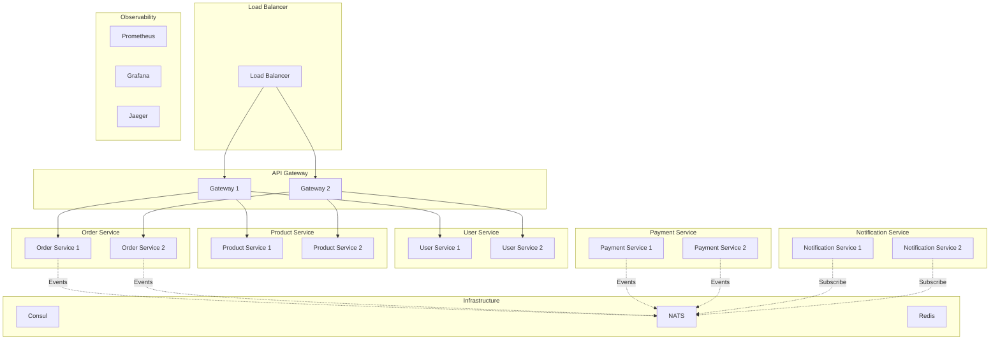

# 🏋️ Ejercicios: Microservices - Sistemas Distribuidos

> *"Los mejores arquitectos de microservices no nacen, se hacen a través de práctica deliberada"*

## 🎯 Objetivos de los Ejercicios

- 🏗️ **Implementar** arquitecturas de microservices escalables
- 🔧 **Aplicar** patrones de comunicación entre servicios
- 🛡️ **Desarrollar** resilience patterns en producción
- 📊 **Configurar** observabilidad distribuida completa
- ⚡ **Optimizar** performance y escalabilidad

---

## 📋 Lista de Ejercicios

| Ejercicio | Tema                          | Dificultad | Tiempo |
| --------- | ----------------------------- | ---------- | ------ |
| 01        | Service Decomposition         | 🟢 Básico   | 2h     |
| 02        | HTTP Service Communication    | 🟢 Básico   | 2h     |
| 03        | gRPC Inter-Service Calls      | 🟡 Medio    | 3h     |
| 04        | Event-Driven Architecture     | 🟡 Medio    | 3h     |
| 05        | Service Discovery & Registry  | 🟡 Medio    | 2h     |
| 06        | API Gateway Implementation    | 🔴 Avanzado | 4h     |
| 07        | Circuit Breaker Pattern       | 🟡 Medio    | 2h     |
| 08        | Distributed Tracing           | 🔴 Avanzado | 3h     |
| 09        | Saga Transaction Pattern      | 🔴 Avanzado | 4h     |
| 10        | Complete Microservices System | 🔴 Expert   | 6h     |

**Tiempo Total**: ~31 horas

---

## 🚀 Ejercicio 1: Service Decomposition
**Objetivo**: Dividir un monolito en microservices siguiendo principios DDD

### 📝 Descripción
Tienes una aplicación monolítica de e-commerce. Tu tarea es identificar bounded contexts y crear microservices independientes.

### 🎯 Tareas
1. **Analizar** el dominio de e-commerce
2. **Identificar** bounded contexts
3. **Definir** APIs entre servicios  
4. **Implementar** servicios básicos

### 💻 Código Inicial

```go
// Monolithic structure to decompose
package main

type ECommerceApp struct {
    // User management
    users map[string]User
    
    // Product catalog
    products map[string]Product
    
    // Order processing
    orders map[string]Order
    
    // Inventory management
    inventory map[string]int
    
    // Payment processing
    payments map[string]Payment
    
    // Notification system
    notifications []Notification
}

type User struct {
    ID       string
    Email    string
    Name     string
    Address  Address
    Password string
}

type Product struct {
    ID          string
    Name        string
    Description string
    Price       float64
    Category    string
}

type Order struct {
    ID         string
    UserID     string
    Items      []OrderItem
    Status     string
    Total      float64
    CreatedAt  time.Time
}

type OrderItem struct {
    ProductID string
    Quantity  int
    Price     float64
}

// TODO: Decompose into microservices
```

### ✅ Criterios de Éxito
- [ ] Identificar 5+ bounded contexts
- [ ] Definir interfaces claras entre servicios
- [ ] Implementar user service independiente
- [ ] Implementar product service independiente  
- [ ] Implementar order service independiente
- [ ] Cada servicio maneja su propia base de datos

### 🔍 Evaluación
```go
func TestServiceDecomposition(t *testing.T) {
    // Test user service isolation
    userSvc := NewUserService()
    user := User{ID: "u1", Email: "test@example.com"}
    
    err := userSvc.CreateUser(context.Background(), user)
    assert.NoError(t, err)
    
    retrieved, err := userSvc.GetUser(context.Background(), "u1")
    assert.NoError(t, err)
    assert.Equal(t, user.Email, retrieved.Email)
    
    // Test product service isolation
    productSvc := NewProductService()
    product := Product{ID: "p1", Name: "Test Product", Price: 99.99}
    
    err = productSvc.CreateProduct(context.Background(), product)
    assert.NoError(t, err)
    
    // Test order service with dependencies
    orderSvc := NewOrderService(userSvc, productSvc)
    order := Order{
        ID:     "o1",
        UserID: "u1",
        Items:  []OrderItem{{ProductID: "p1", Quantity: 1}},
    }
    
    err = orderSvc.CreateOrder(context.Background(), order)
    assert.NoError(t, err)
}
```

---

## 🌐 Ejercicio 2: HTTP Service Communication
**Objetivo**: Implementar comunicación HTTP entre microservices

### 📝 Descripción
Implementa clientes HTTP robustos que permitan comunicación entre tus microservices con manejo de errores, timeouts y retry logic.

### 🎯 Tareas
1. **Crear** HTTP clients para cada servicio
2. **Implementar** timeout y retry logic
3. **Manejar** errores de red gracefully
4. **Agregar** connection pooling

### 💻 Implementación

```go
// TODO: Implement HTTP client for service communication
type UserServiceClient struct {
    baseURL string
    client  *http.Client
}

func NewUserServiceClient(baseURL string) *UserServiceClient {
    // TODO: Configure HTTP client with:
    // - Timeouts
    // - Connection pooling  
    // - Retry logic
    return nil
}

func (c *UserServiceClient) GetUser(ctx context.Context, userID string) (*User, error) {
    // TODO: Implement with:
    // - Context cancellation
    // - Proper error handling
    // - Response parsing
    return nil, nil
}

func (c *UserServiceClient) CreateUser(ctx context.Context, user User) error {
    // TODO: Implement POST request with:
    // - JSON serialization
    // - Error response handling
    // - Status code validation
    return nil
}

// TODO: Implement similar clients for Product and Order services
```

### ✅ Criterios de Éxito
- [ ] HTTP client con timeout configurado
- [ ] Retry logic con exponential backoff
- [ ] Manejo de errores HTTP específicos
- [ ] Connection pooling implementado
- [ ] Context cancellation funcional
- [ ] Tests de integración con httptest

### 🧪 Test Framework
```go
func TestHTTPServiceCommunication(t *testing.T) {
    // Mock server for testing
    server := httptest.NewServer(http.HandlerFunc(func(w http.ResponseWriter, r *http.Request) {
        switch r.URL.Path {
        case "/users/u1":
            json.NewEncoder(w).Encode(User{ID: "u1", Email: "test@example.com"})
        default:
            http.NotFound(w, r)
        }
    }))
    defer server.Close()
    
    client := NewUserServiceClient(server.URL)
    
    user, err := client.GetUser(context.Background(), "u1")
    assert.NoError(t, err)
    assert.Equal(t, "test@example.com", user.Email)
}
```

---

## ⚡ Ejercicio 3: gRPC Inter-Service Calls
**Objetivo**: Implementar comunicación gRPC de alta performance

### 📝 Descripción
Convierte la comunicación HTTP a gRPC para mejor performance y type safety.

### 🎯 Tareas
1. **Definir** Protocol Buffer schemas
2. **Implementar** gRPC servers
3. **Crear** gRPC clients con pooling
4. **Agregar** interceptors para logging/metrics

### 💻 Proto Definitions

```protobuf
// user_service.proto
syntax = "proto3";

package user;
option go_package = "github.com/example/ecommerce/proto/user";

service UserService {
  rpc GetUser(GetUserRequest) returns (GetUserResponse);
  rpc CreateUser(CreateUserRequest) returns (CreateUserResponse);
  rpc UpdateUser(UpdateUserRequest) returns (UpdateUserResponse);
  rpc DeleteUser(DeleteUserRequest) returns (DeleteUserResponse);
}

message User {
  string id = 1;
  string email = 2;
  string name = 3;
  Address address = 4;
}

message Address {
  string street = 1;
  string city = 2;
  string country = 3;
  string postal_code = 4;
}

message GetUserRequest {
  string user_id = 1;
}

message GetUserResponse {
  User user = 1;
}

// TODO: Define other request/response messages
```

### 🔧 Server Implementation

```go
// TODO: Implement gRPC server
type UserGRPCServer struct {
    service *UserService
    pb.UnimplementedUserServiceServer
}

func (s *UserGRPCServer) GetUser(ctx context.Context, req *pb.GetUserRequest) (*pb.GetUserResponse, error) {
    // TODO: Implement with:
    // - Input validation
    // - Service layer call
    // - Error handling with gRPC status codes
    // - Logging
    return nil, nil
}

// TODO: Implement gRPC client with connection pooling
type UserGRPCClient struct {
    conn   *grpc.ClientConn
    client pb.UserServiceClient
}

func NewUserGRPCClient(address string) (*UserGRPCClient, error) {
    // TODO: Configure connection with:
    // - Keepalive settings
    // - Load balancing
    // - Interceptors
    return nil, nil
}
```

### ✅ Criterios de Éxito
- [ ] Proto files correctamente definidos
- [ ] gRPC servers implementados
- [ ] gRPC clients con connection pooling
- [ ] Interceptors para logging y métricas
- [ ] Error handling con status codes
- [ ] Tests con gRPC mock servers

---

## 📡 Ejercicio 4: Event-Driven Architecture  
**Objetivo**: Implementar comunicación asíncrona con eventos

### 📝 Descripción
Implementa un sistema de eventos para comunicación asíncrona entre microservices usando NATS o similar.

### 🎯 Tareas
1. **Configurar** message broker (NATS)
2. **Implementar** event publisher
3. **Crear** event subscribers
4. **Manejar** dead letter queues

### 💻 Event System

```go
// TODO: Implement event system
type EventPublisher interface {
    Publish(ctx context.Context, topic string, event interface{}) error
}

type EventSubscriber interface {
    Subscribe(topic string, handler EventHandler) error
}

type EventHandler func(ctx context.Context, event []byte) error

// Event definitions
type UserCreatedEvent struct {
    UserID    string    `json:"user_id"`
    Email     string    `json:"email"`
    CreatedAt time.Time `json:"created_at"`
}

type OrderCreatedEvent struct {
    OrderID    string    `json:"order_id"`
    UserID     string    `json:"user_id"`
    Total      float64   `json:"total"`
    CreatedAt  time.Time `json:"created_at"`
}

type PaymentProcessedEvent struct {
    PaymentID string    `json:"payment_id"`
    OrderID   string    `json:"order_id"`
    Amount    float64   `json:"amount"`
    Status    string    `json:"status"`
    ProcessedAt time.Time `json:"processed_at"`
}

// TODO: Implement NATS publisher
type NATSEventPublisher struct {
    conn *nats.Conn
}

// TODO: Implement event handlers for each service
func (s *NotificationService) HandleUserCreated(ctx context.Context, eventData []byte) error {
    // TODO: Send welcome email
    return nil
}

func (s *InventoryService) HandleOrderCreated(ctx context.Context, eventData []byte) error {
    // TODO: Reserve inventory
    return nil
}
```

### ✅ Criterios de Éxito
- [ ] NATS broker configurado
- [ ] Event publisher implementado
- [ ] Event subscribers funcionando
- [ ] Dead letter queue para fallos
- [ ] Event versioning strategy
- [ ] Integration tests con eventos

---

## 🗺️ Ejercicio 5: Service Discovery & Registry
**Objetivo**: Implementar service discovery automático

### 📝 Descripción
Implementa service discovery usando Consul para que los servicios se encuentren automáticamente.

### 🎯 Tareas
1. **Configurar** Consul como service registry
2. **Implementar** auto-registration de servicios
3. **Crear** service discovery client
4. **Agregar** health checks

### 💻 Service Registry

```go
// TODO: Implement service registry
type ServiceRegistry interface {
    Register(ctx context.Context, service ServiceInfo) error
    Deregister(ctx context.Context, serviceID string) error
    Discover(ctx context.Context, serviceName string) ([]ServiceInfo, error)
}

type ServiceInfo struct {
    ID      string
    Name    string
    Address string
    Port    int
    Tags    []string
    Health  HealthCheck
}

type HealthCheck struct {
    HTTP     string
    Interval time.Duration
    Timeout  time.Duration
}

// TODO: Implement Consul registry
type ConsulServiceRegistry struct {
    client *consul.Client
}

// TODO: Implement auto-registration on startup
func RegisterService(registry ServiceRegistry, config ServiceConfig) error {
    // TODO: Register service with health check
    return nil
}

// TODO: Implement service discovery with load balancing
type ServiceDiscoveryClient struct {
    registry ServiceRegistry
    balancer LoadBalancer
}

func (c *ServiceDiscoveryClient) GetServiceURL(ctx context.Context, serviceName string) (string, error) {
    // TODO: Discover healthy instances and load balance
    return "", nil
}
```

### ✅ Criterios de Éxito
- [ ] Consul configurado y ejecutándose
- [ ] Auto-registration de servicios
- [ ] Health checks funcionando
- [ ] Service discovery con load balancing
- [ ] Graceful deregistration en shutdown
- [ ] Tests con mock registry

---

## 🚪 Ejercicio 6: API Gateway Implementation
**Objetivo**: Crear un API Gateway centralizado

### 📝 Descripción
Implementa un API Gateway que maneje routing, authentication, rate limiting y load balancing.

### 🎯 Tareas
1. **Implementar** request routing
2. **Agregar** authentication middleware
3. **Configurar** rate limiting
4. **Implementar** load balancing

### 💻 API Gateway

```go
// TODO: Implement API Gateway
type APIGateway struct {
    routes     map[string]RouteConfig
    middleware []Middleware
    registry   ServiceRegistry
    limiter    RateLimiter
}

type RouteConfig struct {
    ServiceName string
    Path        string
    Methods     []string
    Auth        bool
    RateLimit   *RateLimit
}

type Middleware func(http.Handler) http.Handler

// TODO: Implement routing logic
func (gw *APIGateway) ServeHTTP(w http.ResponseWriter, r *http.Request) {
    // TODO: Route matching
    // TODO: Service discovery
    // TODO: Load balancing
    // TODO: Request proxying
}

// TODO: Implement middleware
func AuthMiddleware(next http.Handler) http.Handler {
    // TODO: JWT validation
    return nil
}

func RateLimitMiddleware(limiter RateLimiter) Middleware {
    // TODO: Rate limiting per client
    return nil
}

// TODO: Implement rate limiter
type RateLimiter interface {
    Allow(clientID string) bool
}
```

### ✅ Criterios de Éxito
- [ ] Request routing funcional
- [ ] JWT authentication middleware
- [ ] Rate limiting por cliente
- [ ] Load balancing entre instancias
- [ ] Health check endpoint
- [ ] Metrics y logging

---

## 🔌 Ejercicio 7: Circuit Breaker Pattern
**Objetivo**: Implementar fault tolerance con circuit breakers

### 📝 Descripción
Implementa circuit breakers para proteger servicios de fallos en cascada.

### 🎯 Tareas
1. **Implementar** circuit breaker state machine
2. **Configurar** thresholds y timeouts
3. **Agregar** metrics y monitoring
4. **Testear** scenarios de fallo

### 💻 Circuit Breaker

```go
// TODO: Implement circuit breaker
type CircuitBreakerState int

const (
    StateClosed CircuitBreakerState = iota
    StateOpen
    StateHalfOpen
)

type CircuitBreaker struct {
    // TODO: Add state management
    // TODO: Add failure counting
    // TODO: Add timeout handling
}

func NewCircuitBreaker(config CircuitBreakerConfig) *CircuitBreaker {
    // TODO: Initialize with configuration
    return nil
}

func (cb *CircuitBreaker) Execute(fn func() error) error {
    // TODO: Implement state machine logic
    return nil
}

// TODO: Implement with HTTP client
type ResilientHTTPClient struct {
    client  *http.Client
    breaker *CircuitBreaker
}

func (c *ResilientHTTPClient) Get(ctx context.Context, url string) (*http.Response, error) {
    // TODO: Wrap HTTP call with circuit breaker
    return nil, nil
}
```

### ✅ Criterios de Éxito
- [ ] Circuit breaker state machine
- [ ] Configurable failure thresholds
- [ ] Timeout and recovery logic
- [ ] Metrics export (open/closed states)
- [ ] Integration with HTTP clients
- [ ] Tests para todos los estados

---

## 🔍 Ejercicio 8: Distributed Tracing
**Objetivo**: Implementar tracing distribuido con OpenTelemetry

### 📝 Descripción
Configura distributed tracing para trackear requests a través de múltiples servicios.

### 🎯 Tareas
1. **Configurar** OpenTelemetry
2. **Instrumentar** HTTP handlers
3. **Propagar** trace context
4. **Visualizar** en Jaeger

### 💻 Tracing Setup

```go
// TODO: Configure OpenTelemetry
func initTracing(serviceName string) (func(), error) {
    // TODO: Setup trace provider
    // TODO: Configure Jaeger exporter
    // TODO: Set global tracer
    return nil, nil
}

// TODO: Create tracing middleware
func TracingMiddleware(tracer trace.Tracer) func(http.Handler) http.Handler {
    return func(next http.Handler) http.Handler {
        return http.HandlerFunc(func(w http.ResponseWriter, r *http.Request) {
            // TODO: Start span
            // TODO: Propagate context
            // TODO: Add attributes
            // TODO: Handle errors
            next.ServeHTTP(w, r)
        })
    }
}

// TODO: Instrument service calls
type TracedUserService struct {
    service *UserService
    tracer  trace.Tracer
}

func (s *TracedUserService) GetUser(ctx context.Context, userID string) (*User, error) {
    // TODO: Create span with attributes
    // TODO: Call service
    // TODO: Record errors
    return nil, nil
}
```

### ✅ Criterios de Éxito
- [ ] OpenTelemetry configurado
- [ ] Spans creados para cada operación
- [ ] Context propagation entre servicios
- [ ] Attributes y tags relevantes
- [ ] Error recording en spans
- [ ] Visualización en Jaeger

---

## 🔄 Ejercicio 9: Saga Transaction Pattern
**Objetivo**: Implementar transacciones distribuidas con Saga pattern

### 📝 Descripción
Implementa el patrón Saga para manejar transacciones que span múltiples servicios.

### 🎯 Tareas
1. **Diseñar** saga workflow
2. **Implementar** compensation actions
3. **Manejar** failures y rollbacks
4. **Agregar** persistence para estado

### 💻 Saga Implementation

```go
// TODO: Implement Saga pattern
type SagaStep struct {
    Name       string
    Action     func(ctx context.Context, data interface{}) error
    Compensate func(ctx context.Context, data interface{}) error
}

type Saga struct {
    ID       string
    Steps    []SagaStep
    State    SagaState
    Data     interface{}
    executed []int
}

type SagaState int

const (
    SagaStatePending SagaState = iota
    SagaStateCompleted
    SagaStateFailed
    SagaStateCompensating
    SagaStateCompensated
)

// TODO: Implement saga execution
func (s *Saga) Execute(ctx context.Context) error {
    // TODO: Execute steps forward
    // TODO: Handle failures with compensation
    // TODO: Persist state changes
    return nil
}

// TODO: Create order processing saga
func CreateOrderSaga(orderSvc *OrderService, paymentSvc *PaymentService, inventorySvc *InventoryService) *Saga {
    return &Saga{
        Steps: []SagaStep{
            {
                Name: "reserve_inventory",
                Action: func(ctx context.Context, data interface{}) error {
                    // TODO: Reserve inventory
                    return nil
                },
                Compensate: func(ctx context.Context, data interface{}) error {
                    // TODO: Release reservation
                    return nil
                },
            },
            // TODO: Add payment and order confirmation steps
        },
    }
}
```

### ✅ Criterios de Éxito
- [ ] Saga workflow definido
- [ ] Compensation actions implementadas
- [ ] State persistence
- [ ] Error handling y rollbacks
- [ ] Timeout handling
- [ ] Tests para success y failure scenarios

---

## 🏆 Ejercicio 10: Complete Microservices System
**Objetivo**: Integrar todos los patrones en un sistema completo

### 📝 Descripción
Construye un sistema completo de e-commerce que integre todos los patrones aprendidos.

### 🎯 Arquitectura Objetivo



### 🎯 Componentes Requeridos
1. **5+ Microservices** con APIs completas
2. **API Gateway** con routing y middleware
3. **Service Discovery** con Consul
4. **Event System** con NATS
5. **Circuit Breakers** en communication
6. **Distributed Tracing** con Jaeger
7. **Metrics** con Prometheus
8. **Logging** centralizado
9. **Health Checks** comprensivos
10. **Docker Compose** para deployment

### 💻 Deployment Configuration

```yaml
# docker-compose.yml
version: '3.8'
services:
  consul:
    image: consul:latest
    ports:
      - "8500:8500"
    
  nats:
    image: nats:latest
    ports:
      - "4222:4222"
      
  jaeger:
    image: jaegertracing/all-in-one:latest
    ports:
      - "16686:16686"
      
  prometheus:
    image: prom/prometheus:latest
    ports:
      - "9090:9090"
    volumes:
      - ./prometheus.yml:/etc/prometheus/prometheus.yml
      
  api-gateway:
    build: ./cmd/gateway
    ports:
      - "8080:8080"
    depends_on:
      - consul
      - nats
      
  user-service:
    build: ./cmd/user-service  
    deploy:
      replicas: 2
    depends_on:
      - consul
      - nats
      
  # TODO: Add other services
```

### ✅ Criterios de Éxito Final
- [ ] Sistema completo ejecutándose
- [ ] Load balancing funcional
- [ ] Service discovery automático
- [ ] Circuit breakers activos
- [ ] Distributed tracing visible
- [ ] Metrics being collected
- [ ] Events flowing correctly
- [ ] Health checks passing
- [ ] Graceful shutdown
- [ ] Integration tests passing

### 🧪 Integration Tests

```go
func TestCompleteECommerceFlow(t *testing.T) {
    // Setup test environment
    testEnv := setupTestEnvironment(t)
    defer testEnv.Cleanup()
    
    // Test complete user journey
    t.Run("Complete Order Flow", func(t *testing.T) {
        // 1. Create user
        user := createTestUser(t, testEnv.Gateway)
        
        // 2. Add products
        product := createTestProduct(t, testEnv.Gateway)
        
        // 3. Create order
        order := createTestOrder(t, testEnv.Gateway, user.ID, product.ID)
        
        // 4. Process payment
        payment := processTestPayment(t, testEnv.Gateway, order.ID)
        
        // 5. Verify notifications sent
        verifyNotificationsSent(t, testEnv.NotificationService, user.Email)
        
        // 6. Verify inventory updated
        verifyInventoryUpdated(t, testEnv.InventoryService, product.ID)
    })
    
    // Test resilience patterns
    t.Run("Circuit Breaker Activation", func(t *testing.T) {
        // Simulate service failure
        testEnv.PaymentService.Shutdown()
        
        // Verify circuit breaker opens
        for i := 0; i < 10; i++ {
            _, err := createTestOrder(t, testEnv.Gateway, "user1", "product1")
            assert.Error(t, err)
        }
        
        // Verify circuit breaker prevents calls
        metrics := testEnv.Metrics.GetCircuitBreakerMetrics()
        assert.True(t, metrics.PaymentServiceOpen)
    })
}
```

---

## 🎯 Criterios de Evaluación General

### 📊 Rubrica de Evaluación

| Criterio                   | Excelente (4)                         | Bueno (3)                    | Regular (2)          | Necesita Mejora (1) |
| -------------------------- | ------------------------------------- | ---------------------------- | -------------------- | ------------------- |
| **Arquitectura**           | Clean, scalable, well-documented      | Good structure, minor issues | Basic structure      | Poor separation     |
| **Communication Patterns** | Multiple patterns used correctly      | HTTP + Events working        | Basic HTTP only      | Poor implementation |
| **Resilience**             | Circuit breakers + retries + timeouts | Some patterns implemented    | Basic error handling | No resilience       |
| **Observability**          | Full tracing + metrics + logging      | Good monitoring setup        | Basic logging        | No observability    |
| **Code Quality**           | Clean, tested, documented             | Good quality with tests      | Working code         | Poor quality        |
| **Error Handling**         | Comprehensive error management        | Good error handling          | Basic error handling | Poor error handling |

### 🏆 Puntuación
- **Excelente (22-24 puntos)**: ¡Master de Microservices! 🚀
- **Bueno (18-21 puntos)**: ¡Desarrollador Senior! 💪
- **Regular (14-17 puntos)**: ¡Desarrollador Mid-level! 📈
- **Necesita Mejora (6-13 puntos)**: ¡Sigue practicando! 📚

---

## 📚 Recursos Adicionales

### 📖 Lectura Recomendada
- **Building Microservices** - Sam Newman
- **Microservices Patterns** - Chris Richardson
- **Designing Data-Intensive Applications** - Martin Kleppmann

### 🛠️ Herramientas
- **Service Mesh**: Istio, Linkerd
- **Message Brokers**: NATS, Apache Kafka, RabbitMQ
- **Service Discovery**: Consul, etcd, Eureka
- **API Gateway**: Kong, Ambassador, Zuul

### 🔗 Links Útiles
- [Go gRPC Documentation](https://grpc.io/docs/languages/go/)
- [OpenTelemetry Go](https://opentelemetry.io/docs/instrumentation/go/)
- [Consul Service Discovery](https://www.consul.io/docs/discovery)
- [NATS Messaging](https://docs.nats.io/)

---

## 🎯 Próximos Pasos

Una vez completados estos ejercicios:

1. **📊 Revisa** tu implementación con el proyecto final
2. **🔍 Profundiza** en service mesh (Istio)
3. **⚡ Continúa** con gRPC avanzado
4. **🚀 Avanza** a deployment y DevOps

**¡Felicitaciones! Has dominado los fundamentos de microservices en Go!** 🎉
