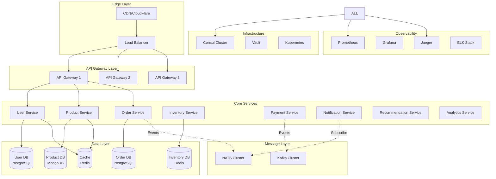
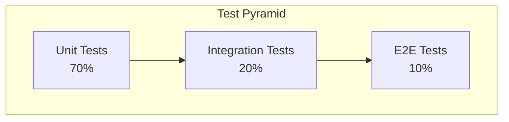

# 🏗️ Proyecto Final: Sistema E-Commerce de Microservices

> *"Un gran arquitecto construye sistemas que crecen con el negocio, no que lo limitan"*

## 🎯 Visión del Proyecto

Construirás un **sistema completo de e-commerce** usando arquitectura de microservices que maneje:
- **100K+ usuarios** concurrentes
- **Millones de productos** en catálogo
- **Miles de órdenes** por minuto
- **99.9% uptime** con fault tolerance
- **Sub-segundo** response times

---

## 🏛️ Arquitectura del Sistema

### 📊 Diagrama de Arquitectura



---

## 📋 Especificaciones del Sistema

### 🎯 Requerimientos Funcionales

#### 👤 User Service
- **Gestión de usuarios**: Registro, autenticación, perfiles
- **JWT tokens**: Con refresh tokens y expiración
- **Roles y permisos**: Customer, Admin, Vendor
- **Social login**: Google, Facebook, GitHub

#### 🛍️ Product Service  
- **Catálogo de productos**: CRUD completo
- **Categorías y filtros**: Búsqueda avanzada
- **Imágenes y media**: Upload y CDN integration
- **Pricing**: Dinámico con descuentos

#### 📦 Order Service
- **Gestión de órdenes**: Create, update, track
- **Shopping cart**: Persistente y temporal  
- **Workflow de estados**: Draft → Confirmed → Shipped → Delivered
- **Order history**: Con detalles completos

#### 📊 Inventory Service
- **Stock management**: Real-time inventory
- **Reservations**: Temporary holds during checkout
- **Restock alerts**: Automated notifications
- **Multi-warehouse**: Location-based inventory

#### 💳 Payment Service
- **Multiple providers**: Stripe, PayPal, crypto
- **Payment workflows**: Authorization → Capture → Refund
- **Fraud detection**: Machine learning integration
- **PCI compliance**: Secure token handling

#### 📧 Notification Service
- **Multi-channel**: Email, SMS, Push, In-app
- **Templates**: Dynamic content generation
- **Delivery tracking**: Status and analytics
- **Preferences**: User notification settings

#### 🎯 Recommendation Service
- **Product recommendations**: ML-based suggestions
- **Real-time personalization**: Behavior tracking
- **A/B testing**: Feature flag integration
- **Analytics integration**: User behavior tracking

### ⚡ Requerimientos No Funcionales

| Aspecto              | Requerimiento       | Métrica     |
| -------------------- | ------------------- | ----------- |
| **Performance**      | API response time   | < 100ms p95 |
| **Scalability**      | Concurrent users    | 100K+       |
| **Availability**     | Uptime              | 99.9%       |
| **Throughput**       | Orders per minute   | 1000+       |
| **Data Consistency** | Transaction success | 99.99%      |
| **Security**         | Data encryption     | AES-256     |

---

## 🛠️ Stack Tecnológico

### 🔧 Core Technologies
- **Language**: Go 1.21+
- **HTTP Framework**: Gin/Echo
- **gRPC**: Protocol Buffers
- **Database**: PostgreSQL, MongoDB, Redis
- **Message Queues**: NATS, Apache Kafka
- **Service Discovery**: Consul
- **Configuration**: Vault, Viper

### 📊 Observability Stack
- **Metrics**: Prometheus + Grafana
- **Tracing**: Jaeger/OpenTelemetry  
- **Logging**: ELK Stack (Elasticsearch, Logstash, Kibana)
- **APM**: Custom dashboards

### 🚀 Deployment Stack
- **Containers**: Docker + Docker Compose
- **Orchestration**: Kubernetes
- **CI/CD**: GitHub Actions
- **Infrastructure**: Terraform
- **Monitoring**: Health checks + alerts

---

## 📁 Estructura del Proyecto

```
ecommerce-microservices/
├── cmd/                          # Main applications
│   ├── api-gateway/
│   ├── user-service/
│   ├── product-service/
│   ├── order-service/
│   ├── inventory-service/
│   ├── payment-service/
│   ├── notification-service/
│   └── recommendation-service/
├── internal/                     # Private application code
│   ├── domain/                   # Domain models
│   ├── repository/               # Data access layer
│   ├── service/                  # Business logic
│   ├── handler/                  # HTTP/gRPC handlers
│   ├── middleware/               # Shared middleware
│   └── config/                   # Configuration
├── pkg/                          # Public packages
│   ├── auth/                     # Authentication utilities
│   ├── cache/                    # Caching abstractions
│   ├── database/                 # Database utilities
│   ├── events/                   # Event handling
│   ├── logger/                   # Structured logging
│   ├── metrics/                  # Prometheus metrics
│   ├── tracing/                  # Distributed tracing
│   └── validator/                # Request validation
├── api/                          # API definitions
│   ├── proto/                    # Protocol Buffer files
│   ├── openapi/                  # OpenAPI specifications
│   └── graphql/                  # GraphQL schemas
├── scripts/                      # Automation scripts
│   ├── build/
│   ├── deploy/
│   └── test/
├── deployments/                  # Deployment configurations
│   ├── docker/
│   ├── kubernetes/
│   └── terraform/
├── docs/                         # Documentation
│   ├── architecture/
│   ├── api/
│   └── deployment/
├── tests/                        # Integration tests
│   ├── e2e/
│   ├── performance/
│   └── chaos/
├── tools/                        # Development tools
└── vendor/                       # Go module dependencies
```

---

## 🎯 Fases de Implementación

### 📅 Fase 1: Fundación (Semana 1-2)
**Objetivo**: Infraestructura básica y servicios core

#### 🏗️ Infrastructure Setup
```bash
# Configurar infraestructura local
make setup-infra
docker-compose up -d consul nats redis postgres
```

#### 👤 User Service
```go
// Domain model
type User struct {
    ID        string    `json:"id" db:"id"`
    Email     string    `json:"email" db:"email"`
    Name      string    `json:"name" db:"name"`
    Password  string    `json:"-" db:"password"`
    Role      UserRole  `json:"role" db:"role"`
    CreatedAt time.Time `json:"created_at" db:"created_at"`
    UpdatedAt time.Time `json:"updated_at" db:"updated_at"`
}

type UserRole string

const (
    RoleCustomer UserRole = "customer"
    RoleAdmin    UserRole = "admin"
    RoleVendor   UserRole = "vendor"
)

// Repository interface
type UserRepository interface {
    Create(ctx context.Context, user *User) error
    GetByID(ctx context.Context, id string) (*User, error)
    GetByEmail(ctx context.Context, email string) (*User, error)
    Update(ctx context.Context, user *User) error
    Delete(ctx context.Context, id string) error
}

// Service interface
type UserService interface {
    Register(ctx context.Context, req RegisterRequest) (*User, error)
    Login(ctx context.Context, req LoginRequest) (*AuthResponse, error)
    GetProfile(ctx context.Context, userID string) (*User, error)
    UpdateProfile(ctx context.Context, userID string, req UpdateProfileRequest) (*User, error)
}
```

#### 🛍️ Product Service
```go
// Domain model
type Product struct {
    ID          string                 `json:"id" bson:"_id"`
    Name        string                 `json:"name" bson:"name"`
    Description string                 `json:"description" bson:"description"`
    Price       float64                `json:"price" bson:"price"`
    Category    string                 `json:"category" bson:"category"`
    Images      []string               `json:"images" bson:"images"`
    Attributes  map[string]interface{} `json:"attributes" bson:"attributes"`
    Stock       int                    `json:"stock" bson:"stock"`
    Active      bool                   `json:"active" bson:"active"`
    CreatedAt   time.Time              `json:"created_at" bson:"created_at"`
    UpdatedAt   time.Time              `json:"updated_at" bson:"updated_at"`
}

// Service with caching
type ProductService struct {
    repo  ProductRepository
    cache cache.Cache
    events events.Publisher
}

func (s *ProductService) GetProduct(ctx context.Context, id string) (*Product, error) {
    // Try cache first
    if product, err := s.cache.Get(ctx, "product:"+id); err == nil {
        return product.(*Product), nil
    }
    
    // Fallback to database
    product, err := s.repo.GetByID(ctx, id)
    if err != nil {
        return nil, err
    }
    
    // Cache for future requests
    s.cache.Set(ctx, "product:"+id, product, 5*time.Minute)
    
    return product, nil
}
```

#### ✅ Deliverables Fase 1
- [ ] User service con autenticación JWT
- [ ] Product service con caching
- [ ] Bases de datos configuradas
- [ ] Service discovery funcional
- [ ] Health checks implementados
- [ ] Logging estructurado
- [ ] Tests unitarios básicos

### 📅 Fase 2: Core Business Logic (Semana 3-4)
**Objetivo**: Order processing y payment integration

#### 📦 Order Service
```go
// Domain model
type Order struct {
    ID          string      `json:"id" db:"id"`
    UserID      string      `json:"user_id" db:"user_id"`
    Items       []OrderItem `json:"items" db:"-"`
    Status      OrderStatus `json:"status" db:"status"`
    Total       float64     `json:"total" db:"total"`
    PaymentID   string      `json:"payment_id" db:"payment_id"`
    ShippingID  string      `json:"shipping_id" db:"shipping_id"`
    CreatedAt   time.Time   `json:"created_at" db:"created_at"`
    UpdatedAt   time.Time   `json:"updated_at" db:"updated_at"`
}

type OrderItem struct {
    ProductID string  `json:"product_id" db:"product_id"`
    Quantity  int     `json:"quantity" db:"quantity"`
    Price     float64 `json:"price" db:"price"`
    Total     float64 `json:"total" db:"total"`
}

type OrderStatus string

const (
    OrderStatusDraft     OrderStatus = "draft"
    OrderStatusConfirmed OrderStatus = "confirmed"
    OrderStatusPaid      OrderStatus = "paid"
    OrderStatusShipped   OrderStatus = "shipped"
    OrderStatusDelivered OrderStatus = "delivered"
    OrderStatusCancelled OrderStatus = "cancelled"
)

// Saga implementation for order processing
type OrderSaga struct {
    orderService     *OrderService
    inventoryService *InventoryService
    paymentService   *PaymentService
    events          events.Publisher
}

func (s *OrderSaga) ProcessOrder(ctx context.Context, order *Order) error {
    saga := &saga.Saga{
        ID: order.ID,
        Steps: []saga.Step{
            {
                Name: "validate_order",
                Action: func(ctx context.Context) error {
                    return s.orderService.ValidateOrder(ctx, order)
                },
                Compensate: func(ctx context.Context) error {
                    return nil // No compensation needed
                },
            },
            {
                Name: "reserve_inventory",
                Action: func(ctx context.Context) error {
                    return s.inventoryService.ReserveItems(ctx, order.Items)
                },
                Compensate: func(ctx context.Context) error {
                    return s.inventoryService.ReleaseReservation(ctx, order.ID)
                },
            },
            {
                Name: "process_payment",
                Action: func(ctx context.Context) error {
                    return s.paymentService.ProcessPayment(ctx, order.PaymentID, order.Total)
                },
                Compensate: func(ctx context.Context) error {
                    return s.paymentService.RefundPayment(ctx, order.PaymentID)
                },
            },
            {
                Name: "confirm_order",
                Action: func(ctx context.Context) error {
                    return s.orderService.ConfirmOrder(ctx, order.ID)
                },
                Compensate: func(ctx context.Context) error {
                    return s.orderService.CancelOrder(ctx, order.ID)
                },
            },
        },
    }
    
    return saga.Execute(ctx)
}
```

#### 💳 Payment Service
```go
// Payment provider interface
type PaymentProvider interface {
    CreatePayment(ctx context.Context, req PaymentRequest) (*Payment, error)
    CapturePayment(ctx context.Context, paymentID string) error
    RefundPayment(ctx context.Context, paymentID string, amount float64) error
    GetPayment(ctx context.Context, paymentID string) (*Payment, error)
}

// Stripe implementation
type StripeProvider struct {
    client *stripe.Client
}

func (p *StripeProvider) CreatePayment(ctx context.Context, req PaymentRequest) (*Payment, error) {
    params := &stripe.PaymentIntentParams{
        Amount:   stripe.Int64(int64(req.Amount * 100)), // Convert to cents
        Currency: stripe.String(string(req.Currency)),
        Metadata: map[string]string{
            "order_id": req.OrderID,
            "user_id":  req.UserID,
        },
    }
    
    intent, err := p.client.PaymentIntents.New(params)
    if err != nil {
        return nil, fmt.Errorf("stripe payment creation failed: %w", err)
    }
    
    return &Payment{
        ID:            intent.ID,
        OrderID:       req.OrderID,
        UserID:        req.UserID,
        Amount:        req.Amount,
        Currency:      req.Currency,
        Status:        mapStripeStatus(intent.Status),
        ProviderID:    intent.ID,
        ClientSecret:  intent.ClientSecret,
        CreatedAt:     time.Now(),
    }, nil
}

// Payment service with multiple providers
type PaymentService struct {
    providers map[string]PaymentProvider
    repo      PaymentRepository
    events    events.Publisher
}

func (s *PaymentService) ProcessPayment(ctx context.Context, req PaymentRequest) (*Payment, error) {
    provider, ok := s.providers[req.Provider]
    if !ok {
        return nil, fmt.Errorf("unsupported payment provider: %s", req.Provider)
    }
    
    payment, err := provider.CreatePayment(ctx, req)
    if err != nil {
        return nil, err
    }
    
    // Save to database
    if err := s.repo.Create(ctx, payment); err != nil {
        return nil, err
    }
    
    // Publish event
    s.events.Publish(ctx, "payment.created", PaymentCreatedEvent{
        PaymentID: payment.ID,
        OrderID:   payment.OrderID,
        Amount:    payment.Amount,
        Status:    payment.Status,
    })
    
    return payment, nil
}
```

#### ✅ Deliverables Fase 2
- [ ] Order service con saga pattern
- [ ] Payment service con múltiples providers
- [ ] Inventory service con reservations
- [ ] Event-driven architecture functional
- [ ] Integration tests end-to-end
- [ ] Circuit breakers implementados

### 📅 Fase 3: Advanced Features (Semana 5-6)
**Objetivo**: API Gateway, observabilidad y optimización

#### 🚪 API Gateway
```go
type APIGateway struct {
    router     *gin.Engine
    registry   discovery.ServiceRegistry
    cache      cache.Cache
    limiter    ratelimit.Limiter
    auth       auth.Service
    metrics    metrics.Collector
    tracer     trace.Tracer
}

func (gw *APIGateway) setupRoutes() {
    // Authentication routes
    auth := gw.router.Group("/auth")
    auth.POST("/login", gw.handleLogin)
    auth.POST("/register", gw.handleRegister)
    auth.POST("/refresh", gw.handleRefreshToken)
    
    // API routes with middleware
    api := gw.router.Group("/api/v1")
    api.Use(gw.authMiddleware())
    api.Use(gw.rateLimitMiddleware())
    api.Use(gw.tracingMiddleware())
    api.Use(gw.metricsMiddleware())
    
    // User routes
    users := api.Group("/users")
    users.GET("/:id", gw.proxyToService("user-service"))
    users.PUT("/:id", gw.proxyToService("user-service"))
    
    // Product routes
    products := api.Group("/products")
    products.GET("", gw.proxyToService("product-service"))
    products.GET("/:id", gw.proxyToService("product-service"))
    products.POST("", gw.adminRequired(), gw.proxyToService("product-service"))
    
    // Order routes
    orders := api.Group("/orders")
    orders.GET("", gw.proxyToService("order-service"))
    orders.POST("", gw.proxyToService("order-service"))
    orders.GET("/:id", gw.proxyToService("order-service"))
}

func (gw *APIGateway) proxyToService(serviceName string) gin.HandlerFunc {
    return func(c *gin.Context) {
        // Service discovery
        instances, err := gw.registry.GetHealthyInstances(c.Request.Context(), serviceName)
        if err != nil {
            c.JSON(http.StatusServiceUnavailable, gin.H{"error": "service unavailable"})
            return
        }
        
        if len(instances) == 0 {
            c.JSON(http.StatusServiceUnavailable, gin.H{"error": "no healthy instances"})
            return
        }
        
        // Load balancing
        instance := gw.selectInstance(instances)
        targetURL := fmt.Sprintf("http://%s:%d", instance.Address, instance.Port)
        
        // Proxy request
        gw.proxyRequest(c, targetURL)
    }
}
```

#### 📊 Observability Setup
```go
// Metrics collection
func setupMetrics() *prometheus.Registry {
    registry := prometheus.NewRegistry()
    
    // HTTP metrics
    httpRequestsTotal := promauto.With(registry).NewCounterVec(
        prometheus.CounterOpts{
            Name: "http_requests_total",
            Help: "Total number of HTTP requests",
        },
        []string{"service", "method", "endpoint", "status"},
    )
    
    httpRequestDuration := promauto.With(registry).NewHistogramVec(
        prometheus.HistogramOpts{
            Name:    "http_request_duration_seconds",
            Help:    "HTTP request duration in seconds",
            Buckets: prometheus.DefBuckets,
        },
        []string{"service", "method", "endpoint"},
    )
    
    // Business metrics
    ordersTotal := promauto.With(registry).NewCounterVec(
        prometheus.CounterOpts{
            Name: "orders_total",
            Help: "Total number of orders",
        },
        []string{"status"},
    )
    
    return registry
}

// Distributed tracing
func setupTracing(serviceName string) (trace.TracerProvider, error) {
    exporter, err := jaeger.New(jaeger.WithCollectorEndpoint(jaeger.WithEndpoint("http://jaeger:14268/api/traces")))
    if err != nil {
        return nil, err
    }
    
    tp := tracesdk.NewTracerProvider(
        tracesdk.WithBatcher(exporter),
        tracesdk.WithResource(resource.NewWithAttributes(
            semconv.SchemaURL,
            semconv.ServiceNameKey.String(serviceName),
        )),
    )
    
    otel.SetTracerProvider(tp)
    return tp, nil
}
```

#### ✅ Deliverables Fase 3
- [ ] API Gateway con routing completo
- [ ] Metrics collection con Prometheus
- [ ] Distributed tracing con Jaeger
- [ ] Centralized logging con ELK
- [ ] Performance optimization
- [ ] Load testing results

### 📅 Fase 4: Production Ready (Semana 7-8)
**Objetivo**: Deployment, monitoring y chaos engineering

#### 🐳 Docker Configuration
```dockerfile
# Multi-stage build for Go services
FROM golang:1.21-alpine AS builder
WORKDIR /app
COPY go.mod go.sum ./
RUN go mod download
COPY . .
RUN CGO_ENABLED=0 GOOS=linux go build -o main cmd/user-service/main.go

FROM alpine:latest
RUN apk --no-cache add ca-certificates
WORKDIR /root/
COPY --from=builder /app/main .
EXPOSE 8080
CMD ["./main"]
```

#### ☸️ Kubernetes Deployment
```yaml
apiVersion: apps/v1
kind: Deployment
metadata:
  name: user-service
  labels:
    app: user-service
spec:
  replicas: 3
  selector:
    matchLabels:
      app: user-service
  template:
    metadata:
      labels:
        app: user-service
    spec:
      containers:
      - name: user-service
        image: ecommerce/user-service:latest
        ports:
        - containerPort: 8080
        env:
        - name: DATABASE_URL
          valueFrom:
            secretKeyRef:
              name: db-secret
              key: url
        - name: CONSUL_URL
          value: "consul:8500"
        livenessProbe:
          httpGet:
            path: /health
            port: 8080
          initialDelaySeconds: 30
          periodSeconds: 10
        readinessProbe:
          httpGet:
            path: /ready
            port: 8080
          initialDelaySeconds: 5
          periodSeconds: 5
        resources:
          requests:
            memory: "128Mi"
            cpu: "100m"
          limits:
            memory: "256Mi"
            cpu: "200m"
---
apiVersion: v1
kind: Service
metadata:
  name: user-service
spec:
  selector:
    app: user-service
  ports:
  - port: 80
    targetPort: 8080
  type: ClusterIP
```

#### 📊 Monitoring Dashboard
```yaml
# Grafana dashboard configuration
dashboard:
  title: "E-Commerce Microservices"
  panels:
    - title: "HTTP Request Rate"
      type: "graph"
      targets:
        - expr: "rate(http_requests_total[5m])"
          legendFormat: "{{service}} - {{method}} {{endpoint}}"
    
    - title: "Response Time Percentiles"
      type: "graph"
      targets:
        - expr: "histogram_quantile(0.95, rate(http_request_duration_seconds_bucket[5m]))"
          legendFormat: "95th percentile"
        - expr: "histogram_quantile(0.50, rate(http_request_duration_seconds_bucket[5m]))"
          legendFormat: "50th percentile"
    
    - title: "Error Rate"
      type: "singlestat"
      targets:
        - expr: "rate(http_requests_total{status=~\"5..\"}[5m]) / rate(http_requests_total[5m])"
    
    - title: "Active Orders"
      type: "singlestat"
      targets:
        - expr: "orders_total{status=\"active\"}"
```

#### ✅ Deliverables Fase 4
- [ ] Docker containers optimizados
- [ ] Kubernetes deployment completo
- [ ] CI/CD pipeline functional
- [ ] Monitoring dashboards
- [ ] Alerting rules configuradas
- [ ] Chaos engineering tests
- [ ] Load testing a 100K+ RPS
- [ ] Documentation completa

---

## 🧪 Testing Strategy

### 🔬 Test Pyramid



### 🏗️ Test Categories

#### 1. Unit Tests (70%)
```go
func TestUserService_CreateUser(t *testing.T) {
    tests := []struct {
        name    string
        input   CreateUserRequest
        want    *User
        wantErr bool
    }{
        {
            name: "valid user creation",
            input: CreateUserRequest{
                Email:    "test@example.com",
                Name:     "Test User",
                Password: "password123",
            },
            want: &User{
                Email: "test@example.com",
                Name:  "Test User",
                Role:  RoleCustomer,
            },
            wantErr: false,
        },
        {
            name: "duplicate email",
            input: CreateUserRequest{
                Email:    "existing@example.com",
                Name:     "Test User",
                Password: "password123",
            },
            want:    nil,
            wantErr: true,
        },
    }
    
    for _, tt := range tests {
        t.Run(tt.name, func(t *testing.T) {
            // Setup
            mockRepo := &MockUserRepository{}
            service := NewUserService(mockRepo)
            
            // Test
            got, err := service.CreateUser(context.Background(), tt.input)
            
            // Assert
            if (err != nil) != tt.wantErr {
                t.Errorf("CreateUser() error = %v, wantErr %v", err, tt.wantErr)
                return
            }
            if !reflect.DeepEqual(got, tt.want) {
                t.Errorf("CreateUser() = %v, want %v", got, tt.want)
            }
        })
    }
}
```

#### 2. Integration Tests (20%)
```go
func TestOrderService_Integration(t *testing.T) {
    // Setup test database
    db := setupTestDB(t)
    defer db.Close()
    
    // Setup test message broker
    nats := setupTestNATS(t)
    defer nats.Close()
    
    // Setup services
    userRepo := postgres.NewUserRepository(db)
    productRepo := mongo.NewProductRepository(setupTestMongo(t))
    orderRepo := postgres.NewOrderRepository(db)
    
    userSvc := NewUserService(userRepo)
    productSvc := NewProductService(productRepo)
    orderSvc := NewOrderService(orderRepo, userSvc, productSvc)
    
    // Test complete order flow
    t.Run("complete order flow", func(t *testing.T) {
        // Create user
        user, err := userSvc.CreateUser(ctx, CreateUserRequest{
            Email:    "test@example.com",
            Name:     "Test User",
            Password: "password123",
        })
        require.NoError(t, err)
        
        // Create product
        product, err := productSvc.CreateProduct(ctx, CreateProductRequest{
            Name:  "Test Product",
            Price: 99.99,
            Stock: 10,
        })
        require.NoError(t, err)
        
        // Create order
        order, err := orderSvc.CreateOrder(ctx, CreateOrderRequest{
            UserID: user.ID,
            Items: []OrderItemRequest{
                {
                    ProductID: product.ID,
                    Quantity:  2,
                },
            },
        })
        require.NoError(t, err)
        
        // Verify order
        assert.Equal(t, OrderStatusDraft, order.Status)
        assert.Equal(t, 199.98, order.Total)
        assert.Len(t, order.Items, 1)
    })
}
```

#### 3. E2E Tests (10%)
```go
func TestE2E_CompleteUserJourney(t *testing.T) {
    // Setup test environment
    testEnv := setupE2EEnvironment(t)
    defer testEnv.Cleanup()
    
    client := testEnv.APIClient
    
    t.Run("complete user journey", func(t *testing.T) {
        // 1. Register user
        registerResp, err := client.POST("/auth/register", map[string]interface{}{
            "email":    "e2e@example.com",
            "name":     "E2E User",
            "password": "password123",
        })
        require.NoError(t, err)
        require.Equal(t, http.StatusCreated, registerResp.StatusCode)
        
        var user User
        json.NewDecoder(registerResp.Body).Decode(&user)
        
        // 2. Login
        loginResp, err := client.POST("/auth/login", map[string]interface{}{
            "email":    "e2e@example.com",
            "password": "password123",
        })
        require.NoError(t, err)
        
        var authResp AuthResponse
        json.NewDecoder(loginResp.Body).Decode(&authResp)
        client.SetToken(authResp.Token)
        
        // 3. Browse products
        productsResp, err := client.GET("/api/v1/products")
        require.NoError(t, err)
        require.Equal(t, http.StatusOK, productsResp.StatusCode)
        
        // 4. Add to cart and create order
        orderResp, err := client.POST("/api/v1/orders", map[string]interface{}{
            "items": []map[string]interface{}{
                {
                    "product_id": "product-1",
                    "quantity":   2,
                },
            },
        })
        require.NoError(t, err)
        require.Equal(t, http.StatusCreated, orderResp.StatusCode)
        
        // 5. Process payment
        // 6. Verify order status
        // 7. Check notifications sent
    })
}
```

---

## 🚀 Performance Requirements

### 📊 Load Testing Scenarios

#### Scenario 1: Normal Load
- **Users**: 10,000 concurrent
- **Duration**: 30 minutes  
- **Pattern**: Steady load
- **Target**: 95% requests < 100ms

#### Scenario 2: Peak Load  
- **Users**: 50,000 concurrent
- **Duration**: 15 minutes
- **Pattern**: Spike traffic
- **Target**: 95% requests < 200ms

#### Scenario 3: Stress Test
- **Users**: 100,000+ concurrent
- **Duration**: 10 minutes
- **Pattern**: Breaking point
- **Target**: System doesn't crash

### 🎯 Performance Metrics

| Metric                  | Target      | Critical    |
| ----------------------- | ----------- | ----------- |
| **API Response Time**   | < 100ms p95 | < 200ms p99 |
| **Database Query Time** | < 50ms avg  | < 100ms p99 |
| **Memory Usage**        | < 512MB     | < 1GB       |
| **CPU Usage**           | < 70% avg   | < 90% peak  |
| **Error Rate**          | < 0.1%      | < 1%        |
| **Uptime**              | > 99.9%     | > 99%       |

---

## 🏆 Criterios de Evaluación

### 📊 Rubrica de Evaluación

| Criterio           | Peso | Excelente (4)                                   | Bueno (3)                    | Regular (2)            | Insuficiente (1) |
| ------------------ | ---- | ----------------------------------------------- | ---------------------------- | ---------------------- | ---------------- |
| **Arquitectura**   | 25%  | Clean architecture, well-documented, scalable   | Good structure, minor issues | Basic structure works  | Poor design      |
| **Implementación** | 25%  | All features working, high quality code         | Most features working        | Basic functionality    | Many issues      |
| **Resilience**     | 20%  | Circuit breakers, retries, graceful degradation | Some patterns implemented    | Basic error handling   | No resilience    |
| **Observability**  | 15%  | Full tracing, metrics, logging, dashboards      | Good monitoring setup        | Basic logging          | No observability |
| **Performance**    | 10%  | Meets all targets, optimized                    | Good performance             | Acceptable performance | Poor performance |
| **Testing**        | 5%   | Comprehensive test suite, good coverage         | Good tests                   | Basic tests            | Minimal testing  |

### 🎖️ Niveles de Logro

- **🏆 Master (22-24 pts)**: Production-ready system, industry standards
- **🥇 Expert (18-21 pts)**: Excellent implementation, minor optimizations needed  
- **🥈 Advanced (14-17 pts)**: Good system, some areas need improvement
- **🥉 Intermediate (10-13 pts)**: Basic implementation, many improvements needed
- **📚 Beginner (< 10 pts)**: Needs significant work to meet requirements

---

## 📚 Recursos de Apoyo

### 📖 Documentación
- [Go Microservices Patterns](https://microservices.io/patterns/)
- [Kubernetes Best Practices](https://kubernetes.io/docs/concepts/)
- [Prometheus Monitoring](https://prometheus.io/docs/guides/)

### 🛠️ Herramientas Recomendadas
- **Development**: GoLand/VSCode, Postman, k6
- **Infrastructure**: Docker, Kubernetes, Helm
- **Monitoring**: Prometheus, Grafana, Jaeger, ELK

### 🔗 Referencias
- [Microservices.io](https://microservices.io/)
- [12-Factor App](https://12factor.net/)
- [CNCF Landscape](https://landscape.cncf.io/)

---

## 🎯 Entrega Final

### 📦 Deliverables
1. **Código fuente** en repositorio Git
2. **Documentación** completa en /docs
3. **Scripts de deployment** automatizados  
4. **Test suite** con > 80% coverage
5. **Performance report** con métricas
6. **Architecture document** con diagramas
7. **Demo video** (10-15 minutos)

### 🗓️ Timeline
- **Semana 1-2**: Fase 1 - Fundación
- **Semana 3-4**: Fase 2 - Core Logic  
- **Semana 5-6**: Fase 3 - Advanced Features
- **Semana 7-8**: Fase 4 - Production Ready

### 📋 Checklist Final
- [ ] Todos los servicios funcionando
- [ ] API Gateway operativo
- [ ] Observabilidad completa
- [ ] Tests pasando (unit + integration + e2e)
- [ ] Load testing exitoso
- [ ] Documentación completa
- [ ] Demo preparado

---

## 🎉 ¡Felicitaciones!

Al completar este proyecto habrás construido un **sistema de microservices de nivel enterprise** que demuestra:

- ✅ **Arquitectura escalable** con separation of concerns
- ✅ **Resilience patterns** para fault tolerance
- ✅ **Observabilidad completa** para production monitoring
- ✅ **Performance optimization** para high load
- ✅ **Security best practices** para enterprise use
- ✅ **DevOps integration** para continuous deployment

**¡Estás listo para liderar equipos en proyectos de microservices a gran escala!** 🚀

**Próximo nivel**: [gRPC Avanzado](../07-grpc/) o [Message Queues](../08-message-queues/)
