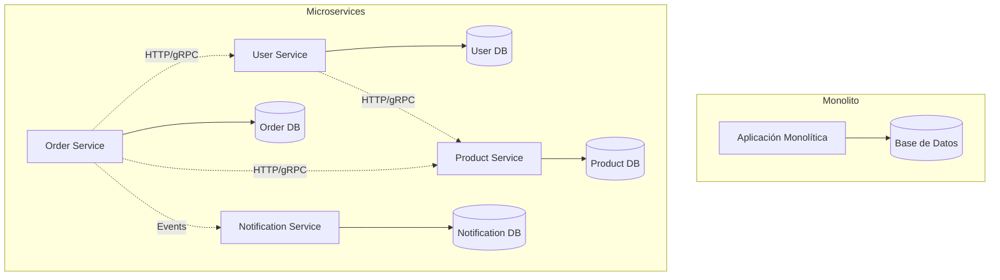
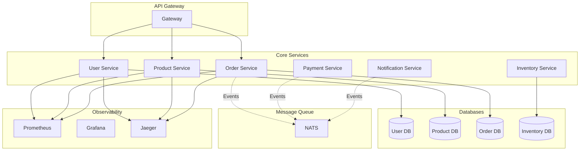

# 🔧 Lección 06: Microservices - Sistemas Distribuidos Modernos

> *"La arquitectura de microservicios no es sobre hacer servicios pequeños, es sobre hacer sistemas mantenibles"* - Sam Newman

## 🎯 Objetivos de Aprendizaje

Al finalizar esta lección serás capaz de:

- 🏗️ **Diseñar** arquitecturas de microservicios escalables
- 🔧 **Implementar** patrones fundamentales de comunicación
- 🌐 **Configurar** API Gateways y service mesh
- 🛡️ **Aplicar** circuit breakers y resilience patterns
- 📊 **Implementar** observabilidad distribuida
- ⚡ **Optimizar** comunicación entre servicios
- 🔐 **Asegurar** comunicación inter-servicio
- 📦 **Desplegar** sistemas distribuidos

---

## 📚 Contenido de la Lección

### 1. 🏗️ Fundamentos de Microservices
- Principios y beneficios
- Patrones de descomposición
- Domain-Driven Design aplicado
- Boundaries de servicios

### 2. 🌐 Comunicación Entre Servicios
- HTTP/REST vs gRPC
- Mensajería asíncrona
- Event sourcing
- API composition patterns

### 3. 🛠️ Infraestructura de Microservices
- Service discovery
- API Gateway patterns
- Load balancing
- Configuration management

### 4. 🔄 Resilience Patterns
- Circuit breakers
- Retries y timeouts
- Bulkhead isolation
- Graceful degradation

### 5. 📊 Observabilidad Distribuida
- Distributed tracing
- Metrics collection
- Centralized logging
- Health checks

---

## 🏗️ 1. Fundamentos de Microservices

### ¿Qué son los Microservices?

Los microservices son un estilo arquitectónico donde una aplicación se estructura como una colección de servicios pequeños, autónomos y débilmente acoplados.



### Principios Fundamentales

#### 1. 🎯 Single Responsibility
Cada servicio tiene una responsabilidad específica y bien definida.

```go
// ❌ Service con múltiples responsabilidades
type UserOrderNotificationService struct {
    // User management
    // Order processing  
    // Email sending
    // SMS sending
}

// ✅ Servicios especializados
type UserService struct {
    repo UserRepository
    auth AuthService
}

type OrderService struct {
    repo OrderRepository
    payment PaymentService
}

type NotificationService struct {
    email EmailProvider
    sms   SMSProvider
}
```

#### 2. 🔧 Autonomía de Servicios

```go
// Cada servicio maneja su propio estado
type UserService struct {
    db *sql.DB // Su propia base de datos
    cache *redis.Client // Su propio cache
    config Config // Su propia configuración
}

func (s *UserService) CreateUser(ctx context.Context, user User) error {
    // Validación local
    if err := user.Validate(); err != nil {
        return err
    }
    
    // Persistencia local
    if err := s.repo.Save(ctx, user); err != nil {
        return err
    }
    
    // Evento para otros servicios
    s.publisher.Publish("user.created", UserCreatedEvent{
        UserID: user.ID,
        Email:  user.Email,
    })
    
    return nil
}
```

#### 3. 🌐 Comunicación a través de APIs

```go
// HTTP REST interface
type UserHTTPHandler struct {
    service *UserService
}

func (h *UserHTTPHandler) GetUser(w http.ResponseWriter, r *http.Request) {
    userID := mux.Vars(r)["id"]
    
    user, err := h.service.GetUser(r.Context(), userID)
    if err != nil {
        http.Error(w, err.Error(), http.StatusNotFound)
        return
    }
    
    json.NewEncoder(w).Encode(user)
}

// gRPC interface
type UserGRPCServer struct {
    service *UserService
    pb.UnimplementedUserServiceServer
}

func (s *UserGRPCServer) GetUser(ctx context.Context, req *pb.GetUserRequest) (*pb.GetUserResponse, error) {
    user, err := s.service.GetUser(ctx, req.UserId)
    if err != nil {
        return nil, status.Errorf(codes.NotFound, "user not found")
    }
    
    return &pb.GetUserResponse{
        User: &pb.User{
            Id:    user.ID,
            Email: user.Email,
            Name:  user.Name,
        },
    }, nil
}
```

### Domain-Driven Design en Microservices

#### Bounded Contexts

```go
// User Context - Gestión de usuarios
package user

type User struct {
    ID       string
    Email    string
    Profile  UserProfile
    Settings UserSettings
}

type UserService interface {
    CreateUser(ctx context.Context, user User) error
    GetUser(ctx context.Context, id string) (User, error)
    UpdateProfile(ctx context.Context, id string, profile UserProfile) error
}

// Order Context - Gestión de pedidos  
package order

type Order struct {
    ID        string
    CustomerID string // Referencia al User Context
    Items     []OrderItem
    Status    OrderStatus
    Total     Money
}

type OrderService interface {
    CreateOrder(ctx context.Context, order Order) error
    GetOrder(ctx context.Context, id string) (Order, error)
    UpdateStatus(ctx context.Context, id string, status OrderStatus) error
}
```

#### Anti-Corruption Layer

```go
// Adapter para proteger nuestro dominio de APIs externas
type PaymentGatewayAdapter struct {
    client *stripe.Client
}

func (a *PaymentGatewayAdapter) ProcessPayment(ctx context.Context, payment Payment) (*PaymentResult, error) {
    // Convertir nuestro modelo al modelo de Stripe
    stripePayment := &stripe.PaymentIntentParams{
        Amount:   stripe.Int64(payment.Amount.Cents()),
        Currency: stripe.String(string(payment.Currency)),
        Metadata: map[string]string{
            "order_id": payment.OrderID,
        },
    }
    
    intent, err := a.client.PaymentIntents.New(stripePayment)
    if err != nil {
        return nil, fmt.Errorf("stripe payment failed: %w", err)
    }
    
    // Convertir respuesta de Stripe a nuestro modelo
    return &PaymentResult{
        TransactionID: intent.ID,
        Status:        mapStripeStatus(intent.Status),
        ProcessedAt:   time.Now(),
    }, nil
}
```

---

## 🌐 2. Comunicación Entre Servicios

### Comunicación Síncrona

#### HTTP/REST Client

```go
type OrderServiceClient struct {
    baseURL string
    client  *http.Client
}

func NewOrderServiceClient(baseURL string) *OrderServiceClient {
    return &OrderServiceClient{
        baseURL: baseURL,
        client: &http.Client{
            Timeout: 30 * time.Second,
        },
    }
}

func (c *OrderServiceClient) CreateOrder(ctx context.Context, order Order) (*Order, error) {
    body, err := json.Marshal(order)
    if err != nil {
        return nil, err
    }
    
    req, err := http.NewRequestWithContext(ctx, "POST", 
        c.baseURL+"/orders", bytes.NewBuffer(body))
    if err != nil {
        return nil, err
    }
    
    req.Header.Set("Content-Type", "application/json")
    
    resp, err := c.client.Do(req)
    if err != nil {
        return nil, err
    }
    defer resp.Body.Close()
    
    if resp.StatusCode != http.StatusCreated {
        return nil, fmt.Errorf("order creation failed: %s", resp.Status)
    }
    
    var createdOrder Order
    if err := json.NewDecoder(resp.Body).Decode(&createdOrder); err != nil {
        return nil, err
    }
    
    return &createdOrder, nil
}
```

#### gRPC Client con Connection Pooling

```go
type UserServiceGRPCClient struct {
    conn   *grpc.ClientConn
    client pb.UserServiceClient
}

func NewUserServiceGRPCClient(address string) (*UserServiceGRPCClient, error) {
    conn, err := grpc.Dial(address, 
        grpc.WithInsecure(),
        grpc.WithKeepaliveParams(keepalive.ClientParameters{
            Time:                10 * time.Second,
            Timeout:             time.Second,
            PermitWithoutStream: true,
        }),
        grpc.WithMaxMsgSize(4*1024*1024), // 4MB
    )
    if err != nil {
        return nil, err
    }
    
    return &UserServiceGRPCClient{
        conn:   conn,
        client: pb.NewUserServiceClient(conn),
    }, nil
}

func (c *UserServiceGRPCClient) GetUser(ctx context.Context, userID string) (*User, error) {
    resp, err := c.client.GetUser(ctx, &pb.GetUserRequest{
        UserId: userID,
    })
    if err != nil {
        return nil, err
    }
    
    return &User{
        ID:    resp.User.Id,
        Email: resp.User.Email,
        Name:  resp.User.Name,
    }, nil
}
```

### Comunicación Asíncrona

#### Event Publisher

```go
type EventPublisher interface {
    Publish(ctx context.Context, topic string, event interface{}) error
}

type NATSEventPublisher struct {
    conn *nats.Conn
}

func (p *NATSEventPublisher) Publish(ctx context.Context, topic string, event interface{}) error {
    data, err := json.Marshal(event)
    if err != nil {
        return err
    }
    
    return p.conn.Publish(topic, data)
}

// Event definitions
type UserCreatedEvent struct {
    UserID    string    `json:"user_id"`
    Email     string    `json:"email"`
    CreatedAt time.Time `json:"created_at"`
}

type OrderCompletedEvent struct {
    OrderID    string    `json:"order_id"`
    CustomerID string    `json:"customer_id"`
    Total      float64   `json:"total"`
    Items      []string  `json:"items"`
}
```

#### Event Subscriber

```go
type EventSubscriber interface {
    Subscribe(topic string, handler EventHandler) error
}

type EventHandler func(ctx context.Context, event []byte) error

type NATSEventSubscriber struct {
    conn *nats.Conn
}

func (s *NATSEventSubscriber) Subscribe(topic string, handler EventHandler) error {
    _, err := s.conn.Subscribe(topic, func(msg *nats.Msg) {
        ctx := context.Background()
        if err := handler(ctx, msg.Data); err != nil {
            log.Printf("Error handling event: %v", err)
        }
    })
    return err
}

// Event handler implementation
func (s *NotificationService) HandleUserCreated(ctx context.Context, eventData []byte) error {
    var event UserCreatedEvent
    if err := json.Unmarshal(eventData, &event); err != nil {
        return err
    }
    
    return s.SendWelcomeEmail(ctx, event.Email)
}
```

### Saga Pattern para Transacciones Distribuidas

```go
type SagaStep struct {
    Action     func(ctx context.Context) error
    Compensate func(ctx context.Context) error
}

type Saga struct {
    steps []SagaStep
}

func (s *Saga) Execute(ctx context.Context) error {
    executed := make([]int, 0, len(s.steps))
    
    // Execute forward
    for i, step := range s.steps {
        if err := step.Action(ctx); err != nil {
            // Compensate in reverse order
            for j := len(executed) - 1; j >= 0; j-- {
                if compErr := s.steps[executed[j]].Compensate(ctx); compErr != nil {
                    log.Printf("Compensation failed: %v", compErr)
                }
            }
            return err
        }
        executed = append(executed, i)
    }
    
    return nil
}

// Order processing saga
func CreateOrderSaga(orderSvc *OrderService, paymentSvc *PaymentService, inventorySvc *InventoryService) *Saga {
    return &Saga{
        steps: []SagaStep{
            {
                Action: func(ctx context.Context) error {
                    return inventorySvc.ReserveItems(ctx, order.Items)
                },
                Compensate: func(ctx context.Context) error {
                    return inventorySvc.ReleaseReservation(ctx, order.ID)
                },
            },
            {
                Action: func(ctx context.Context) error {
                    return paymentSvc.ChargePayment(ctx, order.PaymentInfo)
                },
                Compensate: func(ctx context.Context) error {
                    return paymentSvc.RefundPayment(ctx, order.PaymentID)
                },
            },
            {
                Action: func(ctx context.Context) error {
                    return orderSvc.ConfirmOrder(ctx, order.ID)
                },
                Compensate: func(ctx context.Context) error {
                    return orderSvc.CancelOrder(ctx, order.ID)
                },
            },
        },
    }
}
```

---

## 🛠️ 3. Infraestructura de Microservices

### Service Discovery

#### Consul-based Service Discovery

```go
type ServiceRegistry interface {
    Register(ctx context.Context, service ServiceInfo) error
    Deregister(ctx context.Context, serviceID string) error
    Discover(ctx context.Context, serviceName string) ([]ServiceInfo, error)
}

type ServiceInfo struct {
    ID      string
    Name    string
    Address string
    Port    int
    Tags    []string
    Health  HealthCheck
}

type HealthCheck struct {
    HTTP     string
    Interval time.Duration
    Timeout  time.Duration
}

type ConsulServiceRegistry struct {
    client *consul.Client
}

func (r *ConsulServiceRegistry) Register(ctx context.Context, service ServiceInfo) error {
    registration := &consul.AgentServiceRegistration{
        ID:      service.ID,
        Name:    service.Name,
        Address: service.Address,
        Port:    service.Port,
        Tags:    service.Tags,
        Check: &consul.AgentServiceCheck{
            HTTP:     service.Health.HTTP,
            Interval: service.Health.Interval.String(),
            Timeout:  service.Health.Timeout.String(),
        },
    }
    
    return r.client.Agent().ServiceRegister(registration)
}

func (r *ConsulServiceRegistry) Discover(ctx context.Context, serviceName string) ([]ServiceInfo, error) {
    services, _, err := r.client.Health().Service(serviceName, "", true, nil)
    if err != nil {
        return nil, err
    }
    
    var result []ServiceInfo
    for _, service := range services {
        result = append(result, ServiceInfo{
            ID:      service.Service.ID,
            Name:    service.Service.Service,
            Address: service.Service.Address,
            Port:    service.Service.Port,
            Tags:    service.Service.Tags,
        })
    }
    
    return result, nil
}
```

#### Client-side Load Balancing

```go
type LoadBalancer interface {
    Choose(services []ServiceInfo) ServiceInfo
}

type RoundRobinBalancer struct {
    current int64
}

func (lb *RoundRobinBalancer) Choose(services []ServiceInfo) ServiceInfo {
    if len(services) == 0 {
        return ServiceInfo{}
    }
    
    next := atomic.AddInt64(&lb.current, 1)
    return services[next%int64(len(services))]
}

type ServiceClient struct {
    registry    ServiceRegistry
    balancer    LoadBalancer
    serviceName string
    client      *http.Client
}

func (c *ServiceClient) makeRequest(ctx context.Context, path string, body io.Reader) (*http.Response, error) {
    services, err := c.registry.Discover(ctx, c.serviceName)
    if err != nil {
        return nil, err
    }
    
    if len(services) == 0 {
        return nil, fmt.Errorf("no healthy instances for service %s", c.serviceName)
    }
    
    service := c.balancer.Choose(services)
    url := fmt.Sprintf("http://%s:%d%s", service.Address, service.Port, path)
    
    req, err := http.NewRequestWithContext(ctx, "GET", url, body)
    if err != nil {
        return nil, err
    }
    
    return c.client.Do(req)
}
```

### API Gateway

```go
type APIGateway struct {
    routes     map[string]RouteConfig
    middleware []Middleware
    registry   ServiceRegistry
}

type RouteConfig struct {
    ServiceName string
    Path        string
    Methods     []string
    Auth        bool
    RateLimit   *RateLimit
}

type RateLimit struct {
    RequestsPerMinute int
    BurstSize         int
}

type Middleware func(http.Handler) http.Handler

func (gw *APIGateway) ServeHTTP(w http.ResponseWriter, r *http.Request) {
    // Find matching route
    route, found := gw.findRoute(r.URL.Path, r.Method)
    if !found {
        http.Error(w, "Route not found", http.StatusNotFound)
        return
    }
    
    // Apply middleware chain
    handler := gw.buildHandler(route)
    for i := len(gw.middleware) - 1; i >= 0; i-- {
        handler = gw.middleware[i](handler)
    }
    
    handler.ServeHTTP(w, r)
}

func (gw *APIGateway) buildHandler(route RouteConfig) http.Handler {
    return http.HandlerFunc(func(w http.ResponseWriter, r *http.Request) {
        // Service discovery
        services, err := gw.registry.Discover(r.Context(), route.ServiceName)
        if err != nil {
            http.Error(w, "Service unavailable", http.StatusServiceUnavailable)
            return
        }
        
        if len(services) == 0 {
            http.Error(w, "No healthy instances", http.StatusServiceUnavailable)
            return
        }
        
        // Load balance and proxy
        service := services[0] // Simple selection
        target := fmt.Sprintf("http://%s:%d", service.Address, service.Port)
        
        proxy := httputil.NewSingleHostReverseProxy(&url.URL{
            Scheme: "http",
            Host:   fmt.Sprintf("%s:%d", service.Address, service.Port),
        })
        
        proxy.ServeHTTP(w, r)
    })
}

// Middleware examples
func AuthMiddleware(next http.Handler) http.Handler {
    return http.HandlerFunc(func(w http.ResponseWriter, r *http.Request) {
        token := r.Header.Get("Authorization")
        if token == "" {
            http.Error(w, "Unauthorized", http.StatusUnauthorized)
            return
        }
        
        // Validate token...
        
        next.ServeHTTP(w, r)
    })
}

func RateLimitMiddleware(limit *RateLimit) Middleware {
    limiter := rate.NewLimiter(rate.Limit(limit.RequestsPerMinute/60), limit.BurstSize)
    
    return func(next http.Handler) http.Handler {
        return http.HandlerFunc(func(w http.ResponseWriter, r *http.Request) {
            if !limiter.Allow() {
                http.Error(w, "Rate limit exceeded", http.StatusTooManyRequests)
                return
            }
            
            next.ServeHTTP(w, r)
        })
    }
}
```

---

## 🔄 4. Resilience Patterns

### Circuit Breaker

```go
type CircuitBreakerState int

const (
    StateClosed CircuitBreakerState = iota
    StateOpen
    StateHalfOpen
)

type CircuitBreaker struct {
    maxFailures  int
    resetTimeout time.Duration
    
    mu            sync.RWMutex
    state         CircuitBreakerState
    failures      int
    lastFailTime  time.Time
    nextResetTime time.Time
}

func NewCircuitBreaker(maxFailures int, resetTimeout time.Duration) *CircuitBreaker {
    return &CircuitBreaker{
        maxFailures:  maxFailures,
        resetTimeout: resetTimeout,
        state:        StateClosed,
    }
}

func (cb *CircuitBreaker) Execute(fn func() error) error {
    cb.mu.RLock()
    state := cb.state
    nextResetTime := cb.nextResetTime
    cb.mu.RUnlock()
    
    // Check if we should try to reset
    if state == StateOpen && time.Now().After(nextResetTime) {
        cb.mu.Lock()
        cb.state = StateHalfOpen
        cb.mu.Unlock()
        state = StateHalfOpen
    }
    
    if state == StateOpen {
        return fmt.Errorf("circuit breaker is open")
    }
    
    err := fn()
    
    cb.mu.Lock()
    defer cb.mu.Unlock()
    
    if err != nil {
        cb.onFailure()
        return err
    }
    
    cb.onSuccess()
    return nil
}

func (cb *CircuitBreaker) onFailure() {
    cb.failures++
    cb.lastFailTime = time.Now()
    
    if cb.failures >= cb.maxFailures {
        cb.state = StateOpen
        cb.nextResetTime = time.Now().Add(cb.resetTimeout)
    }
}

func (cb *CircuitBreaker) onSuccess() {
    cb.failures = 0
    cb.state = StateClosed
}

// Usage with HTTP client
type ResilientHTTPClient struct {
    client  *http.Client
    breaker *CircuitBreaker
}

func (c *ResilientHTTPClient) Get(ctx context.Context, url string) (*http.Response, error) {
    var resp *http.Response
    
    err := c.breaker.Execute(func() error {
        req, err := http.NewRequestWithContext(ctx, "GET", url, nil)
        if err != nil {
            return err
        }
        
        resp, err = c.client.Do(req)
        if err != nil {
            return err
        }
        
        if resp.StatusCode >= 500 {
            return fmt.Errorf("server error: %s", resp.Status)
        }
        
        return nil
    })
    
    return resp, err
}
```

### Retry with Exponential Backoff

```go
type RetryConfig struct {
    MaxAttempts int
    BaseDelay   time.Duration
    MaxDelay    time.Duration
    Multiplier  float64
}

func RetryWithBackoff(ctx context.Context, config RetryConfig, fn func() error) error {
    var lastErr error
    delay := config.BaseDelay
    
    for attempt := 1; attempt <= config.MaxAttempts; attempt++ {
        if attempt > 1 {
            timer := time.NewTimer(delay)
            select {
            case <-ctx.Done():
                timer.Stop()
                return ctx.Err()
            case <-timer.C:
            }
        }
        
        if err := fn(); err == nil {
            return nil
        } else {
            lastErr = err
        }
        
        // Calculate next delay
        delay = time.Duration(float64(delay) * config.Multiplier)
        if delay > config.MaxDelay {
            delay = config.MaxDelay
        }
    }
    
    return fmt.Errorf("all retry attempts failed: %w", lastErr)
}

// Usage
func (c *UserServiceClient) GetUserWithRetry(ctx context.Context, userID string) (*User, error) {
    var user *User
    
    err := RetryWithBackoff(ctx, RetryConfig{
        MaxAttempts: 3,
        BaseDelay:   100 * time.Millisecond,
        MaxDelay:    1 * time.Second,
        Multiplier:  2.0,
    }, func() error {
        var err error
        user, err = c.GetUser(ctx, userID)
        return err
    })
    
    return user, err
}
```

### Bulkhead Isolation

```go
type BulkheadPool struct {
    name     string
    workers  chan struct{}
    queue    chan func()
    shutdown chan struct{}
    wg       sync.WaitGroup
}

func NewBulkheadPool(name string, workers int, queueSize int) *BulkheadPool {
    pool := &BulkheadPool{
        name:     name,
        workers:  make(chan struct{}, workers),
        queue:    make(chan func(), queueSize),
        shutdown: make(chan struct{}),
    }
    
    // Initialize worker semaphore
    for i := 0; i < workers; i++ {
        pool.workers <- struct{}{}
    }
    
    pool.start()
    return pool
}

func (p *BulkheadPool) start() {
    p.wg.Add(1)
    go func() {
        defer p.wg.Done()
        
        for {
            select {
            case task := <-p.queue:
                <-p.workers // Acquire worker
                go func(task func()) {
                    defer func() {
                        p.workers <- struct{}{} // Release worker
                    }()
                    task()
                }(task)
                
            case <-p.shutdown:
                return
            }
        }
    }()
}

func (p *BulkheadPool) Submit(ctx context.Context, task func()) error {
    select {
    case p.queue <- task:
        return nil
    case <-ctx.Done():
        return ctx.Err()
    case <-p.shutdown:
        return fmt.Errorf("pool is shutting down")
    default:
        return fmt.Errorf("pool queue is full")
    }
}

// Service with bulkhead isolation
type OrderService struct {
    criticalPool *BulkheadPool // High priority operations
    normalPool   *BulkheadPool // Normal operations
    batchPool    *BulkheadPool // Batch operations
}

func NewOrderService() *OrderService {
    return &OrderService{
        criticalPool: NewBulkheadPool("critical", 10, 100),
        normalPool:   NewBulkheadPool("normal", 20, 200),
        batchPool:    NewBulkheadPool("batch", 5, 50),
    }
}

func (s *OrderService) ProcessCriticalOrder(ctx context.Context, order Order) error {
    return s.criticalPool.Submit(ctx, func() {
        // Process high priority order
        s.processCriticalOrderSync(order)
    })
}
```

---

## 📊 5. Observabilidad Distribuida

### Distributed Tracing

```go
import (
    "go.opentelemetry.io/otel"
    "go.opentelemetry.io/otel/trace"
    "go.opentelemetry.io/otel/attribute"
)

type TracedOrderService struct {
    service *OrderService
    tracer  trace.Tracer
}

func NewTracedOrderService(service *OrderService) *TracedOrderService {
    return &TracedOrderService{
        service: service,
        tracer:  otel.Tracer("order-service"),
    }
}

func (s *TracedOrderService) CreateOrder(ctx context.Context, order Order) error {
    ctx, span := s.tracer.Start(ctx, "order.create",
        trace.WithAttributes(
            attribute.String("order.id", order.ID),
            attribute.String("customer.id", order.CustomerID),
            attribute.Float64("order.total", order.Total),
        ),
    )
    defer span.End()
    
    // Validate order
    if err := s.validateOrder(ctx, order); err != nil {
        span.RecordError(err)
        span.SetStatus(codes.Error, "order validation failed")
        return err
    }
    
    // Process payment
    if err := s.processPayment(ctx, order); err != nil {
        span.RecordError(err)
        span.SetStatus(codes.Error, "payment processing failed")
        return err
    }
    
    // Save order
    if err := s.service.SaveOrder(ctx, order); err != nil {
        span.RecordError(err)
        span.SetStatus(codes.Error, "order save failed")
        return err
    }
    
    span.SetAttributes(attribute.String("order.status", "created"))
    span.SetStatus(codes.Ok, "order created successfully")
    
    return nil
}

func (s *TracedOrderService) validateOrder(ctx context.Context, order Order) error {
    _, span := s.tracer.Start(ctx, "order.validate")
    defer span.End()
    
    // Validation logic...
    return nil
}

func (s *TracedOrderService) processPayment(ctx context.Context, order Order) error {
    _, span := s.tracer.Start(ctx, "order.payment")
    defer span.End()
    
    span.SetAttributes(
        attribute.String("payment.method", order.PaymentMethod),
        attribute.Float64("payment.amount", order.Total),
    )
    
    // Payment processing...
    return nil
}
```

### Metrics Collection

```go
import (
    "github.com/prometheus/client_golang/prometheus"
    "github.com/prometheus/client_golang/prometheus/promauto"
)

type ServiceMetrics struct {
    requestsTotal     *prometheus.CounterVec
    requestDuration   *prometheus.HistogramVec
    activeConnections prometheus.Gauge
    errorsTotal       *prometheus.CounterVec
}

func NewServiceMetrics(serviceName string) *ServiceMetrics {
    return &ServiceMetrics{
        requestsTotal: promauto.NewCounterVec(
            prometheus.CounterOpts{
                Name: "http_requests_total",
                Help: "Total number of HTTP requests",
            },
            []string{"service", "method", "endpoint", "status"},
        ),
        requestDuration: promauto.NewHistogramVec(
            prometheus.HistogramOpts{
                Name:    "http_request_duration_seconds",
                Help:    "HTTP request duration in seconds",
                Buckets: prometheus.DefBuckets,
            },
            []string{"service", "method", "endpoint"},
        ),
        activeConnections: promauto.NewGauge(
            prometheus.GaugeOpts{
                Name: "active_connections",
                Help: "Number of active connections",
            },
        ),
        errorsTotal: promauto.NewCounterVec(
            prometheus.CounterOpts{
                Name: "errors_total",
                Help: "Total number of errors",
            },
            []string{"service", "type", "operation"},
        ),
    }
}

// Metrics middleware
func (m *ServiceMetrics) MetricsMiddleware(serviceName string) func(http.Handler) http.Handler {
    return func(next http.Handler) http.Handler {
        return http.HandlerFunc(func(w http.ResponseWriter, r *http.Request) {
            start := time.Now()
            
            // Wrap ResponseWriter to capture status code
            wrapped := &responseWriter{ResponseWriter: w, statusCode: http.StatusOK}
            
            m.activeConnections.Inc()
            defer m.activeConnections.Dec()
            
            next.ServeHTTP(wrapped, r)
            
            duration := time.Since(start).Seconds()
            statusCode := strconv.Itoa(wrapped.statusCode)
            
            m.requestsTotal.WithLabelValues(
                serviceName, r.Method, r.URL.Path, statusCode,
            ).Inc()
            
            m.requestDuration.WithLabelValues(
                serviceName, r.Method, r.URL.Path,
            ).Observe(duration)
            
            if wrapped.statusCode >= 400 {
                m.errorsTotal.WithLabelValues(
                    serviceName, "http_error", r.URL.Path,
                ).Inc()
            }
        })
    }
}

type responseWriter struct {
    http.ResponseWriter
    statusCode int
}

func (rw *responseWriter) WriteHeader(code int) {
    rw.statusCode = code
    rw.ResponseWriter.WriteHeader(code)
}
```

### Centralized Logging

```go
import (
    "github.com/sirupsen/logrus"
    "github.com/elastic/go-elasticsearch/v8"
)

type StructuredLogger struct {
    logger    *logrus.Logger
    service   string
    version   string
    env       string
    traceID   string
}

func NewStructuredLogger(service, version, env string) *StructuredLogger {
    logger := logrus.New()
    logger.SetFormatter(&logrus.JSONFormatter{
        TimestampFormat: time.RFC3339,
    })
    
    return &StructuredLogger{
        logger:  logger,
        service: service,
        version: version,
        env:     env,
    }
}

func (l *StructuredLogger) WithTrace(traceID string) *StructuredLogger {
    return &StructuredLogger{
        logger:  l.logger,
        service: l.service,
        version: l.version,
        env:     l.env,
        traceID: traceID,
    }
}

func (l *StructuredLogger) Info(message string, fields map[string]interface{}) {
    entry := l.logger.WithFields(logrus.Fields{
        "service": l.service,
        "version": l.version,
        "env":     l.env,
        "trace_id": l.traceID,
    })
    
    for k, v := range fields {
        entry = entry.WithField(k, v)
    }
    
    entry.Info(message)
}

func (l *StructuredLogger) Error(message string, err error, fields map[string]interface{}) {
    entry := l.logger.WithFields(logrus.Fields{
        "service": l.service,
        "version": l.version,
        "env":     l.env,
        "trace_id": l.traceID,
        "error":   err.Error(),
    })
    
    for k, v := range fields {
        entry = entry.WithField(k, v)
    }
    
    entry.Error(message)
}

// Request logging middleware
func LoggingMiddleware(logger *StructuredLogger) func(http.Handler) http.Handler {
    return func(next http.Handler) http.Handler {
        return http.HandlerFunc(func(w http.ResponseWriter, r *http.Request) {
            start := time.Now()
            
            // Extract trace ID from context
            span := trace.SpanFromContext(r.Context())
            traceID := span.SpanContext().TraceID().String()
            
            logger := logger.WithTrace(traceID)
            
            wrapped := &responseWriter{ResponseWriter: w, statusCode: http.StatusOK}
            
            logger.Info("request started", map[string]interface{}{
                "method":     r.Method,
                "path":       r.URL.Path,
                "remote_ip":  r.RemoteAddr,
                "user_agent": r.UserAgent(),
            })
            
            next.ServeHTTP(wrapped, r)
            
            duration := time.Since(start)
            
            fields := map[string]interface{}{
                "method":       r.Method,
                "path":         r.URL.Path,
                "status_code":  wrapped.statusCode,
                "duration_ms":  duration.Milliseconds(),
                "response_size": wrapped.size,
            }
            
            if wrapped.statusCode >= 400 {
                logger.Error("request failed", nil, fields)
            } else {
                logger.Info("request completed", fields)
            }
        })
    }
}
```

### Health Checks

```go
type HealthChecker struct {
    checks map[string]HealthCheck
    mu     sync.RWMutex
}

type HealthCheck interface {
    Name() string
    Check(ctx context.Context) error
}

type HealthStatus struct {
    Status string                 `json:"status"`
    Checks map[string]CheckResult `json:"checks"`
}

type CheckResult struct {
    Status  string `json:"status"`
    Message string `json:"message,omitempty"`
}

func NewHealthChecker() *HealthChecker {
    return &HealthChecker{
        checks: make(map[string]HealthCheck),
    }
}

func (hc *HealthChecker) AddCheck(check HealthCheck) {
    hc.mu.Lock()
    defer hc.mu.Unlock()
    hc.checks[check.Name()] = check
}

func (hc *HealthChecker) CheckHealth(ctx context.Context) HealthStatus {
    hc.mu.RLock()
    defer hc.mu.RUnlock()
    
    results := make(map[string]CheckResult)
    allHealthy := true
    
    for name, check := range hc.checks {
        if err := check.Check(ctx); err != nil {
            results[name] = CheckResult{
                Status:  "unhealthy",
                Message: err.Error(),
            }
            allHealthy = false
        } else {
            results[name] = CheckResult{
                Status: "healthy",
            }
        }
    }
    
    status := "healthy"
    if !allHealthy {
        status = "unhealthy"
    }
    
    return HealthStatus{
        Status: status,
        Checks: results,
    }
}

// Database health check
type DatabaseHealthCheck struct {
    db *sql.DB
}

func (dhc *DatabaseHealthCheck) Name() string {
    return "database"
}

func (dhc *DatabaseHealthCheck) Check(ctx context.Context) error {
    return dhc.db.PingContext(ctx)
}

// External service health check
type ServiceHealthCheck struct {
    client      *http.Client
    serviceURL  string
    serviceName string
}

func (shc *ServiceHealthCheck) Name() string {
    return shc.serviceName
}

func (shc *ServiceHealthCheck) Check(ctx context.Context) error {
    req, err := http.NewRequestWithContext(ctx, "GET", shc.serviceURL+"/health", nil)
    if err != nil {
        return err
    }
    
    resp, err := shc.client.Do(req)
    if err != nil {
        return err
    }
    defer resp.Body.Close()
    
    if resp.StatusCode != http.StatusOK {
        return fmt.Errorf("service returned status %d", resp.StatusCode)
    }
    
    return nil
}
```

---

## 🏁 Ejemplo Completo: E-Commerce Microservices

### Arquitectura General



### Main Application Structure

```go
// cmd/gateway/main.go
func main() {
    config := loadConfig()
    
    // Service registry
    registry := consul.NewServiceRegistry(config.ConsulAddr)
    
    // API Gateway
    gateway := NewAPIGateway(registry)
    gateway.AddRoute("/api/users/*", "user-service")
    gateway.AddRoute("/api/products/*", "product-service")
    gateway.AddRoute("/api/orders/*", "order-service")
    
    // Add middleware
    gateway.Use(AuthMiddleware())
    gateway.Use(RateLimitMiddleware(100))
    gateway.Use(MetricsMiddleware())
    gateway.Use(LoggingMiddleware())
    
    log.Printf("API Gateway starting on port %d", config.Port)
    log.Fatal(http.ListenAndServe(fmt.Sprintf(":%d", config.Port), gateway))
}

// cmd/user-service/main.go
func main() {
    config := loadConfig()
    
    // Database
    db, err := sql.Open("postgres", config.DatabaseURL)
    if err != nil {
        log.Fatal(err)
    }
    defer db.Close()
    
    // Repository
    repo := postgres.NewUserRepository(db)
    
    // Service
    userService := services.NewUserService(repo)
    
    // Tracing
    tracedService := NewTracedUserService(userService)
    
    // Circuit breaker
    resilientService := NewResilientUserService(tracedService)
    
    // HTTP handler
    handler := handlers.NewUserHandler(resilientService)
    
    // Router
    router := mux.NewRouter()
    router.Handle("/users", handler).Methods("POST")
    router.Handle("/users/{id}", handler).Methods("GET")
    router.Handle("/health", healthHandler())
    
    // Middleware
    router.Use(MetricsMiddleware("user-service"))
    router.Use(LoggingMiddleware(logger))
    
    // Service registration
    registry := consul.NewServiceRegistry(config.ConsulAddr)
    err = registry.Register(context.Background(), ServiceInfo{
        ID:      config.ServiceID,
        Name:    "user-service",
        Address: config.Address,
        Port:    config.Port,
        Health: HealthCheck{
            HTTP:     fmt.Sprintf("http://%s:%d/health", config.Address, config.Port),
            Interval: 10 * time.Second,
            Timeout:  5 * time.Second,
        },
    })
    if err != nil {
        log.Fatal(err)
    }
    
    log.Printf("User service starting on port %d", config.Port)
    log.Fatal(http.ListenAndServe(fmt.Sprintf(":%d", config.Port), router))
}
```

---

## 📝 Resumen

En esta lección has aprendido:

### 🏗️ **Arquitectura de Microservices**
- Principios fundamentales y beneficios
- Patrones de descomposición de servicios
- Domain-Driven Design aplicado

### 🌐 **Comunicación Entre Servicios**
- HTTP/REST vs gRPC
- Mensajería asíncrona con eventos
- Saga pattern para transacciones distribuidas

### 🛠️ **Infraestructura**
- Service discovery y registro
- API Gateway y load balancing
- Configuration management

### 🔄 **Resilience Patterns**
- Circuit breakers para fault tolerance
- Retry policies con exponential backoff
- Bulkhead isolation para resource management

### 📊 **Observabilidad**
- Distributed tracing con OpenTelemetry
- Metrics collection con Prometheus
- Centralized logging estructurado
- Health checks comprensivos

---

## 🏆 Proyecto: E-Commerce Distribuido

¡Estás listo para implementar un sistema completo de microservices! En la siguiente sección encontrarás los ejercicios prácticos y el proyecto final que te permitirá aplicar todos estos conceptos.

**🎯 Próximo**: [Ejercicios Prácticos](./EJERCICIOS.md)
