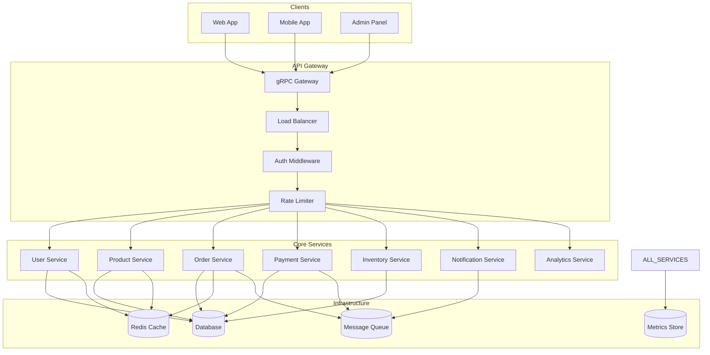

# 🚀 Proyecto Final: Sistema E-Commerce gRPC de Alta Performance

> **Objetivo**: Construir un sistema e-commerce completo utilizando gRPC con todos los patrones avanzados, streaming, seguridad, observabilidad y optimizaciones de performance.

---

## 🎯 Visión del Proyecto

Desarrollarás un **ecosistema de microservices e-commerce** que demuestre el dominio completo de gRPC en un entorno de producción real. El sistema manejará operaciones críticas como gestión de usuarios, procesamiento de órdenes, pagos y notificaciones en tiempo real.

### 🌟 **Características Principales**

#### 🏗️ **Arquitectura de Microservices**
- 7 servicios gRPC independientes
- API Gateway como punto de entrada único
- Service discovery y load balancing
- Event-driven architecture

#### 📡 **Comunicación Avanzada**
- Streaming para updates en tiempo real
- Bulk operations eficientes
- Fallback mechanisms
- Circuit breaker patterns

#### 🛡️ **Seguridad Enterprise**
- JWT authentication multi-tenant
- Role-based access control (RBAC)
- TLS mutual authentication
- Rate limiting adaptivo

#### ⚡ **Performance de Producción**
- Connection pooling inteligente
- Response caching distribuido
- Compression automática
- Load balancing con health checks

#### 🔍 **Observabilidad 360°**
- Distributed tracing completo
- Business metrics customizadas
- Real-time alerting
- Performance profiling

---

## 🏛️ Arquitectura del Sistema



---

## 📋 Especificaciones Técnicas

### 🔧 **Core Services**

#### 1. 👥 **User Service**
**Responsabilidades:**
- Gestión completa de usuarios
- Profiles y preferencias
- Authentication y autorización
- User activity tracking

**API Surface:**
```protobuf
service UserService {
  // CRUD Operations
  rpc CreateUser(CreateUserRequest) returns (CreateUserResponse);
  rpc GetUser(GetUserRequest) returns (GetUserResponse);
  rpc UpdateUser(UpdateUserRequest) returns (UpdateUserResponse);
  rpc DeleteUser(DeleteUserRequest) returns (DeleteUserResponse);
  
  // Bulk Operations
  rpc BatchGetUsers(BatchGetUsersRequest) returns (BatchGetUsersResponse);
  rpc BatchCreateUsers(stream CreateUserRequest) returns (BatchCreateUsersResponse);
  
  // Search & Filtering
  rpc SearchUsers(SearchUsersRequest) returns (SearchUsersResponse);
  rpc ListUsers(ListUsersRequest) returns (stream User);
  
  // Activity & Analytics
  rpc TrackUserActivity(TrackActivityRequest) returns (TrackActivityResponse);
  rpc GetUserAnalytics(GetAnalyticsRequest) returns (GetAnalyticsResponse);
  
  // Real-time Updates
  rpc StreamUserUpdates(StreamUserUpdatesRequest) returns (stream UserUpdate);
  
  // Health & Admin
  rpc Health(google.protobuf.Empty) returns (HealthResponse);
  rpc GetMetrics(GetMetricsRequest) returns (GetMetricsResponse);
}
```

**Features Avanzadas:**
- Profile completeness scoring
- Recommendation engine integration
- Social features (following, reviews)
- Privacy controls granulares

#### 2. 🛍️ **Product Service**
**Responsabilidades:**
- Catálogo de productos completo
- Gestión de inventario
- Pricing y promotions
- Search y recommendations

**API Surface:**
```protobuf
service ProductService {
  // Product Management
  rpc CreateProduct(CreateProductRequest) returns (CreateProductResponse);
  rpc GetProduct(GetProductRequest) returns (GetProductResponse);
  rpc UpdateProduct(UpdateProductRequest) returns (UpdateProductResponse);
  rpc DeleteProduct(DeleteProductRequest) returns (DeleteProductResponse);
  
  // Advanced Search
  rpc SearchProducts(SearchProductsRequest) returns (SearchProductsResponse);
  rpc GetProductRecommendations(GetRecommendationsRequest) returns (GetRecommendationsResponse);
  rpc FilterProducts(FilterProductsRequest) returns (stream Product);
  
  // Inventory Management
  rpc CheckAvailability(CheckAvailabilityRequest) returns (CheckAvailabilityResponse);
  rpc ReserveStock(ReserveStockRequest) returns (ReserveStockResponse);
  rpc ReleaseStock(ReleaseStockRequest) returns (ReleaseStockResponse);
  
  // Real-time Updates
  rpc StreamProductUpdates(StreamProductUpdatesRequest) returns (stream ProductUpdate);
  rpc StreamPriceChanges(StreamPriceChangesRequest) returns (stream PriceUpdate);
  
  // Analytics
  rpc GetProductAnalytics(GetProductAnalyticsRequest) returns (GetProductAnalyticsResponse);
  rpc TrackProductView(TrackProductViewRequest) returns (TrackProductViewResponse);
}
```

**Features Avanzadas:**
- Dynamic pricing engine
- A/B testing para listings
- Multi-variant products
- SEO optimization automática

#### 3. 📦 **Order Service**
**Responsabilidades:**
- Order lifecycle management
- Payment coordination
- Shipping integration
- Order analytics

**API Surface:**
```protobuf
service OrderService {
  // Order Management
  rpc CreateOrder(CreateOrderRequest) returns (CreateOrderResponse);
  rpc GetOrder(GetOrderRequest) returns (GetOrderResponse);
  rpc UpdateOrderStatus(UpdateOrderStatusRequest) returns (UpdateOrderStatusResponse);
  rpc CancelOrder(CancelOrderRequest) returns (CancelOrderResponse);
  
  // Bulk Operations
  rpc ProcessBulkOrders(stream ProcessOrderRequest) returns (ProcessBulkOrdersResponse);
  rpc BatchUpdateOrders(BatchUpdateOrdersRequest) returns (BatchUpdateOrdersResponse);
  
  // Customer Views
  rpc GetUserOrders(GetUserOrdersRequest) returns (GetUserOrdersResponse);
  rpc SearchOrders(SearchOrdersRequest) returns (SearchOrdersResponse);
  
  // Real-time Tracking
  rpc StreamOrderUpdates(StreamOrderUpdatesRequest) returns (stream OrderUpdate);
  rpc TrackOrder(TrackOrderRequest) returns (stream OrderStatus);
  
  // Analytics
  rpc GetOrderAnalytics(GetOrderAnalyticsRequest) returns (GetOrderAnalyticsResponse);
  rpc GenerateOrderReport(GenerateReportRequest) returns (GenerateReportResponse);
}
```

**Features Avanzadas:**
- Multi-step checkout workflow
- Order splitting por warehouse
- Return/refund management
- Fraud detection integration

#### 4. 💳 **Payment Service**
**Responsabilidades:**
- Payment processing
- Multiple payment methods
- Fraud detection
- Financial reporting

**API Surface:**
```protobuf
service PaymentService {
  // Payment Processing
  rpc ProcessPayment(ProcessPaymentRequest) returns (ProcessPaymentResponse);
  rpc RefundPayment(RefundPaymentRequest) returns (RefundPaymentResponse);
  rpc CapturePayment(CapturePaymentRequest) returns (CapturePaymentResponse);
  
  // Payment Methods
  rpc AddPaymentMethod(AddPaymentMethodRequest) returns (AddPaymentMethodResponse);
  rpc GetPaymentMethods(GetPaymentMethodsRequest) returns (GetPaymentMethodsResponse);
  rpc DeletePaymentMethod(DeletePaymentMethodRequest) returns (DeletePaymentMethodResponse);
  
  // Subscriptions
  rpc CreateSubscription(CreateSubscriptionRequest) returns (CreateSubscriptionResponse);
  rpc ManageSubscription(ManageSubscriptionRequest) returns (ManageSubscriptionResponse);
  
  // Security & Fraud
  rpc ValidatePayment(ValidatePaymentRequest) returns (ValidatePaymentResponse);
  rpc ReportFraud(ReportFraudRequest) returns (ReportFraudResponse);
  
  // Analytics
  rpc GetPaymentAnalytics(GetPaymentAnalyticsRequest) returns (GetPaymentAnalyticsResponse);
  rpc GenerateFinancialReport(GenerateFinancialReportRequest) returns (GenerateFinancialReportResponse);
}
```

**Features Avanzadas:**
- Multi-currency support
- Cryptocurrency integration
- PCI DSS compliance
- Real-time fraud scoring

#### 5. 📦 **Inventory Service**
**Responsabilidades:**
- Stock management
- Warehouse operations
- Supply chain coordination
- Demand forecasting

**API Surface:**
```protobuf
service InventoryService {
  // Stock Management
  rpc GetStock(GetStockRequest) returns (GetStockResponse);
  rpc UpdateStock(UpdateStockRequest) returns (UpdateStockResponse);
  rpc ReserveStock(ReserveStockRequest) returns (ReserveStockResponse);
  rpc ReleaseStock(ReleaseStockRequest) returns (ReleaseStockResponse);
  
  // Warehouse Operations
  rpc TransferStock(TransferStockRequest) returns (TransferStockResponse);
  rpc ProcessWarehouseEvent(ProcessWarehouseEventRequest) returns (ProcessWarehouseEventResponse);
  
  // Real-time Updates
  rpc StreamStockUpdates(StreamStockUpdatesRequest) returns (stream StockUpdate);
  rpc StreamLowStockAlerts(StreamLowStockAlertsRequest) returns (stream LowStockAlert);
  
  // Analytics & Forecasting
  rpc GetInventoryAnalytics(GetInventoryAnalyticsRequest) returns (GetInventoryAnalyticsResponse);
  rpc GenerateDemandForecast(GenerateDemandForecastRequest) returns (GenerateDemandForecastResponse);
}
```

**Features Avanzadas:**
- Multi-warehouse support
- Just-in-time inventory
- Predictive restocking
- Loss prevention tracking

#### 6. 🔔 **Notification Service**
**Responsabilidades:**
- Multi-channel notifications
- Template management
- Delivery tracking
- User preferences

**API Surface:**
```protobuf
service NotificationService {
  // Notification Dispatch
  rpc SendNotification(SendNotificationRequest) returns (SendNotificationResponse);
  rpc SendBulkNotifications(stream SendNotificationRequest) returns (SendBulkNotificationsResponse);
  
  // Template Management
  rpc CreateTemplate(CreateTemplateRequest) returns (CreateTemplateResponse);
  rpc GetTemplate(GetTemplateRequest) returns (GetTemplateResponse);
  rpc UpdateTemplate(UpdateTemplateRequest) returns (UpdateTemplateResponse);
  
  // User Preferences
  rpc GetUserPreferences(GetUserPreferencesRequest) returns (GetUserPreferencesResponse);
  rpc UpdateUserPreferences(UpdateUserPreferencesRequest) returns (UpdateUserPreferencesResponse);
  
  // Real-time Delivery
  rpc StreamNotifications(StreamNotificationsRequest) returns (stream Notification);
  rpc StreamDeliveryStatus(StreamDeliveryStatusRequest) returns (stream DeliveryStatus);
  
  // Analytics
  rpc GetNotificationAnalytics(GetNotificationAnalyticsRequest) returns (GetNotificationAnalyticsResponse);
  rpc TrackNotificationEngagement(TrackEngagementRequest) returns (TrackEngagementResponse);
}
```

**Features Avanzadas:**
- Multi-channel delivery (email, SMS, push, in-app)
- Intelligent scheduling
- A/B testing para templates
- Delivery optimization

#### 7. 📊 **Analytics Service**
**Responsabilidades:**
- Business intelligence
- Real-time analytics
- Reporting engine
- Data visualization

**API Surface:**
```protobuf
service AnalyticsService {
  // Event Tracking
  rpc TrackEvent(TrackEventRequest) returns (TrackEventResponse);
  rpc BatchTrackEvents(stream TrackEventRequest) returns (BatchTrackEventsResponse);
  
  // Metrics & KPIs
  rpc GetMetrics(GetMetricsRequest) returns (GetMetricsResponse);
  rpc GetRealTimeMetrics(GetRealTimeMetricsRequest) returns (stream MetricUpdate);
  
  // Reports
  rpc GenerateReport(GenerateReportRequest) returns (GenerateReportResponse);
  rpc GetDashboardData(GetDashboardDataRequest) returns (GetDashboardDataResponse);
  
  // Insights
  rpc GetBusinessInsights(GetBusinessInsightsRequest) returns (GetBusinessInsightsResponse);
  rpc GetPredictiveAnalytics(GetPredictiveAnalyticsRequest) returns (GetPredictiveAnalyticsResponse);
  
  // Data Export
  rpc ExportData(ExportDataRequest) returns (stream DataChunk);
  rpc ScheduleReport(ScheduleReportRequest) returns (ScheduleReportResponse);
}
```

**Features Avanzadas:**
- Real-time dashboards
- Machine learning insights
- Custom dimensions y metrics
- Data warehouse integration

### 🌐 **API Gateway**

El API Gateway actúa como el punto de entrada único y orquesta todas las interacciones entre servicios.

**Responsabilidades Core:**
- Request routing y load balancing
- Authentication y authorization
- Rate limiting y throttling
- Response aggregation
- Circuit breaking
- Caching inteligente

**Features Avanzadas:**
```go
type APIGateway struct {
    // Service Clients
    userClient      pb.UserServiceClient
    productClient   pb.ProductServiceClient
    orderClient     pb.OrderServiceClient
    paymentClient   pb.PaymentServiceClient
    inventoryClient pb.InventoryServiceClient
    notifClient     pb.NotificationServiceClient
    analyticsClient pb.AnalyticsServiceClient
    
    // Infrastructure
    serviceRegistry ServiceRegistry
    loadBalancer    LoadBalancer
    circuitBreaker  CircuitBreakerManager
    cache          CacheManager
    rateLimiter    RateLimiter
    
    // Observability
    tracer     trace.Tracer
    metrics    MetricsCollector
    logger     Logger
}

// Composition Patterns
func (gw *APIGateway) GetEnrichedOrder(ctx context.Context, orderID string) (*EnrichedOrder, error)
func (gw *APIGateway) ProcessCompleteCheckout(ctx context.Context, req *CheckoutRequest) (*CheckoutResponse, error)
func (gw *APIGateway) GetPersonalizedHomepage(ctx context.Context, userID string) (*Homepage, error)
func (gw *APIGateway) StreamUserActivity(req *StreamActivityRequest, stream Gateway_StreamUserActivityServer) error
```

---

## 🛠️ Implementación Técnica

### 📁 **Estructura de Proyecto**

```
grpc-ecommerce/
├── 📂 proto/                          # Protocol Buffer definitions
│   ├── user/
│   │   ├── user.proto
│   │   ├── user_service.proto
│   │   └── user_types.proto
│   ├── product/
│   │   ├── product.proto
│   │   ├── product_service.proto
│   │   └── catalog_types.proto
│   ├── order/
│   │   ├── order.proto
│   │   ├── order_service.proto
│   │   └── order_types.proto
│   ├── payment/
│   │   ├── payment.proto
│   │   ├── payment_service.proto
│   │   └── payment_types.proto
│   ├── inventory/
│   │   ├── inventory.proto
│   │   ├── inventory_service.proto
│   │   └── warehouse_types.proto
│   ├── notification/
│   │   ├── notification.proto
│   │   ├── notification_service.proto
│   │   └── template_types.proto
│   ├── analytics/
│   │   ├── analytics.proto
│   │   ├── analytics_service.proto
│   │   └── metrics_types.proto
│   ├── gateway/
│   │   ├── gateway.proto
│   │   ├── gateway_service.proto
│   │   └── composition_types.proto
│   └── common/
│       ├── common_types.proto
│       ├── errors.proto
│       └── pagination.proto
│
├── 📂 services/                       # Microservice implementations
│   ├── user/
│   │   ├── server/
│   │   │   ├── user_server.go
│   │   │   ├── handlers.go
│   │   │   ├── validation.go
│   │   │   └── business_logic.go
│   │   ├── storage/
│   │   │   ├── repository.go
│   │   │   ├── postgres.go
│   │   │   └── cache.go
│   │   ├── models/
│   │   └── main.go
│   ├── product/
│   │   ├── server/
│   │   ├── storage/
│   │   ├── search/
│   │   ├── recommendations/
│   │   └── main.go
│   ├── order/
│   │   ├── server/
│   │   ├── storage/
│   │   ├── workflow/
│   │   ├── payment_integration/
│   │   └── main.go
│   ├── payment/
│   │   ├── server/
│   │   ├── storage/
│   │   ├── processors/
│   │   ├── fraud_detection/
│   │   └── main.go
│   ├── inventory/
│   │   ├── server/
│   │   ├── storage/
│   │   ├── warehouse/
│   │   ├── forecasting/
│   │   └── main.go
│   ├── notification/
│   │   ├── server/
│   │   ├── channels/
│   │   ├── templates/
│   │   ├── delivery/
│   │   └── main.go
│   └── analytics/
│       ├── server/
│       ├── storage/
│       ├── processing/
│       ├── ml/
│       └── main.go
│
├── 📂 gateway/                        # API Gateway
│   ├── server/
│   │   ├── gateway_server.go
│   │   ├── composition.go
│   │   ├── routing.go
│   │   └── aggregation.go
│   ├── middleware/
│   │   ├── auth.go
│   │   ├── rate_limiting.go
│   │   ├── circuit_breaker.go
│   │   ├── caching.go
│   │   └── logging.go
│   ├── clients/
│   │   ├── service_clients.go
│   │   ├── connection_pool.go
│   │   └── load_balancer.go
│   └── main.go
│
├── 📂 pkg/                           # Shared packages
│   ├── auth/
│   │   ├── jwt.go
│   │   ├── permissions.go
│   │   └── middleware.go
│   ├── cache/
│   │   ├── redis.go
│   │   ├── memory.go
│   │   └── interface.go
│   ├── database/
│   │   ├── postgres.go
│   │   ├── migrations/
│   │   └── connection.go
│   ├── messaging/
│   │   ├── kafka.go
│   │   ├── redis_pub_sub.go
│   │   └── interface.go
│   ├── observability/
│   │   ├── tracing.go
│   │   ├── metrics.go
│   │   ├── logging.go
│   │   └── health.go
│   ├── performance/
│   │   ├── connection_pool.go
│   │   ├── circuit_breaker.go
│   │   ├── rate_limiter.go
│   │   └── compression.go
│   └── utils/
│       ├── validation.go
│       ├── pagination.go
│       └── helpers.go
│
├── 📂 clients/                       # gRPC Client libraries
│   ├── go/
│   │   ├── ecommerce_client.go
│   │   ├── service_clients.go
│   │   ├── connection_manager.go
│   │   └── examples/
│   ├── typescript/
│   │   ├── ecommerce-client/
│   │   └── examples/
│   └── python/
│       ├── ecommerce_client/
│       └── examples/
│
├── 📂 deployment/                    # Deployment configurations
│   ├── docker/
│   │   ├── docker-compose.yml
│   │   ├── docker-compose.prod.yml
│   │   └── Dockerfiles/
│   ├── kubernetes/
│   │   ├── manifests/
│   │   ├── helm-charts/
│   │   └── operators/
│   ├── terraform/
│   │   ├── infrastructure/
│   │   └── modules/
│   └── ansible/
│       ├── playbooks/
│       └── roles/
│
├── 📂 monitoring/                    # Observability stack
│   ├── grafana/
│   │   ├── dashboards/
│   │   └── datasources/
│   ├── prometheus/
│   │   ├── rules/
│   │   └── config/
│   ├── jaeger/
│   │   └── config/
│   └── elk/
│       ├── elasticsearch/
│       ├── logstash/
│       └── kibana/
│
├── 📂 tests/                         # Testing suite
│   ├── unit/
│   │   ├── services/
│   │   ├── gateway/
│   │   └── pkg/
│   ├── integration/
│   │   ├── service_tests/
│   │   ├── gateway_tests/
│   │   └── end_to_end/
│   ├── performance/
│   │   ├── load_tests/
│   │   ├── stress_tests/
│   │   └── benchmarks/
│   ├── security/
│   │   ├── auth_tests/
│   │   ├── penetration_tests/
│   │   └── vulnerability_scans/
│   └── chaos/
│       ├── fault_injection/
│       └── resilience_tests/
│
├── 📂 scripts/                       # Automation scripts
│   ├── build/
│   ├── deploy/
│   ├── testing/
│   ├── monitoring/
│   └── utilities/
│
├── 📂 docs/                          # Documentation
│   ├── api/
│   │   ├── openapi/
│   │   └── grpc/
│   ├── architecture/
│   │   ├── system_design.md
│   │   ├── data_flow.md
│   │   └── security_model.md
│   ├── deployment/
│   │   ├── installation.md
│   │   ├── configuration.md
│   │   └── troubleshooting.md
│   ├── development/
│   │   ├── getting_started.md
│   │   ├── contributing.md
│   │   └── coding_standards.md
│   └── operations/
│       ├── monitoring.md
│       ├── alerting.md
│       └── disaster_recovery.md
│
├── 📄 Makefile                       # Build automation
├── 📄 docker-compose.yml            # Local development
├── 📄 go.mod                        # Go dependencies
├── 📄 go.sum
├── 📄 README.md                      # Project overview
├── 📄 CHANGELOG.md                   # Version history
└── 📄 LICENSE                       # License information
```

---

## 🔧 Especificaciones de Implementación

### 📝 **Protocol Buffers Schema**

#### **Common Types** (`proto/common/common_types.proto`)
```protobuf
syntax = "proto3";

package ecommerce.common;
option go_package = "github.com/yourname/grpc-ecommerce/proto/common";

import "google/protobuf/timestamp.proto";
import "google/protobuf/duration.proto";
import "google/protobuf/field_mask.proto";

// Pagination
message PageRequest {
  int32 page = 1;
  int32 page_size = 2;
  string order_by = 3;
  string order_direction = 4; // ASC, DESC
}

message PageResponse {
  int32 total_count = 1;
  int32 page_count = 2;
  int32 current_page = 3;
  bool has_next = 4;
  bool has_previous = 5;
}

// Filtering
message Filter {
  string field = 1;
  FilterOperator operator = 2;
  repeated string values = 3;
}

enum FilterOperator {
  FILTER_OPERATOR_UNSPECIFIED = 0;
  FILTER_OPERATOR_EQUALS = 1;
  FILTER_OPERATOR_NOT_EQUALS = 2;
  FILTER_OPERATOR_GREATER_THAN = 3;
  FILTER_OPERATOR_LESS_THAN = 4;
  FILTER_OPERATOR_CONTAINS = 5;
  FILTER_OPERATOR_IN = 6;
  FILTER_OPERATOR_NOT_IN = 7;
}

// Metadata
message Metadata {
  map<string, string> annotations = 1;
  map<string, string> labels = 2;
}

// Address
message Address {
  string street = 1;
  string city = 2;
  string state = 3;
  string country = 4;
  string postal_code = 5;
  double latitude = 6;
  double longitude = 7;
}

// Money
message Money {
  string currency_code = 1; // ISO 4217
  int64 amount = 2; // Amount in smallest currency unit
}

// Health Check
message HealthResponse {
  HealthStatus status = 1;
  string message = 2;
  map<string, string> details = 3;
  google.protobuf.Timestamp timestamp = 4;
}

enum HealthStatus {
  HEALTH_STATUS_UNSPECIFIED = 0;
  HEALTH_STATUS_SERVING = 1;
  HEALTH_STATUS_NOT_SERVING = 2;
  HEALTH_STATUS_UNKNOWN = 3;
}
```

### 🔐 **Authentication y Authorization**

#### **JWT Manager Implementation**
```go
// pkg/auth/jwt.go
package auth

import (
    "context"
    "crypto/rsa"
    "fmt"
    "strings"
    "time"
    
    "github.com/golang-jwt/jwt/v4"
    "google.golang.org/grpc"
    "google.golang.org/grpc/codes"
    "google.golang.org/grpc/metadata"
    "google.golang.org/grpc/status"
)

type Claims struct {
    UserID      string            `json:"user_id"`
    Email       string            `json:"email"`
    Roles       []string          `json:"roles"`
    Permissions []string          `json:"permissions"`
    TenantID    string            `json:"tenant_id"`
    SessionID   string            `json:"session_id"`
    Metadata    map[string]string `json:"metadata"`
    jwt.RegisteredClaims
}

type JWTManager struct {
    privateKey  *rsa.PrivateKey
    publicKey   *rsa.PublicKey
    tokenExpiry time.Duration
    issuer      string
}

func NewJWTManager(privateKeyPath, publicKeyPath string, tokenExpiry time.Duration, issuer string) (*JWTManager, error) {
    // Load RSA keys
    privateKey, err := loadPrivateKey(privateKeyPath)
    if err != nil {
        return nil, fmt.Errorf("failed to load private key: %w", err)
    }
    
    publicKey, err := loadPublicKey(publicKeyPath)
    if err != nil {
        return nil, fmt.Errorf("failed to load public key: %w", err)
    }
    
    return &JWTManager{
        privateKey:  privateKey,
        publicKey:   publicKey,
        tokenExpiry: tokenExpiry,
        issuer:      issuer,
    }, nil
}

func (jm *JWTManager) GenerateToken(userID, email string, roles, permissions []string, tenantID string) (string, error) {
    now := time.Now()
    claims := &Claims{
        UserID:      userID,
        Email:       email,
        Roles:       roles,
        Permissions: permissions,
        TenantID:    tenantID,
        SessionID:   generateSessionID(),
        Metadata:    make(map[string]string),
        RegisteredClaims: jwt.RegisteredClaims{
            Issuer:    jm.issuer,
            Subject:   userID,
            Audience:  []string{"ecommerce-api"},
            ExpiresAt: jwt.NewNumericDate(now.Add(jm.tokenExpiry)),
            NotBefore: jwt.NewNumericDate(now),
            IssuedAt:  jwt.NewNumericDate(now),
            ID:        generateJTI(),
        },
    }
    
    token := jwt.NewWithClaims(jwt.SigningMethodRS256, claims)
    return token.SignedString(jm.privateKey)
}

func (jm *JWTManager) ValidateToken(tokenString string) (*Claims, error) {
    token, err := jwt.ParseWithClaims(tokenString, &Claims{}, func(token *jwt.Token) (interface{}, error) {
        if _, ok := token.Method.(*jwt.SigningMethodRSA); !ok {
            return nil, fmt.Errorf("unexpected signing method: %v", token.Header["alg"])
        }
        return jm.publicKey, nil
    })
    
    if err != nil {
        return nil, fmt.Errorf("failed to parse token: %w", err)
    }
    
    claims, ok := token.Claims.(*Claims)
    if !ok || !token.Valid {
        return nil, fmt.Errorf("invalid token claims")
    }
    
    return claims, nil
}

// Authentication Interceptor
func (jm *JWTManager) AuthInterceptor(skipMethods map[string]bool) grpc.UnaryServerInterceptor {
    return func(ctx context.Context, req interface{}, info *grpc.UnaryServerInfo, handler grpc.UnaryHandler) (interface{}, error) {
        // Skip authentication for certain methods
        if skipMethods[info.FullMethod] {
            return handler(ctx, req)
        }
        
        // Extract token from metadata
        md, ok := metadata.FromIncomingContext(ctx)
        if !ok {
            return nil, status.Errorf(codes.Unauthenticated, "missing metadata")
        }
        
        authHeaders := md.Get("authorization")
        if len(authHeaders) == 0 {
            return nil, status.Errorf(codes.Unauthenticated, "missing authorization header")
        }
        
        tokenString := strings.TrimPrefix(authHeaders[0], "Bearer ")
        if tokenString == authHeaders[0] {
            return nil, status.Errorf(codes.Unauthenticated, "invalid authorization header format")
        }
        
        // Validate token
        claims, err := jm.ValidateToken(tokenString)
        if err != nil {
            return nil, status.Errorf(codes.Unauthenticated, "invalid token: %v", err)
        }
        
        // Add claims to context
        ctx = context.WithValue(ctx, "claims", claims)
        ctx = context.WithValue(ctx, "user_id", claims.UserID)
        ctx = context.WithValue(ctx, "tenant_id", claims.TenantID)
        
        return handler(ctx, req)
    }
}

// Authorization Interceptor
func AuthorizationInterceptor(permissions map[string][]string) grpc.UnaryServerInterceptor {
    return func(ctx context.Context, req interface{}, info *grpc.UnaryServerInfo, handler grpc.UnaryHandler) (interface{}, error) {
        requiredPerms, exists := permissions[info.FullMethod]
        if !exists {
            // No specific permissions required
            return handler(ctx, req)
        }
        
        claims, ok := ctx.Value("claims").(*Claims)
        if !ok {
            return nil, status.Errorf(codes.Internal, "missing claims in context")
        }
        
        // Check permissions
        if !hasAnyPermission(claims.Permissions, requiredPerms) {
            return nil, status.Errorf(codes.PermissionDenied, "insufficient permissions")
        }
        
        return handler(ctx, req)
    }
}

func hasAnyPermission(userPerms, requiredPerms []string) bool {
    permSet := make(map[string]bool)
    for _, perm := range userPerms {
        permSet[perm] = true
    }
    
    for _, required := range requiredPerms {
        if permSet[required] {
            return true
        }
    }
    
    return false
}
```

### ⚡ **Performance Optimization**

#### **Advanced Connection Pool**
```go
// pkg/performance/connection_pool.go
package performance

import (
    "context"
    "fmt"
    "sync"
    "time"
    
    "google.golang.org/grpc"
    "google.golang.org/grpc/balancer/roundrobin"
    "google.golang.org/grpc/keepalive"
)

type ConnectionPool struct {
    mu          sync.RWMutex
    pools       map[string]*ServicePool
    config      *PoolConfig
    healthCheck HealthChecker
    metrics     MetricsCollector
}

type ServicePool struct {
    connections []*ConnectionInfo
    loadBalancer LoadBalancer
    lastUsed    int
}

type ConnectionInfo struct {
    conn         *grpc.ClientConn
    address      string
    healthy      bool
    requestCount int64
    errorCount   int64
    lastUsed     time.Time
    created      time.Time
}

type PoolConfig struct {
    MaxConnectionsPerService int
    MaxIdleTime             time.Duration
    HealthCheckInterval     time.Duration
    ConnectionTimeout       time.Duration
    KeepAlive              keepalive.ClientParameters
}

func NewConnectionPool(config *PoolConfig) *ConnectionPool {
    pool := &ConnectionPool{
        pools:   make(map[string]*ServicePool),
        config:  config,
        metrics: NewMetricsCollector(),
    }
    
    // Start background maintenance
    go pool.maintenanceLoop()
    
    return pool
}

func (cp *ConnectionPool) GetConnection(service, address string) (*grpc.ClientConn, error) {
    cp.mu.RLock()
    servicePool, exists := cp.pools[service]
    cp.mu.RUnlock()
    
    if !exists {
        return cp.createNewConnection(service, address)
    }
    
    return servicePool.getConnection(address, cp.config)
}

func (sp *ServicePool) getConnection(address string, config *PoolConfig) (*grpc.ClientConn, error) {
    // Find healthy connection
    for _, connInfo := range sp.connections {
        if connInfo.healthy && connInfo.address == address {
            connInfo.lastUsed = time.Now()
            connInfo.requestCount++
            return connInfo.conn, nil
        }
    }
    
    // Create new connection if pool not full
    if len(sp.connections) < config.MaxConnectionsPerService {
        return sp.createConnection(address, config)
    }
    
    // Use least recently used connection
    return sp.loadBalancer.SelectConnection(sp.connections).conn, nil
}

func (cp *ConnectionPool) createNewConnection(service, address string) (*grpc.ClientConn, error) {
    opts := []grpc.DialOption{
        grpc.WithInsecure(), // Use TLS in production
        grpc.WithKeepaliveParams(cp.config.KeepAlive),
        grpc.WithDefaultServiceConfig(fmt.Sprintf(`{
            "loadBalancingConfig": [{"%s":{}}],
            "healthCheckConfig": {
                "serviceName": "%s"
            }
        }`, roundrobin.Name, service)),
    }
    
    ctx, cancel := context.WithTimeout(context.Background(), cp.config.ConnectionTimeout)
    defer cancel()
    
    conn, err := grpc.DialContext(ctx, address, opts...)
    if err != nil {
        return nil, fmt.Errorf("failed to connect to %s: %w", address, err)
    }
    
    // Add to pool
    cp.mu.Lock()
    if _, exists := cp.pools[service]; !exists {
        cp.pools[service] = &ServicePool{
            connections:  make([]*ConnectionInfo, 0),
            loadBalancer: NewRoundRobinLB(),
        }
    }
    
    connInfo := &ConnectionInfo{
        conn:     conn,
        address:  address,
        healthy:  true,
        created:  time.Now(),
        lastUsed: time.Now(),
    }
    
    cp.pools[service].connections = append(cp.pools[service].connections, connInfo)
    cp.mu.Unlock()
    
    return conn, nil
}

func (cp *ConnectionPool) maintenanceLoop() {
    ticker := time.NewTicker(cp.config.HealthCheckInterval)
    defer ticker.Stop()
    
    for range ticker.C {
        cp.performMaintenance()
    }
}

func (cp *ConnectionPool) performMaintenance() {
    cp.mu.Lock()
    defer cp.mu.Unlock()
    
    for service, pool := range cp.pools {
        var healthyConnections []*ConnectionInfo
        
        for _, connInfo := range pool.connections {
            // Health check
            if cp.isConnectionHealthy(connInfo) {
                // Check if connection is too old or idle
                if time.Since(connInfo.lastUsed) < cp.config.MaxIdleTime {
                    healthyConnections = append(healthyConnections, connInfo)
                } else {
                    connInfo.conn.Close()
                    cp.metrics.RecordConnectionClosed(service, "idle_timeout")
                }
            } else {
                connInfo.conn.Close()
                cp.metrics.RecordConnectionClosed(service, "health_check_failed")
            }
        }
        
        pool.connections = healthyConnections
    }
}

func (cp *ConnectionPool) isConnectionHealthy(connInfo *ConnectionInfo) bool {
    // Implement health check logic
    ctx, cancel := context.WithTimeout(context.Background(), 5*time.Second)
    defer cancel()
    
    return connInfo.conn.GetState().String() == "READY"
}
```

### 🔍 **Observabilidad Completa**

#### **Tracing Implementation**
```go
// pkg/observability/tracing.go
package observability

import (
    "context"
    
    "go.opentelemetry.io/otel"
    "go.opentelemetry.io/otel/attribute"
    "go.opentelemetry.io/otel/codes"
    "go.opentelemetry.io/otel/trace"
    "google.golang.org/grpc"
    "google.golang.org/grpc/metadata"
)

type TracingInterceptor struct {
    tracer trace.Tracer
}

func NewTracingInterceptor(serviceName string) *TracingInterceptor {
    return &TracingInterceptor{
        tracer: otel.Tracer(serviceName),
    }
}

func (t *TracingInterceptor) UnaryServerInterceptor() grpc.UnaryServerInterceptor {
    return func(ctx context.Context, req interface{}, info *grpc.UnaryServerInfo, handler grpc.UnaryHandler) (interface{}, error) {
        service, method := parseFullMethod(info.FullMethod)
        
        // Start span
        ctx, span := t.tracer.Start(ctx, method,
            trace.WithSpanKind(trace.SpanKindServer),
            trace.WithAttributes(
                attribute.String("rpc.system", "grpc"),
                attribute.String("rpc.service", service),
                attribute.String("rpc.method", method),
                attribute.String("rpc.grpc.status_code", "OK"),
            ),
        )
        defer span.End()
        
        // Extract additional context from metadata
        if md, ok := metadata.FromIncomingContext(ctx); ok {
            if userID := md.Get("user-id"); len(userID) > 0 {
                span.SetAttributes(attribute.String("user.id", userID[0]))
            }
            if tenantID := md.Get("tenant-id"); len(tenantID) > 0 {
                span.SetAttributes(attribute.String("tenant.id", tenantID[0]))
            }
            if traceID := md.Get("trace-id"); len(traceID) > 0 {
                span.SetAttributes(attribute.String("trace.parent.id", traceID[0]))
            }
        }
        
        // Call handler
        resp, err := handler(ctx, req)
        
        // Record error if any
        if err != nil {
            span.RecordError(err)
            span.SetStatus(codes.Error, err.Error())
            span.SetAttributes(attribute.String("rpc.grpc.status_code", "ERROR"))
        } else {
            span.SetStatus(codes.Ok, "success")
        }
        
        return resp, err
    }
}

func (t *TracingInterceptor) StreamServerInterceptor() grpc.StreamServerInterceptor {
    return func(srv interface{}, stream grpc.ServerStream, info *grpc.StreamServerInfo, handler grpc.StreamHandler) error {
        service, method := parseFullMethod(info.FullMethod)
        
        ctx, span := t.tracer.Start(stream.Context(), method,
            trace.WithSpanKind(trace.SpanKindServer),
            trace.WithAttributes(
                attribute.String("rpc.system", "grpc"),
                attribute.String("rpc.service", service),
                attribute.String("rpc.method", method),
                attribute.Bool("rpc.streaming", true),
            ),
        )
        defer span.End()
        
        // Wrap stream with traced context
        wrappedStream := &tracedServerStream{
            ServerStream: stream,
            ctx:         ctx,
        }
        
        err := handler(srv, wrappedStream)
        if err != nil {
            span.RecordError(err)
            span.SetStatus(codes.Error, err.Error())
        } else {
            span.SetStatus(codes.Ok, "success")
        }
        
        return err
    }
}

type tracedServerStream struct {
    grpc.ServerStream
    ctx context.Context
}

func (s *tracedServerStream) Context() context.Context {
    return s.ctx
}

// Client interceptors
func (t *TracingInterceptor) UnaryClientInterceptor() grpc.UnaryClientInterceptor {
    return func(ctx context.Context, method string, req, reply interface{}, cc *grpc.ClientConn, invoker grpc.UnaryInvoker, opts ...grpc.CallOption) error {
        service, methodName := parseFullMethod(method)
        
        ctx, span := t.tracer.Start(ctx, methodName,
            trace.WithSpanKind(trace.SpanKindClient),
            trace.WithAttributes(
                attribute.String("rpc.system", "grpc"),
                attribute.String("rpc.service", service),
                attribute.String("rpc.method", methodName),
            ),
        )
        defer span.End()
        
        // Inject trace context into metadata
        md, ok := metadata.FromOutgoingContext(ctx)
        if !ok {
            md = metadata.New(nil)
        }
        
        // Add trace information
        md.Set("trace-id", span.SpanContext().TraceID().String())
        md.Set("span-id", span.SpanContext().SpanID().String())
        ctx = metadata.NewOutgoingContext(ctx, md)
        
        err := invoker(ctx, method, req, reply, cc, opts...)
        if err != nil {
            span.RecordError(err)
            span.SetStatus(codes.Error, err.Error())
        } else {
            span.SetStatus(codes.Ok, "success")
        }
        
        return err
    }
}
```

---

## 🎯 Entregables del Proyecto

### 📝 **1. Código Fuente Completo**

#### **Core Services** (7 servicios)
- [ ] User Service con autenticación completa
- [ ] Product Service con search avanzado
- [ ] Order Service con workflow management
- [ ] Payment Service con fraud detection
- [ ] Inventory Service con forecasting
- [ ] Notification Service multi-channel
- [ ] Analytics Service con ML insights

#### **API Gateway**
- [ ] Request routing y aggregation
- [ ] Load balancing y circuit breaking
- [ ] Authentication y authorization
- [ ] Rate limiting y caching
- [ ] Response composition

#### **Infrastructure Code**
- [ ] Connection pooling avanzado
- [ ] Circuit breaker implementation
- [ ] Distributed caching
- [ ] Health checking system
- [ ] Metrics collection

### 📊 **2. Documentación Técnica**

#### **Architecture Documentation**
- [ ] System architecture diagrams
- [ ] Data flow documentation
- [ ] Security model documentation
- [ ] Scalability analysis
- [ ] Performance characteristics

#### **API Documentation**
- [ ] gRPC service documentation
- [ ] Protocol Buffer schemas
- [ ] Client libraries documentation
- [ ] Integration examples
- [ ] Best practices guide

#### **Operational Documentation**
- [ ] Deployment guide
- [ ] Configuration management
- [ ] Monitoring setup
- [ ] Troubleshooting guide
- [ ] Disaster recovery plan

### 🐳 **3. Deployment Infrastructure**

#### **Containerization**
- [ ] Docker images para todos los servicios
- [ ] Multi-stage builds optimizados
- [ ] Docker Compose para desarrollo local
- [ ] Docker Compose para producción
- [ ] Health checks y probes

#### **Kubernetes Deployment**
- [ ] Kubernetes manifests
- [ ] Helm charts
- [ ] Ingress configuration
- [ ] Service mesh setup (Istio)
- [ ] Auto-scaling configuration

#### **Infrastructure as Code**
- [ ] Terraform modules
- [ ] AWS/GCP/Azure deployment
- [ ] Database provisioning
- [ ] Networking setup
- [ ] Security groups/policies

### 📈 **4. Observabilidad Stack**

#### **Monitoring Setup**
- [ ] Prometheus configuration
- [ ] Grafana dashboards
- [ ] Custom business metrics
- [ ] SLA/SLO definitions
- [ ] Alert rules y runbooks

#### **Logging Infrastructure**
- [ ] Structured logging implementation
- [ ] Log aggregation (ELK/Loki)
- [ ] Log retention policies
- [ ] Security event logging
- [ ] Audit trail implementation

#### **Distributed Tracing**
- [ ] Jaeger/Zipkin setup
- [ ] End-to-end trace correlation
- [ ] Performance bottleneck identification
- [ ] Service dependency mapping
- [ ] Error trace analysis

### 🧪 **5. Testing Suite**

#### **Automated Testing**
- [ ] Unit tests (>80% coverage)
- [ ] Integration tests
- [ ] End-to-end tests
- [ ] Contract testing
- [ ] Security tests

#### **Performance Testing**
- [ ] Load testing scenarios
- [ ] Stress testing
- [ ] Capacity planning
- [ ] Performance benchmarks
- [ ] Latency analysis

#### **Chaos Engineering**
- [ ] Fault injection tests
- [ ] Network partition simulation
- [ ] Service failure scenarios
- [ ] Data corruption tests
- [ ] Recovery time testing

---

## ✅ Criterios de Evaluación

### 🏗️ **Arquitectura y Diseño (25%)**

#### ⭐ **Básico (60-70%)**
- [ ] Servicios gRPC básicos implementados
- [ ] Protocol Buffers correctamente definidos
- [ ] API Gateway básico funcional
- [ ] Separación de responsabilidades clara

#### ⭐⭐ **Intermedio (70-85%)**
- [ ] Patrones de microservices aplicados
- [ ] Service discovery implementado
- [ ] Circuit breaker patterns
- [ ] Event-driven architecture

#### ⭐⭐⭐ **Avanzado (85-95%)**
- [ ] Domain-driven design aplicado
- [ ] CQRS y Event Sourcing
- [ ] Saga patterns para transactions
- [ ] Advanced composition patterns

#### ⭐⭐⭐⭐ **Excepcional (95-100%)**
- [ ] Self-healing architecture
- [ ] Zero-downtime deployments
- [ ] Multi-tenant architecture
- [ ] Advanced security patterns

### 🚀 **Implementación Técnica (25%)**

#### ⭐ **Básico (60-70%)**
- [ ] Servicios gRPC funcionales
- [ ] CRUD operations implementadas
- [ ] Error handling básico
- [ ] Cliente básico funcional

#### ⭐⭐ **Intermedio (70-85%)**
- [ ] Streaming patterns implementados
- [ ] Connection pooling
- [ ] Authentication y authorization
- [ ] Rate limiting

#### ⭐⭐⭐ **Avanzado (85-95%)**
- [ ] Performance optimizations
- [ ] Advanced caching strategies
- [ ] Distributed transactions
- [ ] Message queue integration

#### ⭐⭐⭐⭐ **Excepcional (95-100%)**
- [ ] Custom protocols y optimizations
- [ ] Machine learning integration
- [ ] Real-time processing
- [ ] Advanced security features

### 🔍 **Observabilidad y Monitoring (20%)**

#### ⭐ **Básico (60-70%)**
- [ ] Basic logging implementado
- [ ] Health checks
- [ ] Simple metrics collection
- [ ] Error tracking

#### ⭐⭐ **Intermedio (70-85%)**
- [ ] Structured logging
- [ ] Prometheus metrics
- [ ] Basic dashboards
- [ ] Alert rules

#### ⭐⭐⭐ **Avanzado (85-95%)**
- [ ] Distributed tracing
- [ ] Business metrics
- [ ] Advanced dashboards
- [ ] SLA monitoring

#### ⭐⭐⭐⭐ **Excepcional (95-100%)**
- [ ] Predictive monitoring
- [ ] Automated remediation
- [ ] Advanced analytics
- [ ] ML-based anomaly detection

### ⚡ **Performance y Scalabilidad (15%)**

#### ⭐ **Básico (60-70%)**
- [ ] Basic performance acceptable
- [ ] Simple load testing
- [ ] Basic optimization
- [ ] Resource usage monitoring

#### ⭐⭐ **Intermedio (70-85%)**
- [ ] Connection pooling optimized
- [ ] Caching implemented
- [ ] Load balancing configured
- [ ] Performance benchmarks

#### ⭐⭐⭐ **Avanzado (85-95%)**
- [ ] Advanced optimization techniques
- [ ] Horizontal scaling implemented
- [ ] Performance tuning documented
- [ ] Capacity planning

#### ⭐⭐⭐⭐ **Excepcional (95-100%)**
- [ ] Sub-millisecond latencies
- [ ] Auto-scaling implemented
- [ ] Performance regression detection
- [ ] Edge optimization

### 🧪 **Testing y Quality (15%)**

#### ⭐ **Básico (60-70%)**
- [ ] Unit tests básicos
- [ ] Integration tests simples
- [ ] Manual testing
- [ ] Code coverage >60%

#### ⭐⭐ **Intermedio (70-85%)**
- [ ] Comprehensive unit tests
- [ ] Automated integration tests
- [ ] Performance tests
- [ ] Code coverage >80%

#### ⭐⭐⭐ **Avanzado (85-95%)**
- [ ] End-to-end testing
- [ ] Contract testing
- [ ] Chaos engineering
- [ ] Security testing

#### ⭐⭐⭐⭐ **Excepcional (95-100%)**
- [ ] Property-based testing
- [ ] Automated security scanning
- [ ] Production testing
- [ ] Continuous quality gates

---

## 🎓 Recursos de Referencia

### 📚 **Documentación Oficial**
- [gRPC Documentation](https://grpc.io/docs/)
- [Protocol Buffers Language Guide](https://developers.google.com/protocol-buffers/docs/proto3)
- [Go gRPC Tutorial](https://grpc.io/docs/languages/go/quickstart/)
- [gRPC Best Practices](https://grpc.io/docs/guides/performance/)

### 🛠️ **Tools y Utilities**
- [grpcurl](https://github.com/fullstorydev/grpcurl) - Command line tool
- [Evans](https://github.com/ktr0731/evans) - gRPC client
- [Buf](https://buf.build/) - Protocol buffer toolchain
- [grpc-gateway](https://github.com/grpc-ecosystem/grpc-gateway) - REST gateway

### 📖 **Books y References**
- "Building Microservices" by Sam Newman
- "gRPC: Up and Running" by Kasun Indrasiri
- "Microservices Patterns" by Chris Richardson
- "Production-Ready Microservices" by Susan Fowler

### 🌐 **Community Resources**
- [gRPC Community](https://grpc.io/community/)
- [CNCF Projects](https://www.cncf.io/projects/)
- [Microservices.io](https://microservices.io/)
- [High Scalability](http://highscalability.com/)

---

## 🏁 Entrega y Timeline

### 📅 **Timeline Sugerido**

#### **Semana 1-2: Foundation**
- [ ] Protocol Buffers design
- [ ] Basic service implementation
- [ ] Development environment setup
- [ ] Core infrastructure

#### **Semana 3-4: Core Services**
- [ ] User Service implementation
- [ ] Product Service implementation
- [ ] Order Service implementation
- [ ] Basic integration testing

#### **Semana 5-6: Advanced Features**
- [ ] Payment Service implementation
- [ ] Inventory Service implementation
- [ ] Notification Service implementation
- [ ] Analytics Service implementation

#### **Semana 7-8: API Gateway**
- [ ] Gateway implementation
- [ ] Service composition
- [ ] Advanced routing
- [ ] Performance optimization

#### **Semana 9-10: Observability**
- [ ] Monitoring setup
- [ ] Logging infrastructure
- [ ] Distributed tracing
- [ ] Alerting configuration

#### **Semana 11-12: Deployment & Testing**
- [ ] Containerization
- [ ] Kubernetes deployment
- [ ] Load testing
- [ ] Documentation completion

### 📦 **Entrega Final**

#### **Formato de Entrega**
- [ ] GitHub repository con código completo
- [ ] Docker Compose setup funcional
- [ ] README detallado con instrucciones
- [ ] Documentation en `/docs`
- [ ] Demo video (15-20 minutos)

#### **Estructura del Repository**
```
grpc-ecommerce/
├── README.md (instrucciones setup)
├── ARCHITECTURE.md (documentación técnica)
├── DEMO.md (guía de demo)
├── docker-compose.yml
├── Makefile
└── [resto de estructura detallada arriba]
```

#### **Demo Requirements**
- [ ] Live demonstration del sistema
- [ ] Performance metrics presentation
- [ ] Architecture walkthrough
- [ ] Q&A session
- [ ] Code review highlights

---

**🚀 ¡Es hora de construir el sistema gRPC más avanzado de tu carrera!**

> **💡 Pro Tip**: Empieza con los servicios core, asegúrate de que funcionen bien, luego añade features avanzadas progresivamente. ¡La calidad es más importante que la cantidad!

**🎯 Próximo**: [Resumen de la Lección](./RESUMEN.md)
