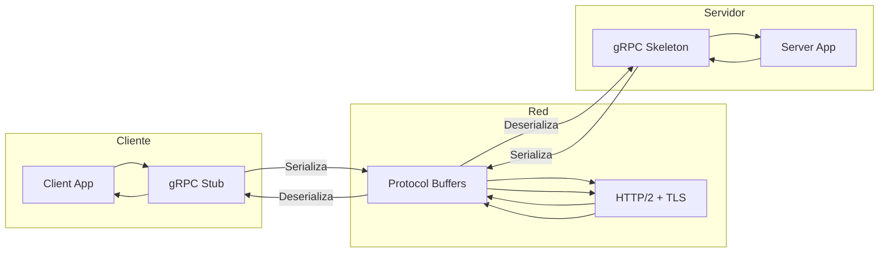

# 📡 Lección 07: gRPC - Comunicación de Alta Performance

> *"gRPC no es solo un protocolo, es una filosofía de comunicación que prioriza eficiencia, tipo-safety y escalabilidad"* - gRPC Team

## 🎯 Objetivos de Aprendizaje

Al finalizar esta lección serás capaz de:

- 🚀 **Dominar** Protocol Buffers para definir servicios
- 📡 **Implementar** servicios gRPC performantes y robustos
- 🔄 **Manejar** streaming patterns (unario, server, client, bidireccional)
- 🛡️ **Configurar** autenticación, autorización y seguridad
- ⚡ **Optimizar** performance con connection pooling y load balancing
- 🔧 **Implementar** interceptors para cross-cutting concerns
- 📊 **Monitorear** y observar servicios gRPC en producción
- 🌐 **Integrar** gRPC en arquitecturas de microservices

---

## 📚 Contenido de la Lección

### 1. 🏗️ Fundamentos de gRPC
- ¿Por qué gRPC vs REST?
- Protocol Buffers (protobuf)
- Arquitectura y conceptos core
- Tipos de servicios y métodos

### 2. 📝 Protocol Buffers Mastery
- Syntax y best practices
- Tipos de datos avanzados
- Versionado y evolución
- Code generation

### 3. 🔧 Implementación de Servicios
- Servidor gRPC robusto
- Cliente gRPC eficiente
- Error handling patterns
- Context propagation

### 4. 🌊 Streaming Patterns
- Unary RPC
- Server streaming
- Client streaming
- Bidirectional streaming

### 5. 🛡️ Seguridad y Autenticación
- TLS/SSL configuration
- Authentication patterns
- Authorization mechanisms
- Security best practices

### 6. ⚡ Optimización de Performance
- Connection pooling
- Load balancing
- Compression strategies
- Health checking

### 7. 🔍 Observabilidad y Monitoring
- Interceptors
- Metrics collection
- Distributed tracing
- Logging strategies

---

## 🏗️ 1. Fundamentos de gRPC

### ¿Qué es gRPC?

**gRPC** (gRPC Remote Procedure Calls) es un framework RPC moderno, open source y de alta performance que puede ejecutarse en cualquier ambiente.



### gRPC vs REST/JSON

| Aspecto             | gRPC                       | REST/JSON               |
| ------------------- | -------------------------- | ----------------------- |
| **Protocol**        | HTTP/2                     | HTTP/1.1                |
| **Data Format**     | Protocol Buffers (binario) | JSON (texto)            |
| **Performance**     | ~7x más rápido             | Baseline                |
| **Type Safety**     | Compiletime                | Runtime                 |
| **Streaming**       | Nativo                     | Limited (SSE/WebSocket) |
| **Browser Support** | Limitado (gRPC-Web)        | Universal               |
| **Learning Curve**  | Steeper                    | Gentler                 |

### Core Concepts

#### 1. 📋 Service Definition
```protobuf
syntax = "proto3";

package ecommerce;
option go_package = "github.com/example/ecommerce/proto";

// Service definition
service UserService {
  // Unary RPC
  rpc GetUser(GetUserRequest) returns (GetUserResponse);
  
  // Server streaming RPC
  rpc ListUsers(ListUsersRequest) returns (stream User);
  
  // Client streaming RPC
  rpc CreateUsers(stream CreateUserRequest) returns (CreateUsersResponse);
  
  // Bidirectional streaming RPC
  rpc ChatWithUsers(stream ChatMessage) returns (stream ChatMessage);
}
```

#### 2. 📦 Message Types
```protobuf
message User {
  string id = 1;
  string email = 2;
  string name = 3;
  UserProfile profile = 4;
  repeated string roles = 5;
  google.protobuf.Timestamp created_at = 6;
  google.protobuf.Timestamp updated_at = 7;
}

message UserProfile {
  string bio = 1;
  string avatar_url = 2;
  Address address = 3;
  map<string, string> metadata = 4;
}

message Address {
  string street = 1;
  string city = 2;
  string state = 3;
  string country = 4;
  string postal_code = 5;
}
```

---

## 📝 2. Protocol Buffers Mastery

### Syntax Fundamentals

#### Field Types and Numbers
```protobuf
syntax = "proto3";

message Example {
  // Scalar types
  string name = 1;
  int32 age = 2;
  bool active = 3;
  double salary = 4;
  bytes data = 5;
  
  // Enums
  Status status = 6;
  
  // Repeated fields (arrays)
  repeated string tags = 7;
  
  // Maps
  map<string, int32> scores = 8;
  
  // Nested messages
  Address address = 9;
  
  // Oneof (union types)
  oneof contact {
    string email = 10;
    string phone = 11;
  }
  
  // Optional fields (proto3.15+)
  optional string middle_name = 12;
}

enum Status {
  STATUS_UNSPECIFIED = 0;
  STATUS_ACTIVE = 1;
  STATUS_INACTIVE = 2;
  STATUS_SUSPENDED = 3;
}
```

#### Advanced Patterns

```protobuf
// Well-known types
import "google/protobuf/timestamp.proto";
import "google/protobuf/duration.proto";
import "google/protobuf/empty.proto";
import "google/protobuf/wrappers.proto";

message AdvancedUser {
  string id = 1;
  
  // Timestamps
  google.protobuf.Timestamp created_at = 2;
  google.protobuf.Timestamp updated_at = 3;
  
  // Duration
  google.protobuf.Duration session_timeout = 4;
  
  // Nullable primitives
  google.protobuf.StringValue middle_name = 5;
  google.protobuf.Int32Value age = 6;
  
  // Any type for flexibility
  google.protobuf.Any metadata = 7;
}

// Service with advanced patterns
service AdvancedUserService {
  // Health check
  rpc Health(google.protobuf.Empty) returns (HealthResponse);
  
  // Batch operations
  rpc BatchGetUsers(BatchGetUsersRequest) returns (BatchGetUsersResponse);
  
  // Streaming with pagination
  rpc StreamUsers(StreamUsersRequest) returns (stream User);
}

message BatchGetUsersRequest {
  repeated string user_ids = 1;
  UserFieldMask field_mask = 2;
}

message UserFieldMask {
  bool include_profile = 1;
  bool include_roles = 2;
  bool include_metadata = 3;
}
```

### Schema Evolution and Versioning

```protobuf
// Version 1
message UserV1 {
  string id = 1;
  string email = 2;
  string name = 3;
}

// Version 2 - Adding fields (backwards compatible)
message UserV2 {
  string id = 1;
  string email = 2;
  string name = 3;
  string bio = 4;        // New field - safe to add
  repeated string tags = 5; // New field - safe to add
}

// Version 3 - Evolution patterns
message UserV3 {
  string id = 1;
  string email = 2;
  string name = 3;
  string bio = 4;
  repeated string tags = 5;
  
  // Deprecated field - mark but don't remove
  string old_field = 6 [deprecated = true];
  
  // Reserved fields - prevent reuse
  reserved 7, 8;
  reserved "temp_field", "another_temp";
  
  // New enum field
  UserType type = 9;
}

enum UserType {
  USER_TYPE_UNSPECIFIED = 0;
  USER_TYPE_REGULAR = 1;
  USER_TYPE_PREMIUM = 2;
  USER_TYPE_ADMIN = 3;
}
```

---

## 🔧 3. Implementación de Servicios

### Servidor gRPC Robusto

```go
package main

import (
    "context"
    "fmt"
    "log"
    "net"
    "time"
    
    "google.golang.org/grpc"
    "google.golang.org/grpc/codes"
    "google.golang.org/grpc/status"
    "google.golang.org/grpc/reflection"
    
    pb "github.com/example/ecommerce/proto"
)

// UserServer implements the UserService
type UserServer struct {
    pb.UnimplementedUserServiceServer
    users map[string]*pb.User
}

func NewUserServer() *UserServer {
    return &UserServer{
        users: make(map[string]*pb.User),
    }
}

// Unary RPC implementation
func (s *UserServer) GetUser(ctx context.Context, req *pb.GetUserRequest) (*pb.GetUserResponse, error) {
    // Input validation
    if req.UserId == "" {
        return nil, status.Errorf(codes.InvalidArgument, "user_id is required")
    }
    
    // Business logic
    user, exists := s.users[req.UserId]
    if !exists {
        return nil, status.Errorf(codes.NotFound, "user not found: %s", req.UserId)
    }
    
    // Apply field mask if provided
    if req.FieldMask != nil {
        user = s.applyFieldMask(user, req.FieldMask)
    }
    
    return &pb.GetUserResponse{
        User: user,
    }, nil
}

func (s *UserServer) CreateUser(ctx context.Context, req *pb.CreateUserRequest) (*pb.CreateUserResponse, error) {
    // Validation
    if err := s.validateUser(req.User); err != nil {
        return nil, status.Errorf(codes.InvalidArgument, "validation failed: %v", err)
    }
    
    // Check for duplicates
    if _, exists := s.users[req.User.Id]; exists {
        return nil, status.Errorf(codes.AlreadyExists, "user already exists: %s", req.User.Id)
    }
    
    // Add timestamps
    now := timestamppb.Now()
    req.User.CreatedAt = now
    req.User.UpdatedAt = now
    
    // Store user
    s.users[req.User.Id] = req.User
    
    return &pb.CreateUserResponse{
        User: req.User,
    }, nil
}

func (s *UserServer) UpdateUser(ctx context.Context, req *pb.UpdateUserRequest) (*pb.UpdateUserResponse, error) {
    // Check if user exists
    existingUser, exists := s.users[req.User.Id]
    if !exists {
        return nil, status.Errorf(codes.NotFound, "user not found: %s", req.User.Id)
    }
    
    // Apply update mask
    updatedUser := s.applyUpdateMask(existingUser, req.User, req.UpdateMask)
    updatedUser.UpdatedAt = timestamppb.Now()
    
    // Store updated user
    s.users[req.User.Id] = updatedUser
    
    return &pb.UpdateUserResponse{
        User: updatedUser,
    }, nil
}

func (s *UserServer) DeleteUser(ctx context.Context, req *pb.DeleteUserRequest) (*pb.DeleteUserResponse, error) {
    if _, exists := s.users[req.UserId]; !exists {
        return nil, status.Errorf(codes.NotFound, "user not found: %s", req.UserId)
    }
    
    delete(s.users, req.UserId)
    
    return &pb.DeleteUserResponse{
        Success: true,
    }, nil
}

// Validation helper
func (s *UserServer) validateUser(user *pb.User) error {
    if user.Id == "" {
        return fmt.Errorf("id is required")
    }
    if user.Email == "" {
        return fmt.Errorf("email is required")
    }
    if user.Name == "" {
        return fmt.Errorf("name is required")
    }
    return nil
}

// Field mask helper
func (s *UserServer) applyFieldMask(user *pb.User, mask *pb.UserFieldMask) *pb.User {
    result := &pb.User{
        Id:    user.Id,
        Email: user.Email,
        Name:  user.Name,
    }
    
    if mask.IncludeProfile && user.Profile != nil {
        result.Profile = user.Profile
    }
    
    if mask.IncludeRoles {
        result.Roles = user.Roles
    }
    
    if mask.IncludeMetadata {
        result.CreatedAt = user.CreatedAt
        result.UpdatedAt = user.UpdatedAt
    }
    
    return result
}

// Server setup with configuration
func setupServer() *grpc.Server {
    // Server options
    opts := []grpc.ServerOption{
        grpc.MaxRecvMsgSize(4 * 1024 * 1024), // 4MB
        grpc.MaxSendMsgSize(4 * 1024 * 1024), // 4MB
        grpc.ConnectionTimeout(30 * time.Second),
        grpc.KeepaliveParams(keepalive.ServerParameters{
            MaxConnectionIdle:     15 * time.Second,
            MaxConnectionAge:      30 * time.Second,
            MaxConnectionAgeGrace: 5 * time.Second,
            Time:                  5 * time.Second,
            Timeout:               1 * time.Second,
        }),
        grpc.KeepaliveEnforcementPolicy(keepalive.EnforcementPolicy{
            MinTime:             5 * time.Second,
            PermitWithoutStream: true,
        }),
    }
    
    server := grpc.NewServer(opts...)
    
    // Register services
    userServer := NewUserServer()
    pb.RegisterUserServiceServer(server, userServer)
    
    // Enable reflection for development
    reflection.Register(server)
    
    return server
}

func main() {
    listener, err := net.Listen("tcp", ":50051")
    if err != nil {
        log.Fatalf("Failed to listen: %v", err)
    }
    
    server := setupServer()
    
    log.Println("gRPC server starting on :50051")
    if err := server.Serve(listener); err != nil {
        log.Fatalf("Failed to serve: %v", err)
    }
}
```

### Cliente gRPC Eficiente

```go
package main

import (
    "context"
    "log"
    "time"
    
    "google.golang.org/grpc"
    "google.golang.org/grpc/keepalive"
    "google.golang.org/grpc/credentials/insecure"
    
    pb "github.com/example/ecommerce/proto"
)

type UserClient struct {
    conn   *grpc.ClientConn
    client pb.UserServiceClient
}

func NewUserClient(address string) (*UserClient, error) {
    // Client options for production
    opts := []grpc.DialOption{
        grpc.WithTransportCredentials(insecure.NewCredentials()), // Use TLS in production
        grpc.WithKeepaliveParams(keepalive.ClientParameters{
            Time:                10 * time.Second,
            Timeout:             time.Second,
            PermitWithoutStream: true,
        }),
        grpc.WithDefaultServiceConfig(`{
            "methodConfig": [{
                "name": [{"service": "ecommerce.UserService"}],
                "waitForReady": true,
                "retryPolicy": {
                    "MaxAttempts": 4,
                    "InitialBackoff": ".01s",
                    "MaxBackoff": ".01s",
                    "BackoffMultiplier": 1.0,
                    "RetryableStatusCodes": ["UNAVAILABLE"]
                }
            }]
        }`),
    }
    
    conn, err := grpc.Dial(address, opts...)
    if err != nil {
        return nil, err
    }
    
    return &UserClient{
        conn:   conn,
        client: pb.NewUserServiceClient(conn),
    }, nil
}

func (c *UserClient) Close() error {
    return c.conn.Close()
}

// Unary call with context and timeout
func (c *UserClient) GetUser(ctx context.Context, userID string) (*pb.User, error) {
    ctx, cancel := context.WithTimeout(ctx, 5*time.Second)
    defer cancel()
    
    resp, err := c.client.GetUser(ctx, &pb.GetUserRequest{
        UserId: userID,
        FieldMask: &pb.UserFieldMask{
            IncludeProfile:  true,
            IncludeRoles:    true,
            IncludeMetadata: true,
        },
    })
    if err != nil {
        return nil, err
    }
    
    return resp.User, nil
}

func (c *UserClient) CreateUser(ctx context.Context, user *pb.User) (*pb.User, error) {
    ctx, cancel := context.WithTimeout(ctx, 10*time.Second)
    defer cancel()
    
    resp, err := c.client.CreateUser(ctx, &pb.CreateUserRequest{
        User: user,
    })
    if err != nil {
        return nil, err
    }
    
    return resp.User, nil
}

// Batch operations
func (c *UserClient) BatchGetUsers(ctx context.Context, userIDs []string) ([]*pb.User, error) {
    ctx, cancel := context.WithTimeout(ctx, 15*time.Second)
    defer cancel()
    
    resp, err := c.client.BatchGetUsers(ctx, &pb.BatchGetUsersRequest{
        UserIds: userIDs,
        FieldMask: &pb.UserFieldMask{
            IncludeProfile: true,
        },
    })
    if err != nil {
        return nil, err
    }
    
    return resp.Users, nil
}

// Example usage
func main() {
    client, err := NewUserClient("localhost:50051")
    if err != nil {
        log.Fatalf("Failed to create client: %v", err)
    }
    defer client.Close()
    
    ctx := context.Background()
    
    // Create user
    user := &pb.User{
        Id:    "user123",
        Email: "john@example.com",
        Name:  "John Doe",
        Profile: &pb.UserProfile{
            Bio:       "Software Developer",
            AvatarUrl: "https://example.com/avatar.jpg",
        },
        Roles: []string{"user", "developer"},
    }
    
    createdUser, err := client.CreateUser(ctx, user)
    if err != nil {
        log.Fatalf("Failed to create user: %v", err)
    }
    
    log.Printf("Created user: %v", createdUser)
    
    // Get user
    retrievedUser, err := client.GetUser(ctx, "user123")
    if err != nil {
        log.Fatalf("Failed to get user: %v", err)
    }
    
    log.Printf("Retrieved user: %v", retrievedUser)
}
```

---

## 🌊 4. Streaming Patterns

### Server Streaming

```go
// Server streaming - sending multiple responses for one request
func (s *UserServer) ListUsers(req *pb.ListUsersRequest, stream pb.UserService_ListUsersServer) error {
    // Apply filters and pagination
    pageSize := req.PageSize
    if pageSize <= 0 || pageSize > 100 {
        pageSize = 10 // Default page size
    }
    
    var filteredUsers []*pb.User
    for _, user := range s.users {
        if s.matchesFilter(user, req.Filter) {
            filteredUsers = append(filteredUsers, user)
        }
    }
    
    // Stream users with pagination
    for i := 0; i < len(filteredUsers); i += int(pageSize) {
        end := i + int(pageSize)
        if end > len(filteredUsers) {
            end = len(filteredUsers)
        }
        
        // Send batch of users
        for j := i; j < end; j++ {
            if err := stream.Send(filteredUsers[j]); err != nil {
                return err
            }
        }
        
        // Check context cancellation
        if err := stream.Context().Err(); err != nil {
            return err
        }
        
        // Simulate processing time
        time.Sleep(100 * time.Millisecond)
    }
    
    return nil
}

// Client side - receiving stream
func (c *UserClient) ListUsersStream(ctx context.Context, filter *pb.UserFilter) ([]*pb.User, error) {
    stream, err := c.client.ListUsers(ctx, &pb.ListUsersRequest{
        Filter:   filter,
        PageSize: 20,
    })
    if err != nil {
        return nil, err
    }
    
    var users []*pb.User
    for {
        user, err := stream.Recv()
        if err == io.EOF {
            break // End of stream
        }
        if err != nil {
            return nil, err
        }
        
        users = append(users, user)
    }
    
    return users, nil
}
```

### Client Streaming

```go
// Client streaming - sending multiple requests, one response
func (s *UserServer) CreateUsers(stream pb.UserService_CreateUsersServer) error {
    var createdUsers []*pb.User
    var errors []string
    
    for {
        req, err := stream.Recv()
        if err == io.EOF {
            // End of client stream, send response
            return stream.SendAndClose(&pb.CreateUsersResponse{
                Users:  createdUsers,
                Errors: errors,
            })
        }
        if err != nil {
            return err
        }
        
        // Validate and create user
        if err := s.validateUser(req.User); err != nil {
            errors = append(errors, fmt.Sprintf("User %s: %v", req.User.Id, err))
            continue
        }
        
        // Check for duplicates
        if _, exists := s.users[req.User.Id]; exists {
            errors = append(errors, fmt.Sprintf("User %s already exists", req.User.Id))
            continue
        }
        
        // Add timestamps
        now := timestamppb.Now()
        req.User.CreatedAt = now
        req.User.UpdatedAt = now
        
        // Store user
        s.users[req.User.Id] = req.User
        createdUsers = append(createdUsers, req.User)
    }
}

// Client side - sending stream
func (c *UserClient) CreateUsersStream(ctx context.Context, users []*pb.User) (*pb.CreateUsersResponse, error) {
    stream, err := c.client.CreateUsers(ctx)
    if err != nil {
        return nil, err
    }
    
    // Send users
    for _, user := range users {
        if err := stream.Send(&pb.CreateUserRequest{User: user}); err != nil {
            return nil, err
        }
    }
    
    // Close stream and get response
    return stream.CloseAndRecv()
}
```

### Bidirectional Streaming

```go
// Bidirectional streaming - chat-like functionality
func (s *UserServer) ChatWithUsers(stream pb.UserService_ChatWithUsersServer) error {
    ctx := stream.Context()
    
    // Channel for handling incoming messages
    msgChan := make(chan *pb.ChatMessage, 100)
    errChan := make(chan error, 1)
    
    // Goroutine to receive messages
    go func() {
        defer close(msgChan)
        for {
            msg, err := stream.Recv()
            if err == io.EOF {
                return
            }
            if err != nil {
                errChan <- err
                return
            }
            
            select {
            case msgChan <- msg:
            case <-ctx.Done():
                return
            }
        }
    }()
    
    // Process messages and send responses
    for {
        select {
        case msg := <-msgChan:
            if msg == nil {
                return nil // Stream closed
            }
            
            // Process message and create response
            response := &pb.ChatMessage{
                UserId:    "system",
                Message:   fmt.Sprintf("Echo: %s", msg.Message),
                Timestamp: timestamppb.Now(),
            }
            
            if err := stream.Send(response); err != nil {
                return err
            }
            
        case err := <-errChan:
            return err
            
        case <-ctx.Done():
            return ctx.Err()
        }
    }
}

// Client side - bidirectional streaming
func (c *UserClient) Chat(ctx context.Context) error {
    stream, err := c.client.ChatWithUsers(ctx)
    if err != nil {
        return err
    }
    
    // Channel for user input
    inputChan := make(chan string, 10)
    
    // Goroutine to handle sending messages
    go func() {
        defer stream.CloseSend()
        
        for input := range inputChan {
            msg := &pb.ChatMessage{
                UserId:    "user123",
                Message:   input,
                Timestamp: timestamppb.Now(),
            }
            
            if err := stream.Send(msg); err != nil {
                log.Printf("Failed to send message: %v", err)
                return
            }
        }
    }()
    
    // Goroutine to handle receiving messages
    go func() {
        for {
            msg, err := stream.Recv()
            if err == io.EOF {
                return
            }
            if err != nil {
                log.Printf("Failed to receive message: %v", err)
                return
            }
            
            log.Printf("Received: %s - %s", msg.UserId, msg.Message)
        }
    }()
    
    // Simulate sending messages
    inputChan <- "Hello, server!"
    inputChan <- "How are you?"
    time.Sleep(2 * time.Second)
    close(inputChan)
    
    return nil
}
```

---

## 🛡️ 5. Seguridad y Autenticación

### TLS Configuration

```go
import (
    "crypto/tls"
    "google.golang.org/grpc/credentials"
)

// Server with TLS
func setupSecureServer() *grpc.Server {
    // Load TLS certificates
    cert, err := tls.LoadX509KeyPair("server-cert.pem", "server-key.pem")
    if err != nil {
        log.Fatalf("Failed to load TLS keys: %v", err)
    }
    
    // TLS credentials
    creds := credentials.NewTLS(&tls.Config{
        Certificates: []tls.Certificate{cert},
        ClientAuth:   tls.RequireAndVerifyClientCert,
    })
    
    opts := []grpc.ServerOption{
        grpc.Creds(creds),
    }
    
    return grpc.NewServer(opts...)
}

// Client with TLS
func NewSecureUserClient(address string) (*UserClient, error) {
    // Load client certificates
    cert, err := tls.LoadX509KeyPair("client-cert.pem", "client-key.pem")
    if err != nil {
        return nil, err
    }
    
    creds := credentials.NewTLS(&tls.Config{
        Certificates: []tls.Certificate{cert},
        ServerName:   "your-server.com",
    })
    
    conn, err := grpc.Dial(address, grpc.WithTransportCredentials(creds))
    if err != nil {
        return nil, err
    }
    
    return &UserClient{
        conn:   conn,
        client: pb.NewUserServiceClient(conn),
    }, nil
}
```

### JWT Authentication

```go
import (
    "github.com/golang-jwt/jwt/v4"
    "google.golang.org/grpc/metadata"
)

// JWT Claims
type Claims struct {
    UserID string   `json:"user_id"`
    Roles  []string `json:"roles"`
    jwt.RegisteredClaims
}

// Authentication interceptor
func authInterceptor(jwtSecret []byte) grpc.UnaryServerInterceptor {
    return func(ctx context.Context, req interface{}, info *grpc.UnaryServerInfo, handler grpc.UnaryHandler) (interface{}, error) {
        // Skip auth for certain methods
        if info.FullMethod == "/ecommerce.UserService/Health" {
            return handler(ctx, req)
        }
        
        // Extract token from metadata
        md, ok := metadata.FromIncomingContext(ctx)
        if !ok {
            return nil, status.Errorf(codes.Unauthenticated, "missing metadata")
        }
        
        tokens := md.Get("authorization")
        if len(tokens) == 0 {
            return nil, status.Errorf(codes.Unauthenticated, "missing authorization token")
        }
        
        tokenString := strings.TrimPrefix(tokens[0], "Bearer ")
        
        // Parse and validate JWT
        token, err := jwt.ParseWithClaims(tokenString, &Claims{}, func(token *jwt.Token) (interface{}, error) {
            return jwtSecret, nil
        })
        if err != nil {
            return nil, status.Errorf(codes.Unauthenticated, "invalid token: %v", err)
        }
        
        claims, ok := token.Claims.(*Claims)
        if !ok || !token.Valid {
            return nil, status.Errorf(codes.Unauthenticated, "invalid token claims")
        }
        
        // Add claims to context
        ctx = context.WithValue(ctx, "user_id", claims.UserID)
        ctx = context.WithValue(ctx, "roles", claims.Roles)
        
        return handler(ctx, req)
    }
}

// Client with JWT
func (c *UserClient) GetUserWithAuth(ctx context.Context, userID, token string) (*pb.User, error) {
    // Add authorization header
    md := metadata.Pairs("authorization", "Bearer "+token)
    ctx = metadata.NewOutgoingContext(ctx, md)
    
    return c.GetUser(ctx, userID)
}

// Server with authorization
func (s *UserServer) GetUser(ctx context.Context, req *pb.GetUserRequest) (*pb.GetUserResponse, error) {
    // Extract user info from context
    currentUserID, _ := ctx.Value("user_id").(string)
    userRoles, _ := ctx.Value("roles").([]string)
    
    // Authorization logic
    if req.UserId != currentUserID && !hasRole(userRoles, "admin") {
        return nil, status.Errorf(codes.PermissionDenied, "insufficient permissions")
    }
    
    // ... rest of the implementation
}

func hasRole(roles []string, role string) bool {
    for _, r := range roles {
        if r == role {
            return true
        }
    }
    return false
}
```

---

## ⚡ 6. Optimización de Performance

### Connection Pooling

```go
import (
    "sync"
    "google.golang.org/grpc/balancer/roundrobin"
)

// Connection pool manager
type ConnectionPool struct {
    mu     sync.RWMutex
    pools  map[string]*grpc.ClientConn
    opts   []grpc.DialOption
}

func NewConnectionPool() *ConnectionPool {
    opts := []grpc.DialOption{
        grpc.WithTransportCredentials(insecure.NewCredentials()),
        grpc.WithDefaultServiceConfig(`{
            "loadBalancingConfig": [{"round_robin":{}}],
            "methodConfig": [{
                "name": [{"service": ""}],
                "retryPolicy": {
                    "maxAttempts": 3,
                    "initialBackoff": "0.1s",
                    "maxBackoff": "1s",
                    "backoffMultiplier": 2,
                    "retryableStatusCodes": ["UNAVAILABLE", "DEADLINE_EXCEEDED"]
                }
            }]
        }`),
        grpc.WithKeepaliveParams(keepalive.ClientParameters{
            Time:                30 * time.Second,
            Timeout:             5 * time.Second,
            PermitWithoutStream: true,
        }),
    }
    
    return &ConnectionPool{
        pools: make(map[string]*grpc.ClientConn),
        opts:  opts,
    }
}

func (p *ConnectionPool) GetConnection(address string) (*grpc.ClientConn, error) {
    p.mu.RLock()
    if conn, exists := p.pools[address]; exists {
        p.mu.RUnlock()
        return conn, nil
    }
    p.mu.RUnlock()
    
    p.mu.Lock()
    defer p.mu.Unlock()
    
    // Double check
    if conn, exists := p.pools[address]; exists {
        return conn, nil
    }
    
    // Create new connection
    conn, err := grpc.Dial(address, p.opts...)
    if err != nil {
        return nil, err
    }
    
    p.pools[address] = conn
    return conn, nil
}

func (p *ConnectionPool) Close() {
    p.mu.Lock()
    defer p.mu.Unlock()
    
    for _, conn := range p.pools {
        conn.Close()
    }
}
```

### Load Balancing

```go
// Multiple server addresses for load balancing
func NewLoadBalancedUserClient(addresses []string) (*UserClient, error) {
    // Create service config with load balancing
    serviceConfig := `{
        "loadBalancingConfig": [{"round_robin":{}}],
        "healthCheckConfig": {
            "serviceName": "ecommerce.UserService"
        }
    }`
    
    // Join addresses for gRPC resolver
    target := fmt.Sprintf("dns:///%s", strings.Join(addresses, ","))
    
    opts := []grpc.DialOption{
        grpc.WithTransportCredentials(insecure.NewCredentials()),
        grpc.WithDefaultServiceConfig(serviceConfig),
        grpc.WithResolvers(&dnsResolverBuilder{}),
    }
    
    conn, err := grpc.Dial(target, opts...)
    if err != nil {
        return nil, err
    }
    
    return &UserClient{
        conn:   conn,
        client: pb.NewUserServiceClient(conn),
    }, nil
}

// Health checking
func (s *UserServer) Health(ctx context.Context, req *pb.HealthRequest) (*pb.HealthResponse, error) {
    // Check dependencies (database, cache, etc.)
    if err := s.checkDependencies(ctx); err != nil {
        return &pb.HealthResponse{
            Status: pb.HealthResponse_NOT_SERVING,
            Message: err.Error(),
        }, nil
    }
    
    return &pb.HealthResponse{
        Status: pb.HealthResponse_SERVING,
        Message: "Service is healthy",
    }, nil
}
```

### Compression and Optimization

```go
import (
    "google.golang.org/grpc/encoding/gzip"
)

// Server with compression
func setupOptimizedServer() *grpc.Server {
    opts := []grpc.ServerOption{
        // Enable compression
        grpc.RPCCompressor(gzip.NewCompressor()),
        grpc.RPCDecompressor(gzip.NewDecompressor()),
        
        // Optimize buffer sizes
        grpc.ReadBufferSize(64 * 1024),
        grpc.WriteBufferSize(64 * 1024),
        
        // Message size limits
        grpc.MaxRecvMsgSize(16 * 1024 * 1024), // 16MB
        grpc.MaxSendMsgSize(16 * 1024 * 1024), // 16MB
        
        // Concurrent streams
        grpc.MaxConcurrentStreams(1000),
    }
    
    return grpc.NewServer(opts...)
}

// Client with compression
func (c *UserClient) GetUserCompressed(ctx context.Context, userID string) (*pb.User, error) {
    ctx, cancel := context.WithTimeout(ctx, 5*time.Second)
    defer cancel()
    
    // Use compression for this call
    ctx = grpc.NewContextWithCallOption(ctx, grpc.UseCompressor(gzip.Name))
    
    return c.GetUser(ctx, userID)
}
```

---

## 🔍 7. Observabilidad y Monitoring

### Interceptors

```go
import (
    "github.com/prometheus/client_golang/prometheus"
    "go.opentelemetry.io/otel/trace"
)

// Metrics
var (
    grpcRequestsTotal = prometheus.NewCounterVec(
        prometheus.CounterOpts{
            Name: "grpc_requests_total",
            Help: "Total number of gRPC requests",
        },
        []string{"service", "method", "status"},
    )
    
    grpcRequestDuration = prometheus.NewHistogramVec(
        prometheus.HistogramOpts{
            Name:    "grpc_request_duration_seconds",
            Help:    "gRPC request duration in seconds",
            Buckets: prometheus.DefBuckets,
        },
        []string{"service", "method"},
    )
)

// Metrics interceptor
func metricsInterceptor() grpc.UnaryServerInterceptor {
    return func(ctx context.Context, req interface{}, info *grpc.UnaryServerInfo, handler grpc.UnaryHandler) (interface{}, error) {
        start := time.Now()
        
        service, method := splitFullMethodName(info.FullMethod)
        
        resp, err := handler(ctx, req)
        
        duration := time.Since(start).Seconds()
        status := "success"
        if err != nil {
            status = "error"
        }
        
        grpcRequestsTotal.WithLabelValues(service, method, status).Inc()
        grpcRequestDuration.WithLabelValues(service, method).Observe(duration)
        
        return resp, err
    }
}

// Logging interceptor
func loggingInterceptor(logger *logrus.Logger) grpc.UnaryServerInterceptor {
    return func(ctx context.Context, req interface{}, info *grpc.UnaryServerInfo, handler grpc.UnaryHandler) (interface{}, error) {
        start := time.Now()
        
        // Extract trace info
        span := trace.SpanFromContext(ctx)
        traceID := span.SpanContext().TraceID().String()
        
        logger.WithFields(logrus.Fields{
            "method":   info.FullMethod,
            "trace_id": traceID,
        }).Info("gRPC request started")
        
        resp, err := handler(ctx, req)
        
        duration := time.Since(start)
        
        entry := logger.WithFields(logrus.Fields{
            "method":      info.FullMethod,
            "duration_ms": duration.Milliseconds(),
            "trace_id":    traceID,
        })
        
        if err != nil {
            entry.WithError(err).Error("gRPC request failed")
        } else {
            entry.Info("gRPC request completed")
        }
        
        return resp, err
    }
}

// Tracing interceptor
func tracingInterceptor(tracer trace.Tracer) grpc.UnaryServerInterceptor {
    return func(ctx context.Context, req interface{}, info *grpc.UnaryServerInfo, handler grpc.UnaryHandler) (interface{}, error) {
        ctx, span := tracer.Start(ctx, info.FullMethod)
        defer span.End()
        
        // Add attributes
        span.SetAttributes(
            attribute.String("rpc.system", "grpc"),
            attribute.String("rpc.service", extractServiceName(info.FullMethod)),
            attribute.String("rpc.method", extractMethodName(info.FullMethod)),
        )
        
        resp, err := handler(ctx, req)
        
        if err != nil {
            span.RecordError(err)
            span.SetStatus(codes.Error, err.Error())
        } else {
            span.SetStatus(codes.Ok, "success")
        }
        
        return resp, err
    }
}

// Chain interceptors
func setupServerWithInterceptors(logger *logrus.Logger, tracer trace.Tracer) *grpc.Server {
    opts := []grpc.ServerOption{
        grpc.ChainUnaryInterceptor(
            loggingInterceptor(logger),
            metricsInterceptor(),
            tracingInterceptor(tracer),
            authInterceptor(jwtSecret),
        ),
    }
    
    return grpc.NewServer(opts...)
}
```

### Client-side Observability

```go
// Client interceptor for tracing
func clientTracingInterceptor(tracer trace.Tracer) grpc.UnaryClientInterceptor {
    return func(ctx context.Context, method string, req, reply interface{}, cc *grpc.ClientConn, invoker grpc.UnaryInvoker, opts ...grpc.CallOption) error {
        ctx, span := tracer.Start(ctx, method)
        defer span.End()
        
        err := invoker(ctx, method, req, reply, cc, opts...)
        
        if err != nil {
            span.RecordError(err)
            span.SetStatus(codes.Error, err.Error())
        } else {
            span.SetStatus(codes.Ok, "success")
        }
        
        return err
    }
}

// Client with observability
func NewObservableUserClient(address string, tracer trace.Tracer) (*UserClient, error) {
    opts := []grpc.DialOption{
        grpc.WithTransportCredentials(insecure.NewCredentials()),
        grpc.WithChainUnaryInterceptor(
            clientTracingInterceptor(tracer),
            clientMetricsInterceptor(),
        ),
    }
    
    conn, err := grpc.Dial(address, opts...)
    if err != nil {
        return nil, err
    }
    
    return &UserClient{
        conn:   conn,
        client: pb.NewUserServiceClient(conn),
    }, nil
}
```

---

## 🏁 Ejemplo Completo: E-Commerce gRPC Services

### Service Definition

```protobuf
syntax = "proto3";

package ecommerce;
option go_package = "github.com/example/ecommerce/proto";

import "google/protobuf/timestamp.proto";
import "google/protobuf/empty.proto";

// User Service
service UserService {
  rpc GetUser(GetUserRequest) returns (GetUserResponse);
  rpc CreateUser(CreateUserRequest) returns (CreateUserResponse);
  rpc UpdateUser(UpdateUserRequest) returns (UpdateUserResponse);
  rpc DeleteUser(DeleteUserRequest) returns (DeleteUserResponse);
  rpc ListUsers(ListUsersRequest) returns (stream User);
  rpc Health(google.protobuf.Empty) returns (HealthResponse);
}

// Product Service
service ProductService {
  rpc GetProduct(GetProductRequest) returns (GetProductResponse);
  rpc CreateProduct(CreateProductRequest) returns (CreateProductResponse);
  rpc SearchProducts(SearchProductsRequest) returns (SearchProductsResponse);
  rpc StreamProductUpdates(StreamProductUpdatesRequest) returns (stream ProductUpdate);
}

// Order Service
service OrderService {
  rpc CreateOrder(CreateOrderRequest) returns (CreateOrderResponse);
  rpc GetOrder(GetOrderRequest) returns (GetOrderResponse);
  rpc UpdateOrderStatus(UpdateOrderStatusRequest) returns (UpdateOrderStatusResponse);
  rpc StreamOrderUpdates(StreamOrderUpdatesRequest) returns (stream OrderUpdate);
}

// Messages
message User {
  string id = 1;
  string email = 2;
  string name = 3;
  UserProfile profile = 4;
  repeated string roles = 5;
  google.protobuf.Timestamp created_at = 6;
  google.protobuf.Timestamp updated_at = 7;
}

message Product {
  string id = 1;
  string name = 2;
  string description = 3;
  double price = 4;
  string category = 5;
  int32 stock = 6;
  repeated string image_urls = 7;
  map<string, string> attributes = 8;
  google.protobuf.Timestamp created_at = 9;
  google.protobuf.Timestamp updated_at = 10;
}

message Order {
  string id = 1;
  string user_id = 2;
  repeated OrderItem items = 3;
  OrderStatus status = 4;
  double total = 5;
  google.protobuf.Timestamp created_at = 6;
  google.protobuf.Timestamp updated_at = 7;
}

message OrderItem {
  string product_id = 1;
  int32 quantity = 2;
  double price = 3;
}

enum OrderStatus {
  ORDER_STATUS_UNSPECIFIED = 0;
  ORDER_STATUS_PENDING = 1;
  ORDER_STATUS_CONFIRMED = 2;
  ORDER_STATUS_SHIPPED = 3;
  ORDER_STATUS_DELIVERED = 4;
  ORDER_STATUS_CANCELLED = 5;
}
```

### Gateway Service

```go
// API Gateway that aggregates gRPC services
type GatewayServer struct {
    userClient    pb.UserServiceClient
    productClient pb.ProductServiceClient
    orderClient   pb.OrderServiceClient
}

func NewGatewayServer(userConn, productConn, orderConn *grpc.ClientConn) *GatewayServer {
    return &GatewayServer{
        userClient:    pb.NewUserServiceClient(userConn),
        productClient: pb.NewProductServiceClient(productConn),
        orderClient:   pb.NewOrderServiceClient(orderConn),
    }
}

// Aggregate call - get order with user and product details
func (g *GatewayServer) GetOrderDetails(ctx context.Context, orderID string) (*OrderDetails, error) {
    // Get order
    orderResp, err := g.orderClient.GetOrder(ctx, &pb.GetOrderRequest{
        OrderId: orderID,
    })
    if err != nil {
        return nil, err
    }
    
    order := orderResp.Order
    
    // Get user details
    userResp, err := g.userClient.GetUser(ctx, &pb.GetUserRequest{
        UserId: order.UserId,
    })
    if err != nil {
        return nil, err
    }
    
    // Get product details for each item
    var productDetails []*ProductDetails
    for _, item := range order.Items {
        productResp, err := g.productClient.GetProduct(ctx, &pb.GetProductRequest{
            ProductId: item.ProductId,
        })
        if err != nil {
            continue // Skip if product not found
        }
        
        productDetails = append(productDetails, &ProductDetails{
            Product:  productResp.Product,
            Quantity: item.Quantity,
            Price:    item.Price,
        })
    }
    
    return &OrderDetails{
        Order:    order,
        User:     userResp.User,
        Products: productDetails,
    }, nil
}
```

---

## 📝 Resumen

En esta lección has aprendido:

### 🏗️ **gRPC Fundamentals**
- Protocol Buffers como IDL
- Tipos de RPC (unary, streaming)
- Arquitectura y beneficios vs REST

### 📡 **Service Implementation**
- Servidores robustos con validación
- Clientes eficientes con pooling
- Error handling y status codes

### 🌊 **Streaming Patterns**
- Server streaming para bulk data
- Client streaming para uploads
- Bidirectional streaming para real-time

### 🛡️ **Security & Auth**
- TLS configuration
- JWT authentication
- Authorization patterns

### ⚡ **Performance Optimization**
- Connection pooling
- Load balancing
- Compression strategies

### 🔍 **Observability**
- Interceptors para cross-cutting concerns
- Metrics collection
- Distributed tracing

---

## 🏆 Proyecto: High-Performance API Gateway

¡Estás listo para construir un API Gateway gRPC completo! En los ejercicios prácticos implementarás un sistema que demuestre todos estos patrones.

**🎯 Próximo**: [Ejercicios Prácticos](./EJERCICIOS.md)
