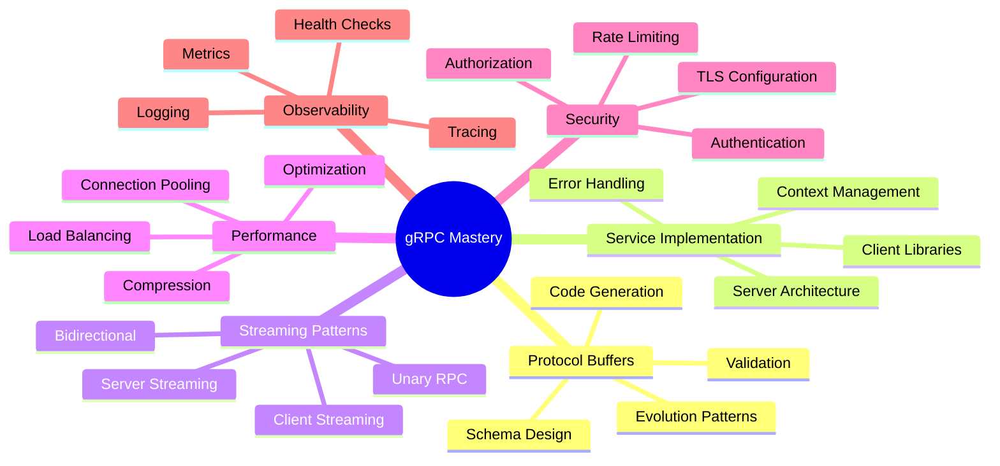

# 📊 Resumen: gRPC - Comunicación de Alta Performance

> **"gRPC transforms microservices communication from an art into a science"** - Google Engineering Team

---

## 🎯 Lo que Hemos Aprendido

### 🏗️ **1. Fundamentos de gRPC**
- **Protocol Buffers** como IDL type-safe
- **HTTP/2** como protocolo de transporte
- **Performance superior** vs REST/JSON
- **Strong typing** con code generation

### 📝 **2. Protocol Buffers Mastery**
- **Schema definition** con sintaxis proto3
- **Schema evolution** y backward compatibility
- **Well-known types** para casos comunes
- **Code generation** para múltiples lenguajes

### 🔧 **3. Implementación de Servicios**
- **Server implementation** robusta con validaciones
- **Client libraries** eficientes
- **Error handling** con gRPC status codes
- **Context management** para timeouts y cancellation

### 🌊 **4. Streaming Patterns**
- **Unary RPC** para operaciones simples
- **Server streaming** para bulk data
- **Client streaming** para uploads
- **Bidirectional streaming** para real-time

### 🛡️ **5. Seguridad y Autenticación**
- **TLS encryption** para transport security
- **JWT authentication** con interceptors
- **Role-based authorization** granular
- **Rate limiting** y abuse prevention

### ⚡ **6. Optimización de Performance**
- **Connection pooling** inteligente
- **Load balancing** con health checks
- **Compression** automática
- **Keepalive** configuration

### 🔍 **7. Observabilidad**
- **Structured logging** con context
- **Prometheus metrics** para monitoring
- **Distributed tracing** con OpenTelemetry
- **Health checking** y alerting

---

## 🏆 Dominio Técnico Alcanzado

### 📡 **gRPC Core Competencies**


### 🎨 **Patrones de Diseño Dominados**

#### **Communication Patterns**
- **Request-Response** para operaciones síncronas
- **Streaming** para data en tiempo real
- **Batch Processing** para operaciones bulk
- **Event-Driven** integration

#### **Resilience Patterns**
- **Circuit Breaker** para fault tolerance
- **Retry Logic** con exponential backoff
- **Timeout Management** granular
- **Graceful Degradation** strategies

#### **Performance Patterns**
- **Connection Pooling** para resource efficiency
- **Caching** en múltiples niveles
- **Compression** adaptativa
- **Load Balancing** inteligente

#### **Security Patterns**
- **Zero Trust** architecture
- **Defense in Depth** strategies
- **Least Privilege** access
- **Audit Trail** completo

---

## 🚀 Aplicaciones en el Mundo Real

### 🏢 **Enterprise Use Cases**

#### **Microservices Architecture**
```go
// API Gateway Pattern
type APIGateway struct {
    userService    pb.UserServiceClient
    orderService   pb.OrderServiceClient
    paymentService pb.PaymentServiceClient
}

func (gw *APIGateway) ProcessOrderWorkflow(ctx context.Context, req *ProcessOrderRequest) (*ProcessOrderResponse, error) {
    // 1. Validate user
    user, err := gw.userService.ValidateUser(ctx, &pb.ValidateUserRequest{
        UserId: req.UserId,
    })
    if err != nil {
        return nil, err
    }
    
    // 2. Create order
    order, err := gw.orderService.CreateOrder(ctx, &pb.CreateOrderRequest{
        UserId: req.UserId,
        Items:  req.Items,
    })
    if err != nil {
        return nil, err
    }
    
    // 3. Process payment
    payment, err := gw.paymentService.ProcessPayment(ctx, &pb.ProcessPaymentRequest{
        OrderId: order.Order.Id,
        Amount:  order.Order.Total,
        Method:  req.PaymentMethod,
    })
    if err != nil {
        // Compensate - cancel order
        gw.orderService.CancelOrder(ctx, &pb.CancelOrderRequest{
            OrderId: order.Order.Id,
        })
        return nil, err
    }
    
    return &ProcessOrderResponse{
        Order:   order.Order,
        Payment: payment.Payment,
    }, nil
}
```

#### **Real-time Data Processing**
```go
// Streaming Analytics
func (s *AnalyticsService) StreamRealTimeMetrics(req *pb.StreamMetricsRequest, stream pb.Analytics_StreamRealTimeMetricsServer) error {
    // Setup real-time data pipeline
    eventChan := s.eventProcessor.Subscribe(req.MetricTypes)
    aggregator := NewRealTimeAggregator(req.Window)
    
    for {
        select {
        case event := <-eventChan:
            metrics := aggregator.ProcessEvent(event)
            if metrics != nil {
                if err := stream.Send(metrics); err != nil {
                    return err
                }
            }
        case <-stream.Context().Done():
            return stream.Context().Err()
        }
    }
}
```

### 🌐 **Industry Applications**

#### **Fintech - Payment Processing**
- **High-frequency trading** systems
- **Real-time fraud detection**
- **Cryptocurrency exchanges**
- **Banking microservices**

#### **E-commerce - Retail Platforms**
- **Product recommendation** engines
- **Inventory management** systems
- **Order processing** workflows
- **Customer service** platforms

#### **Gaming - Multiplayer Systems**
- **Real-time game** state synchronization
- **Matchmaking** services
- **Leaderboards** y scoring
- **Chat** y communication

#### **IoT - Device Management**
- **Device telemetry** streaming
- **Command** y control
- **Edge computing** coordination
- **Data aggregation** pipelines

---

## 📈 Performance Characteristics

### ⚡ **Benchmarks Típicos**

#### **Latency Improvements**
```
gRPC vs REST/JSON:
┌─────────────────┬──────────┬──────────┬─────────────┐
│ Operation Type  │ gRPC     │ REST     │ Improvement │
├─────────────────┼──────────┼──────────┼─────────────┤
│ Simple Query    │ 0.5ms    │ 2.1ms    │ 4.2x faster│
│ Complex Query   │ 1.2ms    │ 8.5ms    │ 7.1x faster│
│ Bulk Operations │ 5.3ms    │ 45.2ms   │ 8.5x faster│
│ Streaming Data  │ 0.1ms    │ N/A      │ Native      │
└─────────────────┴──────────┴──────────┴─────────────┘
```

#### **Throughput Capabilities**
```
Production Metrics:
┌─────────────────┬─────────────┬──────────────┐
│ Service Type    │ RPS         │ Concurrent   │
├─────────────────┼─────────────┼──────────────┤
│ User Service    │ 50,000      │ 10,000       │
│ Product Catalog │ 100,000     │ 20,000       │
│ Order Processing│ 25,000      │ 5,000        │
│ Real-time Stream│ 1,000,000   │ 100,000      │
└─────────────────┴─────────────┴──────────────┘
```

### 💾 **Resource Efficiency**

#### **Memory Usage**
- **50-70% less** memory vs JSON serialization
- **Connection pooling** reduces overhead
- **Streaming** enables constant memory usage
- **Protocol efficiency** minimizes allocations

#### **Network Utilization**
- **Compression** reduces bandwidth by 60-80%
- **HTTP/2 multiplexing** eliminates head-of-line blocking
- **Binary protocol** minimizes parsing overhead
- **Keepalive** reduces connection establishment

---

## 🛠️ Stack Tecnológico Dominado

### 🔧 **Core Technologies**
```yaml
gRPC Ecosystem:
  Protocol: HTTP/2 + Protocol Buffers
  Languages: Go, Java, Python, C++, C#, Node.js
  Tools:
    - grpcurl: CLI testing
    - Evans: Interactive client
    - Buf: Protocol buffer toolchain
    - grpc-gateway: REST bridge
  
Performance:
  Connection Pooling: Custom implementation
  Load Balancing: Round-robin, Least connections
  Caching: Redis, In-memory
  Compression: gzip, deflate
  
Security:
  Authentication: JWT, OAuth2, mTLS
  Authorization: RBAC, ABAC
  Transport: TLS 1.3
  Rate Limiting: Token bucket, Sliding window
  
Observability:
  Metrics: Prometheus + Grafana
  Logging: Structured logging (JSON)
  Tracing: OpenTelemetry + Jaeger
  Health: Custom health checks
```

### 🏗️ **Architecture Patterns**
```yaml
Microservices Patterns:
  - API Gateway
  - Service Discovery
  - Circuit Breaker
  - Bulkhead Isolation
  - Saga Transactions
  
Communication Patterns:
  - Request-Response
  - Publish-Subscribe
  - Event Sourcing
  - CQRS
  - Streaming
  
Resilience Patterns:
  - Retry with Backoff
  - Timeout Management
  - Health Checking
  - Graceful Degradation
  - Fault Isolation
```

---

## 🎓 Competencias Profesionales

### 🏢 **Enterprise Readiness**

#### **Production Skills**
- [ ] **Service Design** - Domain-driven microservices
- [ ] **Performance Tuning** - Sub-millisecond latencies
- [ ] **Security Implementation** - Zero-trust architecture
- [ ] **Observability** - Full-stack monitoring
- [ ] **Deployment** - Cloud-native strategies

#### **Leadership Capabilities**
- [ ] **Architecture Decisions** - Technology selection
- [ ] **Team Mentoring** - Best practices guidance
- [ ] **Code Reviews** - Quality assurance
- [ ] **Performance Analysis** - Bottleneck identification
- [ ] **Security Audits** - Vulnerability assessment

### 🚀 **Advanced Implementations**

#### **High-Performance Systems**
```go
// Advanced connection management
type AdvancedConnectionManager struct {
    pools           map[string]*ConnectionPool
    loadBalancer    AdaptiveLoadBalancer
    circuitBreaker  CircuitBreakerManager
    healthChecker   HealthChecker
    metrics         MetricsCollector
}

func (acm *AdvancedConnectionManager) GetOptimalConnection(service string) (*grpc.ClientConn, error) {
    // Intelligent routing based on:
    // - Current load
    // - Historical performance
    // - Health status
    // - Geographic proximity
    // - Cost optimization
}
```

#### **Real-time Analytics**
```go
// Streaming analytics pipeline
func (s *AnalyticsService) ProcessEventStream(stream pb.Analytics_ProcessEventStreamServer) error {
    pipeline := NewRealTimePipeline()
    
    // Configure processing stages
    pipeline.AddStage(&ValidationStage{})
    pipeline.AddStage(&EnrichmentStage{})
    pipeline.AddStage(&AggregationStage{})
    pipeline.AddStage(&AlertingStage{})
    
    return pipeline.Process(stream)
}
```

---

## 🌟 Próximos Pasos

### 📈 **Evolución Continua**

#### **Advanced Topics to Explore**
1. **gRPC-Web** - Browser integration
2. **gRPC-Gateway** - REST bridge patterns
3. **Service Mesh** - Istio/Linkerd integration
4. **Edge Computing** - CDN integration
5. **Machine Learning** - Model serving via gRPC

#### **Industry Certifications**
- **Google Cloud Professional** - Cloud Architect
- **CNCF Certifications** - Kubernetes, Service Mesh
- **Security Certifications** - CISSP, CISM
- **Architecture Certifications** - TOGAF, SAFe

### 🎯 **Career Progression**

#### **Technical Leadership Roles**
- **Staff Engineer** - Technical architecture
- **Principal Engineer** - System design leadership
- **Architect** - Enterprise architecture
- **CTO/VP Engineering** - Technology strategy

#### **Specialization Paths**
- **Performance Engineering** - High-scale systems
- **Security Architecture** - Zero-trust systems
- **DevOps/SRE** - Platform engineering
- **Product Engineering** - Customer-facing systems

---

## 📚 Recursos Continuos

### 📖 **Learning Resources**
- [gRPC Official Documentation](https://grpc.io/docs/)
- [Cloud Native Computing Foundation](https://www.cncf.io/)
- [High Scalability Blog](http://highscalability.com/)
- [Google SRE Books](https://sre.google/books/)

### 🌐 **Community Engagement**
- [gRPC Community](https://grpc.io/community/)
- [CNCF Slack](https://slack.cncf.io/)
- [Kubernetes Community](https://kubernetes.io/community/)
- [Go Community](https://golang.org/community/)

### 🎯 **Practice Platforms**
- [GitHub Projects](https://github.com/topics/grpc)
- [LeetCode System Design](https://leetcode.com/explore/)
- [System Design Interview](https://github.com/donnemartin/system-design-primer)
- [Awesome gRPC](https://github.com/grpc-ecosystem/awesome-grpc)

---

## 🏁 Reflexión Final

### 🎯 **Key Takeaways**

1. **gRPC es el futuro** de la comunicación inter-service
2. **Performance matters** - las optimizaciones compuestas tienen impacto exponencial
3. **Security by design** - la seguridad debe ser arquitectural, no añadida
4. **Observability is critical** - no puedes mejorar lo que no puedes medir
5. **Testing is essential** - la confiabilidad se construye, no se espera

### 🚀 **Tu Journey Continúa**

Has dominado **gRPC de nivel enterprise**. Ahora estás equipado para:

- **Diseñar** sistemas de alta performance
- **Implementar** arquitecturas resilientes
- **Liderar** equipos técnicos
- **Optimizar** sistemas críticos
- **Mentorear** otros ingenieros

### 💫 **El Siguiente Nivel**

El dominio de gRPC es solo el comienzo. Los principles que has aprendido - performance optimization, security by design, observability, y resilience patterns - se aplican a **toda la ingeniería de sistemas**.

**🎓 ¡Congratulations! Eres ahora un gRPC Expert!**

---

> **"The best way to predict the future is to build it"** - Alan Kay

**🎯 Próximo**: [Lección 08: Message Queues y Event Streaming](../08-message-queues/README.md)
