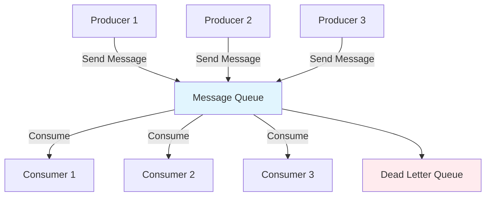

# 📮 Lección 08: Message Queues y Event Streaming

> "Los sistemas distribuidos son como una orquesta: cada instrumento (servicio) debe tocar en armonía, y los message queues son el director que coordina la sinfonía." - Arquitecto de Software Senior

## 🎯 Objetivos de la Lección

Al finalizar esta lección, serás capaz de:

- **🏗️ Arquitectura**: Diseñar sistemas de mensajería escalables y robustos
- **📮 Message Queues**: Implementar patrones pub/sub, work queues y event streaming
- **⚡ Performance**: Optimizar throughput y latencia en sistemas de alta carga
- **🔄 Reliability**: Garantizar entrega de mensajes y manejo de fallos
- **🛠️ Integración**: Conectar con RabbitMQ, Kafka, Redis y NATS
- **📊 Monitoring**: Observabilidad completa de sistemas de mensajería

## 🧠 Conceptos Fundamentales

### 📨 ¿Qué son los Message Queues?



### 🎭 Analogía: El Sistema Postal Digital

Imagina un **sistema postal ultra-eficiente**:

- **📮 Buzones (Queues)**: Almacenan mensajes temporalmente
- **📬 Carteros (Producers)**: Depositan cartas en los buzones
- **🏠 Destinatarios (Consumers)**: Recogen y procesan las cartas
- **📋 Oficina de Correos (Broker)**: Gestiona la infraestructura
- **🔄 Reenvío Automático**: Para cartas no entregadas

## 🏛️ Patrones de Mensajería

### 1. 📬 Point-to-Point (Work Queue)

```go
// Un mensaje es procesado por un solo consumer
type WorkQueuePattern struct {
    queue chan Message
    workers int
}

func (wq *WorkQueuePattern) StartWorkers(ctx context.Context) {
    for i := 0; i < wq.workers; i++ {
        go func(workerID int) {
            for {
                select {
                case msg := <-wq.queue:
                    processMessage(workerID, msg)
                case <-ctx.Done():
                    return
                }
            }
        }(i)
    }
}
```

### 2. 📡 Publish/Subscribe

```go
// Un mensaje es entregado a múltiples subscribers
type PubSubPattern struct {
    subscribers map[string]chan Message
    mu sync.RWMutex
}

func (ps *PubSubPattern) Subscribe(topic string) <-chan Message {
    ps.mu.Lock()
    defer ps.mu.Unlock()
    
    ch := make(chan Message, 100)
    ps.subscribers[topic] = ch
    return ch
}

func (ps *PubSubPattern) Publish(topic string, msg Message) {
    ps.mu.RLock()
    defer ps.mu.RUnlock()
    
    for _, ch := range ps.subscribers {
        select {
        case ch <- msg:
        default:
            // Buffer full, mensaje perdido
            log.Warn("Message dropped for subscriber")
        }
    }
}
```

### 3. 🎯 Topic-Based Routing

```go
type TopicRouter struct {
    routes map[string][]chan Message
    mu sync.RWMutex
}

func (tr *TopicRouter) Route(topic string, msg Message) {
    tr.mu.RLock()
    defer tr.mu.RUnlock()
    
    // Routing por patrones: user.*.created, order.#
    for pattern, channels := range tr.routes {
        if tr.matchPattern(pattern, topic) {
            for _, ch := range channels {
                select {
                case ch <- msg:
                default:
                    log.Warn("Channel full, dropping message")
                }
            }
        }
    }
}

func (tr *TopicRouter) matchPattern(pattern, topic string) bool {
    // Implementación de matching con wildcards
    // * = un segmento, # = cero o más segmentos
    return wildcardMatch(pattern, topic)
}
```

## 🛠️ Implementación desde Cero

### 💡 Message Queue Básico

```go
package messagequeue

import (
    "context"
    "encoding/json"
    "fmt"
    "log"
    "sync"
    "time"
)

// Message representa un mensaje en el sistema
type Message struct {
    ID        string                 `json:"id"`
    Topic     string                 `json:"topic"`
    Payload   json.RawMessage        `json:"payload"`
    Headers   map[string]string      `json:"headers"`
    Timestamp time.Time              `json:"timestamp"`
    Retries   int                    `json:"retries"`
    MaxRetries int                   `json:"max_retries"`
}

// Queue implementa un message queue thread-safe
type Queue struct {
    name     string
    messages chan Message
    dlq      chan Message // Dead Letter Queue
    metrics  *QueueMetrics
    mu       sync.RWMutex
    closed   bool
}

type QueueMetrics struct {
    Produced    int64
    Consumed    int64
    Failed      int64
    InFlight    int64
    mu          sync.RWMutex
}

func NewQueue(name string, capacity int) *Queue {
    return &Queue{
        name:     name,
        messages: make(chan Message, capacity),
        dlq:      make(chan Message, capacity/10), // 10% para DLQ
        metrics:  &QueueMetrics{},
    }
}

// Producer envía mensajes
func (q *Queue) Produce(ctx context.Context, msg Message) error {
    q.mu.RLock()
    if q.closed {
        q.mu.RUnlock()
        return fmt.Errorf("queue %s is closed", q.name)
    }
    q.mu.RUnlock()

    msg.Timestamp = time.Now()
    if msg.ID == "" {
        msg.ID = generateMessageID()
    }

    select {
    case q.messages <- msg:
        q.metrics.mu.Lock()
        q.metrics.Produced++
        q.metrics.mu.Unlock()
        return nil
    case <-ctx.Done():
        return ctx.Err()
    default:
        return fmt.Errorf("queue %s is full", q.name)
    }
}

// Consumer procesa mensajes
func (q *Queue) Consume(ctx context.Context, handler MessageHandler) error {
    for {
        select {
        case msg := <-q.messages:
            q.metrics.mu.Lock()
            q.metrics.InFlight++
            q.metrics.mu.Unlock()

            if err := handler.Handle(ctx, msg); err != nil {
                q.handleFailedMessage(msg, err)
            } else {
                q.metrics.mu.Lock()
                q.metrics.Consumed++
                q.metrics.InFlight--
                q.metrics.mu.Unlock()
            }

        case <-ctx.Done():
            return ctx.Err()
        }
    }
}

func (q *Queue) handleFailedMessage(msg Message, err error) {
    q.metrics.mu.Lock()
    q.metrics.Failed++
    q.metrics.InFlight--
    q.metrics.mu.Unlock()

    msg.Retries++
    
    if msg.Retries >= msg.MaxRetries {
        // Enviar a Dead Letter Queue
        select {
        case q.dlq <- msg:
            log.Printf("Message %s sent to DLQ after %d retries", 
                msg.ID, msg.Retries)
        default:
            log.Printf("DLQ full, dropping message %s", msg.ID)
        }
    } else {
        // Reintento con backoff exponencial
        go func() {
            delay := time.Duration(msg.Retries*msg.Retries) * time.Second
            time.Sleep(delay)
            
            select {
            case q.messages <- msg:
            default:
                log.Printf("Failed to requeue message %s", msg.ID)
            }
        }()
    }
}

type MessageHandler interface {
    Handle(ctx context.Context, msg Message) error
}

// Implementación de handler personalizado
type FuncHandler func(ctx context.Context, msg Message) error

func (f FuncHandler) Handle(ctx context.Context, msg Message) error {
    return f(ctx, msg)
}

func generateMessageID() string {
    return fmt.Sprintf("%d-%d", time.Now().UnixNano(), 
        rand.Intn(10000))
}
```

### 🏗️ Broker Completo

```go
// Broker maneja múltiples colas y routing
type Broker struct {
    queues     map[string]*Queue
    exchanges  map[string]*Exchange
    bindings   map[string][]Binding
    mu         sync.RWMutex
    ctx        context.Context
    cancel     context.CancelFunc
    wg         sync.WaitGroup
}

type Exchange struct {
    Name string
    Type ExchangeType
}

type ExchangeType string

const (
    DirectExchange ExchangeType = "direct"
    FanoutExchange ExchangeType = "fanout"
    TopicExchange  ExchangeType = "topic"
    HeadersExchange ExchangeType = "headers"
)

type Binding struct {
    QueueName    string
    RoutingKey   string
    Arguments    map[string]interface{}
}

func NewBroker() *Broker {
    ctx, cancel := context.WithCancel(context.Background())
    
    return &Broker{
        queues:    make(map[string]*Queue),
        exchanges: make(map[string]*Exchange),
        bindings:  make(map[string][]Binding),
        ctx:       ctx,
        cancel:    cancel,
    }
}

func (b *Broker) DeclareQueue(name string, capacity int) error {
    b.mu.Lock()
    defer b.mu.Unlock()
    
    if _, exists := b.queues[name]; exists {
        return fmt.Errorf("queue %s already exists", name)
    }
    
    b.queues[name] = NewQueue(name, capacity)
    return nil
}

func (b *Broker) DeclareExchange(name string, exchangeType ExchangeType) error {
    b.mu.Lock()
    defer b.mu.Unlock()
    
    b.exchanges[name] = &Exchange{
        Name: name,
        Type: exchangeType,
    }
    return nil
}

func (b *Broker) BindQueue(exchangeName, queueName, routingKey string) error {
    b.mu.Lock()
    defer b.mu.Unlock()
    
    bindings := b.bindings[exchangeName]
    bindings = append(bindings, Binding{
        QueueName:  queueName,
        RoutingKey: routingKey,
    })
    b.bindings[exchangeName] = bindings
    
    return nil
}

func (b *Broker) Publish(exchangeName, routingKey string, msg Message) error {
    b.mu.RLock()
    exchange, exists := b.exchanges[exchangeName]
    if !exists {
        b.mu.RUnlock()
        return fmt.Errorf("exchange %s not found", exchangeName)
    }
    
    bindings := b.bindings[exchangeName]
    b.mu.RUnlock()
    
    // Routing basado en el tipo de exchange
    targetQueues := b.resolveRouting(exchange, routingKey, bindings)
    
    for _, queueName := range targetQueues {
        if queue, exists := b.queues[queueName]; exists {
            if err := queue.Produce(b.ctx, msg); err != nil {
                log.Printf("Failed to deliver to queue %s: %v", 
                    queueName, err)
            }
        }
    }
    
    return nil
}

func (b *Broker) resolveRouting(exchange *Exchange, routingKey string, 
    bindings []Binding) []string {
    
    var targetQueues []string
    
    switch exchange.Type {
    case DirectExchange:
        // Coincidencia exacta
        for _, binding := range bindings {
            if binding.RoutingKey == routingKey {
                targetQueues = append(targetQueues, binding.QueueName)
            }
        }
        
    case FanoutExchange:
        // Todos los bindings
        for _, binding := range bindings {
            targetQueues = append(targetQueues, binding.QueueName)
        }
        
    case TopicExchange:
        // Pattern matching con wildcards
        for _, binding := range bindings {
            if matchTopicPattern(binding.RoutingKey, routingKey) {
                targetQueues = append(targetQueues, binding.QueueName)
            }
        }
    }
    
    return targetQueues
}

func matchTopicPattern(pattern, routingKey string) bool {
    // Implementación de pattern matching
    // * = exactamente una palabra
    // # = cero o más palabras
    
    patternParts := strings.Split(pattern, ".")
    keyParts := strings.Split(routingKey, ".")
    
    return matchParts(patternParts, keyParts)
}

func matchParts(pattern, key []string) bool {
    if len(pattern) == 0 {
        return len(key) == 0
    }
    
    if pattern[0] == "#" {
        if len(pattern) == 1 {
            return true
        }
        
        // Recursivo: # puede consumir 0 o más palabras
        for i := 0; i <= len(key); i++ {
            if matchParts(pattern[1:], key[i:]) {
                return true
            }
        }
        return false
    }
    
    if len(key) == 0 {
        return false
    }
    
    if pattern[0] == "*" || pattern[0] == key[0] {
        return matchParts(pattern[1:], key[1:])
    }
    
    return false
}
```

## 🔗 Integración con RabbitMQ

```go
package rabbitmq

import (
    "context"
    "encoding/json"
    "fmt"
    "log"
    
    "github.com/streadway/amqp"
)

type RabbitMQClient struct {
    conn    *amqp.Connection
    channel *amqp.Channel
    url     string
}

func NewRabbitMQClient(url string) (*RabbitMQClient, error) {
    conn, err := amqp.Dial(url)
    if err != nil {
        return nil, fmt.Errorf("failed to connect to RabbitMQ: %w", err)
    }
    
    ch, err := conn.Channel()
    if err != nil {
        conn.Close()
        return nil, fmt.Errorf("failed to open channel: %w", err)
    }
    
    return &RabbitMQClient{
        conn:    conn,
        channel: ch,
        url:     url,
    }, nil
}

func (r *RabbitMQClient) DeclareQueue(name string, durable bool) error {
    _, err := r.channel.QueueDeclare(
        name,    // name
        durable, // durable
        false,   // delete when unused
        false,   // exclusive
        false,   // no-wait
        nil,     // arguments
    )
    return err
}

func (r *RabbitMQClient) PublishMessage(queueName string, 
    message interface{}) error {
    
    body, err := json.Marshal(message)
    if err != nil {
        return fmt.Errorf("failed to marshal message: %w", err)
    }
    
    return r.channel.Publish(
        "",        // exchange
        queueName, // routing key
        false,     // mandatory
        false,     // immediate
        amqp.Publishing{
            ContentType: "application/json",
            Body:        body,
        },
    )
}

func (r *RabbitMQClient) ConsumeMessages(queueName string, 
    handler func([]byte) error) error {
    
    msgs, err := r.channel.Consume(
        queueName, // queue
        "",        // consumer
        true,      // auto-ack
        false,     // exclusive
        false,     // no-local
        false,     // no-wait
        nil,       // args
    )
    if err != nil {
        return err
    }
    
    go func() {
        for msg := range msgs {
            if err := handler(msg.Body); err != nil {
                log.Printf("Error processing message: %v", err)
            }
        }
    }()
    
    return nil
}

// Publisher con confirmaciones
type ReliablePublisher struct {
    client *RabbitMQClient
    confirms chan amqp.Confirmation
}

func NewReliablePublisher(client *RabbitMQClient) (*ReliablePublisher, error) {
    if err := client.channel.Confirm(false); err != nil {
        return nil, err
    }
    
    confirms := client.channel.NotifyPublish(make(chan amqp.Confirmation, 100))
    
    return &ReliablePublisher{
        client:   client,
        confirms: confirms,
    }, nil
}

func (rp *ReliablePublisher) PublishWithConfirmation(queueName string, 
    message interface{}) error {
    
    body, err := json.Marshal(message)
    if err != nil {
        return err
    }
    
    if err := rp.client.channel.Publish(
        "",        // exchange
        queueName, // routing key
        false,     // mandatory
        false,     // immediate
        amqp.Publishing{
            ContentType: "application/json",
            Body:        body,
        },
    ); err != nil {
        return err
    }
    
    // Esperar confirmación
    select {
    case confirm := <-rp.confirms:
        if !confirm.Ack {
            return fmt.Errorf("message not acknowledged by broker")
        }
        return nil
    case <-time.After(5 * time.Second):
        return fmt.Errorf("timeout waiting for confirmation")
    }
}
```

## ⚡ Apache Kafka Integration

```go
package kafka

import (
    "context"
    "encoding/json"
    "fmt"
    "log"
    "strings"
    "time"
    
    "github.com/segmentio/kafka-go"
)

type KafkaProducer struct {
    writer *kafka.Writer
}

func NewKafkaProducer(brokers []string, topic string) *KafkaProducer {
    return &KafkaProducer{
        writer: &kafka.Writer{
            Addr:         kafka.TCP(brokers...),
            Topic:        topic,
            Balancer:     &kafka.LeastBytes{},
            RequiredAcks: kafka.RequireAll,
            Async:        false,
            Compression:  kafka.Snappy,
            BatchSize:    100,
            BatchTimeout: 10 * time.Millisecond,
        },
    }
}

func (kp *KafkaProducer) SendMessage(key string, value interface{}) error {
    valueBytes, err := json.Marshal(value)
    if err != nil {
        return err
    }
    
    msg := kafka.Message{
        Key:   []byte(key),
        Value: valueBytes,
        Time:  time.Now(),
    }
    
    return kp.writer.WriteMessages(context.Background(), msg)
}

func (kp *KafkaProducer) SendBatch(messages []kafka.Message) error {
    return kp.writer.WriteMessages(context.Background(), messages...)
}

func (kp *KafkaProducer) Close() error {
    return kp.writer.Close()
}

type KafkaConsumer struct {
    reader *kafka.Reader
}

func NewKafkaConsumer(brokers []string, topic, groupID string) *KafkaConsumer {
    return &KafkaConsumer{
        reader: kafka.NewReader(kafka.ReaderConfig{
            Brokers:        brokers,
            Topic:          topic,
            GroupID:        groupID,
            MinBytes:       10e3, // 10KB
            MaxBytes:       10e6, // 10MB
            CommitInterval: time.Second,
            StartOffset:    kafka.LastOffset,
        }),
    }
}

func (kc *KafkaConsumer) Consume(ctx context.Context, 
    handler func(kafka.Message) error) error {
    
    for {
        msg, err := kc.reader.ReadMessage(ctx)
        if err != nil {
            if err == context.Canceled {
                return nil
            }
            return err
        }
        
        if err := handler(msg); err != nil {
            log.Printf("Error processing message: %v", err)
            // Aquí podrías implementar retry logic
        }
    }
}

func (kc *KafkaConsumer) Close() error {
    return kc.reader.Close()
}

// Consumer con offset manual
type ManualOffsetConsumer struct {
    reader *kafka.Reader
}

func NewManualOffsetConsumer(brokers []string, topic, groupID string) *ManualOffsetConsumer {
    return &ManualOffsetConsumer{
        reader: kafka.NewReader(kafka.ReaderConfig{
            Brokers:        brokers,
            Topic:          topic,
            GroupID:        groupID,
            MinBytes:       10e3,
            MaxBytes:       10e6,
            CommitInterval: 0, // Manual commit
        }),
    }
}

func (moc *ManualOffsetConsumer) ConsumeWithManualCommit(ctx context.Context,
    handler func(kafka.Message) error) error {
    
    for {
        msg, err := moc.reader.FetchMessage(ctx)
        if err != nil {
            return err
        }
        
        if err := handler(msg); err != nil {
            log.Printf("Error processing message: %v", err)
            // No commit en caso de error
            continue
        }
        
        // Commit manual solo si el procesamiento fue exitoso
        if err := moc.reader.CommitMessages(ctx, msg); err != nil {
            log.Printf("Failed to commit message: %v", err)
        }
    }
}
```

## 🚀 Redis Streams

```go
package redisstreams

import (
    "context"
    "encoding/json"
    "fmt"
    "time"
    
    "github.com/go-redis/redis/v8"
)

type RedisStreamsClient struct {
    client *redis.Client
}

func NewRedisStreamsClient(addr string) *RedisStreamsClient {
    rdb := redis.NewClient(&redis.Options{
        Addr: addr,
    })
    
    return &RedisStreamsClient{
        client: rdb,
    }
}

func (rs *RedisStreamsClient) AddToStream(stream string, 
    values map[string]interface{}) (string, error) {
    
    return rs.client.XAdd(context.Background(), &redis.XAddArgs{
        Stream: stream,
        Values: values,
    }).Result()
}

func (rs *RedisStreamsClient) ReadFromStream(stream, consumer, group string) 
    ([]redis.XMessage, error) {
    
    // Crear grupo de consumidores si no existe
    rs.client.XGroupCreateMkStream(context.Background(), 
        stream, group, "0").Err()
    
    streams, err := rs.client.XReadGroup(context.Background(), 
        &redis.XReadGroupArgs{
            Group:    group,
            Consumer: consumer,
            Streams:  []string{stream, ">"},
            Count:    10,
            Block:    time.Second,
        }).Result()
        
    if err != nil {
        return nil, err
    }
    
    if len(streams) > 0 {
        return streams[0].Messages, nil
    }
    
    return nil, nil
}

func (rs *RedisStreamsClient) AckMessage(stream, group, messageID string) error {
    return rs.client.XAck(context.Background(), stream, group, messageID).Err()
}

// Stream Processor con auto-retry
type StreamProcessor struct {
    client    *RedisStreamsClient
    stream    string
    group     string
    consumer  string
    handler   func(map[string]interface{}) error
}

func NewStreamProcessor(client *RedisStreamsClient, stream, group, consumer string,
    handler func(map[string]interface{}) error) *StreamProcessor {
    
    return &StreamProcessor{
        client:   client,
        stream:   stream,
        group:    group,
        consumer: consumer,
        handler:  handler,
    }
}

func (sp *StreamProcessor) Start(ctx context.Context) error {
    for {
        select {
        case <-ctx.Done():
            return ctx.Err()
        default:
            messages, err := sp.client.ReadFromStream(
                sp.stream, sp.consumer, sp.group)
            if err != nil {
                time.Sleep(time.Second)
                continue
            }
            
            for _, msg := range messages {
                if err := sp.processMessage(msg); err != nil {
                    // Log error pero continúa procesando
                    fmt.Printf("Error processing message %s: %v\n", 
                        msg.ID, err)
                }
            }
        }
    }
}

func (sp *StreamProcessor) processMessage(msg redis.XMessage) error {
    if err := sp.handler(msg.Values); err != nil {
        return err
    }
    
    // ACK solo si el procesamiento fue exitoso
    return sp.client.AckMessage(sp.stream, sp.group, msg.ID)
}
```

## 🔧 NATS Streaming

```go
package natsstreaming

import (
    "context"
    "encoding/json"
    "fmt"
    "log"
    "time"
    
    "github.com/nats-io/stan.go"
)

type NATSStreamingClient struct {
    conn stan.Conn
}

func NewNATSStreamingClient(clusterID, clientID, natsURL string) 
    (*NATSStreamingClient, error) {
    
    conn, err := stan.Connect(clusterID, clientID, stan.NatsURL(natsURL))
    if err != nil {
        return nil, err
    }
    
    return &NATSStreamingClient{conn: conn}, nil
}

func (ns *NATSStreamingClient) Publish(subject string, data interface{}) error {
    payload, err := json.Marshal(data)
    if err != nil {
        return err
    }
    
    return ns.conn.Publish(subject, payload)
}

func (ns *NATSStreamingClient) PublishAsync(subject string, data interface{},
    ackHandler stan.AckHandler) error {
    
    payload, err := json.Marshal(data)
    if err != nil {
        return err
    }
    
    _, err = ns.conn.PublishAsync(subject, payload, ackHandler)
    return err
}

func (ns *NATSStreamingClient) Subscribe(subject string, 
    handler func([]byte) error, opts ...stan.SubscriptionOption) 
    (stan.Subscription, error) {
    
    return ns.conn.Subscribe(subject, func(msg *stan.Msg) {
        if err := handler(msg.Data); err != nil {
            log.Printf("Error processing message: %v", err)
            // NATS Streaming reintentará automáticamente
            return
        }
        msg.Ack() // Manual ACK
    }, opts...)
}

func (ns *NATSStreamingClient) QueueSubscribe(subject, queue string,
    handler func([]byte) error, opts ...stan.SubscriptionOption) 
    (stan.Subscription, error) {
    
    return ns.conn.QueueSubscribe(subject, queue, func(msg *stan.Msg) {
        if err := handler(msg.Data); err != nil {
            log.Printf("Error processing message: %v", err)
            return
        }
        msg.Ack()
    }, opts...)
}

func (ns *NATSStreamingClient) Close() error {
    return ns.conn.Close()
}

// Durable Subscriber con checkpoint
type DurableSubscriber struct {
    client       *NATSStreamingClient
    subscription stan.Subscription
    lastSeq      uint64
}

func NewDurableSubscriber(client *NATSStreamingClient, subject, durableName string,
    handler func([]byte) error) (*DurableSubscriber, error) {
    
    ds := &DurableSubscriber{client: client}
    
    sub, err := client.Subscribe(subject, handler,
        stan.DurableName(durableName),
        stan.DeliverAllAvailable(),
        stan.SetManualAckMode(),
        stan.AckWait(30*time.Second),
        stan.MaxInflight(100),
    )
    
    if err != nil {
        return nil, err
    }
    
    ds.subscription = sub
    return ds, nil
}

func (ds *DurableSubscriber) Close() error {
    return ds.subscription.Close()
}
```

## 📊 Monitoring y Observabilidad

```go
package monitoring

import (
    "context"
    "fmt"
    "sync/atomic"
    "time"
    
    "github.com/prometheus/client_golang/prometheus"
    "github.com/prometheus/client_golang/prometheus/promauto"
)

// Métricas de Prometheus
var (
    messagesProduced = promauto.NewCounterVec(
        prometheus.CounterOpts{
            Name: "messages_produced_total",
            Help: "Total number of messages produced",
        },
        []string{"queue", "topic"},
    )
    
    messagesConsumed = promauto.NewCounterVec(
        prometheus.CounterOpts{
            Name: "messages_consumed_total",
            Help: "Total number of messages consumed",
        },
        []string{"queue", "topic", "status"},
    )
    
    messageLatency = promauto.NewHistogramVec(
        prometheus.HistogramOpts{
            Name:    "message_processing_duration_seconds",
            Help:    "Time spent processing messages",
            Buckets: prometheus.DefBuckets,
        },
        []string{"queue", "topic"},
    )
    
    queueDepth = promauto.NewGaugeVec(
        prometheus.GaugeOpts{
            Name: "queue_depth",
            Help: "Current number of messages in queue",
        },
        []string{"queue"},
    )
)

type MetricsCollector struct {
    queues map[string]*QueueStats
}

type QueueStats struct {
    Name         string
    Produced     int64
    Consumed     int64
    Failed       int64
    InFlight     int64
    AvgLatency   time.Duration
    lastUpdate   time.Time
}

func NewMetricsCollector() *MetricsCollector {
    return &MetricsCollector{
        queues: make(map[string]*QueueStats),
    }
}

func (mc *MetricsCollector) RecordProduced(queue, topic string) {
    messagesProduced.WithLabelValues(queue, topic).Inc()
    
    if stats, exists := mc.queues[queue]; exists {
        atomic.AddInt64(&stats.Produced, 1)
    }
}

func (mc *MetricsCollector) RecordConsumed(queue, topic string, 
    success bool, duration time.Duration) {
    
    status := "success"
    if !success {
        status = "failed"
    }
    
    messagesConsumed.WithLabelValues(queue, topic, status).Inc()
    messageLatency.WithLabelValues(queue, topic).Observe(duration.Seconds())
    
    if stats, exists := mc.queues[queue]; exists {
        if success {
            atomic.AddInt64(&stats.Consumed, 1)
        } else {
            atomic.AddInt64(&stats.Failed, 1)
        }
    }
}

func (mc *MetricsCollector) UpdateQueueDepth(queue string, depth float64) {
    queueDepth.WithLabelValues(queue).Set(depth)
}

// Health Check
type HealthChecker struct {
    checks map[string]HealthCheck
}

type HealthCheck interface {
    Check(ctx context.Context) error
}

type QueueHealthCheck struct {
    queue *Queue
}

func (qhc *QueueHealthCheck) Check(ctx context.Context) error {
    // Verificar que la cola está respondiendo
    testMsg := Message{
        ID:      "health-check",
        Topic:   "health",
        Payload: []byte(`{"type": "health-check"}`),
    }
    
    return qhc.queue.Produce(ctx, testMsg)
}

func NewHealthChecker() *HealthChecker {
    return &HealthChecker{
        checks: make(map[string]HealthCheck),
    }
}

func (hc *HealthChecker) AddCheck(name string, check HealthCheck) {
    hc.checks[name] = check
}

func (hc *HealthChecker) CheckAll(ctx context.Context) map[string]error {
    results := make(map[string]error)
    
    for name, check := range hc.checks {
        results[name] = check.Check(ctx)
    }
    
    return results
}
```

## 🏗️ Proyecto Práctico: Sistema de Pedidos E-commerce

Vamos a construir un sistema completo de procesamiento de pedidos usando message queues:

```go
package ecommerce

import (
    "context"
    "encoding/json"
    "fmt"
    "log"
    "time"
)

// Domain Models
type Order struct {
    ID          string    `json:"id"`
    CustomerID  string    `json:"customer_id"`
    Items       []Item    `json:"items"`
    Total       float64   `json:"total"`
    Status      string    `json:"status"`
    CreatedAt   time.Time `json:"created_at"`
}

type Item struct {
    ProductID string  `json:"product_id"`
    Quantity  int     `json:"quantity"`
    Price     float64 `json:"price"`
}

type PaymentRequest struct {
    OrderID     string  `json:"order_id"`
    Amount      float64 `json:"amount"`
    PaymentMethod string `json:"payment_method"`
}

type InventoryCheck struct {
    OrderID   string `json:"order_id"`
    ProductID string `json:"product_id"`
    Quantity  int    `json:"quantity"`
}

type ShippingRequest struct {
    OrderID   string `json:"order_id"`
    Address   string `json:"address"`
    Items     []Item `json:"items"`
}

// Events
type OrderCreated struct {
    Order     Order     `json:"order"`
    Timestamp time.Time `json:"timestamp"`
}

type PaymentProcessed struct {
    OrderID   string    `json:"order_id"`
    Success   bool      `json:"success"`
    Timestamp time.Time `json:"timestamp"`
}

type InventoryReserved struct {
    OrderID   string    `json:"order_id"`
    Success   bool      `json:"success"`
    Timestamp time.Time `json:"timestamp"`
}

// Order Service
type OrderService struct {
    broker *Broker
}

func NewOrderService(broker *Broker) *OrderService {
    return &OrderService{broker: broker}
}

func (os *OrderService) CreateOrder(ctx context.Context, order Order) error {
    // Guardar orden en base de datos
    if err := os.saveOrder(order); err != nil {
        return err
    }
    
    // Publicar evento
    event := OrderCreated{
        Order:     order,
        Timestamp: time.Now(),
    }
    
    eventData, _ := json.Marshal(event)
    msg := Message{
        ID:      fmt.Sprintf("order-created-%s", order.ID),
        Topic:   "order.created",
        Payload: eventData,
    }
    
    return os.broker.Publish("orders", "order.created", msg)
}

func (os *OrderService) saveOrder(order Order) error {
    // Simulación de guardado en DB
    log.Printf("Order %s saved to database", order.ID)
    return nil
}

// Payment Service
type PaymentService struct {
    broker *Broker
}

func NewPaymentService(broker *Broker) *PaymentService {
    service := &PaymentService{broker: broker}
    
    // Suscribirse a eventos de orden creada
    go service.startListening()
    
    return service
}

func (ps *PaymentService) startListening() {
    handler := FuncHandler(func(ctx context.Context, msg Message) error {
        var event OrderCreated
        if err := json.Unmarshal(msg.Payload, &event); err != nil {
            return err
        }
        
        return ps.processPayment(ctx, event.Order)
    })
    
    if queue, exists := ps.broker.queues["payments"]; exists {
        queue.Consume(context.Background(), handler)
    }
}

func (ps *PaymentService) processPayment(ctx context.Context, order Order) error {
    log.Printf("Processing payment for order %s", order.ID)
    
    // Simular procesamiento de pago
    time.Sleep(100 * time.Millisecond)
    
    success := true // En realidad, llamaría a un gateway de pagos
    
    event := PaymentProcessed{
        OrderID:   order.ID,
        Success:   success,
        Timestamp: time.Now(),
    }
    
    eventData, _ := json.Marshal(event)
    msg := Message{
        ID:      fmt.Sprintf("payment-processed-%s", order.ID),
        Topic:   "payment.processed",
        Payload: eventData,
    }
    
    return ps.broker.Publish("orders", "payment.processed", msg)
}

// Inventory Service
type InventoryService struct {
    broker    *Broker
    inventory map[string]int // ProductID -> Stock
}

func NewInventoryService(broker *Broker) *InventoryService {
    service := &InventoryService{
        broker: broker,
        inventory: map[string]int{
            "product-1": 100,
            "product-2": 50,
            "product-3": 200,
        },
    }
    
    go service.startListening()
    return service
}

func (is *InventoryService) startListening() {
    handler := FuncHandler(func(ctx context.Context, msg Message) error {
        var event OrderCreated
        if err := json.Unmarshal(msg.Payload, &event); err != nil {
            return err
        }
        
        return is.reserveInventory(ctx, event.Order)
    })
    
    if queue, exists := is.broker.queues["inventory"]; exists {
        queue.Consume(context.Background(), handler)
    }
}

func (is *InventoryService) reserveInventory(ctx context.Context, 
    order Order) error {
    
    log.Printf("Reserving inventory for order %s", order.ID)
    
    success := true
    for _, item := range order.Items {
        if stock, exists := is.inventory[item.ProductID]; exists {
            if stock >= item.Quantity {
                is.inventory[item.ProductID] -= item.Quantity
                log.Printf("Reserved %d units of %s", 
                    item.Quantity, item.ProductID)
            } else {
                success = false
                log.Printf("Insufficient stock for %s", item.ProductID)
                break
            }
        } else {
            success = false
            break
        }
    }
    
    event := InventoryReserved{
        OrderID:   order.ID,
        Success:   success,
        Timestamp: time.Now(),
    }
    
    eventData, _ := json.Marshal(event)
    msg := Message{
        ID:      fmt.Sprintf("inventory-reserved-%s", order.ID),
        Topic:   "inventory.reserved",
        Payload: eventData,
    }
    
    return is.broker.Publish("orders", "inventory.reserved", msg)
}

// Orchestrator Service - Coordina el flujo completo
type OrderOrchestrator struct {
    broker        *Broker
    orderStatus   map[string]*OrderStatus
}

type OrderStatus struct {
    OrderID           string
    PaymentProcessed  bool
    InventoryReserved bool
    ReadyToShip       bool
}

func NewOrderOrchestrator(broker *Broker) *OrderOrchestrator {
    orchestrator := &OrderOrchestrator{
        broker:      broker,
        orderStatus: make(map[string]*OrderStatus),
    }
    
    go orchestrator.startListening()
    return orchestrator
}

func (oo *OrderOrchestrator) startListening() {
    // Escuchar múltiples tipos de eventos
    handlers := map[string]MessageHandler{
        "payment.processed": FuncHandler(oo.handlePaymentProcessed),
        "inventory.reserved": FuncHandler(oo.handleInventoryReserved),
    }
    
    for topic, handler := range handlers {
        if queue, exists := oo.broker.queues["orchestrator"]; exists {
            go queue.Consume(context.Background(), handler)
        }
    }
}

func (oo *OrderOrchestrator) handlePaymentProcessed(ctx context.Context, 
    msg Message) error {
    
    var event PaymentProcessed
    if err := json.Unmarshal(msg.Payload, &event); err != nil {
        return err
    }
    
    status := oo.getOrCreateStatus(event.OrderID)
    status.PaymentProcessed = event.Success
    
    return oo.checkOrderCompletion(event.OrderID)
}

func (oo *OrderOrchestrator) handleInventoryReserved(ctx context.Context, 
    msg Message) error {
    
    var event InventoryReserved
    if err := json.Unmarshal(msg.Payload, &event); err != nil {
        return err
    }
    
    status := oo.getOrCreateStatus(event.OrderID)
    status.InventoryReserved = event.Success
    
    return oo.checkOrderCompletion(event.OrderID)
}

func (oo *OrderOrchestrator) getOrCreateStatus(orderID string) *OrderStatus {
    if status, exists := oo.orderStatus[orderID]; exists {
        return status
    }
    
    status := &OrderStatus{OrderID: orderID}
    oo.orderStatus[orderID] = status
    return status
}

func (oo *OrderOrchestrator) checkOrderCompletion(orderID string) error {
    status := oo.orderStatus[orderID]
    
    if status.PaymentProcessed && status.InventoryReserved && !status.ReadyToShip {
        status.ReadyToShip = true
        
        log.Printf("Order %s is ready to ship!", orderID)
        
        // Enviar a cola de shipping
        msg := Message{
            ID:      fmt.Sprintf("ready-to-ship-%s", orderID),
            Topic:   "order.ready_to_ship",
            Payload: []byte(fmt.Sprintf(`{"order_id": "%s"}`, orderID)),
        }
        
        return oo.broker.Publish("shipping", "order.ready_to_ship", msg)
    }
    
    return nil
}

// Sistema completo
func SetupEcommerceSystem() *Broker {
    broker := NewBroker()
    
    // Crear colas
    broker.DeclareQueue("orders", 1000)
    broker.DeclareQueue("payments", 1000)
    broker.DeclareQueue("inventory", 1000)
    broker.DeclareQueue("shipping", 1000)
    broker.DeclareQueue("orchestrator", 1000)
    
    // Crear exchanges
    broker.DeclareExchange("orders", TopicExchange)
    broker.DeclareExchange("shipping", DirectExchange)
    
    // Configurar bindings
    broker.BindQueue("orders", "payments", "order.created")
    broker.BindQueue("orders", "inventory", "order.created")
    broker.BindQueue("orders", "orchestrator", "payment.processed")
    broker.BindQueue("orders", "orchestrator", "inventory.reserved")
    broker.BindQueue("shipping", "shipping", "order.ready_to_ship")
    
    // Inicializar servicios
    NewPaymentService(broker)
    NewInventoryService(broker)
    NewOrderOrchestrator(broker)
    
    return broker
}
```

## 🧪 Testing Completo

```go
package messagequeue_test

import (
    "context"
    "encoding/json"
    "testing"
    "time"
    
    "github.com/stretchr/testify/assert"
    "github.com/stretchr/testify/require"
)

func TestBasicQueue(t *testing.T) {
    queue := NewQueue("test", 10)
    
    msg := Message{
        ID:      "test-1",
        Topic:   "test.topic",
        Payload: []byte(`{"test": true}`),
    }
    
    ctx := context.Background()
    
    // Test produce
    err := queue.Produce(ctx, msg)
    require.NoError(t, err)
    
    // Test consume
    received := make(chan Message, 1)
    handler := FuncHandler(func(ctx context.Context, msg Message) error {
        received <- msg
        return nil
    })
    
    go queue.Consume(ctx, handler)
    
    select {
    case receivedMsg := <-received:
        assert.Equal(t, msg.ID, receivedMsg.ID)
        assert.Equal(t, msg.Topic, receivedMsg.Topic)
    case <-time.After(time.Second):
        t.Fatal("Message not received")
    }
}

func TestBrokerRouting(t *testing.T) {
    broker := NewBroker()
    
    // Setup
    err := broker.DeclareQueue("queue1", 10)
    require.NoError(t, err)
    
    err = broker.DeclareQueue("queue2", 10)
    require.NoError(t, err)
    
    err = broker.DeclareExchange("test-exchange", TopicExchange)
    require.NoError(t, err)
    
    err = broker.BindQueue("test-exchange", "queue1", "user.*")
    require.NoError(t, err)
    
    err = broker.BindQueue("test-exchange", "queue2", "order.*")
    require.NoError(t, err)
    
    // Test routing
    msg := Message{
        ID:      "test-routing",
        Topic:   "user.created",
        Payload: []byte(`{"user_id": "123"}`),
    }
    
    err = broker.Publish("test-exchange", "user.created", msg)
    require.NoError(t, err)
    
    // queue1 debería recibir el mensaje
    queue1 := broker.queues["queue1"]
    select {
    case receivedMsg := <-queue1.messages:
        assert.Equal(t, msg.ID, receivedMsg.ID)
    case <-time.After(time.Second):
        t.Fatal("Message not received in queue1")
    }
    
    // queue2 no debería recibir el mensaje
    queue2 := broker.queues["queue2"]
    select {
    case <-queue2.messages:
        t.Fatal("Message should not be in queue2")
    case <-time.After(100 * time.Millisecond):
        // Expected
    }
}

func TestRetryMechanism(t *testing.T) {
    queue := NewQueue("retry-test", 10)
    
    msg := Message{
        ID:         "retry-test",
        Topic:      "test",
        Payload:    []byte(`{"test": true}`),
        MaxRetries: 3,
    }
    
    ctx := context.Background()
    
    attempts := 0
    handler := FuncHandler(func(ctx context.Context, msg Message) error {
        attempts++
        if attempts < 3 {
            return fmt.Errorf("simulated failure")
        }
        return nil
    })
    
    err := queue.Produce(ctx, msg)
    require.NoError(t, err)
    
    go queue.Consume(ctx, handler)
    
    // Esperar a que se procesen los reintentos
    time.Sleep(time.Second * 2)
    
    assert.Equal(t, 3, attempts)
}

func TestEcommerceWorkflow(t *testing.T) {
    broker := SetupEcommerceSystem()
    
    order := Order{
        ID:         "order-123",
        CustomerID: "customer-456",
        Items: []Item{
            {ProductID: "product-1", Quantity: 2, Price: 10.00},
        },
        Total:     20.00,
        Status:    "pending",
        CreatedAt: time.Now(),
    }
    
    orderService := NewOrderService(broker)
    
    ctx := context.Background()
    err := orderService.CreateOrder(ctx, order)
    require.NoError(t, err)
    
    // Esperar a que se procese el flujo completo
    time.Sleep(time.Second)
    
    // Verificar que se procesó correctamente
    // En un test real, verificarías el estado en la base de datos
}

// Benchmark
func BenchmarkQueueThroughput(b *testing.B) {
    queue := NewQueue("benchmark", 10000)
    ctx := context.Background()
    
    // Consumer
    handler := FuncHandler(func(ctx context.Context, msg Message) error {
        return nil
    })
    go queue.Consume(ctx, handler)
    
    b.ResetTimer()
    
    b.RunParallel(func(pb *testing.PB) {
        for pb.Next() {
            msg := Message{
                ID:      fmt.Sprintf("bench-%d", b.N),
                Topic:   "benchmark",
                Payload: []byte(`{"benchmark": true}`),
            }
            queue.Produce(ctx, msg)
        }
    })
}
```

## 📚 Casos de Uso Avanzados

### 1. 🔄 Event Sourcing

```go
type EventStore struct {
    events []Event
    mu     sync.RWMutex
}

type Event struct {
    AggregateID string      `json:"aggregate_id"`
    EventType   string      `json:"event_type"`
    Data        interface{} `json:"data"`
    Version     int         `json:"version"`
    Timestamp   time.Time   `json:"timestamp"`
}

func (es *EventStore) Append(event Event) error {
    es.mu.Lock()
    defer es.mu.Unlock()
    
    es.events = append(es.events, event)
    return nil
}

func (es *EventStore) GetEvents(aggregateID string) []Event {
    es.mu.RLock()
    defer es.mu.RUnlock()
    
    var result []Event
    for _, event := range es.events {
        if event.AggregateID == aggregateID {
            result = append(result, event)
        }
    }
    return result
}
```

### 2. 🎯 CQRS con Message Queues

```go
type CommandHandler interface {
    Handle(ctx context.Context, cmd Command) error
}

type QueryHandler interface {
    Handle(ctx context.Context, query Query) (interface{}, error)
}

type CQRS struct {
    commandBus *MessageBus
    queryBus   *MessageBus
    eventBus   *MessageBus
}

func (c *CQRS) SendCommand(ctx context.Context, cmd Command) error {
    return c.commandBus.Send(ctx, cmd)
}

func (c *CQRS) SendQuery(ctx context.Context, query Query) (interface{}, error) {
    return c.queryBus.Send(ctx, query)
}

func (c *CQRS) PublishEvent(ctx context.Context, event Event) error {
    return c.eventBus.Publish(ctx, event)
}
```

### 3. 🔀 Saga Pattern

```go
type SagaOrchestrator struct {
    steps []SagaStep
    compensations []CompensationStep
}

type SagaStep interface {
    Execute(ctx context.Context, data interface{}) error
    Compensate(ctx context.Context, data interface{}) error
}

func (so *SagaOrchestrator) Execute(ctx context.Context, data interface{}) error {
    executed := 0
    
    for i, step := range so.steps {
        if err := step.Execute(ctx, data); err != nil {
            // Compensar pasos ya ejecutados
            for j := i - 1; j >= 0; j-- {
                so.steps[j].Compensate(ctx, data)
            }
            return err
        }
        executed++
    }
    
    return nil
}
```

## 🚀 Performance y Optimización

### 📈 Batching de Mensajes

```go
type BatchProcessor struct {
    batchSize     int
    flushInterval time.Duration
    buffer        []Message
    mu            sync.Mutex
    handler       func([]Message) error
}

func NewBatchProcessor(batchSize int, flushInterval time.Duration,
    handler func([]Message) error) *BatchProcessor {
    
    bp := &BatchProcessor{
        batchSize:     batchSize,
        flushInterval: flushInterval,
        buffer:        make([]Message, 0, batchSize),
        handler:       handler,
    }
    
    go bp.startFlushTimer()
    return bp
}

func (bp *BatchProcessor) Add(msg Message) error {
    bp.mu.Lock()
    defer bp.mu.Unlock()
    
    bp.buffer = append(bp.buffer, msg)
    
    if len(bp.buffer) >= bp.batchSize {
        return bp.flush()
    }
    
    return nil
}

func (bp *BatchProcessor) flush() error {
    if len(bp.buffer) == 0 {
        return nil
    }
    
    batch := make([]Message, len(bp.buffer))
    copy(batch, bp.buffer)
    bp.buffer = bp.buffer[:0]
    
    return bp.handler(batch)
}

func (bp *BatchProcessor) startFlushTimer() {
    ticker := time.NewTicker(bp.flushInterval)
    defer ticker.Stop()
    
    for range ticker.C {
        bp.mu.Lock()
        bp.flush()
        bp.mu.Unlock()
    }
}
```

### ⚡ Connection Pooling

```go
type ConnectionPool struct {
    connections chan Connection
    factory     func() (Connection, error)
    maxSize     int
}

type Connection interface {
    Send(Message) error
    Close() error
}

func NewConnectionPool(maxSize int, 
    factory func() (Connection, error)) *ConnectionPool {
    
    return &ConnectionPool{
        connections: make(chan Connection, maxSize),
        factory:     factory,
        maxSize:     maxSize,
    }
}

func (cp *ConnectionPool) Get(ctx context.Context) (Connection, error) {
    select {
    case conn := <-cp.connections:
        return conn, nil
    default:
        return cp.factory()
    }
}

func (cp *ConnectionPool) Put(conn Connection) {
    select {
    case cp.connections <- conn:
    default:
        conn.Close() // Pool lleno, cerrar conexión
    }
}
```

## 📋 Mejores Prácticas

### ✅ Do's

1. **🔒 Idempotencia**: Asegurar que los mensajes pueden procesarse múltiples veces
2. **📊 Monitoring**: Implementar métricas completas
3. **🔄 Dead Letter Queues**: Para mensajes que fallan repetidamente
4. **⚡ Batching**: Agrupar mensajes para mejor performance
5. **🎯 Topic Design**: Usar jerarquías lógicas para routing
6. **🔐 Security**: Autenticación y autorización adecuadas

### ❌ Don'ts

1. **🚫 Blocking Operations**: En handlers de mensajes
2. **💾 Large Messages**: Usar referencias en lugar de datos completos
3. **🔄 Circular Dependencies**: Entre servicios
4. **❌ No Error Handling**: Siempre manejar fallos gracefully
5. **📈 Unbounded Queues**: Implementar backpressure
6. **🔓 No Validation**: Validar todos los mensajes entrantes

## 🎯 Resumen de la Lección

### 📚 Conceptos Clave Aprendidos

1. **📮 Message Queues**: Patrones fundamentales y casos de uso
2. **🏗️ Arquitecturas**: Pub/Sub, Work Queues, Topic Routing
3. **🔗 Integraciones**: RabbitMQ, Kafka, Redis Streams, NATS
4. **⚡ Performance**: Optimización y scaling strategies
5. **📊 Monitoring**: Observabilidad completa del sistema
6. **🧪 Testing**: Estrategias para sistemas asíncronos

### 🚀 Siguientes Pasos

1. **📖 Estudiar**: Diferentes brokers de mensajería
2. **🛠️ Practicar**: Implementar patrones en proyectos reales
3. **📊 Monitorear**: Configurar alertas y dashboards
4. **🔧 Optimizar**: Tuning de performance según carga
5. **🎯 Especializar**: Event Sourcing, CQRS, Saga patterns

### 💡 Proyecto Challenge

Implementa un **sistema de notificaciones** que:
- 📧 Envíe emails, SMS y push notifications
- 🎯 Use routing inteligente por preferencias
- 🔄 Implemente retry con backoff exponencial
- 📊 Tenga métricas completas de entrega
- ⚡ Soporte 10,000+ mensajes por segundo

---

> 💡 **Pro Tip**: "Los message queues son el sistema nervioso de aplicaciones distribuidas. Diseña con cuidado porque de ellos depende la confiabilidad de todo el sistema."

¡Felicitaciones! 🎉 Has completado la lección más completa sobre **Message Queues y Event Streaming** en Go. Ahora tienes el conocimiento para construir sistemas de mensajería robustos y escalables que son fundamentales en arquitecturas modernas.
