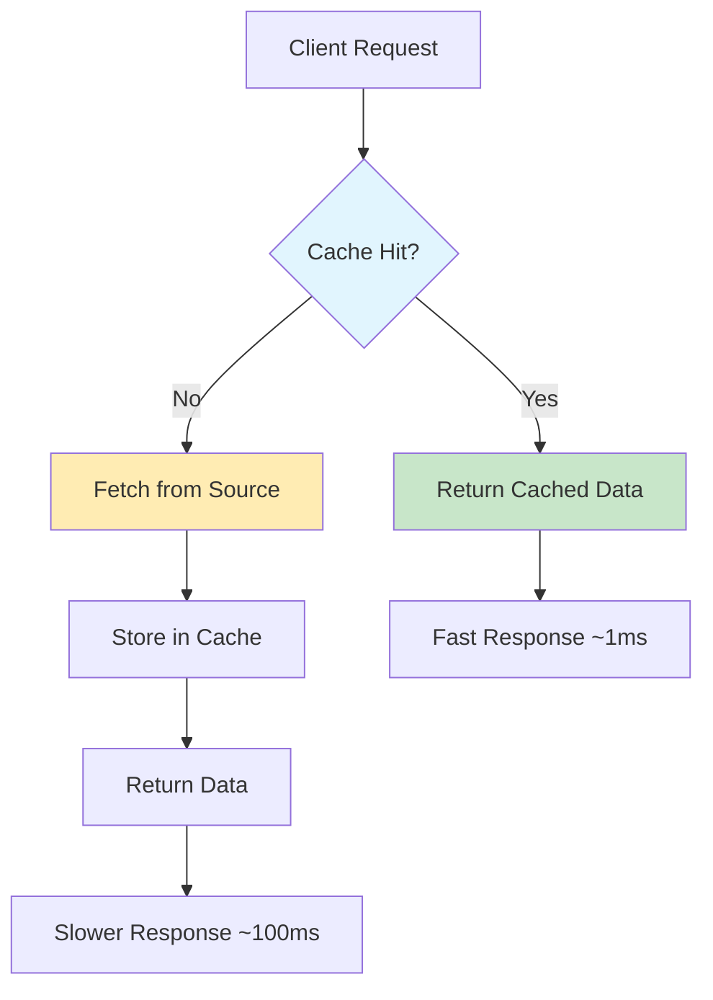

# ⚡ Lección 09: Caching Strategies

> "Los cachés son como la memoria a corto plazo: muy rápidos para lo que recuerdas, pero hay que ser inteligente sobre qué recordar y cuándo olvidar." - Principal Engineer, Netflix

## 🎯 Objetivos de la Lección

Al finalizar esta lección, serás capaz de:

- **🏗️ Diseño**: Implementar arquitecturas de caché multi-nivel robustas
- **⚡ Performance**: Reducir latencia de 100ms a <1ms en aplicaciones reales
- **🧠 Estrategias**: Dominar Cache-Aside, Write-Through, Write-Behind y más
- **🔄 Invalidación**: Manejar consistencia y TTL de manera inteligente
- **📊 Monitoring**: Observar hit ratios, latencias y patrones de uso
- **🌐 Distribución**: Implementar cachés distribuidos y coherencia

## 🧠 Conceptos Fundamentales

### 💾 ¿Qué es el Caching?



### 🎭 Analogía: La Biblioteca Personal

Imagina tu **biblioteca personal vs. biblioteca pública**:

- **📚 Estantería Personal (L1 Cache)**: Libros más usados, acceso instantáneo
- **🏠 Biblioteca Casa (L2 Cache)**: Colección más amplia, acceso rápido
- **🏛️ Biblioteca Pública (Database)**: Todo disponible, pero tardas en llegar
- **📖 Librería (External API)**: Tienes que comprar si no existe

## 🏛️ Niveles de Cache

### 1. 🧠 CPU Level Caching

```go
// Go compiler optimizations y CPU cache efficiency
type CacheLineOptimized struct {
    // Agrupa datos frecuentemente accedidos juntos
    hotData struct {
        counter int64    // 8 bytes
        flag    bool     // 1 byte
        _       [7]byte  // padding para alineación
    }
    
    // Datos menos frecuentes en línea separada
    coldData struct {
        metadata map[string]interface{}
    }
}

// Cache-friendly data structures
type HotPath struct {
    // Datos que se acceden juntos
    id       uint64
    status   uint32
    priority uint32
}

// Evita false sharing en concurrencia
type PaddedCounter struct {
    _     [64]byte // padding
    value int64
    _     [64]byte // padding
}
```

### 2. 🏠 Application Level Caching

```go
package cache

import (
    "sync"
    "time"
)

// Interface unificada para diferentes tipos de cache
type Cache interface {
    Get(key string) (interface{}, bool)
    Set(key string, value interface{}, ttl time.Duration) error
    Delete(key string) error
    Clear() error
    Stats() CacheStats
}

type CacheStats struct {
    Hits        int64   `json:"hits"`
    Misses      int64   `json:"misses"`
    HitRatio    float64 `json:"hit_ratio"`
    Size        int64   `json:"size"`
    Evictions   int64   `json:"evictions"`
}

// In-Memory Cache con LRU
type LRUCache struct {
    maxSize    int
    items      map[string]*item
    order      *list.List
    mu         sync.RWMutex
    stats      CacheStats
}

type item struct {
    key        string
    value      interface{}
    expiry     time.Time
    element    *list.Element
}

func NewLRUCache(maxSize int) *LRUCache {
    return &LRUCache{
        maxSize: maxSize,
        items:   make(map[string]*item),
        order:   list.New(),
    }
}

func (c *LRUCache) Get(key string) (interface{}, bool) {
    c.mu.Lock()
    defer c.mu.Unlock()
    
    item, exists := c.items[key]
    if !exists {
        c.stats.Misses++
        return nil, false
    }
    
    // Check expiry
    if time.Now().After(item.expiry) {
        c.deleteItem(item)
        c.stats.Misses++
        return nil, false
    }
    
    // Move to front (most recently used)
    c.order.MoveToFront(item.element)
    c.stats.Hits++
    
    return item.value, true
}

func (c *LRUCache) Set(key string, value interface{}, ttl time.Duration) error {
    c.mu.Lock()
    defer c.mu.Unlock()
    
    // Update existing item
    if existingItem, exists := c.items[key]; exists {
        existingItem.value = value
        existingItem.expiry = time.Now().Add(ttl)
        c.order.MoveToFront(existingItem.element)
        return nil
    }
    
    // Add new item
    newItem := &item{
        key:    key,
        value:  value,
        expiry: time.Now().Add(ttl),
    }
    
    newItem.element = c.order.PushFront(newItem)
    c.items[key] = newItem
    
    // Evict if necessary
    if len(c.items) > c.maxSize {
        c.evictOldest()
    }
    
    return nil
}

func (c *LRUCache) evictOldest() {
    oldest := c.order.Back()
    if oldest != nil {
        item := oldest.Value.(*item)
        c.deleteItem(item)
        c.stats.Evictions++
    }
}

func (c *LRUCache) deleteItem(item *item) {
    delete(c.items, item.key)
    c.order.Remove(item.element)
}
```

### 3. 🌐 Distributed Caching

```go
package distributed

import (
    "context"
    "encoding/json"
    "fmt"
    "time"
    
    "github.com/go-redis/redis/v8"
)

// Redis Distributed Cache
type RedisCache struct {
    client *redis.Client
    prefix string
}

func NewRedisCache(addr, password string, db int, prefix string) *RedisCache {
    rdb := redis.NewClient(&redis.Options{
        Addr:         addr,
        Password:     password,
        DB:           db,
        PoolSize:     10,
        MinIdleConns: 5,
    })
    
    return &RedisCache{
        client: rdb,
        prefix: prefix,
    }
}

func (r *RedisCache) Get(ctx context.Context, key string) (interface{}, error) {
    fullKey := r.prefix + key
    
    val, err := r.client.Get(ctx, fullKey).Result()
    if err == redis.Nil {
        return nil, ErrCacheMiss
    }
    if err != nil {
        return nil, err
    }
    
    var result interface{}
    if err := json.Unmarshal([]byte(val), &result); err != nil {
        return nil, err
    }
    
    return result, nil
}

func (r *RedisCache) Set(ctx context.Context, key string, value interface{}, ttl time.Duration) error {
    fullKey := r.prefix + key
    
    jsonValue, err := json.Marshal(value)
    if err != nil {
        return err
    }
    
    return r.client.Set(ctx, fullKey, jsonValue, ttl).Err()
}

// Cache con pipelines para operaciones batch
func (r *RedisCache) MGet(ctx context.Context, keys []string) (map[string]interface{}, error) {
    if len(keys) == 0 {
        return make(map[string]interface{}), nil
    }
    
    pipe := r.client.Pipeline()
    
    // Preparar comandos
    cmds := make([]*redis.StringCmd, len(keys))
    for i, key := range keys {
        fullKey := r.prefix + key
        cmds[i] = pipe.Get(ctx, fullKey)
    }
    
    // Ejecutar pipeline
    _, err := pipe.Exec(ctx)
    if err != nil && err != redis.Nil {
        return nil, err
    }
    
    // Procesar resultados
    results := make(map[string]interface{})
    for i, cmd := range cmds {
        val, err := cmd.Result()
        if err == redis.Nil {
            continue // Key not found
        }
        if err != nil {
            continue // Error getting key
        }
        
        var result interface{}
        if json.Unmarshal([]byte(val), &result) == nil {
            results[keys[i]] = result
        }
    }
    
    return results, nil
}

// Cache con Lua scripts para operaciones atómicas
const luaIncrementScript = `
local key = KEYS[1]
local increment = ARGV[1]
local ttl = ARGV[2]

local current = redis.call('GET', key)
if current == false then
    current = 0
else
    current = tonumber(current)
end

local new_value = current + tonumber(increment)
redis.call('SET', key, new_value, 'EX', ttl)
return new_value
`

func (r *RedisCache) IncrementWithTTL(ctx context.Context, key string, 
    increment int64, ttl time.Duration) (int64, error) {
    
    fullKey := r.prefix + key
    result, err := r.client.Eval(ctx, luaIncrementScript, 
        []string{fullKey}, increment, int(ttl.Seconds())).Result()
    if err != nil {
        return 0, err
    }
    
    return result.(int64), nil
}
```

## 🎯 Patrones de Caching

### 1. 📖 Cache-Aside (Lazy Loading)

```go
type UserService struct {
    cache    Cache
    database UserRepository
}

func (s *UserService) GetUser(ctx context.Context, userID string) (*User, error) {
    // 1. Try cache first
    cacheKey := fmt.Sprintf("user:%s", userID)
    if cached, found := s.cache.Get(cacheKey); found {
        if user, ok := cached.(*User); ok {
            return user, nil
        }
    }
    
    // 2. Cache miss - fetch from database
    user, err := s.database.GetByID(ctx, userID)
    if err != nil {
        return nil, err
    }
    
    // 3. Store in cache for next time
    s.cache.Set(cacheKey, user, 15*time.Minute)
    
    return user, nil
}

// Batch loading para reducir round trips
func (s *UserService) GetUsers(ctx context.Context, userIDs []string) ([]*User, error) {
    // 1. Check cache for all users
    cacheKeys := make([]string, len(userIDs))
    for i, id := range userIDs {
        cacheKeys[i] = fmt.Sprintf("user:%s", id)
    }
    
    cached := s.cache.MGet(cacheKeys)
    users := make([]*User, 0, len(userIDs))
    missedIDs := make([]string, 0)
    
    // 2. Separate hits from misses
    for i, userID := range userIDs {
        if cachedUser, found := cached[cacheKeys[i]]; found {
            if user, ok := cachedUser.(*User); ok {
                users = append(users, user)
                continue
            }
        }
        missedIDs = append(missedIDs, userID)
    }
    
    // 3. Fetch missed users from database
    if len(missedIDs) > 0 {
        dbUsers, err := s.database.GetByIDs(ctx, missedIDs)
        if err != nil {
            return nil, err
        }
        
        // 4. Cache fetched users
        for _, user := range dbUsers {
            cacheKey := fmt.Sprintf("user:%s", user.ID)
            s.cache.Set(cacheKey, user, 15*time.Minute)
        }
        
        users = append(users, dbUsers...)
    }
    
    return users, nil
}
```

### 2. ✍️ Write-Through

```go
type WriteThruCache struct {
    cache    Cache
    database Repository
}

func (w *WriteThruCache) Save(ctx context.Context, user *User) error {
    // 1. Write to database first
    if err := w.database.Save(ctx, user); err != nil {
        return err
    }
    
    // 2. Update cache
    cacheKey := fmt.Sprintf("user:%s", user.ID)
    if err := w.cache.Set(cacheKey, user, 15*time.Minute); err != nil {
        // Log error but don't fail the operation
        log.Printf("Failed to update cache: %v", err)
    }
    
    return nil
}

// Write-Through con transacciones
func (w *WriteThruCache) SaveTransactional(ctx context.Context, user *User) error {
    tx, err := w.database.BeginTx(ctx)
    if err != nil {
        return err
    }
    defer tx.Rollback()
    
    // 1. Save to database
    if err := tx.Save(ctx, user); err != nil {
        return err
    }
    
    // 2. Update cache
    cacheKey := fmt.Sprintf("user:%s", user.ID)
    if err := w.cache.Set(cacheKey, user, 15*time.Minute); err != nil {
        return err // Rollback transaction
    }
    
    return tx.Commit()
}
```

### 3. 🔄 Write-Behind (Write-Back)

```go
type WriteBehindCache struct {
    cache       Cache
    database    Repository
    writeBuffer chan WriteOperation
    batchSize   int
    flushInterval time.Duration
}

type WriteOperation struct {
    Operation string      // "create", "update", "delete"
    Key       string
    Value     interface{}
    Timestamp time.Time
}

func NewWriteBehindCache(cache Cache, db Repository) *WriteBehindCache {
    wbc := &WriteBehindCache{
        cache:         cache,
        database:      db,
        writeBuffer:   make(chan WriteOperation, 10000),
        batchSize:     100,
        flushInterval: 5 * time.Second,
    }
    
    go wbc.startBatchWriter()
    return wbc
}

func (w *WriteBehindCache) Set(key string, value interface{}, ttl time.Duration) error {
    // 1. Update cache immediately
    if err := w.cache.Set(key, value, ttl); err != nil {
        return err
    }
    
    // 2. Queue for async database write
    op := WriteOperation{
        Operation: "update",
        Key:       key,
        Value:     value,
        Timestamp: time.Now(),
    }
    
    select {
    case w.writeBuffer <- op:
        return nil
    default:
        return fmt.Errorf("write buffer full")
    }
}

func (w *WriteBehindCache) startBatchWriter() {
    ticker := time.NewTicker(w.flushInterval)
    defer ticker.Stop()
    
    batch := make([]WriteOperation, 0, w.batchSize)
    
    for {
        select {
        case op := <-w.writeBuffer:
            batch = append(batch, op)
            if len(batch) >= w.batchSize {
                w.flushBatch(batch)
                batch = batch[:0]
            }
            
        case <-ticker.C:
            if len(batch) > 0 {
                w.flushBatch(batch)
                batch = batch[:0]
            }
        }
    }
}

func (w *WriteBehindCache) flushBatch(batch []WriteOperation) {
    if len(batch) == 0 {
        return
    }
    
    ctx, cancel := context.WithTimeout(context.Background(), 30*time.Second)
    defer cancel()
    
    // Group operations by type
    updates := make(map[string]interface{})
    deletes := make([]string, 0)
    
    for _, op := range batch {
        switch op.Operation {
        case "update", "create":
            updates[op.Key] = op.Value
        case "delete":
            deletes = append(deletes, op.Key)
        }
    }
    
    // Batch updates
    if len(updates) > 0 {
        if err := w.database.BatchUpdate(ctx, updates); err != nil {
            log.Printf("Failed to flush updates: %v", err)
            // TODO: Implement retry logic
        }
    }
    
    // Batch deletes
    if len(deletes) > 0 {
        if err := w.database.BatchDelete(ctx, deletes); err != nil {
            log.Printf("Failed to flush deletes: %v", err)
        }
    }
    
    log.Printf("Flushed %d operations to database", len(batch))
}
```

### 4. 🔄 Refresh-Ahead

```go
type RefreshAheadCache struct {
    cache        Cache
    database     Repository
    refreshThreshold float64 // Refresh when TTL < threshold * original_ttl
    refresher    *AsyncRefresher
}

type CacheItem struct {
    Value     interface{}
    SetAt     time.Time
    TTL       time.Duration
    LastAccess time.Time
}

func (r *RefreshAheadCache) Get(key string) (interface{}, bool) {
    item, found := r.cache.Get(key)
    if !found {
        return nil, false
    }
    
    cacheItem := item.(*CacheItem)
    cacheItem.LastAccess = time.Now()
    
    // Check if refresh needed
    elapsed := time.Since(cacheItem.SetAt)
    refreshTime := time.Duration(float64(cacheItem.TTL) * r.refreshThreshold)
    
    if elapsed > refreshTime {
        // Trigger async refresh
        go r.refresher.RefreshAsync(key)
    }
    
    return cacheItem.Value, true
}

type AsyncRefresher struct {
    cache    Cache
    database Repository
    inflight sync.Map // Prevent duplicate refreshes
}

func (a *AsyncRefresher) RefreshAsync(key string) {
    // Check if already refreshing
    if _, loaded := a.inflight.LoadOrStore(key, true); loaded {
        return
    }
    defer a.inflight.Delete(key)
    
    // Fetch fresh data
    freshData, err := a.database.GetByKey(context.Background(), key)
    if err != nil {
        log.Printf("Failed to refresh cache key %s: %v", key, err)
        return
    }
    
    // Update cache
    item := &CacheItem{
        Value: freshData,
        SetAt: time.Now(),
        TTL:   15 * time.Minute,
    }
    
    a.cache.Set(key, item, item.TTL)
}
```

## 🔄 Cache Invalidation Strategies

### 1. ⏰ Time-Based (TTL)

```go
type TTLCache struct {
    cache sync.Map
    ttl   time.Duration
}

type TTLItem struct {
    Value     interface{}
    ExpiresAt time.Time
}

func NewTTLCache(ttl time.Duration) *TTLCache {
    cache := &TTLCache{ttl: ttl}
    go cache.startCleanup()
    return cache
}

func (t *TTLCache) Set(key string, value interface{}) {
    item := TTLItem{
        Value:     value,
        ExpiresAt: time.Now().Add(t.ttl),
    }
    t.cache.Store(key, item)
}

func (t *TTLCache) Get(key string) (interface{}, bool) {
    if value, ok := t.cache.Load(key); ok {
        item := value.(TTLItem)
        if time.Now().Before(item.ExpiresAt) {
            return item.Value, true
        }
        t.cache.Delete(key) // Expired
    }
    return nil, false
}

func (t *TTLCache) startCleanup() {
    ticker := time.NewTicker(time.Minute)
    defer ticker.Stop()
    
    for range ticker.C {
        now := time.Now()
        t.cache.Range(func(key, value interface{}) bool {
            item := value.(TTLItem)
            if now.After(item.ExpiresAt) {
                t.cache.Delete(key)
            }
            return true
        })
    }
}
```

### 2. 📢 Event-Based Invalidation

```go
type EventBasedCache struct {
    cache     Cache
    publisher EventPublisher
    subscriber EventSubscriber
}

type CacheInvalidationEvent struct {
    Keys      []string  `json:"keys"`
    Pattern   string    `json:"pattern,omitempty"`
    Timestamp time.Time `json:"timestamp"`
}

func NewEventBasedCache(cache Cache, pub EventPublisher, sub EventSubscriber) *EventBasedCache {
    ebc := &EventBasedCache{
        cache:      cache,
        publisher:  pub,
        subscriber: sub,
    }
    
    // Listen for invalidation events
    go ebc.listenForInvalidations()
    
    return ebc
}

func (e *EventBasedCache) InvalidateKeys(keys []string) error {
    // Local invalidation
    for _, key := range keys {
        e.cache.Delete(key)
    }
    
    // Broadcast to other instances
    event := CacheInvalidationEvent{
        Keys:      keys,
        Timestamp: time.Now(),
    }
    
    return e.publisher.Publish("cache.invalidation", event)
}

func (e *EventBasedCache) InvalidatePattern(pattern string) error {
    // Local pattern invalidation
    e.cache.DeletePattern(pattern)
    
    // Broadcast to other instances
    event := CacheInvalidationEvent{
        Pattern:   pattern,
        Timestamp: time.Now(),
    }
    
    return e.publisher.Publish("cache.invalidation", event)
}

func (e *EventBasedCache) listenForInvalidations() {
    e.subscriber.Subscribe("cache.invalidation", func(data []byte) error {
        var event CacheInvalidationEvent
        if err := json.Unmarshal(data, &event); err != nil {
            return err
        }
        
        // Apply invalidation
        if len(event.Keys) > 0 {
            for _, key := range event.Keys {
                e.cache.Delete(key)
            }
        }
        
        if event.Pattern != "" {
            e.cache.DeletePattern(event.Pattern)
        }
        
        return nil
    })
}
```

### 3. 🔍 Content-Based Invalidation

```go
type ContentBasedCache struct {
    cache     Cache
    hasher    hash.Hash
    checksums sync.Map
}

func NewContentBasedCache(cache Cache) *ContentBasedCache {
    return &ContentBasedCache{
        cache:  cache,
        hasher: sha256.New(),
    }
}

func (c *ContentBasedCache) Set(key string, value interface{}) error {
    // Calculate content hash
    contentHash := c.calculateHash(value)
    
    // Store with hash
    wrappedValue := ContentWrapper{
        Value: value,
        Hash:  contentHash,
        SetAt: time.Now(),
    }
    
    c.checksums.Store(key, contentHash)
    return c.cache.Set(key, wrappedValue, time.Hour)
}

func (c *ContentBasedCache) Get(key string) (interface{}, bool) {
    cached, found := c.cache.Get(key)
    if !found {
        return nil, false
    }
    
    wrapper := cached.(ContentWrapper)
    
    // Verify content hasn't changed
    if storedHash, ok := c.checksums.Load(key); ok {
        if storedHash.(string) != wrapper.Hash {
            // Content changed, invalidate
            c.cache.Delete(key)
            c.checksums.Delete(key)
            return nil, false
        }
    }
    
    return wrapper.Value, true
}

type ContentWrapper struct {
    Value interface{}
    Hash  string
    SetAt time.Time
}

func (c *ContentBasedCache) calculateHash(value interface{}) string {
    c.hasher.Reset()
    
    // Serialize value for hashing
    data, _ := json.Marshal(value)
    c.hasher.Write(data)
    
    return fmt.Sprintf("%x", c.hasher.Sum(nil))
}
```

## 🔧 Advanced Cache Features

### 1. 🎯 Multi-Level Cache

```go
type MultiLevelCache struct {
    l1 Cache // Fast, small (in-memory)
    l2 Cache // Medium, larger (Redis)
    l3 Cache // Slow, largest (Database)
}

func NewMultiLevelCache(l1, l2, l3 Cache) *MultiLevelCache {
    return &MultiLevelCache{l1: l1, l2: l2, l3: l3}
}

func (m *MultiLevelCache) Get(key string) (interface{}, bool) {
    // Try L1 first
    if value, found := m.l1.Get(key); found {
        return value, true
    }
    
    // Try L2
    if value, found := m.l2.Get(key); found {
        // Promote to L1
        m.l1.Set(key, value, 5*time.Minute)
        return value, true
    }
    
    // Try L3 (could be database)
    if value, found := m.l3.Get(key); found {
        // Promote to both L2 and L1
        m.l2.Set(key, value, 15*time.Minute)
        m.l1.Set(key, value, 5*time.Minute)
        return value, true
    }
    
    return nil, false
}

func (m *MultiLevelCache) Set(key string, value interface{}) {
    // Set in all levels with different TTLs
    m.l1.Set(key, value, 5*time.Minute)
    m.l2.Set(key, value, 15*time.Minute)
    m.l3.Set(key, value, time.Hour)
}
```

### 2. 🔄 Cache Warming

```go
type CacheWarmer struct {
    cache    Cache
    database Repository
    config   WarmingConfig
}

type WarmingConfig struct {
    Patterns          []string      `json:"patterns"`
    Interval          time.Duration `json:"interval"`
    ConcurrentWorkers int           `json:"concurrent_workers"`
    BatchSize         int           `json:"batch_size"`
}

func NewCacheWarmer(cache Cache, db Repository, config WarmingConfig) *CacheWarmer {
    return &CacheWarmer{
        cache:    cache,
        database: db,
        config:   config,
    }
}

func (w *CacheWarmer) Start(ctx context.Context) {
    ticker := time.NewTicker(w.config.Interval)
    defer ticker.Stop()
    
    // Initial warming
    w.warmCache(ctx)
    
    for {
        select {
        case <-ticker.C:
            w.warmCache(ctx)
        case <-ctx.Done():
            return
        }
    }
}

func (w *CacheWarmer) warmCache(ctx context.Context) {
    for _, pattern := range w.config.Patterns {
        go w.warmPattern(ctx, pattern)
    }
}

func (w *CacheWarmer) warmPattern(ctx context.Context, pattern string) {
    // Get keys to warm based on pattern
    keys, err := w.database.GetKeysByPattern(ctx, pattern)
    if err != nil {
        log.Printf("Failed to get keys for pattern %s: %v", pattern, err)
        return
    }
    
    // Process in batches with workers
    semaphore := make(chan struct{}, w.config.ConcurrentWorkers)
    
    for i := 0; i < len(keys); i += w.config.BatchSize {
        end := i + w.config.BatchSize
        if end > len(keys) {
            end = len(keys)
        }
        
        batch := keys[i:end]
        
        semaphore <- struct{}{} // Acquire
        go func(batch []string) {
            defer func() { <-semaphore }() // Release
            w.warmBatch(ctx, batch)
        }(batch)
    }
}

func (w *CacheWarmer) warmBatch(ctx context.Context, keys []string) {
    // Fetch data for all keys in batch
    data, err := w.database.GetByKeys(ctx, keys)
    if err != nil {
        log.Printf("Failed to warm batch: %v", err)
        return
    }
    
    // Store in cache
    for key, value := range data {
        w.cache.Set(key, value, time.Hour)
    }
    
    log.Printf("Warmed %d cache entries", len(data))
}
```

### 3. 📊 Cache Analytics

```go
type CacheAnalytics struct {
    cache    Cache
    metrics  *CacheMetrics
    sampler  *RequestSampler
}

type CacheMetrics struct {
    Hits              prometheus.Counter
    Misses            prometheus.Counter
    Evictions         prometheus.Counter
    LatencyHistogram  prometheus.Histogram
    SizeGauge         prometheus.Gauge
    HotKeys           *HotKeyTracker
}

type HotKeyTracker struct {
    keys map[string]int64
    mu   sync.RWMutex
}

func NewCacheAnalytics(cache Cache) *CacheAnalytics {
    return &CacheAnalytics{
        cache:   cache,
        metrics: NewCacheMetrics(),
        sampler: NewRequestSampler(0.1), // Sample 10% of requests
    }
}

func (a *CacheAnalytics) Get(key string) (interface{}, bool) {
    start := time.Now()
    defer func() {
        a.metrics.LatencyHistogram.Observe(time.Since(start).Seconds())
    }()
    
    value, found := a.cache.Get(key)
    
    if found {
        a.metrics.Hits.Inc()
        a.metrics.HotKeys.Increment(key)
    } else {
        a.metrics.Misses.Inc()
    }
    
    // Sample request for detailed analysis
    if a.sampler.ShouldSample() {
        a.logRequest(key, found, time.Since(start))
    }
    
    return value, found
}

func (a *CacheAnalytics) GetHotKeys(limit int) []KeyStats {
    return a.metrics.HotKeys.GetTop(limit)
}

type KeyStats struct {
    Key   string `json:"key"`
    Count int64  `json:"count"`
}

func (h *HotKeyTracker) Increment(key string) {
    h.mu.Lock()
    defer h.mu.Unlock()
    h.keys[key]++
}

func (h *HotKeyTracker) GetTop(limit int) []KeyStats {
    h.mu.RLock()
    defer h.mu.RUnlock()
    
    type keyCount struct {
        key   string
        count int64
    }
    
    var pairs []keyCount
    for k, v := range h.keys {
        pairs = append(pairs, keyCount{k, v})
    }
    
    // Sort by count descending
    sort.Slice(pairs, func(i, j int) bool {
        return pairs[i].count > pairs[j].count
    })
    
    result := make([]KeyStats, 0, limit)
    for i := 0; i < len(pairs) && i < limit; i++ {
        result = append(result, KeyStats{
            Key:   pairs[i].key,
            Count: pairs[i].count,
        })
    }
    
    return result
}
```

## 🌐 Distributed Cache Patterns

### 1. 🔀 Consistent Hashing

```go
type ConsistentHashCache struct {
    ring     *HashRing
    caches   map[string]Cache
    replicas int
}

type HashRing struct {
    nodes map[uint32]string
    keys  []uint32
    mu    sync.RWMutex
}

func NewConsistentHashCache(caches map[string]Cache, replicas int) *ConsistentHashCache {
    ring := &HashRing{
        nodes: make(map[uint32]string),
    }
    
    // Add virtual nodes for each cache
    for name := range caches {
        for i := 0; i < replicas; i++ {
            virtualKey := fmt.Sprintf("%s:%d", name, i)
            hash := hash32(virtualKey)
            ring.nodes[hash] = name
            ring.keys = append(ring.keys, hash)
        }
    }
    
    sort.Slice(ring.keys, func(i, j int) bool {
        return ring.keys[i] < ring.keys[j]
    })
    
    return &ConsistentHashCache{
        ring:     ring,
        caches:   caches,
        replicas: replicas,
    }
}

func (c *ConsistentHashCache) Get(key string) (interface{}, bool) {
    cacheName := c.ring.GetNode(key)
    cache := c.caches[cacheName]
    return cache.Get(key)
}

func (c *ConsistentHashCache) Set(key string, value interface{}, ttl time.Duration) error {
    cacheName := c.ring.GetNode(key)
    cache := c.caches[cacheName]
    return cache.Set(key, value, ttl)
}

func (r *HashRing) GetNode(key string) string {
    r.mu.RLock()
    defer r.mu.RUnlock()
    
    if len(r.keys) == 0 {
        return ""
    }
    
    hash := hash32(key)
    
    // Find first node >= hash
    idx := sort.Search(len(r.keys), func(i int) bool {
        return r.keys[i] >= hash
    })
    
    // Wrap around if necessary
    if idx == len(r.keys) {
        idx = 0
    }
    
    return r.nodes[r.keys[idx]]
}

func hash32(key string) uint32 {
    h := fnv.New32a()
    h.Write([]byte(key))
    return h.Sum32()
}
```

### 2. 🔄 Cache Replication

```go
type ReplicatedCache struct {
    primary    Cache
    replicas   []Cache
    strategy   ReplicationStrategy
}

type ReplicationStrategy int

const (
    SyncReplication  ReplicationStrategy = iota
    AsyncReplication
    QuorumReplication
)

func NewReplicatedCache(primary Cache, replicas []Cache, strategy ReplicationStrategy) *ReplicatedCache {
    return &ReplicatedCache{
        primary:  primary,
        replicas: replicas,
        strategy: strategy,
    }
}

func (r *ReplicatedCache) Get(key string) (interface{}, bool) {
    // Read from primary first
    if value, found := r.primary.Get(key); found {
        return value, true
    }
    
    // Try replicas
    for _, replica := range r.replicas {
        if value, found := replica.Get(key); found {
            // Repair primary
            go r.primary.Set(key, value, time.Hour)
            return value, true
        }
    }
    
    return nil, false
}

func (r *ReplicatedCache) Set(key string, value interface{}, ttl time.Duration) error {
    switch r.strategy {
    case SyncReplication:
        return r.syncSet(key, value, ttl)
    case AsyncReplication:
        return r.asyncSet(key, value, ttl)
    case QuorumReplication:
        return r.quorumSet(key, value, ttl)
    default:
        return r.syncSet(key, value, ttl)
    }
}

func (r *ReplicatedCache) syncSet(key string, value interface{}, ttl time.Duration) error {
    // Write to primary
    if err := r.primary.Set(key, value, ttl); err != nil {
        return err
    }
    
    // Write to all replicas
    var errors []error
    for _, replica := range r.replicas {
        if err := replica.Set(key, value, ttl); err != nil {
            errors = append(errors, err)
        }
    }
    
    if len(errors) > 0 {
        return fmt.Errorf("replica errors: %v", errors)
    }
    
    return nil
}

func (r *ReplicatedCache) asyncSet(key string, value interface{}, ttl time.Duration) error {
    // Write to primary synchronously
    if err := r.primary.Set(key, value, ttl); err != nil {
        return err
    }
    
    // Write to replicas asynchronously
    for _, replica := range r.replicas {
        go func(r Cache) {
            if err := r.Set(key, value, ttl); err != nil {
                log.Printf("Async replication failed: %v", err)
            }
        }(replica)
    }
    
    return nil
}

func (r *ReplicatedCache) quorumSet(key string, value interface{}, ttl time.Duration) error {
    quorum := (len(r.replicas) + 1) / 2 + 1 // Majority
    
    successful := 0
    var wg sync.WaitGroup
    var mu sync.Mutex
    
    // Include primary
    allCaches := append([]Cache{r.primary}, r.replicas...)
    
    for _, cache := range allCaches {
        wg.Add(1)
        go func(c Cache) {
            defer wg.Done()
            if err := c.Set(key, value, ttl); err == nil {
                mu.Lock()
                successful++
                mu.Unlock()
            }
        }(cache)
    }
    
    wg.Wait()
    
    if successful >= quorum {
        return nil
    }
    
    return fmt.Errorf("quorum not reached: %d/%d", successful, quorum)
}
```

## 🧪 Testing Cache Systems

```go
package cache_test

import (
    "context"
    "fmt"
    "sync"
    "testing"
    "time"
    
    "github.com/stretchr/testify/assert"
    "github.com/stretchr/testify/require"
)

func TestLRUCache(t *testing.T) {
    cache := NewLRUCache(3)
    
    // Test basic operations
    cache.Set("key1", "value1", time.Hour)
    cache.Set("key2", "value2", time.Hour)
    cache.Set("key3", "value3", time.Hour)
    
    // Verify all keys exist
    value, found := cache.Get("key1")
    assert.True(t, found)
    assert.Equal(t, "value1", value)
    
    // Add fourth key, should evict least recently used
    cache.Set("key4", "value4", time.Hour)
    
    // key2 should be evicted (oldest, not accessed)
    _, found = cache.Get("key2")
    assert.False(t, found)
    
    // Others should still exist
    _, found = cache.Get("key1")
    assert.True(t, found) // Was accessed recently
    _, found = cache.Get("key3")
    assert.True(t, found)
    _, found = cache.Get("key4")
    assert.True(t, found)
}

func TestCacheExpiration(t *testing.T) {
    cache := NewLRUCache(10)
    
    // Set with short TTL
    cache.Set("expiring", "value", 50*time.Millisecond)
    
    // Should be available immediately
    value, found := cache.Get("expiring")
    assert.True(t, found)
    assert.Equal(t, "value", value)
    
    // Wait for expiration
    time.Sleep(100 * time.Millisecond)
    
    // Should be expired
    _, found = cache.Get("expiring")
    assert.False(t, found)
}

func TestCacheConcurrency(t *testing.T) {
    cache := NewLRUCache(1000)
    numWorkers := 10
    opsPerWorker := 1000
    
    var wg sync.WaitGroup
    
    // Start writers
    for i := 0; i < numWorkers; i++ {
        wg.Add(1)
        go func(workerID int) {
            defer wg.Done()
            for j := 0; j < opsPerWorker; j++ {
                key := fmt.Sprintf("key-%d-%d", workerID, j)
                value := fmt.Sprintf("value-%d-%d", workerID, j)
                cache.Set(key, value, time.Hour)
            }
        }(i)
    }
    
    // Start readers
    for i := 0; i < numWorkers; i++ {
        wg.Add(1)
        go func(workerID int) {
            defer wg.Done()
            for j := 0; j < opsPerWorker; j++ {
                key := fmt.Sprintf("key-%d-%d", workerID, j%100) // Read existing keys
                cache.Get(key)
            }
        }(i)
    }
    
    wg.Wait()
    
    // Verify cache is still functional
    cache.Set("test", "value", time.Hour)
    value, found := cache.Get("test")
    assert.True(t, found)
    assert.Equal(t, "value", value)
}

func BenchmarkCacheOperations(b *testing.B) {
    cache := NewLRUCache(10000)
    
    b.Run("Set", func(b *testing.B) {
        b.ResetTimer()
        for i := 0; i < b.N; i++ {
            key := fmt.Sprintf("key-%d", i)
            cache.Set(key, i, time.Hour)
        }
    })
    
    // Pre-populate for Get benchmark
    for i := 0; i < 1000; i++ {
        cache.Set(fmt.Sprintf("key-%d", i), i, time.Hour)
    }
    
    b.Run("Get", func(b *testing.B) {
        b.ResetTimer()
        for i := 0; i < b.N; i++ {
            key := fmt.Sprintf("key-%d", i%1000)
            cache.Get(key)
        }
    })
}

func TestCacheHitRatio(t *testing.T) {
    cache := NewLRUCache(100)
    
    // Populate cache
    for i := 0; i < 50; i++ {
        cache.Set(fmt.Sprintf("key-%d", i), i, time.Hour)
    }
    
    hits := 0
    misses := 0
    total := 1000
    
    for i := 0; i < total; i++ {
        key := fmt.Sprintf("key-%d", i%75) // Some will hit, some will miss
        if _, found := cache.Get(key); found {
            hits++
        } else {
            misses++
        }
    }
    
    hitRatio := float64(hits) / float64(total)
    
    // Should have reasonable hit ratio
    assert.Greater(t, hitRatio, 0.5, "Hit ratio should be > 50%")
    
    t.Logf("Hit ratio: %.2f%% (%d hits, %d misses)", 
        hitRatio*100, hits, misses)
}

func TestDistributedCacheConsistency(t *testing.T) {
    // Setup multiple cache instances
    cache1 := NewRedisCache("localhost:6379", "", 0, "test1:")
    cache2 := NewRedisCache("localhost:6379", "", 0, "test2:")
    
    caches := map[string]Cache{
        "cache1": cache1,
        "cache2": cache2,
    }
    
    consistentCache := NewConsistentHashCache(caches, 100)
    
    // Set values
    keys := []string{"user:1", "user:2", "user:3", "user:4", "user:5"}
    for _, key := range keys {
        err := consistentCache.Set(key, fmt.Sprintf("value-%s", key), time.Hour)
        require.NoError(t, err)
    }
    
    // Verify all values can be retrieved
    for _, key := range keys {
        value, found := consistentCache.Get(key)
        assert.True(t, found, "Key %s should be found", key)
        assert.Equal(t, fmt.Sprintf("value-%s", key), value)
    }
}
```

## 📊 Monitoring y Observability

```go
package monitoring

import (
    "time"
    
    "github.com/prometheus/client_golang/prometheus"
    "github.com/prometheus/client_golang/prometheus/promauto"
)

var (
    cacheHits = promauto.NewCounterVec(
        prometheus.CounterOpts{
            Name: "cache_hits_total",
            Help: "Total number of cache hits",
        },
        []string{"cache_name", "cache_level"},
    )
    
    cacheMisses = promauto.NewCounterVec(
        prometheus.CounterOpts{
            Name: "cache_misses_total",
            Help: "Total number of cache misses",
        },
        []string{"cache_name", "cache_level"},
    )
    
    cacheLatency = promauto.NewHistogramVec(
        prometheus.HistogramOpts{
            Name:    "cache_operation_duration_seconds",
            Help:    "Cache operation latency",
            Buckets: prometheus.DefBuckets,
        },
        []string{"cache_name", "operation"},
    )
    
    cacheSize = promauto.NewGaugeVec(
        prometheus.GaugeOpts{
            Name: "cache_size_items",
            Help: "Current number of items in cache",
        },
        []string{"cache_name"},
    )
    
    cacheMemoryUsage = promauto.NewGaugeVec(
        prometheus.GaugeOpts{
            Name: "cache_memory_usage_bytes",
            Help: "Memory usage of cache in bytes",
        },
        []string{"cache_name"},
    )
)

type ObservableCache struct {
    cache Cache
    name  string
}

func NewObservableCache(cache Cache, name string) *ObservableCache {
    return &ObservableCache{
        cache: cache,
        name:  name,
    }
}

func (o *ObservableCache) Get(key string) (interface{}, bool) {
    start := time.Now()
    defer func() {
        cacheLatency.WithLabelValues(o.name, "get").Observe(
            time.Since(start).Seconds())
    }()
    
    value, found := o.cache.Get(key)
    
    if found {
        cacheHits.WithLabelValues(o.name, "l1").Inc()
    } else {
        cacheMisses.WithLabelValues(o.name, "l1").Inc()
    }
    
    return value, found
}

func (o *ObservableCache) Set(key string, value interface{}, ttl time.Duration) error {
    start := time.Now()
    defer func() {
        cacheLatency.WithLabelValues(o.name, "set").Observe(
            time.Since(start).Seconds())
    }()
    
    return o.cache.Set(key, value, ttl)
}

// Cache health check
type CacheHealthCheck struct {
    cache Cache
    testKey string
}

func NewCacheHealthCheck(cache Cache) *CacheHealthCheck {
    return &CacheHealthCheck{
        cache:   cache,
        testKey: "__health_check__",
    }
}

func (c *CacheHealthCheck) Check() error {
    testValue := time.Now().Unix()
    
    // Try to set
    if err := c.cache.Set(c.testKey, testValue, time.Minute); err != nil {
        return fmt.Errorf("cache set failed: %w", err)
    }
    
    // Try to get
    value, found := c.cache.Get(c.testKey)
    if !found {
        return fmt.Errorf("cache get failed: key not found")
    }
    
    if value != testValue {
        return fmt.Errorf("cache get failed: value mismatch")
    }
    
    // Cleanup
    c.cache.Delete(c.testKey)
    
    return nil
}

// Real-time cache dashboard
type CacheDashboard struct {
    caches map[string]*ObservableCache
}

func NewCacheDashboard() *CacheDashboard {
    return &CacheDashboard{
        caches: make(map[string]*ObservableCache),
    }
}

func (d *CacheDashboard) AddCache(name string, cache Cache) {
    d.caches[name] = NewObservableCache(cache, name)
}

func (d *CacheDashboard) GetStats() map[string]CacheStats {
    stats := make(map[string]CacheStats)
    
    for name, cache := range d.caches {
        stats[name] = cache.cache.Stats()
    }
    
    return stats
}

func (d *CacheDashboard) GetOverallStats() OverallCacheStats {
    var totalHits, totalMisses, totalSize int64
    var avgHitRatio float64
    
    for _, cache := range d.caches {
        cacheStats := cache.cache.Stats()
        totalHits += cacheStats.Hits
        totalMisses += cacheStats.Misses
        totalSize += cacheStats.Size
        avgHitRatio += cacheStats.HitRatio
    }
    
    if len(d.caches) > 0 {
        avgHitRatio /= float64(len(d.caches))
    }
    
    return OverallCacheStats{
        TotalHits:     totalHits,
        TotalMisses:   totalMisses,
        TotalSize:     totalSize,
        AvgHitRatio:   avgHitRatio,
        OverallHitRatio: float64(totalHits) / float64(totalHits + totalMisses),
        ActiveCaches:  len(d.caches),
    }
}

type OverallCacheStats struct {
    TotalHits       int64   `json:"total_hits"`
    TotalMisses     int64   `json:"total_misses"`
    TotalSize       int64   `json:"total_size"`
    AvgHitRatio     float64 `json:"avg_hit_ratio"`
    OverallHitRatio float64 `json:"overall_hit_ratio"`
    ActiveCaches    int     `json:"active_caches"`
}
```

## 🚀 Performance Optimization

### 📈 Cache Sizing

```go
type CacheSizer struct {
    monitor     *PerformanceMonitor
    predictor   *UsagePredictor
    optimizer   *SizeOptimizer
}

func (c *CacheSizer) OptimalSize(historicalData []UsageData) int {
    // Analyze access patterns
    patterns := c.monitor.AnalyzePatterns(historicalData)
    
    // Predict future usage
    prediction := c.predictor.Predict(patterns)
    
    // Calculate optimal size
    return c.optimizer.Calculate(prediction)
}

type UsageData struct {
    Timestamp   time.Time
    Requests    int64
    HitRatio    float64
    CacheSize   int64
    Latency     time.Duration
}

func (c *CacheSizer) ContinuousOptimization(cache Cache) {
    ticker := time.NewTicker(5 * time.Minute)
    defer ticker.Stop()
    
    for range ticker.C {
        stats := cache.Stats()
        
        // Adjust size based on hit ratio
        if stats.HitRatio < 0.8 {
            // Low hit ratio, maybe increase size
            c.suggestSizeIncrease(cache)
        } else if stats.HitRatio > 0.95 {
            // Very high hit ratio, maybe decrease size
            c.suggestSizeDecrease(cache)
        }
    }
}
```

### ⚡ Preloading Strategies

```go
type CachePreloader struct {
    cache       Cache
    dataSource  DataSource
    predictor   *AccessPredictor
}

func (p *CachePreloader) PreloadHotData(ctx context.Context) error {
    // Predict which data will be accessed soon
    hotKeys := p.predictor.PredictHotKeys(time.Hour)
    
    // Preload in batches
    batchSize := 100
    for i := 0; i < len(hotKeys); i += batchSize {
        end := i + batchSize
        if end > len(hotKeys) {
            end = len(hotKeys)
        }
        
        batch := hotKeys[i:end]
        if err := p.preloadBatch(ctx, batch); err != nil {
            return err
        }
    }
    
    return nil
}

func (p *CachePreloader) preloadBatch(ctx context.Context, keys []string) error {
    // Fetch data for all keys
    data, err := p.dataSource.GetBatch(ctx, keys)
    if err != nil {
        return err
    }
    
    // Store in cache
    for key, value := range data {
        p.cache.Set(key, value, time.Hour)
    }
    
    return nil
}

type AccessPredictor struct {
    history    []AccessLog
    patterns   map[string]AccessPattern
}

type AccessPattern struct {
    Frequency   float64
    Seasonality []float64
    Trend       float64
}

func (a *AccessPredictor) PredictHotKeys(window time.Duration) []string {
    now := time.Now()
    var hotKeys []string
    
    for key, pattern := range a.patterns {
        score := a.calculateScore(pattern, now, window)
        if score > 0.7 { // Threshold for "hot"
            hotKeys = append(hotKeys, key)
        }
    }
    
    // Sort by predicted score
    sort.Slice(hotKeys, func(i, j int) bool {
        scoreI := a.calculateScore(a.patterns[hotKeys[i]], now, window)
        scoreJ := a.calculateScore(a.patterns[hotKeys[j]], now, window)
        return scoreI > scoreJ
    })
    
    return hotKeys
}
```

## 🎯 Resumen de la Lección

### 📚 Conceptos Clave Aprendidos

1. **⚡ Cache Fundamentals**: Niveles, tipos y patrones básicos
2. **🔄 Cache Strategies**: Cache-Aside, Write-Through, Write-Behind
3. **🔄 Invalidation**: TTL, Event-Based, Content-Based
4. **🌐 Distributed Caching**: Consistent Hashing, Replication
5. **📊 Monitoring**: Métricas, Analytics, Health Checks
6. **🚀 Optimization**: Sizing, Preloading, Performance Tuning

### 🛠️ Implementaciones Prácticas

1. **💾 LRU Cache**: Con TTL y thread-safety
2. **🌐 Redis Integration**: Distribuido con pipelines
3. **🔄 Multi-Level Cache**: L1/L2/L3 con promotion
4. **📊 Analytics**: Hot keys, hit ratios, latencias
5. **🔄 Replication**: Sync/Async/Quorum strategies
6. **⚡ Performance**: Cache warming y sizing dinámico

### 🚀 Siguientes Pasos

1. **🔐 Security**: Patterns de seguridad en aplicaciones
2. **📊 Monitoring**: Observabilidad completa de sistemas
3. **🚀 Deployment**: Estrategias de deployment avanzadas
4. **⌨️ CLI Tools**: Construcción de herramientas robustas

### 💡 Proyecto Challenge

Implementa un **sistema de caché inteligente** que:
- 🧠 Aprenda patrones de acceso automáticamente
- ⚡ Optimize el tamaño dinámicamente
- 🌐 Se distribuya across múltiples nodos
- 📊 Proporcione analytics en tiempo real
- 🔄 Maneje invalidation inteligente

---

> 💡 **Pro Tip**: "El caching es como organizar tu hogar: lo que usas frecuentemente debe estar al alcance, y hay que limpiar regularmente lo que ya no necesitas."

¡Felicitaciones! 🎉 Has dominado las **estrategias de caching** más avanzadas. Ahora puedes optimizar cualquier aplicación para obtener el máximo rendimiento.
