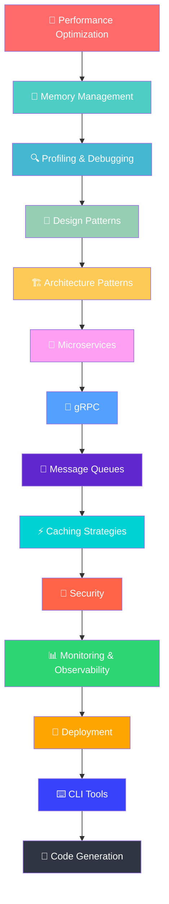

# 🌳 Nivel 3: Avanzado
## *Arquitectura y Sistemas Distribuidos*

> *"La optimización sin medición es la raíz de todo mal en programación"* - Donald Knuth

Bienvenido al nivel que separa a los desarrolladores buenos de los **excepcionales**. Aquí aprenderás a:

- 🚀 Optimizar código hasta el último microsegundo
- 🧠 Gestionar memoria como un experto del kernel
- 🔍 Debuggear y perfilar aplicaciones complejas
- 🎨 Implementar patrones de diseño elegantes
- 🏗️ Arquitectar sistemas que escalan a millones de usuarios
- 🔧 Construir microservicios robustos
- 📡 Dominar gRPC y comunicación distribuida
- 📮 Implementar message queues y event sourcing
- ⚡ Diseñar estrategias de caching inteligentes
- 🔐 Asegurar aplicaciones de nivel enterprise

## 🎯 ¿Para Quién es Este Nivel?

- ✅ Has completado Fundamentos e Intermedio
- ✅ Tienes 6+ meses de experiencia con Go
- ✅ Quieres skills de **Senior/Lead Developer**
- ✅ Buscas optimizar performance crítica
- ✅ Necesitas diseñar sistemas distribuidos
- ✅ Aspiras a roles de **Staff Engineer+**

## 🛣️ Roadmap del Nivel Avanzado



## 📚 Lecciones Disponibles

### 🚀 **[01. Performance Optimization](./01-performance-optimization/)**
*El arte de hacer que Go vuele*
- Benchmarking avanzado
- Profiling con pprof
- Optimizaciones de compilador
- Memory pooling
- Cache-friendly algorithms

### 🧠 **[02. Memory Management](./02-memory-management/)**
*Dominando el garbage collector*
- Heap vs Stack allocation
- Escape analysis
- GC tuning avanzado
- Memory leaks detection
- Custom allocators

### 🔍 **[03. Profiling & Debugging](./03-profiling-debugging/)**
*Herramientas de diagnóstico profesional*
- CPU profiling avanzado
- Memory profiling
- Trace analysis
- Delve debugging mastery
- Production debugging

### 🎨 **[04. Design Patterns](./04-design-patterns/)**
*Patrones elegantes en Go*
- Creational patterns
- Structural patterns
- Behavioral patterns
- Concurrency patterns
- Go-specific patterns

### 🏗️ **[05. Architecture Patterns](./05-architecture-patterns/)**
*Diseñando sistemas escalables*
- Clean Architecture
- Hexagonal Architecture
- CQRS
- Event Sourcing
- Domain-Driven Design

### 🔧 **[06. Microservices](./06-microservices/)**
*Sistemas distribuidos modernos*
- Service decomposition
- API Gateway patterns
- Service mesh
- Circuit breakers
- Distributed tracing

### 📡 **[07. gRPC](./07-grpc/)**
*Comunicación de alta performance*
- Protocol Buffers mastery
- Streaming patterns
- Load balancing
- Authentication
- Error handling

### 📮 **[08. Message Queues](./08-message-queues/)**
*Comunicación asíncrona robusta*
- Queue patterns
- Publisher/Subscriber
- Dead letter queues
- Message ordering
- Exactly-once delivery

### ⚡ **[09. Caching Strategies](./09-caching-strategies/)**
*Performance through intelligent caching*
- Cache patterns
- Distributed caching
- Cache invalidation
- Cache warming
- Performance metrics

### 🔐 **[10. Security](./10-security/)**
*Protegiendo aplicaciones críticas*
- Authentication patterns
- Authorization models
- Cryptography in Go
- Secure coding practices
- Vulnerability assessment

### 📊 **[11. Monitoring & Observability](./11-monitoring-observability/)**
*Visibilidad total del sistema*
- Metrics collection
- Distributed tracing
- Log aggregation
- Alerting strategies
- SLI/SLO implementation

### 🚀 **[12. Deployment](./12-deployment/)**
*Del código a producción*
- Container optimization
- Kubernetes deployment
- Blue-green deployments
- Canary releases
- Infrastructure as Code

### ⌨️ **[13. CLI Tools](./13-cli-tools/)**
*Herramientas de línea de comandos profesionales*
- Advanced CLI patterns
- Plugin architectures
- Configuration management
- Testing CLI tools
- Distribution strategies

### 🔄 **[14. Code Generation](./14-code-generation/)**
*Automatizando el desarrollo*
- Template systems
- AST manipulation
- Source code generation
- Build tool integration
- Metaprogramming patterns

## 🎯 Objetivos del Nivel

Al completar este nivel serás capaz de:

- ⚡ **Optimizar** aplicaciones para maximum performance
- 🏗️ **Diseñar** arquitecturas que escalan horizontalmente  
- 🔍 **Debuggear** problemas complejos en producción
- 🛡️ **Implementar** seguridad de nivel enterprise
- 📊 **Monitorear** sistemas distribuidos efectivamente
- 🚀 **Desplegar** aplicaciones con zero-downtime
- 🔧 **Construir** herramientas que otros developers amen usar

## 🏆 Proyectos Finales

- **🎯 High-Performance API**: API que maneja 100k+ RPS
- **🏗️ Microservices Platform**: Sistema distribuido completo
- **📊 Monitoring System**: Observabilidad end-to-end
- **🔧 Developer Tool**: CLI tool para la comunidad

## 🚀 ¿Listo para el Siguiente Nivel?

```bash
# 🎯 Comienza tu journey al siguiente nivel
cd 01-performance-optimization
cat README.md

# 🔥 ¡El poder está en tus manos!
echo "🌳 Welcome to Advanced Go Development!"
```

---

**[⬅️ Volver a Intermedio](../02-intermedio/) | [🏠 Inicio](../README.md) | [➡️ Ir a Expert+](../04-expert-plus/)**
