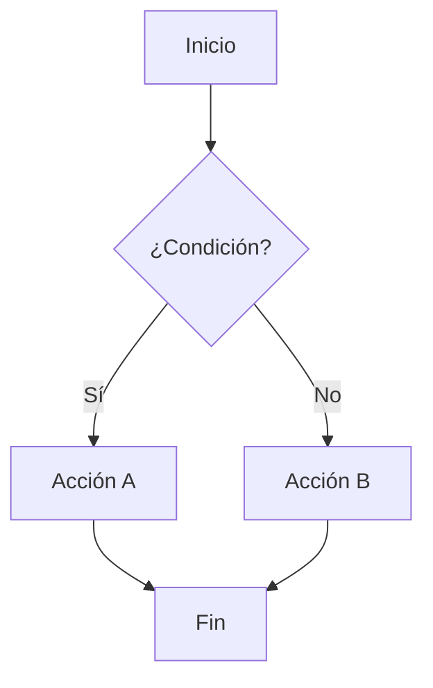
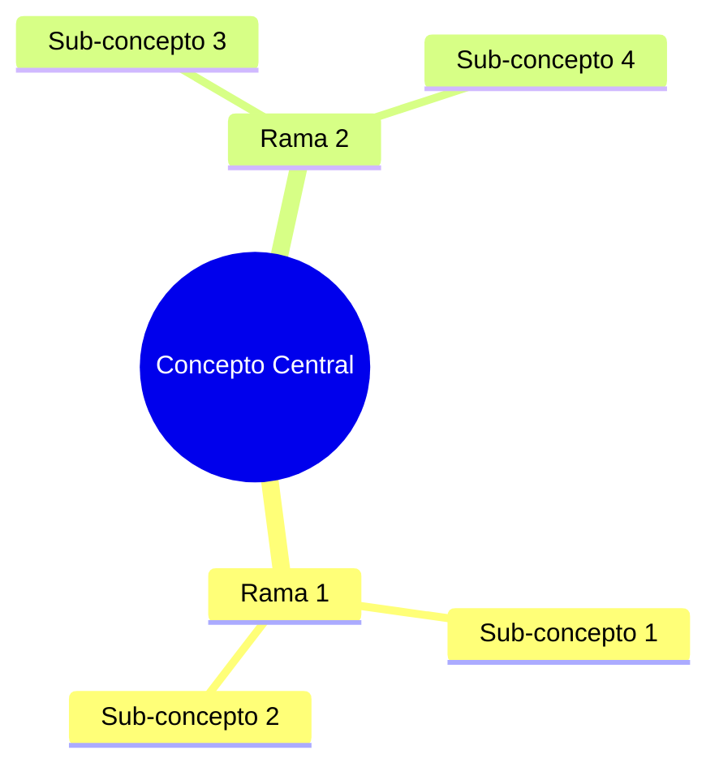

# 🤝 Contribuir a Go Deep

¡Gracias por tu interés en contribuir a Go Deep! Este proyecto está diseñado para ser la mejor resource de aprendizaje de Go en español, y tu contribución puede ayudar a miles de desarrolladores.

## 🎯 Tipos de Contribuciones

### 📝 Contenido
- **Nuevas lecciones** siguiendo la estructura establecida
- **Ejemplos adicionales** para conceptos complejos
- **Ejercicios prácticos** con diferentes niveles de dificultad
- **Casos de estudio** reales de la industria
- **Diagramas y visualizaciones** mejoradas

### 🐛 Correcciones
- **Errores de sintaxis** en código de ejemplo
- **Typos** en documentación
- **Links rotos** o recursos desactualizados
- **Mejoras de rendimiento** en ejemplos

### 🌍 Traducciones
- **Traducción a otros idiomas** (manteniendo español como principal)
- **Terminología técnica** apropiada por región

### 🛠️ Herramientas
- **Scripts de automatización** para el curso
- **Herramientas de validación** de código
- **Integraciones** con IDEs
- **CI/CD improvements**

## 📋 Proceso de Contribución

### 1. 🍴 Fork del Repositorio
```bash
git clone https://github.com/tu-usuario/go-deep.git
cd go-deep
git remote add upstream https://github.com/sazardev/go-deep.git
```

### 2. 🌿 Crear Branch
```bash
git checkout -b feature/nueva-leccion-channels
# o
git checkout -b fix/typo-en-sintaxis-basica
# o  
git checkout -b docs/mejora-readme-fundamentos
```

### 3. 📝 Realizar Cambios
- Sigue la [Guía de Estilo](#guía-de-estilo)
- Agrega tests si es aplicable
- Actualiza documentación relacionada

### 4. ✅ Validar Cambios
```bash
# Ejecutar tests
go test ./...

# Verificar formato
gofmt -w .

# Validar links
./scripts/check-links.sh

# Spell check (si está disponible)
./scripts/spell-check.sh
```

### 5. 📤 Submit Pull Request
- Título descriptivo y claro
- Descripción detallada de los cambios
- Referencias a issues relacionados
- Screenshots si hay cambios visuales

## 📖 Guía de Estilo

### 📝 Documentación Markdown

#### Estructura de Lecciones
```markdown
# 🎯 Título: Descripción Concisa

> *Quote inspiracional relacionado*

Introducción enganchante con analogía.

## 🎯 Objetivos de Esta Lección
- ✅ Objetivo específico y medible
- ✅ Otro objetivo claro
- ✅ Resultado concreto

## 📋 Sección Principal
### 🧠 Analogía
### 💻 Código de Ejemplo  
### ⚠️ Errores Comunes
### 💡 Tips de Experto
### 🧪 Laboratorio

## 🎉 ¡Felicitaciones!
### 🔥 Lo que has aprendido
### 🚀 Próximo Nivel
```

#### Emojis Estandarizados
- 🎯 Objetivos, puntos clave
- 📝 Código, documentación
- 🧠 Analogías, conceptos
- ⚠️ Advertencias, cuidados
- 💡 Tips, mejores prácticas
- 🔧 Herramientas, configuración
- 🚀 Avanzado, siguiente nivel
- ✅ Checkmarks, completado
- ❌ Errores, problemas
- 📊 Estadísticas, comparaciones
- 🧪 Laboratorios, experimentos

### 💻 Código Go

#### Formato y Estilo
```go
// ✅ Comentarios descriptivos en español
// calculateTax calcula el impuesto basado en el ingreso y la tasa.
func calculateTax(income, rate float64) float64 {
    return income * rate
}

// ✅ Ejemplos completos y ejecutables
package main

import "fmt"

func main() {
    tax := calculateTax(50000, 0.25)
    fmt.Printf("Tax: $%.2f\n", tax)
}
```

#### Convenciones de Nombres
- **Variables**: camelCase en inglés (`userID`, `totalAmount`)
- **Funciones**: camelCase en inglés (`calculateTotal`, `validateEmail`)
- **Comentarios**: español claro y descriptivo
- **Prints/Outputs**: español para mensajes de usuario

### 🎨 Diagramas Mermaid

#### Flowcharts


#### Mindmaps


## 🎯 Estándares de Calidad

### 📚 Contenido Educativo
- **Progresión lógica** de conceptos
- **Analogías claras** para conceptos complejos
- **Ejemplos prácticos** y relevantes
- **Múltiples enfoques** de aprendizaje
- **Conexión con casos reales**

### 💻 Código
- **Ejecutable** y probado
- **Bien comentado** en español
- **Idiomático** siguiendo Go best practices
- **Progresivo** en complejidad
- **Error handling** apropiado

### 📝 Documentación
- **Sin errores ortográficos**
- **Terminología consistente**
- **Enlaces funcionando**
- **Estructura clara**
- **Navegación intuitiva**

## 🏷️ Issue Labels

### Tipos
- `content` - Relacionado con contenido educativo
- `bug` - Errores en código o documentación
- `enhancement` - Mejoras y nuevas características
- `documentation` - Mejoras en documentación
- `good first issue` - Perfecto para nuevos contribuidores
- `help wanted` - Se necesita ayuda de la comunidad

### Prioridad
- `priority-high` - Crítico, necesita atención inmediata
- `priority-medium` - Importante, próxima semana
- `priority-low` - Sería bueno tener

### Nivel
- `level-fundamentos` - Nivel básico
- `level-intermedio` - Nivel intermedio
- `level-avanzado` - Nivel avanzado
- `level-expert` - Nivel expert+

## 🎓 Proceso de Review

### ✅ Checklist para Reviews
- [ ] Código ejecuta sin errores
- [ ] Documentación clara y sin typos
- [ ] Sigue la guía de estilo
- [ ] Ejemplos son pedagogicamente efectivos
- [ ] Enlaces funcionan correctamente
- [ ] Diagramas son claros y útiles
- [ ] Progresión lógica mantenida

### 🔄 Feedback Guidelines
- **Constructivo** y específico
- **Educativo** cuando sea posible
- **Reconoce** lo bueno antes de señalar mejoras
- **Sugiere alternativas** en lugar de solo criticar
- **Mantén el tono profesional** y amigable

## 🌟 Reconocimientos

### 🏆 Contribuidores Destacados
Los contribuidores serán reconocidos en:
- README principal del proyecto
- Página de contributors
- Release notes cuando sea relevante
- Social media del proyecto

### 📊 Métricas de Contribución
- **Commits** a lecciones principales
- **Issues** resueltos
- **PRs** merged
- **Reviews** de calidad realizados
- **Community** engagement

## 📞 Comunicación

### 💬 Canales
- **GitHub Issues** - Bugs, features, discusiones técnicas
- **Discord** - Chat casual, preguntas rápidas
- **Email** - Contacto directo con maintainers
- **Twitter** - Actualizaciones y community highlights

### ❓ Preguntas Frecuentes

**P: ¿Puedo contribuir si soy principiante en Go?**
R: ¡Absolutamente! Los principiantes aportan perspectiva valiosa sobre qué es confuso. Busca issues con `good first issue`.

**P: ¿Cómo propongo una nueva lección?**
R: Abre un issue con el template "Nueva Lección" describiendo el contenido propuesto y cómo encaja en el curriculum.

**P: ¿Puedo traducir a otro idioma?**
R: Sí, pero recomendamos esperar a que el contenido en español esté más maduro para evitar trabajo duplicado.

**P: ¿Hay alguna compensación?**
R: Este es un proyecto open source sin compensación monetaria, pero ofrecemos reconocimiento y networking con la comunidad Go.

## 📜 Código de Conducta

### 🤝 Nuestros Valores
- **Respeto** hacia todos los participantes
- **Inclusión** de diferentes backgrounds y niveles
- **Colaboración** sobre competencia
- **Aprendizaje** continuo y compartido
- **Calidad** en todo lo que producimos

### 🚫 Comportamientos Inaceptables
- Comentarios discriminatorios o despectivos
- Harassment de cualquier tipo
- Spam o autopromoción excesiva
- Compartir información personal sin consentimiento
- Cualquier conducta que haría el espacio menos acogedor

### 📢 Reporte de Problemas
Si experimentas o presencias comportamiento inapropiado:
1. **Email directo**: conduct@go-deep.dev
2. **Issue privado** en GitHub
3. **Mensaje directo** a maintainers en Discord

Todas las quejas serán investigadas promptamente y confidencialmente.

---

## 🚀 ¡Comienza a Contribuir!

1. **Lee** esta guía completamente
2. **Explora** issues etiquetados con `good first issue`
3. **Únete** a nuestro Discord para presentarte
4. **Haz** tu primera contribución
5. **Ayuda** a otros nuevos contribuidores

¡Tu contribución, sin importar qué tan pequeña, hace este curso mejor para todos! 

**¡Gracias por hacer Go Deep increíble! 🎉**
