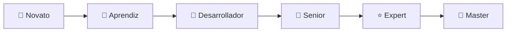

# 📚 Estructura Completa del Curso Go Deep

## 🎓 Niveles de Aprendizaje

### 🌱 **Nivel 1: Fundamentos (Junior)**
- Tiempo estimado: 4-6 semanas
- Prerequisitos: Conocimientos básicos de programación

#### Módulos:
1. Introducción a Go y Filosofía
2. Instalación y Setup
3. Sintaxis Básica
4. Tipos de Datos
5. Variables y Constantes
6. Operadores
7. Control de Flujo (if, switch, for, range)
8. Funciones
9. Arrays y Slices
10. Maps
11. Structs
12. Métodos
13. Interfaces Básicas
14. Paquetes y Modularidad
15. Manejo de Errores
16. Ejercicios y Proyecto Final

### 🌿 **Nivel 2: Intermedio (Mid-Level)**
- Tiempo estimado: 6-8 semanas
- Prerequisitos: Completar Nivel 1

#### Módulos:
1. Interfaces Avanzadas
2. Composition y Embedding
3. Goroutine, s y Concurrencia
4. Channels
5. Select Statement
6. Mutex y Sync
7. Context
8. Testing
9. Benchmarking
10. Reflection
11. JSON Marshaling/Unmarshaling
12. HTTP Client/Server
13. Database SQL
14. Middleware
15. Dependency Injection
16. Proyecto Intermedio

### 🌳 **Nivel 3: Avanzado (Senior)**
- Tiempo estimado: 8-12 semanas
- Prerequisitos: Completar Nivel 2

#### Módulos:
1. Performance Optimization
2. Memory Management
3. Profiling y Debugging
4. Design Patterns
5. Architecture Patterns
6. Microservices
7. gRPC
8. Message Queues
9. Caching Strategies
10. Security
11. Monitoring y Observability
12. Deployment
13. CLI Tools
14. Code Generation
15. Proyecto Senior

### 🚀 **Nivel 4: Expert+ (Staff/Principal)**
- Tiempo estimado: 12+ semanas
- Prerequisitos: Completar Nivel 3

#### Módulos:
1. Compiler Internals
2. Garbage Collector
3. Assembly Optimization
4. Distributed Systems
5. Consensus Algorithms
6. Load Balancing
7. Circuit Breakers
8. Event Sourcing
9. CQRS
10. Kubernetes Operators
11. Custom Runtime
12. Contributing to Go
13. Technical Leadership
14. Proyecto Expert+

---

## 📁 Estructura de Directorios

```text
go-deep/
├── README.md
├── ESTRUCTURA_COMPLETA.md
├── CONTRIBUTING.md
├── CODE_OF_CONDUCT.md
├── go.mod
├── go.sum
│
├── 📚 docs/
│   ├── GLOSARIO.md
│   ├── RESOURCES.md
│   └── FAQ.md
│
├── 🌱 01-fundamentos/
│   ├── README.md
│   ├── 01-introduccion/
│   ├── 02-instalacion-setup/
│   ├── 03-sintaxis-basica/
│   ├── 04-tipos-datos/
│   ├── 05-variables-constantes/
│   ├── 06-operadores/
│   ├── 07-control-flujo/
│   ├── 08-funciones/
│   ├── 09-arrays-slices/
│   ├── 10-maps/
│   ├── 11-structs/
│   ├── 12-metodos/
│   ├── 13-interfaces-basicas/
│   ├── 14-paquetes/
│   ├── 15-manejo-errores/
│   └── ejercicios/
│
├── 🌿 02-intermedio/
│   ├── README.md
│   ├── 01-interfaces-avanzadas/
│   ├── 02-composition/
│   ├── 03-goroutines/
│   ├── 04-channels/
│   ├── 05-select-statement/
│   ├── 06-mutex-sync/
│   ├── 07-context/
│   ├── 08-testing/
│   ├── 09-benchmarking/
│   ├── 10-reflection/
│   ├── 11-json-marshaling/
│   ├── 12-http-client-server/
│   ├── 13-database-sql/
│   ├── 14-middleware/
│   ├── 15-dependency-injection/
│   └── proyectos/
│
├── 🌳 03-avanzado/
│   ├── README.md
│   ├── 01-performance-optimization/
│   ├── 02-memory-management/
│   ├── 03-profiling-debugging/
│   ├── 04-design-patterns/
│   ├── 05-architecture-patterns/
│   ├── 06-microservices/
│   ├── 07-grpc/
│   ├── 08-message-queues/
│   ├── 09-caching-strategies/
│   ├── 10-security/
│   ├── 11-monitoring-observability/
│   ├── 12-deployment/
│   ├── 13-cli-tools/
│   ├── 14-code-generation/
│   └── aplicaciones/
│
├── 🚀 04-expert-plus/
│   ├── README.md
│   ├── 01-compiler-internals/
│   ├── 02-garbage-collector/
│   ├── 03-assembly-optimization/
│   ├── 04-distributed-systems/
│   ├── 05-consensus-algorithms/
│   ├── 06-load-balancing/
│   ├── 07-circuit-breakers/
│   ├── 08-event-sourcing/
│   ├── 09-cqrs/
│   ├── 10-kubernetes-operators/
│   ├── 11-custom-runtime/
│   ├── 12-contributing-go/
│   ├── 13-technical-leadership/
│   └── sistemas-complejos/
│
├── 🛠️ herramientas/
│   ├── scripts/
│   ├── docker/
│   ├── kubernetes/
│   ├── ci-cd/
│   └── monitoring/
│
├── 🎯 proyectos-reales/
│   ├── 01-cli-tool/
│   ├── 02-web-api/
│   ├── 03-microservice/
│   ├── 04-chat-system/
│   ├── 05-file-storage/
│   ├── 06-monitoring-system/
│   ├── 07-load-balancer/
│   ├── 08-database-engine/
│   ├── 09-compiler/
│   └── 10-distributed-cache/
│
├── 📊 casos-estudio/
│   ├── google/
│   ├── uber/
│   ├── netflix/
│   ├── docker/
│   ├── kubernetes/
│   └── prometheus/
│
├── 🧪 laboratorios/
│   ├── performance/
│   ├── concurrency/
│   ├── networking/
│   ├── security/
│   └── debugging/
│
├── 📝 ejercicios/
│   ├── principiante/
│   ├── intermedio/
│   ├── avanzado/
│   └── expert/
│
├── 🎓 certificaciones/
│   ├── evaluaciones/
│   ├── proyectos-finales/
│   └── badges/
│
└── 📚 recursos/
    ├── libros/
    ├── videos/
    ├── podcasts/
    ├── conferencias/
    └── articulos/
```

## 🎯 Metodología de Enseñanza

### 📖 Cada Lección Incluye:

1. **🎯 Objetivos claros** - Qué aprenderás
2. **🧠 Analogías únicas** - Conceptos complejos explicados simple
3. **📝 Teoría detallada** - Fundamentos sólidos
4. **💻 Ejemplos prácticos** - Código funcional
5. **⚠️ Errores comunes** - Qué evitar
6. **💡 Tips de experto** - Trucos del trade
7. **🔧 Ejercicios** - Práctica dirigida
8. **🎲 Proyectos** - Aplicación real
9. **📊 Evaluación** - Mide tu progreso
10. **🔗 Recursos extra** - Para profundizar

### 🎨 Formato Visual

- **📋 Diagramas Mermaid** para arquitectura
- **🎯 Flowcharts** para algoritmos
- **📊 Gráficos** de performance
- **🗺️ Mapas mentales** de conceptos
- **📸 Screenshots** de herramientas
- **🎥 GIFs** de demos

### 🏆 Sistema de Badges



## 🎓 Certificaciones

### 📜 Certificados Disponibles:

1. **Go Fundamentals Certified** - Nivel 1
2. **Go Intermediate Developer** - Nivel 2
3. **Go Senior Engineer** - Nivel 3
4. **Go Expert Architect** - Nivel 4
5. **Go Master Contributor** - Contribuciones significativas

### 📊 Criterios de Evaluación:

- **✅ Tests automáticos** - 80%+ en evaluaciones
- **🎯 Proyectos prácticos** - Implementación correcta
- **📝 Code reviews** - Calidad y best practices
- **🗣️ Explicación conceptual** - Entendimiento profundo
- **🔧 Resolución de problemas** - Debugging skills

---

## 🌟 Características Únicas

### 🧠 Pedagogía Avanzada
- **Aprendizaje incremental** con builds sobre conceptos previos
- **Repetición espaciada** para retención a largo plazo
- **Gamificación** con sistema de puntos y achievements
- **Peer review** entre estudiantes
- **Mentorship** con expertos de la industria

### 💻 Tecnología de Vanguardia
- **Go 1.24.5** con todas las features más recientes
- **Live coding** en el browser
- **Automated testing** para todos los ejercicios
- **CI/CD pipelines** para proyectos
- **Container environments** para consistencia

### 🌍 Comunidad Global
- **Discord server** para colaboración
- **Weekly challenges** competitivos
- **Open source contributions** a proyectos reales
- **Tech talks** mensuales
- **Career guidance** personalizado

---

*¿Listo para el viaje más épico de tu carrera en Go? 🚀*
