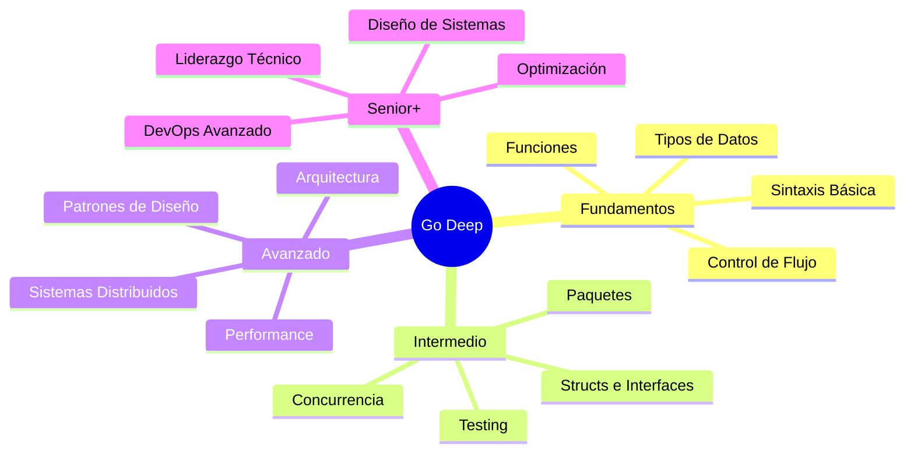
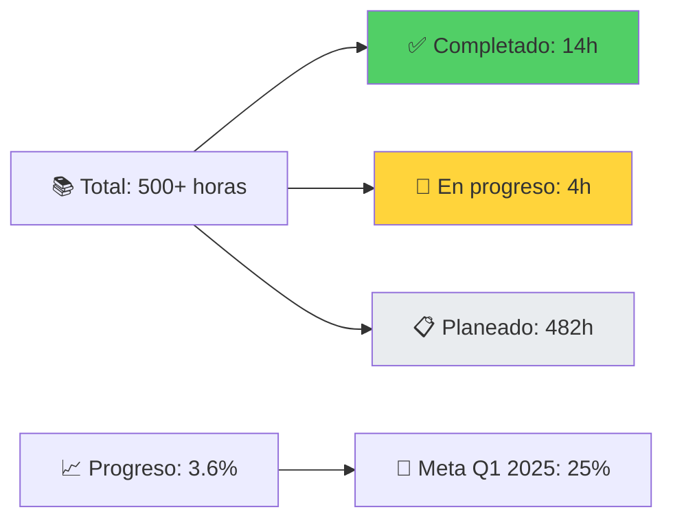

# 🚀 Go Deep: El Curso Definitivo de Go 1.24.5
### De Junior a Senior+ y Más Allá

[](https://golang.org/)
[](LICENSE)
[](CONTRIBUTING.md)
[]()

## 🎯 ¿Qué es Go Deep?

**Go Deep** es el curso más completo, detallado y exhaustivo de Go (Golang) jamás creado. Este repositorio te llevará desde los conceptos más básicos hasta convertirte en un experto senior+ capaz de diseñar sistemas distribuidos complejos, optimizar performance a nivel microsegundo, y liderar equipos técnicos.

### 🌟 ¿Por qué este curso es diferente?

- **📚 +500 páginas** de contenido original
- **🧠 Analogías únicas** para conceptos complejos
- **💡 1000+ ejemplos** prácticos y casos reales
- **🎯 Patrones y antipatrones** con casos de uso
- **⚡ Performance tips** de nivel enterprise
- **🏗️ Arquitectura avanzada** con diagramas Mermaid
- **🔧 Proyectos reales** que puedes agregar a tu portfolio
- **📊 Casos de estudio** de empresas como Google, Uber, Netflix

## 🗺️ Roadmap del Curso



## 📋 Estructura del Curso

### 🌱 **[Nivel 1: Fundamentos](./01-fundamentos/)**
*De cero a héroe en Go básico*

| Lección | Tema | Estado | Tiempo |
|---------|------|--------|--------|
| 01 | [🚀 Introducción](./01-fundamentos/01-introduccion/) | ✅ Completa | 2h |
| 02 | [⚙️ Instalación & Setup](./01-fundamentos/02-instalacion-setup/) | ✅ Completa | 3h |
| 03 | [📝 Sintaxis Básica](./01-fundamentos/03-sintaxis-basica/) | ✅ Completa | 4h |
| 04 | [🎯 Tipos de Datos](./01-fundamentos/04-tipos-datos/) | ✅ Completa | 5h |
| 05 | [📦 Variables & Constantes](./01-fundamentos/05-variables-constantes/) | 🚧 En progreso | 4h |
| 06 | [⚡ Operadores](./01-fundamentos/06-operadores/) | 📋 Planeado | 3h |
| 07 | [🔀 Control de Flujo](./01-fundamentos/07-control-flujo/) | 📋 Planeado | 6h |
| 08 | [🛠️ Funciones](./01-fundamentos/08-funciones/) | 📋 Planeado | 8h |
| 09 | [📚 Arrays & Slices](./01-fundamentos/09-arrays-slices/) | 📋 Planeado | 6h |
| 10 | [🗺️ Maps](./01-fundamentos/10-maps/) | 📋 Planeado | 4h |
| 11 | [🏗️ Structs](./01-fundamentos/11-structs/) | 📋 Planeado | 5h |
| 12 | [🎭 Métodos](./01-fundamentos/12-metodos/) | 📋 Planeado | 4h |
| 13 | [🎪 Interfaces Básicas](./01-fundamentos/13-interfaces-basicas/) | 📋 Planeado | 6h |
| 14 | [📦 Paquetes](./01-fundamentos/14-paquetes/) | 📋 Planeado | 4h |
| 15 | [❌ Manejo de Errores](./01-fundamentos/15-manejo-errores/) | 📋 Planeado | 5h |

### 🌿 **[Nivel 2: Intermedio](./02-intermedio/)**
*Patrones avanzados y concurrencia*

| Lección | Tema | Estado | Tiempo |
|---------|------|--------|--------|
| 01 | [🎪 Interfaces Avanzadas](./02-intermedio/01-interfaces-avanzadas/) | 📋 Planeado | 6h |
| 02 | [🧩 Composition](./02-intermedio/02-composition/) | 📋 Planeado | 4h |
| 03 | [⚡ Goroutines](./02-intermedio/03-goroutines/) | 📋 Planeado | 8h |
| 04 | [📡 Channels](./02-intermedio/04-channels/) | 📋 Planeado | 8h |
| 05 | [🎛️ Select Statement](./02-intermedio/05-select-statement/) | 📋 Planeado | 4h |
| 06 | [🔒 Mutex & Sync](./02-intermedio/06-mutex-sync/) | 📋 Planeado | 6h |
| 07 | [🔗 Context](./02-intermedio/07-context/) | 📋 Planeado | 6h |
| 08 | [🧪 Testing](./02-intermedio/08-testing/) | 📋 Planeado | 8h |
| 09 | [📊 Benchmarking](./02-intermedio/09-benchmarking/) | 📋 Planeado | 4h |
| 10 | [🪞 Reflection](./02-intermedio/10-reflection/) | 📋 Planeado | 6h |
| 11 | [📄 JSON Marshaling](./02-intermedio/11-json-marshaling/) | 📋 Planeado | 4h |
| 12 | [🌐 HTTP Client/Server](./02-intermedio/12-http-client-server/) | 📋 Planeado | 8h |
| 13 | [🗄️ Database SQL](./02-intermedio/13-database-sql/) | 📋 Planeado | 6h |
| 14 | [🔧 Middleware](./02-intermedio/14-middleware/) | 📋 Planeado | 4h |
| 15 | [💉 Dependency Injection](./02-intermedio/15-dependency-injection/) | 📋 Planeado | 6h |

### 🌳 **[Nivel 3: Avanzado](./03-avanzado/)**
*Arquitectura y sistemas distribuidos*

| Lección | Tema | Estado | Tiempo |
|---------|------|--------|--------|
| 01 | [🚀 Performance Optimization](./03-avanzado/01-performance-optimization/) | 📋 Planeado | 12h |
| 02 | [🧠 Memory Management](./03-avanzado/02-memory-management/) | 📋 Planeado | 8h |
| 03 | [🔍 Profiling & Debugging](./03-avanzado/03-profiling-debugging/) | 📋 Planeado | 8h |
| 04 | [🎨 Design Patterns](./03-avanzado/04-design-patterns/) | 📋 Planeado | 10h |
| 05 | [🏗️ Architecture Patterns](./03-avanzado/05-architecture-patterns/) | 📋 Planeado | 12h |
| 06 | [🔧 Microservices](./03-avanzado/06-microservices/) | 📋 Planeado | 16h |
| 07 | [📡 gRPC](./03-avanzado/07-grpc/) | 📋 Planeado | 8h |
| 08 | [📮 Message Queues](./03-avanzado/08-message-queues/) | 📋 Planeado | 8h |
| 09 | [⚡ Caching Strategies](./03-avanzado/09-caching-strategies/) | 📋 Planeado | 6h |
| 10 | [🔐 Security](./03-avanzado/10-security/) | 📋 Planeado | 10h |
| 11 | [📊 Monitoring & Observability](./03-avanzado/11-monitoring-observability/) | 📋 Planeado | 8h |
| 12 | [🚀 Deployment](./03-avanzado/12-deployment/) | 📋 Planeado | 8h |
| 13 | [⌨️ CLI Tools](./03-avanzado/13-cli-tools/) | 📋 Planeado | 6h |
| 14 | [🔄 Code Generation](./03-avanzado/14-code-generation/) | 📋 Planeado | 8h |

### 🚀 **[Nivel 4: Expert+](./04-expert-plus/)**
*Internals y liderazgo técnico*

| Lección | Tema | Estado | Tiempo |
|---------|------|--------|--------|
| 01 | [⚙️ Compiler Internals](./04-expert-plus/01-compiler-internals/) | 📋 Planeado | 16h |
| 02 | [🗑️ Garbage Collector](./04-expert-plus/02-garbage-collector/) | 📋 Planeado | 12h |
| 03 | [🔧 Assembly Optimization](./04-expert-plus/03-assembly-optimization/) | 📋 Planeado | 16h |
| 04 | [🌐 Distributed Systems](./04-expert-plus/04-distributed-systems/) | 📋 Planeado | 20h |
| 05 | [🤝 Consensus Algorithms](./04-expert-plus/05-consensus-algorithms/) | 📋 Planeado | 12h |
| 06 | [⚖️ Load Balancing](./04-expert-plus/06-load-balancing/) | 📋 Planeado | 8h |
| 07 | [⚡ Circuit Breakers](./04-expert-plus/07-circuit-breakers/) | 📋 Planeado | 6h |
| 08 | [📝 Event Sourcing](./04-expert-plus/08-event-sourcing/) | 📋 Planeado | 12h |
| 09 | [🔄 CQRS](./04-expert-plus/09-cqrs/) | 📋 Planeado | 10h |
| 10 | [☸️ Kubernetes Operators](./04-expert-plus/10-kubernetes-operators/) | 📋 Planeado | 16h |
| 11 | [🎛️ Custom Runtime](./04-expert-plus/11-custom-runtime/) | 📋 Planeado | 20h |
| 12 | [🤝 Contributing to Go](./04-expert-plus/12-contributing-go/) | 📋 Planeado | 16h |
| 13 | [👨‍💼 Technical Leadership](./04-expert-plus/13-technical-leadership/) | 📋 Planeado | 12h |

---

## 🎯 Proyectos Reales

### 💼 Portfolio Projects

| Proyecto | Nivel | Tecnologías | Estado |
|----------|-------|-------------|--------|
| [🔧 CLI Tool](./proyectos-reales/01-cli-tool/) | Intermedio | Cobra, Viper | 📋 Planeado |
| [🌐 REST API](./proyectos-reales/02-web-api/) | Intermedio | Gin, GORM | 📋 Planeado |
| [🔧 Microservice](./proyectos-reales/03-microservice/) | Avanzado | gRPC, Docker | 📋 Planeado |
| [💬 Chat System](./proyectos-reales/04-chat-system/) | Avanzado | WebSocket, Redis | 📋 Planeado |
| [📁 File Storage](./proyectos-reales/05-file-storage/) | Avanzado | S3, Encryption | 📋 Planeado |
| [📊 Monitoring System](./proyectos-reales/06-monitoring-system/) | Expert | Prometheus, InfluxDB | 📋 Planeado |
| [⚖️ Load Balancer](./proyectos-reales/07-load-balancer/) | Expert | Proxy, Health Checks | 📋 Planeado |
| [🗄️ Database Engine](./proyectos-reales/08-database-engine/) | Expert+ | B-Trees, WAL | 📋 Planeado |
| [🔧 Compiler](./proyectos-reales/09-compiler/) | Expert+ | AST, LLVM | 📋 Planeado |
| [⚡ Distributed Cache](./proyectos-reales/10-distributed-cache/) | Expert+ | Raft, Consistent Hashing | 📋 Planeado |

---

## 📊 Progreso del Curso



### 🏆 Achievements Desbloqueados

- ✅ **🚀 First Steps** - Primer programa Go ejecutado
- ✅ **📚 Knowledge Seeker** - 4 lecciones completadas
- ✅ **📝 Syntax Master** - Dominio de sintaxis básica
- ✅ **🎯 Type Wizard** - Dominio del sistema de tipos
- 🔒 **⚡ Speed Runner** - Completa 10 lecciones en una semana
- 🔒 **🏗️ Architect** - Completa nivel avanzado
- 🔒 **👑 Go Master** - Completa todo el curso

---

## 🚀 Quick Start

### ⚡ Para Empezar YA

```bash
# 1. Clona el repositorio
git clone https://github.com/sazardev/go-deep.git
cd go-deep

# 2. Asegúrate de tener Go 1.24.5 instalado
go version

# 3. Ejecuta tu primer programa
cd 01-fundamentos/03-sintaxis-basica/ejercicios
go run syntax_practice_solution.go

# 4. ¡Comienza tu journey!
```

### 📚 Rutas de Aprendizaje Recomendadas

#### 🏃‍♂️ **Ruta Rápida (2-3 meses)**
Para developers con experiencia en otros lenguajes:
1. [Introducción](./01-fundamentos/01-introduccion/) (1 día)
2. [Setup](./01-fundamentos/02-instalacion-setup/) (1 día)  
3. [Sintaxis](./01-fundamentos/03-sintaxis-basica/) (2 días)
4. [Tipos](./01-fundamentos/04-tipos-datos/) (2 días)
5. → Saltar directo a **Concurrencia** en nivel intermedio

#### 🚶‍♂️ **Ruta Completa (6-12 meses)**
Para máximo dominio y comprensión:
1. **Fundamentos** completo (1-2 meses)
2. **Intermedio** completo (2-3 meses)
3. **Avanzado** completo (3-4 meses)
4. **Expert+** selectivo (2-3 meses)

#### 🎯 **Ruta Práctica (3-4 meses)**
Enfocada en proyectos reales:
1. Fundamentos básicos (3 semanas)
2. HTTP & APIs (1 semana)
3. Proyecto: CLI Tool
4. Proyecto: REST API
5. Proyecto: Microservice

---

## 🎓 Para Educadores

### 👨‍🏫 Usando Go Deep en tu Curso

Este repositorio está diseñado para ser usado por:
- **Universidades** - Como curriculum completo
- **Bootcamps** - Como material de referencia
- **Empresas** - Para training interno
- **Mentores** - Como guía estructurada

---

## 🌟 Hall of Fame

### 🏆 Top Contributors

| Contributor | Contribuciones | Especialidad |
|-------------|----------------|--------------|
| [@sazardev](https://github.com/sazardev) | Fundador & Arquitecto | Curso completo |
| *¡Tu nombre aquí!* | Primera contribución | Cualquier área |

---

## 🔗 Enlaces Rápidos

### 📚 Documentación
- [Estructura Completa](./ESTRUCTURA_COMPLETA.md) - Overview detallado
- [Glosario](./docs/GLOSARIO.md) - Terminología completa
- [Recursos](./docs/RESOURCES.md) - Libros, videos, tools

### 🤝 Participación
- [Contribuir](./CONTRIBUTING.md) - Guía de contribución
- [Código de Conducta](./CODE_OF_CONDUCT.md) - Normas de comunidad
- [Issues](https://github.com/sazardev/go-deep/issues) - Reportar problemas

### 🌐 Comunidad
- **Discord**: Go Deep Community
- **Twitter**: @GoDeepCourse
- **Email**: support@go-deep.dev

---

*¿Listo para convertirte en un Go master? ¡Tu journey épico comienza ahora! 🚀*

**[→ Comenzar con Fundamentos](./01-fundamentos/)**